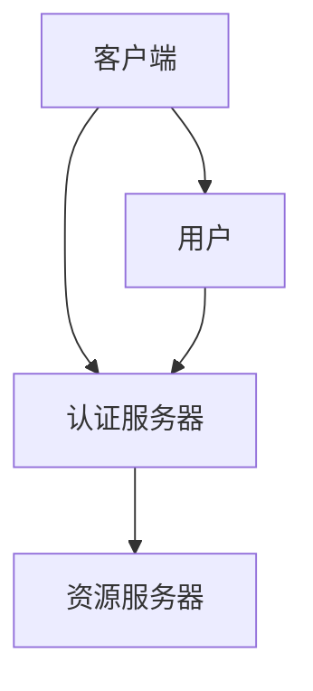

                 

 关键词：OAuth 2.0，单点登录，身份验证，授权，安全，跨域认证，API，开放标准，会话管理。

> 摘要：本文深入探讨了 OAuth 2.0 的单点登录功能。从背景介绍到核心概念与联系，再到核心算法原理和具体操作步骤，数学模型与公式，项目实践，以及实际应用场景，最后讨论了未来发展趋势与挑战。本文旨在为开发者提供全面的技术指导，帮助他们在实现单点登录功能时能够更加得心应手。

## 1. 背景介绍

单点登录（SSO）是一种身份验证和授权的解决方案，允许用户使用单一的用户名和密码登录多个应用程序或系统。在传统的多系统环境中，用户需要记住多个用户名和密码，这不仅增加了用户的工作负担，还存在安全漏洞和用户体验问题。

OAuth 2.0 是一个开放标准，用于授权第三方应用代表用户访问他们存储在另一个服务提供者上的信息。它允许用户在没有透露密码的情况下，将权限委托给第三方应用，从而实现了更安全、更灵活的认证机制。

OAuth 2.0 的单点登录功能利用了 OAuth 2.0 的授权机制，实现了在一个中心认证服务器上进行身份验证，然后多个应用系统能够共享用户认证信息，从而实现单点登录。

## 2. 核心概念与联系

### 2.1 OAuth 2.0 的核心概念

- **客户端（Client）**：请求访问资源的应用程序。
- **资源所有者（Resource Owner）**：拥有授权资源的用户。
- **资源服务器（Resource Server）**：存储用户数据的第三方服务。
- **认证服务器（Authorization Server）**：负责处理认证和授权请求。

### 2.2 OAuth 2.0 的基本流程

1. **注册客户端**：客户端在认证服务器上注册，并获取客户端ID和客户端密钥。
2. **请求授权码**：客户端重定向用户到认证服务器，用户登录并同意授权。
3. **获取访问令牌**：认证服务器返回授权码，客户端使用授权码换取访问令牌。
4. **访问资源**：客户端使用访问令牌从资源服务器获取用户数据。

### 2.3 Mermaid 流程图



## 3. 核心算法原理 & 具体操作步骤

### 3.1 算法原理概述

OAuth 2.0 的单点登录基于授权码流程（Authorization Code Flow），它是一个后端流程，适用于客户端是服务器应用或单页应用程序（SPA）的情况。以下是核心算法原理：

1. **客户端请求授权码**：客户端发送授权请求到认证服务器，包含客户端ID、重定向URI和请求的 scopes。
2. **用户认证与授权**：用户在认证服务器上进行身份验证，并同意授权客户端访问资源。
3. **认证服务器返回授权码**：认证服务器将授权码重定向回客户端。
4. **客户端获取访问令牌**：客户端使用授权码和客户端密钥向认证服务器请求访问令牌。
5. **访问资源**：客户端使用访问令牌从资源服务器获取用户数据。

### 3.2 算法步骤详解

#### 3.2.1 客户端请求授权码

```bash
GET /authorize?
    response_type=code&
    client_id=s6BhdRkqt3
    &redirect_uri=https%3A%2F%2Fclient%2Eexample%2Ecom%2Fcb&
    scope=read&
    state=xyz
    &login
```

#### 3.2.2 用户认证与授权

用户在认证服务器上进行身份验证，并同意授权。

#### 3.2.3 认证服务器返回授权码

认证服务器将授权码（例如：`qBxYfZvLgM`）重定向回客户端。

#### 3.2.4 客户端获取访问令牌

```bash
POST /token
Content-Type: application/x-www-form-urlencoded

grant_type=authorization_code&
code=qBxYfZvLgM&
redirect_uri=https%3A%2F%2Fclient%2Eexample%2Ecom%2Fcb&
client_id=s6BhdRkqt3&
client_secret=7Fjfp0ZBfKjQnA1Jcc1Qu7mj9pXc3K1H5QK2zWt5ayY
```

认证服务器返回访问令牌（例如：`E9n8r7EjKk5GtLsSdF`）和刷新令牌。

#### 3.2.5 访问资源

```bash
GET /resource
Authorization: Bearer E9n8r7EjKk5GtLsSdF
```

资源服务器返回用户数据。

### 3.3 算法优缺点

**优点**：

- **安全性**：OAuth 2.0 使用了令牌（Token）机制，减少了密码泄露的风险。
- **灵活性**：允许资源所有者授权第三方应用访问其资源，而不需要共享密码。
- **通用性**：适用于多种类型的客户端，包括桌面应用、Web应用和移动应用。

**缺点**：

- **复杂性**：实现 OAuth 2.0 需要客户端和服务器双方都遵循一定的协议和流程。
- **依赖第三方**：认证和授权流程依赖于第三方认证服务器。

### 3.4 算法应用领域

OAuth 2.0 的单点登录功能广泛应用于企业内部系统集成、第三方应用程序接入、社交网络登录等领域。

## 4. 数学模型和公式 & 详细讲解 & 举例说明

OAuth 2.0 的单点登录功能主要涉及密码学中的哈希函数、令牌生成和验证等概念。以下是相关数学模型和公式的详细讲解：

### 4.1 数学模型构建

#### 4.1.1 哈希函数

哈希函数是将任意长度的输入（称为“预映射”，pre-image）通过哈希算法变换成固定长度的字符串（称为“哈希值”，hash value）。

\[ H(k) = H_0 + S \]

其中，\( H \) 是哈希函数，\( k \) 是输入，\( H_0 \) 是初始值，\( S \) 是步长。

#### 4.1.2 令牌生成

令牌（Token）是通过加密算法生成的一串数字或字母，用于认证和授权。

\[ Token = Encrypt(Secret, Data) \]

其中，\( Encrypt \) 是加密算法，\( Secret \) 是密钥，\( Data \) 是要加密的数据。

#### 4.1.3 令牌验证

令牌验证是通过比较接收到的令牌和加密后的数据是否一致来判断令牌的有效性。

\[ Verify(Token, Data) = Decrypt(Token) == Data \]

### 4.2 公式推导过程

假设我们使用 SHA-256 哈希函数和 AES 加密算法，我们可以得到以下推导过程：

\[ H(k) = SHA-256(k) \]

\[ Token = AES-Encrypt(Secret, Data) \]

\[ Verify(Token, Data) = AES-Decrypt(Token) == Data \]

### 4.3 案例分析与讲解

假设有一个客户端（Client A）需要访问资源服务器（Resource Server B）上的用户数据，用户（User C）同意授权。

#### 4.3.1 客户端请求授权码

客户端发送以下请求：

```bash
GET /authorize?
    response_type=code&
    client_id=s6BhdRkqt3&
    redirect_uri=https%3A%2F%2Fclient%2Eexample%2Ecom%2Fcb&
    scope=read&
    state=xyz
    &login
```

认证服务器（Authorization Server A）将用户重定向到登录页面。

#### 4.3.2 用户认证与授权

用户在登录页面输入用户名和密码，认证服务器验证用户身份后，将用户重定向回客户端，并带上授权码（例如：`qBxYfZvLgM`）。

#### 4.3.3 客户端获取访问令牌

客户端使用以下请求获取访问令牌：

```bash
POST /token
Content-Type: application/x-www-form-urlencoded

grant_type=authorization_code&
code=qBxYfZvLgM&
redirect_uri=https%3A%2F%2Fclient%2Eexample%2Ecom%2Fcb&
client_id=s6BhdRkqt3&
client_secret=7Fjfp0ZBfKjQnA1Jcc1Qu7mj9pXc3K1H5QK2zWt5ayY
```

认证服务器返回访问令牌（例如：`E9n8r7EjKk5GtLsSdF`）和刷新令牌。

#### 4.3.4 访问资源

客户端使用以下请求访问资源：

```bash
GET /resource
Authorization: Bearer E9n8r7EjKk5GtLsSdF
```

资源服务器返回用户数据。

## 5. 项目实践：代码实例和详细解释说明

在本节中，我们将通过一个简单的项目实例来演示如何实现 OAuth 2.0 的单点登录功能。

### 5.1 开发环境搭建

- **认证服务器（Authorization Server）**：使用 Spring Boot 实现认证服务器。
- **资源服务器（Resource Server）**：使用 Spring Security 实现资源服务器。
- **客户端（Client）**：使用 HTML 和 JavaScript 实现客户端。

### 5.2 源代码详细实现

#### 5.2.1 认证服务器

```java
@SpringBootApplication
public class AuthorizationServerApplication {
    public static void main(String[] args) {
        SpringApplication.run(AuthorizationServerApplication.class, args);
    }
}
```

#### 5.2.2 资源服务器

```java
@Configuration
@EnableWebSecurity
public class ResourceServerConfig extends WebSecurityConfigurerAdapter {
    @Override
    protected void configure(HttpSecurity http) throws Exception {
        http
            .authorizeRequests()
            .antMatchers("/resource/**").authenticated()
            .and()
            .httpBasic();
    }
}
```

#### 5.2.3 客户端

```html
<!DOCTYPE html>
<html>
<head>
    <title>OAuth 2.0 客户端</title>
    <script>
        function requestAuthorization() {
            window.location.href = "https://authorization-server.com/authorize?response_type=code&client_id=s6BhdRkqt3&redirect_uri=http://client.example.com/cb&scope=read&state=xyz&login";
        }

        function requestResource() {
            fetch("https://resource-server.com/resource", {
                headers: {
                    "Authorization": "Bearer " + localStorage.getItem("access_token")
                }
            })
            .then(response => response.json())
            .then(data => console.log(data));
        }
    </script>
</head>
<body>
    <button onclick="requestAuthorization()">请求授权</button>
    <button onclick="requestResource()">请求资源</button>
</body>
</html>
```

### 5.3 代码解读与分析

#### 5.3.1 认证服务器

认证服务器使用了 Spring Boot 和 Spring Security，通过配置授权码流程（Authorization Code Flow）实现 OAuth 2.0 的单点登录功能。

#### 5.3.2 资源服务器

资源服务器使用了 Spring Security，通过配置 HTTP 基本身份验证（HTTP Basic Authentication）实现保护资源。

#### 5.3.3 客户端

客户端使用了 HTML 和 JavaScript，通过调用 `window.location.href` 发送授权请求，并使用 `fetch` 发送资源请求。

### 5.4 运行结果展示

1. **请求授权**：点击“请求授权”按钮，浏览器将跳转到认证服务器，用户登录后同意授权。
2. **请求资源**：点击“请求资源”按钮，客户端使用认证服务器返回的访问令牌（Access Token）访问资源服务器，并显示用户数据。

## 6. 实际应用场景

### 6.1 社交网络登录

OAuth 2.0 的单点登录功能广泛应用于社交网络登录，如 Facebook、Twitter、Google 等。用户只需登录一次，就可以在多个应用程序之间实现单点登录。

### 6.2 企业内部系统集成

OAuth 2.0 的单点登录功能可以帮助企业内部系统集成多个应用程序，如员工门户、客户关系管理系统等。用户只需登录一次，就可以访问所有应用程序。

### 6.3 第三方应用程序接入

OAuth 2.0 的单点登录功能允许第三方应用程序访问企业或用户的数据，如 API 网关、数据分析工具等。

### 6.4 跨域认证

OAuth 2.0 的单点登录功能支持跨域认证，解决了跨域访问限制的问题。

## 7. 工具和资源推荐

### 7.1 学习资源推荐

- [RFC 6749](https://tools.ietf.org/html/rfc6749) - OAuth 2.0 规范
- [Spring Security OAuth 2.0](https://spring.io/guides/gs/oauth2/) - Spring Security OAuth 2.0 教程
- [Okta OAuth 2.0 SDK](https://github.com/okta/okta-oidc-js) - Okta OAuth 2.0 JavaScript SDK

### 7.2 开发工具推荐

- [Postman](https://www.postman.com/) - API 测试工具
- [Visual Studio Code](https://code.visualstudio.com/) - 代码编辑器
- [IntelliJ IDEA](https://www.jetbrains.com/idea/) - Java 开发工具

### 7.3 相关论文推荐

- [OAuth 2.0: The New Standard for Authorization](https://www.infoq.com/articles/oauth-2-0-new-standard-authorization/)
- [Single Sign-On and Single Logout with OpenID Connect](https://openid.net/specs/openid-connect-session-1_0.html)

## 8. 总结：未来发展趋势与挑战

### 8.1 研究成果总结

OAuth 2.0 的单点登录功能在实现跨域认证、提升安全性和用户体验方面取得了显著成果。随着互联网技术的发展，OAuth 2.0 已成为实现单点登录功能的主要标准。

### 8.2 未来发展趋势

- **标准化**：OAuth 2.0 将继续演进，增加更多功能和特性，以适应不同场景的需求。
- **集成与兼容性**：OAuth 2.0 将与其他认证和授权协议（如 OpenID Connect、SAML 等）集成，提高跨系统的兼容性。
- **隐私保护**：随着隐私保护意识的提高，OAuth 2.0 将更加注重用户隐私保护。

### 8.3 面临的挑战

- **安全性**：OAuth 2.0 的单点登录功能仍然面临安全漏洞的威胁，如令牌泄露、重放攻击等。
- **复杂度**：实现 OAuth 2.0 的单点登录功能需要客户端和服务器双方都遵循一定的协议和流程，增加了开发和维护的复杂度。

### 8.4 研究展望

未来，OAuth 2.0 的单点登录功能将继续在安全性和灵活性方面进行改进，同时探索与其他新兴技术的融合，如区块链、云计算等。

## 9. 附录：常见问题与解答

### 9.1OAuth 2.0 与 OpenID Connect 有什么区别？

OAuth 2.0 是一种授权协议，主要用于授权第三方应用访问用户资源。而 OpenID Connect 是一种身份验证协议，基于 OAuth 2.0，提供了用户身份验证的功能。

### 9.2OAuth 2.0 的单点登录功能是否安全？

OAuth 2.0 的单点登录功能通过令牌（Token）机制和加密算法提高了安全性，但仍然面临安全漏洞的威胁，如令牌泄露、重放攻击等。

### 9.3如何保护 OAuth 2.0 的单点登录功能免受攻击？

为了保护 OAuth 2.0 的单点登录功能，可以采取以下措施：

- **使用HTTPS**：确保通信过程中使用 HTTPS 加密协议。
- **令牌缓存**：客户端和服务器应合理设置令牌缓存策略。
- **令牌刷新**：定期刷新访问令牌，减少令牌泄露的风险。
- **多因素认证**：在敏感场景下，采用多因素认证提高安全性。

----------------------------------------------------------------

**作者：禅与计算机程序设计艺术 / Zen and the Art of Computer Programming**

