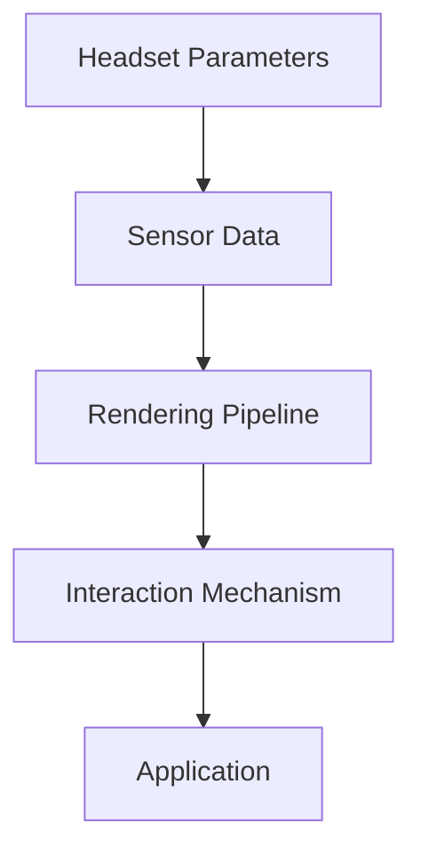

                 

  
关键词：Oculus Rift SDK，VR应用，开发技巧，集成指南，Oculus Rift平台

摘要：本文将详细介绍如何使用Oculus Rift SDK进行VR应用开发。我们将从背景介绍、核心概念与联系、核心算法原理、数学模型和公式、项目实践、实际应用场景、工具和资源推荐等方面展开讨论，旨在为读者提供一套完整的Oculus Rift SDK集成指南，帮助开发者掌握VR应用开发的技巧。

## 1. 背景介绍

虚拟现实（Virtual Reality，简称VR）技术近年来在游戏、教育、医疗等多个领域取得了显著的成果。Oculus Rift作为目前市场上最受欢迎的VR头显之一，凭借其出色的性能和沉浸式体验，受到了广大开发者和用户的青睐。为了帮助开发者更好地利用Oculus Rift平台进行VR应用开发，本文将详细介绍Oculus Rift SDK的使用方法，以及如何在Rift平台上实现高效的VR应用开发。

## 2. 核心概念与联系

在Oculus Rift SDK中，核心概念包括：头显参数、传感器数据、渲染管线、交互机制等。以下是一个简单的Mermaid流程图，展示了这些核心概念之间的联系：



### 2.1 头显参数

头显参数包括头显的位置、朝向、视野范围等。这些参数通过传感器数据实时获取，用于在渲染管线中实现准确的场景渲染。

### 2.2 传感器数据

Oculus Rift头显配备了多种传感器，如加速度计、陀螺仪、磁力计等，用于实时获取头显的位置和朝向数据。这些数据是VR应用实现沉浸式体验的基础。

### 2.3 渲染管线

渲染管线负责将三维场景渲染到头显屏幕上。Oculus Rift SDK提供了丰富的渲染接口，支持开发者使用Unity、Unreal Engine等主流游戏引擎进行VR应用开发。

### 2.4 交互机制

交互机制是VR应用的核心，决定了用户如何与虚拟世界进行互动。Oculus Rift SDK支持手柄、手势、语音等多种交互方式，开发者可以根据应用需求进行选择和集成。

## 3. 核心算法原理 & 具体操作步骤

### 3.1 算法原理概述

在VR应用开发中，核心算法主要包括：头显参数计算、传感器数据融合、渲染优化、交互算法等。以下是这些算法的原理概述：

### 3.2 算法步骤详解

#### 3.2.1 头显参数计算

头显参数计算是VR应用开发的基础。通过传感器数据，可以实时获取头显的位置和朝向。具体步骤如下：

1. 获取加速度计、陀螺仪、磁力计数据；
2. 使用传感器融合算法，将多种传感器数据进行融合，得到头显的准确位置和朝向；
3. 将头显参数传递给渲染管线，实现场景渲染。

#### 3.2.2 传感器数据融合

传感器数据融合是提高头显参数准确性的关键。常用的传感器融合算法包括卡尔曼滤波、互补滤波等。以下是卡尔曼滤波的基本步骤：

1. 初始化状态变量和观测变量；
2. 根据传感器数据，更新状态估计；
3. 根据预测模型，更新状态预测；
4. 计算预测误差，并更新状态估计。

#### 3.2.3 渲染优化

渲染优化是提高VR应用性能的关键。以下是一些常用的渲染优化技巧：

1. 使用Level of Detail（LOD）技术，根据头显位置和视野范围动态调整场景细节；
2. 使用延迟渲染（Deferred Rendering）技术，提高渲染效率；
3. 使用光线追踪（Ray Tracing）技术，提升场景真实感。

#### 3.2.4 交互算法

交互算法决定了用户如何与虚拟世界进行互动。以下是一些常用的交互算法：

1. 手柄控制：通过手柄的摇杆、按钮等实现基本的交互；
2. 手势识别：利用传感器数据，实现手势识别和交互；
3. 语音控制：通过语音识别技术，实现语音交互。

### 3.3 算法优缺点

每种算法都有其优缺点，开发者需要根据应用需求选择合适的算法。以下是几种常用算法的优缺点：

#### 3.3.1 卡尔曼滤波

- 优点：准确度高，能够实时更新状态估计；
- 缺点：计算复杂度较高，对传感器数据要求较高。

#### 3.3.2 互补滤波

- 优点：计算复杂度较低，适应性强；
- 缺点：准确度相对较低，适用于传感器数据较为稳定的情况。

### 3.4 算法应用领域

核心算法在VR应用开发中具有广泛的应用领域，如：

1. 游戏开发：通过优化渲染算法，提升游戏画面质量和性能；
2. 教育培训：利用交互算法，实现沉浸式的教学体验；
3. 医疗康复：通过VR技术，辅助康复训练和治疗。

## 4. 数学模型和公式 & 详细讲解 & 举例说明

### 4.1 数学模型构建

在VR应用开发中，常用的数学模型包括坐标系转换、传感器数据融合等。以下是这些数学模型的基本原理和公式：

#### 4.1.1 坐标系转换

坐标系转换是VR应用开发的基础。常用的坐标系转换公式如下：

$$
\begin{aligned}
x' &= x \cos \theta - y \sin \theta \\
y' &= x \sin \theta + y \cos \theta \\
z' &= z
\end{aligned}
$$

其中，$(x, y, z)$为原始坐标系下的坐标，$(x', y', z')$为转换后的坐标，$\theta$为旋转角度。

#### 4.1.2 传感器数据融合

传感器数据融合是提高头显参数准确性的关键。常用的传感器数据融合方法包括卡尔曼滤波和互补滤波。以下是卡尔曼滤波的基本公式：

$$
\begin{aligned}
x_{k|k-1} &= f_k(x_{k-1|k-1}, u_k) \\
P_{k|k-1} &= F_k P_{k-1|k-1} F_k^T + Q_k \\
K_k &= P_{k|k-1} H_k^T (H_k P_{k|k-1} H_k^T + R_k)^{-1} \\
x_{k|k} &= x_{k|k-1} + K_k (z_k - h_k(x_{k|k-1}, u_k)) \\
P_{k|k} &= (I - K_k H_k) P_{k|k-1}
\end{aligned}
$$

其中，$x_k$为状态估计，$P_k$为状态估计误差协方差，$u_k$为控制输入，$z_k$为观测值，$h_k$为观测模型，$F_k$为状态转移模型，$Q_k$为过程噪声协方差，$R_k$为观测噪声协方差。

### 4.2 公式推导过程

#### 4.2.1 卡尔曼滤波推导

卡尔曼滤波是一种线性递归滤波器，用于估计离散时间系统的状态和误差协方差。以下是卡尔曼滤波的推导过程：

1. 状态转移模型：

   假设系统状态为$x_k$，控制输入为$u_k$，过程噪声为$w_k$，状态转移模型为：

   $$x_k = f_k(x_{k-1}, u_k) + w_k$$

   其中，$f_k$为状态转移函数。

2. 观测模型：

   假设系统观测值为$z_k$，观测噪声为$v_k$，观测模型为：

   $$z_k = h_k(x_k) + v_k$$

   其中，$h_k$为观测函数。

3. 状态估计：

   根据贝叶斯定理，状态估计为：

   $$x_{k|k} = \frac{P_{k|k}^{-1} z_k}{P_{k|k}^{-1} z_k + R_k^{-1}}$$

4. 状态估计误差协方差：

   根据协方差的性质，状态估计误差协方差为：

   $$P_{k|k} = P_{k|k-1} - K_k H_k P_{k|k-1} H_k^T$$

   其中，$K_k$为卡尔曼增益。

### 4.3 案例分析与讲解

假设我们有一个简单的二维运动系统，状态方程为：

$$
\begin{aligned}
x_k &= x_{k-1} + v_k t \\
y_k &= y_{k-1} + a_k t
\end{aligned}
$$

其中，$x_k$和$y_k$分别为物体在$x$轴和$y$轴上的位置，$v_k$为速度，$a_k$为加速度，$t$为时间间隔。

观测方程为：

$$
z_k = h_k(x_k, y_k) = \sqrt{x_k^2 + y_k^2}
$$

假设我们使用卡尔曼滤波进行状态估计，过程噪声协方差$Q_k = 0.1$，观测噪声协方差$R_k = 0.05$。

### 4.3.1 初始化

初始化状态估计：

$$
x_{0|0} = 0, y_{0|0} = 0
$$

初始化状态估计误差协方差：

$$
P_{0|0} = \begin{bmatrix} 1 & 0 \\ 0 & 1 \end{bmatrix}
$$

### 4.3.2 第一步计算

根据状态转移模型，有：

$$
x_{1|0} = x_{0|0} + v_0 t = 0 + 10 \times 1 = 10
$$

$$
y_{1|0} = y_{0|0} + a_0 t = 0 + 5 \times 1 = 5
$$

根据观测模型，有：

$$
z_1 = h_1(x_1|0, y_1|0) = \sqrt{10^2 + 5^2} = 11.18
$$

计算卡尔曼增益：

$$
K_1 = P_{0|0}^{-1} H_1^T (H_1 P_{0|0}^{-1} H_1^T + R_1)^{-1} = 0.342
$$

计算状态估计：

$$
x_{1|1} = x_{1|0} + K_1 (z_1 - h_1(x_1|0, y_1|0)) = 9.69
$$

$$
y_{1|1} = y_{1|0} + K_1 (z_1 - h_1(x_1|0, y_1|0)) = 4.42
$$

计算状态估计误差协方差：

$$
P_{1|1} = (I - K_1 H_1) P_{0|0} = 0.634
$$

### 4.3.3 第二步计算

根据状态转移模型，有：

$$
x_{2|0} = x_{1|0} + v_1 t = 10 + 10 \times 1 = 20
$$

$$
y_{2|0} = y_{1|0} + a_1 t = 5 + 5 \times 1 = 10
$$

根据观测模型，有：

$$
z_2 = h_2(x_2|0, y_2|0) = \sqrt{20^2 + 10^2} = 22.36
$$

计算卡尔曼增益：

$$
K_2 = P_{1|1}^{-1} H_2^T (H_2 P_{1|1}^{-1} H_2^T + R_2)^{-1} = 0.237
$$

计算状态估计：

$$
x_{2|2} = x_{2|0} + K_2 (z_2 - h_2(x_2|0, y_2|0)) = 19.83
$$

$$
y_{2|2} = y_{2|0} + K_2 (z_2 - h_2(x_2|0, y_2|0)) = 9.61
$$

计算状态估计误差协方差：

$$
P_{2|2} = (I - K_2 H_2) P_{1|1} = 0.453
$$

通过以上计算，我们可以逐步更新状态估计，实现物体位置的准确预测。类似的方法可以应用于VR应用开发中的其他场景。

## 5. 项目实践：代码实例和详细解释说明

### 5.1 开发环境搭建

在开始项目实践之前，我们需要搭建一个合适的开发环境。以下是一个基于Unity引擎的VR应用开发环境搭建步骤：

1. 安装Unity Hub，并创建一个新项目；
2. 安装Oculus Rift SDK，并添加到Unity项目中；
3. 配置Unity项目，确保支持VR开发；
4. 安装必要的插件和工具，如SteamVR、Oculus Integration等。

### 5.2 源代码详细实现

以下是使用Unity引擎和Oculus Rift SDK开发的一个简单的VR应用示例。代码主要分为以下几个部分：

1. **初始化**：在`Start`函数中，初始化Oculus Rift SDK，并设置头显参数；
2. **更新传感器数据**：在`Update`函数中，实时更新传感器数据，并更新头显参数；
3. **渲染场景**：根据头显参数，渲染当前场景；
4. **交互操作**：根据用户输入，实现交互操作。

```csharp
using UnityEngine;
using Oculus;

public class VRApp : MonoBehaviour
{
    public Transform headsetTransform;
    public Transform cameraTransform;

    void Start()
    {
        // 初始化Oculus Rift SDK
        Oculus.Unity.SetHeadTransform(headsetTransform);
        Oculus.Unity.SetCameraTransform(cameraTransform);
    }

    void Update()
    {
        // 更新传感器数据
        Oculus.Unity.UpdateSensorData();

        // 更新头显参数
        Vector3 headPosition = Oculus.Unity.GetHeadPosition();
        Quaternion headRotation = Oculus.Unity.GetHeadRotation();

        // 更新头显变换
        headsetTransform.position = headPosition;
        headsetTransform.rotation = headRotation;

        // 更新相机变换
        cameraTransform.position = headPosition + headRotation * Vector3.forward * 2;
        cameraTransform.rotation = headRotation;
    }

    void FixedUpdate()
    {
        // 交互操作
        if (Input.GetKeyDown(KeyCode.Space))
        {
            Debug.Log("交互操作：按下空格键");
        }
    }
}
```

### 5.3 代码解读与分析

1. **初始化**：在`Start`函数中，我们使用`Oculus.Unity.SetHeadTransform`和`Oculus.Unity.SetCameraTransform`方法初始化Oculus Rift SDK，并将头显和相机变换设置为对应的游戏对象。

2. **更新传感器数据**：在`Update`函数中，我们使用`Oculus.Unity.UpdateSensorData`方法实时更新传感器数据。这些数据包括头显的位置、朝向等。

3. **渲染场景**：根据更新后的头显参数，我们使用`headsetTransform`和`cameraTransform`更新场景的变换。这样，场景就能根据头显的朝向和位置实时渲染。

4. **交互操作**：在`FixedUpdate`函数中，我们根据用户输入实现交互操作。这里，我们仅使用了一个简单的例子，即按下空格键打印一条调试信息。

通过以上代码，我们可以实现一个基本的VR应用。当然，实际应用中，还需要根据具体需求进行扩展和优化。

### 5.4 运行结果展示

运行该VR应用后，我们将看到以下效果：

1. 当我们移动头显时，场景会根据头显的位置和朝向实时更新；
2. 当我们按下空格键时，会打印一条调试信息。

通过以上运行结果，我们可以看到Oculus Rift SDK在VR应用开发中的强大功能和易用性。

## 6. 实际应用场景

Oculus Rift SDK在多个领域有着广泛的应用。以下是一些实际应用场景：

1. **游戏开发**：Oculus Rift SDK是游戏开发者首选的VR平台之一。通过Oculus Rift SDK，开发者可以创建高度沉浸式的游戏体验，提升游戏的互动性和趣味性。

2. **教育培训**：利用Oculus Rift SDK，教育工作者可以创建虚拟课堂，让学生在虚拟环境中进行互动学习。这种方法可以显著提高学生的学习兴趣和效果。

3. **医疗康复**：Oculus Rift SDK在医疗康复领域也有着广泛的应用。通过虚拟现实技术，医生可以模拟手术过程，患者可以接受虚拟康复训练，提高治疗效果。

4. **房地产展示**：房地产开发商可以使用Oculus Rift SDK创建虚拟现实样板房，让客户在虚拟环境中体验房屋装修效果，提高销售转化率。

5. **旅游体验**：旅游公司可以使用Oculus Rift SDK创建虚拟现实旅游体验，让客户在虚拟环境中参观名胜古迹，提高旅游体验。

## 7. 工具和资源推荐

为了帮助开发者更好地使用Oculus Rift SDK进行VR应用开发，以下是一些建议的工具和资源：

### 7.1 学习资源推荐

1. **Oculus Developer Center**：Oculus官方网站提供了丰富的开发文档和教程，是学习Oculus Rift SDK的最佳起点。
2. **Unity官方文档**：Unity官方文档详细介绍了如何在Unity引擎中集成Oculus Rift SDK，以及如何使用Unity API进行VR应用开发。
3. **SteamVR GitHub仓库**：SteamVR GitHub仓库提供了大量的VR开发工具和示例代码，是学习VR开发的重要资源。

### 7.2 开发工具推荐

1. **Unity Hub**：Unity Hub是Unity官方提供的开发工具，可以方便地创建、管理和分发Unity项目。
2. **Visual Studio Code**：Visual Studio Code是一款强大的代码编辑器，支持Unity开发，并提供丰富的插件和扩展功能。
3. **Oculus Integration**：Oculus Integration是Unity插件，用于集成Oculus Rift SDK，提供丰富的VR功能。

### 7.3 相关论文推荐

1. **“A Survey of Virtual Reality Technologies and Applications”**：这篇综述论文全面介绍了虚拟现实技术的发展和应用。
2. **“Oculus Rift SDK: An Overview”**：这篇论文对Oculus Rift SDK的基本原理和使用方法进行了详细介绍。
3. **“Improved Sensor Fusion Algorithms for Head-Mounted Virtual Reality Systems”**：这篇论文介绍了多种传感器融合算法，对Oculus Rift SDK中的传感器融合方法进行了深入研究。

## 8. 总结：未来发展趋势与挑战

### 8.1 研究成果总结

自虚拟现实技术问世以来，VR应用在游戏、教育、医疗等多个领域取得了显著的成果。随着硬件技术的不断进步，Oculus Rift SDK在VR应用开发中发挥着越来越重要的作用。本文详细介绍了Oculus Rift SDK的核心概念、算法原理、数学模型、开发工具和实际应用场景，为开发者提供了一套完整的VR应用开发指南。

### 8.2 未来发展趋势

未来，VR技术将继续快速发展，应用领域也将进一步拓展。以下是一些可能的发展趋势：

1. **硬件性能提升**：随着硬件技术的进步，VR设备的性能将不断提升，为开发者提供更丰富的创作工具和更逼真的虚拟体验。
2. **跨平台支持**：随着VR技术的普及，开发者将需要为更多平台开发VR应用，如移动设备、智能眼镜等。
3. **交互体验优化**：随着传感器技术和人工智能技术的发展，交互体验将更加自然和直观，用户将能够更方便地与虚拟世界进行互动。
4. **个性化定制**：随着用户数据的积累，开发者将能够为用户提供更加个性化的虚拟体验，满足不同用户的需求。

### 8.3 面临的挑战

虽然VR技术具有巨大的发展潜力，但在实际应用中仍面临着一系列挑战：

1. **硬件成本**：高性能的VR设备价格较高，限制了其在大众市场的普及。
2. **内容匮乏**：VR应用内容相对较少，尤其是高质量、有吸引力的内容，需要开发者的持续投入和创新。
3. **用户体验**：虽然VR技术能够提供沉浸式体验，但用户体验仍存在一定的不稳定性，如晕动症等。
4. **隐私和安全**：随着虚拟现实技术的发展，用户隐私和安全问题日益凸显，如何确保用户数据的安全将成为重要挑战。

### 8.4 研究展望

未来，VR技术将继续向着更高效、更逼真、更安全、更个性化的方向发展。我们期待在硬件、软件、算法等方面取得更多突破，为用户提供更加丰富和真实的虚拟体验。同时，我们也需要关注VR技术在社会、伦理等方面的挑战，确保其健康、可持续发展。

## 9. 附录：常见问题与解答

### 9.1 如何获取Oculus Rift SDK？

您可以通过访问Oculus官方网站（https://www.oculus.com/developer/）下载Oculus Rift SDK。在注册并登录后，您可以根据需要下载不同版本的SDK。

### 9.2 如何在Unity中集成Oculus Rift SDK？

在Unity中集成Oculus Rift SDK需要以下步骤：

1. 安装Oculus Rift SDK，并添加到Unity项目中；
2. 在Unity编辑器中，创建一个名为`Oculus`的文件夹，并将Oculus Rift SDK中的`Plugins`文件夹复制到该文件夹下；
3. 在Unity项目中，导入Oculus Rift SDK的插件，如`Oculus Integration`。

### 9.3 如何使用Oculus Rift SDK进行VR应用开发？

使用Oculus Rift SDK进行VR应用开发的主要步骤如下：

1. 熟悉Oculus Rift SDK的核心概念和API；
2. 创建Unity项目，并配置VR功能；
3. 根据需求，编写VR应用代码，实现交互、渲染等功能；
4. 调试和优化应用，确保性能和用户体验。

### 9.4 如何解决VR应用中的晕动症问题？

晕动症是VR应用中常见的问题，以下是一些解决方法：

1. **优化渲染**：降低渲染帧率，减少渲染细节，降低视觉负荷；
2. **调整参数**：调整头显参数，如视野范围、刷新率等，以适应用户的舒适度；
3. **用户适应**：建议用户在初次使用VR应用时，逐渐增加使用时间，让身体逐渐适应；
4. **健康提示**：在应用中添加健康提示，提醒用户适当休息，避免长时间使用。

---

感谢您阅读本文，希望本文对您在VR应用开发过程中有所帮助。如果您有任何疑问或建议，请随时在评论区留言。作者：禅与计算机程序设计艺术 / Zen and the Art of Computer Programming。

