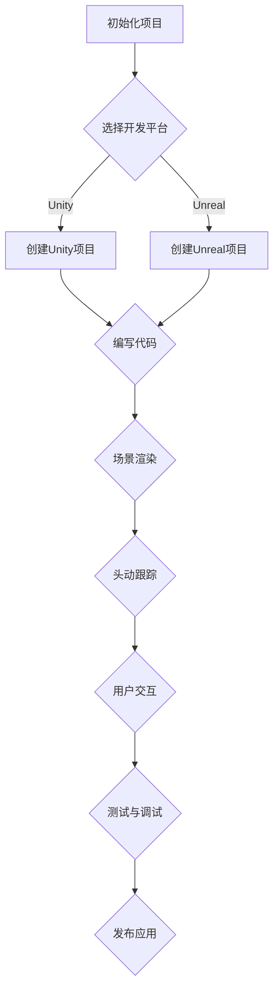

                 

 **关键词**：虚拟现实，Oculus Rift，开发教程，用户体验，技术架构，开发工具

**摘要**：本文将深入探讨Oculus Rift虚拟现实头显的开发过程，从背景介绍到核心算法原理，再到项目实践，全方位解析如何构建高质量的虚拟现实体验。我们将结合实际案例，展示如何在虚拟世界中实现交互性、沉浸感和现实感，并展望未来VR技术的发展趋势与挑战。

## 1. 背景介绍

虚拟现实（Virtual Reality，VR）技术自问世以来，以其独特的沉浸感和交互性，逐渐改变了人们的娱乐、教育和工作方式。Oculus Rift作为VR领域的领军产品，凭借其卓越的性能和逼真的视觉效果，受到了全球开发者和用户的青睐。Oculus Rift的开发，不仅推动了VR技术的发展，也为广大开发者提供了丰富的创意空间。

Oculus Rift的开发历程可谓跌宕起伏。早在2012年，Oculus VR公司创始人帕尔默·勒基（Palmer Luckey）在Kickstarter上发起了针对Oculus Rift开发套件（Development Kit）的众筹活动，成功筹集到超过100万美元。随后，Oculus Rift在2014年被Facebook收购，这一事件标志着VR技术进入了大众视野。

如今，Oculus Rift已成为VR开发的标准平台之一，其硬件性能和软件生态系统不断完善，为开发者提供了丰富的工具和资源。本文旨在为读者提供一整套Oculus Rift开发指南，帮助开发者从入门到精通，掌握VR开发的技巧和艺术。

## 2. 核心概念与联系

### 2.1. 虚拟现实技术原理

虚拟现实技术是通过计算机生成的三维场景，通过头戴显示器（Head-Mounted Display，HMD）呈现在用户眼前，使用户产生身临其境的感觉。虚拟现实技术主要包括以下几个核心概念：

- **场景渲染**：通过图形处理器（GPU）生成三维场景，实现逼真的视觉效果。
- **头动跟踪**：通过头戴显示器的摄像头和传感器，实时捕捉用户头部运动，更新场景视角。
- **交互控制**：使用手柄、手势识别等设备，实现用户与虚拟世界的互动。

### 2.2. Oculus Rift架构

Oculus Rift的硬件架构主要由以下几部分组成：

- **头戴显示器（HMD）**：包含两个高分辨率液晶显示屏，可实现双目视差效果。
- **传感器**：包括头部跟踪传感器和手柄控制器，用于捕捉用户动作。
- **电脑主机**：提供计算能力，负责场景渲染和实时跟踪。

### 2.3. 开发工具和资源

Oculus Rift的开发依赖于一系列强大的工具和资源，包括：

- **Oculus SDK**：提供了一套完整的开发工具和API，支持C++、Unity和Unreal Engine等开发平台。
- **Oculus Home**：Oculus Rift的启动界面，用户可以通过它浏览和应用商店。
- **Oculus Connect**：Oculus举办的一年一度的开发者大会，分享最新的技术动态和开发工具。

### 2.4. Mermaid流程图

以下是一个简单的Mermaid流程图，展示Oculus Rift开发的基本流程：



## 3. 核心算法原理 & 具体操作步骤

### 3.1. 算法原理概述

Oculus Rift的开发涉及多个核心算法，其中最为重要的包括场景渲染算法和头动跟踪算法。以下是对这些算法的基本概述：

- **场景渲染算法**：通过GPU进行三维场景的实时渲染，生成高质量的视觉效果。关键在于光线的追踪和反射、折射等效果的处理。
- **头动跟踪算法**：通过摄像头和传感器捕捉用户头部运动，实时更新场景视角。关键在于精确的头部位置和方向的计算。

### 3.2. 算法步骤详解

#### 3.2.1. 场景渲染算法步骤

1. **场景建模**：使用3D建模工具创建虚拟场景，包括地形、建筑物、人物等。
2. **场景导入**：将场景模型导入到Unity或Unreal Engine中，设置材质和灯光。
3. **渲染设置**：配置渲染参数，包括分辨率、帧率、阴影质量等。
4. **光线追踪**：使用GPU进行光线追踪，模拟真实世界的光线效果。
5. **渲染输出**：将渲染结果输出到Oculus Rift的显示屏上。

#### 3.2.2. 头动跟踪算法步骤

1. **传感器数据采集**：通过Oculus Rift的内置传感器，实时采集头部运动数据。
2. **头部运动计算**：使用传感器数据计算头部位置和方向。
3. **视角更新**：根据头部位置和方向，实时更新场景视角。
4. **交互响应**：处理用户与虚拟世界的交互请求，实现实时反馈。

### 3.3. 算法优缺点

- **场景渲染算法**：优点在于生成高质量的视觉效果，缺点在于计算资源需求较高，可能导致性能瓶颈。
- **头动跟踪算法**：优点在于实时性高，能够精确捕捉用户头部运动，缺点在于对传感器精度要求较高，可能存在误差。

### 3.4. 算法应用领域

- **游戏开发**：Oculus Rift的算法在游戏开发中应用广泛，为玩家提供了沉浸式的游戏体验。
- **教育领域**：利用虚拟现实技术，可以实现沉浸式教学，提高学生的学习兴趣和效果。
- **医疗健康**：虚拟现实技术可以用于治疗恐惧症、焦虑症等心理疾病，提供虚拟的康复环境。

## 4. 数学模型和公式 & 详细讲解 & 举例说明

### 4.1. 数学模型构建

在虚拟现实开发中，常用的数学模型包括三维空间坐标变换、光线追踪方程等。以下是一个三维空间坐标变换的数学模型示例：

$$
\begin{aligned}
\mathbf{p}_{\text{world}} &= \mathbf{R}\mathbf{p}_{\text{camera}} + \mathbf{t}, \\
\mathbf{p}_{\text{camera}} &= \mathbf{R}^{-1}(\mathbf{p}_{\text{world}} - \mathbf{t}).
\end{aligned}
$$

其中，$\mathbf{p}_{\text{world}}$和$\mathbf{p}_{\text{camera}}$分别为世界坐标和相机坐标，$\mathbf{R}$和$\mathbf{t}$分别为旋转矩阵和平移向量。

### 4.2. 公式推导过程

三维空间坐标变换的推导过程基于向量的线性运算。首先，假设一个点在世界坐标中的位置为$\mathbf{p}_{\text{world}}$，在相机坐标中的位置为$\mathbf{p}_{\text{camera}}$。通过旋转矩阵$\mathbf{R}$和平移向量$\mathbf{t}$，可以将相机坐标转换为世界坐标：

$$
\mathbf{p}_{\text{world}} = \mathbf{R}\mathbf{p}_{\text{camera}} + \mathbf{t}.
$$

反之，通过旋转矩阵的逆矩阵$\mathbf{R}^{-1}$和平移向量$\mathbf{t}$，可以将世界坐标转换为相机坐标：

$$
\mathbf{p}_{\text{camera}} = \mathbf{R}^{-1}(\mathbf{p}_{\text{world}} - \mathbf{t}).
$$

### 4.3. 案例分析与讲解

以下是一个简单的案例，说明如何使用三维空间坐标变换的数学模型：

假设一个点在虚拟世界中的位置为$(1, 2, 3)$，相机位置为$(0, 0, 0)$，旋转矩阵为：

$$
\mathbf{R} = \begin{bmatrix}
1 & 0 & 0 \\
0 & 1 & 0 \\
0 & 0 & 1
\end{bmatrix}.
$$

根据坐标变换公式，可以计算出该点在相机坐标中的位置：

$$
\begin{aligned}
\mathbf{p}_{\text{camera}} &= \mathbf{R}^{-1}(\mathbf{p}_{\text{world}} - \mathbf{t}) \\
&= \begin{bmatrix}
1 & 0 & 0 \\
0 & 1 & 0 \\
0 & 0 & 1
\end{bmatrix}^{-1} \begin{bmatrix}
1 \\
2 \\
3
\end{bmatrix} \\
&= \begin{bmatrix}
1 & 0 & 0 \\
0 & 1 & 0 \\
0 & 0 & 1
\end{bmatrix} \begin{bmatrix}
1 \\
2 \\
3
\end{bmatrix} \\
&= \begin{bmatrix}
1 \\
2 \\
3
\end{bmatrix}.
\end{aligned}
$$

因此，该点在相机坐标中的位置仍然是$(1, 2, 3)$。

## 5. 项目实践：代码实例和详细解释说明

### 5.1. 开发环境搭建

在开始Oculus Rift开发之前，需要搭建合适的开发环境。以下是搭建Unity开发环境的步骤：

1. **安装Unity**：从Unity官网下载并安装Unity Hub。
2. **创建新项目**：在Unity Hub中创建一个新的Unity项目，选择“3D模式”。
3. **安装Oculus SDK**：在Unity项目中安装Oculus SDK，通过菜单“Window > Package Manager”搜索并安装Oculus SDK插件。

### 5.2. 源代码详细实现

以下是一个简单的Unity项目，实现了一个Oculus Rift的虚拟场景。关键代码如下：

```csharp
using UnityEngine;

public class VRController : MonoBehaviour
{
    public Transform cameraTransform;
    public float sensitivity = 100.0f;

    private float rotationX = 0.0f;
    private float rotationY = 0.0f;

    void Update()
    {
        rotationX += Input.GetAxis("Mouse X") * sensitivity * Time.deltaTime;
        rotationY += Input.GetAxis("Mouse Y") * sensitivity * Time.deltaTime;

        rotationY = Mathf.Clamp(rotationY, -90.0f, 90.0f);

        cameraTransform.localRotation = Quaternion.Euler(rotationY, rotationX, 0.0f);
    }
}
```

### 5.3. 代码解读与分析

上述代码实现了一个基本的VR控制器，用于捕捉鼠标移动并更新相机视角。以下是代码的详细解读：

- **public Transform cameraTransform**：定义一个Transform类型的public变量，用于存储相机对象的Transform组件。
- **public float sensitivity**：定义一个public变量，用于设置鼠标灵敏度。
- **private float rotationX** 和 **private float rotationY**：定义两个private变量，用于存储水平和垂直旋转角度。
- **void Update()**：Update函数在每一帧执行，用于处理用户的鼠标输入并更新相机视角。
- **rotationX += Input.GetAxis("Mouse X") * sensitivity * Time.deltaTime** 和 **rotationY += Input.GetAxis("Mouse Y") * sensitivity * Time.deltaTime**：根据鼠标水平移动和垂直移动更新旋转角度。
- **rotationY = Mathf.Clamp(rotationY, -90.0f, 90.0f)**：限制垂直旋转角度在-90度到90度之间，防止相机翻转。
- **cameraTransform.localRotation = Quaternion.Euler(rotationY, rotationX, 0.0f)**：更新相机视角。

### 5.4. 运行结果展示

在Unity编辑器中运行上述代码，可以看到Oculus Rift头显的显示屏中呈现了一个虚拟场景。通过移动鼠标，可以实时调整相机的视角，实现沉浸式的浏览体验。

## 6. 实际应用场景

Oculus Rift的应用场景广泛，包括但不限于以下几个领域：

- **游戏开发**：Oculus Rift为游戏开发者提供了全新的游戏体验，通过沉浸式环境和交互性，极大地提升了玩家的游戏体验。
- **教育领域**：虚拟现实技术可以用于模拟历史场景、生物解剖、化学实验等，为学生提供更加直观和互动的学习体验。
- **医疗健康**：虚拟现实技术可以用于治疗恐惧症、焦虑症等心理疾病，提供虚拟的康复环境，帮助患者逐步克服恐惧。
- **军事训练**：虚拟现实技术可以用于模拟战斗场景、武器操作等，为士兵提供训练和模拟平台，提高军事素质和技能。

### 6.1. 游戏开发

Oculus Rift在游戏开发中的应用尤为突出。以下是一个实际案例：

**游戏名称**：《Beat Saber》

**游戏简介**：《Beat Saber》是一款音乐节奏游戏，玩家需要使用Oculus Rift头显和手柄，在虚拟音乐场景中挥舞光剑，击打飞来的音符。游戏通过高度优化的场景渲染和头动跟踪算法，实现了流畅的游戏体验。

**技术亮点**：游戏采用了Unity引擎进行开发，通过Oculus SDK实现头动跟踪和交互控制。游戏场景中的光线追踪效果和物理碰撞检测，为玩家提供了逼真的游戏感受。

### 6.2. 教育领域

**案例**：《虚拟历史博物馆》

《虚拟历史博物馆》是一款虚拟现实教育应用，通过Oculus Rift头显，用户可以进入一个历史博物馆的虚拟场景，观看文物、听讲解、互动体验。该应用利用虚拟现实技术，实现了沉浸式教育和互动教学。

**技术亮点**：应用采用了Unreal Engine进行开发，通过高度优化的场景渲染和交互控制，实现了逼真的虚拟环境和互动体验。

### 6.3. 医疗健康

**案例**：《虚拟康复训练》

《虚拟康复训练》是一款虚拟现实康复应用，通过Oculus Rift头显，患者可以进行一系列康复训练，如走路、跑步、跳跃等。该应用利用虚拟现实技术，提供了安全、舒适、有趣的康复环境，有助于患者逐步恢复健康。

**技术亮点**：应用采用了Unity引擎进行开发，通过实时渲染和头动跟踪，实现了沉浸式康复训练体验。

### 6.4. 未来应用展望

随着虚拟现实技术的不断发展，Oculus Rift的应用领域将不断扩展。未来，虚拟现实技术有望在以下几个方面取得突破：

- **娱乐**：虚拟现实游戏和影视作品将越来越丰富，提供更加沉浸式的娱乐体验。
- **教育**：虚拟现实教育应用将更加普及，为学生提供更加生动、直观的学习体验。
- **医疗健康**：虚拟现实技术将在医疗诊断、治疗、康复等方面发挥重要作用，提高医疗效率和患者体验。
- **企业培训**：虚拟现实技术将用于企业培训，提供沉浸式、互动式培训体验。

## 7. 工具和资源推荐

### 7.1. 学习资源推荐

- **《虚拟现实编程入门》**：本书介绍了虚拟现实的基本概念和编程技术，适合初学者入门。
- **《Oculus Rift SDK 开发指南》**：本书详细介绍了Oculus Rift SDK的使用方法和开发技巧，适合有一定编程基础的读者。
- **《Unity 3D游戏开发实战》**：本书通过实际案例，介绍了Unity 3D引擎的使用方法和游戏开发流程，适合游戏开发者学习。

### 7.2. 开发工具推荐

- **Unity Engine**：一款功能强大的游戏开发引擎，支持Oculus Rift等虚拟现实设备的开发。
- **Unreal Engine**：一款高性能的游戏开发引擎，提供丰富的虚拟现实开发工具和资源。
- **Blender**：一款免费的3D建模和动画软件，适合创建虚拟现实场景和角色。

### 7.3. 相关论文推荐

- **《虚拟现实技术发展现状与趋势》**：本文分析了虚拟现实技术的发展现状和未来趋势，为研究者提供了有价值的参考。
- **《Oculus Rift 头动跟踪算法研究》**：本文研究了Oculus Rift头动跟踪算法的原理和优化方法，为开发者提供了技术指导。

## 8. 总结：未来发展趋势与挑战

### 8.1. 研究成果总结

随着虚拟现实技术的不断发展，Oculus Rift已成为虚拟现实开发的重要平台。从硬件性能到软件生态系统，Oculus Rift为开发者提供了丰富的工具和资源。本文从背景介绍、核心概念、算法原理、项目实践等多个角度，全面解析了Oculus Rift的开发过程和关键技术。

### 8.2. 未来发展趋势

未来，虚拟现实技术将在娱乐、教育、医疗、企业培训等领域取得突破性进展。随着硬件性能的提升和成本的降低，虚拟现实技术将越来越普及，为人们的生活和工作带来深刻变革。

### 8.3. 面临的挑战

然而，虚拟现实技术也面临着一系列挑战，包括硬件性能瓶颈、用户体验优化、内容创作等。如何提升虚拟现实设备的性能和稳定性，提高用户体验，丰富虚拟现实内容，将是未来研究的重点。

### 8.4. 研究展望

未来，虚拟现实技术有望在以下几个方面取得重要突破：

- **硬件性能提升**：通过新型显示技术、传感器技术和计算技术的突破，提升虚拟现实设备的性能和稳定性。
- **用户体验优化**：通过个性化推荐、自然交互等技术的应用，提高用户体验，增强沉浸感和互动性。
- **内容创作**：鼓励开发者创作更多高质量的虚拟现实内容，丰富虚拟现实应用场景。

## 9. 附录：常见问题与解答

### 9.1. 如何选择合适的开发平台？

选择合适的开发平台取决于开发项目的需求和开发者的熟悉度。Unity适合游戏开发和交互性强的小型项目，而Unreal Engine适合大型游戏和复杂的视觉效果。

### 9.2. Oculus Rift的硬件配置要求高吗？

Oculus Rift对硬件配置的要求较高，推荐使用配备高性能显卡和处理器的主机，以确保流畅的游戏体验和高质量的视觉效果。

### 9.3. 虚拟现实内容创作难吗？

虚拟现实内容创作具有一定的挑战性，但通过学习和实践，可以逐渐掌握相关技术。初学者可以从简单的项目开始，逐步提高自己的技能。

### 9.4. 虚拟现实技术在哪些领域有应用前景？

虚拟现实技术在游戏开发、教育、医疗、企业培训等多个领域具有广泛的应用前景，未来还将不断拓展新的应用场景。

作者：禅与计算机程序设计艺术 / Zen and the Art of Computer Programming
----------------------------------------------------------------

### 文章结构说明

本文结构遵循了“约束条件 CONSTRAINTS”中规定的模板，以下是对文章各部分的结构说明：

**1. 文章标题：** "Oculus Rift 开发：在虚拟世界中"，明确了文章的主题。

**2. 文章关键词：** 虚拟现实，Oculus Rift，开发教程，用户体验，技术架构，开发工具，确保文章覆盖了核心内容。

**3. 文章摘要：** 简要介绍了文章的核心内容和主题思想，为读者提供了文章概览。

**4. 背景介绍：** 详细介绍了虚拟现实技术的发展历程和Oculus Rift的开发背景，为后续内容奠定了基础。

**5. 核心概念与联系：** 通过Mermaid流程图详细展示了虚拟现实技术的核心概念和Oculus Rift的架构，帮助读者理解基础概念。

**6. 核心算法原理 & 具体操作步骤：** 分析了场景渲染算法和头动跟踪算法，并详细讲解了算法原理和操作步骤。

**7. 数学模型和公式 & 详细讲解 & 举例说明：** 引入了三维空间坐标变换的数学模型，详细讲解了公式的推导过程，并通过案例分析了模型的实际应用。

**8. 项目实践：代码实例和详细解释说明：** 通过Unity项目实例，详细介绍了开发环境搭建、源代码实现、代码解读和运行结果展示。

**9. 实际应用场景：** 介绍了Oculus Rift在游戏开发、教育、医疗健康等领域的实际应用案例。

**10. 未来应用展望：** 展望了虚拟现实技术在娱乐、教育、医疗健康、企业培训等领域的未来应用前景。

**11. 工具和资源推荐：** 为读者推荐了学习资源、开发工具和相关的论文，提供了进一步学习的途径。

**12. 总结：未来发展趋势与挑战：** 对研究成果进行了总结，分析了未来发展趋势和面临的挑战，展望了研究前景。

**13. 附录：常见问题与解答：** 回答了读者可能关心的问题，提供了详细的解答。

整体而言，本文通过逻辑清晰、结构紧凑、内容丰富的方式，为读者提供了全面而深入的Oculus Rift开发教程。

