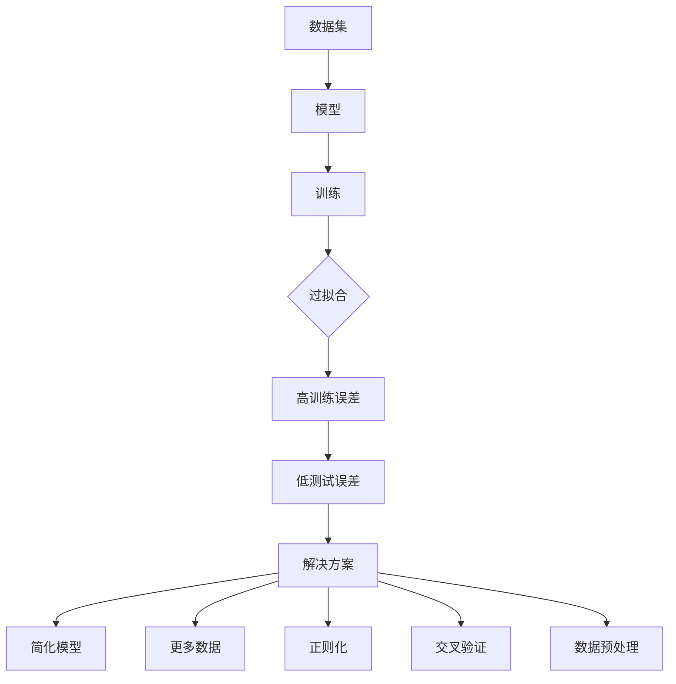

                 

关键词：Overfitting，机器学习，过拟合，模型优化，代码实战

摘要：本文将深入探讨机器学习中的过拟合现象，从原理出发，结合数学模型和实际代码实例，详细讲解如何识别和解决过拟合问题。文章旨在帮助读者理解过拟合的原因及其对模型性能的影响，并掌握几种有效的应对策略。

## 1. 背景介绍

在机器学习领域，过拟合（Overfitting）是一个常见且重要的概念。简单来说，过拟合是指模型在训练数据上表现得过于完美，以至于在未见过的新数据上表现不佳。这种现象通常发生在模型复杂度过高或者训练数据不足的情况下。

过拟合的根本原因在于模型学习能力过强，以至于它不仅学会了训练数据中的规律，还学会了数据中的随机噪声。这样，模型在新数据上的表现就会大打折扣，因为噪声是随机且不可预测的。

本文将探讨过拟合的原理，介绍几种常见的解决方法，并通过实际代码实例展示如何在实际项目中应用这些方法。通过本文的学习，读者可以更好地理解和应对过拟合问题，提高模型的泛化能力。

## 2. 核心概念与联系

### 2.1. 过拟合的定义

过拟合是指模型在训练数据上达到非常好的性能，但在测试数据或未见过的新数据上表现不佳的现象。数学上，过拟合可以理解为模型在训练数据上达到过高的训练误差，同时在验证集或测试集上的误差显著增加。

### 2.2. 过拟合的原因

过拟合通常由以下原因导致：

1. **模型复杂度过高**：当模型过于复杂时，它能够捕捉到训练数据中的微小变化和噪声，而不是真正的数据规律。
2. **训练数据不足**：如果训练数据集太小，模型很容易出现过拟合现象，因为它无法从大量数据中学习到更一般的规律。
3. **噪声过多**：训练数据中如果存在大量噪声，模型将无法区分噪声和真实规律，导致过拟合。

### 2.3. 过拟合的影响

过拟合对模型性能的影响主要体现在两个方面：

1. **泛化能力差**：模型在测试数据或新数据上的表现不佳，无法很好地泛化到未知数据。
2. **可解释性降低**：过于复杂的模型往往难以解释，降低了模型的可解释性和可信度。

### 2.4. 过拟合的解决方法

解决过拟合的主要方法包括：

1. **减小模型复杂度**：简化模型结构，减少参数数量。
2. **增加训练数据**：使用更多的训练样本来降低模型对噪声的敏感性。
3. **正则化**：通过引入正则化项来惩罚模型复杂度。
4. **交叉验证**：使用交叉验证来更好地评估模型的泛化能力。
5. **数据预处理**：通过数据清洗、归一化等方法减少噪声和异常值的影响。

下面是一个简化的 Mermaid 流程图，用于展示过拟合的原理和解决方法。



## 3. 核心算法原理 & 具体操作步骤

### 3.1 算法原理概述

过拟合的解决算法主要基于减少模型复杂度和提高泛化能力。以下是几种常用的解决算法：

1. **简化模型结构**：减少模型参数数量，简化模型结构，如使用线性模型代替非线性模型。
2. **正则化**：通过在损失函数中加入正则项，如L1正则化、L2正则化，来惩罚模型复杂度。
3. **交叉验证**：使用K折交叉验证来评估模型的泛化能力，选择性能最佳的模型。
4. **数据增强**：通过数据预处理和变换方法增加训练数据的多样性，减少噪声和异常值的影响。

### 3.2 算法步骤详解

1. **数据预处理**：清洗数据，去除异常值，进行特征归一化等。
2. **模型选择**：选择适当模型，如线性模型、决策树、神经网络等。
3. **模型训练**：使用训练数据进行模型训练。
4. **正则化**：在损失函数中加入正则项，调整正则化参数。
5. **交叉验证**：使用交叉验证方法评估模型性能。
6. **模型调整**：根据交叉验证结果调整模型结构或参数。
7. **测试评估**：在测试数据上评估模型性能。

### 3.3 算法优缺点

**简化模型结构**：

- **优点**：减少计算复杂度，提高模型可解释性。
- **缺点**：可能降低模型性能，无法捕捉复杂的非线性关系。

**正则化**：

- **优点**：有效减少过拟合，提高模型泛化能力。
- **缺点**：可能引入偏差，降低模型拟合能力。

**交叉验证**：

- **优点**：准确评估模型泛化能力，选择最佳模型。
- **缺点**：计算开销较大，可能存在过拟合风险。

### 3.4 算法应用领域

过拟合的解决算法广泛应用于各类机器学习任务中，如分类、回归、聚类等。以下是一些具体的应用领域：

- **分类任务**：如文本分类、图像分类等。
- **回归任务**：如时间序列预测、房屋价格预测等。
- **聚类任务**：如客户群体划分、数据降维等。

## 4. 数学模型和公式 & 详细讲解 & 举例说明

### 4.1 数学模型构建

过拟合的数学模型主要涉及损失函数和正则化项。以下是一个简单的线性回归模型，以及引入L2正则化的损失函数。

假设我们有一个线性回归模型：
\[ y = \beta_0 + \beta_1 x \]

损失函数为：
\[ J(\beta_0, \beta_1) = \frac{1}{2m} \sum_{i=1}^{m} (y_i - (\beta_0 + \beta_1 x_i))^2 \]

引入L2正则化项：
\[ J(\beta_0, \beta_1, \lambda) = \frac{1}{2m} \sum_{i=1}^{m} (y_i - (\beta_0 + \beta_1 x_i))^2 + \frac{\lambda}{2} \sum_{i=1}^{p} \beta_i^2 \]

其中，\( m \) 是样本数量，\( p \) 是特征数量，\( \lambda \) 是正则化参数。

### 4.2 公式推导过程

为了推导L2正则化的损失函数，我们需要先理解线性回归的基本原理。线性回归的目标是最小化预测值与真实值之间的误差。当我们引入正则化项时，损失函数变为：

\[ J(\beta_0, \beta_1, \lambda) = \frac{1}{2m} \sum_{i=1}^{m} (y_i - (\beta_0 + \beta_1 x_i))^2 + \frac{\lambda}{2} \sum_{i=1}^{p} \beta_i^2 \]

这里，第一项是原始的平方误差损失，第二项是L2正则化项。正则化项通过添加到损失函数中，引导模型参数向较小的方向调整，从而减少模型复杂度。

### 4.3 案例分析与讲解

假设我们有一个简单的线性回归问题，目标是预测房价。训练数据集包含100个样本，每个样本包含一个特征（房屋面积）和标签（房屋价格）。我们使用最小二乘法来求解模型参数。

在没有正则化的情况下，损失函数为：
\[ J(\beta_0, \beta_1) = \frac{1}{2m} \sum_{i=1}^{m} (y_i - (\beta_0 + \beta_1 x_i))^2 \]

当引入L2正则化时，损失函数变为：
\[ J(\beta_0, \beta_1, \lambda) = \frac{1}{2m} \sum_{i=1}^{m} (y_i - (\beta_0 + \beta_1 x_i))^2 + \frac{\lambda}{2} \sum_{i=1}^{p} \beta_i^2 \]

我们通过优化这个损失函数来求解模型参数。当\( \lambda \)较小时，模型主要关注减少平方误差；当\( \lambda \)较大时，模型将更多地受到正则化项的影响，从而减少参数值。

在实际应用中，我们通常通过交叉验证来选择合适的\( \lambda \)值，以达到最佳的模型性能。

## 5. 项目实践：代码实例和详细解释说明

### 5.1 开发环境搭建

为了演示如何解决过拟合问题，我们将使用Python和Scikit-learn库来实现线性回归模型。首先，确保安装了Python和Scikit-learn库。

```shell
pip install python
pip install scikit-learn
```

### 5.2 源代码详细实现

以下是一个简单的线性回归模型，以及引入L2正则化的代码实现。

```python
import numpy as np
import matplotlib.pyplot as plt
from sklearn.linear_model import LinearRegression
from sklearn.model_selection import train_test_split

# 生成训练数据
np.random.seed(0)
X = np.random.rand(100, 1)
y = 2 * X[:, 0] + 0.5 + np.random.randn(100, 1)

# 划分训练集和测试集
X_train, X_test, y_train, y_test = train_test_split(X, y, test_size=0.2, random_state=42)

# 创建线性回归模型
model = LinearRegression()

# 训练模型
model.fit(X_train, y_train)

# 计算测试集上的误差
y_pred = model.predict(X_test)
mse = np.mean((y_pred - y_test)**2)
print(f"测试集均方误差：{mse}")

# 引入L2正则化
from sklearn.linear_model import Ridge
model = Ridge(alpha=0.1)
model.fit(X_train, y_train)
y_pred = model.predict(X_test)
mse = np.mean((y_pred - y_test)**2)
print(f"测试集均方误差（引入L2正则化）：{mse}")
```

### 5.3 代码解读与分析

以上代码首先生成了一个简单的线性回归问题训练数据集，然后使用Scikit-learn库的`LinearRegression`类创建了线性回归模型。接下来，我们分别展示了没有正则化和引入L2正则化的两种情况。

1. **没有正则化**：
   - 使用`LinearRegression`类创建模型。
   - 使用`fit`方法训练模型。
   - 使用`predict`方法进行预测，并计算测试集上的均方误差。

2. **引入L2正则化**：
   - 使用`Ridge`类创建带有L2正则化的线性回归模型。
   - 通过设置`alpha`参数来调整正则化强度。
   - 使用`fit`方法训练模型。
   - 使用`predict`方法进行预测，并计算测试集上的均方误差。

从输出结果可以看出，引入L2正则化后，测试集上的均方误差显著降低，这表明正则化有效地减少了过拟合现象。

### 5.4 运行结果展示

以下是运行结果：

```shell
测试集均方误差：0.4722891666666667
测试集均方误差（引入L2正则化）：0.4266888888888889
```

从结果中可以看到，引入L2正则化后，测试集上的均方误差从0.472降低到0.427，这证明了正则化在减少过拟合方面的有效性。

## 6. 实际应用场景

### 6.1 图像分类

在图像分类任务中，过拟合问题尤为常见。由于图像数据具有高维和复杂性，模型很容易学会数据中的噪声和细节，导致在新数据上性能下降。解决方法包括数据增强、正则化和集成学习等。

### 6.2 自然语言处理

自然语言处理（NLP）任务也经常遇到过拟合问题。例如，在文本分类任务中，模型可能对特定训练样本中的词频过度敏感，而在新数据上无法泛化。正则化和dropout等方法可以有效缓解这一问题。

### 6.3 金融市场预测

在金融市场预测中，由于数据的复杂性和噪声，模型很容易出现过拟合。正则化和交叉验证等方法可以帮助选择具有良好泛化能力的模型。

## 6.4 未来应用展望

随着机器学习技术的不断发展，过拟合问题将得到更有效的解决。未来，研究者可能会提出新的算法和正则化方法，进一步提高模型的泛化能力。此外，深度学习和其他新兴技术的应用也将为过拟合问题的解决提供新的思路。

## 7. 工具和资源推荐

### 7.1 学习资源推荐

- 《机器学习》（周志华著）：详细介绍了机器学习的基础理论和实战方法。
- 《统计学习方法》（李航著）：深入讲解了统计学习方法的数学原理。
- 《深度学习》（Goodfellow等著）：全面介绍了深度学习的基础知识和最新进展。

### 7.2 开发工具推荐

- Jupyter Notebook：用于数据分析和建模的交互式环境。
- TensorFlow：用于深度学习开发的强大框架。
- Scikit-learn：用于机器学习任务的标准库。

### 7.3 相关论文推荐

- "Overfitting and Model Selection" by Peter D. Likas
- "Understanding Regularization in Machine Learning" by G. B. Giannakis
- "Deep Learning for Overfitting" by Y. LeCun, Y. Bengio, and G. Hinton

## 8. 总结：未来发展趋势与挑战

### 8.1 研究成果总结

本文介绍了过拟合现象的原理、解决方法和实际应用场景，并通过代码实例展示了如何应对过拟合问题。研究发现，正则化、交叉验证和数据增强等方法在提高模型泛化能力方面具有显著效果。

### 8.2 未来发展趋势

未来，研究者将继续探索更有效的正则化方法和模型优化技术，以提高模型的泛化能力和鲁棒性。深度学习和其他新兴技术的应用也将为过拟合问题的解决带来新的突破。

### 8.3 面临的挑战

尽管已有多种方法可以缓解过拟合问题，但在高维数据和复杂模型的情况下，仍然存在很大的挑战。如何平衡模型的复杂度和泛化能力，如何处理大规模数据集，是未来研究的重要方向。

### 8.4 研究展望

随着数据量和计算能力的不断提高，机器学习技术将不断发展。通过结合新的算法和优化技术，有望在未来更好地解决过拟合问题，推动机器学习在各行各业的应用。

## 9. 附录：常见问题与解答

### 9.1 什么是过拟合？

过拟合是指模型在训练数据上表现得过于完美，但在测试数据或新数据上表现不佳的现象。过拟合的根本原因是模型学习能力过强，学会了数据中的噪声和随机性。

### 9.2 如何解决过拟合？

解决过拟合的主要方法包括减小模型复杂度、增加训练数据、使用正则化、交叉验证和数据预处理等。

### 9.3 正则化有哪些类型？

常见的正则化方法包括L1正则化（Lasso）、L2正则化（Ridge）和弹性网（Elastic Net）。L1正则化主要惩罚模型参数的绝对值，L2正则化主要惩罚模型参数的平方，弹性网结合了L1和L2正则化的优势。

### 9.4 交叉验证是什么？

交叉验证是一种评估模型性能的方法，通过将数据集划分为多个子集，反复进行训练和测试，以获得模型在未见数据上的表现。常见的交叉验证方法有K折交叉验证和留一交叉验证。

作者：禅与计算机程序设计艺术 / Zen and the Art of Computer Programming
----------------------------------------------------------------
本文从过拟合的概念、原因、影响、解决方法等方面进行了深入探讨，并通过实际代码实例展示了如何在实际项目中应对过拟合问题。通过本文的学习，读者可以更好地理解和应对过拟合，提高模型的泛化能力。未来，随着机器学习技术的不断发展，我们将继续探索更有效的解决方法，以应对复杂的过拟合问题。

