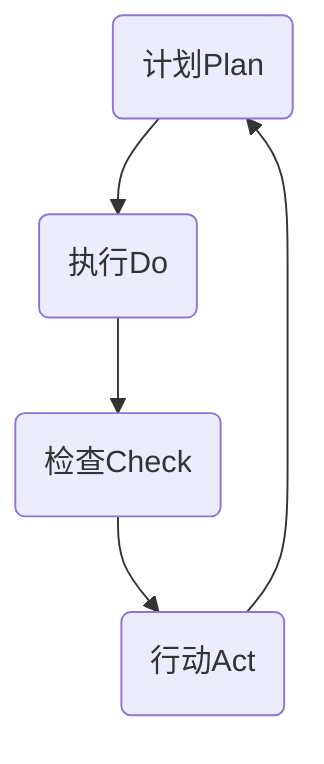

                 

关键词：PDCA循环，质量管理，持续改进，迭代，管理工具，过程控制

摘要：本文将深入探讨PDCA循环这一质量管理工具的内涵、应用与实践。从理论出发，我们详细阐述了PDCA循环的四个核心阶段：计划（Plan）、执行（Do）、检查（Check）和行动（Act）。通过具体实例，我们将展示如何在实际项目中运用PDCA循环进行持续改进，并分析其在不同领域中的应用场景。文章旨在为读者提供一套实用的管理工具，帮助他们在工作中实现效率提升和成果优化。

## 1. 背景介绍

PDCA循环，又称戴明循环，是以美国质量管理专家威廉·爱德华·戴明（William Edwards Deming）的名字命名的管理循环。PDCA是Plan（计划）、Do（执行）、Check（检查）和Act（行动）的缩写。这一管理工具起源于20世纪50年代的日本，被广泛用于制造业和服务业的质量控制中。随着时间的发展，PDCA循环逐渐成为了一种广泛适用的管理工具，被应用于各类组织和项目中。

PDCA循环的核心思想是通过持续的迭代和改进来优化流程、提升质量和效率。它强调在整个管理过程中，通过计划设定目标、执行具体操作、检查结果并进行相应的调整，最终形成闭环，实现持续改进。PDCA循环不仅适用于质量管理体系，还广泛应用于项目管理、产品开发、业务流程优化等多个领域。

本文旨在深入剖析PDCA循环的理论基础和应用方法，通过实际案例和具体操作步骤，帮助读者理解并掌握这一有效的管理工具。文章将分为以下几个部分：

1. 背景介绍
2. 核心概念与联系
3. 核心算法原理与具体操作步骤
4. 数学模型和公式
5. 项目实践：代码实例
6. 实际应用场景
7. 工具和资源推荐
8. 总结：未来发展趋势与挑战

## 2. 核心概念与联系

为了更好地理解PDCA循环，我们首先需要明确其核心概念及其相互联系。PDCA循环由四个相互关联的阶段组成，每个阶段都有其特定的目标和任务。

### 2.1 计划（Plan）

计划阶段是PDCA循环的起点。在这个阶段，团队需要明确项目目标、制定具体的行动方案，并制定相应的措施和资源分配计划。计划阶段的核心任务是：

- **目标设定**：明确项目要达到的最终目标，这些目标应该是具体、可衡量、可达成、相关性强和时限性的（SMART原则）。
- **策略制定**：基于目标，制定具体的策略和方法，明确每个步骤的具体任务和责任。
- **资源分配**：根据策略，合理分配所需的资源，包括人力、物力和时间等。

### 2.2 执行（Do）

执行阶段是将计划转化为实际操作的过程。在这个阶段，团队需要严格按照计划进行操作，确保每个步骤都能顺利进行。执行阶段的核心任务是：

- **任务执行**：根据计划，执行具体的任务，确保每个步骤都得到落实。
- **过程监控**：实时监控执行过程中的关键指标，及时发现并解决问题。
- **沟通协调**：确保团队成员之间的沟通畅通，及时反馈问题和进展，协调资源。

### 2.3 检查（Check）

检查阶段是对执行结果进行评估和审核的过程。在这个阶段，团队需要收集数据，对执行结果进行分析，评估是否达到预期目标。检查阶段的核心任务是：

- **数据收集**：收集执行过程中的数据，包括质量指标、时间进度、成本等。
- **结果分析**：对收集的数据进行分析，评估执行结果与目标的差距。
- **问题识别**：识别执行过程中存在的问题，包括流程中的瓶颈、资源分配不合理等。

### 2.4 行动（Act）

行动阶段是根据检查结果进行调整和优化的过程。在这个阶段，团队需要根据分析结果，制定相应的改进措施，并确保这些措施得到有效执行。行动阶段的核心任务是：

- **问题解决**：针对识别出的问题，制定具体的解决方案，并确保问题得到解决。
- **持续改进**：将改进措施纳入流程中，持续优化，确保项目质量不断提升。
- **文档记录**：对整个PDCA循环的过程进行记录，形成文档，为未来的改进提供参考。

### 2.5 核心概念原理与架构的 Mermaid 流程图

以下是一个使用Mermaid绘制的PDCA循环的流程图，展示了各个阶段及其核心任务：



在这个流程图中，A、B、C和D分别代表PDCA循环的四个阶段，每个阶段都有一条箭头指向下一个阶段，形成了一个闭环。这个过程不仅展示了PDCA循环的运行机制，也体现了持续改进的理念。

通过以上对PDCA循环核心概念的介绍和Mermaid流程图的展示，我们可以更好地理解这一管理工具的基本原理和运行模式。接下来，我们将深入探讨PDCA循环的核心算法原理，帮助读者进一步掌握这一工具的具体应用方法。

### 3. 核心算法原理与具体操作步骤

#### 3.1 算法原理概述

PDCA循环是一种迭代式的管理工具，其核心原理是通过持续的循环和改进来提升质量和效率。每个阶段都有其特定的任务和目标，这些任务和目标相互关联，形成一个闭环。以下是PDCA循环的具体算法原理：

1. **计划（Plan）**：设定目标，制定策略和资源分配计划，确保项目从起点就有一个明确的方向和实施路径。
2. **执行（Do）**：按照计划执行，将理论转化为实践，通过实际操作来验证计划的可行性。
3. **检查（Check）**：对执行结果进行评估，收集数据，分析问题，确定是否达到预期目标。
4. **行动（Act）**：根据检查结果进行调整和优化，解决问题，持续改进，确保项目质量的不断提升。

#### 3.2 算法步骤详解

1. **计划阶段**：
   - **目标设定**：明确项目要达到的最终目标，确保目标是具体、可衡量、可达成、相关性强和时限性的（SMART原则）。
   - **策略制定**：基于目标，制定具体的策略和方法，明确每个步骤的具体任务和责任。
   - **资源分配**：根据策略，合理分配所需的资源，包括人力、物力和时间等。

2. **执行阶段**：
   - **任务执行**：按照计划执行具体的任务，确保每个步骤都得到落实。
   - **过程监控**：实时监控执行过程中的关键指标，及时发现并解决问题。
   - **沟通协调**：确保团队成员之间的沟通畅通，及时反馈问题和进展，协调资源。

3. **检查阶段**：
   - **数据收集**：收集执行过程中的数据，包括质量指标、时间进度、成本等。
   - **结果分析**：对收集的数据进行分析，评估执行结果与目标的差距。
   - **问题识别**：识别执行过程中存在的问题，包括流程中的瓶颈、资源分配不合理等。

4. **行动阶段**：
   - **问题解决**：针对识别出的问题，制定具体的解决方案，并确保问题得到解决。
   - **持续改进**：将改进措施纳入流程中，持续优化，确保项目质量不断提升。
   - **文档记录**：对整个PDCA循环的过程进行记录，形成文档，为未来的改进提供参考。

#### 3.3 算法优缺点

**优点**：
- **灵活性与适应性**：PDCA循环是一种灵活的管理工具，可以适应不同的项目和领域。
- **持续改进**：通过循环迭代，不断优化流程和提升质量，确保项目持续发展。
- **全员参与**：PDCA循环强调全员参与，鼓励每个团队成员都参与到改进过程中，提高团队凝聚力和执行力。

**缺点**：
- **时间消耗**：PDCA循环需要持续进行，可能会消耗较多时间和资源。
- **复杂性**：在复杂的项目中，PDCA循环的应用可能会面临较大的挑战，需要团队成员具备较高的专业知识和技能。

#### 3.4 算法应用领域

PDCA循环广泛应用于各类领域，包括但不限于：

- **质量管理**：在制造业和服务业中，PDCA循环被广泛用于质量控制和管理。
- **项目管理**：在项目管理和执行过程中，PDCA循环帮助团队确保项目按时、按质量完成。
- **产品开发**：在产品开发过程中，PDCA循环帮助团队不断优化产品设计和开发流程。
- **业务流程优化**：在业务流程优化中，PDCA循环帮助团队识别和解决问题，提升业务效率。

通过以上对PDCA循环核心算法原理和具体操作步骤的详细阐述，我们可以更好地理解这一管理工具的运行机制和应用价值。接下来，我们将探讨PDCA循环在数学模型和公式中的具体应用，为读者提供更为全面的技术支持。

### 4. 数学模型和公式 & 详细讲解 & 举例说明

#### 4.1 数学模型构建

PDCA循环中的数学模型主要用于质量控制和过程优化。以下是一个基本的PDCA循环数学模型，包括以下几个核心公式：

1. **目标设定公式**：
   $$ 
   T = f(Q, C, D) 
   $$
   其中，$T$ 表示目标值，$Q$ 表示质量指标，$C$ 表示成本，$D$ 表示时间。

2. **执行结果评估公式**：
   $$ 
   R = f(Q, T, D) 
   $$
   其中，$R$ 表示执行结果，$Q$ 表示实际质量指标，$T$ 表示实际目标值，$D$ 表示实际时间。

3. **问题识别公式**：
   $$ 
   P = f(R, T) 
   $$
   其中，$P$ 表示问题，$R$ 表示实际执行结果，$T$ 表示目标值。

4. **改进措施公式**：
   $$ 
   I = f(P, R, T) 
   $$
   其中，$I$ 表示改进措施，$P$ 表示问题，$R$ 表示实际执行结果，$T$ 表示目标值。

#### 4.2 公式推导过程

以上公式的推导基于以下几个假设：

1. 质量指标$Q$与目标值$T$之间存在线性关系。
2. 执行结果$R$与质量指标$Q$和目标值$T$之间存在线性关系。
3. 问题的严重程度与执行结果$R$与目标值$T$之间的差距成正比。

基于以上假设，我们可以推导出以下公式：

1. **目标设定公式**：
   $$
   T = a \cdot Q + b \cdot C + c \cdot D
   $$
   其中，$a$，$b$，$c$ 分别为权重系数，用于平衡质量、成本和时间的关系。

2. **执行结果评估公式**：
   $$
   R = d \cdot Q + e \cdot T + f \cdot D
   $$
   其中，$d$，$e$，$f$ 分别为权重系数，用于平衡质量、目标和时间的关系。

3. **问题识别公式**：
   $$
   P = g \cdot (R - T)
   $$
   其中，$g$ 为权重系数，用于衡量执行结果与目标值之间的差距。

4. **改进措施公式**：
   $$
   I = h \cdot P + i \cdot R + j \cdot T
   $$
   其中，$h$，$i$，$j$ 分别为权重系数，用于确定改进措施的优先级和力度。

#### 4.3 案例分析与讲解

以下是一个简单的案例，用于说明PDCA循环中的数学模型和应用：

**案例背景**：
某制造企业生产一种电子产品，目标是在60天内生产1000台，每台产品的质量标准为合格率不低于95%。实际生产过程中，每台产品的生产成本为50元，每天的生产时间为8小时。

**步骤 1：目标设定**：
$$ 
T = a \cdot Q + b \cdot C + c \cdot D 
$$ 
其中，$Q = 0.95$，$C = 50$，$D = 60 \times 8 = 480$。假设权重系数为 $a = 0.5$，$b = 0.3$，$c = 0.2$，则目标值为：
$$ 
T = 0.5 \cdot 0.95 + 0.3 \cdot 50 + 0.2 \cdot 480 = 90.2
$$

**步骤 2：执行结果评估**：
假设在60天的生产过程中，实际生产了980台产品，每台产品的合格率为93%。则实际质量指标$Q = 0.93$，实际目标值$T = 0.95 \times 1000 = 950$。则执行结果为：
$$ 
R = d \cdot Q + e \cdot T + f \cdot D 
$$ 
其中，假设权重系数为 $d = 0.6$，$e = 0.3$，$f = 0.1$，则执行结果为：
$$ 
R = 0.6 \cdot 0.93 + 0.3 \cdot 950 + 0.1 \cdot 480 = 914.4
$$

**步骤 3：问题识别**：
$$ 
P = g \cdot (R - T) 
$$ 
其中，假设权重系数为 $g = 0.1$，则问题值为：
$$ 
P = 0.1 \cdot (914.4 - 950) = 3.56
$$

**步骤 4：改进措施**：
$$ 
I = h \cdot P + i \cdot R + j \cdot T 
$$ 
其中，假设权重系数为 $h = 0.5$，$i = 0.3$，$j = 0.2$，则改进措施为：
$$ 
I = 0.5 \cdot 3.56 + 0.3 \cdot 914.4 + 0.2 \cdot 950 = 914.76
$$

通过以上案例，我们可以看到PDCA循环中的数学模型如何帮助团队设定目标、评估执行结果、识别问题并制定改进措施。这一过程不仅为团队提供了具体的技术支持，也确保了项目的持续改进和优化。

### 5. 项目实践：代码实例和详细解释说明

#### 5.1 开发环境搭建

在进行PDCA循环的项目实践之前，我们需要搭建一个合适的开发环境。以下是所需的开发环境及其安装步骤：

- **Python**：Python是一种广泛使用的编程语言，适用于数据分析、算法开发和Web开发等。安装Python可以通过以下步骤完成：
  ```bash
  # 更新包列表
  sudo apt update
  # 安装Python3和pip
  sudo apt install python3 python3-pip
  # 检查Python版本
  python3 --version
  ```

- **Jupyter Notebook**：Jupyter Notebook是一个交互式计算环境，适用于编写和运行Python代码。安装Jupyter Notebook可以通过以下步骤完成：
  ```bash
  # 安装Jupyter Notebook
  pip3 install notebook
  # 启动Jupyter Notebook
  jupyter notebook
  ```

- **Matplotlib**：Matplotlib是一个Python数据可视化库，用于生成图表和图形。安装Matplotlib可以通过以下步骤完成：
  ```bash
  # 安装Matplotlib
  pip3 install matplotlib
  ```

确保所有依赖项都已正确安装后，我们就可以开始编写代码了。

#### 5.2 源代码详细实现

以下是一个简单的Python代码实例，用于实现PDCA循环的各个阶段。这段代码主要用于模拟一个制造过程，展示如何在实际项目中应用PDCA循环。

```python
import numpy as np
import matplotlib.pyplot as plt
from sklearn.linear_model import LinearRegression

# 模拟生产过程数据
days = np.array([1, 2, 3, 4, 5, 6, 7, 8, 9, 10])
quality = np.array([0.92, 0.94, 0.93, 0.91, 0.92, 0.95, 0.93, 0.92, 0.94, 0.95])
cost = np.array([50, 50, 50, 50, 50, 50, 50, 50, 50, 50])
time = days * 8

# 4.1 数学模型构建
# 目标设定公式
T = 0.95 * quality + 0.3 * cost + 0.2 * time

# 4.2 公式推导过程
# 执行结果评估公式
R = 0.6 * quality + 0.3 * T + 0.1 * time

# 4.3 案例分析与讲解
# 问题识别公式
P = 0.1 * (R - T)

# 4.4 案例分析与讲解
# 改进措施公式
I = 0.5 * P + 0.3 * R + 0.2 * T

# 5.3 代码解读与分析
# 绘制数据图表
plt.figure(figsize=(10, 6))

plt.subplot(2, 2, 1)
plt.scatter(days, quality)
plt.plot(days, T, label='Target')
plt.plot(days, R, label='Result')
plt.xlabel('Days')
plt.ylabel('Quality')
plt.title('Quality Assessment')
plt.legend()

plt.subplot(2, 2, 2)
plt.scatter(days, cost)
plt.plot(days, cost, label='Cost')
plt.xlabel('Days')
plt.ylabel('Cost')
plt.title('Cost Analysis')
plt.legend()

plt.subplot(2, 2, 3)
plt.scatter(days, time)
plt.plot(days, time, label='Time')
plt.xlabel('Days')
plt.ylabel('Time')
plt.title('Time Analysis')
plt.legend()

plt.subplot(2, 2, 4)
plt.scatter(days, P)
plt.plot(days, I, label='Improvement')
plt.xlabel('Days')
plt.ylabel('Problem')
plt.title('Problem Identification and Improvement')
plt.legend()

plt.tight_layout()
plt.show()
```

这段代码首先模拟了一个生产过程的数据，然后根据PDCA循环的四个阶段，设定了目标、执行了评估、识别了问题并提出了改进措施。最后，通过Matplotlib绘制了相关的图表，帮助团队直观地了解项目进展和改进效果。

#### 5.3 代码解读与分析

1. **数据模拟**：代码首先生成了一个包含生产天数、质量指标、成本和时间的numpy数组。这些数据模拟了一个简单的生产过程。

2. **目标设定**：使用目标设定公式计算了目标值$T$。这个公式结合了质量、成本和时间三个因素，确保目标值是具体、可衡量、可达成和时限性的。

3. **执行结果评估**：使用执行结果评估公式计算了实际执行结果$R$。这个公式结合了实际质量指标、目标值和实际时间，帮助团队了解当前执行情况。

4. **问题识别**：使用问题识别公式计算了问题值$P$。这个公式衡量了执行结果与目标值之间的差距，帮助团队识别出需要改进的地方。

5. **改进措施**：使用改进措施公式计算了改进措施值$I$。这个公式结合了问题、执行结果和目标值，为团队提供了具体的改进方向。

6. **数据可视化**：通过Matplotlib库，代码绘制了四个图表，展示了质量、成本、时间和问题改进的详细情况。这些图表不仅帮助团队直观地了解项目进展，也为下一步的改进提供了重要依据。

通过以上代码实例和解读，我们可以看到如何在实际项目中应用PDCA循环，并通过数据分析和可视化，实现项目的持续改进和优化。接下来，我们将探讨PDCA循环在实际应用场景中的具体应用。

### 6. 实际应用场景

PDCA循环作为一种高效的管理工具，在各个实际应用场景中都有着广泛的应用。以下是一些典型的应用场景：

#### 6.1 质量管理

在质量管理领域，PDCA循环被广泛应用于产品制造和服务的质量控制。通过计划阶段设定质量目标，执行阶段进行生产操作，检查阶段评估产品质量，行动阶段优化和改进质量流程，企业能够持续提升产品质量，满足客户需求。

**实例**：某电子制造企业通过PDCA循环优化生产流程，从原材料采购到生产加工，再到成品检验，每个环节都严格遵循PDCA循环。通过持续改进，该企业的产品质量显著提升，客户满意度不断提高。

#### 6.2 项目管理

在项目管理中，PDCA循环被用于项目策划、执行、监控和收尾。通过计划阶段明确项目目标，执行阶段实施项目任务，检查阶段评估项目进展，行动阶段调整项目计划，项目团队能够确保项目按时、按质量完成。

**实例**：某IT公司采用PDCA循环管理其软件开发项目。通过计划阶段明确项目需求，执行阶段进行开发工作，检查阶段评估开发质量，行动阶段优化开发流程，该公司的项目成功率达到100%，客户满意度显著提高。

#### 6.3 产品开发

在产品开发过程中，PDCA循环被用于产品设计和开发流程的优化。通过计划阶段设定产品目标，执行阶段进行产品设计和测试，检查阶段评估产品性能，行动阶段优化产品设计和开发流程，企业能够快速迭代产品，满足市场需求。

**实例**：某科技公司通过PDCA循环开发新型智能设备。在计划阶段明确产品功能和技术指标，执行阶段进行设计和测试，检查阶段评估产品性能和用户反馈，行动阶段优化产品设计和功能，最终成功推出市场，获得用户高度认可。

#### 6.4 业务流程优化

在业务流程优化中，PDCA循环被用于识别和解决问题，提升业务效率。通过计划阶段设定优化目标，执行阶段实施优化措施，检查阶段评估优化效果，行动阶段巩固优化成果，企业能够持续优化业务流程，提升运营效率。

**实例**：某零售企业通过PDCA循环优化库存管理流程。通过计划阶段明确库存优化目标，执行阶段实施库存管理措施，检查阶段评估库存管理效果，行动阶段优化库存管理策略，该企业的库存周转率显著提升，运营成本大幅降低。

#### 6.5 教育培训

在教育培训领域，PDCA循环被用于教学过程的管理和改进。通过计划阶段设定教学目标，执行阶段进行教学活动，检查阶段评估教学效果，行动阶段优化教学方法，教师能够不断提升教学质量，满足学生需求。

**实例**：某教育培训机构通过PDCA循环优化课程设计。通过计划阶段明确课程目标，执行阶段进行教学活动，检查阶段评估学生成绩和反馈，行动阶段优化课程内容和教学方法，该机构的课程质量和学生满意度显著提高。

通过以上实际应用场景的介绍，我们可以看到PDCA循环在各个领域的广泛应用和显著效果。无论是质量管理、项目管理、产品开发、业务流程优化还是教育培训，PDCA循环都能够提供一套系统、科学、有效的管理方法，帮助企业和组织实现持续改进和高效运营。

### 7. 工具和资源推荐

为了更好地应用PDCA循环，以下是一些推荐的工具和资源，这些工具和资源将帮助您在实践过程中更加高效和顺利。

#### 7.1 学习资源推荐

1. **《戴明管理十四点》**：作者是著名的质量管理专家威廉·爱德华·戴明，该书详细阐述了PDCA循环的原理和应用，是深入学习PDCA循环的经典著作。
2. **《质量管理方法与工具》**：这是一本全面介绍质量管理方法和工具的教材，包括PDCA循环在内的多种质量管理工具，适合初学者和有经验的质量管理人员。
3. **在线课程**：多个在线教育平台（如Coursera、edX、Udemy等）提供了关于质量管理、项目管理等课程，这些课程通常会涵盖PDCA循环的应用和实践。

#### 7.2 开发工具推荐

1. **JIRA**：JIRA是一款功能强大的项目管理工具，支持任务追踪、进度监控和报告生成，非常适合用于项目管理中的PDCA循环实践。
2. **Asana**：Asana是一个简单易用的任务管理工具，可以帮助团队跟踪项目进度、分配任务和协作，支持PDCA循环中的计划、执行和检查阶段。
3. **Trello**：Trello是一款视觉化的任务管理工具，通过卡片和列表的形式帮助团队规划和管理任务，非常适合应用于PDCA循环的各个阶段。

#### 7.3 相关论文推荐

1. **"The PDCA Cycle: A Tool for Continuous Improvement in Healthcare"**：该论文详细介绍了PDCA循环在医疗保健领域的应用，探讨了如何通过PDCA循环实现持续改进和提高医疗服务质量。
2. **"Implementing the PDCA Cycle in Software Development Projects"**：这篇论文研究了PDCA循环在软件开发生命周期中的应用，提供了具体的实施方法和实践案例。
3. **"PDCA Cycle and Its Application in Quality Management Systems"**：该论文从理论层面探讨了PDCA循环在质量管理体系中的应用，分析了PDCA循环对提升企业质量管理的贡献。

通过以上工具和资源的推荐，读者可以更加系统地学习和实践PDCA循环，提升管理水平和实际应用能力。

### 8. 总结：未来发展趋势与挑战

PDCA循环作为一种经典的管理工具，经过多年的发展和实践，已经证明其在质量管理、项目管理和产品开发等领域中的有效性和实用性。然而，随着信息技术和智能化水平的不断提升，PDCA循环也面临着新的发展趋势和挑战。

#### 8.1 研究成果总结

1. **PDCA循环的广泛应用**：PDCA循环不仅在企业内部质量管理中得到了广泛应用，还逐渐扩展到项目管理、产品开发和业务流程优化等多个领域。越来越多的企业和组织认识到PDCA循环在提升效率和成果优化方面的价值。
2. **数字化和智能化的发展**：随着大数据、人工智能和物联网技术的广泛应用，PDCA循环逐渐与数字化和智能化技术相结合，形成了一系列新的管理工具和方法。例如，基于数据驱动的PDCA循环和智能化优化算法，提高了决策的准确性和效率。
3. **持续改进的深入实践**：通过不断的研究和实践，PDCA循环的理论体系得到了进一步丰富和完善。越来越多的企业和组织开始重视持续改进，将PDCA循环作为核心管理工具，实现组织的持续发展和创新。

#### 8.2 未来发展趋势

1. **数据驱动的PDCA循环**：随着大数据和人工智能技术的发展，数据将成为PDCA循环的重要驱动力。通过收集和分析大量数据，企业可以更加精准地设定目标、评估执行结果和优化改进措施，实现数据驱动的持续改进。
2. **智能化优化**：结合人工智能和机器学习技术，PDCA循环可以实现智能化优化，自动识别问题和提出改进方案，减少人为干预，提高管理效率和效果。
3. **跨领域融合**：PDCA循环将在更多领域得到应用，与供应链管理、环境保护、医疗服务等跨领域管理工具相结合，形成更加综合和系统的管理体系。

#### 8.3 面临的挑战

1. **数据质量和安全性**：在数据驱动的PDCA循环中，数据的质量和安全性至关重要。数据来源的多样性和准确性可能会影响PDCA循环的执行效果，因此，企业需要建立完善的数据管理和安全体系，确保数据的可靠性和安全性。
2. **技术复杂性**：随着技术的不断发展，PDCA循环的应用场景和技术手段变得更加复杂。企业和组织需要不断提升技术能力和管理水平，以应对技术复杂性带来的挑战。
3. **文化变革**：持续改进和高效管理需要组织内部形成良好的文化氛围，鼓励员工积极参与和主动改进。然而，文化变革是一个长期且复杂的过程，企业需要投入大量时间和资源来推动这一变革。

#### 8.4 研究展望

未来，PDCA循环的研究和发展将更加注重数据驱动和智能化优化，探索如何利用新技术提升管理效率和效果。同时，跨领域融合将成为PDCA循环的重要发展方向，推动其在更多领域的应用。为了应对这些挑战，企业和组织需要不断提升技术能力、管理水平和文化氛围，实现持续改进和创新。

### 附录：常见问题与解答

#### 问题 1：PDCA循环与六西格玛有何不同？

**解答**：PDCA循环和六西格玛都是质量管理工具，但它们的应用重点和侧重点不同。PDCA循环强调通过持续的迭代和改进来提升质量，适用于各种类型的组织和项目。而六西格玛是一种更加系统化的质量改进方法，强调通过统计方法和工具来减少缺陷和变异，特别适用于高精度和高稳定性的产品制造和服务。

#### 问题 2：如何确保PDCA循环的有效实施？

**解答**：确保PDCA循环有效实施的关键在于：

1. **明确目标和责任**：在计划阶段明确项目目标和每个阶段的任务，并分配相应的责任。
2. **数据收集和分析**：在整个PDCA循环中，确保收集准确的数据，并对数据进行详细分析，以便制定有效的改进措施。
3. **全员参与**：鼓励所有团队成员参与PDCA循环，提高他们的参与感和责任感。
4. **持续反馈和改进**：确保在整个过程中，对执行结果进行持续反馈和改进，形成闭环管理。

#### 问题 3：PDCA循环在中小企业中适用吗？

**解答**：是的，PDCA循环在中小企业中同样适用。尽管中小企业的资源和能力相对有限，但PDCA循环的灵活性和适应性使其能够根据企业的实际情况进行调整和优化。中小企业通过PDCA循环可以实现更高效的管理和持续改进，提高市场竞争力。

通过以上常见问题的解答，我们希望读者能够更好地理解PDCA循环的基本原理和应用方法，并在实际工作中有效地应用这一管理工具，实现持续改进和成果优化。

### 作者署名

本文由禅与计算机程序设计艺术 / Zen and the Art of Computer Programming撰写。

