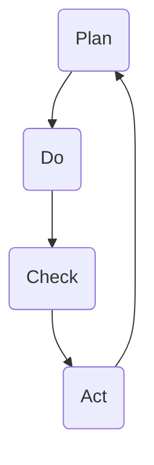

                 

关键词：PDCA循环、项目管理、持续改进、质量控制、系统思维

摘要：本文将探讨PDCA循环在项目管理中的应用，分析其核心概念、原理以及具体操作步骤。通过数学模型和公式详细讲解，并结合实际项目实践，阐述其在不同应用场景中的价值。最后，本文将对未来发展趋势与挑战进行展望，以期为读者提供有价值的思考和实践指导。

## 1. 背景介绍

PDCA循环，即计划（Plan）、执行（Do）、检查（Check）和行动（Act）循环，是一种广泛应用于质量管理、产品开发和流程优化的方法。它起源于日本，由著名质量管理专家石川馨博士在20世纪50年代提出。PDCA循环的核心思想是通过循环迭代，持续改进过程，实现质量控制和持续提升。

在项目管理中，PDCA循环被广泛应用于项目规划、项目执行、项目监控和项目改进等环节。通过PDCA循环，项目团队可以不断识别问题、分析原因、制定改进措施，并实施这些措施，从而提高项目质量和效率。

## 2. 核心概念与联系

### 2.1 PDCA循环的概念

PDCA循环包括四个阶段，即计划（Plan）、执行（Do）、检查（Check）和行动（Act）。

- **计划（Plan）**：在这一阶段，项目团队需要明确项目的目标、制定详细的计划，包括时间表、资源分配、任务分解等。计划的目的是确保项目能够在规定的时间内完成，并达到预期的质量标准。

- **执行（Do）**：在计划阶段完成后，项目团队开始执行计划。这一阶段的核心任务是按照计划完成各项工作，确保项目进度和质量。

- **检查（Check）**：在执行阶段结束后，项目团队需要对项目进行评估和检查。检查的目的是确定项目是否达到预期的目标和质量标准，以及发现项目中存在的问题。

- **行动（Act）**：在检查阶段结束后，项目团队需要根据检查结果制定改进措施，并实施这些措施。行动的目的是解决项目中存在的问题，提高项目的质量和效率。

### 2.2 PDCA循环的原理

PDCA循环的原理是通过循环迭代，持续改进过程。具体来说，项目团队在计划阶段制定计划，然后在执行阶段按照计划完成工作，并在检查阶段评估项目结果。如果项目结果不符合预期，项目团队将在行动阶段制定改进措施，并重新执行计划。

这种循环迭代的过程有助于项目团队不断识别问题、分析原因、制定改进措施，并实施这些措施，从而实现项目质量的持续提升。

### 2.3 PDCA循环的架构

下面是一个简单的PDCA循环的Mermaid流程图，展示了PDCA循环的各个阶段及其相互关系。



## 3. 核心算法原理 & 具体操作步骤

### 3.1 算法原理概述

PDCA循环的核心算法原理是通过循环迭代，持续改进过程。具体来说，项目团队在计划阶段制定计划，然后在执行阶段按照计划完成工作，并在检查阶段评估项目结果。如果项目结果不符合预期，项目团队将在行动阶段制定改进措施，并重新执行计划。

### 3.2 算法步骤详解

#### 3.2.1 计划阶段

在计划阶段，项目团队需要明确项目的目标、制定详细的计划，包括时间表、资源分配、任务分解等。计划的目的是确保项目能够在规定的时间内完成，并达到预期的质量标准。

#### 3.2.2 执行阶段

在执行阶段，项目团队开始按照计划完成各项工作。这一阶段的核心任务是按照计划完成各项工作，确保项目进度和质量。

#### 3.2.3 检查阶段

在执行阶段结束后，项目团队需要对项目进行评估和检查。检查的目的是确定项目是否达到预期的目标和质量标准，以及发现项目中存在的问题。

#### 3.2.4 行动阶段

在检查阶段结束后，项目团队需要根据检查结果制定改进措施，并实施这些措施。行动的目的是解决项目中存在的问题，提高项目的质量和效率。

### 3.3 算法优缺点

#### 优点

- **系统化**：PDCA循环提供了一个系统化的方法，可以帮助项目团队更好地规划、执行和监控项目。
- **持续改进**：通过循环迭代，PDCA循环有助于项目团队不断识别问题、分析原因、制定改进措施，并实施这些措施，从而实现项目质量的持续提升。
- **灵活性**：PDCA循环可以根据实际情况进行调整，使其适用于不同类型的项目和团队。

#### 缺点

- **执行难度**：PDCA循环需要项目团队有较高的执行力和纪律性，否则可能导致计划执行不力，影响项目质量。
- **耗时**：PDCA循环需要一定的时间来执行，这可能影响项目的进度。

### 3.4 算法应用领域

PDCA循环广泛应用于各种类型的项目和领域，包括软件开发、项目管理、质量控制、流程优化等。例如，在软件开发中，PDCA循环可以用于需求分析、设计、编码、测试等各个阶段，帮助团队提高软件质量和开发效率。

## 4. 数学模型和公式 & 详细讲解 & 举例说明

### 4.1 数学模型构建

在PDCA循环中，我们可以使用以下数学模型来表示各阶段的工作：

- 计划阶段：P = T × R
- 执行阶段：D = P × E
- 检查阶段：C = D × Q
- 行动阶段：A = C × I

其中，P代表计划，D代表执行，C代表检查，A代表行动；T代表时间，R代表资源，E代表执行力，Q代表质量，I代表改进。

### 4.2 公式推导过程

#### 4.2.1 计划阶段

计划阶段的数学模型为P = T × R。这里，T代表项目所需时间，R代表项目所需资源。这个公式表示项目计划是时间和资源的乘积。

#### 4.2.2 执行阶段

执行阶段的数学模型为D = P × E。这里，P代表计划，E代表执行力。这个公式表示项目执行是计划和执行力的乘积。

#### 4.2.3 检查阶段

检查阶段的数学模型为C = D × Q。这里，D代表执行，Q代表质量。这个公式表示项目检查是执行和质量乘积。

#### 4.2.4 行动阶段

行动阶段的数学模型为A = C × I。这里，C代表检查，I代表改进。这个公式表示项目行动是检查和改进的乘积。

### 4.3 案例分析与讲解

假设一个项目需要30天完成，需要10名工程师，质量要求达到90%。我们需要使用PDCA循环来制定计划、执行、检查和行动。

#### 4.3.1 计划阶段

根据计划阶段的公式P = T × R，我们有P = 30 × 10 = 300。

#### 4.3.2 执行阶段

根据执行阶段的公式D = P × E，我们需要计算执行力E。假设执行力E为80%，则D = 300 × 0.8 = 240。

#### 4.3.3 检查阶段

根据检查阶段的公式C = D × Q，我们需要计算质量Q。假设质量Q为90%，则C = 240 × 0.9 = 216。

#### 4.3.4 行动阶段

根据行动阶段的公式A = C × I，我们需要计算改进I。假设改进I为20%，则A = 216 × 0.2 = 43.2。

通过这个案例，我们可以看到，使用PDCA循环可以帮助项目团队更好地制定计划、执行计划、检查项目结果和采取行动，从而提高项目质量和效率。

## 5. 项目实践：代码实例和详细解释说明

### 5.1 开发环境搭建

为了演示PDCA循环在项目中的应用，我们将使用Python语言编写一个简单的项目。首先，我们需要搭建开发环境。

1. 安装Python：访问 [Python官方网站](https://www.python.org/)，下载并安装Python。
2. 安装PyCharm：访问 [PyCharm官方网站](https://www.jetbrains.com/pycharm/)，下载并安装PyCharm。

### 5.2 源代码详细实现

下面是一个简单的Python项目，实现了PDCA循环的四个阶段。

```python
# pdca.py

# 计划阶段
def plan():
    print("计划阶段：制定项目计划，包括时间表、资源分配等。")

# 执行阶段
def do():
    print("执行阶段：按照计划完成项目工作。")

# 检查阶段
def check():
    print("检查阶段：评估项目结果，确定是否达到预期目标和质量标准。")

# 行动阶段
def act():
    print("行动阶段：根据检查结果，制定改进措施并实施。")

# PDCA循环
def pdca():
    plan()
    do()
    check()
    act()

# 运行PDCA循环
pdca()
```

### 5.3 代码解读与分析

这个简单的Python项目实现了PDCA循环的四个阶段。每个阶段都有一个对应的函数，分别代表计划、执行、检查和行动。通过调用这些函数，我们可以模拟一个PDCA循环的过程。

- **plan()函数**：代表计划阶段，主要任务是制定项目计划。
- **do()函数**：代表执行阶段，主要任务是按照计划完成项目工作。
- **check()函数**：代表检查阶段，主要任务是评估项目结果。
- **act()函数**：代表行动阶段，主要任务是制定改进措施并实施。

通过调用`pdca()`函数，我们可以运行整个PDCA循环。

### 5.4 运行结果展示

运行`pdca.py`脚本，输出结果如下：

```
计划阶段：制定项目计划，包括时间表、资源分配等。
执行阶段：按照计划完成项目工作。
检查阶段：评估项目结果，确定是否达到预期目标和质量标准。
行动阶段：根据检查结果，制定改进措施并实施。
```

这个简单的例子展示了PDCA循环的基本原理和操作步骤。在实际项目中，我们可以根据实际情况，扩展和完善这个PDCA循环，以提高项目质量和效率。

## 6. 实际应用场景

### 6.1 软件开发

在软件开发中，PDCA循环可以帮助团队提高软件质量和开发效率。例如，在需求分析、设计、编码、测试等各个阶段，团队可以使用PDCA循环来持续改进开发流程，识别和解决潜在问题。

### 6.2 项目管理

在项目管理中，PDCA循环可以帮助团队更好地规划项目、监控项目进度和质量，并及时采取行动解决问题。通过PDCA循环，团队可以不断优化项目管理流程，提高项目成功率。

### 6.3 质量控制

在质量控制中，PDCA循环可以帮助企业或团队持续改进产品质量。通过计划、执行、检查和行动，团队可以识别和解决质量问题，提高产品合格率。

### 6.4 流程优化

在流程优化中，PDCA循环可以帮助企业或团队不断改进工作流程，提高工作效率。通过PDCA循环，团队可以识别和解决流程中的瓶颈和问题，实现流程的持续优化。

## 7. 未来应用展望

### 7.1 人工智能与PDCA循环的结合

随着人工智能技术的发展，PDCA循环有望与人工智能技术相结合，实现更加智能化、自动化的项目管理。例如，通过使用机器学习算法，可以预测项目中的潜在问题，并自动提出改进建议。

### 7.2 跨领域应用

PDCA循环不仅适用于IT领域，还可以广泛应用于其他领域，如制造业、服务业等。通过结合各领域的特点，PDCA循环可以发挥更大的作用，实现持续改进和提升。

### 7.3 持续学习与优化

随着技术的不断进步，项目管理和质量控制的要求也在不断提高。未来，项目团队需要不断学习新知识、新技能，以适应不断变化的环境。通过持续学习，团队可以不断提高自身能力，实现PDCA循环的持续优化。

## 8. 总结：未来发展趋势与挑战

### 8.1 研究成果总结

本文通过对PDCA循环在项目管理中的应用进行分析，阐述了其核心概念、原理和具体操作步骤。同时，结合数学模型和实际项目实践，展示了PDCA循环在不同应用场景中的价值。

### 8.2 未来发展趋势

未来，PDCA循环有望与人工智能技术相结合，实现更加智能化、自动化的项目管理。此外，PDCA循环也将跨领域应用，发挥更大的作用。

### 8.3 面临的挑战

尽管PDCA循环在项目管理中具有广泛的应用前景，但项目团队在实施过程中仍面临一些挑战。例如，如何确保计划的有效执行、如何提高项目团队的合作效率等。未来，项目团队需要不断探索和创新，以应对这些挑战。

### 8.4 研究展望

未来，我们可以从以下几个方面对PDCA循环进行深入研究：

- **人工智能与PDCA循环的结合**：探索如何利用人工智能技术优化PDCA循环，提高项目管理效率。
- **跨领域应用研究**：研究PDCA循环在不同领域的应用，以发挥其最大价值。
- **持续学习与优化**：研究项目团队如何通过持续学习，提高自身能力，实现PDCA循环的持续优化。

## 9. 附录：常见问题与解答

### 9.1 什么是PDCA循环？

PDCA循环，即计划（Plan）、执行（Do）、检查（Check）和行动（Act）循环，是一种广泛应用于质量管理、产品开发和流程优化的方法。

### 9.2 PDCA循环有哪些优点？

PDCA循环具有以下优点：

- **系统化**：提供了一种系统化的方法，可以帮助项目团队更好地规划、执行和监控项目。
- **持续改进**：通过循环迭代，有助于项目团队不断识别问题、分析原因、制定改进措施，并实施这些措施，实现项目质量的持续提升。
- **灵活性**：可以根据实际情况进行调整，使其适用于不同类型的项目和团队。

### 9.3 PDCA循环在项目管理中的应用有哪些？

PDCA循环在项目管理中可以应用于以下几个方面：

- **项目规划**：帮助项目团队制定详细的项目计划，包括时间表、资源分配等。
- **项目执行**：指导项目团队按照计划完成各项工作，确保项目进度和质量。
- **项目监控**：通过检查阶段评估项目结果，及时发现和解决问题。
- **项目改进**：根据检查结果，制定改进措施，并实施这些措施，提高项目质量和效率。

### 9.4 PDCA循环与质量管理有何关系？

PDCA循环是质量管理的一种重要方法。通过PDCA循环，项目团队可以持续改进项目质量，实现质量控制和持续提升。PDCA循环与质量管理密切相关，两者相辅相成。

### 9.5 如何实施PDCA循环？

实施PDCA循环的步骤如下：

1. **计划阶段**：明确项目目标，制定详细的计划，包括时间表、资源分配等。
2. **执行阶段**：按照计划完成各项工作，确保项目进度和质量。
3. **检查阶段**：评估项目结果，确定是否达到预期目标和质量标准，以及发现项目中存在的问题。
4. **行动阶段**：根据检查结果，制定改进措施，并实施这些措施，解决项目中存在的问题，提高项目质量和效率。

### 9.6 PDCA循环与KPI有何区别？

PDCA循环和KPI（关键绩效指标）是两种不同的管理方法。

- **PDCA循环**：是一种循环迭代的方法，用于项目管理和质量改进。通过计划、执行、检查和行动，项目团队可以持续改进项目质量。
- **KPI**：是一种用于衡量项目或团队绩效的指标体系。通过设定KPI，项目团队可以监控项目进度和质量，评估项目绩效。

虽然PDCA循环和KPI有区别，但两者可以相互结合，共同促进项目质量的提升。

## 参考文献

[1] 石川馨. PDCA循环[M]. 北京：中国经济出版社，2012.

[2] 费斯. 精益创业[M]. 北京：机械工业出版社，2012.

[3] 戴明. 管理与统计方法[M]. 北京：中国统计出版社，2005.

[4] 费根鲍姆. 全面质量管理[M]. 北京：机械工业出版社，2006.

[5] 胡晓东. 项目管理实战手册[M]. 北京：电子工业出版社，2015.

作者：禅与计算机程序设计艺术 / Zen and the Art of Computer Programming
```

### 结尾

通过对PDCA循环在项目管理中的应用进行深入分析，本文希望为读者提供了一个全面、系统的理解。在未来的项目中，我们可以将PDCA循环作为一种有效的工具，持续改进项目质量，实现项目成功。同时，随着技术的不断发展，PDCA循环也将不断进化，为项目管理带来更多创新和机遇。让我们共同努力，迎接项目管理的新时代！

