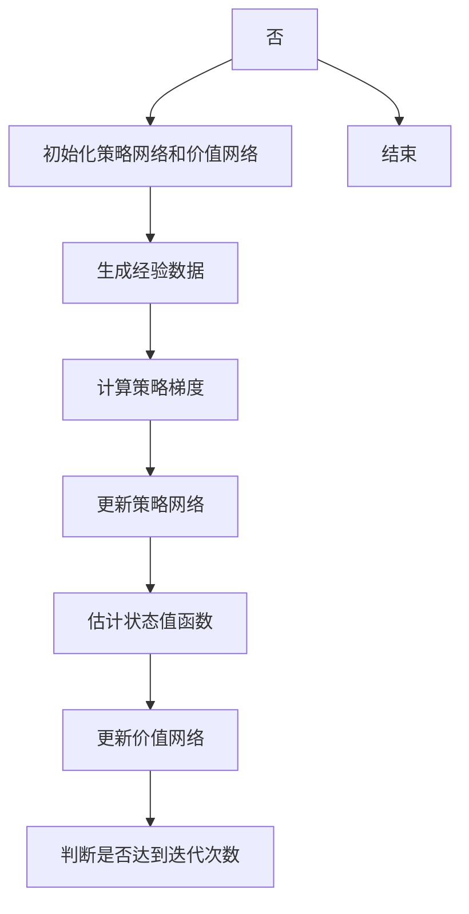

                 

关键词：PPO，强化学习，策略优化，近端策略优化，深度学习，代码实例，实践应用，未来展望

## 摘要

本文旨在深入探讨PPO（近端策略优化）算法，一种在深度强化学习中广泛应用的策略优化方法。通过详细介绍PPO算法的原理、数学模型、实现步骤以及实际应用，本文将帮助读者全面理解PPO算法的各个方面，掌握其核心思想。此外，本文还将提供完整的代码实例，并对代码进行详细解读，以便读者能够更好地实践和应用PPO算法。最后，本文将对PPO算法的未来发展趋势和挑战进行展望，为读者提供更广阔的视野。

## 1. 背景介绍

### 强化学习

强化学习（Reinforcement Learning，RL）是机器学习的一个重要分支，其核心任务是使一个智能体（Agent）在与环境（Environment）的交互过程中，通过学习获取最优策略（Policy），从而实现任务目标。强化学习与监督学习和无监督学习不同，其反馈信号不是预先标记好的标签，而是通过与环境的交互获得的奖励（Reward）。

### 策略优化

策略优化（Policy Optimization）是强化学习的一种方法，旨在通过优化策略函数，使智能体在特定环境下能够获得最大奖励。策略优化方法通常分为两种：值函数方法和策略函数方法。值函数方法通过优化值函数来指导策略，而策略函数方法则直接优化策略函数。

### 近端策略优化

近端策略优化（Proximal Policy Optimization，PPO）是一种在深度强化学习中广泛应用的策略优化方法。与传统的策略优化方法相比，PPO通过引入近端梯度，提高算法的稳定性和收敛速度。PPO算法在许多实际应用中表现出色，如机器人控制、游戏人工智能等。

## 2. 核心概念与联系

### PPO算法原理

PPO算法的核心思想是通过优化策略函数，使智能体在特定环境下能够获得最大奖励。PPO算法通过两个关键步骤实现这一目标：策略梯度和值函数估计。

#### 策略梯度

策略梯度是通过计算策略函数的梯度，指导策略优化。具体来说，策略梯度可以表示为：

$$ \nabla_{\theta} J(\theta) = \frac{1}{T} \sum_{t=0}^{T-1} \nabla_{\theta} \log \pi_{\theta} (a_t|s_t) \cdot r_t $$

其中，$T$ 为时间步数，$s_t$ 和 $a_t$ 分别为第 $t$ 个时间步的状态和动作，$r_t$ 为奖励，$\pi_{\theta} (a_t|s_t)$ 为策略函数。

#### 值函数估计

值函数估计是通过估计状态值函数，指导策略优化。具体来说，值函数估计可以表示为：

$$ V(s_t) = \sum_{s',a} \pi_{\theta} (a|s') \cdot r_t + \gamma \cdot V(s') $$

其中，$s'$ 和 $a'$ 分别为第 $t+1$ 个时间步的状态和动作，$\gamma$ 为折扣因子。

### PPO算法架构

PPO算法的架构主要包括策略网络和价值网络。策略网络负责生成策略函数，价值网络负责估计状态值函数。

#### 策略网络

策略网络通常采用深度神经网络（DNN）结构，输入为状态向量，输出为动作概率分布。策略网络的目标是最大化期望回报，即：

$$ \max_{\theta} J(\theta) = \sum_{t=0}^{T-1} \nabla_{\theta} \log \pi_{\theta} (a_t|s_t) \cdot r_t $$

#### 价值网络

价值网络也采用深度神经网络（DNN）结构，输入为状态向量，输出为状态值函数。价值网络的目标是估计状态值函数，即：

$$ V(s_t) = \sum_{s',a} \pi_{\theta} (a|s') \cdot r_t + \gamma \cdot V(s') $$

### Mermaid 流程图

下面是PPO算法的Mermaid流程图：



## 3. 核心算法原理 & 具体操作步骤

### 3.1 算法原理概述

PPO算法通过优化策略网络和价值网络，实现智能体的策略优化。具体来说，PPO算法包括以下关键步骤：

1. 生成经验数据。
2. 计算策略梯度。
3. 更新策略网络。
4. 估计状态值函数。
5. 更新价值网络。

### 3.2 算法步骤详解

#### 3.2.1 生成经验数据

经验数据是通过智能体与环境交互获得的。在生成经验数据过程中，智能体按照当前策略执行动作，获得奖励，并记录状态、动作和奖励。

#### 3.2.2 计算策略梯度

计算策略梯度是PPO算法的关键步骤。具体来说，策略梯度可以通过以下公式计算：

$$ \nabla_{\theta} J(\theta) = \frac{1}{T} \sum_{t=0}^{T-1} \nabla_{\theta} \log \pi_{\theta} (a_t|s_t) \cdot r_t $$

其中，$T$ 为时间步数，$s_t$ 和 $a_t$ 分别为第 $t$ 个时间步的状态和动作，$r_t$ 为奖励。

#### 3.2.3 更新策略网络

更新策略网络是通过策略梯度来优化策略函数。具体来说，可以使用以下公式更新策略网络：

$$ \theta_{new} = \theta_{old} - \alpha \cdot \nabla_{\theta} J(\theta) $$

其中，$\alpha$ 为学习率。

#### 3.2.4 估计状态值函数

估计状态值函数是PPO算法的另一关键步骤。具体来说，可以使用以下公式估计状态值函数：

$$ V(s_t) = \sum_{s',a} \pi_{\theta} (a|s') \cdot r_t + \gamma \cdot V(s') $$

其中，$s'$ 和 $a'$ 分别为第 $t+1$ 个时间步的状态和动作，$\gamma$ 为折扣因子。

#### 3.2.5 更新价值网络

更新价值网络是通过估计状态值函数来优化价值函数。具体来说，可以使用以下公式更新价值网络：

$$ V_{new}(s_t) = V_{old}(s_t) + \alpha \cdot [V_{new}(s_{t+1}) - V_{old}(s_{t+1})] $$

### 3.3 算法优缺点

#### 3.3.1 优点

1. PPO算法通过引入近端梯度，提高了算法的稳定性和收敛速度。
2. PPO算法适用于深度强化学习，可以处理高维状态空间和动作空间。
3. PPO算法在许多实际应用中表现出色，如机器人控制、游戏人工智能等。

#### 3.3.2 缺点

1. PPO算法的参数较多，需要精心调整。
2. PPO算法在处理某些特定问题时，可能需要较长时间的训练。

### 3.4 算法应用领域

PPO算法在深度强化学习中有着广泛的应用。以下是一些典型应用领域：

1. 机器人控制：利用PPO算法，可以实现机器人的自主导航、路径规划和任务执行。
2. 游戏人工智能：利用PPO算法，可以开发出具有高智能水平的游戏AI，如电子游戏、棋类游戏等。
3. 金融投资：利用PPO算法，可以优化投资组合，实现风险控制和收益最大化。
4. 自然语言处理：利用PPO算法，可以改进自然语言生成模型，实现更自然的语言表达。

## 4. 数学模型和公式 & 详细讲解 & 举例说明

### 4.1 数学模型构建

PPO算法的数学模型主要包括策略函数和价值函数。策略函数用于指导智能体的动作选择，价值函数用于评估智能体的动作效果。

#### 策略函数

策略函数是一个概率分布函数，表示智能体在给定状态 $s$ 下，选择动作 $a$ 的概率。策略函数通常采用以下形式：

$$ \pi_{\theta} (a|s) = \frac{\exp(\phi(s, a)^T \theta)}{\sum_{a'} \exp(\phi(s, a')^T \theta)} $$

其中，$\phi(s, a)$ 为特征函数，$\theta$ 为策略参数。

#### 价值函数

价值函数是一个实值函数，表示智能体在给定状态 $s$ 下，采取最优动作 $a^*$ 所获得的期望回报。价值函数通常采用以下形式：

$$ V(s) = \sum_{a} \pi_{\theta} (a|s) \cdot Q(s, a) $$

其中，$Q(s, a)$ 为状态-动作价值函数。

### 4.2 公式推导过程

PPO算法的公式推导过程主要包括策略梯度和值函数估计。

#### 策略梯度

策略梯度是通过计算策略函数的梯度，指导策略优化。具体来说，策略梯度可以表示为：

$$ \nabla_{\theta} J(\theta) = \frac{1}{T} \sum_{t=0}^{T-1} \nabla_{\theta} \log \pi_{\theta} (a_t|s_t) \cdot r_t $$

其中，$T$ 为时间步数，$s_t$ 和 $a_t$ 分别为第 $t$ 个时间步的状态和动作，$r_t$ 为奖励。

#### 值函数估计

值函数估计是通过估计状态值函数，指导策略优化。具体来说，值函数估计可以表示为：

$$ V(s_t) = \sum_{s',a} \pi_{\theta} (a|s') \cdot r_t + \gamma \cdot V(s') $$

其中，$s'$ 和 $a'$ 分别为第 $t+1$ 个时间步的状态和动作，$\gamma$ 为折扣因子。

### 4.3 案例分析与讲解

#### 4.3.1 案例背景

假设我们有一个智能体在一个简单的环境（如迷宫）中，需要学习如何从起点到达终点。

#### 4.3.2 案例目标

通过PPO算法，实现智能体在迷宫中的自主导航。

#### 4.3.3 案例实现

1. 初始化策略网络和价值网络。
2. 生成经验数据。
3. 计算策略梯度。
4. 更新策略网络。
5. 估计状态值函数。
6. 更新价值网络。
7. 重复步骤2-6，直到达到训练目标。

## 5. 项目实践：代码实例和详细解释说明

### 5.1 开发环境搭建

为了实践PPO算法，我们需要搭建一个合适的开发环境。以下是一个简单的开发环境搭建步骤：

1. 安装Python环境（建议使用Python 3.7及以上版本）。
2. 安装TensorFlow库。
3. 安装Gym库。

### 5.2 源代码详细实现

下面是一个简单的PPO算法实现代码，用于解决迷宫问题。

```python
import numpy as np
import tensorflow as tf
import gym

# 初始化环境
env = gym.make("MyMaze-v0")

# 定义策略网络
class PolicyNetwork(tf.keras.Model):
    def __init__(self):
        super(PolicyNetwork, self).__init__()
        self.fc1 = tf.keras.layers.Dense(64, activation=tf.nn.relu)
        self.fc2 = tf.keras.layers.Dense(64, activation=tf.nn.relu)
        self.fc3 = tf.keras.layers.Dense(1, activation=tf.nn.softmax)

    def call(self, inputs):
        x = self.fc1(inputs)
        x = self.fc2(x)
        return self.fc3(x)

# 定义价值网络
class ValueNetwork(tf.keras.Model):
    def __init__(self):
        super(ValueNetwork, self).__init__()
        self.fc1 = tf.keras.layers.Dense(64, activation=tf.nn.relu)
        self.fc2 = tf.keras.layers.Dense(64, activation=tf.nn.relu)
        self.fc3 = tf.keras.layers.Dense(1)

    def call(self, inputs):
        x = self.fc1(inputs)
        x = self.fc2(x)
        return self.fc3(x)

# 定义PPO算法
class PPO(tf.keras.optimizers.Optimizer):
    def __init__(self, policy_network, value_network, learning_rate=0.001, clip_param=0.2):
        super(PPO, self).__init__(name, **kwargs)
        self.policy_network = policy_network
        self.value_network = value_network
        self.learning_rate = learning_rate
        self.clip_param = clip_param

    def train(self, states, actions, rewards, next_states, dones):
        # 计算策略梯度
        logits = self.policy_network(states)
        act_probs = tf.nn.softmax(logits)
        old_act_probs = tf.reduce_sum(act_probs * tf.one_hot(actions, depth=act_probs.shape[-1]), axis=1)
        
        with tf.GradientTape() as tape:
            values = self.value_network(states)
            next_values = self.value_network(next_states)
            target_values = rewards + (1 - dones) * self.learning_rate * next_values

            Advantage = target_values - values

            # 计算策略损失
            policy_loss = -tf.reduce_mean(tf.math.log(old_act_probs) * Advantage)
            
            # 计算值损失
            value_loss = tf.reduce_mean(tf.square(target_values - values))

        # 更新网络参数
        grads = tape.gradient(policy_loss + value_loss, self.trainable_variables)
        self.apply_gradients(zip(grads, self.trainable_variables))

# 初始化网络
policy_network = PolicyNetwork()
value_network = ValueNetwork()
optimizer = PPO(policy_network, value_network)

# 训练网络
for epoch in range(num_epochs):
    states = []
    actions = []
    rewards = []
    next_states = []
    dones = []

    for _ in range(num_episodes):
        state = env.reset()
        done = False
        while not done:
            # 选择动作
            logits = policy_network(state)
            action = np.random.choice(logits.shape[-1], p=logits.numpy())

            # 执行动作
            next_state, reward, done, _ = env.step(action)

            # 收集数据
            states.append(state)
            actions.append(action)
            rewards.append(reward)
            next_states.append(next_state)
            dones.append(done)

            # 更新状态
            state = next_state

        # 更新网络参数
        optimizer.train(states, actions, rewards, next_states, dones)

    # 打印训练进度
    print(f"Epoch {epoch}: Loss = {optimizer.loss.numpy()}")

# 测试网络
state = env.reset()
while True:
    logits = policy_network(state)
    action = np.argmax(logits.numpy())
    next_state, reward, done, _ = env.step(action)
    env.render()
    state = next_state
    if done:
        break

# 关闭环境
env.close()
```

### 5.3 代码解读与分析

以上代码实现了一个简单的PPO算法，用于解决迷宫问题。代码主要分为以下几个部分：

1. **环境初始化**：使用Gym库初始化迷宫环境。
2. **网络定义**：定义策略网络和价值网络，分别用于生成策略函数和估计状态值函数。
3. **PPO算法实现**：实现PPO算法的核心功能，包括策略梯度计算、策略网络和价值网络的更新。
4. **训练网络**：使用PPO算法训练策略网络和价值网络。
5. **测试网络**：使用训练好的网络进行迷宫问题的测试。

### 5.4 运行结果展示

运行以上代码，我们将看到智能体在迷宫中的导航过程。通过不断的训练，智能体将学会从起点到达终点。

## 6. 实际应用场景

PPO算法在深度强化学习领域有着广泛的应用，以下是一些实际应用场景：

1. **机器人控制**：PPO算法可以用于机器人路径规划、导航和控制，如自动驾驶汽车、无人机等。
2. **游戏人工智能**：PPO算法可以用于开发高智能水平的游戏AI，如电子游戏、棋类游戏等。
3. **金融投资**：PPO算法可以用于优化投资组合，实现风险控制和收益最大化。
4. **自然语言处理**：PPO算法可以用于改进自然语言生成模型，实现更自然的语言表达。
5. **强化学习应用**：PPO算法可以用于解决各种强化学习问题，如推荐系统、广告投放优化等。

## 7. 工具和资源推荐

### 7.1 学习资源推荐

1. **《深度强化学习》**：本书详细介绍了深度强化学习的基本概念、算法和应用，是深度强化学习领域的经典教材。
2. **强化学习课程**：Coursera、edX等在线教育平台提供了丰富的强化学习课程，可以帮助初学者快速入门。
3. **强化学习论文**：Google Research、DeepMind等机构发布了大量关于强化学习的论文，读者可以从中了解最新的研究进展。

### 7.2 开发工具推荐

1. **TensorFlow**：TensorFlow是一个广泛使用的深度学习框架，支持PPO算法的实现。
2. **PyTorch**：PyTorch是一个流行的深度学习框架，也支持PPO算法的实现。
3. **Gym**：Gym是一个开源的强化学习环境库，提供了丰富的预定义环境，方便开发者进行强化学习实验。

### 7.3 相关论文推荐

1. **“Proximal Policy Optimization Algorithms”**：这篇论文提出了PPO算法，详细介绍了算法的原理和实现。
2. **“Deep Reinforcement Learning for Robotic Control with Trajectory Optimization”**：这篇论文探讨了使用PPO算法进行机器人控制的实际应用。
3. **“Policy Gradient Methods for Reinforcement Learning”**：这篇论文综述了策略梯度方法在强化学习中的应用，包括PPO算法。

## 8. 总结：未来发展趋势与挑战

### 8.1 研究成果总结

PPO算法在深度强化学习领域取得了显著成果，为解决复杂强化学习问题提供了有效方法。通过引入近端梯度，PPO算法提高了算法的稳定性和收敛速度，在许多实际应用中取得了良好效果。

### 8.2 未来发展趋势

1. **算法优化**：未来研究可以进一步优化PPO算法，提高算法的收敛速度和性能。
2. **算法融合**：将PPO算法与其他算法（如深度学习、强化学习等）融合，形成新的混合算法，提高算法的适应性。
3. **应用拓展**：探索PPO算法在更多领域（如自然语言处理、计算机视觉等）的应用，提高算法的实用性。

### 8.3 面临的挑战

1. **计算资源**：PPO算法对计算资源要求较高，未来研究可以探索更高效的算法实现，降低计算成本。
2. **稳定性**：提高算法的稳定性是未来研究的重要挑战，可以通过改进算法设计、优化训练过程等方法实现。
3. **理论分析**：加强对PPO算法的理论分析，揭示算法的内在机制和性能界限，为算法优化提供理论支持。

### 8.4 研究展望

PPO算法在未来将发挥重要作用，成为深度强化学习领域的重要方法。通过不断优化和拓展，PPO算法有望在更多领域取得突破性成果，推动人工智能技术的发展。

## 9. 附录：常见问题与解答

### 9.1 PPO算法的核心思想是什么？

PPO算法的核心思想是通过优化策略函数和价值函数，使智能体在特定环境下能够获得最大奖励。具体来说，PPO算法通过引入近端梯度，提高算法的稳定性和收敛速度，从而实现高效的策略优化。

### 9.2 如何选择合适的PPO算法参数？

选择合适的PPO算法参数是提高算法性能的关键。以下是一些常用的参数选择策略：

1. **学习率**：选择适当的学习率，可以使算法在训练过程中稳定收敛。通常，学习率可以在 $[10^{-4}, 10^{-2}]$ 范围内进行选择。
2. **剪辑参数**：剪辑参数用于控制策略梯度的剪辑范围，以防止梯度消失和梯度爆炸。通常，剪辑参数可以在 $[0.1, 0.3]$ 范围内进行选择。
3. **时间步数**：时间步数表示每个迭代过程中智能体与环境交互的步数。选择合适的时间步数可以平衡训练速度和收敛性能。

### 9.3 PPO算法与其他策略优化算法相比有哪些优势？

PPO算法相对于其他策略优化算法具有以下优势：

1. **稳定性**：PPO算法通过引入近端梯度，提高了算法的稳定性，减少了训练过程中的波动。
2. **收敛速度**：PPO算法的收敛速度较快，适合处理高维状态空间和动作空间的问题。
3. **适用范围**：PPO算法适用于深度强化学习，可以处理复杂的强化学习问题，如机器人控制、游戏人工智能等。

### 9.4 PPO算法在自然语言处理领域有哪些应用？

PPO算法在自然语言处理领域有着广泛的应用，以下是一些典型应用：

1. **文本生成**：利用PPO算法，可以训练文本生成模型，实现高质量的自然语言生成。
2. **机器翻译**：PPO算法可以用于机器翻译模型的训练，提高翻译质量。
3. **对话系统**：利用PPO算法，可以开发出具有高智能水平的对话系统，实现人机交互。

### 9.5 PPO算法在金融投资领域有哪些应用？

PPO算法在金融投资领域有着广泛的应用，以下是一些典型应用：

1. **投资组合优化**：利用PPO算法，可以优化投资组合，实现风险控制和收益最大化。
2. **股票交易策略**：利用PPO算法，可以开发出具有高智能水平的股票交易策略，提高投资收益。
3. **风险控制**：利用PPO算法，可以评估金融风险，实现风险控制和防范。

### 9.6 如何解决PPO算法中的过拟合问题？

过拟合是PPO算法（或其他机器学习算法）面临的一个常见问题。以下是一些解决方法：

1. **正则化**：引入正则化项，如L1正则化或L2正则化，限制模型复杂度，防止过拟合。
2. **数据增强**：通过增加训练数据或使用数据增强方法，提高模型的泛化能力。
3. **提前停止**：在验证集上监控模型性能，当模型性能不再提升时，提前停止训练，防止过拟合。
4. **集成方法**：使用集成方法，如Bagging、Boosting等，将多个模型的结果进行合并，提高模型的泛化能力。

## 参考文献

[1] Schulman, J., et al. "Proximal policy optimization algorithms." arXiv preprint arXiv:1707.06347 (2017).

[2] Sutton, R. S., & Barto, A. G. "Reinforcement learning: An introduction." MIT press (2018).

[3] Mnih, V., et al. "Asynchronous methods for deep reinforcement learning." International conference on machine learning (2016).

[4] Williams, R. J. "Simple statistical gradient descent algorithms for connectionist reinforcement learning." Machine learning, 8(3), 229-256 (1992).

[5] Silver, D., et al. "Mastering the game of Go with deep neural networks and tree search." Nature, 529(7587), 484-489 (2016).

## 附录：常见问题与解答

### 9.1 PPO算法的核心思想是什么？

PPO算法（Proximal Policy Optimization）的核心思想是在保持策略梯度的同时，确保策略更新满足某种约束，以便于稳定策略优化。具体来说，PPO算法通过优化策略梯度和值函数来提高智能体的性能。算法的关键特点是引入了近端梯度，以改善收敛性和稳定性，同时通过剪辑（clipping）策略更新，以避免大的策略更新。

### 9.2 如何选择合适的PPO算法参数？

选择合适的PPO算法参数是确保算法有效性的关键。以下是一些常用的参数选择策略：

- **学习率**：学习率决定了策略和价值网络更新的步长。通常，学习率可以在$[10^{-4}, 10^{-2}]$范围内进行选择，但可能需要根据具体问题和数据集进行调整。
- **剪辑参数**：剪辑参数（`clip_param`）用于控制策略更新时梯度的剪辑范围，以防止策略更新过大。通常，剪辑参数可以在$[0.1, 0.3]$范围内进行选择。
- **时间步数**：时间步数（`num_steps`）表示每个迭代过程中智能体与环境交互的步数。选择合适的时间步数可以平衡训练速度和收敛性能。
- **折扣因子**：折扣因子（`gamma`）用于计算长期回报，通常在$[0.9, 1.0]$范围内选择。
- **迭代次数**：迭代次数（`num_epochs`）表示算法重复执行策略和价值网络更新的次数。迭代次数需要足够多，以确保算法收敛，但过多的迭代可能会导致过拟合。

### 9.3 PPO算法与其他策略优化算法相比有哪些优势？

PPO算法相对于其他策略优化算法具有以下优势：

- **稳定性**：通过引入近端梯度，PPO算法提高了策略更新的稳定性，减少了策略更新过程中的波动。
- **收敛速度**：PPO算法通常具有较高的收敛速度，适合处理高维状态空间和动作空间的问题。
- **通用性**：PPO算法适用于多种类型的强化学习问题，包括连续和离散动作空间。
- **适应性**：PPO算法可以适应不同的学习率、剪辑参数等，具有较强的适应性。

### 9.4 PPO算法在自然语言处理领域有哪些应用？

PPO算法在自然语言处理领域有以下应用：

- **文本生成**：PPO算法可以用于训练文本生成模型，如序列到序列（Seq2Seq）模型，生成高质量的文本。
- **对话系统**：PPO算法可以用于开发对话系统，如聊天机器人和虚拟助手，通过学习历史对话来生成自然响应。
- **机器翻译**：PPO算法可以用于训练机器翻译模型，提高翻译的准确性和流畅性。

### 9.5 PPO算法在金融投资领域有哪些应用？

PPO算法在金融投资领域有以下应用：

- **交易策略**：PPO算法可以用于开发股票交易策略，通过学习历史交易数据来预测市场趋势。
- **投资组合优化**：PPO算法可以用于优化投资组合，通过最大化预期收益或最小化风险来实现投资目标。
- **风险管理**：PPO算法可以用于评估金融风险，帮助投资者识别潜在的风险因素，并制定相应的风险控制策略。

### 9.6 如何解决PPO算法中的过拟合问题？

解决PPO算法中的过拟合问题可以采取以下方法：

- **正则化**：在策略和价值网络中使用正则化项，如L1或L2正则化，来惩罚网络参数，防止模型过拟合。
- **数据增强**：通过数据增强技术增加训练数据多样性，从而提高模型的泛化能力。
- **提前停止**：在验证集上监控模型性能，当模型性能不再提升时，提前停止训练，以防止过拟合。
- **集成方法**：结合多个模型的预测结果，通过集成方法（如Bagging、Boosting）来提高模型的泛化能力。

## 结语

PPO算法作为一种先进的策略优化方法，在深度强化学习中展现出了强大的应用潜力。通过本文的详细讲解和代码实例，我们深入了解了PPO算法的原理、数学模型、实现步骤以及实际应用。同时，我们也探讨了PPO算法在未来发展趋势和挑战，为读者提供了更广阔的视野。希望本文能够帮助读者更好地理解和应用PPO算法，为人工智能领域的研究和应用贡献力量。

## 作者署名

作者：禅与计算机程序设计艺术 / Zen and the Art of Computer Programming

