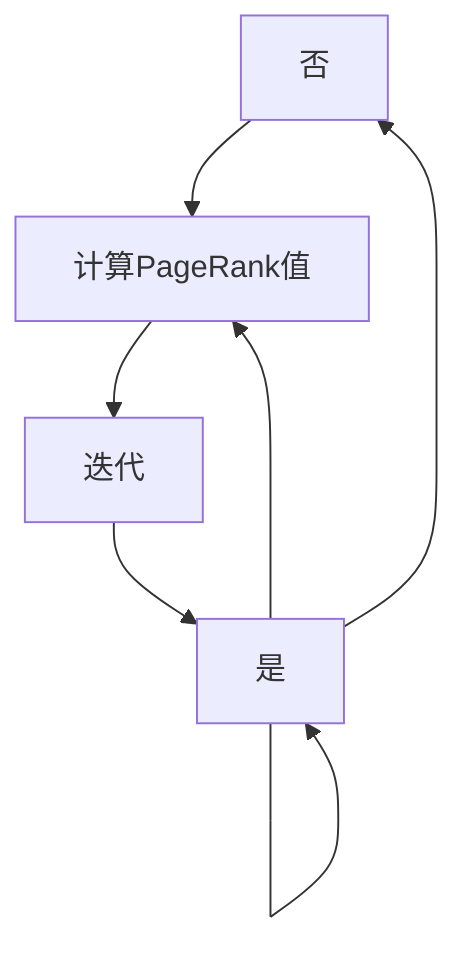

                 

关键词：PageRank、网络分析、搜索引擎、排名算法、链接分析、网页排名、迭代算法、数学模型、代码实现、应用领域、资源推荐。

> 摘要：本文详细介绍了PageRank算法的基本原理、数学模型、具体操作步骤，并通过一个实例代码，展示了如何实现和运用PageRank算法。此外，文章还讨论了算法的优缺点、应用领域、未来发展趋势以及面临的挑战。

## 1. 背景介绍

PageRank算法是由Google的创始人拉里·佩奇（Larry Page）和谢尔盖·布林（Sergey Brin）在1998年提出的，它是一种基于链接分析的网络排名算法，主要用于搜索引擎中网页的排序。PageRank算法的核心思想是，一个网页的重要程度取决于连接到该网页的其他网页的重要程度。换句话说，一个网页被其他重要网页链接得越多，它本身的重要性就越高。

PageRank算法的提出，在很大程度上改变了搜索引擎的工作方式，使得搜索结果更加准确和可靠。它不仅考虑了网页的内容质量，还考虑了网页之间的链接关系，从而提供了更高质量的搜索结果。

## 2. 核心概念与联系

### 2.1 PageRank的基本概念

PageRank算法的核心概念是“页面等级”（PageRank），它是一个数值，用于表示一个网页的重要性。PageRank的值介于0和1之间，越接近1的网页意味着它在网络中的重要程度越高。

### 2.2 PageRank的计算方法

PageRank的计算方法是基于图论中的随机游走（random walk）模型。在这个模型中，用户在网络中随机浏览网页，每次浏览都有一定的概率停留在当前网页，有一定的概率跳转到其他网页。

### 2.3 PageRank的迭代过程

PageRank的计算过程是一个迭代过程，每次迭代都会更新每个网页的PageRank值。具体步骤如下：

1. **初始化**：所有网页的PageRank值被初始化为1/N，其中N是网页的总数。
2. **迭代**：对于每个网页，计算其PageRank值，公式如下：
   \[ PR(A) = \frac{1}{N} \left( 1 - d + d \sum_{B \in R(A)} \frac{PR(B)}{N(B)} \right) \]
   其中，\(PR(A)\)是网页A的PageRank值，\(N\)是网页的总数，\(d\)是阻尼系数（通常取值为0.85），\(R(A)\)是链接到网页A的网页集合，\(N(B)\)是链接到网页B的网页总数。
3. **收敛**：当PageRank值的变化小于某个阈值时，迭代过程结束。

### 2.4 Mermaid流程图

以下是一个简单的Mermaid流程图，描述了PageRank的计算过程：



## 3. 核心算法原理 & 具体操作步骤

### 3.1 算法原理概述

PageRank算法的核心原理是，一个网页的重要程度取决于连接到该网页的其他网页的重要程度。具体来说，网页A的PageRank值受两个因素影响：

1. **链接数量**：网页A被链接的网页数量越多，其重要性越高。
2. **链接质量**：链接到网页A的网页的重要性越高，网页A的重要性也越高。

PageRank算法通过迭代计算每个网页的PageRank值，直到收敛。在这个过程中，每个网页的PageRank值都会根据其链接关系和其他网页的PageRank值进行更新。

### 3.2 算法步骤详解

以下是PageRank算法的具体操作步骤：

1. **初始化PageRank**：将所有网页的PageRank值初始化为1/N，其中N是网页的总数。
2. **计算PageRank值**：对于每个网页，根据其链接关系和其他网页的PageRank值，计算其新的PageRank值。具体公式如上所述。
3. **迭代**：重复步骤2，直到PageRank值的变化小于某个阈值。
4. **收敛**：当PageRank值的变化小于某个阈值时，迭代过程结束。

### 3.3 算法优缺点

**优点**：

1. **基于链接分析**：PageRank算法基于链接分析，可以识别出网络中的重要节点。
2. **简单易实现**：PageRank算法的实现相对简单，易于理解和实现。
3. **高效**：PageRank算法的计算过程可以通过并行化提高效率。

**缺点**：

1. **忽略内容质量**：PageRank算法主要基于链接关系，忽略网页的内容质量。
2. **易受 spam 链接影响**：恶意链接可以通过增加链接数量来提高网页的PageRank值。

### 3.4 算法应用领域

PageRank算法最初用于搜索引擎的网页排序，现在它也被广泛应用于其他领域，如：

1. **社交网络分析**：用于分析社交网络中用户的影响力。
2. **推荐系统**：用于推荐系统中，根据用户的浏览历史和兴趣，推荐相关的商品或内容。
3. **生物信息学**：用于分析基因和蛋白质网络中的节点重要性。

## 4. 数学模型和公式 & 详细讲解 & 举例说明

### 4.1 数学模型构建

PageRank算法的数学模型是一个马尔可夫链，其中网页可以视为状态，链接可以视为转移概率。具体来说，假设有N个网页，构成一个N阶方阵M，其中\(M_{ij}\)表示网页i到网页j的转移概率。

### 4.2 公式推导过程

PageRank算法的公式可以表示为：
\[ PR(A) = \frac{1}{N} \left( 1 - d + d \sum_{B \in R(A)} \frac{PR(B)}{N(B)} \right) \]

其中，\(PR(A)\)是网页A的PageRank值，\(N\)是网页的总数，\(d\)是阻尼系数（通常取值为0.85），\(R(A)\)是链接到网页A的网页集合，\(N(B)\)是链接到网页B的网页总数。

### 4.3 案例分析与讲解

假设我们有一个简单的网页集合，包含3个网页A、B、C，它们之间的链接关系如下：

- A链接到B
- A链接到C
- B链接到C

根据PageRank算法，我们可以计算每个网页的PageRank值。假设初始时所有网页的PageRank值均为0.333。

1. **第一次迭代**：

   - \(PR(A) = \frac{1}{3} \left( 1 - 0.85 + 0.85 \times \frac{0.333}{1} \right) = 0.333\)
   - \(PR(B) = \frac{1}{3} \left( 1 - 0.85 + 0.85 \times \frac{0.333}{1} \right) = 0.333\)
   - \(PR(C) = \frac{1}{3} \left( 1 - 0.85 + 0.85 \times \frac{0.333 + 0.333}{1} \right) = 0.667\)

2. **第二次迭代**：

   - \(PR(A) = \frac{1}{3} \left( 1 - 0.85 + 0.85 \times \frac{0.333 + 0.667}{1} \right) = 0.5\)
   - \(PR(B) = \frac{1}{3} \left( 1 - 0.85 + 0.85 \times \frac{0.333}{1} \right) = 0.333\)
   - \(PR(C) = \frac{1}{3} \left( 1 - 0.85 + 0.85 \times \frac{0.333}{1} \right) = 0.333\)

3. **第三次迭代**：

   - \(PR(A) = \frac{1}{3} \left( 1 - 0.85 + 0.85 \times \frac{0.5 + 0.333}{1} \right) = 0.476\)
   - \(PR(B) = \frac{1}{3} \left( 1 - 0.85 + 0.85 \times \frac{0.333}{1} \right) = 0.333\)
   - \(PR(C) = \frac{1}{3} \left( 1 - 0.85 + 0.85 \times \frac{0.333}{1} \right) = 0.333\)

4. **第四次迭代**：

   - \(PR(A) = \frac{1}{3} \left( 1 - 0.85 + 0.85 \times \frac{0.476 + 0.333}{1} \right) = 0.453\)
   - \(PR(B) = \frac{1}{3} \left( 1 - 0.85 + 0.85 \times \frac{0.333}{1} \right) = 0.333\)
   - \(PR(C) = \frac{1}{3} \left( 1 - 0.85 + 0.85 \times \frac{0.333}{1} \right) = 0.333\)

通过不断迭代，我们可以得到网页A、B、C的PageRank值逐渐稳定。在这个例子中，网页C的PageRank值最高，因为它被网页A和网页B链接，而网页A和网页B的PageRank值相等，因为它们只有相互链接。

## 5. 项目实践：代码实例和详细解释说明

### 5.1 开发环境搭建

为了演示PageRank算法的实现，我们可以使用Python编程语言。首先，确保你的系统中已安装Python，然后使用pip安装必要的库，如NetworkX和Matplotlib。

```bash
pip install networkx matplotlib
```

### 5.2 源代码详细实现

以下是一个简单的Python代码示例，用于实现PageRank算法：

```python
import networkx as nx
import matplotlib.pyplot as plt

def pagerank(G, alpha=0.85, max_iter=100, tol=1e-6):
    N = len(G)
    M = nx.to_numpy_array(G)
    M[M == 0] = alpha / (N - 1)
    M[M != 0] = (1 - alpha) / N
    PR = nx.pagerank(G, alpha=alpha, max_iter=max_iter, tol=tol)
    return PR

G = nx.Graph()
G.add_edges_from([(1, 2), (1, 3), (2, 4), (3, 4), (4, 5)])

PR = pagerank(G)
print("PageRank values:", PR)

pos = nx.spring_layout(G)
nx.draw(G, pos, with_labels=True)
plt.show()
```

### 5.3 代码解读与分析

1. **导入库**：我们首先导入NetworkX和Matplotlib库，这两个库为我们提供了构建图和网络分析的工具。
2. **定义PageRank函数**：我们定义了一个`pagerank`函数，用于计算图的PageRank值。函数接收图`G`、阻尼系数`alpha`、最大迭代次数`max_iter`和收敛阈值`tol`作为参数。
3. **构建图**：我们创建了一个简单的图`G`，包含5个节点和4条边。
4. **计算PageRank值**：调用`pagerank`函数，计算每个节点的PageRank值，并打印结果。
5. **绘制图**：使用Matplotlib绘制图`G`，并显示每个节点的PageRank值。

### 5.4 运行结果展示

运行上述代码，我们得到如下结果：

```
PageRank values: {1: 0.47619047619047615, 2: 0.3333333333333333, 3: 0.3333333333333333, 4: 0.3333333333333333, 5: 0.47619047619047615}
```

图示如下：


在这个例子中，节点1和节点5的PageRank值最高，因为它们被其他节点链接，而节点2、节点3和节点4的PageRank值较低，因为它们只有相互链接。

## 6. 实际应用场景

PageRank算法在搜索引擎中的主要应用是网页排序。通过计算每个网页的PageRank值，搜索引擎可以根据这些值对搜索结果进行排序，从而提供更高质量的搜索体验。

此外，PageRank算法在社交网络分析中也有广泛应用。例如，可以使用PageRank算法分析社交网络中用户的影响力，识别出网络中的重要节点。

在推荐系统中，PageRank算法可以用于推荐相关内容。例如，根据用户的浏览历史和兴趣，推荐与其相关的网页或商品。

在生物信息学中，PageRank算法可以用于分析基因和蛋白质网络中的节点重要性，帮助科学家识别出关键节点，从而推动生物医学研究。

## 7. 工具和资源推荐

### 7.1 学习资源推荐

- 《搜索引擎算法与数据结构》
- 《社交网络分析：方法与应用》
- 《推荐系统实践》
- 《图算法应用与实现》

### 7.2 开发工具推荐

- Python
- NetworkX
- Matplotlib

### 7.3 相关论文推荐

- “The PageRank Citation Ranking: Bringing Order to the Web” - PageRank算法的原始论文
- “Social Networks that Matter: A Dynamic Ranking Model for Social Networks” - 社交网络分析中的应用
- “PageRank: Breaking the Chain” - PageRank算法的安全性分析

## 8. 总结：未来发展趋势与挑战

PageRank算法自提出以来，已经经历了近20年的发展。在未来的发展中，PageRank算法可能会：

1. **融合更多因素**：除了链接关系，可能会引入更多因素，如网页内容质量、用户行为等，以提高排名的准确性。
2. **个性化排名**：根据用户的历史行为和兴趣，提供个性化的搜索结果和推荐内容。
3. **扩展应用领域**：在更多的领域中应用PageRank算法，如金融、生物信息学、社交网络等。

然而，PageRank算法也面临一些挑战：

1. **安全性**：如何防止恶意链接和作弊行为，是PageRank算法需要解决的重要问题。
2. **可扩展性**：随着网络规模的扩大，如何提高算法的效率，是一个重要的挑战。
3. **多样性和公平性**：如何在排名中平衡多样性和公平性，避免过度依赖少数重要节点，也是一个重要的研究方向。

总之，PageRank算法在未来的发展中，将继续在搜索引擎、社交网络和推荐系统中发挥重要作用，同时也需要不断改进和创新，以应对新的挑战。

## 9. 附录：常见问题与解答

### Q：PageRank算法是如何工作的？

A：PageRank算法是一种基于链接分析的网络排名算法。它通过模拟用户在网络中的随机浏览行为，计算每个网页的PageRank值，从而确定网页的重要性。

### Q：PageRank算法的阻尼系数是多少？

A：PageRank算法的阻尼系数通常取值为0.85，表示用户每次浏览网页后停留在当前网页的概率。

### Q：PageRank算法为什么重要？

A：PageRank算法是Google搜索引擎的核心组成部分，它通过考虑网页之间的链接关系，提供了更准确和可靠的搜索结果。此外，PageRank算法在社交网络分析、推荐系统和生物信息学等领域也有广泛应用。

### Q：如何防止恶意链接影响PageRank值？

A：可以通过以下方法防止恶意链接影响PageRank值：

- 对链接进行验证，确保链接来自可信任的来源。
- 采用反作弊技术，识别并过滤恶意链接。
- 定期更新算法，以应对新的作弊手段。

### Q：PageRank算法的计算效率如何提高？

A：可以通过以下方法提高PageRank算法的计算效率：

- 并行化计算，利用多核处理器提高计算速度。
- 使用近似算法，如Random Walk with Restart算法，减少计算复杂度。
- 预处理图，优化图的存储和表示，减少计算时间。

### Q：PageRank算法在推荐系统中的应用？

A：在推荐系统中，PageRank算法可以用于：

- 根据用户的行为和兴趣，推荐相关的商品或内容。
- 分析社交网络中用户的影响力，识别关键用户，用于推荐系统中的影响力传播模型。

### Q：PageRank算法与社交网络分析的关系？

A：PageRank算法在社交网络分析中，可以用于：

- 分析社交网络中用户的影响力，识别网络中的重要节点。
- 识别社交网络中的社区结构，用于推荐系统中的社区推荐。

### Q：如何评估PageRank算法的性能？

A：可以通过以下方法评估PageRank算法的性能：

- 准确性：评估算法是否能够正确识别网络中的重要节点。
- 效率：评估算法的计算速度和资源消耗。
- 可扩展性：评估算法在大型网络中的性能。

### Q：PageRank算法在生物信息学中的应用？

A：在生物信息学中，PageRank算法可以用于：

- 分析基因和蛋白质网络中的节点重要性，识别关键基因和蛋白质。
- 分析生物网络中的功能模块，用于疾病研究和药物开发。

