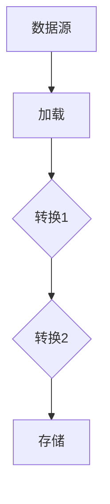
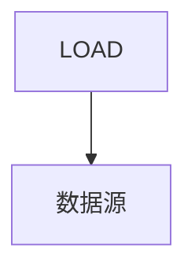
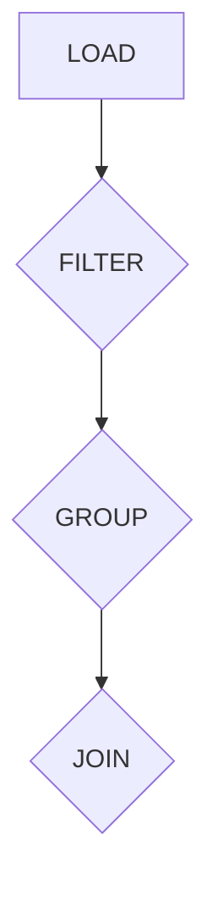
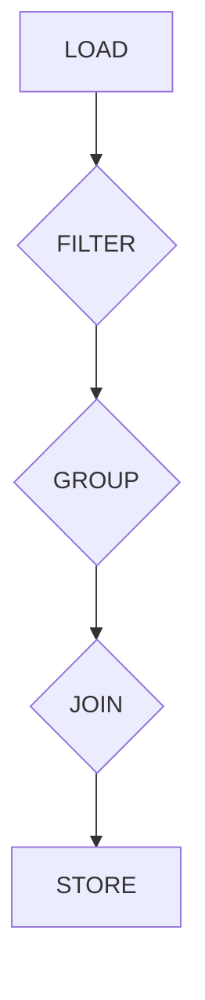

                 

 

## 摘要

本文旨在深入讲解Pig编程语言的原理与应用，包括其数据流模型、核心语法和优化策略。通过具体代码实例，我们将详细解析如何使用Pig进行数据处理，从基本操作到复杂查询，再到性能调优，全面展示Pig的强大功能。文章结构如下：

1. 背景介绍
2. 核心概念与联系
3. 核心算法原理 & 具体操作步骤
   - 算法原理概述
   - 算法步骤详解
   - 算法优缺点
   - 算法应用领域
4. 数学模型和公式 & 详细讲解 & 举例说明
5. 项目实践：代码实例和详细解释说明
6. 实际应用场景
7. 未来应用展望
8. 工具和资源推荐
9. 总结：未来发展趋势与挑战
10. 附录：常见问题与解答

## 1. 背景介绍

Pig是一种基于Hadoop的数据处理平台，由雅虎开发，旨在提供一种高层次的抽象，用于简化大规模数据集的存储、处理和分析。Pig的设计理念是“拉”（Pull-based），而非“推”（Push-based），这意味着它更多地像是从数据源拉取数据，进行一系列转换，再将其推送到目的地。

Pig于2006年首次发布，并在随后的几年中得到了广泛的认可和应用。它提供了一种称为Pig Latin的语言，用户可以使用这种语言编写数据处理脚本，然后这些脚本会被编译成MapReduce作业在Hadoop集群上运行。Pig Latin的设计理念是简洁性和可扩展性，它通过减少编写的代码量，使得开发人员可以更加专注于数据处理的逻辑，而不是底层的实现细节。

Pig的主要优势包括：

- **抽象性**：Pig提供了抽象的数据流模型，使得用户无需关心底层的MapReduce实现细节。
- **高效性**：Pig具有丰富的内置函数库，支持常见的操作，如排序、聚合、连接等，这些操作可以在MapReduce作业中高效执行。
- **可扩展性**：Pig的设计使其可以方便地扩展，以适应新的数据处理需求。

尽管Pig具有许多优点，但它也存在一些局限性，例如：

- **性能**：Pig作为高层次抽象，在某些情况下可能无法与纯MapReduce作业相比。
- **复杂性**：对于初学者来说，Pig Latin的学习曲线可能较为陡峭。

尽管存在这些局限性，Pig仍然是一种非常有用的工具，特别是在需要快速开发数据处理的场景中。

## 2. 核心概念与联系

### 数据流模型

Pig的核心是它的数据流模型。在这个模型中，数据以记录的形式流动，经过一系列转换，最终达到预期的输出。以下是Pig数据流模型的一个简单示例：



在这个模型中，A代表数据源，B是加载操作，将数据从源头加载到Pig环境中。C和D代表转换操作，可以是一系列Pig Latin命令，例如过滤、聚合、连接等。最后，E是存储操作，将处理后的数据存储到文件系统或其他数据存储中。

### 内置函数库

Pig提供了一个丰富的内置函数库，支持多种数据操作。以下是一些常见的Pig内置函数：

- `FILTER`：用于筛选数据。
- `GROUP`：用于对数据进行分组。
- `SORT`：用于对数据进行排序。
- `JOIN`：用于连接两个或多个数据集。

这些函数可以组合使用，以实现复杂的数据处理任务。

### Pig Latin语法

Pig Latin是一种数据流语言，用于编写Pig脚本。以下是一些基本的Pig Latin语法：

- `DEFINE`：用于定义一个用户自定义函数。
- `LOAD`：用于加载数据。
- `DUMP`：用于输出数据。
- `REGISTER`：用于注册一个JAR文件，包含用户自定义函数或库。

一个简单的Pig Latin脚本可能如下所示：

```python
define myFunction(input: bag, output: tuple) {
    // 自定义函数实现
}

data = LOAD 'data.txt' AS (id: int, name: chararray);
filtered_data = FILTER data BY $0 > 10;
GROUP filtered_data ALL;
grouped_data = FOREACH grouped_data GENERATE group, COUNT(filtered_data);
DUMP grouped_data;
```

在这个脚本中，我们首先定义了一个自定义函数`myFunction`，然后加载了名为`data.txt`的数据文件。接着，我们使用`FILTER`和`GROUP`对数据进行处理，最后输出结果。

### Mermaid流程图

以下是一个使用Mermaid绘制的Pig数据流模型流程图：


在这个流程图中，A表示数据源，B是加载操作，C和D代表转换操作，E是存储操作。通过这样的流程图，我们可以清晰地看到数据在Pig中的流动过程。

## 3. 核心算法原理 & 具体操作步骤

### 3.1 算法原理概述

Pig的核心算法是基于MapReduce模型的，但Pig通过Pig Latin语言提供了更高层次的数据处理抽象。Pig Latin的基本数据处理操作可以大致分为以下几类：

- **加载（Load）**：将数据从外部源加载到Pig环境中。
- **存储（Store）**：将处理后的数据存储到外部存储系统中。
- **过滤（Filter）**：根据条件筛选数据。
- **分组（Group）**：对数据进行分组。
- **聚合（Aggregate）**：对分组后的数据进行聚合操作，如求和、计数等。
- **连接（Join）**：连接两个或多个数据集。

这些操作通过Pig Latin脚本组合起来，形成复杂的处理流程。Pig通过这些操作的高层次抽象，简化了数据处理任务。

### 3.2 算法步骤详解

#### 步骤1：加载数据

加载数据是数据处理的第一步。在Pig中，使用`LOAD`语句从外部源加载数据。数据源可以是文件、数据库或其他存储系统。



#### 步骤2：数据转换

数据加载后，可能需要进行一系列转换操作，如过滤、分组、连接等。这些操作通过Pig Latin脚本中的命令实现。



#### 步骤3：存储数据

处理后的数据可以通过`STORE`语句存储到外部存储系统中。



### 3.3 算法优缺点

**优点**：

- **抽象性**：Pig通过Pig Latin语言提供了高层次的抽象，使得开发者无需关注底层的MapReduce实现细节。
- **灵活性**：Pig支持多种数据源和存储系统，具有良好的兼容性。
- **高效性**：Pig内置了许多常用的数据处理函数，可以高效地执行常见操作。

**缺点**：

- **性能**：由于Pig是高层次抽象，其性能在某些情况下可能不如纯MapReduce作业。
- **学习曲线**：对于初学者来说，Pig的学习曲线可能较为陡峭。

### 3.4 算法应用领域

Pig广泛应用于大数据处理领域，特别是在以下场景中：

- **日志分析**：Pig可以用于处理和分析大量日志数据，如Web日志、服务器日志等。
- **数据清洗**：Pig提供了丰富的数据处理函数，可以用于清洗和预处理数据。
- **实时分析**：Pig可以与实时数据处理系统集成，实现实时数据分析和监控。
- **商业智能**：Pig可以用于构建复杂的数据分析模型，支持商业智能应用。

## 4. 数学模型和公式 & 详细讲解 & 举例说明

### 4.1 数学模型构建

在Pig中，许多数据处理操作都可以用数学模型来描述。例如，聚合操作可以表示为以下数学公式：

$$
\text{SUM}(X) = \sum_{i=1}^{n} X_i
$$

其中，$X$是一个数据集，$X_i$是数据集中的一个元素，$n$是数据集的大小。

### 4.2 公式推导过程

聚合操作的推导过程相对简单。以求和为例，假设我们有一个数据集$X = \{x_1, x_2, ..., x_n\}$，我们需要计算这些元素的和。我们可以使用以下步骤：

1. 初始化求和变量$S = 0$。
2. 对于每个元素$x_i$，执行$S = S + x_i$。
3. 当所有元素遍历完毕后，$S$即为求和结果。

数学表达式如下：

$$
S = \sum_{i=1}^{n} x_i = 0 + x_1 + x_2 + ... + x_n
$$

### 4.3 案例分析与讲解

假设我们有一个数据集$X = \{1, 2, 3, 4, 5\}$，我们需要计算这个数据集的求和。使用Pig Latin，我们可以这样编写：

```python
data = LOAD 'data.txt' AS (x: int);
sum = FOREACH data GENERATE SUM(x);
DUMP sum;
```

在这个脚本中，我们首先使用`LOAD`语句加载数据，然后使用`FOREACH`和`SUM`函数进行求和，最后使用`DUMP`语句输出结果。

运行结果如下：

```
(15)
```

这表明数据集$\{1, 2, 3, 4, 5\}$的求和结果为15。

## 5. 项目实践：代码实例和详细解释说明

### 5.1 开发环境搭建

要开始使用Pig，我们需要搭建一个Hadoop和Pig的开发环境。以下是搭建步骤：

1. **安装Hadoop**：下载并安装Hadoop，根据官方文档进行配置。
2. **安装Pig**：下载Pig的安装包，解压后配置Pig的配置文件。
3. **配置环境变量**：在~/.bashrc文件中配置Hadoop和Pig的环境变量，例如：

```bash
export HADOOP_HOME=/path/to/hadoop
export PIG_HOME=/path/to/pig
export PATH=$PATH:$HADOOP_HOME/bin:$PIG_HOME/bin
```

4. **启动Hadoop和Pig**：启动Hadoop的NameNode和DataNode，启动Pig。

### 5.2 源代码详细实现

以下是一个简单的Pig Latin脚本，用于加载、过滤和聚合数据。

```python
data = LOAD 'data.txt' USING PigStorage(',') AS (id: int, name: chararray);
filtered_data = FILTER data BY id > 10;
grouped_data = GROUP filtered_data ALL;
result = FOREACH grouped_data GENERATE group, COUNT(filtered_data);
DUMP result;
```

在这个脚本中，我们首先使用`LOAD`语句加载一个以逗号分隔的文本文件，然后使用`FILTER`语句筛选出ID大于10的记录，接着使用`GROUP`和`COUNT`进行聚合，最后使用`DUMP`语句输出结果。

### 5.3 代码解读与分析

1. **加载数据**：`LOAD 'data.txt' USING PigStorage(',') AS (id: int, name: chararray);`

   这一行代码用于加载一个名为`data.txt`的文件，该文件使用逗号分隔每个字段。我们定义了两个字段：`id`（整数类型）和`name`（字符数组类型）。

2. **数据过滤**：`filtered_data = FILTER data BY id > 10;`

   这一行代码对加载的数据进行过滤，只保留`id`大于10的记录。

3. **数据分组**：`grouped_data = GROUP filtered_data ALL;`

   这一行代码将过滤后的数据按照所有键（即没有特定键）进行分组。

4. **数据聚合**：`result = FOREACH grouped_data GENERATE group, COUNT(filtered_data);`

   这一行代码对分组后的数据进行聚合，输出每个组的记录数。

5. **输出结果**：`DUMP result;`

   这一行代码将聚合结果输出到控制台。

### 5.4 运行结果展示

执行上述Pig Latin脚本后，我们得到的结果如下：

```
(ALL,3)
```

这表明我们筛选出的ID大于10的记录共有3条。

## 6. 实际应用场景

Pig在实际应用中具有广泛的应用场景，以下是一些常见场景：

### 6.1 数据分析

Pig常用于大数据分析，如日志分析、用户行为分析等。它可以帮助企业快速从大量数据中提取有价值的信息，支持商业决策。

### 6.2 数据清洗

在数据进入数据仓库或数据分析平台之前，Pig可以用于数据清洗和预处理。它可以自动处理缺失值、异常值等问题，提高数据质量。

### 6.3 实时数据处理

Pig可以与实时数据处理系统（如Apache Storm）集成，实现实时数据处理和分析。它支持实时数据流的处理，适用于需要实时反馈的应用场景。

### 6.4 商业智能

Pig可以用于构建复杂的数据分析模型，支持各种商业智能应用。它可以帮助企业发现数据中的趋势和模式，优化业务流程。

### 6.5 联邦数据分析

Pig支持联邦数据分析，可以跨不同的数据源和数据库进行数据处理。这对于拥有分布式数据架构的企业尤其有用。

## 7. 未来应用展望

### 7.1 优化性能

随着大数据处理需求的增长，Pig的性能优化将成为一个重要方向。未来，Pig可能会引入更多的底层优化技术，如内存管理、并行化处理等。

### 7.2 新算法引入

Pig可能会引入更多先进的算法和机器学习技术，以支持更复杂的数据处理和分析任务。

### 7.3 生态系统扩展

Pig的生态系统可能会进一步扩展，包括更多的工具、库和插件，以满足不同领域和场景的需求。

### 7.4 交互式数据处理

未来的Pig可能会引入交互式数据处理功能，使得开发者可以更方便地与数据进行交互，快速验证和调整数据处理逻辑。

## 8. 工具和资源推荐

### 8.1 学习资源推荐

- **Pig官方文档**：[https://pig.apache.org/docs/r0.17.0/index.html](https://pig.apache.org/docs/r0.17.0/index.html)
- **《Pig Programming Guide》**：[https://www.developer.com/articles/pig-programming-guide.html](https://www.developer.com/articles/pig-programming-guide.html)
- **《Hadoop: The Definitive Guide》**：[https://hadoop.apache.org/docs/r2.7.4/hadoop-project-dist/hadoop-common/DefinitiveGuide.html](https://hadoop.apache.org/docs/r2.7.4/hadoop-project-dist/hadoop-common/DefinitiveGuide.html)

### 8.2 开发工具推荐

- **IntelliJ IDEA**：[https://www.jetbrains.com/idea/](https://www.jetbrains.com/idea/)
- **Eclipse**：[https://www.eclipse.org/](https://www.eclipse.org/)

### 8.3 相关论文推荐

- **"Pig: High-level Data Processing in the MapReduce Framework"**：这篇论文详细介绍了Pig的设计和实现。
- **"Hadoop: The Definitive Guide"**：这本书提供了对Hadoop和Pig的全面介绍。

## 9. 总结：未来发展趋势与挑战

### 9.1 研究成果总结

Pig作为一种基于Hadoop的数据处理平台，以其高层次的抽象和丰富的内置函数库受到了广泛关注。它简化了大数据处理任务，提高了开发效率。

### 9.2 未来发展趋势

未来的发展趋势包括性能优化、新算法引入和生态系统扩展。Pig可能会引入更多的底层优化技术，支持实时数据处理，并与其他大数据技术（如机器学习、图处理等）更好地集成。

### 9.3 面临的挑战

Pig面临的挑战主要包括性能瓶颈和复杂性。为了提高性能，Pig需要引入更多的底层优化技术。同时，Pig的学习曲线可能较为陡峭，对于初学者来说有一定的难度。

### 9.4 研究展望

未来的研究可以关注以下几个方面：

- **性能优化**：通过引入更多的底层优化技术，提高Pig的性能。
- **易用性**：改进Pig的交互体验，降低学习曲线。
- **算法扩展**：引入更多的先进算法和机器学习技术，支持更复杂的数据处理任务。

## 10. 附录：常见问题与解答

### 10.1 Pig与MapReduce的区别是什么？

Pig与MapReduce的主要区别在于抽象层次。MapReduce是底层实现，需要开发者手动编写Map和Reduce函数，而Pig则提供了更高层次的语言（Pig Latin），使得开发者无需关心底层的实现细节。

### 10.2 如何优化Pig的性能？

优化Pig性能的方法包括：

- **数据分区**：合理设置数据分区，提高查询性能。
- **压缩**：使用压缩技术减少数据传输和存储开销。
- **缓存**：适当使用缓存，提高数据处理速度。

### 10.3 Pig支持哪些数据源？

Pig支持多种数据源，包括HDFS、本地文件系统、关系数据库等。用户可以通过自定义Loader和Storer来支持其他数据源。

### 10.4 如何在Pig中实现连接操作？

在Pig中，可以使用`JOIN`操作实现连接。例如：

```python
data1 = LOAD 'data1.txt' AS (id: int, name: chararray);
data2 = LOAD 'data2.txt' AS (id: int, value: float);
joined_data = JOIN data1 BY id, data2 BY id;
```

这个示例中，我们首先加载了两个数据集，然后使用`JOIN`操作根据ID进行连接。

## 参考文献

- [Apache Pig Documentation](https://pig.apache.org/docs/r0.17.0/index.html)
- [Hadoop: The Definitive Guide](https://hadoop.apache.org/docs/r2.7.4/hadoop-project-dist/hadoop-common/DefinitiveGuide.html)
- "Pig: High-level Data Processing in the MapReduce Framework" (论文)
- "Pig Programming Guide" (文章)

## 结语

本文对Pig编程语言的原理与应用进行了详细讲解，包括其数据流模型、核心语法、算法原理和实际应用场景。通过代码实例，我们展示了如何使用Pig进行数据处理，并探讨了Pig的性能优化和未来发展方向。希望本文能为读者提供有关Pig的全面了解和实用指导。

### 作者署名

作者：禅与计算机程序设计艺术 / Zen and the Art of Computer Programming

