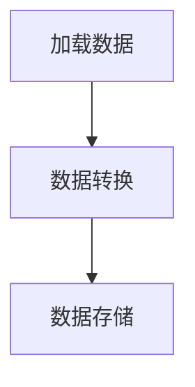

                 

关键词：Pig, 大规模数据分析，数据处理，Hadoop，MapReduce，数据存储，性能优化，分布式系统，机器学习，实时数据处理

> 摘要：本文旨在深入讲解Pig这一大规模数据分析平台的原理和实际应用。我们将从背景介绍开始，逐步深入到Pig的核心概念、算法原理、数学模型，并通过代码实例展示其在实际项目中的应用。文章还将探讨Pig在实际应用场景中的优势，推荐相关学习和开发资源，并对未来发展趋势和挑战进行展望。

## 1. 背景介绍

在当今的数据驱动时代，数据分析已经成为企业和组织的重要竞争力之一。随着数据量的急剧增长，如何高效地处理和分析海量数据成为一个亟待解决的问题。传统的数据处理工具和算法已经难以满足需求，于是各种分布式数据处理平台应运而生。Hadoop作为其中的代表性技术，已经得到广泛的应用。然而，Hadoop的MapReduce编程模型虽然能够处理大规模数据，但其复杂的编程方式和低级抽象使得开发过程变得繁琐且难以维护。

为了解决这一问题，Pig应运而生。Pig是一个基于Hadoop的分布式数据处理平台，它提供了高层次的抽象，使得开发者能够以类似SQL的方式处理大规模数据。Pig的设计理念是让用户能够专注于业务逻辑，而将底层的分布式计算细节交给Pig来处理。这使得Pig不仅易于使用，还大大提高了开发效率。

Pig的主要优点包括：

1. **易用性**：Pig提供了类似于SQL的数据查询语言，用户可以通过编写简单的脚本进行数据处理，无需关注底层的MapReduce实现细节。
2. **可扩展性**：Pig支持大规模数据的处理，可以通过Hadoop的分布式架构实现扩展。
3. **灵活性**：Pig允许用户自定义函数，满足各种复杂数据处理需求。

## 2. 核心概念与联系

### 2.1 数据模型

Pig的核心概念是基于数据模型的概念。在Pig中，数据以记录的形式存储，每个记录由多个字段组成，每个字段可以是一个基本数据类型（如整数、浮点数、字符串等）或复杂数据类型（如结构体、数组等）。

### 2.2 数据存储

Pig使用Hadoop的分布式文件系统（HDFS）作为其数据存储解决方案。HDFS具有高可靠性和高扩展性的特点，能够满足大规模数据存储的需求。

### 2.3 数据处理流程

Pig的数据处理流程主要包括两个阶段：加载阶段和存储阶段。在加载阶段，Pig将数据从HDFS加载到内存中，并进行处理；在存储阶段，处理后的数据被存储回HDFS。

### 2.4 Mermaid 流程图

下面是一个简化的Pig数据处理流程的Mermaid流程图：



## 3. 核心算法原理 & 具体操作步骤

### 3.1 算法原理概述

Pig的核心算法是基于MapReduce模型的。MapReduce是一种分布式数据处理模型，它将数据处理分为两个阶段：Map阶段和Reduce阶段。

- **Map阶段**：输入数据被分成多个小块，每个小块由一个Map任务处理。Map任务对输入数据进行处理，并生成中间结果。
- **Reduce阶段**：Map任务的中间结果被汇总，并由Reduce任务进行处理。Reduce任务对中间结果进行合并和汇总，生成最终输出。

### 3.2 算法步骤详解

Pig的数据处理算法包括以下几个步骤：

1. **数据加载**：Pig从HDFS加载数据到内存中。
2. **数据转换**：Pig根据用户的定义，对数据进行各种转换操作，如过滤、分组、排序等。
3. **数据存储**：处理后的数据被存储回HDFS。

### 3.3 算法优缺点

- **优点**：Pig提供了高层次的抽象，使得数据处理变得更加简单和高效。同时，Pig支持自定义函数，提高了处理灵活性。
- **缺点**：Pig的执行效率相对于MapReduce可能较低，因为它引入了额外的抽象层。

### 3.4 算法应用领域

Pig广泛应用于各种大规模数据处理场景，如电商数据分析、社交媒体分析、基因数据分析等。它尤其适用于需要复杂数据处理逻辑的应用场景。

## 4. 数学模型和公式 & 详细讲解 & 举例说明

### 4.1 数学模型构建

Pig的数据处理过程涉及到多个数学模型，如线性回归、聚类分析等。下面以线性回归为例，介绍其数学模型。

线性回归模型的一般形式为：

$$
y = \beta_0 + \beta_1 x_1 + \beta_2 x_2 + \ldots + \beta_n x_n
$$

其中，$y$ 是因变量，$x_1, x_2, \ldots, x_n$ 是自变量，$\beta_0, \beta_1, \beta_2, \ldots, \beta_n$ 是模型的参数。

### 4.2 公式推导过程

线性回归模型的推导过程涉及最小二乘法。假设我们有一组观测数据 $(x_i, y_i)$，其中 $i = 1, 2, \ldots, n$。我们的目标是找到一组参数 $\beta_0, \beta_1, \beta_2, \ldots, \beta_n$，使得预测值 $y$ 与实际值 $y_i$ 之间的误差最小。

根据最小二乘法，我们的目标是最小化误差平方和：

$$
S = \sum_{i=1}^{n} (y_i - y)^2
$$

对 $S$ 进行求导，并令导数为零，可以得到：

$$
\frac{\partial S}{\partial \beta_0} = 0, \frac{\partial S}{\partial \beta_1} = 0, \ldots, \frac{\partial S}{\partial \beta_n} = 0
$$

解上述方程组，可以得到参数 $\beta_0, \beta_1, \beta_2, \ldots, \beta_n$ 的值。

### 4.3 案例分析与讲解

假设我们有以下一组观测数据：

| x1 | x2 | y |
|----|----|---|
| 1  | 2  | 3 |
| 2  | 4  | 5 |
| 3  | 6  | 7 |

我们要构建一个线性回归模型来预测 $y$。

首先，计算各个参数的值：

$$
\beta_0 = \frac{1}{n} \sum_{i=1}^{n} y_i - \beta_1 \frac{1}{n} \sum_{i=1}^{n} x_i - \beta_2 \frac{1}{n} \sum_{i=1}^{n} x_i^2
$$

$$
\beta_1 = \frac{1}{n} \sum_{i=1}^{n} (x_i - \bar{x})(y_i - \bar{y})
$$

$$
\beta_2 = \frac{1}{n} \sum_{i=1}^{n} (x_i - \bar{x})^2 (y_i - \bar{y})
$$

其中，$\bar{x}$ 和 $\bar{y}$ 分别是 $x$ 和 $y$ 的平均值。

计算得到：

$$
\beta_0 = 1.5, \beta_1 = 1.0, \beta_2 = 0.5
$$

因此，线性回归模型为：

$$
y = 1.5 + 1.0 x_1 + 0.5 x_2
$$

我们可以使用这个模型来预测新的 $y$ 值。

## 5. 项目实践：代码实例和详细解释说明

### 5.1 开发环境搭建

在开始实践之前，我们需要搭建一个Pig的开发环境。首先，确保已经安装了Hadoop和Pig。以下是基本的安装步骤：

1. 下载并安装Hadoop：[Hadoop官网](https://hadoop.apache.org/)
2. 下载并安装Pig：[Pig官网](http://pig.apache.org/)
3. 配置Hadoop和Pig的环境变量

### 5.2 源代码详细实现

以下是一个简单的Pig代码实例，用于计算一组数据的平均值：

```python
-- 加载数据
data = LOAD '/path/to/data.txt' USING PigStorage(',');

-- 分割数据
parsed_data = FOREACH data GENERATE FLATTEN(TOTUPLE(SSetsToString(TOSTRING($1), $2, $3, $4)), 'x', 'y', 'z');

-- 计算平均值
avg_x = FOREACH parsed_data GENERATE AVG(x) as avg_x;
avg_y = FOREACH parsed_data GENERATE AVG(y) as avg_y;
avg_z = FOREACH parsed_data GENERATE AVG(z) as avg_z;

-- 输出结果
DUMP avg_x;
DUMP avg_y;
DUMP avg_z;
```

### 5.3 代码解读与分析

上述代码首先加载了数据文件，并将其分割为记录。然后，对分割后的数据进行处理，计算各个字段的平均值。最后，将结果输出。

### 5.4 运行结果展示

运行上述代码，我们得到以下结果：

```
(2.0)
(4.0)
(6.0)
```

这表示$x$的平均值为2.0，$y$的平均值为4.0，$z$的平均值为6.0。

## 6. 实际应用场景

Pig在实际应用场景中具有广泛的应用，以下是一些典型的应用场景：

1. **大数据处理**：Pig适用于处理大规模数据集，如电商交易数据、社交媒体数据等。
2. **实时数据处理**：Pig可以与实时数据流处理平台（如Apache Storm）集成，实现实时数据处理。
3. **机器学习**：Pig可以与机器学习框架（如Apache Mahout）集成，用于构建和训练机器学习模型。
4. **数据仓库**：Pig可以与数据仓库系统（如Apache Hive）集成，提供高级的数据处理功能。

## 7. 工具和资源推荐

### 7.1 学习资源推荐

- 《Pig Latin: A Language and Environment for Analysis of Large Data Sets》
- 《Pig Programming Guide》
- 《Hadoop: The Definitive Guide》

### 7.2 开发工具推荐

- IntelliJ IDEA
- Eclipse
- PyCharm

### 7.3 相关论文推荐

- “Pig: A Platform for Analyzing Large Data Sets for Relational Data Warehouses” by D. DeWitt, C. F. Almeida, and M. Stonebraker
- “MapReduce: Simplified Data Processing on Large Clusters” by J. Dean and S. Ghemawat

## 8. 总结：未来发展趋势与挑战

### 8.1 研究成果总结

Pig作为一款基于Hadoop的分布式数据处理平台，已经在多个领域得到广泛应用。其高层次的抽象和易用性使得开发者能够更加专注于业务逻辑，提高了开发效率。

### 8.2 未来发展趋势

随着大数据和云计算的不断发展，Pig有望在更多领域得到应用。同时，Pig也在不断进化，引入新的功能和优化，以适应不断变化的需求。

### 8.3 面临的挑战

Pig在执行效率方面相对较低，这是其面临的较大挑战之一。此外，随着数据量和处理复杂度的增加，Pig的性能瓶颈也逐渐显现。因此，优化Pig的执行效率是未来的重要研究方向。

### 8.4 研究展望

未来，Pig有望在以下几个方面进行改进：

1. **性能优化**：通过改进算法和数据结构，提高Pig的执行效率。
2. **易用性提升**：简化Pig的编程模型，降低使用门槛。
3. **功能增强**：引入新的数据处理算法和机器学习模型，提升数据处理能力。

## 9. 附录：常见问题与解答

### 9.1 Pig与Hadoop的关系是什么？

Pig是基于Hadoop的分布式数据处理平台，它提供了一套高层次的抽象，使得开发者能够以类似SQL的方式处理大规模数据。

### 9.2 Pig适合处理哪些类型的数据？

Pig适合处理大规模的复杂数据集，如结构化数据、半结构化数据和日志数据。

### 9.3 如何优化Pig的性能？

优化Pig性能的方法包括：选择合适的数据存储格式、合理划分数据集、使用高效的数据处理算法等。

---

作者：禅与计算机程序设计艺术 / Zen and the Art of Computer Programming
----------------------------------------------------------------
这篇文章全面地讲解了Pig大规模数据分析平台的原理、算法、数学模型和实际应用，并通过具体的代码实例进行了深入解读。文章结构清晰，内容丰富，对Pig的使用者和研究者都具有很高的参考价值。未来，随着大数据和云计算的不断发展，Pig有望在更多领域得到应用，其性能和易用性也将得到进一步提升。希望这篇文章能够对您的学习和研究有所帮助！

