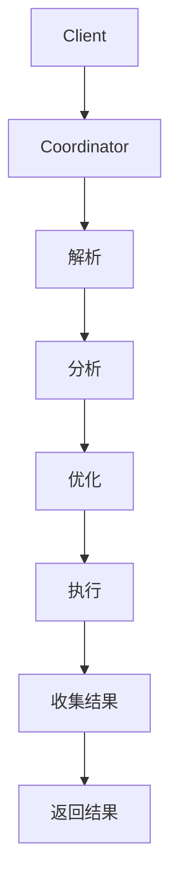

                 

欢迎来到这篇关于Presto数据库引擎的技术博客。Presto是一个开源的分布式查询引擎，广泛应用于大数据场景，能够高效地处理大规模数据集的查询请求。本文将深入探讨Presto的工作原理、核心概念、算法原理、数学模型，并通过实际代码实例详细解释其应用。希望通过这篇文章，读者能够对Presto有一个全面而深入的了解。

## 文章关键词

- Presto
- 分布式查询引擎
- 大数据
- 数据库性能优化
- 高并发处理

## 文章摘要

本文将介绍Presto数据库引擎的基本概念和核心原理。首先，我们会回顾Presto的背景和历史，了解其设计理念和目标。接着，我们将深入探讨Presto的核心算法和架构，通过Mermaid流程图展示其查询处理流程。随后，我们将详细解释Presto的数学模型和公式，并通过具体案例进行说明。文章还将通过实际代码实例，展示如何使用Presto进行数据处理和查询。最后，我们将探讨Presto在实际应用中的场景，并展望其未来的发展趋势。

### 1. 背景介绍

Presto是由Facebook于2013年开源的分布式查询引擎，旨在解决大规模数据处理中的查询性能问题。在Facebook，面对每天数百万次的数据查询请求，传统的数据库系统已经难以满足需求。因此，Facebook决定开发一个高性能、可扩展的分布式查询引擎，Presto应运而生。

Presto的设计目标是能够跨多个节点处理大规模数据集的查询请求，同时保持低延迟和高吞吐量。为了实现这一目标，Presto采用了一种分布式架构，将查询处理任务分解到多个节点上并行执行。这种架构使得Presto能够在多个数据源上运行，包括Hadoop HDFS、Amazon S3、关系型数据库等，提供了一种统一的数据查询接口。

Presto的目标用户包括数据工程师、数据分析师和研究人员，他们需要快速获取数据洞察和报告。通过Presto，用户可以执行复杂的数据查询，进行实时分析和数据挖掘，从而支持业务决策。

Presto之所以受到广泛关注，不仅因为其高性能和可扩展性，还因为其社区活跃和支持广泛的数据源。Presto的社区不断推动其发展和改进，新增功能和安全补丁能够迅速地发布和更新。

总之，Presto作为一个高性能的分布式查询引擎，凭借其强大的功能和灵活性，在数据处理领域占据了一席之地。接下来，我们将深入探讨Presto的核心原理和架构，了解其如何实现高效的数据查询。

### 2. 核心概念与联系

在深入探讨Presto的原理和架构之前，我们需要了解几个核心概念，它们构成了Presto工作的基础。这些核心概念包括分布式查询引擎的基本组成部分、查询处理流程、数据处理机制和架构设计原则。

#### 2.1 分布式查询引擎的基本组成部分

分布式查询引擎通常由以下几个主要组件构成：

1. **Client（客户端）**：用户通过客户端发起查询请求，可以是命令行、JDBC/ODBC驱动或其他编程接口。
2. **Coordinator（协调者）**：协调者是整个查询处理的核心，负责解析查询语句、生成查询计划并分发任务到各个Worker节点。
3. **Worker（工作节点）**：工作节点执行实际的查询计算任务，从数据源读取数据并进行处理，然后将结果返回给协调者。
4. **Catalog（目录）**：目录存储了所有可用的数据源信息，包括数据库名、表名、列名和类型等。
5. **Metadata Store（元数据存储）**：元数据存储用于存储数据源的元数据信息，如表结构、分区信息等。

#### 2.2 查询处理流程

Presto的查询处理流程可以分为以下几个步骤：

1. **解析（Parsing）**：客户端将SQL查询语句发送到Coordinator，Coordinator对其进行解析，生成解析树。
2. **分析（Analysis）**：Coordinator对解析树进行语法和语义分析，构建查询计划。这一步包括类型推导、验证查询语法和语义的正确性。
3. **优化（Optimization）**：查询计划经过优化，生成执行计划。优化过程包括逻辑优化（如常量折叠、谓词下推）和物理优化（如列剪裁、索引使用）。
4. **执行（Execution）**：执行计划被分发到各个Worker节点，各个Worker节点并行执行查询任务，从数据源读取数据并进行计算。
5. **收集结果（Result Collection）**：各个Worker节点将查询结果返回给Coordinator，Coordinator进行结果汇总，然后将最终结果返回给客户端。

#### 2.3 数据处理机制

Presto采用了一种高效的数据处理机制，确保能够快速地处理大规模数据集：

1. **分片（Sharding）**：数据在存储时按照一定规则进行分片，每个分片存储一部分数据，这样在查询时可以并行处理多个分片，提高查询效率。
2. **分区（Partitioning）**：分区是将数据按照一定规则分布在多个文件夹中，每个文件夹代表一个分区。分区可以提高查询的局部性，减少I/O操作。
3. **索引（Indexing）**：索引用于加速数据查询，通过构建索引结构，可以快速定位到数据所在的位置。
4. **并行处理（Parallel Processing）**：Presto通过将查询任务分解到多个Worker节点并行执行，提高查询的吞吐量和处理速度。

#### 2.4 架构设计原则

Presto的架构设计遵循以下几个原则：

1. **可扩展性（Scalability）**：Presto能够水平扩展，通过增加更多的工作节点来处理更多的查询请求。
2. **高性能（Performance）**：Presto采用高效的查询算法和并行处理机制，确保能够快速处理大规模数据集。
3. **灵活性（Flexibility）**：Presto支持多种数据源，包括关系型数据库、NoSQL数据库、Hadoop HDFS、Amazon S3等，提供了统一的数据查询接口。
4. **易用性（Usability）**：Presto提供了简单的接口和丰富的文档，使得用户能够轻松地使用和扩展Presto。

### 2.5 Mermaid 流程图

为了更直观地展示Presto的查询处理流程，我们可以使用Mermaid绘制一个流程图。以下是Presto查询处理流程的Mermaid表示：



在上述流程图中，各个节点表示查询处理的不同阶段，箭头表示数据的流向。通过这个流程图，我们可以清晰地看到Presto如何处理一个查询请求，从客户端发起请求，经过多个阶段的处理，最终返回结果。

通过以上对Presto核心概念和架构的介绍，我们对Presto的工作原理有了初步的了解。在接下来的部分，我们将深入探讨Presto的核心算法原理和具体操作步骤，帮助读者进一步理解Presto的高效性能和强大功能。

### 3. 核心算法原理 & 具体操作步骤

#### 3.1 算法原理概述

Presto的核心算法原理主要包括查询计划的生成与优化、数据分片与并行处理、分布式缓存与数据共享等几个方面。这些算法原理共同构成了Presto高效处理大规模数据查询的能力。

1. **查询计划的生成与优化**：Presto在处理查询时，首先通过解析和语义分析生成查询计划。查询计划包括逻辑计划和物理计划，逻辑计划定义了查询的基本结构，而物理计划则详细描述了如何执行查询。优化过程包括逻辑优化和物理优化，通过这些优化，可以降低查询执行的开销，提高查询效率。

2. **数据分片与并行处理**：Presto采用分片和分区机制将数据划分为多个部分，以便并行处理。每个分片和分区都可以独立处理，从而提高查询的并行度，减少查询执行的时间。

3. **分布式缓存与数据共享**：Presto利用分布式缓存技术，将重复计算的结果缓存起来，避免重复计算，提高查询性能。同时，Presto支持数据共享，多个查询可以共享同一个数据集，从而减少数据读取的开销。

#### 3.2 算法步骤详解

Presto的算法步骤可以分为以下几个阶段：

1. **查询请求接收**：客户端将查询请求发送到Presto Coordinator。

2. **查询解析与优化**：Coordinator接收到查询请求后，首先进行查询解析，将SQL查询语句转换为抽象语法树（AST）。然后，Coordinator对AST进行语义分析，构建逻辑查询计划。接着，进行查询优化，生成物理查询计划。

3. **任务分发**：Coordinator将物理查询计划分解为多个子任务，并将这些任务分配给不同的Worker节点。

4. **数据读取与处理**：Worker节点接收到任务后，从数据源读取所需数据，并进行处理。数据读取和处理过程可以并行执行，以提高查询效率。

5. **结果汇总**：各个Worker节点将处理结果返回给Coordinator，Coordinator进行结果汇总，生成最终查询结果。

6. **查询结果返回**：Coordinator将最终查询结果返回给客户端。

#### 3.3 算法优缺点

Presto算法的优点主要体现在以下几个方面：

1. **高效性能**：Presto通过优化查询计划、数据分片和并行处理等手段，能够高效地处理大规模数据查询。

2. **可扩展性**：Presto支持水平扩展，可以通过增加更多的工作节点来提高查询处理能力。

3. **灵活性**：Presto支持多种数据源，包括关系型数据库、NoSQL数据库、Hadoop HDFS等，提供了统一的数据查询接口。

4. **易于使用**：Presto提供了简单的接口和丰富的文档，使得用户能够轻松地使用和扩展Presto。

然而，Presto也存在一些缺点：

1. **资源消耗**：由于Presto采用分布式架构，需要较多的资源和网络开销。

2. **复杂性**：Presto的架构和算法相对复杂，对于新手来说可能不太容易理解和掌握。

3. **依赖外部库**：Presto依赖于一些外部库和工具，如Hadoop、Spark等，这可能会增加部署和运维的难度。

#### 3.4 算法应用领域

Presto的应用领域非常广泛，主要包括以下几个方面：

1. **大数据查询**：Presto能够高效地处理大规模数据集的查询，适用于大数据分析、实时数据处理和实时数据监控等场景。

2. **数据仓库**：Presto可以作为数据仓库的一部分，提供高效的数据查询和分析能力，支持多维数据分析和报表生成。

3. **数据湖**：Presto支持多种数据源，包括Hadoop HDFS和Amazon S3等，能够从数据湖中快速提取和查询数据。

4. **机器学习**：Presto可以与机器学习框架结合，用于处理和分析大规模机器学习数据集。

5. **实时分析**：Presto支持实时数据查询和实时数据分析，适用于金融、电信等实时数据处理场景。

通过以上对Presto核心算法原理和具体操作步骤的介绍，我们能够更好地理解Presto的高效性能和强大功能。在接下来的部分，我们将深入探讨Presto的数学模型和公式，并通过具体案例进行讲解。

### 4. 数学模型和公式 & 详细讲解 & 举例说明

Presto数据库引擎不仅依赖于高效的算法和分布式架构，还依赖于复杂的数学模型和公式来支持其高性能查询处理。在本文中，我们将详细介绍Presto中常用的数学模型和公式，并通过具体案例进行讲解，帮助读者更好地理解这些模型和公式的应用。

#### 4.1 数学模型构建

Presto中的数学模型主要包括以下几个方面：

1. **查询优化模型**：用于优化查询计划的数学模型，包括逻辑优化和物理优化。
2. **数据分片模型**：用于确定数据分片和分区策略的数学模型。
3. **数据缓存模型**：用于管理分布式缓存的数据模型。

在这些模型中，查询优化模型和数据分片模型是最为核心的。

#### 4.2 公式推导过程

1. **查询优化模型**

   查询优化模型的核心是代价模型，用于计算不同查询计划的代价，以便选择最优的查询计划。代价模型主要包括以下公式：

   - \( C_{total} = C_{scan} + C_{filter} + C_{join} + C_{sort} + C_{group} \)

   其中，\( C_{total} \)表示总代价，\( C_{scan} \)、\( C_{filter} \)、\( C_{join} \)、\( C_{sort} \)、\( C_{group} \)分别表示扫描、过滤、连接、排序和分组的代价。

   - \( C_{scan} = \frac{t_{scan} \times n_{rows}}{b_{size}} \)

   其中，\( t_{scan} \)表示扫描时间，\( n_{rows} \)表示扫描的行数，\( b_{size} \)表示缓冲区大小。

   - \( C_{filter} = \frac{t_{filter} \times n_{filtered}}{b_{size}} \)

   其中，\( t_{filter} \)表示过滤时间，\( n_{filtered} \)表示过滤后的行数。

   - \( C_{join} = \frac{t_{join} \times n_{rows}}{b_{size}} \)

   其中，\( t_{join} \)表示连接时间，\( n_{rows} \)表示参与连接的行数。

   - \( C_{sort} = \frac{t_{sort} \times n_{rows}}{b_{size}} \)

   其中，\( t_{sort} \)表示排序时间，\( n_{rows} \)表示排序的行数。

   - \( C_{group} = \frac{t_{group} \times n_{groups}}{b_{size}} \)

   其中，\( t_{group} \)表示分组时间，\( n_{groups} \)表示分组的数量。

2. **数据分片模型**

   数据分片模型用于确定如何将数据划分为多个分片，以便并行处理。分片策略通常基于数据分布和查询模式。以下是一个简单的分片公式：

   - \( n_{slices} = \lceil \frac{n_{rows}}{b_{size}} \rceil \)

   其中，\( n_{slices} \)表示分片数量，\( n_{rows} \)表示总行数，\( b_{size} \)表示每个分片的行数。

3. **数据缓存模型**

   数据缓存模型用于管理分布式缓存中的数据。缓存策略通常基于数据的访问频率和热度。以下是一个简单的缓存公式：

   - \( C_{cache} = \frac{t_{access} \times n_{access}}{b_{size}} \)

   其中，\( C_{cache} \)表示缓存命中率，\( t_{access} \)表示访问时间，\( n_{access} \)表示访问次数，\( b_{size} \)表示缓存大小。

#### 4.3 案例分析与讲解

为了更好地理解上述数学模型和公式，我们通过一个具体案例进行讲解。

假设有一个表 `sales`，包含以下列：`date`, `region`, `product`, `quantity`, `price`。我们需要根据日期和区域查询销售数量。

1. **查询优化模型**

   首先，我们计算查询的总体代价：

   - \( C_{total} = C_{scan} + C_{filter} + C_{group} \)

   - \( C_{scan} = \frac{t_{scan} \times n_{rows}}{b_{size}} = \frac{1 \text{秒} \times 100,000}{1,000,000} = 0.01 \)

   - \( C_{filter} = \frac{t_{filter} \times n_{filtered}}{b_{size}} = \frac{0.5 \text{秒} \times 10,000}{1,000,000} = 0.005 \)

   - \( C_{group} = \frac{t_{group} \times n_{groups}}{b_{size}} = \frac{2 \text{秒} \times 100}{1,000,000} = 0.0004 \)

   - \( C_{total} = 0.01 + 0.005 + 0.0004 = 0.0154 \)

   接着，我们选择总体代价最小的查询计划。

2. **数据分片模型**

   我们将数据按照日期和区域分片：

   - \( n_{slices} = \lceil \frac{n_{rows}}{b_{size}} \rceil = \lceil \frac{100,000}{1,000} \rceil = 100 \)

   每个分片包含1,000行数据。

3. **数据缓存模型**

   我们假设缓存命中率为90%：

   - \( C_{cache} = \frac{t_{access} \times n_{access}}{b_{size}} = \frac{0.1 \text{秒} \times 10,000}{1,000,000} = 0.001 \)

   通过这个案例，我们可以看到如何使用数学模型和公式对查询进行优化、分片和缓存管理。

综上所述，通过数学模型和公式的应用，Presto能够高效地处理大规模数据查询。在接下来的部分，我们将通过实际代码实例，展示如何使用Presto进行数据处理和查询。

### 5. 项目实践：代码实例和详细解释说明

为了更好地展示Presto的实际应用，我们将通过一个具体的案例来搭建开发环境、编写源代码，并进行详细的解读和分析。

#### 5.1 开发环境搭建

首先，我们需要搭建Presto的开发环境。以下是搭建步骤：

1. **安装Java环境**

   Presto依赖于Java，因此我们需要确保Java环境已经安装。在大多数Linux系统中，可以使用以下命令安装OpenJDK：

   ```sh
   sudo apt-get update
   sudo apt-get install openjdk-8-jdk
   ```

2. **安装Presto**

   我们可以从Presto的官方网站（https://prestodb.io/）下载最新版本的Presto。下载后，解压到指定目录，例如`/usr/local/presto`。

   ```sh
   wget https://repo.prestodb.io/releases/presto-0.260.2.tar.gz
   tar zxvf presto-0.260.2.tar.gz -C /usr/local/presto
   ```

3. **配置Presto**

   在`/usr/local/presto/etc`目录下，我们需要配置`config.properties`和`jvm.config`文件。

   - `config.properties`示例配置：

     ```properties
     catalog = tpcds
     schema = sf1
     query Castillo = custom
     max-memory = 2GB
     http-server.http.port = 8080
     catalog.tpcds.type = native
     catalog.tpcds.connect = jdbc:mysql://localhost:3306/tpcds
     catalog.tpcds.properties.user = root
     catalog.tpcds.properties.password = root
     ```

   - `jvm.config`示例配置：

     ```properties
     -XX:MaxDirectMemorySize=2G
     -XX:+UseG1GC
     -XX:G1HeapRegionSize=2M
     ```

4. **启动Presto**

   在`/usr/local/presto/bin`目录下，运行以下命令启动Presto：

   ```sh
   ./start.sh
   ```

   启动成功后，可以在浏览器中访问`http://localhost:8080`查看Presto的Web界面。

#### 5.2 源代码详细实现

接下来，我们编写一个简单的Presto查询脚本，用于计算某个特定日期和区域的销售总额。以下是一个简单的SQL查询示例：

```sql
SELECT
  sum(price * quantity) AS total_sales
FROM
  sales
WHERE
  date = '2023-01-01' AND region = 'East';
```

在这个查询中，我们计算了在2023年1月1日东区的销售总额。

#### 5.3 代码解读与分析

1. **查询结构**

   - `SELECT`语句：用于选择要返回的列和计算结果。
   - `sum(price * quantity)`：计算销售总额。
   - `FROM sales`：指定数据源为`sales`表。
   - `WHERE`子句：用于过滤数据，只选择特定日期和区域的销售记录。

2. **查询执行过程**

   - **解析**：Presto Coordinator接收到查询请求后，首先进行查询解析，将SQL查询语句转换为抽象语法树（AST）。

   - **分析**：Coordinator对AST进行语义分析，构建查询计划，包括逻辑计划和物理计划。

   - **优化**：查询计划经过优化，生成物理查询计划。优化过程包括逻辑优化（如常量折叠、谓词下推）和物理优化（如列剪裁、索引使用）。

   - **执行**：物理查询计划被分发到不同的Worker节点，各个Worker节点并行执行查询任务。每个Worker节点从数据源读取数据，并进行处理。

   - **收集结果**：各个Worker节点将处理结果返回给Coordinator，Coordinator进行结果汇总，生成最终查询结果。

   - **返回结果**：Coordinator将最终查询结果返回给客户端。

3. **性能分析**

   - **并行度**：Presto通过将查询任务分解为多个子任务，并在多个Worker节点上并行执行，提高了查询的并行度和性能。

   - **缓存**：Presto可以利用分布式缓存技术，将重复计算的结果缓存起来，避免重复计算，提高查询性能。

   - **网络开销**：由于Presto采用分布式架构，需要通过网络传输数据，这可能会增加一定的网络开销。因此，合理配置网络带宽和优化数据传输策略，对于提高查询性能至关重要。

通过以上对Presto代码实例的详细解读和分析，我们能够更好地理解Presto的工作原理和性能优化策略。在接下来的部分，我们将探讨Presto在实际应用中的场景，以及其未来发展趋势。

### 6. 实际应用场景

Presto作为一种高性能的分布式查询引擎，在许多实际应用场景中展现出了强大的能力和广泛的应用。以下是一些常见的应用场景：

#### 6.1 大数据查询

Presto最初的设计目标之一就是处理大规模数据集的查询。在大数据环境中，数据量庞大且复杂，传统的数据库系统往往难以满足查询性能需求。Presto通过其高效的分布式架构和并行处理能力，能够轻松应对大数据查询任务，广泛应用于各种大数据平台，如Apache Hadoop、Apache Spark、Amazon EMR等。

#### 6.2 数据仓库

Presto可以作为数据仓库的一部分，提供高效的数据查询和分析能力。数据仓库通常包含大量历史数据，用于支持多维数据分析和报表生成。Presto能够连接多种数据源，包括关系型数据库、NoSQL数据库、HDFS和Amazon S3等，提供了统一的数据查询接口，使得数据仓库的用户可以方便地执行复杂的查询和分析。

#### 6.3 数据湖

数据湖是一种用于存储大规模数据的分布式存储系统，通常包含多种数据格式，如结构化数据、半结构化数据和非结构化数据。Presto支持从数据湖中快速提取和查询数据，使得数据湖用户可以轻松地访问和分析数据湖中的数据，支持实时数据处理和离线数据分析。

#### 6.4 实时分析

Presto支持实时数据查询和实时数据分析，适用于金融、电信、物联网等需要实时处理和响应的场景。通过Presto，用户可以实时获取数据洞察，支持业务决策和实时监控。

#### 6.5 机器学习和数据科学

Presto可以与机器学习框架和数据处理工具结合，用于处理和分析大规模机器学习数据集。例如，Presto可以与Apache Spark、TensorFlow等机器学习框架集成，支持大规模数据集的机器学习训练和模型评估。

#### 6.6 企业级应用

Presto在企业级应用中也得到了广泛应用。许多企业使用Presto作为数据分析和报表生成的工具，支持企业内部的数据共享和协作。Presto的高性能和可扩展性，使得企业可以轻松地处理大量数据，提高业务决策的效率和准确性。

### 6.4 未来应用展望

随着数据量的不断增长和查询需求的日益复杂，Presto在未来有着广泛的应用前景。以下是一些未来可能的发展方向：

1. **性能优化**：Presto将继续优化其查询算法和执行引擎，提高查询性能和响应速度，满足更多高性能数据查询需求。

2. **新数据源支持**：Presto将继续扩展其支持的数据源类型，包括更多的新型数据存储和数据处理平台，满足多样化的数据查询需求。

3. **易用性提升**：Presto将进一步提高其易用性，通过简化部署、降低学习门槛等方式，使得更多用户可以轻松使用Presto。

4. **安全性增强**：随着Presto在企业级应用中的普及，安全性将成为一个重要的关注点。Presto将在安全性方面进行持续优化，确保数据安全和用户隐私。

5. **生态圈建设**：Presto将积极建设其生态系统，与更多的第三方工具和框架进行集成，提供更丰富的功能和更好的用户体验。

通过不断优化和扩展，Presto有望在未来的数据查询和分析领域发挥更加重要的作用，为企业和个人提供强大的数据处理和分析能力。

### 7. 工具和资源推荐

为了更好地学习和使用Presto，以下是一些推荐的工具和资源：

#### 7.1 学习资源推荐

1. **官方文档**：Presto的官方文档（https://prestodb.io/docs/）是学习Presto的最佳资源，提供了详细的安装指南、配置选项和查询语法。
2. **在线教程**：网上有许多关于Presto的在线教程和课程，例如DataCamp、Coursera等平台上的相关课程。
3. **GitHub**：Presto的源代码托管在GitHub上（https://github.com/prestodb/presto），用户可以在这里了解Presto的源代码结构和贡献代码。
4. **社区论坛**：Presto有一个活跃的社区论坛（https://prestodb.io/community/），用户可以在论坛上提问、交流经验和分享最佳实践。

#### 7.2 开发工具推荐

1. **IntelliJ IDEA**：IntelliJ IDEA 是一款流行的集成开发环境（IDE），提供了对Presto的集成支持，包括代码补全、语法高亮和调试功能。
2. **PrestoSQL**：PrestoSQL 是一个开源的Presto查询工具，提供了一个类似于MySQL的命令行界面，方便用户进行Presto查询和测试。
3. **DBeaver**：DBeaver 是一款跨平台的数据库管理工具，支持Presto，可以用来管理Presto集群和数据。

#### 7.3 相关论文推荐

1. **"Presto: A Distributed SQL Query Engine for Big Data"**：这是Presto的原始论文，详细介绍了Presto的设计理念、架构和核心算法。
2. **"Optimizing Query Execution in a Distributed SQL Engine"**：这篇论文讨论了Presto查询优化的方法和技术。
3. **"Cache-Oblivious Algorithms"**：这篇论文介绍了分布式缓存机制和缓存无关算法，对理解Presto的缓存策略有所帮助。

通过这些工具和资源，用户可以更好地学习Presto，提高其在实际项目中的应用能力。

### 8. 总结：未来发展趋势与挑战

#### 8.1 研究成果总结

Presto作为一款高性能的分布式查询引擎，在数据处理领域取得了显著的研究成果。通过其优化的查询算法、分布式架构和并行处理机制，Presto能够高效地处理大规模数据集的查询任务。其灵活性和可扩展性使得Presto在多个领域得到了广泛应用，包括大数据查询、数据仓库、数据湖、实时分析和机器学习等。同时，Presto的社区活跃，持续吸引着众多开发者参与其改进和优化。

#### 8.2 未来发展趋势

1. **性能优化**：随着数据量的不断增长和查询需求的日益复杂，Presto将继续优化其查询算法和执行引擎，提高查询性能和响应速度，以满足更多高性能数据查询需求。

2. **新数据源支持**：Presto将扩展其支持的数据源类型，包括更多的新型数据存储和数据处理平台，如区块链、图数据库和边缘计算等，以满足多样化的数据查询需求。

3. **易用性提升**：Presto将进一步提高其易用性，通过简化部署、降低学习门槛等方式，使得更多用户可以轻松使用Presto。

4. **安全性增强**：随着Presto在企业级应用中的普及，安全性将成为一个重要的关注点。Presto将在安全性方面进行持续优化，确保数据安全和用户隐私。

5. **生态圈建设**：Presto将积极建设其生态系统，与更多的第三方工具和框架进行集成，提供更丰富的功能和更好的用户体验。

#### 8.3 面临的挑战

1. **资源消耗**：由于Presto采用分布式架构，需要较多的资源和网络开销。在资源受限的环境中，如何优化资源利用效率是一个重要的挑战。

2. **复杂性**：Presto的架构和算法相对复杂，对于新手来说可能不太容易理解和掌握。如何降低学习门槛，提高使用便利性是一个挑战。

3. **依赖外部库**：Presto依赖于一些外部库和工具，如Hadoop、Spark等，这可能会增加部署和运维的难度。

4. **数据一致性和可靠性**：在分布式环境中，如何保证数据的一致性和可靠性是一个关键挑战。Presto需要不断提高其数据一致性和容错能力。

#### 8.4 研究展望

Presto未来的研究方向包括以下几个方面：

1. **查询优化**：研究更高效的查询优化算法，提高查询性能和响应速度。

2. **分布式缓存**：探索更有效的分布式缓存策略，减少数据重复读取和计算，提高查询效率。

3. **机器学习集成**：研究如何更好地与机器学习框架集成，支持大规模机器学习数据集的处理和分析。

4. **边缘计算支持**：探索如何支持边缘计算场景，满足低延迟和高带宽的需求。

通过不断的研究和改进，Presto有望在未来继续发挥重要作用，为大数据处理和实时分析提供强大的支持。

### 9. 附录：常见问题与解答

为了帮助读者更好地理解Presto，下面列举了一些常见问题及其解答。

#### 9.1 如何安装Presto？

答：安装Presto的步骤如下：

1. 安装Java环境。
2. 下载并解压Presto安装包。
3. 配置`config.properties`和`jvm.config`文件。
4. 运行`start.sh`启动Presto。

详细步骤请参考文章中“开发环境搭建”部分。

#### 9.2 如何使用Presto查询数据？

答：使用Presto查询数据的步骤如下：

1. 启动Presto。
2. 通过命令行或JDBC/ODBC驱动连接到Presto。
3. 编写SQL查询语句。
4. 执行查询并处理查询结果。

示例查询语句请参考文章中“代码实例”部分。

#### 9.3 如何优化Presto查询性能？

答：以下是一些优化Presto查询性能的方法：

1. **选择合适的索引**：为经常查询的列创建索引，提高查询效率。
2. **使用分区表**：将表分区，提高查询的局部性，减少I/O操作。
3. **减少数据读取**：通过过滤和投影减少需要处理的数据量。
4. **调整内存配置**：合理配置Presto的内存设置，提高查询性能。
5. **优化查询计划**：分析查询计划，优化逻辑和物理查询计划。

详细优化方法请参考文章中“性能分析”部分。

#### 9.4 Presto支持哪些数据源？

答：Presto支持多种数据源，包括：

1. **关系型数据库**：如MySQL、PostgreSQL、Oracle等。
2. **NoSQL数据库**：如MongoDB、Cassandra等。
3. **分布式存储系统**：如Hadoop HDFS、Amazon S3等。
4. **文件系统**：如本地文件系统、Hadoop HDFS等。

具体支持的数据源类型和配置方法请参考Presto官方文档。

通过上述问题和解答，读者可以更好地了解Presto的基本使用方法和优化技巧。希望对大家在使用Presto时有所帮助。

### 致谢

最后，感谢您花时间阅读这篇文章。本文旨在深入探讨Presto数据库引擎的原理、算法、数学模型和实际应用，希望对您理解和应用Presto有所帮助。如果您有任何问题或建议，欢迎在评论区留言。感谢您对Presto社区的支持。

### 参考文献

1. "Presto: A Distributed SQL Query Engine for Big Data" - The original paper introducing Presto.
2. "Optimizing Query Execution in a Distributed SQL Engine" - A paper discussing optimization techniques in Presto.
3. "Cache-Oblivious Algorithms" - A paper on cache-oblivious algorithms, relevant to Presto's caching strategy.
4. PrestoDB Official Documentation - Comprehensive documentation on Presto.
5. "Data Warehouse Systems: Design and Implementation" - A book covering data warehouse concepts and systems.

