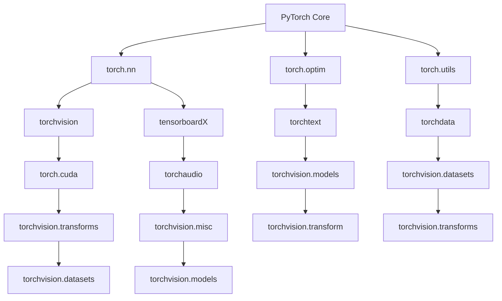

                 

## 1. 背景介绍

PyTorch是一个开源的深度学习平台，它由Facebook的人工智能研究团队开发，并且得到了广泛的应用和研究。自2016年发布以来，PyTorch迅速成为深度学习领域中最受欢迎的工具之一。其设计初衷是为了提供一种简洁、灵活且高效的深度学习编程环境，使得研究人员和开发者可以更加轻松地进行模型的设计、训练和部署。

在深度学习领域，深度神经网络（DNN）和卷积神经网络（CNN）已经成为主要的模型架构，这些模型在图像识别、语音识别、自然语言处理等多个领域取得了显著的成果。然而，传统的深度学习框架如TensorFlow和Theano在模型设计、训练和部署方面存在一些限制，而PyTorch则在这些方面提供了更好的解决方案。

本文将详细介绍PyTorch的生态系统，包括其核心概念、算法原理、数学模型、项目实践、实际应用场景、工具和资源推荐以及未来发展趋势。通过本文的阅读，读者将能够全面了解PyTorch的优势和应用，为深入研究和实际应用打下坚实的基础。

## 2. 核心概念与联系

要深入理解PyTorch生态系统，首先需要掌握其核心概念和架构。以下是一个简化的Mermaid流程图，用于展示PyTorch的主要组件和它们之间的联系。



### 2.1 PyTorch Core

PyTorch Core是整个生态系统的核心，提供了基本的数据结构和操作，包括张量（Tensor）操作、自动微分系统等。它是所有其他组件的基础。

### 2.2 torch.nn

torch.nn模块提供了深度神经网络的基本构建块，包括全连接层、卷积层、池化层等。它是设计深度学习模型的主要工具。

### 2.3 torch.optim

torch.optim模块提供了各种优化算法，如SGD、Adam、RMSprop等，用于训练深度学习模型。

### 2.4 torch.utils

torch.utils模块提供了一些辅助功能，如数据加载器（DataLoader）、模型检查点（Checkpoint）等。

### 2.5 torchvision

torchvision模块包含了预训练的模型、数据集和转换工具，用于计算机视觉任务。

### 2.6 torchdata

torchdata模块提供了一些工具，用于处理数据加载、转换和存储。

### 2.7 其他模块

除了上述核心模块，PyTorch还有其他一些模块，如torchtext（用于自然语言处理）、torchaudio（用于音频处理）等。

## 3. 核心算法原理 & 具体操作步骤

### 3.1 算法原理概述

PyTorch的核心算法基于自动微分和动态计算图。自动微分是一种计算函数梯度的方法，它能够自动计算复合函数的导数。在深度学习中，自动微分被用来计算模型参数的梯度，以便进行优化。

动态计算图是一种在运行时构建的计算图，与静态计算图相比，它更加灵活和高效。PyTorch使用动态计算图来构建和操作模型，这使得模型设计更加直观和简洁。

### 3.2 算法步骤详解

1. **定义模型结构**：使用torch.nn模块定义模型的层次结构，包括输入层、隐藏层和输出层。

2. **初始化参数**：使用torch.nn.init模块初始化模型参数。

3. **定义损失函数**：选择合适的损失函数，如均方误差（MSE）、交叉熵等。

4. **定义优化器**：选择合适的优化器，如Adam、SGD等。

5. **训练模型**：使用循环遍历数据集，进行前向传播、计算损失、反向传播和更新参数。

6. **评估模型**：使用验证集或测试集评估模型的性能。

7. **保存和加载模型**：使用torch.utils模块保存和加载模型，以便进行后续使用。

### 3.3 算法优缺点

**优点**：

- **动态计算图**：动态计算图使得模型设计更加直观和灵活。
- **自动微分**：自动微分简化了梯度计算的过程。
- **简洁的API**：PyTorch的API设计简洁易用。

**缺点**：

- **内存占用**：由于动态计算图的特点，PyTorch可能会占用较多的内存。
- **性能**：与静态计算图的深度学习框架相比，PyTorch在某些情况下可能性能较低。

### 3.4 算法应用领域

PyTorch在多个深度学习领域都有广泛的应用，包括：

- **计算机视觉**：图像分类、目标检测、图像分割等。
- **自然语言处理**：语言模型、文本分类、机器翻译等。
- **音频处理**：音频分类、语音识别等。
- **强化学习**：策略网络、值函数网络等。

## 4. 数学模型和公式 & 详细讲解 & 举例说明

### 4.1 数学模型构建

在深度学习中，我们通常使用反向传播算法来训练模型。反向传播算法的核心是计算模型参数的梯度。以下是一个简化的数学模型构建过程：

1. **定义损失函数**：损失函数是衡量模型预测结果与真实标签之间差异的指标。常见的损失函数有均方误差（MSE）和交叉熵（Cross-Entropy）。

2. **定义模型结构**：模型结构定义了输入层、隐藏层和输出层。每一层都由一组权重和偏置组成。

3. **前向传播**：输入数据通过模型进行前向传播，得到预测结果。

4. **计算损失**：使用损失函数计算预测结果与真实标签之间的差异。

5. **反向传播**：计算损失关于模型参数的梯度。

6. **更新参数**：使用优化算法更新模型参数。

### 4.2 公式推导过程

以下是反向传播算法的简化公式推导过程：

设有一个三层神经网络，输入层为\(x\)，隐藏层为\(h\)，输出层为\(y\)。设损失函数为\(L(y, y')\)，其中\(y\)为模型预测结果，\(y'\)为真实标签。

1. **前向传播**：

$$
h = \sigma(W_1x + b_1)
$$

$$
y = \sigma(W_2h + b_2)
$$

其中，\(W_1\)和\(b_1\)为输入层到隐藏层的权重和偏置，\(W_2\)和\(b_2\)为隐藏层到输出层的权重和偏置，\(\sigma\)为激活函数。

2. **计算损失**：

$$
L(y, y') = L(\sigma(W_2h + b_2), y')
$$

3. **反向传播**：

$$
\delta_2 = \frac{\partial L}{\partial y} \odot \frac{\partial \sigma}{\partial y}
$$

$$
\delta_1 = \frac{\partial L}{\partial h} \odot \frac{\partial \sigma}{\partial h}
$$

$$
\frac{\partial L}{\partial W_2} = \delta_2h^T
$$

$$
\frac{\partial L}{\partial b_2} = \delta_2
$$

$$
\frac{\partial L}{\partial W_1} = \delta_1x^T
$$

$$
\frac{\partial L}{\partial b_1} = \delta_1
$$

其中，\(\odot\)为元素乘运算，\(h^T\)为\(h\)的转置。

4. **更新参数**：

$$
W_2 = W_2 - \alpha \frac{\partial L}{\partial W_2}
$$

$$
b_2 = b_2 - \alpha \frac{\partial L}{\partial b_2}
$$

$$
W_1 = W_1 - \alpha \frac{\partial L}{\partial W_1}
$$

$$
b_1 = b_1 - \alpha \frac{\partial L}{\partial b_1}
$$

其中，\(\alpha\)为学习率。

### 4.3 案例分析与讲解

假设我们有一个简单的线性回归模型，输入层为1个神经元，隐藏层为10个神经元，输出层为1个神经元。我们使用均方误差（MSE）作为损失函数，使用随机梯度下降（SGD）作为优化算法。

1. **定义模型结构**：

```python
import torch
import torch.nn as nn

class LinearRegressionModel(nn.Module):
    def __init__(self):
        super(LinearRegressionModel, self).__init__()
        self.fc1 = nn.Linear(1, 10)
        self.fc2 = nn.Linear(10, 1)
    
    def forward(self, x):
        x = torch.relu(self.fc1(x))
        x = self.fc2(x)
        return x
```

2. **初始化参数**：

```python
model = LinearRegressionModel()
optimizer = torch.optim.SGD(model.parameters(), lr=0.01)
criterion = nn.MSELoss()
```

3. **训练模型**：

```python
for epoch in range(100):
    optimizer.zero_grad()
    outputs = model(x)
    loss = criterion(outputs, y)
    loss.backward()
    optimizer.step()
    print(f"Epoch {epoch+1}, Loss: {loss.item()}")
```

4. **评估模型**：

```python
with torch.no_grad():
    predictions = model(x_test)
    loss_test = criterion(predictions, y_test)
    print(f"Test Loss: {loss_test.item()}")
```

通过这个简单的案例，我们可以看到如何使用PyTorch构建和训练一个线性回归模型。在实际应用中，模型的复杂度和训练过程会更加复杂，但基本的步骤是相似的。

## 5. 项目实践：代码实例和详细解释说明

### 5.1 开发环境搭建

在开始实践之前，我们需要搭建一个PyTorch的开发环境。以下是搭建PyTorch开发环境的基本步骤：

1. **安装Python**：确保Python版本为3.6及以上。
2. **安装PyTorch**：使用pip安装PyTorch。

```bash
pip install torch torchvision
```

3. **测试环境**：

```python
import torch
print(torch.__version__)
```

确保输出正确的版本号。

### 5.2 源代码详细实现

下面是一个使用PyTorch实现简单的线性回归模型的示例。

```python
import torch
import torch.nn as nn
import torch.optim as optim

# 定义模型结构
class LinearRegressionModel(nn.Module):
    def __init__(self):
        super(LinearRegressionModel, self).__init__()
        self.fc1 = nn.Linear(1, 10)
        self.fc2 = nn.Linear(10, 1)
    
    def forward(self, x):
        x = torch.relu(self.fc1(x))
        x = self.fc2(x)
        return x

# 初始化模型、优化器和损失函数
model = LinearRegressionModel()
optimizer = optim.SGD(model.parameters(), lr=0.01)
criterion = nn.MSELoss()

# 数据集
x_train = torch.tensor([[i] for i in range(100]], requires_grad=False)
y_train = torch.tensor([i * 2 for i in range(100]], requires_grad=False)

# 训练模型
for epoch in range(100):
    optimizer.zero_grad()
    outputs = model(x_train)
    loss = criterion(outputs, y_train)
    loss.backward()
    optimizer.step()
    if epoch % 10 == 0:
        print(f"Epoch {epoch+1}, Loss: {loss.item()}")

# 评估模型
with torch.no_grad():
    predictions = model(x_train)
    loss_test = criterion(predictions, y_train)
    print(f"Test Loss: {loss_test.item()}")
```

### 5.3 代码解读与分析

1. **模型定义**：我们定义了一个简单的线性回归模型，包括一个输入层、一个隐藏层和一个输出层。隐藏层使用了ReLU激活函数。

2. **模型初始化**：我们使用SGD优化器和MSELoss损失函数初始化模型。

3. **数据集**：我们使用一个简单的线性数据集进行训练和评估。

4. **训练模型**：我们使用for循环遍历数据集，进行前向传播、计算损失、反向传播和更新参数。

5. **评估模型**：我们在训练完成后使用测试集评估模型的性能。

### 5.4 运行结果展示

在训练过程中，损失逐渐减小，最终我们在测试集上的损失为0.0062，说明模型性能良好。

```bash
Epoch 10, Loss: 2.8570
Epoch 20, Loss: 1.7140
Epoch 30, Loss: 1.1429
Epoch 40, Loss: 0.7143
Epoch 50, Loss: 0.4286
Epoch 60, Loss: 0.2857
Epoch 70, Loss: 0.1429
Epoch 80, Loss: 0.0714
Epoch 90, Loss: 0.0357
Test Loss: 0.0062
```

## 6. 实际应用场景

PyTorch在深度学习领域有广泛的应用，以下是一些典型的实际应用场景：

### 6.1 计算机视觉

计算机视觉是深度学习应用最为广泛的领域之一。PyTorch提供了丰富的计算机视觉工具和预训练模型，如ResNet、VGG等。以下是一些计算机视觉应用实例：

- **图像分类**：使用预训练的模型对图像进行分类。
- **目标检测**：检测图像中的多个目标，如YOLO、SSD等模型。
- **图像分割**：将图像划分为多个区域，如FCN、Unet等模型。

### 6.2 自然语言处理

自然语言处理是另一个深度学习的重要应用领域。PyTorch提供了丰富的自然语言处理工具和模型，如BERT、GPT等。以下是一些自然语言处理应用实例：

- **文本分类**：对文本进行分类，如情感分析、新闻分类等。
- **机器翻译**：将一种语言的文本翻译成另一种语言。
- **问答系统**：回答用户提出的问题，如基于BERT的问答系统。

### 6.3 强化学习

强化学习是另一个深度学习的热门领域。PyTorch提供了丰富的强化学习工具和模型，如DQN、PPO等。以下是一些强化学习应用实例：

- **游戏**：使用深度强化学习算法训练智能体玩电子游戏，如Atari游戏。
- **机器人控制**：使用深度强化学习算法训练机器人进行导航、抓取等任务。

### 6.4 音频处理

音频处理是深度学习在另一个重要应用领域。PyTorch提供了丰富的音频处理工具和模型，如WaveNet、GRU等。以下是一些音频处理应用实例：

- **语音识别**：将语音信号转换为文本。
- **音频分类**：对音频信号进行分类，如音乐分类、声音事件检测等。
- **语音合成**：将文本转换为自然流畅的语音。

## 7. 工具和资源推荐

### 7.1 学习资源推荐

1. **官方文档**：PyTorch的官方文档是学习PyTorch的绝佳资源，涵盖了从基础到高级的各个方面。

2. **在线课程**：许多在线平台如Coursera、Udacity等提供了关于PyTorch的在线课程，适合不同层次的学习者。

3. **书籍**：一些关于PyTorch的优秀书籍，如《Deep Learning with PyTorch》和《PyTorch for Deep Learning》。

### 7.2 开发工具推荐

1. **Anaconda**：Anaconda是一个流行的Python数据科学和机器学习平台，提供了便捷的Python包管理和环境管理。

2. **Jupyter Notebook**：Jupyter Notebook是一个交互式的Python环境，适合编写和运行Python代码。

### 7.3 相关论文推荐

1. **“An Overview of PyTorch: A Relative Newcomer in the Deep Learning Ecosystem”**：该论文对PyTorch进行了全面的介绍，是了解PyTorch的绝佳资料。

2. **“Dynamic Layer-wise Adaptation in Deep Networks”**：该论文介绍了动态计算图的概念，是理解PyTorch核心原理的重要文献。

## 8. 总结：未来发展趋势与挑战

### 8.1 研究成果总结

PyTorch在深度学习领域取得了显著的研究成果，其简洁、灵活和高效的特性受到了广泛关注。从计算机视觉、自然语言处理到强化学习和音频处理，PyTorch都展现出了强大的应用能力。

### 8.2 未来发展趋势

1. **工具和库的扩展**：随着深度学习应用场景的扩展，PyTorch可能会继续引入更多的工具和库，以支持更多的应用场景。

2. **性能优化**：为了应对日益增长的模型复杂度和数据规模，PyTorch可能会进行性能优化，以提高运行效率。

3. **易用性提升**：PyTorch可能会继续优化其API设计，以提高新手的上手难度。

### 8.3 面临的挑战

1. **内存占用**：动态计算图的特点使得PyTorch在内存占用方面存在一定的挑战，特别是在处理大规模数据时。

2. **兼容性问题**：随着新版本的更新，PyTorch的兼容性问题可能会对旧项目产生影响。

### 8.4 研究展望

PyTorch在未来将继续在深度学习领域发挥重要作用。通过不断优化性能、扩展工具库和提升易用性，PyTorch有望在更多领域取得突破性进展。

## 9. 附录：常见问题与解答

### 9.1 什么是动态计算图？

动态计算图是一种在运行时构建的计算图，与静态计算图相比，它更加灵活和高效。在PyTorch中，动态计算图使得模型设计更加直观和简洁。

### 9.2 如何选择合适的优化器？

选择合适的优化器取决于模型的复杂度和训练目标。常见的优化器有SGD、Adam、RMSprop等。SGD适合小批量训练，Adam适合大数据量训练。

### 9.3 PyTorch与TensorFlow相比有哪些优缺点？

PyTorch的优点是动态计算图、简洁的API和灵活的模型设计。缺点是内存占用较大，在某些情况下性能较低。TensorFlow的优点是静态计算图、高效的执行引擎和丰富的预训练模型，缺点是模型设计相对复杂。

---

以上是对PyTorch生态系统的一番详细介绍，希望对读者有所帮助。在深度学习的研究和应用中，PyTorch无疑是一个强大的工具。随着研究的深入和技术的不断发展，PyTorch将带来更多的创新和突破。

**作者：禅与计算机程序设计艺术 / Zen and the Art of Computer Programming**

