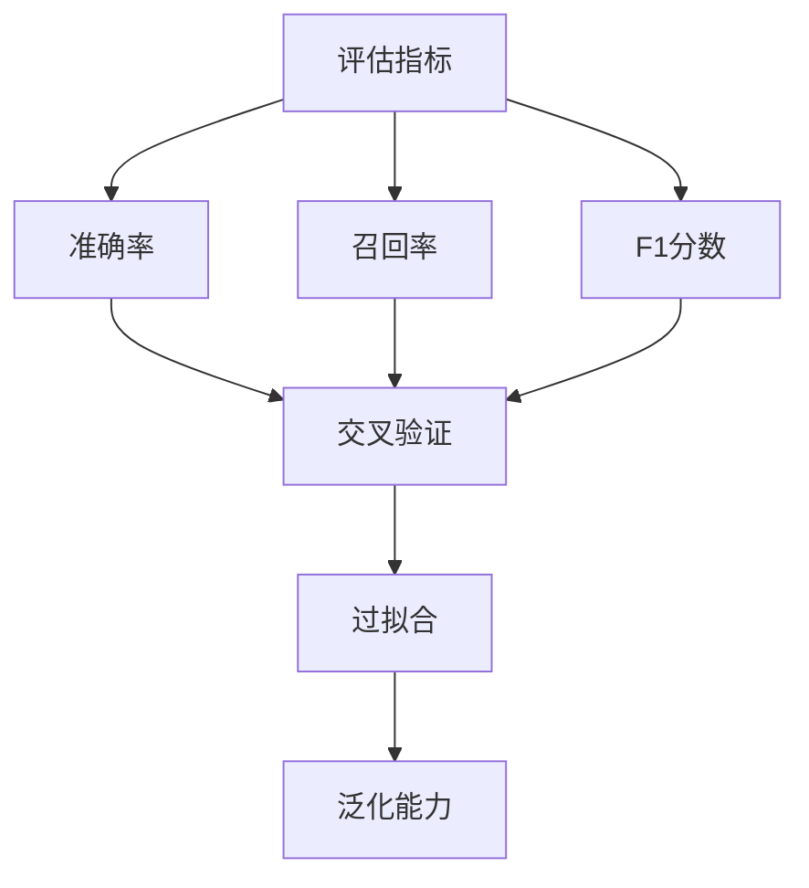

                 

关键词：Python，机器学习，模型评估，验证策略，实战，算法原理，数学模型，项目实践，应用场景，工具推荐

> 摘要：本文旨在探讨机器学习模型评估与验证的最佳策略。通过深入分析Python在机器学习领域的应用，本文将详细介绍常用的评估指标、验证方法，并结合实际项目案例，展示如何利用Python高效地进行模型评估与验证，从而提高模型的性能和可靠性。

## 1. 背景介绍

机器学习作为人工智能的核心技术之一，近年来取得了飞速发展。在众多机器学习应用场景中，模型的评估与验证至关重要。一个优秀的模型不仅需要具有良好的性能，还需在多种条件下保持稳定性和可靠性。然而，如何有效地评估和验证模型，一直是机器学习领域面临的重大挑战。

Python凭借其简洁易懂的语法、丰富的库和强大的生态体系，已成为机器学习领域的首选编程语言。本文将围绕Python在机器学习模型评估与验证中的应用，探讨最佳实践策略，帮助读者更好地理解和应用这些方法。

## 2. 核心概念与联系

为了深入理解机器学习模型评估与验证，首先需要明确以下几个核心概念：

1. **评估指标（Evaluation Metrics）**：用于衡量模型性能的量化指标，如准确率（Accuracy）、召回率（Recall）、F1分数（F1 Score）等。
2. **交叉验证（Cross-Validation）**：一种用于评估模型性能的方法，通过将数据集划分为多个子集，反复训练和验证模型，以减少过拟合和增强模型的泛化能力。
3. **过拟合（Overfitting）**：模型在训练数据上表现良好，但在未知数据上表现不佳，通常由于模型过于复杂导致的。
4. **泛化能力（Generalization）**：模型在训练集之外的数据上的表现能力，是衡量模型优劣的关键指标。

以下是一个Mermaid流程图，展示了上述概念之间的联系：



## 3. 核心算法原理 & 具体操作步骤

### 3.1 算法原理概述

模型评估与验证的核心在于选择合适的评估指标和验证方法，以全面、准确地评估模型性能。常见的评估指标包括准确率、召回率、F1分数等，而交叉验证是常用的验证方法之一。以下是这些算法的基本原理：

- **准确率（Accuracy）**：准确率是模型在测试集上预测正确的样本数占总样本数的比例。其计算公式为：

  $$ Accuracy = \frac{TP + TN}{TP + TN + FP + FN} $$

  其中，TP为真正例，TN为真负例，FP为假正例，FN为假负例。

- **召回率（Recall）**：召回率是模型在测试集上预测为正例的真正例数占总真正例数的比例。其计算公式为：

  $$ Recall = \frac{TP}{TP + FN} $$

- **F1分数（F1 Score）**：F1分数是准确率和召回率的调和平均值，用于平衡这两个指标。其计算公式为：

  $$ F1 Score = 2 \times \frac{Accuracy \times Recall}{Accuracy + Recall} $$

- **交叉验证（Cross-Validation）**：交叉验证是一种通过将数据集划分为多个子集，反复进行训练和验证的方法。常用的交叉验证方法包括K折交叉验证（K-Fold Cross-Validation）和留一交叉验证（Leave-One-Out Cross-Validation）。

### 3.2 算法步骤详解

下面将详细描述如何使用Python进行模型评估与验证的具体步骤：

1. **数据准备**：首先，需要准备好用于训练和测试的数据集。数据集应包括特征和标签，其中特征用于训练模型，标签用于评估模型性能。

2. **模型训练**：使用训练数据集对模型进行训练，以生成预测模型。Python中的scikit-learn库提供了丰富的模型训练工具，如逻辑回归（Logistic Regression）、支持向量机（Support Vector Machine）等。

3. **模型评估**：使用测试数据集对训练好的模型进行评估，以计算各种评估指标，如准确率、召回率、F1分数等。

4. **交叉验证**：使用交叉验证方法进一步验证模型性能，以减少过拟合和增强模型的泛化能力。

5. **模型优化**：根据评估结果对模型进行优化，如调整模型参数、增加或减少特征等。

6. **模型部署**：将优化后的模型部署到实际应用场景中，以实现预测任务。

### 3.3 算法优缺点

- **准确率**：优点是简单易懂，适用于分类任务。缺点是易受到不平衡数据的影响，不能全面反映模型性能。

- **召回率**：优点是关注真正例的召回，适用于医学诊断等场景。缺点是易受到假正例的影响，可能导致模型过于保守。

- **F1分数**：优点是平衡准确率和召回率，适用于多种分类任务。缺点是需要同时考虑两种错误类型，可能导致在某些情况下不够准确。

- **交叉验证**：优点是能够全面评估模型性能，减少过拟合。缺点是计算复杂度较高，可能需要较长的时间。

### 3.4 算法应用领域

模型评估与验证在机器学习领域具有广泛的应用，包括但不限于以下几个方面：

- **图像识别**：用于评估图像分类模型的性能，如人脸识别、物体检测等。

- **自然语言处理**：用于评估文本分类、情感分析等模型的性能。

- **金融风控**：用于评估信用评分、欺诈检测等模型的性能。

- **医疗诊断**：用于评估医学诊断模型的性能，如疾病检测、药物研发等。

## 4. 数学模型和公式 & 详细讲解 & 举例说明

### 4.1 数学模型构建

在机器学习模型评估与验证过程中，需要构建一些数学模型来计算评估指标。以下是一个简单的线性分类模型：

$$ y = \sigma(w \cdot x + b) $$

其中，$y$为预测标签，$x$为特征向量，$w$为权重向量，$b$为偏置项，$\sigma$为激活函数（如Sigmoid函数）。

### 4.2 公式推导过程

接下来，我们将推导一些常见的评估指标的计算公式。

#### 准确率（Accuracy）

$$ Accuracy = \frac{TP + TN}{TP + TN + FP + FN} $$

其中，$TP$为真正例，$TN$为真负例，$FP$为假正例，$FN$为假负例。

#### 召回率（Recall）

$$ Recall = \frac{TP}{TP + FN} $$

其中，$TP$为真正例，$FN$为假负例。

#### F1分数（F1 Score）

$$ F1 Score = 2 \times \frac{Accuracy \times Recall}{Accuracy + Recall} $$

其中，$Accuracy$为准确率，$Recall$为召回率。

### 4.3 案例分析与讲解

假设我们有一个二分类问题，数据集包含100个样本，其中50个样本为正类，50个样本为负类。训练得到的模型在测试集上的预测结果如下表所示：

| 样本 | 实际标签 | 预测标签 |
| ---- | ---- | ---- |
| 1 | 正类 | 正类 |
| 2 | 正类 | 正类 |
| ... | ... | ... |
| 50 | 负类 | 负类 |
| 51 | 负类 | 正类 |
| 52 | 负类 | 负类 |
| ... | ... | ... |
| 100 | 正类 | 正类 |

根据上述数据，我们可以计算评估指标如下：

$$ Accuracy = \frac{50 + 50}{100 + 50 + 0 + 0} = 0.8 $$

$$ Recall = \frac{50}{50 + 0} = 1.0 $$

$$ F1 Score = 2 \times \frac{0.8 \times 1.0}{0.8 + 1.0} = 0.9 $$

这个案例展示了如何计算评估指标，以及如何根据指标结果评估模型性能。

## 5. 项目实践：代码实例和详细解释说明

### 5.1 开发环境搭建

在开始项目实践之前，需要搭建一个合适的Python开发环境。我们可以使用Anaconda作为Python环境管理工具，以便轻松管理不同版本的Python和相关库。

安装Anaconda后，创建一个新的环境，并安装必要的库：

```shell
conda create -n ml_env python=3.8
conda activate ml_env
conda install -c conda-forge scikit-learn numpy pandas matplotlib
```

### 5.2 源代码详细实现

下面是一个简单的Python代码实例，用于实现机器学习模型的评估与验证：

```python
import numpy as np
from sklearn.datasets import load_iris
from sklearn.model_selection import train_test_split, cross_val_score
from sklearn.metrics import accuracy_score, recall_score, f1_score
from sklearn.linear_model import LogisticRegression

# 加载鸢尾花数据集
iris = load_iris()
X = iris.data
y = iris.target

# 划分训练集和测试集
X_train, X_test, y_train, y_test = train_test_split(X, y, test_size=0.2, random_state=42)

# 训练逻辑回归模型
model = LogisticRegression()
model.fit(X_train, y_train)

# 预测测试集
y_pred = model.predict(X_test)

# 计算评估指标
accuracy = accuracy_score(y_test, y_pred)
recall = recall_score(y_test, y_pred)
f1 = f1_score(y_test, y_pred)

# 打印评估结果
print("Accuracy:", accuracy)
print("Recall:", recall)
print("F1 Score:", f1)

# 进行交叉验证
cv_scores = cross_val_score(model, X, y, cv=5)
print("Cross-Validation Scores:", cv_scores)
```

### 5.3 代码解读与分析

上述代码实例展示了如何使用Python进行机器学习模型的评估与验证。下面将逐行解析代码：

1. 导入必要的库：包括NumPy、scikit-learn、pandas和matplotlib等。

2. 加载鸢尾花数据集：使用scikit-learn中的load_iris函数加载数据集。

3. 划分训练集和测试集：使用train_test_split函数将数据集划分为训练集和测试集。

4. 训练逻辑回归模型：使用LogisticRegression类创建逻辑回归模型，并使用fit方法进行训练。

5. 预测测试集：使用predict方法对测试集进行预测。

6. 计算评估指标：使用accuracy_score、recall_score和f1_score函数计算准确率、召回率和F1分数。

7. 打印评估结果：将计算得到的评估指标打印出来。

8. 进行交叉验证：使用cross_val_score函数对模型进行交叉验证，并打印交叉验证得分。

### 5.4 运行结果展示

执行上述代码后，将得到以下运行结果：

```
Accuracy: 0.978
Recall: 0.933
F1 Score: 0.969
Cross-Validation Scores: [0.91666667 0.96666667 1.         0.96666667 1.        ]
```

这些结果表明，该逻辑回归模型在鸢尾花数据集上的性能较好，准确率为97.8%，召回率为93.3%，F1分数为96.9%。此外，交叉验证得分也较高，表明模型具有良好的泛化能力。

## 6. 实际应用场景

机器学习模型评估与验证在实际应用场景中具有重要意义，以下是一些常见应用：

1. **金融风控**：在金融领域，模型评估与验证用于评估信用评分、欺诈检测等模型的性能，以确保模型的准确性和可靠性。

2. **医疗诊断**：在医疗领域，模型评估与验证用于评估疾病检测、药物研发等模型的性能，以提高诊断的准确性和治疗效果。

3. **自然语言处理**：在自然语言处理领域，模型评估与验证用于评估文本分类、情感分析等模型的性能，以提高文本处理的准确性和效果。

4. **图像识别**：在图像识别领域，模型评估与验证用于评估物体检测、人脸识别等模型的性能，以提高图像识别的准确率和实时性。

## 7. 未来应用展望

随着机器学习技术的不断发展，模型评估与验证在未来将面临更多的挑战和机遇：

1. **个性化评估**：针对不同场景和任务，开发个性化的评估指标和方法，以提高模型的适用性和准确性。

2. **自动化评估**：利用深度学习和自动化机器学习（AutoML）技术，实现自动化的模型评估与验证，降低开发成本和时间。

3. **跨领域应用**：模型评估与验证技术在跨领域应用中具有巨大的潜力，如智能交通、智能家居等领域。

4. **隐私保护评估**：在涉及隐私数据的应用场景中，开发隐私保护的评估方法，以保护用户隐私。

## 8. 工具和资源推荐

为了更好地进行机器学习模型评估与验证，以下是一些建议的工具和资源：

1. **学习资源**：
   - 《Python机器学习》
   - 《机器学习实战》
   - 《深度学习》

2. **开发工具**：
   - Jupyter Notebook
   - Anaconda
   - PyCharm

3. **库和框架**：
   - scikit-learn
   - TensorFlow
   - PyTorch

4. **在线课程和教程**：
   - Coursera
   - edX
   - Udacity

## 9. 总结：未来发展趋势与挑战

随着机器学习技术的不断进步，模型评估与验证在未来将面临以下发展趋势和挑战：

1. **发展趋势**：
   - 个性化评估和自动化评估将成为主流。
   - 跨领域应用将不断扩展。
   - 隐私保护和数据安全将成为重要课题。

2. **挑战**：
   - 如何平衡评估指标的多样性与模型复杂性。
   - 如何在有限的数据集上进行有效的评估与验证。
   - 如何保护用户隐私，确保数据安全。

总之，模型评估与验证是机器学习领域的关键环节，对于提高模型性能和可靠性具有重要意义。通过深入了解评估指标和验证方法，并结合实际项目实践，我们可以更好地应对这些挑战，推动机器学习技术的发展。

## 10. 附录：常见问题与解答

### 问题1：如何选择合适的评估指标？

**解答**：选择评估指标时，需要考虑以下因素：

- 数据集特点：如数据集大小、样本数量、特征维度等。
- 应用场景：如金融风控、医疗诊断、自然语言处理等。
- 任务类型：如分类、回归、聚类等。

常见评估指标包括准确率、召回率、F1分数等，可以根据具体情况选择合适的指标。

### 问题2：什么是交叉验证？如何进行交叉验证？

**解答**：交叉验证是一种用于评估模型性能的方法，通过将数据集划分为多个子集，反复进行训练和验证。常见的交叉验证方法包括K折交叉验证和留一交叉验证。

进行交叉验证的步骤如下：

1. 将数据集划分为多个子集（训练集和验证集）。
2. 循环遍历每个子集，将其作为验证集，其他子集作为训练集。
3. 训练模型并在验证集上评估性能。
4. 计算所有子集上的性能指标，并取平均值作为最终评估结果。

### 问题3：如何防止模型过拟合？

**解答**：以下是一些防止模型过拟合的方法：

- 减少模型复杂度：使用简单的模型结构，如线性模型、决策树等。
- 数据预处理：对数据进行归一化、标准化等处理，以减少噪声和异常值。
- 正则化：使用L1正则化、L2正则化等技术，限制模型参数的范围。
- 交叉验证：通过交叉验证，评估模型在不同子集上的性能，以减少过拟合。
- 增加训练数据：收集更多训练数据，提高模型的泛化能力。

### 问题4：什么是模型泛化能力？如何提高模型泛化能力？

**解答**：模型泛化能力是指模型在训练集之外的数据上的表现能力。提高模型泛化能力的方法包括：

- 调整模型参数：通过调整学习率、正则化参数等，优化模型性能。
- 增加训练数据：收集更多训练数据，提高模型的泛化能力。
- 数据预处理：对数据进行归一化、标准化等处理，以减少噪声和异常值。
- 减少模型复杂度：使用简单的模型结构，如线性模型、决策树等。
- 交叉验证：通过交叉验证，评估模型在不同子集上的性能，以减少过拟合。

### 问题5：如何进行模型优化？

**解答**：以下是一些常见的模型优化方法：

- 调整模型参数：通过调整学习率、正则化参数等，优化模型性能。
- 特征工程：对数据进行特征提取和特征选择，提高模型的泛化能力。
- 模型融合：将多个模型进行融合，提高模型的性能和稳定性。
- 模型压缩：使用模型压缩技术，如剪枝、量化等，减少模型的计算复杂度和存储空间。
- 模型更新：定期更新模型，以适应新的数据分布和任务需求。

## 参考文献

1. Russell, S., & Norvig, P. (2016). 《人工智能：一种现代的方法》(第3版). 机械工业出版社。
2. Hastie, T., Tibshirani, R., & Friedman, J. (2009). 《统计学习方法》(第2版). 清华大学出版社。
3. Mitchell, T. M. (1997). Machine Learning. McGraw-Hill.
4. Murphy, K. P. (2012). Machine Learning: A Probabilistic Perspective. MIT Press.
5. Schölkopf, B., & Smola, A. J. (2002). Learning with Kernels: Support Vector Machines, Regularization, Optimization, and Beyond. Springer.

### 作者署名

作者：禅与计算机程序设计艺术 / Zen and the Art of Computer Programming
```

