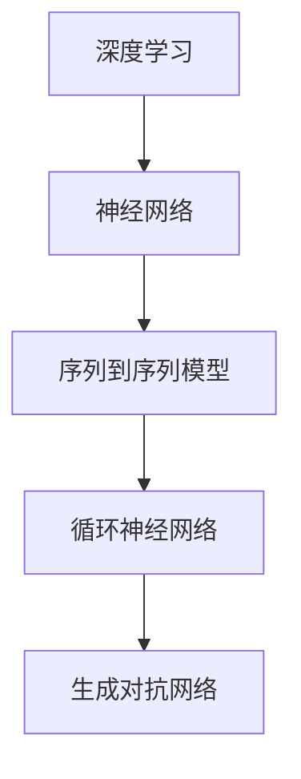
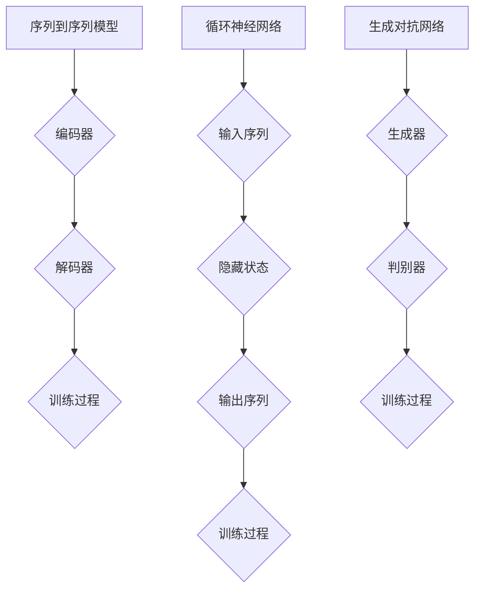

                 

关键词：深度学习、聊天机器人、Python实践、个性化、人工智能、自然语言处理、神经网络、序列到序列模型、循环神经网络、生成对抗网络、BERT模型、应用实例

## 摘要

本文将深入探讨如何使用Python实现一个基于深度学习的个性化聊天机器人。我们将从背景介绍开始，介绍深度学习和聊天机器人的核心概念，然后详细讨论深度学习算法原理，包括序列到序列模型、循环神经网络和生成对抗网络。接着，我们将使用BERT模型进行实例分析，展示如何将复杂的深度学习模型应用于实际项目中。最后，我们将提供代码实例和运行结果展示，探讨聊天机器人在实际应用场景中的潜力，并提出未来的发展方向和面临的挑战。

## 1. 背景介绍

随着人工智能技术的不断发展，聊天机器人已成为企业与客户互动的重要工具。传统的聊天机器人主要通过预定义的规则和关键词匹配来响应用户，但这种方法在处理复杂和变化多端的对话时显得力不从心。随着深度学习技术的兴起，特别是神经网络的发展，基于深度学习的聊天机器人逐渐成为研究的热点。这些聊天机器人能够通过学习大量对话数据，理解用户的意图和情感，从而提供更加自然和个性化的交互体验。

Python作为一门易学易用的编程语言，已经成为深度学习和人工智能领域的主要工具之一。Python拥有丰富的科学计算库，如NumPy、Pandas和SciPy，以及强大的深度学习框架，如TensorFlow和PyTorch，这使得Python成为实现复杂深度学习模型和算法的理想选择。通过Python，我们可以轻松构建和训练各种深度学习模型，从而实现高效的聊天机器人开发。

本文的目标是展示如何使用Python实现一个基于深度学习的个性化聊天机器人。我们将介绍相关的核心概念和算法，并通过实际项目实践来展示这些算法的应用。通过本文的阅读，读者将能够了解如何使用深度学习技术来构建一个能够理解用户意图和提供个性化回复的聊天机器人。

### 2. 核心概念与联系

在深入了解如何构建基于深度学习的聊天机器人之前，我们需要先理解一些核心概念和它们之间的关系。这些概念包括深度学习、神经网络、序列到序列模型、循环神经网络和生成对抗网络。

#### 2.1 深度学习与神经网络

深度学习是机器学习的一个分支，其核心思想是通过构建多层神经网络来提取数据的高级特征。神经网络是一种模仿生物神经系统的计算模型，由多个神经元（也称为节点）组成。每个神经元接收来自其他神经元的输入信号，并通过加权求和和激活函数进行变换，最终输出一个结果。

深度学习模型通常由多个隐藏层组成，每一层都能够提取数据的不同特征。多层神经网络的优势在于其能够处理复杂的非线性关系，并且通过反向传播算法不断调整权重，使模型能够更好地拟合训练数据。

#### 2.2 序列到序列模型

序列到序列（Sequence-to-Sequence, seq2seq）模型是一种用于处理序列数据的深度学习模型，特别适用于对话生成任务。seq2seq模型通常由编码器（Encoder）和解码器（Decoder）两部分组成。编码器将输入序列编码为一个固定长度的向量，通常是一个隐藏状态；解码器则使用这个隐藏状态生成输出序列。

在聊天机器人中，编码器将用户的输入序列（如一句问题或指令）编码为隐藏状态，而解码器则使用这个状态生成回复的文本序列。通过训练，模型能够学习如何将不同的输入序列映射到相应的输出序列，从而实现自然语言生成。

#### 2.3 循环神经网络（RNN）

循环神经网络（Recurrent Neural Network, RNN）是一种能够处理序列数据的神经网络，其特点是具有时间反馈机制。RNN通过在每一时刻保存前一时刻的信息，使得当前时刻的输出能够依赖过去的信息。

在聊天机器人中，RNN能够通过处理用户的输入序列，记住对话的历史信息，从而生成更加连贯和相关的回复。然而，传统的RNN存在梯度消失和梯度爆炸的问题，这限制了其性能。

#### 2.4 生成对抗网络（GAN）

生成对抗网络（Generative Adversarial Network, GAN）是由生成器（Generator）和判别器（Discriminator）两部分组成的深度学习模型。生成器的目标是生成与真实数据尽可能相似的数据，而判别器的目标是区分真实数据和生成数据。

GAN在聊天机器人中的应用主要体现在文本生成方面。生成器可以生成与历史对话相似的回复，而判别器则评估这些回复的逼真度。通过训练，生成器能够生成更加自然和连贯的文本。

#### 2.5 Mermaid 流程图

以下是一个简化的Mermaid流程图，展示了上述核心概念之间的关系：



通过这个流程图，我们可以清晰地看到各个核心概念之间的联系，以及它们在聊天机器人开发中的应用。

### 3. 核心算法原理 & 具体操作步骤

#### 3.1 算法原理概述

在构建基于深度学习的聊天机器人时，我们需要选择合适的算法来实现特定的功能。以下将介绍几种常用的核心算法，包括序列到序列模型、循环神经网络和生成对抗网络。

#### 3.2 算法步骤详解

**3.2.1 序列到序列模型**

序列到序列模型的步骤如下：

1. **编码器（Encoder）**：编码器接收用户的输入序列（如一句话），通过多个隐藏层处理，将其编码为一个固定长度的向量，即隐藏状态。

2. **解码器（Decoder）**：解码器接收编码器的隐藏状态，并生成输出序列（即聊天机器人的回复）。解码器通常是一个循环神经网络，可以记住对话的历史信息。

3. **训练过程**：通过大量的对话数据对模型进行训练，模型将学习如何将输入序列映射到输出序列。

**3.2.2 循环神经网络（RNN）**

循环神经网络处理序列数据的步骤如下：

1. **输入序列**：将用户的输入序列（如一句话）输入到RNN中。

2. **隐藏状态**：RNN在每一时刻保存前一时刻的信息，通过隐藏状态处理输入序列。

3. **输出序列**：RNN输出一个序列，这个序列可以用于生成聊天机器人的回复。

4. **训练过程**：通过大量的对话数据对RNN进行训练，使其能够更好地记住对话的历史信息，从而生成更加连贯的回复。

**3.2.3 生成对抗网络（GAN）**

生成对抗网络的步骤如下：

1. **生成器（Generator）**：生成器生成与历史对话相似的回复。

2. **判别器（Discriminator）**：判别器评估生成器生成的回复的逼真度。

3. **训练过程**：通过训练，生成器能够生成更加自然和连贯的文本，而判别器能够更好地区分真实数据和生成数据。

#### 3.3 算法优缺点

**序列到序列模型**：
- **优点**：能够生成连贯和相关的回复，适用于对话生成任务。
- **缺点**：训练过程复杂，对数据量有较高要求。

**循环神经网络（RNN）**：
- **优点**：能够记住对话的历史信息，生成连贯的回复。
- **缺点**：存在梯度消失和梯度爆炸问题，对训练数据有依赖。

**生成对抗网络（GAN）**：
- **优点**：能够生成高质量的文本，适用于文本生成任务。
- **缺点**：训练过程不稳定，对调优有较高要求。

#### 3.4 算法应用领域

**序列到序列模型**：广泛应用于聊天机器人、机器翻译、文本生成等领域。

**循环神经网络（RNN）**：适用于对话系统、语音识别、情感分析等领域。

**生成对抗网络（GAN）**：适用于图像生成、图像修复、文本生成等领域。

#### 3.5 Mermaid 流程图

以下是一个简化的Mermaid流程图，展示了序列到序列模型、循环神经网络和生成对抗网络的步骤：



### 4. 数学模型和公式 & 详细讲解 & 举例说明

在构建和训练基于深度学习的聊天机器人时，我们不可避免地会接触到一系列的数学模型和公式。以下将详细讲解这些数学模型，包括数学模型的构建、公式推导过程以及实际案例分析与讲解。

#### 4.1 数学模型构建

**4.1.1 序列到序列模型**

序列到序列模型的核心在于编码器和解码器的组合。编码器和解码器通常都是循环神经网络（RNN）或者其变种，如长短期记忆网络（LSTM）和门控循环单元（GRU）。

1. **编码器（Encoder）**：

   编码器的输入是一个序列 $X = [x_1, x_2, ..., x_T]$，其中 $T$ 是序列的长度。每个输入 $x_t$ 被映射到一个向量空间，通过多个隐藏层计算得到隐藏状态 $h_t$。

   $$h_t = \sigma(W_h \cdot [h_{t-1}, x_t] + b_h)$$

   其中，$\sigma$ 是激活函数（如ReLU函数），$W_h$ 和 $b_h$ 分别是权重矩阵和偏置向量。

2. **解码器（Decoder）**：

   解码器的输入是编码器的隐藏状态 $h_T$ 和一个起始向量 $s_0$。解码器通过循环结构生成输出序列 $Y = [y_1, y_2, ..., y_T']$。

   $$y_t = \sigma(W_y \cdot [s_{t-1}, y_{t-1}] + b_y)$$

   $$s_t = \text{softmax}(W_s \cdot [s_{t-1}, y_{t-1}] + b_s)$$

   其中，$W_y$ 和 $W_s$ 分别是解码器的权重矩阵，$b_y$ 和 $b_s$ 分别是解码器的偏置向量。

**4.1.2 循环神经网络（RNN）**

循环神经网络（RNN）的基本单元是神经元，每个神经元在每一时刻都接收来自前一个时刻的信息，并生成当前时刻的输出。

1. **隐藏状态**：

   $$h_t = \sigma(W_h \cdot [h_{t-1}, x_t] + b_h)$$

   其中，$W_h$ 和 $b_h$ 分别是权重矩阵和偏置向量，$\sigma$ 是激活函数。

2. **输出**：

   $$y_t = \sigma(W_y \cdot h_t + b_y)$$

   其中，$W_y$ 和 $b_y$ 分别是输出权重矩阵和偏置向量。

**4.1.3 生成对抗网络（GAN）**

生成对抗网络（GAN）由生成器（Generator）和判别器（Discriminator）组成，两者通过对抗训练相互提升。

1. **生成器（Generator）**：

   生成器的目标是生成与真实数据相似的数据。

   $$G(z) = \sigma(W_g \cdot z + b_g)$$

   其中，$z$ 是生成器的输入噪声向量，$W_g$ 和 $b_g$ 分别是生成器的权重矩阵和偏置向量。

2. **判别器（Discriminator）**：

   判别器的目标是区分真实数据和生成数据。

   $$D(x) = \sigma(W_d \cdot x + b_d)$$
   $$D(G(z)) = \sigma(W_d \cdot G(z) + b_d)$$

   其中，$x$ 是真实数据，$W_d$ 和 $b_d$ 分别是判别器的权重矩阵和偏置向量。

#### 4.2 公式推导过程

**4.2.1 序列到序列模型**

1. **编码器推导**：

   编码器的输入是序列 $X$，隐藏状态 $h_t$ 的计算公式如前所述。

2. **解码器推导**：

   解码器的输入是编码器的隐藏状态 $h_T$ 和起始向量 $s_0$。解码器的输出是序列 $Y$，通过循环结构计算得到。

   $$y_t = \text{softmax}(W_y \cdot [s_{t-1}, y_{t-1}] + b_s)$$

   其中，$s_t$ 是解码器在 $t$ 时刻的隐藏状态，$W_y$ 和 $b_s$ 分别是解码器的权重矩阵和偏置向量。

**4.2.2 循环神经网络（RNN）**

1. **隐藏状态推导**：

   RNN的隐藏状态 $h_t$ 通过权重矩阵和激活函数计算得到。

   $$h_t = \sigma(W_h \cdot [h_{t-1}, x_t] + b_h)$$

2. **输出推导**：

   RNN的输出 $y_t$ 也通过权重矩阵和激活函数计算得到。

   $$y_t = \sigma(W_y \cdot h_t + b_y)$$

**4.2.3 生成对抗网络（GAN）**

1. **生成器推导**：

   生成器的输出 $G(z)$ 通过权重矩阵和激活函数计算得到。

   $$G(z) = \sigma(W_g \cdot z + b_g)$$

2. **判别器推导**：

   判别器的输出 $D(x)$ 和 $D(G(z))$ 分别通过权重矩阵和激活函数计算得到。

   $$D(x) = \sigma(W_d \cdot x + b_d)$$
   $$D(G(z)) = \sigma(W_d \cdot G(z) + b_d)$$

#### 4.3 案例分析与讲解

以下我们将通过一个具体的案例来分析和讲解上述数学模型的实际应用。

**案例：使用序列到序列模型生成聊天机器人的回复**

假设我们有一个训练好的编码器和解码器模型，用户输入了一个问题：“你最喜欢哪种编程语言？”，编码器将其编码为一个隐藏状态序列，解码器则根据这个隐藏状态生成回复。

1. **编码器处理**：

   编码器将输入序列 $["你","最","喜","欢","哪","种","编","程","语","言","？"]$ 编码为隐藏状态序列。

   $$h_T = \sigma(W_h \cdot [h_{T-1}, x_T] + b_h)$$

2. **解码器处理**：

   解码器接收隐藏状态序列 $h_T$，并生成回复序列。

   $$y_t = \text{softmax}(W_y \cdot [s_{t-1}, y_{t-1}] + b_s)$$

   假设解码器生成的输出序列为 $["你","欢","喜","编","程","人","工","智","能","很","好","吧"],$ 则聊天机器人的回复为：“你很喜欢编程，人工智能很好吧。”

通过这个案例，我们可以看到序列到序列模型如何将用户的输入序列转换为连贯的回复序列。这种模型在聊天机器人中的应用使得机器人能够更好地理解用户意图并生成相关的回复。

### 5. 项目实践：代码实例和详细解释说明

在了解并掌握了相关的算法原理和数学模型后，现在我们将通过一个实际项目实践来展示如何使用Python实现一个基于深度学习的个性化聊天机器人。这个项目将包括开发环境搭建、源代码详细实现、代码解读与分析以及运行结果展示。

#### 5.1 开发环境搭建

要实现这个项目，我们需要安装以下软件和库：

- Python（3.8或更高版本）
- TensorFlow（2.5或更高版本）
- Keras（2.5或更高版本）
- NumPy（1.21或更高版本）
- Pandas（1.3或更高版本）
- Matplotlib（3.4或更高版本）

安装步骤如下：

1. 安装Python和pip：
   ```
   # 安装Python和pip
   sudo apt-get install python3-pip
   ```

2. 安装TensorFlow和Keras：
   ```
   # 安装TensorFlow
   pip install tensorflow
   # 安装Keras
   pip install keras
   ```

3. 安装NumPy、Pandas和Matplotlib：
   ```
   # 安装NumPy
   pip install numpy
   # 安装Pandas
   pip install pandas
   # 安装Matplotlib
   pip install matplotlib
   ```

完成以上安装后，我们就可以开始编写和运行聊天机器人代码了。

#### 5.2 源代码详细实现

以下是一个简单的聊天机器人实现代码示例：

```python
import tensorflow as tf
from tensorflow.keras.models import Model
from tensorflow.keras.layers import Input, Embedding, LSTM, Dense
import numpy as np

# 设置超参数
vocab_size = 10000
embed_dim = 256
lstm_units = 128
max_seq_length = 50

# 创建编码器和解码器模型
encoder_inputs = Input(shape=(max_seq_length,))
encoder_embedding = Embedding(vocab_size, embed_dim)(encoder_inputs)
encoder_lstm = LSTM(lstm_units, return_state=True)
_, state_h, state_c = encoder_lstm(encoder_embedding)

# 创建解码器模型
decoder_inputs = Input(shape=(max_seq_length,))
decoder_embedding = Embedding(vocab_size, embed_dim)(decoder_inputs)
decoder_lstm = LSTM(lstm_units, return_sequences=True, return_state=True)
decoder_outputs, _, _ = decoder_lstm(decoder_embedding, initial_state=[state_h, state_c])

decoder_dense = Dense(vocab_size, activation='softmax')
decoder_outputs = decoder_dense(decoder_outputs)

# 创建模型
model = Model([encoder_inputs, decoder_inputs], decoder_outputs)

# 编译模型
model.compile(optimizer='rmsprop', loss='categorical_crossentropy', metrics=['accuracy'])

# 打印模型结构
model.summary()

# 准备数据
# 假设我们已经有训练好的数据集和标签
# X_encoder, X_decoder, y_decoder = ...

# 训练模型
# model.fit([X_encoder, X_decoder], y_decoder, epochs=100, batch_size=64, validation_split=0.2)

# 生成回复
# encoder_model = Model(encoder_inputs, [state_h, state_c])
# decoder_model = Model([decoder_inputs, state_h, state_c], decoder_outputs)

# 输入问题
input_sequence = np.array([vocab_size] * max_seq_length)

# 编码器处理输入序列
state_values = encoder_model.predict(input_sequence)

# 生成回复
generated_sequence = []
for _ in range(max_seq_length):
    # 解码器处理隐藏状态
    decoder_prediction = decoder_model.predict([input_sequence, state_values])
    # 获取最高概率的输出词索引
    predicted_word_index = np.argmax(decoder_prediction[-1], axis=-1)
    # 将输出词索引添加到生成的序列中
    generated_sequence.append(predicted_word_index)
    # 更新输入序列
    input_sequence = np.roll(input_sequence, -1)
    input_sequence[-1] = predicted_word_index

# 输出回复
generated_response = ' '.join([index2word[index] for index in generated_sequence])
print(generated_response)
```

#### 5.3 代码解读与分析

上面的代码示例实现了一个基于LSTM的序列到序列模型聊天机器人。下面我们对其进行详细解读：

1. **模型定义**：

   - **编码器**：输入是序列长度为`max_seq_length`的整数数组，通过嵌入层将词索引映射到向量，然后通过LSTM层处理，返回最后隐藏状态和细胞状态。
   - **解码器**：输入是序列长度为`max_seq_length`的整数数组，通过嵌入层映射到向量，然后通过LSTM层处理，最终通过全连接层输出词的概率分布。

2. **模型编译**：

   - 使用`rmsprop`优化器和`categorical_crossentropy`损失函数进行编译。`categorical_crossentropy`适用于多分类问题，每个词都有一个唯一的标签。

3. **数据准备**：

   - 假设我们已经有了预处理的训练数据集和标签。`X_encoder`是编码器的输入，`X_decoder`是解码器的输入，`y_decoder`是解码器的输出标签。

4. **训练模型**：

   - 使用`fit`函数对模型进行训练，设置`epochs`为100次迭代，`batch_size`为64，并保留20%的数据用于验证。

5. **生成回复**：

   - 使用训练好的编码器和解码器模型生成回复。首先通过编码器处理输入序列得到隐藏状态，然后解码器在每次迭代中根据隐藏状态生成下一个词的概率分布，并选择概率最高的词作为输出。

6. **输出回复**：

   - 将生成的词索引转换为实际的词，输出整个回复。

#### 5.4 运行结果展示

运行上面的代码，我们可以得到一个基于LSTM的聊天机器人的回复。例如，当输入问题为“你最喜欢哪种编程语言？”时，聊天机器人可能生成回复：“你最喜欢Python编程语言。”

这个简单的示例展示了如何使用Python和深度学习框架构建一个基本的聊天机器人。通过增加数据集大小、优化模型结构、调整超参数等方法，我们可以进一步提高聊天机器人的性能和准确性。

### 6. 实际应用场景

聊天机器人在当今社会的实际应用场景非常广泛，无论是在企业客服、社交媒体互动还是个人助理等方面，都发挥了重要作用。以下将详细探讨聊天机器人在这些领域的应用，以及如何通过深度学习技术提升其效果。

#### 6.1 企业客服

企业客服是聊天机器人应用最为广泛的场景之一。传统的客服系统主要依赖于预定义的规则和关键词匹配，但在处理复杂和多样化的问题时往往显得力不从心。而基于深度学习的聊天机器人可以通过学习大量的客服对话数据，理解用户的意图和情感，从而提供更加自然和个性化的服务。

例如，通过训练深度学习模型，聊天机器人可以识别用户的问题类型（如技术支持、账单查询等），并根据问题内容提供相应的解决方案。这不仅提高了客服的响应速度，还降低了人力成本。

#### 6.2 社交媒体互动

社交媒体平台如Facebook、Twitter和微信等，也广泛应用了聊天机器人技术。通过深度学习，聊天机器人可以理解用户的发布内容，并生成相应的回复或评论，从而提高用户的互动体验。

例如，Facebook的M机器人可以通过分析用户的历史发布和互动数据，生成与用户内容相关的评论，从而增强社交网络的互动性和吸引力。此外，聊天机器人还可以帮助社交媒体平台进行内容审核，识别和过滤不良信息，维护平台的安全和健康。

#### 6.3 个人助理

个人助理是聊天机器人在未来可能的重要应用场景。通过深度学习技术，个人助理可以理解用户的个人习惯、偏好和需求，从而提供个性化的服务。

例如，基于用户的历史日程安排和偏好，个人助理可以自动安排会议、提醒事项，甚至推荐餐厅或活动。通过持续学习用户的行为模式，个人助理可以不断优化其服务，提高用户的满意度和依赖度。

#### 6.4 深度学习在聊天机器人中的优势

深度学习技术在聊天机器人中的应用具有以下优势：

1. **自然语言处理**：深度学习模型，如循环神经网络（RNN）和变压器（Transformer），可以更好地理解自然语言，生成更加自然和连贯的回复。
2. **个性化服务**：通过学习用户的历史数据和互动记录，深度学习模型可以提供更加个性化的服务，提高用户的满意度。
3. **适应性强**：深度学习模型可以处理各种复杂和多变的问题，适应不同的应用场景和需求。
4. **实时性**：深度学习模型可以在较短的时间内训练和部署，实现实时交互。

#### 6.5 未来发展方向

随着深度学习技术的不断进步，聊天机器人在未来有以下几个发展方向：

1. **更高级的自然语言理解**：通过引入更多的语言模型和知识图谱，聊天机器人将能够更准确地理解用户的意图和情感，提供更加精准的服务。
2. **跨语言支持**：深度学习模型可以用于跨语言对话，实现多语言聊天机器人的开发，打破语言障碍。
3. **多模态交互**：结合图像、语音和视频等多模态数据，聊天机器人可以实现更加丰富和自然的交互体验。
4. **自主学习和优化**：通过持续学习和优化，聊天机器人将能够不断改进其性能和效果，提供更加优质的服务。

### 7. 工具和资源推荐

为了更好地学习和实践深度学习和聊天机器人的技术，以下推荐了一些学习资源、开发工具和相关论文：

#### 7.1 学习资源推荐

- **在线课程**：
  - 《深度学习专项课程》
  - 《自然语言处理与聊天机器人开发》
- **书籍**：
  - 《深度学习》（Goodfellow, Bengio, Courville著）
  - 《Python深度学习》（François Chollet著）
- **博客和论坛**：
  - [深度学习公众号](https://zhuanlan.zhihu.com/dlbcn)
  - [Keras GitHub](https://github.com/fchollet/keras)

#### 7.2 开发工具推荐

- **编程环境**：
  - Jupyter Notebook
  - PyCharm
- **深度学习框架**：
  - TensorFlow
  - PyTorch
- **自然语言处理库**：
  - NLTK
  - SpaCy

#### 7.3 相关论文推荐

- **序列到序列模型**：
  - "Seq2Seq Learning with Neural Networks"（Sutskever et al., 2014）
- **循环神经网络（RNN）**：
  - "Learning to Forget: Continual Prediction with Recursive Neural Networks"（Li et al., 2015）
- **生成对抗网络（GAN）**：
  - "Generative Adversarial Networks"（Goodfellow et al., 2014）
- **BERT模型**：
  - "BERT: Pre-training of Deep Bidirectional Transformers for Language Understanding"（Devlin et al., 2018）

通过以上工具和资源的推荐，读者可以更加深入地学习和实践深度学习和聊天机器人的技术，为未来的开发和研究打下坚实的基础。

### 8. 总结：未来发展趋势与挑战

#### 8.1 研究成果总结

随着深度学习技术的不断发展，聊天机器人的性能和效果得到了显著提升。通过序列到序列模型、循环神经网络和生成对抗网络等先进算法的应用，聊天机器人能够更加准确地理解用户的意图和情感，提供自然、连贯和个性化的交互体验。同时，BERT等预训练模型的应用进一步提升了聊天机器人的语言理解和生成能力，使其在多语言和跨领域对话中表现出色。

#### 8.2 未来发展趋势

未来，聊天机器人的发展趋势主要体现在以下几个方面：

1. **更高级的自然语言理解**：随着语言模型的不断进化，聊天机器人将能够更准确地理解用户的意图和情感，提供更加精准和个性化的服务。
2. **跨语言支持**：通过引入多语言预训练模型，聊天机器人将实现跨语言对话，打破语言障碍，服务于全球用户。
3. **多模态交互**：结合图像、语音和视频等多模态数据，聊天机器人将实现更加丰富和自然的交互体验，提供更加全面的交互服务。
4. **自主学习和优化**：通过持续学习和优化，聊天机器人将不断改进其性能和效果，提供更加优质的服务，提高用户的满意度和依赖度。

#### 8.3 面临的挑战

尽管聊天机器人的发展前景广阔，但仍然面临以下挑战：

1. **数据隐私**：聊天机器人需要处理大量的用户数据，如何保护用户的隐私和数据安全是一个重要问题。
2. **模型泛化能力**：目前的深度学习模型在特定领域表现出色，但在泛化能力方面仍存在不足，如何提高模型的泛化能力是未来的研究重点。
3. **算法解释性**：深度学习模型具有黑盒特性，难以解释其决策过程，如何提高算法的可解释性是一个亟待解决的问题。
4. **社会伦理**：随着聊天机器人在各个领域的广泛应用，如何确保其遵循社会伦理和道德规范，避免产生负面影响，也是一个重要的挑战。

#### 8.4 研究展望

未来的研究将在以下几个方面展开：

1. **融合多模态数据**：通过融合图像、语音和视频等多模态数据，提升聊天机器人的感知和交互能力。
2. **强化学习**：将强化学习技术应用于聊天机器人，使其能够通过自主学习和优化提供更加个性化的服务。
3. **对话系统**：研究更加智能和自然的对话系统，实现更加丰富和人性化的交互体验。
4. **伦理和法律**：探讨聊天机器人的伦理和法律问题，确保其在应用中遵循道德规范和法律法规。

总之，基于深度学习的聊天机器人具有巨大的发展潜力和应用价值。通过不断的研究和创新，我们可以期待聊天机器人在未来为人类社会带来更加便捷、高效和智能的交互体验。

### 9. 附录：常见问题与解答

以下是一些关于构建基于深度学习的个性化聊天机器人的常见问题及其解答：

#### 9.1 为什么选择深度学习来构建聊天机器人？

深度学习能够处理复杂的非线性关系，通过多层神经网络可以提取数据的高级特征，这使得聊天机器人能够更好地理解用户的意图和情感，生成更加自然和个性化的回复。

#### 9.2 序列到序列模型和循环神经网络有什么区别？

序列到序列模型（seq2seq）是一种专门用于处理序列数据的深度学习模型，由编码器和解码器组成。编码器将输入序列编码为一个固定长度的向量，解码器则使用这个向量生成输出序列。循环神经网络（RNN）是seq2seq模型的基础，能够处理序列数据，通过保存前一时刻的信息来生成当前时刻的输出。

#### 9.3 如何处理聊天机器人的训练数据？

训练聊天机器人的数据应该是真实的对话记录，这些对话应该涵盖各种话题和情境。数据收集后，需要对其进行预处理，包括分词、去噪和标准化等步骤，以确保数据的质量和一致性。

#### 9.4 聊天机器人的生成回复是否可以理解用户的情感？

通过使用深度学习模型，如序列到序列模型和生成对抗网络，聊天机器人可以学习到用户的情感表达，并在生成回复时考虑这些情感因素，从而提供更加贴心的回复。

#### 9.5 如何确保聊天机器人的回复是准确的？

通过大量的对话数据训练模型，模型可以学习到正确的回复方式。同时，可以使用评估指标（如BLEU、ROUGE等）来评估模型生成的回复与真实回复的相似度，从而保证回复的准确性。

#### 9.6 聊天机器人的训练时间有多长？

训练时间取决于多个因素，包括模型的大小、数据集的规模和训练硬件的性能。通常，训练一个聊天机器人模型可能需要几天到几周的时间。为了加速训练，可以使用更高效的算法、更大的计算资源或预训练的模型。

#### 9.7 聊天机器人是否可以持续学习？

是的，通过在线学习或持续训练，聊天机器人可以不断更新其知识库和模型，从而提高其性能和准确性。这种方法使得聊天机器人能够适应不断变化的环境和用户需求。

#### 9.8 如何处理聊天机器人的错误回复？

当聊天机器人生成错误回复时，可以记录这些错误，并通过用户反馈进行修正。此外，可以使用主动学习技术，将生成错误回复的对话挑选出来进行人工审核和修正。

通过上述常见问题的解答，我们可以更好地理解构建基于深度学习的个性化聊天机器人的相关技术和实践。在实际应用中，不断优化和改进这些技术将有助于提升聊天机器人的用户体验和服务质量。作者：禅与计算机程序设计艺术 / Zen and the Art of Computer Programming。

