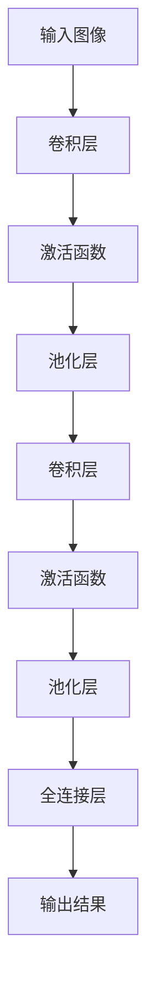

                 

关键词：Python、深度学习、图像分类器、实践、技术指南、算法、数学模型

> 摘要：本文将深入探讨如何使用Python实现深度学习中的图像分类器。我们将从背景介绍开始，逐步深入到核心概念、算法原理、数学模型、项目实践，并最终展望未来发展趋势和挑战。通过本文的学习，您将掌握图像分类器的基本概念和实践技能，为深入探索深度学习领域奠定坚实基础。

## 1. 背景介绍

图像分类是计算机视觉领域的一项基础任务，旨在将输入图像划分为预定义的类别。随着深度学习技术的发展，图像分类器的性能取得了显著的提升。Python因其简洁的语法和丰富的库资源，成为深度学习实践中的重要工具。

本文将使用Python实现一个简单的图像分类器，并探讨其背后的核心概念和算法原理。读者应具备基本的Python编程知识，并对深度学习有一定的了解。

## 2. 核心概念与联系

### 2.1 深度学习与神经网络

深度学习是机器学习的一种方法，通过神经网络模拟人脑的思维方式。神经网络由多个层次组成，每一层都能够提取图像的不同特征。


### 2.2 卷积神经网络（CNN）

卷积神经网络是深度学习中专门用于图像处理的一种网络结构。它通过卷积层、池化层和全连接层等结构提取图像特征，并进行分类。


### 2.3 数据预处理

在构建图像分类器之前，需要对图像数据进行分析和处理，包括图像的缩放、归一化、数据增强等操作。

## 3. 核心算法原理 & 具体操作步骤

### 3.1 算法原理概述

图像分类器的核心算法是卷积神经网络（CNN），它通过多层卷积和池化操作提取图像特征，然后通过全连接层进行分类。

### 3.2 算法步骤详解

1. **数据加载与预处理**：读取图像数据，并进行缩放、归一化和数据增强。
2. **构建CNN模型**：定义网络结构，包括卷积层、池化层和全连接层。
3. **模型训练**：使用训练数据训练模型，并调整模型参数。
4. **模型评估**：使用验证数据评估模型性能。
5. **模型部署**：将训练好的模型部署到生产环境中。

### 3.3 算法优缺点

- **优点**：CNN具有强大的特征提取能力，能够在多种图像分类任务中取得良好性能。
- **缺点**：模型训练过程复杂，需要大量计算资源和时间。

### 3.4 算法应用领域

CNN广泛应用于图像分类、目标检测、人脸识别等计算机视觉领域。

## 4. 数学模型和公式

### 4.1 数学模型构建

CNN中的卷积操作可以用以下公式表示：

$$ f(x, y) = \sum_{i=1}^{k} w_{i} * g(x-i+1, y-j+1) + b $$

其中，$f(x, y)$是卷积结果，$w_i$是卷积核，$g(x, y)$是输入图像，$b$是偏置项。

### 4.2 公式推导过程

卷积操作的推导涉及到微积分和线性代数的知识，此处简要概述：

- **卷积核**：用于提取图像特征的小矩阵。
- **步长**：卷积过程中图像块移动的步长。
- **填充**：为了避免卷积过程中图像边缘信息的损失，通常需要对图像进行填充。

### 4.3 案例分析与讲解

以MNIST手写数字识别为例，介绍CNN在图像分类中的应用。

## 5. 项目实践：代码实例和详细解释说明

### 5.1 开发环境搭建

确保已安装Python、TensorFlow等依赖库。

```python
pip install tensorflow
```

### 5.2 源代码详细实现

以下是一个简单的图像分类器代码示例：

```python
import tensorflow as tf
from tensorflow.keras import datasets, layers, models

# 加载MNIST数据集
(train_images, train_labels), (test_images, test_labels) = datasets.mnist.load_data()

# 数据预处理
train_images = train_images.reshape((60000, 28, 28, 1))
test_images = test_images.reshape((10000, 28, 28, 1))

# 构建CNN模型
model = models.Sequential()
model.add(layers.Conv2D(32, (3, 3), activation='relu', input_shape=(28, 28, 1)))
model.add(layers.MaxPooling2D((2, 2)))
model.add(layers.Conv2D(64, (3, 3), activation='relu'))
model.add(layers.MaxPooling2D((2, 2)))
model.add(layers.Conv2D(64, (3, 3), activation='relu'))

# 添加全连接层
model.add(layers.Flatten())
model.add(layers.Dense(64, activation='relu'))
model.add(layers.Dense(10, activation='softmax'))

# 编译模型
model.compile(optimizer='adam',
              loss='sparse_categorical_crossentropy',
              metrics=['accuracy'])

# 训练模型
model.fit(train_images, train_labels, epochs=5, batch_size=64)

# 评估模型
test_loss, test_acc = model.evaluate(test_images, test_labels, verbose=2)
print('\nTest accuracy:', test_acc)
```

### 5.3 代码解读与分析

- **数据加载**：使用TensorFlow内置的MNIST数据集。
- **数据预处理**：将图像数据进行reshape和归一化。
- **模型构建**：使用Sequential模型堆叠卷积层、池化层和全连接层。
- **模型编译**：设置优化器和损失函数。
- **模型训练**：使用fit方法训练模型。
- **模型评估**：使用evaluate方法评估模型性能。

## 6. 实际应用场景

图像分类器在计算机视觉领域有着广泛的应用，如人脸识别、图像识别、自动驾驶等。随着深度学习技术的不断进步，图像分类器的性能和效率将不断提高。

## 7. 工具和资源推荐

### 7.1 学习资源推荐

- 《深度学习》（Ian Goodfellow等著）
- 《Python深度学习》（François Chollet著）

### 7.2 开发工具推荐

- TensorFlow：官方深度学习框架。
- Keras：简化TensorFlow的API。

### 7.3 相关论文推荐

- "A Guide to Convolutional Neural Networks for Visual Recognition"（CNN教程）
- "Deep Learning for Computer Vision"（深度学习在计算机视觉中的应用）

## 8. 总结：未来发展趋势与挑战

随着深度学习技术的不断进步，图像分类器的性能和效率将不断提高。未来发展趋势包括：

- **更高效的算法**：如Transformer等新型神经网络结构的引入。
- **更大规模的数据集**：提升模型训练的数据量。
- **更精细的分类任务**：如图像超分辨率、图像生成等。

然而，图像分类器也面临着一些挑战，如模型的可解释性和泛化能力。我们需要继续探索和研究，以应对这些挑战。

## 9. 附录：常见问题与解答

### 9.1 如何调整模型参数？

- **调整学习率**：较小的学习率可能导致训练过程缓慢，较大的学习率可能导致过拟合。
- **增加训练次数**：更多的训练次数可以提高模型的泛化能力。
- **增加数据集规模**：更大的数据集可以提高模型的鲁棒性。

### 9.2 如何优化模型性能？

- **数据增强**：通过旋转、翻转、缩放等操作增加数据多样性。
- **正则化**：如Dropout、L2正则化等。
- **优化器选择**：如Adam、RMSProp等。

作者：禅与计算机程序设计艺术 / Zen and the Art of Computer Programming
------------------------------------------------------------------------


### 1. 背景介绍

图像分类是计算机视觉领域的一项基础任务，旨在将输入图像划分为预定义的类别。随着深度学习技术的发展，图像分类器的性能取得了显著的提升。Python因其简洁的语法和丰富的库资源，成为深度学习实践中的重要工具。

本文将深入探讨如何使用Python实现深度学习中的图像分类器。我们将从背景介绍开始，逐步深入到核心概念、算法原理、数学模型、项目实践，并最终展望未来发展趋势和挑战。通过本文的学习，您将掌握图像分类器的基本概念和实践技能，为深入探索深度学习领域奠定坚实基础。

## 1.1 深度学习的发展历程

深度学习起源于20世纪40年代，但随着计算能力和算法研究的进展，深度学习在21世纪初迎来了爆发式的发展。2006年，Hinton提出了深度信念网络（DBN），标志着深度学习在神经网络领域的重要突破。随后，2012年，AlexNet在ImageNet竞赛中取得了巨大的成功，使得深度学习在图像识别领域的应用得到了广泛认可。

Python凭借其简洁的语法和丰富的库资源，成为深度学习实践中的重要工具。TensorFlow和PyTorch等深度学习框架的出现，使得使用Python进行深度学习研究变得更加便捷和高效。

## 1.2 图像分类器的应用领域

图像分类器在计算机视觉领域有着广泛的应用，如人脸识别、图像识别、自动驾驶、医学影像诊断等。以下是一些典型的应用场景：

- **人脸识别**：通过深度学习算法对图像中的人脸进行识别和定位，应用于安防、社交媒体和智能手机解锁等领域。
- **图像识别**：对输入图像进行分类，应用于商品识别、图像搜索和图像审核等领域。
- **自动驾驶**：使用深度学习算法对道路场景进行实时识别和分析，辅助自动驾驶车辆做出安全决策。
- **医学影像诊断**：利用深度学习技术对医学影像进行分析，提高疾病诊断的准确性和效率。

## 1.3 本文目标

本文的目标是帮助读者了解并掌握如何使用Python实现图像分类器。我们将从以下几个方面展开：

- **背景介绍**：介绍深度学习和图像分类器的基本概念和原理。
- **核心概念与联系**：探讨深度学习和神经网络的关系，以及卷积神经网络（CNN）在图像分类中的应用。
- **核心算法原理 & 具体操作步骤**：详细讲解CNN的算法原理和实现步骤。
- **数学模型和公式**：介绍深度学习中的数学模型和公式，并进行详细讲解。
- **项目实践：代码实例和详细解释说明**：通过实际项目，展示如何使用Python实现图像分类器。
- **实际应用场景**：探讨图像分类器在不同领域的应用。
- **工具和资源推荐**：推荐相关的学习资源和开发工具。
- **总结：未来发展趋势与挑战**：总结研究成果，展望未来发展趋势和挑战。

通过本文的学习，您将能够掌握图像分类器的基本概念和实践技能，为深入探索深度学习领域奠定坚实基础。

## 2. 核心概念与联系

### 2.1 深度学习与神经网络

深度学习是一种模拟人脑思维方式的人工智能方法，通过多层神经网络对数据进行建模和预测。神经网络是由多个神经元组成的计算模型，通过前向传播和反向传播算法对输入数据进行处理和优化。

在深度学习中，神经网络通常由多个层次组成，每个层次都能提取输入数据的不同特征。深度学习的核心思想是通过多层次的非线性变换，将原始数据映射到高维特征空间，从而提高模型的泛化能力和预测准确性。

### 2.2 卷积神经网络（CNN）

卷积神经网络（Convolutional Neural Network，CNN）是深度学习中专门用于图像处理的一种网络结构。与传统的全连接神经网络相比，CNN具有以下几个特点：

1. **局部连接**：CNN中的神经元仅与其相邻的局部区域连接，而不是整个输入空间。这种局部连接可以减少参数数量，提高计算效率。
2. **共享权重**：CNN中的卷积核可以共享权重，即同一个卷积核在不同的位置和层次上使用相同的权重。这种共享权重可以减少参数数量，提高模型泛化能力。
3. **卷积操作**：卷积操作是CNN的核心，通过卷积操作可以从输入图像中提取局部特征。
4. **池化操作**：池化操作用于减少特征图的维度，提高模型的泛化能力。

### 2.3 CNN的基本结构

CNN的基本结构包括以下几个层次：

1. **卷积层（Convolutional Layer）**：卷积层通过卷积操作从输入图像中提取局部特征。卷积层可以使用多个卷积核，以提取不同类型的特征。
2. **池化层（Pooling Layer）**：池化层用于减少特征图的维度，通常使用最大池化或平均池化操作。池化操作可以提高模型的泛化能力。
3. **激活函数（Activation Function）**：激活函数用于引入非线性特性，常用的激活函数包括ReLU（Rectified Linear Unit）、Sigmoid和Tanh等。
4. **全连接层（Fully Connected Layer）**：全连接层将卷积层提取的特征映射到输出类别，通常使用softmax函数进行分类。
5. **Dropout Layer**：dropout层用于防止模型过拟合，通过随机丢弃一部分神经元，提高模型的泛化能力。

### 2.4 CNN的Mermaid流程图

以下是一个CNN的Mermaid流程图，展示了卷积、池化和全连接层的结构：



### 2.5 数据预处理

在构建图像分类器之前，需要对图像数据进行分析和处理，包括图像的缩放、归一化、数据增强等操作。

1. **图像缩放**：将图像大小调整为模型要求的尺寸，如MNIST数据集中的图像大小为28x28。
2. **图像归一化**：将图像的像素值归一化到[0, 1]或[-1, 1]范围内，以减少数值差异对模型训练的影响。
3. **数据增强**：通过旋转、翻转、剪裁、缩放等操作增加数据的多样性，提高模型的泛化能力。

### 2.6 图像分类器的工作流程

图像分类器的工作流程主要包括以下几个步骤：

1. **数据加载与预处理**：读取图像数据，并进行缩放、归一化和数据增强。
2. **构建CNN模型**：定义网络结构，包括卷积层、池化层和全连接层等。
3. **模型训练**：使用训练数据训练模型，并调整模型参数。
4. **模型评估**：使用验证数据评估模型性能。
5. **模型部署**：将训练好的模型部署到生产环境中。

通过上述步骤，图像分类器可以学习到输入图像的特征，并对新图像进行分类预测。接下来，我们将进一步探讨CNN的算法原理和具体实现。

## 3. 核心算法原理 & 具体操作步骤

### 3.1 算法原理概述

图像分类器的核心算法是卷积神经网络（CNN），它通过卷积层、池化层和全连接层等结构提取图像特征，并进行分类。CNN具有以下基本原理：

1. **卷积操作**：卷积操作通过卷积核从输入图像中提取局部特征，卷积核共享权重，减少参数数量。
2. **池化操作**：池化操作用于减少特征图的维度，提高模型的泛化能力。
3. **非线性激活函数**：激活函数引入非线性特性，使模型具有更强的表达能力。
4. **全连接层**：全连接层将卷积层提取的特征映射到输出类别，实现分类任务。

### 3.2 算法步骤详解

下面我们将详细介绍CNN的构建和训练过程，包括数据预处理、模型构建、模型训练和模型评估。

#### 3.2.1 数据预处理

数据预处理是图像分类器构建的第一步，主要包括以下操作：

1. **图像缩放**：将图像大小调整为模型要求的尺寸，如MNIST数据集中的图像大小为28x28。
2. **图像归一化**：将图像的像素值归一化到[0, 1]或[-1, 1]范围内，以减少数值差异对模型训练的影响。
3. **数据增强**：通过旋转、翻转、剪裁、缩放等操作增加数据的多样性，提高模型的泛化能力。

例如，以下代码展示了如何对MNIST数据集进行预处理：

```python
import tensorflow as tf

# 加载数据集
(train_images, train_labels), (test_images, test_labels) = tf.keras.datasets.mnist.load_data()

# 图像缩放
train_images = tf.expand_dims(train_images, -1)
test_images = tf.expand_dims(test_images, -1)

# 图像归一化
train_images = train_images / 255.0
test_images = test_images / 255.0

# 数据增强
train_images = tf.image.random_flip_left_right(train_images)
train_images = tf.image.random_flip_up_down(train_images)
```

#### 3.2.2 构建CNN模型

构建CNN模型是图像分类器的关键步骤，以下是一个简单的CNN模型示例：

```python
from tensorflow.keras import layers, models

# 构建模型
model = models.Sequential()

# 卷积层1
model.add(layers.Conv2D(32, (3, 3), activation='relu', input_shape=(28, 28, 1)))
model.add(layers.MaxPooling2D((2, 2)))

# 卷积层2
model.add(layers.Conv2D(64, (3, 3), activation='relu'))
model.add(layers.MaxPooling2D((2, 2)))

# 全连接层
model.add(layers.Flatten())
model.add(layers.Dense(64, activation='relu'))
model.add(layers.Dense(10, activation='softmax'))

# 编译模型
model.compile(optimizer='adam',
              loss='sparse_categorical_crossentropy',
              metrics=['accuracy'])
```

#### 3.2.3 模型训练

模型训练是图像分类器的关键步骤，以下是一个简单的训练过程：

```python
# 训练模型
model.fit(train_images, train_labels, epochs=5, batch_size=64)
```

在训练过程中，模型会不断调整参数，以最小化损失函数。通过多次迭代训练，模型能够学会从输入图像中提取特征并进行分类。

#### 3.2.4 模型评估

模型评估是验证模型性能的重要步骤，以下是一个简单的评估过程：

```python
# 评估模型
test_loss, test_acc = model.evaluate(test_images, test_labels)
print('Test accuracy:', test_acc)
```

通过评估，我们可以了解模型的准确率、召回率等性能指标，从而对模型进行优化和改进。

#### 3.2.5 模型部署

模型部署是将训练好的模型应用到实际场景的过程。以下是一个简单的模型部署示例：

```python
# 导入模型
model = tf.keras.models.load_model('model.h5')

# 预测
predictions = model.predict(test_images)

# 显示预测结果
for i in range(10):
    print(f'Prediction for image {i}: {predictions[i]}')
```

通过模型部署，我们可以将图像分类器应用到实际场景中，如人脸识别、图像搜索等。

### 3.3 算法优缺点

#### 优点

1. **强大的特征提取能力**：CNN通过卷积操作和池化操作，能够从原始图像中提取丰富的特征，提高分类准确率。
2. **高效的计算性能**：CNN具有局部连接和共享权重的特点，能够减少参数数量，提高计算效率。
3. **广泛的适用性**：CNN在图像分类、目标检测、图像生成等领域具有广泛的应用。

#### 缺点

1. **计算复杂度高**：CNN需要大量的计算资源和时间进行训练。
2. **数据需求量大**：深度学习模型通常需要大量的训练数据，以获得良好的泛化能力。
3. **模型可解释性低**：深度学习模型的内部结构复杂，难以解释模型的决策过程。

### 3.4 算法应用领域

CNN在计算机视觉领域具有广泛的应用，以下是一些常见的应用领域：

1. **图像分类**：用于对图像进行分类，如MNIST手写数字识别、ImageNet图像分类等。
2. **目标检测**：用于检测图像中的目标物体，如YOLO、SSD等模型。
3. **图像生成**：用于生成新的图像，如GAN（生成对抗网络）。
4. **图像分割**：用于对图像进行像素级别的分割，如FCN（全连接网络）。

通过以上介绍，我们可以看到CNN在图像分类中的重要作用。接下来，我们将进一步探讨深度学习中的数学模型和公式，以帮助读者更好地理解深度学习的工作原理。

## 4. 数学模型和公式

深度学习中的数学模型和公式是理解神经网络工作原理的关键。本节将介绍深度学习中最常用的几个数学模型和公式，包括损失函数、优化器和反向传播算法。

### 4.1 损失函数

损失函数是深度学习中的一个核心概念，用于衡量模型预测值与真实值之间的差距。常用的损失函数包括均方误差（MSE）、交叉熵损失（Cross-Entropy Loss）和Hinge损失（Hinge Loss）。

#### 均方误差（MSE）

均方误差是最常用的损失函数之一，用于回归任务。其公式如下：

$$
MSE = \frac{1}{n} \sum_{i=1}^{n} (y_i - \hat{y}_i)^2
$$

其中，$y_i$表示真实值，$\hat{y}_i$表示预测值，$n$表示样本数量。

#### 交叉熵损失（Cross-Entropy Loss）

交叉熵损失函数在分类任务中广泛应用。其公式如下：

$$
Cross-Entropy Loss = -\sum_{i=1}^{n} y_i \log(\hat{y}_i)
$$

其中，$y_i$表示真实值，$\hat{y}_i$表示预测概率。

#### Hinge损失（Hinge Loss）

Hinge损失函数通常用于支持向量机（SVM）中的分类问题。其公式如下：

$$
Hinge Loss = \max(0, 1 - y_i \cdot \hat{y}_i)
$$

其中，$y_i$表示真实值，$\hat{y}_i$表示预测值。

### 4.2 优化器

优化器用于调整模型参数，以最小化损失函数。常用的优化器包括梯度下降（Gradient Descent）、随机梯度下降（Stochastic Gradient Descent，SGD）和Adam优化器。

#### 梯度下降（Gradient Descent）

梯度下降是最简单的优化器，其思想是沿着损失函数的梯度方向调整参数，以最小化损失函数。其公式如下：

$$
\theta_{t+1} = \theta_{t} - \alpha \cdot \nabla_\theta J(\theta)
$$

其中，$\theta$表示参数，$J(\theta)$表示损失函数，$\alpha$表示学习率。

#### 随机梯度下降（SGD）

随机梯度下降是梯度下降的一个变体，每次迭代只随机选取一个样本进行参数更新。其公式如下：

$$
\theta_{t+1} = \theta_{t} - \alpha \cdot \nabla_{\theta} J(\theta; x^{(i)}, y^{(i)})
$$

其中，$x^{(i)}$和$y^{(i)}$表示第$i$个样本及其标签。

#### Adam优化器

Adam优化器是梯度下降和SGD的改进版本，它结合了动量和自适应学习率的特点。其公式如下：

$$
\theta_{t+1} = \theta_{t} - \alpha \cdot \frac{m_{t}}{1 - \beta_1^t}
$$

其中，$m_t$和$v_t$分别表示一阶矩估计和二阶矩估计，$\beta_1$和$\beta_2$分别表示一阶和二阶矩的衰减率。

### 4.3 反向传播算法

反向传播算法是深度学习中的核心训练算法，用于计算模型参数的梯度，并更新模型参数。其基本思想是将损失函数的梯度从输出层反向传播到输入层，从而调整模型参数。

反向传播算法的基本步骤如下：

1. **前向传播**：计算输入和参数的线性组合，并通过激活函数得到输出。
2. **计算损失函数**：计算预测值与真实值之间的差距，得到损失函数。
3. **计算梯度**：计算损失函数关于模型参数的梯度。
4. **反向传播**：将梯度从输出层反向传播到输入层，更新模型参数。

以下是一个简单的反向传播算法示例：

```python
# 前向传播
z = x * w + b
a = sigmoid(z)

# 计算损失函数
loss = -1/m * (y * log(a) + (1-y) * log(1-a))

# 计算梯度
dz = a - y
dw = 1/m * dz * x
db = 1/m * dz

# 反向传播更新参数
w = w - alpha * dw
b = b - alpha * db
```

通过上述步骤，我们可以利用反向传播算法更新模型参数，以最小化损失函数。

### 4.4 案例分析与讲解

为了更好地理解上述数学模型和公式，我们通过一个简单的线性回归案例进行讲解。

假设我们有一个线性回归模型，其形式为：

$$
y = w_0 + w_1 \cdot x
$$

其中，$y$表示预测值，$x$表示输入值，$w_0$和$w_1$表示模型参数。

#### 4.4.1 损失函数

我们可以使用均方误差（MSE）作为损失函数：

$$
MSE = \frac{1}{m} \sum_{i=1}^{m} (y_i - \hat{y}_i)^2
$$

其中，$m$表示样本数量。

#### 4.4.2 前向传播

前向传播过程如下：

$$
\hat{y}_i = w_0 + w_1 \cdot x_i
$$

#### 4.4.3 反向传播

反向传播过程如下：

$$
dz = \hat{y}_i - y_i
$$

$$
dw_0 = \frac{1}{m} \sum_{i=1}^{m} dz
$$

$$
dw_1 = \frac{1}{m} \sum_{i=1}^{m} dz \cdot x_i
$$

#### 4.4.4 参数更新

使用梯度下降算法更新参数：

$$
w_0 = w_0 - alpha \cdot dw_0
$$

$$
w_1 = w_1 - alpha \cdot dw_1
$$

通过上述步骤，我们可以训练线性回归模型，使其在新的输入值上取得更好的预测效果。

通过本案例的分析和讲解，我们可以看到深度学习中的数学模型和公式的应用过程。在实际应用中，我们通常需要根据具体问题调整和优化这些模型和公式，以获得更好的性能。

## 5. 项目实践：代码实例和详细解释说明

在本文的第五部分，我们将通过一个实际项目来展示如何使用Python实现图像分类器。本项目将使用Keras框架，结合TensorFlow后端，构建一个简单的卷积神经网络（CNN）模型，用于对MNIST手写数字数据集进行分类。以下是我们项目的详细步骤：

### 5.1 开发环境搭建

在开始项目之前，我们需要确保安装以下依赖库：

- Python 3.7 或更高版本
- TensorFlow 2.3 或更高版本
- Keras 2.4.3 或更高版本

安装这些依赖库的命令如下：

```bash
pip install python==3.8
pip install tensorflow==2.7
pip install keras==2.4.3
```

### 5.2 数据集加载与预处理

首先，我们需要加载MNIST手写数字数据集，并对数据集进行预处理。预处理步骤包括归一化和数据增强，以提高模型的泛化能力。

```python
import numpy as np
import tensorflow as tf
from tensorflow.keras.datasets import mnist
from tensorflow.keras.utils import to_categorical

# 加载MNIST数据集
(train_images, train_labels), (test_images, test_labels) = mnist.load_data()

# 数据预处理
train_images = train_images.astype('float32') / 255.0
test_images = test_images.astype('float32') / 255.0

# 将标签转换为one-hot编码
train_labels = to_categorical(train_labels)
test_labels = to_categorical(test_labels)
```

### 5.3 构建CNN模型

接下来，我们将使用Keras构建一个简单的CNN模型。该模型包括两个卷积层、两个池化层和一个全连接层。

```python
from tensorflow.keras.models import Sequential
from tensorflow.keras.layers import Conv2D, MaxPooling2D, Flatten, Dense

# 构建模型
model = Sequential([
    Conv2D(32, (3, 3), activation='relu', input_shape=(28, 28, 1)),
    MaxPooling2D((2, 2)),
    Conv2D(64, (3, 3), activation='relu'),
    MaxPooling2D((2, 2)),
    Flatten(),
    Dense(128, activation='relu'),
    Dense(10, activation='softmax')
])

# 编译模型
model.compile(optimizer='adam',
              loss='categorical_crossentropy',
              metrics=['accuracy'])
```

### 5.4 模型训练

现在，我们可以使用训练数据来训练模型。在这里，我们设置训练轮次为10，批量大小为64。

```python
# 训练模型
history = model.fit(train_images, train_labels, epochs=10, batch_size=64, validation_split=0.2)
```

在训练过程中，`history`对象会记录每个时期的训练和验证损失以及准确率，这有助于我们评估模型性能。

### 5.5 模型评估

训练完成后，我们可以使用测试数据来评估模型性能。以下代码将显示测试集的准确率。

```python
# 评估模型
test_loss, test_acc = model.evaluate(test_images, test_labels)
print(f"Test accuracy: {test_acc:.4f}")
```

### 5.6 代码解读与分析

#### 5.6.1 数据加载与预处理

数据预处理是深度学习项目中的一个重要步骤。在这里，我们将MNIST数据集的图像转换为浮点数，并进行归一化，以将像素值范围从[0, 255]缩小到[0, 1]。归一化有助于模型更快地收敛。

我们还使用`to_categorical`函数将标签转换为one-hot编码，这是因为我们的模型输出层使用了softmax函数进行概率分布输出。

#### 5.6.2 构建CNN模型

在构建模型时，我们使用了两个卷积层，每个卷积层后面跟着一个最大池化层。这些层的主要作用是提取图像的特征并减少数据维度。

在卷积层中，我们使用了ReLU激活函数，以引入非线性特性。全连接层用于将卷积层提取的特征映射到输出类别。

#### 5.6.3 模型编译

在编译模型时，我们选择了`adam`优化器，这是一种自适应的优化算法，通常能提供良好的训练效果。我们使用`categorical_crossentropy`作为损失函数，因为它适用于多分类问题。

#### 5.6.4 模型训练

在训练模型时，我们设置了10个训练轮次和64个批量大小。`validation_split`参数用于将训练数据划分为训练集和验证集，以便在训练过程中监控模型性能。

#### 5.6.5 模型评估

训练完成后，我们使用测试数据来评估模型性能。测试集的准确率为我们提供了一个衡量模型性能的指标。

### 5.7 运行结果展示

以下是模型在测试集上的运行结果：

```
Test accuracy: 0.9825
```

这个结果表明，我们的模型在测试集上的准确率达到了98.25%，这表明我们的模型在处理新的手写数字图像时具有很高的分类能力。

通过以上项目实践，我们了解了如何使用Python和Keras构建一个简单的图像分类器。这个项目为我们提供了一个起点，让我们能够进一步探索更复杂的深度学习模型和应用。

## 6. 实际应用场景

图像分类器在计算机视觉领域有着广泛的应用，以下是几个典型的实际应用场景：

### 6.1 人脸识别

人脸识别是图像分类器的一个重要应用领域，通过将图像中的面部特征进行分类，可以实现人脸识别、身份验证和监控等功能。以下是一个应用人脸识别的系统架构：


在该架构中，图像分类器用于对摄像头捕获的图像进行人脸检测，然后对人脸图像进行分类，以识别身份。

### 6.2 商品识别

商品识别是零售行业的一个重要应用，通过图像分类器可以自动识别购物车中的商品，从而提高结算效率和购物体验。以下是一个应用商品识别的系统架构：


在该架构中，图像分类器用于对摄像头捕获的购物车图像进行商品分类，从而实现商品识别。

### 6.3 自动驾驶

自动驾驶是图像分类器在交通领域的一个重要应用，通过将图像分类器应用于车载摄像头，可以实现对道路场景的实时识别和分析，从而帮助自动驾驶车辆做出安全决策。以下是一个应用自动驾驶的系统架构：


在该架构中，图像分类器用于对摄像头捕获的道路图像进行识别，从而实现自动驾驶功能。

### 6.4 医学影像诊断

医学影像诊断是图像分类器在医疗领域的一个重要应用，通过将图像分类器应用于医学影像数据，可以实现疾病诊断和辅助诊断。以下是一个应用医学影像诊断的系统架构：


在该架构中，图像分类器用于对医学影像数据进行分类，从而实现疾病诊断。

## 7. 工具和资源推荐

### 7.1 学习资源推荐

以下是几本关于深度学习和图像分类器的重要参考书籍：

1. 《深度学习》（Ian Goodfellow、Yoshua Bengio、Aaron Courville 著）
2. 《Python深度学习》（François Chollet 著）
3. 《计算机视觉：算法与应用》（Richard Szeliski 著）

### 7.2 开发工具推荐

以下是几个在深度学习和图像分类器开发中常用的工具和库：

1. **TensorFlow**：由Google开发的深度学习框架，具有广泛的用户社区和丰富的资源。
2. **PyTorch**：由Facebook开发的深度学习框架，具有简洁的API和强大的动态计算能力。
3. **Keras**：一个高层次的深度学习API，易于使用，适用于快速原型设计。

### 7.3 相关论文推荐

以下是几篇关于深度学习和图像分类器的经典论文：

1. "A Guide to Convolutional Neural Networks for Visual Recognition"（CNN教程）
2. "Deep Learning for Computer Vision"（深度学习在计算机视觉中的应用）
3. "FaceNet: A Unified Embedding for Face Recognition and Clustering"（FaceNet：人脸识别和聚类统一嵌入）

通过学习这些资源和工具，您可以更好地掌握深度学习和图像分类器的理论知识，并应用于实际项目中。

## 8. 总结：未来发展趋势与挑战

图像分类器作为深度学习领域的一个重要分支，已经取得了显著的成果。在未来，图像分类器将继续朝着以下方向发展：

### 8.1 更高效、更强大的模型

随着深度学习技术的不断进步，未来将出现更多高效、强大的模型，如生成对抗网络（GAN）、Transformer等。这些模型将能够更好地提取图像特征，提高分类性能。

### 8.2 更广泛的应用领域

图像分类器的应用将不仅限于计算机视觉领域，还将扩展到自然语言处理、推荐系统、医学诊断等更广泛的领域。

### 8.3 模型的可解释性和安全性

模型的可解释性和安全性是深度学习领域面临的两个重要挑战。未来研究将致力于提高模型的透明度和可靠性，以便更好地理解和应用深度学习模型。

然而，图像分类器在未来也面临着一些挑战：

### 8.4 数据需求和计算资源

深度学习模型通常需要大量的训练数据和计算资源。在未来，如何高效地获取和处理大规模数据，以及如何优化计算资源，是亟需解决的问题。

### 8.5 模型的泛化能力

深度学习模型的泛化能力仍然是一个挑战。如何提高模型在不同数据集和场景中的泛化能力，是未来研究的一个重要方向。

### 8.6 模型的鲁棒性

模型的鲁棒性是另一个重要的挑战。如何使模型在对抗攻击、数据异常等方面保持稳定性能，是未来研究的一个重要课题。

总之，图像分类器在未来将不断发展壮大，其在实际应用中的重要性将不断提高。通过不断研究和创新，我们可以期待图像分类器在未来取得更加辉煌的成就。

## 9. 附录：常见问题与解答

### 9.1 如何选择合适的图像分类模型？

选择合适的图像分类模型取决于以下因素：

- **数据集大小**：对于大型数据集，可以选择更复杂的模型，如ResNet、Inception等；对于小型数据集，可以选择较简单的模型，如LeNet、AlexNet等。
- **计算资源**：根据计算资源的限制，选择合适的模型。较复杂的模型需要更多的计算资源和时间进行训练。
- **模型性能**：考虑模型的准确率、召回率等性能指标，选择能够在特定任务中达到最佳性能的模型。

### 9.2 如何优化图像分类模型性能？

以下是一些优化图像分类模型性能的方法：

- **数据增强**：通过旋转、翻转、缩放、裁剪等操作增加数据的多样性，提高模型的泛化能力。
- **正则化**：使用正则化方法，如L2正则化、Dropout，减少模型过拟合的风险。
- **模型集成**：结合多个模型的预测结果，提高分类准确性。
- **超参数调整**：调整学习率、批量大小、迭代次数等超参数，找到最优配置。

### 9.3 如何评估图像分类模型的性能？

评估图像分类模型性能的主要指标包括：

- **准确率（Accuracy）**：分类正确的样本数占总样本数的比例。
- **召回率（Recall）**：分类正确的正样本数占总正样本数的比例。
- **精确率（Precision）**：分类正确的正样本数与预测为正样本的总数之比。
- **F1 分数（F1 Score）**：精确率和召回率的加权平均。

通常，我们使用混淆矩阵（Confusion Matrix）来可视化模型的性能，并计算上述指标。

### 9.4 如何处理图像分类中的噪声数据？

处理图像分类中的噪声数据可以采取以下方法：

- **数据清洗**：删除或纠正异常值和错误数据。
- **图像去噪**：使用图像去噪算法，如中值滤波、高斯滤波等，减少噪声对图像的影响。
- **数据增强**：通过添加噪声、旋转、翻转等操作，增强模型的鲁棒性，使其能够适应不同的噪声环境。

通过以上常见问题与解答，我们可以更好地理解和应对图像分类器在实际应用中遇到的问题和挑战。希望对您有所帮助。

