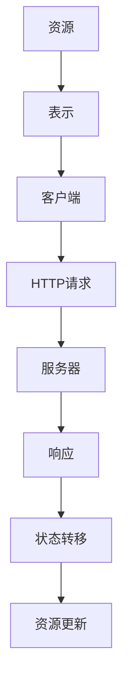

                 

关键词：RESTful API，Web服务，API设计，可扩展性，Web架构，HTTP协议，状态转移，资源，客户端-服务器模型。

## 摘要

本文将探讨RESTful API设计的原则和最佳实践，以及如何构建可扩展的Web服务。通过详细分析REST架构风格的核心概念和设计原则，本文旨在帮助开发者更好地理解如何设计高效、可维护且易于使用的API。此外，文章将提供具体的项目实践案例，以展示如何在实际开发中应用这些原则，从而构建具有高度可扩展性的Web服务。

## 1. 背景介绍

随着互联网的快速发展，Web服务已成为现代软件开发的核心组成部分。API（应用程序编程接口）作为Web服务的关键组件，允许不同系统之间进行互操作和数据交换。在众多API设计风格中，RESTful API因其简单、灵活且易于扩展的特点而广受欢迎。

REST（Representational State Transfer）是一种架构风格，它定义了一种通过HTTP协议进行状态转移的通信协议。RESTful API设计遵循REST原则，使得API具有简洁、统一和易于理解的特点，这有助于提高开发效率、系统可维护性和用户满意度。

### 1.1 REST架构风格的起源

REST架构风格最早由Roy Fielding在其博士论文《 Architectural Styles and the Design of Network-based Software Architectures》中提出。Fielding在其研究中分析了多种网络架构风格，并基于HTTP协议提出了REST模型，旨在为分布式系统提供一种简洁、高效且可扩展的通信方式。

### 1.2 RESTful API在Web服务中的应用

随着互联网技术的发展，RESTful API已成为构建Web服务的主流方式。它不仅适用于公共API，也广泛应用于内部服务和微服务架构中。RESTful API的广泛应用，使得开发者可以轻松实现不同系统之间的互操作，从而推动了互联网生态系统的繁荣发展。

## 2. 核心概念与联系

在RESTful API设计中，理解核心概念和它们之间的关系至关重要。以下是对RESTful API设计中的关键概念和架构的详细描述，以及一个使用Mermaid绘制的流程图，以展示这些概念之间的联系。

### 2.1 资源（Resources）

资源是RESTful API设计的核心概念。资源可以是一段文本、一张图片、一个视频等任何可以标识和操作的对象。每个资源都有一个唯一的标识符（通常是一个URL），通过该标识符可以在网络上访问和操作资源。

### 2.2 表示（Representations）

表示是资源的具体表现形式，如HTML页面、JSON对象、XML文档等。表示提供了资源的结构和数据，以便客户端可以理解和处理资源。

### 2.3 客户端-服务器模型（Client-Server Model）

客户端-服务器模型是REST架构的基础。在这种模型中，客户端发起请求，服务器处理请求并返回响应。客户端和服务器之间的通信遵循HTTP协议。

### 2.4 HTTP方法（HTTP Methods）

HTTP方法定义了客户端可以执行的操作，包括GET、POST、PUT、DELETE等。每种方法对应一种操作类型，如获取资源、创建资源、更新资源或删除资源。

### 2.5 状态转移（State Transfer）

状态转移是RESTful API的核心特点。客户端通过发送请求，触发服务器上的操作，从而改变资源的状态。这个过程是单向的，即从客户端到服务器，没有反向状态转移。

### 2.6 Mermaid流程图

以下是一个使用Mermaid绘制的流程图，展示了RESTful API设计中的关键概念和架构：



## 3. 核心算法原理 & 具体操作步骤

### 3.1 算法原理概述

RESTful API设计遵循REST架构风格，其核心原理包括资源标识、无状态性、统一接口和分层系统等。这些原理确保API具有简洁、灵活和可扩展的特点。

- 资源标识：每个资源都有一个唯一的URL标识符，以便客户端可以访问和操作资源。
- 无状态性：服务器不保存客户端之间的交互状态，每次请求都是独立的，这有助于提高系统的可扩展性和安全性。
- 统一接口：API采用统一的接口设计，包括HTTP方法、URL和状态码等，使得API易于理解和使用。
- 分层系统：API设计采用分层系统，使得不同层次的服务可以独立开发、部署和扩展。

### 3.2 算法步骤详解

#### 3.2.1 设计资源模型

首先，根据业务需求设计资源模型，确定资源的类型和属性。资源模型是API设计的基础，直接影响API的可扩展性和可维护性。

#### 3.2.2 确定URL结构

为每个资源设计一个唯一的URL，遵循RESTful原则。URL结构应简洁、直观，易于理解和记忆。通常，URL由资源名称和标识符组成。

#### 3.2.3 设计HTTP方法

为每种资源操作设计相应的HTTP方法，如GET、POST、PUT、DELETE等。每种方法对应一种操作类型，如获取资源、创建资源、更新资源或删除资源。

#### 3.2.4 设计响应结构

为API设计统一的响应结构，包括状态码、消息和数据等。状态码用于表示请求的结果，如200（成功）、400（错误请求）、500（服务器错误）等。

#### 3.2.5 实现API

根据设计文档实现API，包括处理HTTP请求、操作资源和生成响应等。实现过程中，注意遵循RESTful原则，确保API简洁、灵活和可扩展。

### 3.3 算法优缺点

#### 优点

- 简单易用：遵循统一的接口和HTTP方法，使得API设计简洁、直观，易于理解和使用。
- 可扩展性：采用分层系统和无状态性设计，使得API具有良好的可扩展性和可维护性。
- 灵活性：支持多种数据格式和协议，如JSON、XML和HTTP等，使得API可以适应不同场景和需求。

#### 缺点

- 缺乏语义：URL和HTTP方法缺乏语义，可能导致API设计不够直观，影响用户体验。
- 性能限制：由于HTTP协议本身的设计，RESTful API可能在性能上存在一定的限制，如数据传输速度、并发处理能力等。

### 3.4 算法应用领域

RESTful API设计广泛应用于各种领域，包括Web服务、移动应用、微服务架构等。以下是一些典型应用场景：

- Web服务：用于实现不同系统之间的互操作和数据交换，如在线商店、社交网络和天气预报服务等。
- 移动应用：用于实现移动应用与服务器之间的通信，如短信、地图和社交媒体应用等。
- 微服务架构：用于实现微服务之间的通信和协调，如分布式系统、云计算和物联网等。

## 4. 数学模型和公式 & 详细讲解 & 举例说明

### 4.1 数学模型构建

在RESTful API设计中，我们可以使用一些基本的数学模型来描述API的行为和性能。以下是一个简单的数学模型，用于描述API的响应时间和吞吐量：

$$
响应时间 = 成本 + 延迟 + 交互时间
$$

其中：

- 成本（Cost）：表示处理请求所需的时间，与系统性能相关。
- 延迟（Latency）：表示网络传输时间，与网络带宽和距离相关。
- 交互时间（Interaction Time）：表示客户端和服务器之间的交互时间，与系统设计有关。

### 4.2 公式推导过程

为了推导上述公式，我们可以将API的响应时间分解为以下几个部分：

- 成本：包括服务器处理请求所需的时间，如数据库查询、对象实例化等。
- 延迟：包括网络传输时间，如数据包在网络上传输的时间。
- 交互时间：包括客户端发送请求和服务器返回响应的时间。

我们可以使用以下公式来计算每个部分的时间：

$$
成本 = 处理时间
$$

$$
延迟 = 网络延迟
$$

$$
交互时间 = 请求发送时间 + 响应接收时间
$$

将这些部分合并，得到总响应时间：

$$
响应时间 = 成本 + 延迟 + 交互时间
$$

### 4.3 案例分析与讲解

以下是一个具体的案例，用于说明如何使用上述数学模型来分析和优化API性能。

假设我们有一个在线商店API，用于处理订单。API的响应时间和吞吐量是我们关注的重点。我们可以使用以下数据来计算API的响应时间和吞吐量：

- 处理时间（Cost）：0.5秒
- 网络延迟（Latency）：50毫秒
- 请求发送时间 + 响应接收时间（Interaction Time）：100毫秒

根据上述数据，我们可以使用数学模型来计算API的响应时间和吞吐量：

$$
响应时间 = 0.5秒 + 50毫秒 + 100毫秒 = 0.65秒
$$

$$
吞吐量 = \frac{1}{响应时间} = \frac{1}{0.65秒} \approx 1.54订单/秒
$$

根据计算结果，我们可以发现API的响应时间为0.65秒，吞吐量为约1.54订单/秒。为了提高API的性能，我们可以考虑以下优化措施：

- 减少处理时间：通过优化数据库查询、使用缓存等技术，减少服务器处理请求的时间。
- 减少网络延迟：通过使用更快的网络连接、优化路由等技术，减少网络传输时间。
- 减少交互时间：通过使用更高效的HTTP请求和响应格式、优化客户端和服务器的性能等技术，减少客户端和服务器之间的交互时间。

通过这些优化措施，我们可以进一步降低API的响应时间和提高吞吐量，从而提高系统的性能和用户体验。

## 5. 项目实践：代码实例和详细解释说明

### 5.1 开发环境搭建

在本项目中，我们将使用以下开发环境和工具：

- 开发语言：Python 3.8
- Web框架：Flask
- 版本控制：Git
- 代码编辑器：Visual Studio Code

首先，确保已安装Python 3.8和pip。然后，使用以下命令安装Flask：

```shell
pip install Flask
```

接下来，创建一个新的文件夹，例如`restful_api_example`，并在该文件夹中创建一个名为`app.py`的Python文件。

### 5.2 源代码详细实现

以下是`app.py`文件的源代码，实现了一个简单的RESTful API，用于处理用户信息的增删改查操作：

```python
from flask import Flask, jsonify, request

app = Flask(__name__)

users = [
    {'id': 1, 'name': 'Alice', 'email': 'alice@example.com'},
    {'id': 2, 'name': 'Bob', 'email': 'bob@example.com'},
]

@app.route('/users', methods=['GET'])
def get_users():
    return jsonify(users)

@app.route('/users/<int:user_id>', methods=['GET'])
def get_user(user_id):
    user = next((u for u in users if u['id'] == user_id), None)
    if user:
        return jsonify(user)
    else:
        return jsonify({'error': 'User not found'}), 404

@app.route('/users', methods=['POST'])
def create_user():
    new_user = request.get_json()
    users.append(new_user)
    return jsonify(new_user), 201

@app.route('/users/<int:user_id>', methods=['PUT'])
def update_user(user_id):
    user = next((u for u in users if u['id'] == user_id), None)
    if user:
        updated_user = request.get_json()
        user.update(updated_user)
        return jsonify(updated_user)
    else:
        return jsonify({'error': 'User not found'}), 404

@app.route('/users/<int:user_id>', methods=['DELETE'])
def delete_user(user_id):
    global users
    users = [u for u in users if u['id'] != user_id]
    return jsonify({'message': 'User deleted'})

if __name__ == '__main__':
    app.run(debug=True)
```

### 5.3 代码解读与分析

以下是对代码的详细解读与分析：

- 第1行：导入Flask模块。
- 第2行：创建Flask应用对象。
- 第4行：定义一个用户列表，用于存储用户信息。
- 第6-13行：定义了一个`get_users`函数，用于获取所有用户信息。该函数使用`jsonify`函数将用户列表转换为JSON格式的响应。
- 第15-22行：定义了一个`get_user`函数，用于获取特定用户信息。该函数使用`next`函数查找匹配的用户，并将结果转换为JSON格式的响应。
- 第24-31行：定义了一个`create_user`函数，用于创建新用户。该函数使用`get_json`函数获取请求体中的用户数据，并将其添加到用户列表中，然后返回新用户的JSON格式响应。
- 第33-40行：定义了一个`update_user`函数，用于更新用户信息。该函数使用`next`函数查找匹配的用户，并将请求体中的用户数据更新到用户列表中，然后返回更新后的用户的JSON格式响应。
- 第42-49行：定义了一个`delete_user`函数，用于删除用户信息。该函数使用列表推导式删除匹配的用户，并返回删除成功的JSON格式响应。
- 第51行：运行Flask应用，开启调试模式。

### 5.4 运行结果展示

在终端中运行以下命令，启动Flask应用：

```shell
python app.py
```

然后，在浏览器中访问以下URL，查看API的响应：

- 获取所有用户：`http://127.0.0.1:5000/users`
- 获取特定用户：`http://127.0.0.1:5000/users/1`
- 创建新用户：`http://127.0.0.1:5000/users`（请求体中包含新用户数据）
- 更新用户信息：`http://127.0.0.1:5000/users/1`（请求体中包含更新后的用户数据）
- 删除用户信息：`http://127.0.0.1:5000/users/1`

根据API的设计，我们可以得到相应的JSON格式响应，例如：

```json
{
  "users": [
    {"id": 1, "name": "Alice", "email": "alice@example.com"},
    {"id": 2, "name": "Bob", "email": "bob@example.com"}
  ]
}
```

通过这个简单的项目实践，我们可以看到如何使用Flask框架实现一个简单的RESTful API，并展示了如何对用户信息进行增删改查操作。

## 6. 实际应用场景

RESTful API设计在许多实际应用场景中发挥着重要作用。以下是一些典型的应用场景：

### 6.1 Web服务

Web服务是RESTful API最常见和应用最广泛的应用场景之一。通过RESTful API，不同的Web应用可以轻松实现数据交换和功能集成。例如，在线商店可以使用RESTful API与支付网关、库存管理系统和其他第三方服务进行集成。

### 6.2 移动应用

随着移动应用的兴起，RESTful API成为移动应用与服务器之间通信的桥梁。移动应用可以使用RESTful API获取数据、更新用户信息、提交订单等。RESTful API的简洁性和灵活性使得移动应用开发变得更加高效。

### 6.3 微服务架构

微服务架构是一种将应用程序分解为小型、独立的服务的方法。RESTful API在微服务架构中起着关键作用，用于服务之间的通信和协调。通过RESTful API，不同的微服务可以轻松实现数据共享和功能协同。

### 6.4 物联网（IoT）

物联网设备通常需要与云平台或其他物联网服务进行通信，以传输数据、接收指令等。RESTful API为物联网设备提供了一个简单、可靠且可扩展的通信方式。通过RESTful API，物联网设备可以轻松实现远程监控、数据分析和设备控制。

### 6.5 大数据与云计算

在大数据与云计算领域，RESTful API用于实现数据的采集、处理和存储。RESTful API可以方便地与大数据平台（如Hadoop、Spark）和云计算服务（如AWS、Azure）进行集成，实现海量数据的处理和分析。

### 6.6 企业内部服务

在企业内部，RESTful API用于实现不同部门、系统之间的数据共享和功能协同。通过RESTful API，企业可以构建一个高效、灵活的内部服务平台，提高业务流程的自动化和协作效率。

## 7. 工具和资源推荐

为了更好地设计和实现RESTful API，以下是一些建议的工具和资源：

### 7.1 学习资源推荐

- 《RESTful Web API设计》 - by Mark Musgrove：一本深入介绍RESTful API设计的经典著作。
- 《RESTful API设计与开发》 - by Lili Qiu：详细讲解RESTful API设计原则和实际开发技巧。
- REST API Design Guide - by MuleSoft：一份全面的RESTful API设计指南，涵盖各种设计模式和最佳实践。

### 7.2 开发工具推荐

- Postman：一款流行的API调试工具，支持HTTP请求的发送、调试和测试。
- Swagger：一款用于生成、描述和测试RESTful API的强大工具，支持自动生成API文档。
- Visual Studio Code：一款轻量级且强大的代码编辑器，支持各种编程语言的开发，包括Python、JavaScript等。

### 7.3 相关论文推荐

- "Architectural Styles and the Design of Network-based Software Architectures" - by Roy T. Fielding：REST架构风格的创始人Roy Fielding的博士论文，详细阐述了REST架构风格的核心概念和设计原则。
- "RESTful Web Services" - by Thomas F. Makowsky and Howard W. Lauer：一篇关于RESTful Web服务的综述文章，介绍了RESTful API的设计和实现方法。
- "API Design: Creating interfaces that developers love" - by Mark Musgrove：一篇关于API设计的优秀文章，提供了许多实用的设计技巧和最佳实践。

## 8. 总结：未来发展趋势与挑战

### 8.1 研究成果总结

随着互联网和云计算的快速发展，RESTful API设计已成为Web服务和分布式系统开发的核心技术之一。近年来，研究人员和开发者们在API设计、性能优化、安全性等方面取得了显著成果，推动了RESTful API的成熟和发展。

### 8.2 未来发展趋势

1. **API自动化与智能化**：未来的API设计将更加注重自动化和智能化，例如使用AI技术优化API性能、自动生成API文档等。
2. **跨平台与跨语言兼容性**：随着多语言、多平台开发的需求增加，RESTful API设计将更加注重跨平台和跨语言兼容性。
3. **API安全性**：随着API攻击的日益增多，未来的API设计将更加注重安全性，例如使用OAuth2.0、JWT等技术保护API资源。

### 8.3 面临的挑战

1. **性能优化**：随着API使用量的增加，如何优化API性能、提高响应速度和吞吐量成为一大挑战。
2. **安全性保障**：如何确保API资源的安全性，防止API攻击和数据泄露是未来的重要挑战。
3. **API标准化**：尽管RESTful API设计已经形成了许多最佳实践，但API标准化仍然是一个长期的目标，需要进一步研究和完善。

### 8.4 研究展望

未来的研究将在以下方向展开：

1. **API自动化与智能化**：探索使用AI技术自动优化API性能，提高开发效率和用户体验。
2. **API安全性**：研究新型API安全机制，提高API资源的防护能力。
3. **API标准化**：推动API标准化进程，制定统一的API设计规范和标准，提高API的可维护性和互操作性。

## 9. 附录：常见问题与解答

### 9.1 RESTful API设计中的URL设计原则是什么？

- **简洁性**：URL应简洁明了，避免冗长和复杂的路径结构。
- **一致性**：URL结构应保持一致性，便于理解和记忆。
- **语义性**：URL应包含必要的语义信息，例如资源类型和操作类型。
- **可扩展性**：URL应设计为易于扩展，以适应未来需求的变化。

### 9.2 如何确保RESTful API的安全性？

- **使用HTTPS**：确保API使用HTTPS协议，以保护数据传输的安全性。
- **身份验证与授权**：使用身份验证和授权机制（如OAuth2.0、JWT等）确保只有授权用户可以访问API资源。
- **输入验证**：对API输入进行严格验证，以防止注入攻击和恶意请求。
- **数据加密**：对敏感数据进行加密存储和传输，以防止数据泄露。

### 9.3 RESTful API与SOAP API的主要区别是什么？

- **协议**：RESTful API使用HTTP协议，而SOAP API使用XML-RPC协议。
- **架构风格**：RESTful API遵循REST架构风格，而SOAP API遵循SOAP协议。
- **灵活性**：RESTful API更灵活、易于扩展，而SOAP API较为严格和复杂。
- **性能**：RESTful API通常具有更好的性能，因为HTTP协议简单、高效。

### 9.4 如何优化RESTful API的性能？

- **缓存**：使用缓存策略，减少数据库查询和计算时间。
- **异步处理**：使用异步处理，提高并发处理能力。
- **负载均衡**：使用负载均衡器，分发请求到多个服务器，提高系统吞吐量。
- **数据库优化**：优化数据库查询，使用索引、分库分表等技术提高查询性能。

---

在本文中，我们详细探讨了RESTful API设计的原则、核心概念、算法原理、项目实践以及实际应用场景。通过学习这些内容，开发者可以更好地理解RESTful API的设计和实现方法，从而构建高效、可维护且易于使用的Web服务。随着互联网和云计算的不断发展，RESTful API设计将继续发挥重要作用，为分布式系统开发提供强大的支持。

