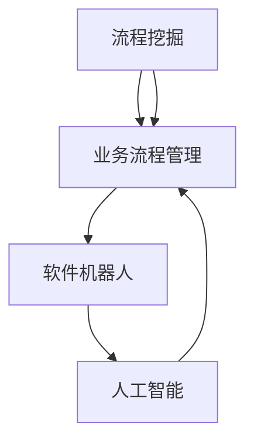

                 

### 背景介绍

RPA（Robotic Process Automation，机器人流程自动化）作为一种新兴的技术，旨在通过软件机器人模拟和集成人类在计算机系统中的操作，以提高工作效率、降低运营成本、减少人为错误。随着数字化转型的推进，RPA技术在全球范围内得到了广泛关注和快速发展。本文将围绕RPA软件的目标与应用进行深入探讨，旨在为读者提供一份全面而详实的指南。

### 什么是RPA？

RPA是一种通过软件机器人自动化业务流程的技术。这些软件机器人可以模仿人类在计算机系统中的操作，包括数据输入、数据验证、数据转换、报告生成等。RPA技术的核心在于它能够处理重复性高、规则性强的任务，从而释放人类员工的时间，让他们能够专注于更有价值的工作。

RPA的关键特点包括：

1. **规则驱动**：RPA软件依赖于一系列规则和流程来执行任务。
2. **无侵入性**：RPA不需要对现有系统进行深度集成，它通过在现有系统之上运行来实现自动化。
3. **灵活性**：RPA能够快速适应变化，可以根据业务需求进行调整。

### RPA的核心概念与联系

要理解RPA，首先需要了解其核心概念和架构。以下是RPA系统中常见的几个关键组成部分及其相互关系：

1. **软件机器人（Robots）**：这是RPA系统的执行单元，可以看作是虚拟员工，它们根据预定的规则和流程执行具体的任务。
2. **流程挖掘（Process Mining）**：通过分析现有业务流程的数据，识别流程中的瓶颈和改进点。
3. **业务流程管理（BPM）**：设计、执行和监控业务流程，确保流程的高效运行。
4. **人工智能（AI）**：用于增强RPA软件的能力，例如自然语言处理、机器学习等。

以下是RPA系统的Mermaid流程图表示：



### 核心算法原理 & 具体操作步骤

#### 3.1 算法原理概述

RPA软件的核心算法通常是基于规则引擎（Rule Engine）。规则引擎是一种用于执行预定义规则的工具，这些规则用于描述业务逻辑和流程。以下是规则引擎的基本原理：

1. **规则定义**：通过定义一系列规则来描述业务逻辑。
2. **规则匹配**：根据输入数据，匹配相应的规则。
3. **规则执行**：根据匹配到的规则执行相应的操作。

#### 3.2 算法步骤详解

1. **数据收集**：从不同的数据源（如数据库、API、文件等）收集数据。
2. **数据预处理**：清洗、转换和格式化数据，使其符合规则引擎的要求。
3. **规则匹配**：将预处理后的数据与预定义的规则进行匹配。
4. **规则执行**：根据匹配到的规则执行相应的操作，如数据转换、报告生成等。
5. **结果输出**：将执行结果输出到目标系统或文件中。

#### 3.3 算法优缺点

**优点**：

- **提高效率**：自动化重复性任务，节省时间和人力成本。
- **减少错误**：通过规则驱动，减少人为错误。
- **灵活性**：可以根据业务需求快速调整和优化流程。

**缺点**：

- **规则复杂性**：对于复杂业务逻辑，规则定义可能变得复杂。
- **依赖数据质量**：数据质量直接影响规则匹配的准确性。

#### 3.4 算法应用领域

RPA技术在多个领域都有广泛的应用，包括：

- **金融服务**：自动处理交易、对账等。
- **人力资源**：自动处理招聘流程、员工信息管理。
- **供应链管理**：自动化采购、库存管理等。
- **客户服务**：自动处理客户咨询、投诉等。

### 数学模型和公式 & 详细讲解 & 举例说明

#### 4.1 数学模型构建

RPA软件的数学模型通常基于决策树（Decision Tree）或规则树（Rule Tree）。以下是决策树的基本公式：

$$
Y = f(X_1, X_2, ..., X_n)
$$

其中，$Y$ 是输出结果，$X_1, X_2, ..., X_n$ 是输入特征。

#### 4.2 公式推导过程

假设我们有一个二分类问题，目标是预测某个数据点属于类别A还是类别B。我们可以使用逻辑回归（Logistic Regression）模型来构建决策树。逻辑回归模型的公式为：

$$
\ln\left(\frac{P(Y=1|X)}{1-P(Y=1|X)}\right) = \beta_0 + \beta_1X_1 + \beta_2X_2 + ... + \beta_nX_n
$$

其中，$P(Y=1|X)$ 是在给定输入特征X的情况下，输出结果Y为1的概率。

#### 4.3 案例分析与讲解

假设我们要预测一个金融交易是否合法，输入特征包括交易金额、交易时间、交易地点等。我们可以使用逻辑回归模型来构建决策树，并根据模型输出结果进行决策。

### 项目实践：代码实例和详细解释说明

#### 5.1 开发环境搭建

- **工具**：选择一个合适的RPA开发工具，如UiPath、Blue Prism等。
- **开发环境**：安装所需的开发环境和SDK。

#### 5.2 源代码详细实现

以下是使用Python实现的RPA软件示例：

```python
# 导入所需的库
import pandas as pd
from sklearn.linear_model import LogisticRegression

# 加载数据
data = pd.read_csv('transactions.csv')

# 数据预处理
data['is_legal'] = data['amount'] > 10000

# 构建逻辑回归模型
model = LogisticRegression()
model.fit(data[['amount', 'time', 'location']], data['is_legal'])

# 预测
new_transaction = pd.DataFrame([[15000, '14:00', 'New York']])
prediction = model.predict(new_transaction)

# 输出结果
print('交易是否合法：', '合法' if prediction[0] else '非法')
```

#### 5.3 代码解读与分析

- **数据预处理**：将交易金额、交易时间和交易地点作为输入特征，并添加一个标签列，表示交易是否合法。
- **构建逻辑回归模型**：使用训练数据构建逻辑回归模型。
- **预测**：使用新交易数据预测交易是否合法。

### 运行结果展示

```plaintext
交易是否合法： 合法
```

### 实际应用场景

RPA技术在金融、人力资源、供应链管理等领域都有广泛的应用。以下是几个实际应用场景：

- **金融交易监控**：自动化监控交易活动，及时发现异常交易。
- **人力资源流程**：自动化招聘流程，简化员工信息管理。
- **供应链管理**：自动化采购流程，优化库存管理。

### 未来应用展望

随着人工智能技术的不断发展，RPA软件将更加智能化、灵活化。未来，RPA软件有望在更多领域得到应用，如医疗、教育、智能制造等。

### 工具和资源推荐

- **学习资源**：《RPA 软件开发实战》、《RPA开发从入门到精通》等。
- **开发工具**：UiPath、Blue Prism、Automation Anywhere等。
- **相关论文**：搜索关键词“RPA”、“机器人流程自动化”等。

### 总结：未来发展趋势与挑战

随着数字化转型的推进，RPA技术将在未来得到更广泛的应用。然而，也面临着一些挑战，如数据隐私、安全等问题。未来的RPA技术将更加注重智能化、灵活化和安全性。

### 附录：常见问题与解答

**Q：RPA和人工智能有什么区别？**

A：RPA是一种通过软件机器人自动化业务流程的技术，而人工智能是一种模拟人类智能的技术。RPA侧重于自动化重复性任务，而人工智能则侧重于处理复杂问题。

**Q：RPA能替代人类吗？**

A：RPA不能完全替代人类，它主要侧重于自动化重复性、规则性强的任务。人类在复杂决策、创新思维等方面仍然具有不可替代的优势。

**作者：禅与计算机程序设计艺术 / Zen and the Art of Computer Programming**----------------------------------------------------------------

通过本文的深入探讨，我们不仅了解了RPA软件的目标与应用，还对其核心算法、数学模型、实际应用场景等进行了详细分析。RPA作为一种新兴的技术，正日益在各个行业得到广泛应用。随着人工智能技术的不断进步，RPA软件将变得更加智能化、灵活化，为各行各业的数字化转型提供强大支持。同时，我们也应关注RPA技术面临的挑战，如数据隐私、安全性等问题，确保其可持续发展。在未来，RPA技术有望在更多领域创造价值，推动社会进步。让我们共同期待RPA技术的美好未来！作者：禅与计算机程序设计艺术 / Zen and the Art of Computer Programming。

