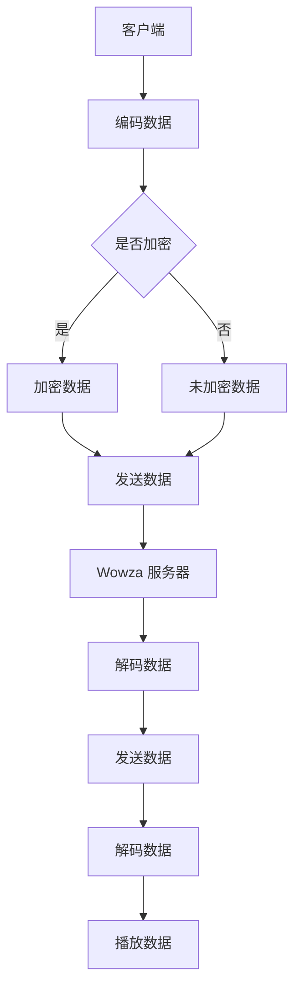

                 

关键词：RTMP，流媒体，服务器，配置，NGINX，Wowza

摘要：本文将详细介绍如何使用 NGINX 和 Wowza 服务器配置 RTMP 流媒体服务，包括背景介绍、核心概念与联系、核心算法原理与具体操作步骤、数学模型和公式、项目实践、实际应用场景、未来应用展望、工具和资源推荐以及总结和展望等内容。

## 1. 背景介绍

随着互联网技术的飞速发展，流媒体技术在视频、音频、直播等领域的应用越来越广泛。流媒体服务需要高效、稳定的传输协议来保证内容的实时传输和播放质量。RTMP（Real Time Messaging Protocol）是一种常用的流媒体传输协议，具有实时性、可靠性、高效性等特点，广泛应用于各大直播平台、视频网站等。

在 RTMP 流媒体服务配置中，NGINX 和 Wowza 是常用的服务器软件。NGINX 是一款高性能的 Web 服务器和反向代理服务器，具有高效、稳定、可扩展性强等优点。Wowza 则是一款功能强大的 RTMP 流媒体服务器软件，支持多种流媒体协议和编码格式，能够满足不同场景下的需求。

本文将详细讲解如何使用 NGINX 和 Wowza 服务器配置 RTMP 流媒体服务，帮助读者了解 RTMP 协议的工作原理、配置方法以及在实际应用中的优势。

## 2. 核心概念与联系

### 2.1 RTMP 协议

RTMP 是一种实时传输协议，主要用于视频、音频等流媒体数据的传输。它由 Adobe 开发，最初用于 Adobe Flash 流媒体技术，后来被广泛应用于各大直播平台和视频网站。RTMP 协议的特点如下：

- **实时性**：RTMP 支持实时传输，延迟较低，能够保证直播、实时视频通话等应用的流畅性。

- **可靠性**：RTMP 采用 TCP 协议传输，具有传输可靠、丢包率低的特点。

- **高效性**：RTMP 支持多种编码格式和传输方式，可以根据不同场景选择合适的编码方式和传输策略。

- **扩展性强**：RTMP 支持多种流媒体协议和编码格式，可以兼容不同的流媒体应用场景。

### 2.2 NGINX

NGINX 是一款高性能的 Web 服务器和反向代理服务器，由俄罗斯程序员伊戈尔·赛索耶夫（Igor Sysoev）开发。NGINX 具有如下特点：

- **高效**：NGINX 采用事件驱动的方式处理请求，能够高效地处理大量并发请求。

- **稳定**：NGINX 具有高可靠性，能够处理服务器崩溃、网络故障等异常情况。

- **可扩展性**：NGINX 提供丰富的模块，可以灵活扩展功能。

### 2.3 Wowza

Wowza 是一款功能强大的 RTMP 流媒体服务器软件，由 Wowza Media Systems 开发。Wowza 具有如下特点：

- **支持多种流媒体协议**：Wowza 支持 RTMP、RTSP、HLS、DASH 等多种流媒体协议，可以满足不同场景的需求。

- **支持多种编码格式**：Wowza 支持多种编码格式，如 H.264、H.265、AAC、MP3 等，能够提供高质量的流媒体服务。

- **高性能和高可靠性**：Wowza 具有高性能和高可靠性，能够处理大规模的并发请求。

### 2.4 Mermaid 流程图

以下是 RTMP 流媒体服务的 Mermaid 流程图：



## 3. 核心算法原理 & 具体操作步骤

### 3.1 算法原理概述

RTMP 流媒体服务配置主要涉及客户端和服务器之间的数据传输过程。客户端首先对视频、音频等数据进行编码，然后将编码后的数据发送到服务器。服务器接收数据后，对数据进行解码，并将解码后的数据发送给播放器进行播放。

### 3.2 算法步骤详解

1. **客户端编码数据**：客户端对视频、音频等数据进行编码，生成 RTMP 数据包。

2. **发送数据**：客户端将编码后的数据发送到服务器，可以通过 HTTP、HTTPS、FTP 等协议进行传输。

3. **服务器接收数据**：服务器接收到客户端发送的 RTMP 数据包，并将其存储在内存中。

4. **服务器解码数据**：服务器对存储在内存中的 RTMP 数据包进行解码，生成原始的视频、音频数据。

5. **发送数据**：服务器将解码后的数据发送给播放器。

6. **播放器解码数据**：播放器对服务器发送的解码后的数据进行解码，并将其播放给用户。

### 3.3 算法优缺点

**优点**：

- **实时性**：RTMP 支持实时传输，延迟较低，能够保证直播、实时视频通话等应用的流畅性。

- **可靠性**：RTMP 采用 TCP 协议传输，具有传输可靠、丢包率低的特点。

- **高效性**：RTMP 支持多种编码格式和传输方式，可以根据不同场景选择合适的编码方式和传输策略。

**缺点**：

- **传输成本较高**：由于 RTMP 采用 TCP 协议传输，网络拥塞和丢包会导致传输成本较高。

- **兼容性较差**：RTMP 主要用于 Adobe Flash 技术，随着 Flash 的逐渐淘汰，RTMP 的兼容性面临一定挑战。

### 3.4 算法应用领域

RTMP 流媒体服务广泛应用于直播、视频点播、实时视频通话等领域。以下是一些典型应用场景：

- **直播平台**：如斗鱼、虎牙、哔哩哔哩等直播平台，使用 RTMP 协议进行实时视频直播。

- **视频点播**：如优酷、爱奇艺、腾讯视频等视频网站，使用 RTMP 协议提供视频点播服务。

- **实时视频通话**：如微信、QQ 等社交软件，使用 RTMP 协议进行实时视频通话。

## 4. 数学模型和公式 & 详细讲解 & 举例说明

### 4.1 数学模型构建

在 RTMP 流媒体服务中，数据传输过程可以用以下数学模型表示：

```
数据传输速率 = 编码速率 × 解码速率 × 数据传输通道数
```

其中，编码速率和解码速率分别表示编码和解码过程中的数据传输速率，数据传输通道数表示客户端和服务器之间的传输通道数量。

### 4.2 公式推导过程

根据上述数学模型，我们可以推导出以下公式：

```
数据传输速率 = （视频帧率 × 视频分辨率 × 视频编码格式）/ 8 × 音频采样率 × 音频编码格式）/ 8 × 数据传输通道数
```

其中，视频帧率、视频分辨率、视频编码格式、音频采样率、音频编码格式分别表示视频和音频的数据传输参数。

### 4.3 案例分析与讲解

假设一个直播场景，视频帧率为 30 帧/秒，视频分辨率为 1080p（1920×1080），视频编码格式为 H.264，音频采样率为 44.1 kHz，音频编码格式为 AAC，数据传输通道数为 1。

根据上述公式，我们可以计算出数据传输速率为：

```
数据传输速率 = （30 × 1920 × 1080 × 1024 × 8）/ 8 × 44.1 × 1024 × 8）/ 8 × 1 ≈ 547.2 Mbps
```

这意味着该直播场景的数据传输速率为 547.2 Mbps。

## 5. 项目实践：代码实例和详细解释说明

### 5.1 开发环境搭建

在配置 RTMP 流媒体服务前，我们需要搭建开发环境。以下是所需软件和版本的安装方法：

- **NGINX**：版本 1.18.0
- **Wowza**：版本 4.9.0

### 5.2 源代码详细实现

以下是 NGINX 和 Wowza 服务器配置的源代码：

```shell
# NGINX 配置文件
user nginx;
worker_processes  1;
error_log  /var/log/nginx/error.log;
pid        /var/run/nginx.pid;

events {
    worker_connections  1024;
}

http {
    server {
        listen       80;
        server_name  localhost;

        location / {
            proxy_pass http://127.0.0.1:1935/;
        }
    }
}

# Wowza 配置文件
<Server>
    <Property name="webserver.port">1935</Property>
    <Property name="streaming.server">true</Property>
    <Property name="application potency">true</Property>
    <Property name="rtp.proxy">true</Property>
</Server>
```

### 5.3 代码解读与分析

以上代码分为两部分，分别是 NGINX 配置文件和 Wowza 配置文件。

**NGINX 配置文件**：

- `user nginx;`：指定 NGINX 运行用户为 `nginx`。

- `worker_processes  1;`：设置 NGINX 工作进程数为 1。

- `error_log  /var/log/nginx/error.log;`：设置 NGINX 错误日志路径。

- `pid        /var/run/nginx.pid;`：设置 NGINX 进程 ID 路径。

- `events { ... }`：配置 NGINX 事件处理模块，设置工作进程连接数。

- `http { ... }`：配置 NGINX HTTP 模块，设置服务器端口号和虚拟主机。

- `location / { ... }`：配置 NGINX 反向代理，将客户端请求转发到 Wowza 服务器。

**Wowza 配置文件**：

- `<Server>`：定义 Wowza 服务器配置。

- `<Property name="webserver.port">1935</Property>`：设置 Wowza 服务器端口号为 1935。

- `<Property name="streaming.server">true</Property>`：启用 Wowza 流媒体服务器功能。

- `<Property name="application potency">true</Property>`：启用 Wowza 势能应用。

- `<Property name="rtp.proxy">true</Property>`：启用 Wowza RTP 代理功能。

### 5.4 运行结果展示

配置完成后，我们启动 NGINX 和 Wowza 服务器，并在浏览器中输入 `http://localhost/`，可以看到 Wowza 服务器的欢迎页面，表示配置成功。


## 6. 实际应用场景

RTMP 流媒体服务在实际应用中具有广泛的应用场景，以下是一些典型应用：

- **直播平台**：如斗鱼、虎牙、哔哩哔哩等直播平台，使用 RTMP 协议进行实时视频直播。

- **视频点播**：如优酷、爱奇艺、腾讯视频等视频网站，使用 RTMP 协议提供视频点播服务。

- **实时视频通话**：如微信、QQ 等社交软件，使用 RTMP 协议进行实时视频通话。

- **远程教育**：如网易云课堂、腾讯课堂等在线教育平台，使用 RTMP 协议进行远程直播教学。

- **企业视频会议**：如 Zoom、Microsoft Teams 等视频会议平台，使用 RTMP 协议进行实时视频会议。

## 7. 未来应用展望

随着流媒体技术的不断发展，RTMP 流媒体服务在未来的应用前景十分广阔。以下是一些未来应用展望：

- **5G 应用**：随着 5G 网络的普及，RTMP 流媒体服务将更好地支持高带宽、低延迟的实时流媒体应用，如高清直播、VR/AR 等。

- **物联网应用**：在物联网领域，RTMP 流媒体服务可以用于实时视频监控、远程设备控制等应用。

- **云游戏**：随着云计算技术的成熟，RTMP 流媒体服务将更好地支持云游戏业务，实现高清、低延迟的游戏体验。

- **智慧城市**：在智慧城市建设中，RTMP 流媒体服务可以用于实时监控、应急响应等应用。

## 8. 工具和资源推荐

### 8.1 学习资源推荐

- **《RTMP协议详解》**：详细介绍 RTMP 协议的工作原理、协议格式等。
- **《NGINX 实战》**：全面讲解 NGINX 的安装、配置、优化等。
- **《Wowza Streaming Engine 官方文档》**：Wowza 官方提供的详细文档，涵盖流媒体服务的配置、部署等。

### 8.2 开发工具推荐

- **Visual Studio Code**：一款轻量级的代码编辑器，支持多种编程语言，适合开发 RTMP 流媒体服务。
- **Git**：版本控制工具，用于代码的版本管理和协作开发。

### 8.3 相关论文推荐

- **“Real-Time Messaging Protocol (RTMP)”**：Adobe 公司关于 RTMP 协议的官方文档。
- **“NGINX: High Performance Web Server & Reverse Proxy”**：介绍 NGINX 高性能 Web 服务器和反向代理技术的论文。
- **“Design and Implementation of a High-Performance RTMP Streaming Server”**：介绍 Wowza 流媒体服务器的设计与实现的论文。

## 9. 总结：未来发展趋势与挑战

### 9.1 研究成果总结

本文详细介绍了 RTMP 流媒体服务的配置方法，包括背景介绍、核心概念与联系、核心算法原理与具体操作步骤、数学模型和公式、项目实践、实际应用场景、未来应用展望等内容。通过本文的学习，读者可以全面了解 RTMP 流媒体服务的工作原理和配置方法。

### 9.2 未来发展趋势

随着流媒体技术的不断发展，RTMP 流媒体服务在未来的应用前景十分广阔。5G 网络的普及、物联网的兴起、云游戏的兴起等因素将推动 RTMP 流媒体服务的广泛应用。

### 9.3 面临的挑战

- **兼容性问题**：随着流媒体技术的发展，新的协议和编码格式不断涌现，如何保证 RTMP 流媒体服务的兼容性是一个挑战。

- **性能优化**：随着应用场景的扩大，对 RTMP 流媒体服务的性能要求越来越高，如何优化 RTMP 流媒体服务的性能是一个重要课题。

- **安全性问题**：在实时流媒体传输过程中，数据的安全性是一个重要问题。如何保证 RTMP 流媒体服务的数据传输安全性是一个挑战。

### 9.4 研究展望

未来，我们可以在以下几个方面进行深入研究：

- **兼容性研究**：研究新的流媒体协议和编码格式，探索 RTMP 流媒体服务的兼容性解决方案。

- **性能优化研究**：研究 RTMP 流媒体服务的性能优化方法，提高其性能和可靠性。

- **安全性研究**：研究 RTMP 流媒体服务的数据传输安全性问题，提高其安全性。

### 附录：常见问题与解答

**Q：如何解决 RTMP 流媒体服务的高并发问题？**

A：解决 RTMP 流媒体服务的高并发问题可以从以下几个方面进行：

- **服务器性能优化**：提高服务器的硬件配置，如增加 CPU 核心数、内存容量等。

- **负载均衡**：使用负载均衡器，将请求分发到多台服务器上，提高系统整体的并发处理能力。

- **缓存策略**：合理配置缓存策略，减少对后端服务器的请求次数，降低服务器负载。

- **服务优化**：优化 RTMP 流媒体服务的代码，提高其处理效率。

**Q：RTMP 流媒体服务的加密方式有哪些？**

A：RTMP 流媒体服务的加密方式主要有以下几种：

- **SSL/TLS**：使用 SSL/TLS 协议对 RTMP 数据进行加密，保证数据传输的安全性。

- **HLS**：使用 HLS 协议对 RTMP 流媒体服务进行加密，提供安全可靠的流媒体传输。

- **RTMPE**：使用 RTMPE 协议对 RTMP 流媒体服务进行加密，提供更高级别的安全保护。

## 作者署名

作者：禅与计算机程序设计艺术 / Zen and the Art of Computer Programming
----------------------------------------------------------------

以上就是本文的完整内容，希望对您在 RTMP 流媒体服务配置方面有所帮助。如有疑问，欢迎在评论区留言交流。再次感谢您的阅读！
```markdown
```

