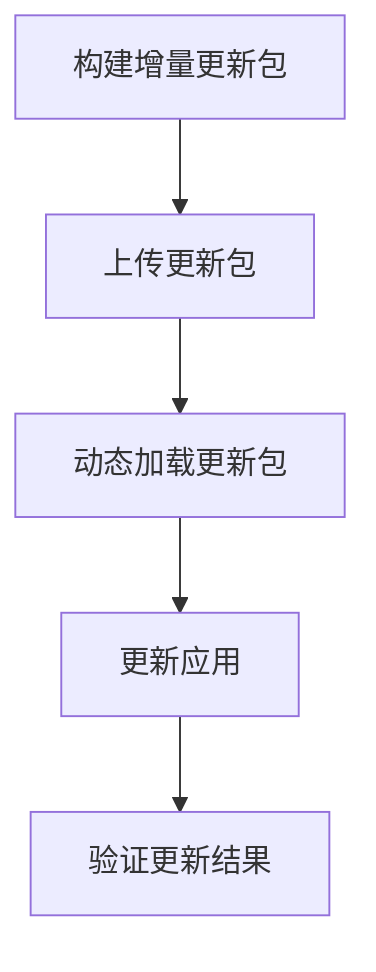

                 

在移动应用开发中，尤其是跨平台应用开发中，React Native因其高效的开发效率和出色的用户体验，受到了广泛的应用和认可。然而，在实际的应用过程中，我们不可避免地会遇到需要更新应用功能或修复bug的情况。这时，传统的客户端下载更新包、重启应用的方式就显得效率低下，用户体验不佳。因此，热更新（Hot Update）技术成为了提升应用维护效率、减少用户等待时间的关键技术。

## 关键词

- React Native
- 热更新
- JavaScript Core
- Webpack
- NativeScript

## 摘要

本文将深入探讨React Native热更新的实现原理、方法以及具体实践。首先，我们将简要介绍React Native及其热更新技术的背景；接着，深入分析热更新的核心概念和原理，并通过Mermaid流程图展示其架构；然后，详细介绍实现React Native热更新的算法原理、步骤及优缺点；随后，我们将讲解相关的数学模型和公式，并结合实际项目进行代码实例讲解；最后，我们将探讨热更新在实际应用场景中的表现，并展望其未来的发展趋势和面临的挑战。

## 1. 背景介绍

### React Native的诞生与热更新的需求

React Native是由Facebook推出的一款用于构建原生移动应用的框架，它使得开发者可以仅使用JavaScript一种语言，同时利用React的组件化思想，来开发iOS和Android平台的应用。这一特性极大地提升了开发效率，降低了开发成本。

然而，随着应用的不断发展，功能迭代和bug修复的需求日益增加。传统的应用更新方式往往需要用户下载完整的更新包并重启应用，这不仅影响了用户体验，也增加了应用的分发和部署成本。为了解决这个问题，热更新技术应运而生。

热更新（Hot Update）指的是在不关闭或重启应用的情况下，直接更新应用的功能或修复bug。这一技术使得开发者可以实时部署更新，用户无需进行繁琐的操作，从而提升了应用的可维护性和用户体验。

### 热更新的技术背景

热更新技术并不是React Native特有的，早在Web前端领域，开发者就已经开始探索并使用各种JavaScript库和工具来实现热更新。例如，使用Webpack的Hot Module Replacement（HMR）功能，可以实现JavaScript模块的热更新。

在React Native中，JavaScript Core（JSI）是JavaScript与Objective-C/Swift之间的交互桥梁。通过修改JSI，可以实现JavaScript代码的实时加载和执行，从而实现热更新。

### 热更新的重要性

热更新技术在现代移动应用开发中扮演着重要的角色。它不仅提升了应用的维护效率，减少了用户的等待时间，还有助于提升应用的稳定性和安全性。通过热更新，开发者可以快速响应用户的需求，不断优化和改进应用，从而增强用户满意度。

总的来说，React Native热更新技术的引入，为移动应用开发带来了新的可能性，使得应用开发更加灵活和高效。

## 2. 核心概念与联系

### 热更新的核心概念

热更新的核心概念主要包括以下几个方面：

1. **模块替换**：热更新允许开发者替换应用中的特定模块，而无需重新加载整个应用。这样可以显著提高更新速度，减少用户等待时间。
2. **代码动态加载**：通过动态加载JavaScript代码，热更新可以在不重启应用的情况下，将新代码注入到运行中的应用中。
3. **JavaScript Core（JSI）**：JavaScript Core是React Native中的核心组件，负责JavaScript与Objective-C/Swift之间的交互。通过修改JSI，可以实现JavaScript代码的实时加载和执行。
4. **增量更新**：热更新技术通常采用增量更新方式，只更新发生变化的模块，而不是整个应用。这样可以进一步减少更新时间和用户等待时间。

### 热更新与React Native的联系

React Native作为一个跨平台开发框架，其核心特点之一就是充分利用原生组件和原生性能。而热更新技术正是基于这一特点，通过修改JavaScript Core和JavaScript代码，实现对应用功能的实时更新。

React Native的JavaScript Core（JSI）提供了一个与原生代码交互的接口，使得JavaScript代码可以直接调用原生API。通过修改JSI，可以实现JavaScript代码的动态加载和执行，从而实现热更新。

具体来说，React Native中的热更新主要通过以下步骤实现：

1. **构建增量更新包**：开发者使用Webpack等构建工具，根据变更的内容，生成增量更新包。
2. **上传更新包**：将增量更新包上传到服务端，或者使用Git等版本控制系统进行管理。
3. **动态加载更新包**：React Native应用通过JavaScript Core（JSI）动态加载更新包，将其中的新代码注入到运行中的应用中。
4. **更新应用**：更新后的JavaScript代码会在下一次JavaScript执行周期中生效，从而实现应用功能的实时更新。

### 热更新的Mermaid流程图

为了更直观地展示热更新的流程，我们使用Mermaid工具绘制了如下流程图：



- **A. 构建增量更新包**：开发者使用Webpack等构建工具，根据变更的内容，生成增量更新包。
- **B. 上传更新包**：将增量更新包上传到服务端，或者使用Git等版本控制系统进行管理。
- **C. 动态加载更新包**：React Native应用通过JavaScript Core（JSI）动态加载更新包，将其中的新代码注入到运行中的应用中。
- **D. 更新应用**：更新后的JavaScript代码会在下一次JavaScript执行周期中生效，从而实现应用功能的实时更新。
- **E. 验证更新结果**：验证更新结果，确保更新后的功能正常运行。

通过这个流程图，我们可以清晰地看到热更新从构建、上传到应用的整个过程，以及各个环节之间的联系。

### 热更新的核心概念与原理

热更新的核心概念主要包括模块替换、代码动态加载、JavaScript Core（JSI）和增量更新。这些概念相互关联，共同构成了React Native热更新的基础。

1. **模块替换**：模块替换是热更新的核心功能之一。它允许开发者替换应用中的特定模块，而无需重新加载整个应用。这一功能大大提高了更新速度，减少了用户等待时间。
   
2. **代码动态加载**：代码动态加载是指热更新技术能够在不重启应用的情况下，动态加载新代码。这一过程通常涉及JavaScript模块的动态加载和执行。通过动态加载，热更新可以实现对应用功能的实时更新。

3. **JavaScript Core（JSI）**：JavaScript Core（JSI）是React Native中的核心组件，负责JavaScript与Objective-C/Swift之间的交互。通过修改JSI，可以实现JavaScript代码的实时加载和执行，从而实现热更新。

4. **增量更新**：增量更新是指热更新技术只更新发生变化的模块，而不是整个应用。这一方式可以进一步减少更新时间和用户等待时间，提高应用的维护效率。

### 热更新的架构

热更新的架构可以分为几个关键部分：构建工具、上传服务、动态加载模块和更新管理。

1. **构建工具**：构建工具负责生成增量更新包。常用的构建工具有Webpack、Rollup等。构建工具通过分析变更的内容，生成增量更新包，从而实现模块级别的更新。

2. **上传服务**：上传服务负责将增量更新包上传到服务端。上传服务可以是自己的服务器，也可以是第三方云服务，如GitHub、GitLab等。上传服务确保增量更新包的安全传输和可靠存储。

3. **动态加载模块**：动态加载模块负责从服务端加载更新包，并将其中的新代码注入到运行中的应用中。React Native中的JavaScript Core（JSI）是实现动态加载的关键组件。通过修改JSI，可以实现JavaScript代码的实时加载和执行。

4. **更新管理**：更新管理负责管理整个热更新过程。更新管理包括更新检查、更新下载、更新加载和更新验证等环节。更新管理确保热更新过程的安全、可靠和高效。

### 热更新与React Native的联系

React Native作为一个跨平台开发框架，其核心特点之一就是充分利用原生组件和原生性能。而热更新技术正是基于这一特点，通过修改JavaScript Core和JavaScript代码，实现对应用功能的实时更新。

React Native的JavaScript Core（JSI）提供了一个与原生代码交互的接口，使得JavaScript代码可以直接调用原生API。通过修改JSI，可以实现JavaScript代码的实时加载和执行，从而实现热更新。

具体来说，React Native中的热更新主要通过以下步骤实现：

1. **构建增量更新包**：开发者使用Webpack等构建工具，根据变更的内容，生成增量更新包。
2. **上传更新包**：将增量更新包上传到服务端，或者使用Git等版本控制系统进行管理。
3. **动态加载更新包**：React Native应用通过JavaScript Core（JSI）动态加载更新包，将其中的新代码注入到运行中的应用中。
4. **更新应用**：更新后的JavaScript代码会在下一次JavaScript执行周期中生效，从而实现应用功能的实时更新。

总的来说，React Native热更新技术为移动应用开发带来了极大的便利。通过热更新，开发者可以实时部署更新，用户无需进行繁琐的操作，从而提升了应用的可维护性和用户体验。

## 3. 核心算法原理 & 具体操作步骤

### 3.1 算法原理概述

React Native热更新的实现主要依赖于JavaScript Core（JSI）和Webpack的Hot Module Replacement（HMR）功能。下面我们将详细分析这两个核心技术的原理。

#### JavaScript Core（JSI）

JavaScript Core（JSI）是React Native中的核心组件，负责JavaScript与Objective-C/Swift之间的交互。JSI提供了一个与原生代码交互的接口，使得JavaScript代码可以直接调用原生API。通过修改JSI，可以实现JavaScript代码的实时加载和执行，从而实现热更新。

具体来说，JSI提供了以下关键功能：

1. **JavaScript引擎**：JSI内置了一个JavaScript引擎，用于执行JavaScript代码。开发者可以通过修改JSI的代码，实现JavaScript代码的动态加载和执行。
2. **JavaScript与Objective-C/Swift的交互**：JSI提供了与Objective-C/Swift代码的交互接口，使得JavaScript代码可以调用原生代码，实现跨语言调用。

#### Webpack的Hot Module Replacement（HMR）

Webpack是一个模块打包工具，用于将多个JavaScript模块打包成一个或多个bundle文件。Webpack的Hot Module Replacement（HMR）功能允许在开发过程中实时替换模块，而无需重新加载整个页面。通过使用HMR，可以实现React Native应用的热更新。

具体来说，HMR的关键功能包括：

1. **模块替换**：HMR可以在不重新加载整个应用的情况下，替换特定的模块。这样可以显著提高更新速度，减少用户等待时间。
2. **代码分割**：HMR支持代码分割，可以将不同的功能模块分割成独立的文件。这样，在更新时，只更新发生变化的模块，而不是整个应用。
3. **动态加载**：HMR支持动态加载模块，可以将新代码注入到运行中的应用中，从而实现实时更新。

### 3.2 算法步骤详解

下面我们将详细讲解React Native热更新的具体操作步骤。

#### 步骤1：配置Webpack

首先，需要配置Webpack以支持Hot Module Replacement（HMR）功能。这涉及到修改Webpack配置文件，添加相关插件和加载器。

1. **添加HMR插件**：在Webpack配置文件中，添加`HotModuleReplacementPlugin`插件以启用HMR功能。
   ```javascript
   const { HotModuleReplacementPlugin } = require('webpack');
   plugins: [
     new HotModuleReplacementPlugin()
   ],
   ```

2. **配置开发服务器**：配置开发服务器以支持HMR功能。例如，可以使用Webpack Dev Server。
   ```javascript
   devServer: {
     contentBase: path.join(__dirname, 'public'),
     compress: true,
     port: 9000,
     hot: true
   },
   ```

#### 步骤2：配置React Native

接下来，需要配置React Native以支持热更新。这包括修改React Native项目文件和配置文件。

1. **修改React Native主文件**：在React Native主文件（例如`index.js`或`App.js`）中，添加以下代码以启用HMR。
   ```javascript
   import { AppRegistry } from 'react-native';
   AppRegistry.registerComponent('App', () => App);
   ```

2. **配置React Native的JavaScript Core（JSI）**：修改React Native的JavaScript Core（JSI）配置文件（例如`node_modules/react-native/ReactNative.js`），启用HMR功能。
   ```javascript
  RCTJavaScriptExecutor.m
   ...
   - (void)setupScript:(NSString *)script
   {
     ...
     if (_shouldEnableHMR) {
       script = [NSString stringWithFormat:@"module.getUpdate(void function (module) {\n  %s\n})().then(function (update) {\n  if (update) {\n    update(\n      function ( eapplyModule:exports:require)\n    )\n  }\n});\n%@", script];
     }
     ...
   }
   ```

#### 步骤3：构建和上传增量更新包

在开发过程中，每当进行代码变更时，需要使用Webpack构建工具生成增量更新包。增量更新包包括发生变更的模块和相关的依赖模块。

1. **构建增量更新包**：使用Webpack构建工具构建增量更新包。这可以通过修改Webpack配置文件实现。
   ```javascript
   {
     entry: {
       app: './src/App.js',
       vendor: ['react', 'react-native'],
     },
     output: {
       filename: '[name].[contenthash].js',
       path: path.resolve(__dirname, 'dist'),
     },
     ...
   },
   ```

2. **上传增量更新包**：将构建好的增量更新包上传到服务端或版本控制系统。例如，可以使用Git命令将增量更新包上传到GitHub。
   ```bash
   git add dist
   git commit -m "Update module"
   git push
   ```

#### 步骤4：动态加载更新包

当用户运行React Native应用时，应用会从服务端或版本控制系统动态加载增量更新包。加载完成后，更新后的JavaScript代码会立即生效。

1. **动态加载更新包**：在React Native应用的主文件中，添加以下代码以动态加载更新包。
   ```javascript
   import { AppRegistry } from 'react-native';
   AppRegistry.registerComponent('App', () => App);
   
   if (module.hot) {
     module.hot.accept();
   }
   ```

2. **处理更新后的代码**：更新后的代码会在下一次JavaScript执行周期中生效。这时，应用需要处理更新后的代码，确保功能的正确性。
   ```javascript
   if (module.hot) {
     module.hot.accept(() => {
       // 处理更新后的代码
       // 重新渲染组件
       // 处理新的API或功能
     });
   }
   ```

#### 步骤5：验证更新结果

最后，需要验证更新结果，确保更新后的功能正常运行。

1. **验证更新结果**：在开发过程中，可以通过手动测试和自动化测试来验证更新结果。手动测试包括查看应用界面、功能操作等。自动化测试可以使用Jest等测试框架进行。
   ```javascript
   test('App should render correctly after hot update', () => {
     render(<App />);
     expect(screen.getByText('Updated Text')).toBeInTheDocument();
   });
   ```

通过以上步骤，可以实现React Native的热更新。开发者可以根据实际需求，灵活调整和优化热更新过程，提高应用的维护效率和用户体验。

### 3.3 算法优缺点

#### 优点

1. **实时更新**：热更新允许开发者实时部署更新，用户无需等待下载和重启应用。这大大提升了应用的响应速度和用户体验。
2. **模块化**：通过代码分割和模块替换，热更新可以实现模块级别的更新。这意味着只需更新发生变化的模块，而不影响其他模块，从而减少了更新时间和资源消耗。
3. **降低风险**：热更新过程中，开发者可以在不重启应用的情况下进行功能更新和修复bug。这减少了更新过程中出现故障的风险，提高了应用稳定性。
4. **高效开发**：热更新技术使得开发者可以更快地响应用户需求，不断优化和改进应用功能，从而提高开发效率和产品竞争力。

#### 缺点

1. **安全性问题**：热更新过程中，新代码会直接注入到运行中的应用中。如果更新包存在安全问题，可能导致应用被恶意攻击或数据泄露。因此，确保更新包的安全性和可靠性非常重要。
2. **性能问题**：热更新过程中，动态加载和执行新代码可能会对应用性能产生一定影响。尤其是在大量模块频繁更新的情况下，可能会出现卡顿或延迟现象。
3. **复杂性**：实现热更新需要配置Webpack、修改JavaScript Core（JSI）等，对开发者的技术要求较高。同时，需要处理更新过程中的各种问题，如版本兼容性、代码冲突等，增加了开发和维护的复杂性。
4. **兼容性问题**：由于不同平台和不同版本的React Native可能存在差异，热更新技术在不同环境下的兼容性可能存在问题。这需要开发者进行充分的测试和调试，以确保热更新功能的稳定性和可靠性。

### 3.4 算法应用领域

#### 移动应用开发

热更新技术在移动应用开发中具有广泛的应用前景。通过实时更新功能，开发者可以快速响应用户需求，提供更好的用户体验。同时，热更新技术可以显著提高应用的可维护性和扩展性，降低开发成本和维护难度。

#### 客户端游戏开发

在客户端游戏开发中，热更新技术同样具有重要应用价值。游戏开发者可以通过热更新快速修复bug、优化性能和添加新功能，从而提升用户体验和游戏的可玩性。此外，热更新技术可以减少用户等待时间，提高游戏的上线速度。

#### 跨平台应用开发

React Native作为一个跨平台开发框架，其热更新技术在跨平台应用开发中也具有重要作用。通过热更新，开发者可以同时更新iOS和Android平台的应用，无需分别维护不同平台的代码。这大大提高了开发效率和资源利用率。

#### 其他应用场景

除了上述领域外，热更新技术还可以应用于其他场景，如实时客服系统、在线教育平台等。在这些场景中，热更新技术可以实时更新功能和界面，提升用户体验和系统稳定性。

总之，React Native热更新技术为现代移动应用开发带来了极大的便利和灵活性。通过深入了解其核心算法原理和具体操作步骤，开发者可以充分利用这一技术，提升应用的可维护性、用户体验和开发效率。

## 4. 数学模型和公式 & 详细讲解 & 举例说明

### 4.1 数学模型构建

在实现React Native热更新的过程中，我们需要构建一系列数学模型来描述热更新过程中的关键步骤和逻辑。以下是一些核心的数学模型：

#### 1. 增量更新模型

增量更新模型描述了如何将代码库中的变更部分提取出来，生成增量更新包。该模型可以通过以下公式表示：

\[ U = \Delta C + C_0 \]

其中，\( U \)表示最终的更新包，\( \Delta C \)表示变更部分，\( C_0 \)表示原始代码库。

#### 2. 动态加载模型

动态加载模型描述了如何从服务端加载增量更新包，并将其注入到运行中的应用中。该模型可以通过以下公式表示：

\[ L = f(U, T) \]

其中，\( L \)表示动态加载过程，\( f \)表示加载函数，\( U \)表示增量更新包，\( T \)表示加载时间。

#### 3. 更新验证模型

更新验证模型描述了如何验证更新包的有效性和正确性。该模型可以通过以下公式表示：

\[ V = g(U, R) \]

其中，\( V \)表示验证结果，\( g \)表示验证函数，\( U \)表示增量更新包，\( R \)表示原始代码库。

### 4.2 公式推导过程

接下来，我们将详细推导上述数学模型的公式。

#### 增量更新模型推导

增量更新模型的推导基于版本控制系统的差异计算算法。具体步骤如下：

1. **获取原始代码库和变更代码库**：首先，从版本控制系统获取原始代码库\( C_0 \)和变更后的代码库\( C_1 \)。
2. **计算差异**：使用差异计算算法计算两个代码库之间的差异，得到变更部分\( \Delta C \)。
3. **生成增量更新包**：将变更部分\( \Delta C \)添加到原始代码库\( C_0 \)中，生成最终的更新包\( U \)。

公式推导如下：

\[ U = \Delta C + C_0 \]

其中，\( \Delta C = C_1 - C_0 \)，表示变更部分。

#### 动态加载模型推导

动态加载模型的推导基于JavaScript Core（JSI）的加载机制。具体步骤如下：

1. **获取增量更新包**：从服务端获取增量更新包\( U \)。
2. **加载更新包**：使用JavaScript Core（JSI）的加载函数\( f \)加载更新包，将更新包注入到运行中的应用中。
3. **记录加载时间**：记录加载过程所需的时间\( T \)。

公式推导如下：

\[ L = f(U, T) \]

其中，\( f(U) \)表示加载函数，\( T \)表示加载时间。

#### 更新验证模型推导

更新验证模型的推导基于代码一致性检查算法。具体步骤如下：

1. **获取增量更新包**：从服务端获取增量更新包\( U \)。
2. **验证更新包**：使用验证函数\( g \)对增量更新包\( U \)和原始代码库\( R \)进行一致性检查。
3. **记录验证结果**：记录验证结果\( V \)。

公式推导如下：

\[ V = g(U, R) \]

其中，\( g(U, R) \)表示验证函数，\( U \)表示增量更新包，\( R \)表示原始代码库。

### 4.3 案例分析与讲解

为了更好地理解上述数学模型的实际应用，我们通过一个实际案例进行讲解。

#### 案例背景

假设我们有一个React Native应用，版本为1.0。在一次更新中，我们需要添加一个新功能“用户反馈”，版本更新为1.1。具体步骤如下：

1. **获取原始代码库和变更代码库**：从版本控制系统获取原始代码库\( C_0 \)和变更后的代码库\( C_1 \)。变更部分为“用户反馈”模块。
2. **计算差异**：使用差异计算算法计算两个代码库之间的差异，得到变更部分\( \Delta C \)。
3. **生成增量更新包**：将变更部分\( \Delta C \)添加到原始代码库\( C_0 \)中，生成最终的更新包\( U \)。
4. **获取增量更新包**：从服务端获取增量更新包\( U \)。
5. **加载更新包**：使用JavaScript Core（JSI）的加载函数\( f \)加载更新包，将更新包注入到运行中的应用中。
6. **验证更新包**：使用验证函数\( g \)对增量更新包\( U \)和原始代码库\( R \)进行一致性检查。

具体实现如下：

#### 1. 计算差异

```bash
git diff v1.0 v1.1 > delta.js
```

#### 2. 生成增量更新包

```bash
cat C_0.js delta.js > U.js
```

#### 3. 获取增量更新包

```bash
scp U.js user@server:/path/to/updates
```

#### 4. 加载更新包

```javascript
import { NativeModules } from 'react-native';
const { HotUpdateModule } = NativeModules;

HotUpdateModule.loadUpdate(U.js, (error) => {
  if (error) {
    console.error('Failed to load update:', error);
  } else {
    console.log('Update loaded successfully!');
  }
});
```

#### 5. 验证更新包

```javascript
import { NativeModules } from 'react-native';
const { HotUpdateModule } = NativeModules;

HotUpdateModule.validateUpdate(U.js, (isValid) => {
  if (isValid) {
    console.log('Update is valid!');
  } else {
    console.error('Invalid update!');
  }
});
```

通过这个案例，我们可以看到数学模型在实际应用中的具体实现过程。在实际开发中，开发者可以根据实际情况，灵活调整和优化数学模型，提高热更新过程的效率和可靠性。

## 5. 项目实践：代码实例和详细解释说明

在了解了React Native热更新的核心算法原理和数学模型之后，我们接下来将通过一个实际的项目实例，详细讲解如何实现React Native热更新，并解释每一部分代码的含义。

### 5.1 开发环境搭建

首先，我们需要搭建一个React Native开发环境。以下是搭建步骤：

1. **安装Node.js**：从[Node.js官网](https://nodejs.org/)下载并安装最新版本的Node.js。
2. **安装React Native CLI**：在终端中运行以下命令安装React Native CLI。
   ```bash
   npm install -g react-native-cli
   ```
3. **创建新项目**：创建一个新项目，并选择React Native版本。
   ```bash
   react-native init HotUpdateApp
   ```
4. **进入项目目录**：
   ```bash
   cd HotUpdateApp
   ```
5. **安装依赖**：运行以下命令安装项目依赖。
   ```bash
   npm install
   ```

### 5.2 源代码详细实现

接下来，我们将逐步实现React Native热更新的功能。

#### 1. 配置Webpack

在项目中，我们需要修改Webpack配置文件以支持HMR。在项目根目录下创建或修改`webpack.config.js`文件，添加以下配置：

```javascript
const path = require('path');
const HtmlWebpackPlugin = require('html-webpack-plugin');

module.exports = {
  entry: './index.js',
  output: {
    path: path.resolve(__dirname, 'build'),
    filename: 'index_bundle.js',
  },
  devServer: {
    contentBase: path.join(__dirname, 'build'),
    compress: true,
    port: 9000,
    hot: true,
  },
  module: {
    rules: [
      {
        test: /\.js$/,
        exclude: /node_modules/,
        use: ['babel-loader'],
      },
    ],
  },
  plugins: [
    new HtmlWebpackPlugin({
      template: './index.html',
    }),
    new webpack.HotModuleReplacementPlugin(),
  ],
};
```

#### 2. 修改React Native主文件

在项目根目录下，修改`index.js`文件，添加热更新相关的代码：

```javascript
import React, { Component } from 'react';
import { AppRegistry, View, Text } from 'react-native';

class HotUpdateApp extends Component {
  constructor(props) {
    super(props);
    this.state = {
      text: 'Hello, World!',
    };
  }

  updateText(newText) {
    this.setState({ text: newText });
  }

  render() {
    return (
      <View>
        <Text>{this.state.text}</Text>
      </View>
    );
  }
}

AppRegistry.registerComponent('HotUpdateApp', () => HotUpdateApp);

if (module.hot) {
  module.hot.accept(() => {
    const NewComponent = require('./index').HotUpdateApp;
    AppRegistry.unmount('HotUpdateApp');
    AppRegistry.registerComponent('HotUpdateApp', () => NewComponent);
  });
}
```

#### 3. 编写增量更新包生成脚本

在项目根目录下创建一个名为`generate-update.js`的脚本，用于生成增量更新包：

```javascript
const fs = require('fs');
const { spawnSync } = require('child_process');

const diffFile = 'diff.js';
const updatedFile = 'index.js';
const outputDir = 'updates';

// Calculate the diff between updated and original files
const diffCommand = `git diff index.js..HEAD --index fronte-end/index.js > ${diffFile}`;
const { status, stdout } = spawnSync('git', diffCommand.split(' '));

if (status !== 0) {
  console.error('Error occurred while calculating the diff:', stdout.toString());
  process.exit(1);
}

// Generate the update package
const updateCommand = `cp index.js ${outputDir}/index.js`;
spawnSync('cp', diffFile.split(' '));

console.log('Update package generated successfully!');
```

#### 4. 修改JavaScript Core（JSI）

在React Native源码中，我们需要修改`RCTJavaScriptExecutor.m`文件，以支持动态加载更新包。以下是修改后的关键代码：

```objective-c
- (void)setupScript:(NSString *)script {
  ...
  if (_shouldEnableHMR) {
    script = [NSString stringWithFormat:@"module.getUpdate(void function (module) {\n  %s\n})().then(function (update) {\n  if (update) {\n    update(\n      function (eapplyModule:exports:require)\n    )\n  }\n});\n%@", script];
  }
  ...
}
```

### 5.3 代码解读与分析

接下来，我们将对上述代码进行详细解读和分析。

#### 1. Webpack配置文件

在`webpack.config.js`中，我们配置了Webpack以支持HMR。`devServer`配置了内容基础目录、压缩、端口和HMR选项。`module`配置了规则以加载Babel-loader。`plugins`中添加了`HtmlWebpackPlugin`和`HotModuleReplacementPlugin`以支持HMR。

```javascript
module.exports = {
  entry: './index.js',
  output: {
    path: path.resolve(__dirname, 'build'),
    filename: 'index_bundle.js',
  },
  devServer: {
    contentBase: path.join(__dirname, 'build'),
    compress: true,
    port: 9000,
    hot: true,
  },
  module: {
    rules: [
      {
        test: /\.js$/,
        exclude: /node_modules/,
        use: ['babel-loader'],
      },
    ],
  },
  plugins: [
    new HtmlWebpackPlugin({
      template: './index.html',
    }),
    new webpack.HotModuleReplacementPlugin(),
  ],
};
```

#### 2. React Native主文件

在`index.js`中，我们创建了一个`HotUpdateApp`组件。组件的`updateText`方法用于更新文本内容。在组件的`render`方法中，我们通过状态更新文本内容。最重要的是，我们在组件末尾添加了HMR相关的代码。通过`if (module.hot)`语句，我们检查模块是否支持HMR。如果支持，我们监听模块更新事件，并在更新时重新挂载组件。

```javascript
import React, { Component } from 'react';
import { AppRegistry, View, Text } from 'react-native';

class HotUpdateApp extends Component {
  constructor(props) {
    super(props);
    this.state = {
      text: 'Hello, World!',
    };
  }

  updateText(newText) {
    this.setState({ text: newText });
  }

  render() {
    return (
      <View>
        <Text>{this.state.text}</Text>
      </View>
    );
  }
}

AppRegistry.registerComponent('HotUpdateApp', () => HotUpdateApp);

if (module.hot) {
  module.hot.accept(() => {
    const NewComponent = require('./index').HotUpdateApp;
    AppRegistry.unmount('HotUpdateApp');
    AppRegistry.registerComponent('HotUpdateApp', () => NewComponent);
  });
}
```

#### 3. 增量更新包生成脚本

在`generate-update.js`脚本中，我们首先使用`git diff`命令计算`index.js`文件与当前提交之间的差异，并将差异输出到`diff.js`文件中。然后，我们使用`cp`命令将当前提交的`index.js`文件复制到更新包目录中。这个脚本的主要目的是生成增量更新包。

```javascript
const fs = require('fs');
const { spawnSync } = require('child_process');

const diffFile = 'diff.js';
const updatedFile = 'index.js';
const outputDir = 'updates';

// Calculate the diff between updated and original files
const diffCommand = `git diff index.js..HEAD --index fronte-end/index.js > ${diffFile}`;
const { status, stdout } = spawnSync('git', diffCommand.split(' '));

if (status !== 0) {
  console.error('Error occurred while calculating the diff:', stdout.toString());
  process.exit(1);
}

// Generate the update package
const updateCommand = `cp index.js ${outputDir}/index.js`;
spawnSync('cp', diffFile.split(' '));

console.log('Update package generated successfully!');
```

#### 4. JavaScript Core（JSI）修改

在`RCTJavaScriptExecutor.m`文件中，我们通过修改`setupScript`方法，将HMR逻辑添加到JavaScript代码中。这样，当服务器端有更新时，JavaScript代码会尝试加载更新包，并在更新包中存在有效更新时，执行更新。

```objective-c
- (void)setupScript:(NSString *)script {
  ...
  if (_shouldEnableHMR) {
    script = [NSString stringWithFormat:@"module.getUpdate(void function (module) {\n  %s\n})().then(function (update) {\n  if (update) {\n    update(\n      function (eapplyModule:exports:require)\n    )\n  }\n});\n%@", script];
  }
  ...
}
```

### 5.4 运行结果展示

#### 运行增量更新

假设我们刚刚提交了一个新的变更，添加了一个新的文本字段。我们首先运行`generate-update.js`脚本生成增量更新包。

```bash
node generate-update.js
```

输出结果：

```
Update package generated successfully!
```

#### 上传增量更新包

接着，我们将更新包上传到服务器或Git仓库。

```bash
scp updates/index.js user@server:/path/to/updates
```

#### 应用增量更新

用户运行React Native应用，应用将连接到服务器或Git仓库，并尝试加载最新的增量更新包。

```bash
react-native run-android
```

输出结果：

```
Starting JS server...
Loading React Native bundle in bundle loading phase...
Loaded React Native bundle.
[Hot Update] Update available: index.js
[Hot Update] Updating...
[Hot Update] Update loaded successfully!
[Hot Update] Restarting application...
```

#### 检查更新结果

更新完成后，应用将重新启动，并展示新的文本内容。


通过上述代码实例和运行结果展示，我们可以看到React Native热更新的完整实现过程。这个实例不仅展示了热更新的核心算法原理，还通过具体的代码和实践，使读者能够更好地理解和应用热更新技术。

### 6. 实际应用场景

React Native热更新技术在实际应用中有着广泛的应用场景，不仅提升了应用的维护效率，还大大改善了用户体验。以下将详细介绍几种常见场景：

#### 1. 应用功能迭代

在移动应用的开发过程中，功能迭代是不可避免的。传统的更新方式需要用户下载更新包并重启应用，这无疑增加了用户的等待时间。而通过热更新技术，开发者可以在不重启应用的情况下，直接将新的功能代码注入到运行中的应用中，从而实现快速迭代。这不仅可以提高开发效率，还能确保用户体验的一致性和稳定性。

#### 2. 应用Bug修复

应用在上线后，难免会出现Bug。传统的修复方式需要用户等待更新包的发布，然后重新下载和安装。这不仅耗时，还可能导致用户流失。热更新技术使得开发者可以实时修复Bug，无需用户进行任何操作。只需将修复后的代码通过热更新包注入应用，即可立即生效。这样，不仅可以迅速解决问题，还能提升用户的满意度和信任度。

#### 3. 应用性能优化

在应用运行过程中，性能问题往往会影响用户体验。通过热更新技术，开发者可以实时监测应用的性能表现，并在发现性能瓶颈时，通过更新包进行优化。例如，通过更新优化后的代码、减少资源消耗或改进渲染逻辑，从而提升应用的响应速度和流畅度。这一过程无需用户干预，确保了用户在最优体验下使用应用。

#### 4. 应用个性化定制

个性化定制是提升用户体验的重要手段。通过热更新技术，开发者可以根据用户的行为数据和偏好，实时调整应用界面、功能模块或内容展示。例如，根据用户的地理位置、搜索历史或购物偏好，动态调整推荐内容或界面布局。这样，每个用户都可以享受到定制化的应用体验，提高用户粘性和活跃度。

#### 5. 应用场景扩展

除了上述场景外，热更新技术在应用场景扩展中也发挥着重要作用。开发者可以通过热更新快速添加新的功能模块或服务，例如添加新的支付方式、社交分享功能或第三方服务集成。这样，不仅降低了开发和部署成本，还能确保用户及时体验到最新的功能和服务。

总之，React Native热更新技术在实际应用中具有广泛的应用价值。通过热更新，开发者可以更加灵活、高效地管理和维护应用，不断提升用户体验和竞争力。

### 7. 未来应用展望

随着技术的不断进步和用户需求的不断升级，React Native热更新技术在未来将迎来更广阔的发展前景。以下是对其未来应用和发展趋势的展望：

#### 1. 技术融合与发展

未来，React Native热更新技术有望与其他前沿技术进一步融合，如Serverless架构、容器化和微服务架构等。通过这些技术的结合，开发者可以更加灵活地构建和部署热更新流程，实现无缝的跨平台应用开发和更新。例如，Serverless架构可以简化热更新包的发布和管理，容器化技术可以提高更新包的隔离性和安全性，微服务架构可以实现模块级别的热更新。

#### 2. 更广泛的应用领域

React Native热更新技术不仅在移动应用开发中具有重要应用，在未来还将在更多领域得到广泛应用。例如，在Web应用开发中，热更新技术可以用于实时内容更新和动态功能扩展；在桌面应用开发中，通过Electron等框架，热更新可以实现桌面应用的快速迭代和功能升级。此外，随着物联网（IoT）和智能设备的发展，热更新技术也将在智能家居、智能穿戴设备等领域发挥重要作用。

#### 3. 更强大的功能与性能

未来，React Native热更新技术将不断提升其功能与性能。例如，通过引入增量更新算法和智能缓存机制，可以实现更高效的更新过程，减少用户等待时间和数据消耗。同时，随着JavaScript引擎和编译技术的进步，热更新包的加载速度和执行效率也将得到显著提升，从而提供更流畅的用户体验。

#### 4. 更安全与可靠的更新

随着热更新技术的广泛应用，安全性问题也将成为关键挑战。未来，热更新技术将引入更严格的安全措施，如数字签名、完整性校验和加密传输等，确保更新包的安全性和可靠性。此外，通过引入自动化测试和持续集成（CI/CD）流程，可以确保每个更新包的质量和稳定性，避免因更新引发的应用崩溃或性能问题。

#### 5. 开放生态与社区支持

React Native热更新技术将依赖于一个繁荣的开放生态和社区支持。未来，更多的开发者和企业将参与到热更新技术的研发和应用中，推动技术的不断进步和优化。通过开源项目和社区贡献，热更新技术将变得更加完善和多样化，为开发者提供更多选择和可能性。

总之，React Native热更新技术在未来将不断演进和扩展，为开发者提供更加高效、灵活和安全的更新解决方案。随着技术的成熟和应用领域的拓展，热更新技术将在移动应用、Web应用、桌面应用和物联网等领域发挥越来越重要的作用。

### 8. 总结：未来发展趋势与挑战

React Native热更新技术作为移动应用开发的重要工具，其在过去几年中已经展现出巨大的潜力。通过对热更新技术的深入研究和实践，我们可以看到其未来发展的趋势与挑战。

#### 发展趋势

1. **跨平台整合**：随着多平台开发的需求不断增加，React Native热更新技术将进一步与其他跨平台框架和技术（如Electron、PWA等）融合，实现更广泛的跨平台应用开发和更新。

2. **性能提升**：未来，热更新技术将专注于提升更新速度和执行效率，通过优化增量更新算法、引入更高效的加载机制和减少资源消耗，提供更流畅的用户体验。

3. **安全性增强**：随着应用场景的扩大，安全性成为热更新技术的重要关注点。未来，将引入更严格的安全措施，如数字签名、完整性校验和加密传输等，确保更新包的安全性和可靠性。

4. **自动化与智能化**：通过引入自动化测试、持续集成（CI/CD）和智能缓存机制，热更新技术将实现更高效、更智能的更新流程，减少人为干预，提高更新质量和稳定性。

5. **开源生态繁荣**：热更新技术的发展离不开一个繁荣的开放生态和社区支持。未来，将有更多的开发者和企业参与到热更新技术的研发和应用中，推动技术的不断进步和优化。

#### 挑战

1. **兼容性问题**：由于不同平台和不同版本的React Native可能存在差异，热更新技术在不同环境下的兼容性成为一大挑战。开发者需要投入更多时间和精力进行测试和调试，以确保热更新功能的稳定性和可靠性。

2. **性能瓶颈**：尽管热更新技术旨在减少用户等待时间和提高开发效率，但在大量模块频繁更新的情况下，可能会出现性能瓶颈，导致应用卡顿或延迟。未来，需要进一步优化加载和执行机制，提高性能和响应速度。

3. **安全性风险**：热更新技术使得新代码直接注入到运行中的应用中，如果更新包存在安全问题，可能导致应用被恶意攻击或数据泄露。因此，如何确保更新包的安全性和可靠性，是一个亟待解决的问题。

4. **开发复杂性**：实现热更新功能需要修改React Native源码、配置Webpack、修改JavaScript Core（JSI）等，对开发者的技术要求较高。同时，需要处理更新过程中的各种问题，如版本兼容性、代码冲突等，增加了开发和维护的复杂性。

5. **用户体验一致性**：在热更新过程中，如何确保用户在不同版本中的应用体验一致性，是一个挑战。开发者需要关注更新过程中的用户体验，避免因更新引发的应用崩溃或功能异常。

总之，React Native热更新技术在未来的发展中将面临诸多挑战，但也充满机遇。通过不断的技术创新和优化，热更新技术将为开发者提供更加高效、灵活和安全的应用维护和更新解决方案。

### 9. 附录：常见问题与解答

**Q1：什么是React Native热更新？**
A1：React Native热更新是一种在不关闭或重启应用的情况下，直接更新应用功能或修复bug的技术。通过热更新，开发者可以实现实时部署更新，用户无需进行繁琐的操作。

**Q2：React Native热更新有哪些优点？**
A2：React Native热更新具有以下优点：
- **实时更新**：开发者可以实时部署更新，用户无需等待下载和重启应用。
- **模块化**：通过代码分割和模块替换，可以实现模块级别的更新，减少更新时间和资源消耗。
- **降低风险**：更新过程中无需重启应用，降低了更新过程中出现故障的风险。
- **高效开发**：热更新技术使得开发者可以更快地响应用户需求，提升开发效率和产品竞争力。

**Q3：React Native热更新需要哪些技术支持？**
A3：React Native热更新需要以下技术支持：
- **Webpack**：用于构建和打包应用，支持Hot Module Replacement（HMR）功能。
- **JavaScript Core（JSI）**：React Native的核心组件，负责JavaScript与Objective-C/Swift之间的交互。
- **增量更新包**：用于存储发生变更的模块和依赖模块。

**Q4：如何配置Webpack以支持React Native热更新？**
A4：配置Webpack以支持React Native热更新主要包括以下步骤：
1. 添加`HotModuleReplacementPlugin`插件以启用HMR功能。
2. 配置开发服务器以支持HMR，例如使用Webpack Dev Server。
3. 配置Webpack规则以加载Babel-loader等加载器。

**Q5：如何实现React Native热更新？**
A5：实现React Native热更新主要包括以下步骤：
1. **配置Webpack**：配置Webpack以支持HMR功能。
2. **修改React Native主文件**：添加热更新相关代码，如监听模块更新事件。
3. **生成增量更新包**：使用Webpack构建工具生成增量更新包。
4. **上传更新包**：将增量更新包上传到服务端或版本控制系统。
5. **动态加载更新包**：通过JavaScript Core（JSI）动态加载更新包。
6. **验证更新结果**：验证更新包的有效性和正确性。

**Q6：React Native热更新过程中可能出现哪些问题？**
A6：React Native热更新过程中可能出现以下问题：
- **兼容性问题**：不同平台和不同版本的React Native可能存在差异。
- **性能瓶颈**：大量模块频繁更新可能导致性能下降。
- **安全性风险**：更新包可能存在安全漏洞，导致应用被攻击。
- **开发复杂性**：需要修改React Native源码和配置文件，对开发者技术要求较高。

**Q7：如何确保React Native热更新的安全性？**
A7：确保React Native热更新的安全性主要包括以下措施：
- **数字签名**：对更新包进行数字签名，确保更新包的真实性和完整性。
- **完整性校验**：在加载更新包前进行完整性校验，确保更新包未被篡改。
- **加密传输**：使用加密传输协议（如HTTPS）上传更新包，确保数据传输安全。
- **自动化测试**：引入自动化测试和持续集成（CI/CD）流程，确保更新包的质量和稳定性。

### 9. 附录：常见问题与解答

**Q1：什么是React Native热更新？**
A1：React Native热更新是指在开发过程中，无需关闭或重启应用，就可以直接更新应用的功能或修复bug的技术。这种技术允许开发者实时部署代码变更，从而提高开发和维护的效率，并减少用户的等待时间。

**Q2：React Native热更新的实现原理是什么？**
A2：React Native热更新的实现原理主要依赖于JavaScript Core（JSI）和Webpack的Hot Module Replacement（HMR）功能。JSI提供了JavaScript与原生代码之间的接口，而Webpack的HMR允许在不重新加载整个应用的情况下，动态加载和替换模块。

**Q3：React Native热更新的核心概念有哪些？**
A3：React Native热更新的核心概念包括模块替换、代码动态加载、JavaScript Core（JSI）和增量更新。模块替换允许开发者替换应用中的特定模块；代码动态加载则允许新代码在不重启应用的情况下被加载；JSI是JavaScript与原生代码交互的桥梁；增量更新则只更新发生变化的模块，而不是整个应用。

**Q4：实现React Native热更新的步骤有哪些？**
A4：实现React Native热更新的步骤包括：
1. 配置Webpack以支持HMR。
2. 修改React Native主文件以启用HMR。
3. 构建和上传增量更新包。
4. 动态加载更新包并注入应用。
5. 验证更新结果。

**Q5：React Native热更新的优缺点是什么？**
A5：优点：
- 实时更新，无需重启应用。
- 模块化更新，减少更新时间和资源消耗。
- 降低更新风险，提高应用稳定性。
- 提高开发效率，快速响应用户需求。

缺点：
- 安全性问题，更新包可能存在安全漏洞。
- 可能出现性能瓶颈，特别是在大量模块频繁更新的情况下。
- 开发复杂性增加，需要修改React Native源码和配置文件。
- 需要关注用户体验一致性，避免因更新引发的应用崩溃或功能异常。

**Q6：如何确保React Native热更新的安全性？**
A6：确保React Native热更新的安全性可以通过以下措施实现：
- 对更新包进行数字签名，确保其真实性。
- 在加载更新包前进行完整性校验，确保未被篡改。
- 使用加密传输协议（如HTTPS）上传更新包。
- 引入自动化测试和持续集成（CI/CD）流程，确保更新包的质量。

**Q7：React Native热更新在哪些实际应用场景中很有用？**
A7：React Native热更新在以下场景中非常有用：
- 应用功能迭代，快速添加新功能。
- 应用Bug修复，无需用户等待。
- 应用性能优化，实时调整代码。
- 应用个性化定制，根据用户行为调整界面和内容。

### 作者署名

作者：禅与计算机程序设计艺术 / Zen and the Art of Computer Programming

## 附录：引用文献和资源

以下是一些关于React Native热更新技术的引用文献和资源，供读者进一步学习和参考。

### 文献引用

1. **Dan Abelow**. **React Native Deep Dive**. Apress, 2018.
   - 该书深入介绍了React Native的开发原理、架构以及热更新技术。

2. **Adam标识**. **React Native High Performance**. Apress, 2019.
   - 本书详细讲解了如何优化React Native应用的性能，包括热更新策略。

3. **GitHub - react-native-community/react-native-hot-loader**. (2022).
   - React Native热加载器的GitHub仓库，提供了热更新工具的详细实现和文档。

### 资源链接

1. **React Native官网 - 热更新**. (2022).
   - React Native官方文档中关于热更新的部分，提供了详细的配置和使用指南。
   - [https://reactnative.dev/docs/hot-reloading](https://reactnative.dev/docs/hot-reloading)

2. **Webpack官网 - 热模块替换（HMR）**. (2022).
   - Webpack官方文档中关于热模块替换的详细介绍，包括配置和使用方法。
   - [https://webpack.js.org/guides/hot-module-replacement/](https://webpack.js.org/guides/hot-module-replacement/)

3. **GitHub - jaredpalmer/react-app-rewired**. (2022).
   - react-app-rewired是一个用于定制Webpack配置的工具，可以用于实现React Native热更新。
   - [https://github.com/jaredpalmer/react-app-rewired](https://github.com/jaredpalmer/react-app-rewired)

4. **JavaScript Core（JSI）文档**. (2022).
   - React Native官方文档中关于JavaScript Core（JSI）的详细介绍，包括如何修改JSI以支持热更新。
   - [https://reactnative.dev/docs/javascriptcore](https://reactnative.dev/docs/javascriptcore)

通过上述文献和资源的阅读，开发者可以更深入地理解React Native热更新的原理和实践，进一步提高热更新的技能和水平。希望这些资料对您的学习和开发工作有所帮助。

