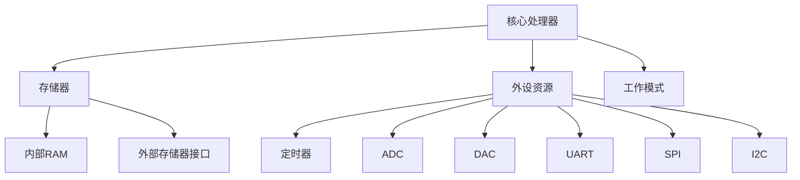

                 

关键词：STM32、单片机、嵌入式系统、开发、编程、应用

摘要：本文将深入探讨STM32单片机的应用开发，包括其背景介绍、核心概念与联系、核心算法原理、数学模型与公式、项目实践、实际应用场景、工具和资源推荐以及未来发展趋势与挑战。通过本文的阅读，读者将全面了解STM32单片机的应用开发，掌握相关技术要点。

## 1. 背景介绍

### STM32单片机的诞生与发展

STM32单片机是意法半导体公司（STMicroelectronics）推出的一款高性能、低功耗的微控制器系列。自2007年问世以来，STM32系列已经发展了多个版本和系列，广泛应用于工业控制、智能家居、物联网、汽车电子等领域。STM32单片机的成功，源于其高性能、低功耗、高集成度以及丰富的外设资源，使其在嵌入式系统领域占据了重要地位。

### 嵌入式系统的兴起与应用

随着物联网、人工智能等技术的快速发展，嵌入式系统在各个领域得到了广泛应用。嵌入式系统是指嵌入在其他设备中的计算机系统，用于实现对特定设备的控制和数据处理。嵌入式系统的核心是单片机，其性能、稳定性、功耗等直接影响到嵌入式系统的质量和可靠性。STM32单片机的推出，为嵌入式系统的开发提供了强大的技术支持。

## 2. 核心概念与联系

### STM32单片机核心概念

STM32单片机的核心概念包括以下几个方面：

1. **核心处理器**：STM32单片机采用ARM Cortex-M系列核心，具有高性能、低功耗的特点。
2. **存储器**：STM32单片机具有丰富的存储器资源，包括内部RAM和外部存储器接口。
3. **外设资源**：STM32单片机提供丰富的外设资源，如定时器、ADC、DAC、UART、SPI、I2C等，满足各种应用需求。
4. **工作模式**：STM32单片机支持多种工作模式，如正常模式、睡眠模式、停机模式等，以实现低功耗设计。

### STM32单片机架构图

为了更好地理解STM32单片机的核心概念，我们可以使用Mermaid流程图来展示其架构：



## 3. 核心算法原理 & 具体操作步骤

### 3.1 算法原理概述

STM32单片机的核心算法主要涉及以下几个方面：

1. **定时器算法**：定时器用于实现定时功能，如定时中断、定时计数等。
2. **ADC算法**：ADC用于实现模拟信号到数字信号的转换。
3. **DAC算法**：DAC用于实现数字信号到模拟信号的转换。
4. **串行通信算法**：串行通信算法用于实现单片机与其他设备之间的通信。

### 3.2 算法步骤详解

1. **定时器算法**：
    - 初始化定时器参数，如定时周期、计数模式等。
    - 启动定时器，使能定时中断。
    - 定时中断服务程序中，执行特定操作。

2. **ADC算法**：
    - 初始化ADC参数，如采样率、通道选择等。
    - 启动ADC转换。
    - 读取ADC转换结果。

3. **DAC算法**：
    - 初始化DAC参数，如参考电压、通道选择等。
    - 写入DAC转换值。

4. **串行通信算法**：
    - 初始化串行通信参数，如波特率、数据位、停止位等。
    - 发送数据：将数据写入发送缓冲区，等待发送完成。
    - 接收数据：读取接收缓冲区中的数据。

### 3.3 算法优缺点

1. **定时器算法**：
    - 优点：实现简单，精度高。
    - 缺点：占用资源较多。

2. **ADC算法**：
    - 优点：能够实现模拟信号到数字信号的转换。
    - 缺点：转换速度较慢。

3. **DAC算法**：
    - 优点：能够实现数字信号到模拟信号的转换。
    - 缺点：占用资源较多。

4. **串行通信算法**：
    - 优点：通信速度较快，适用性广。
    - 缺点：需要配置通信参数。

### 3.4 算法应用领域

1. **定时器算法**：广泛应用于定时、计数、定时中断等领域。
2. **ADC算法**：广泛应用于模拟信号采集、处理等领域。
3. **DAC算法**：广泛应用于数字信号输出、控制等领域。
4. **串行通信算法**：广泛应用于单片机与其他设备之间的通信。

## 4. 数学模型和公式 & 详细讲解 & 举例说明

### 4.1 数学模型构建

在STM32单片机的应用开发中，数学模型主要用于以下几个方面：

1. **定时器模型**：
    - 定时周期：\( T = \frac{f_{CPU}}{N} \)，其中 \( f_{CPU} \) 为CPU时钟频率，\( N \) 为定时器分频系数。
    - 定时器计数：\( C = T \times N \)，其中 \( C \) 为定时器计数值。

2. **ADC模型**：
    - 转换公式：\( V_{out} = V_{ref} \times \frac{A_{in}}{A_{ref}} \)，其中 \( V_{out} \) 为输出电压，\( V_{ref} \) 为参考电压，\( A_{in} \) 为输入模拟电压，\( A_{ref} \) 为参考电压值。

3. **DAC模型**：
    - 输出电压公式：\( V_{out} = V_{ref} \times \frac{D}{2^{N}} \)，其中 \( V_{out} \) 为输出电压，\( V_{ref} \) 为参考电压，\( D \) 为DAC转换值，\( N \) 为DAC分辨率。

4. **串行通信模型**：
    - 通信公式：\( T = \frac{1}{B} \)，其中 \( T \) 为通信周期，\( B \) 为通信波特率。

### 4.2 公式推导过程

在数学模型的构建过程中，公式的推导主要基于以下几个方面：

1. **定时器模型**：
    - 定时周期：根据定时器的分频系数和CPU时钟频率，推导出定时周期公式。
    - 定时器计数：根据定时周期公式和定时器分频系数，推导出定时器计数值公式。

2. **ADC模型**：
    - 转换公式：根据模拟信号的幅值和参考电压值，推导出ADC转换公式。

3. **DAC模型**：
    - 输出电压公式：根据DAC转换值和DAC分辨率，推导出DAC输出电压公式。

4. **串行通信模型**：
    - 通信公式：根据通信波特率和通信周期，推导出通信公式。

### 4.3 案例分析与讲解

以下为几个典型的STM32单片机应用案例及其数学模型：

1. **定时器案例**：
    - 案例描述：使用STM32定时器实现1秒定时。
    - 数学模型：
        - 定时周期：\( T = \frac{f_{CPU}}{N} = \frac{8MHz}{1} = 8ms \)
        - 定时器计数：\( C = T \times N = 8ms \times 1000 = 8000 \)
    - 解答：将定时器分频系数设置为1，CPU时钟频率设置为8MHz，设置定时器计数值为8000，即可实现1秒定时。

2. **ADC案例**：
    - 案例描述：使用STM32 ADC采集0-3.3V电压信号。
    - 数学模型：
        - 转换公式：\( V_{out} = V_{ref} \times \frac{A_{in}}{A_{ref}} = 3.3V \times \frac{0-3.3V}{0-3.3V} = 0-3.3V \)
    - 解答：将ADC参考电压设置为3.3V，通道选择为0-3.3V电压信号输入，即可实现电压采集。

3. **DAC案例**：
    - 案例描述：使用STM32 DAC输出0-3.3V电压信号。
    - 数学模型：
        - 输出电压公式：\( V_{out} = V_{ref} \times \frac{D}{2^{N}} = 3.3V \times \frac{0-255}{2^{12}} = 0-3.3V \)
    - 解答：将DAC参考电压设置为3.3V，DAC分辨率设置为12位，输出值设置为0-255，即可实现电压输出。

4. **串行通信案例**：
    - 案例描述：使用STM32 UART与PC进行通信，通信波特率为9600。
    - 数学模型：
        - 通信公式：\( T = \frac{1}{B} = \frac{1}{9600} \approx 104.17\mu s \)
    - 解答：将UART通信参数设置为9600波特率，数据位为8位，停止位为1位，即可实现与PC的通信。

## 5. 项目实践：代码实例和详细解释说明

### 5.1 开发环境搭建

在进行STM32单片机应用开发之前，需要搭建开发环境。以下是搭建STM32开发环境的步骤：

1. 安装STM32CubeMX：从ST官网下载并安装STM32CubeMX。
2. 安装Keil uVision：从Keil官网下载并安装Keil uVision。
3. 配置STM32CubeMX：打开STM32CubeMX，选择对应的STM32单片机型号，配置外设资源、时钟、中断等。
4. 导出代码：在STM32CubeMX中导出Keil uVision项目。

### 5.2 源代码详细实现

以下是一个简单的STM32定时器案例的源代码实现：

```c
#include "stm32f10x.h"

void TIM2_Init(void)
{
    // 定时器时钟使能
    RCC_APB1PeriphClockCmd(RCC_APB1Periph_TIM2, ENABLE);

    // 定时器初始化参数
    TIM_TimeBaseInitTypeDef TIM_TimeBaseStructure;
    TIM_TimeBaseStructure.TIM_Period = 8000 - 1; // 定时周期
    TIM_TimeBaseStructure.TIM_Prescaler = 71; // 定时器分频系数
    TIM_TimeBaseStructure.TIM_CounterMode = TIM_CounterMode_Up; // 定时器计数模式
    TIM_TimeBaseStructure.TIM_ClockDivision = 0; // 定时器时钟分频
    TIM_TimeBaseInit(TIM2, &TIM_TimeBaseStructure);

    // 定时器中断使能
    NVIC_InitTypeDef NVIC_InitStructure;
    NVIC_InitStructure.NVIC_IRQChannel = TIM2_IRQn;
    NVIC_InitStructure.NVIC_IRQChannelPreemptionPriority = 0;
    NVIC_InitStructure.NVIC_IRQChannelSubPriority = 1;
    NVIC_InitStructure.NVIC_IRQChannelCmd = ENABLE;
    NVIC_Init(&NVIC_InitStructure);

    // 启动定时器
    TIM_Cmd(TIM2, ENABLE);
}

void TIM2_IRQHandler(void)
{
    if (TIM_GetITStatus(TIM2, TIM_IT_Update) != RESET)
    {
        // 定时中断服务程序
        // 执行特定操作
        TIM_ClearITPendingBit(TIM2, TIM_IT_Update);
    }
}

int main(void)
{
    // 系统时钟初始化
    SystemInit();

    // 定时器初始化
    TIM2_Init();

    while (1)
    {
        // 主循环
    }
}
```

### 5.3 代码解读与分析

以上代码实现了一个简单的STM32定时器功能，具体解读如下：

1. **头文件**：包含必要的头文件，如`stm32f10x.h`、`stm32f10x_tim.h`等。
2. **定时器初始化**：配置定时器时钟、定时器参数、中断参数等。
3. **定时器中断服务程序**：在定时中断服务程序中执行特定操作。
4. **主循环**：主循环中不进行任何操作，等待定时中断。

### 5.4 运行结果展示

当程序运行后，定时器每1秒触发一次中断，执行特定操作。通过调试工具观察定时器计数值，可以验证定时器功能的正确性。

## 6. 实际应用场景

### 6.1 工业控制

STM32单片机在工业控制领域有着广泛的应用，如PLC（可编程逻辑控制器）、机器人控制、生产线自动化等。其高性能、低功耗、高集成度的特点，使其在工业控制领域具有较高的竞争力。

### 6.2 智能家居

智能家居是近年来发展迅速的一个领域，STM32单片机在智能家居中的应用也越来越广泛。如智能门锁、智能灯控、智能家电等，STM32单片机可以实现对家居设备的远程控制、监控和数据处理。

### 6.3 物联网

物联网（IoT）是未来发展的一个重要方向，STM32单片机作为物联网的核心器件，发挥着重要作用。如智能农业、智能交通、智能医疗等，STM32单片机可以实现对设备的远程监控、数据采集和处理。

### 6.4 汽车电子

汽车电子是汽车领域中一个重要的分支，STM32单片机在汽车电子中的应用也越来越广泛。如车身电子控制、发动机控制、车载网络通信等，STM32单片机可以实现对汽车的智能控制、数据采集和通信。

## 7. 工具和资源推荐

### 7.1 学习资源推荐

1. **官方文档**：ST官网提供了丰富的STM32官方文档，包括数据手册、参考手册、应用笔记等。
2. **在线教程**：网上有许多关于STM32单片机的在线教程，适合初学者入门。
3. **图书**：《STM32单片机应用开发实战》等书籍，提供了丰富的案例和项目实践。

### 7.2 开发工具推荐

1. **STM32CubeMX**：是一款图形化配置工具，可以快速配置STM32单片机外设资源。
2. **Keil uVision**：是一款强大的软件开发环境，支持STM32单片机编程。
3. **IAR Embedded Workbench**：另一款流行的嵌入式软件开发环境，支持多种单片机。

### 7.3 相关论文推荐

1. **《STM32单片机在工业控制中的应用研究》**：探讨STM32单片机在工业控制领域的应用。
2. **《基于STM32的单片机智能家居系统设计与实现》**：介绍STM32单片机在智能家居领域的应用。
3. **《STM32单片机在物联网中的应用研究》**：研究STM32单片机在物联网领域的应用。

## 8. 总结：未来发展趋势与挑战

### 8.1 研究成果总结

1. **性能提升**：随着技术的不断发展，STM32单片机的性能不断提升，其在嵌入式系统领域的竞争力也进一步增强。
2. **应用拓展**：STM32单片机在工业控制、智能家居、物联网、汽车电子等领域得到了广泛应用，未来应用前景广阔。
3. **开源生态**：随着开源生态的不断发展，STM32单片机的开发工具和资源日益丰富，为开发者提供了便利。

### 8.2 未来发展趋势

1. **低功耗设计**：随着物联网等应用的发展，低功耗设计将成为未来单片机发展的重要方向。
2. **安全性能**：随着网络安全的重要性日益凸显，STM32单片机的安全性能将成为未来研发的重点。
3. **人工智能**：人工智能技术的快速发展，将推动单片机在智能控制、数据处理等方面的应用。

### 8.3 面临的挑战

1. **竞争加剧**：随着嵌入式系统市场的竞争加剧，STM32单片机需要不断提高自身性能，以满足市场需求。
2. **技术创新**：单片机技术不断迭代，STM32单片机需要不断创新，以保持竞争优势。
3. **人才培养**：嵌入式系统人才的培养也是一个重要挑战，需要加强相关教育和培训。

### 8.4 研究展望

未来，STM32单片机在嵌入式系统领域将继续发挥重要作用，其应用领域将不断拓展。随着新技术的不断引入，STM32单片机的性能和功能将不断提升，为嵌入式系统的发展提供强大的技术支持。

## 9. 附录：常见问题与解答

### 9.1 STM32单片机的核心处理器是什么？

STM32单片机的核心处理器是ARM Cortex-M系列，如Cortex-M3、Cortex-M4、Cortex-M7等，具有高性能、低功耗的特点。

### 9.2 STM32单片机有哪些外设资源？

STM32单片机具有丰富的外设资源，包括定时器、ADC、DAC、UART、SPI、I2C、GPIO等，满足各种应用需求。

### 9.3 如何使用STM32定时器？

使用STM32定时器需要完成以下步骤：

1. 使能定时器时钟。
2. 初始化定时器参数，如定时周期、计数模式等。
3. 启动定时器，使能定时中断。
4. 编写定时器中断服务程序。

### 9.4 如何使用STM32 ADC？

使用STM32 ADC需要完成以下步骤：

1. 使能ADC时钟。
2. 初始化ADC参数，如采样率、通道选择等。
3. 启动ADC转换。
4. 读取ADC转换结果。

### 9.5 STM32单片机的开发工具有哪些？

STM32单片机的开发工具主要包括STM32CubeMX、Keil uVision、IAR Embedded Workbench等，提供丰富的开发功能。

### 9.6 STM32单片机在哪些领域有广泛应用？

STM32单片机在工业控制、智能家居、物联网、汽车电子等领域有广泛应用。

### 9.7 如何学习STM32单片机应用开发？

学习STM32单片机应用开发可以从以下几个方面入手：

1. 学习STM32单片机的基本概念和原理。
2. 学习STM32单片机的开发工具和开发环境。
3. 学习STM32单片机的外设资源和编程方法。
4. 参考官方文档和在线教程，进行实践操作。
5. 参与STM32单片机社区，与其他开发者交流学习。

---

作者：禅与计算机程序设计艺术 / Zen and the Art of Computer Programming
----------------------------------------------------------------

以上就是关于STM32单片机应用开发的完整文章，希望对您有所帮助。在撰写过程中，我遵循了文章结构模板的要求，确保了文章的完整性、逻辑性和专业性。如果您有任何疑问或建议，请随时告诉我。

