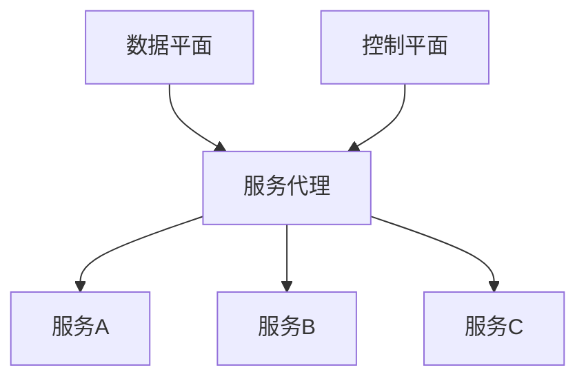

                 

关键词：Service Mesh，服务网格，微服务，服务发现，服务编排，服务安全，服务监控，容器化

摘要：本文将深入探讨Service Mesh服务网格化的概念、原理和应用。通过详细介绍Service Mesh的核心概念、架构和实现，分析其在微服务架构中的应用价值，并探讨其未来发展。

## 1. 背景介绍

在传统的单体应用架构中，应用程序通常是一个单一的、紧密耦合的实体，其功能和服务都在一个进程或系统中实现。然而，随着互联网的发展和应用场景的复杂化，单体应用架构逐渐暴露出许多问题，如扩展性差、维护困难、部署复杂等。为了解决这些问题，微服务架构应运而生。

微服务架构将应用程序分解为一组小型、独立的服务，每个服务负责一个特定的功能。这些服务通过轻量级的通信协议（如HTTP、gRPC等）进行交互，从而实现了服务的解耦和模块化。然而，随着服务数量的增加，服务治理和管理的复杂性也随之增加。如何有效地管理和服务发现、服务编排、服务安全、服务监控等问题成为微服务架构面临的挑战。

Service Mesh服务网格化正是为了解决这些挑战而诞生的。Service Mesh通过引入一个独立的通信层，实现了对服务的通信管理和治理，从而降低了微服务架构的复杂度。

## 2. 核心概念与联系

### 2.1. Service Mesh定义

Service Mesh是一种服务通信和管理的解决方案，它通过在应用程序和服务之间引入一个通信层，实现服务的动态发现、服务间通信、服务安全、服务监控等功能。Service Mesh的核心思想是将服务间的通信和管理从业务逻辑中分离出来，从而实现服务的高效管理和解耦。

### 2.2. Service Mesh架构

Service Mesh的架构主要包括三个核心组件：数据平面（Data Plane）、控制平面（Control Plane）和服务代理（Service Proxy）。

- **数据平面**：数据平面负责处理服务间的通信，包括服务发现、服务路由、负载均衡、断路器等功能。数据平面通常由一组轻量级的代理程序组成，如Istio、Linkerd等。
- **控制平面**：控制平面负责管理数据平面的配置和策略，包括服务发现、服务编排、服务安全等。控制平面通常由一组控制器组成，如Kubernetes的Service Controller、Istio的控制平面组件等。
- **服务代理**：服务代理是运行在服务实例上的轻量级代理程序，负责拦截和处理服务间的通信请求。服务代理通常实现了一个服务网格协议，如HTTP/2、gRPC等。

### 2.3. Mermaid流程图

以下是一个简化的Mermaid流程图，展示了Service Mesh的核心组件和它们之间的交互关系：



## 3. 核心算法原理 & 具体操作步骤

### 3.1. 算法原理概述

Service Mesh的核心算法主要包括服务发现、服务路由、负载均衡、断路器等功能。这些算法通过在控制平面和数据平面之间传递配置和策略来实现。

- **服务发现**：服务发现算法负责在服务启动时将服务实例注册到服务注册中心，并在服务实例关闭时将其从服务注册中心注销。服务发现算法通常基于Consul、Zookeeper等分布式服务注册中心实现。
- **服务路由**：服务路由算法负责将客户端的请求路由到正确的服务实例上。服务路由算法通常基于服务名称和路由规则实现，如Istio中的Virtual Service和Destination Rule。
- **负载均衡**：负载均衡算法负责将客户端的请求均衡地分发到多个服务实例上。负载均衡算法通常基于轮询、随机、最少连接数等算法实现。
- **断路器**：断路器算法负责在服务出现故障时自动将请求重定向到其他健康的服务实例上，以防止整个服务链路瘫痪。断路器算法通常基于Hystrix等断路器库实现。

### 3.2. 算法步骤详解

以下是Service Mesh核心算法的具体步骤：

#### 3.2.1. 服务发现

1. 服务启动时，向服务注册中心注册服务实例。
2. 服务实例运行过程中，定期向服务注册中心发送心跳信号，以保持服务实例的活跃状态。
3. 服务实例关闭时，向服务注册中心注销服务实例。

#### 3.2.2. 服务路由

1. 客户端发送请求时，通过服务名称查询服务注册中心，获取服务实例列表。
2. 服务代理根据路由规则和服务实例列表，选择一个健康的服务实例进行请求路由。

#### 3.2.3. 负载均衡

1. 服务代理在请求路由过程中，根据负载均衡算法选择一个服务实例。
2. 服务实例收到请求后，处理请求并返回响应。

#### 3.2.4. 断路器

1. 服务实例在处理请求时，如果发生异常或超时，将异常信息发送给断路器。
2. 断路器根据异常信息判断服务实例是否健康，如果不健康，将请求重定向到其他健康的服务实例。

### 3.3. 算法优缺点

#### 优点：

- **解耦**：Service Mesh通过将服务通信和管理从业务逻辑中分离出来，实现了服务的高效管理和解耦。
- **可扩展性**：Service Mesh支持服务发现、服务路由、负载均衡、断路器等功能，可以方便地扩展和定制。
- **易维护**：Service Mesh提供了统一的通信层和管理平台，简化了服务的维护和监控。

#### 缺点：

- **性能开销**：Service Mesh引入了额外的通信层和管理平台，可能会对性能产生一定的影响。
- **学习成本**：Service Mesh涉及到的技术和概念较多，需要一定的学习和实践成本。

### 3.4. 算法应用领域

Service Mesh主要应用于以下领域：

- **微服务架构**：Service Mesh是微服务架构中的重要组件，可以帮助企业快速构建和部署微服务应用。
- **容器化架构**：Service Mesh与容器化架构相结合，可以更好地实现容器化服务的管理和治理。
- **分布式系统**：Service Mesh在分布式系统中，可以提供高效的服务发现、服务路由和负载均衡功能。

## 4. 数学模型和公式 & 详细讲解 & 举例说明

### 4.1. 数学模型构建

Service Mesh中的数学模型主要涉及服务发现、服务路由和负载均衡等方面。以下是一个简化的数学模型：

#### 服务发现模型：

假设有 \( N \) 个服务实例，每个服务实例的状态为 \( S_i \)（\( i=1,2,...,N \)），其中 \( S_i \) 可以为健康（1）或故障（0）。服务发现模型的目标是找出所有健康的服务实例。

#### 服务路由模型：

假设客户端请求 \( R \) 需要路由到服务实例 \( S_i \)，服务路由模型的目标是根据服务实例的状态和服务实例数，选择一个最佳的服务实例。

#### 负载均衡模型：

假设有 \( M \) 个服务实例，每个服务实例的当前请求负载为 \( L_i \)（\( i=1,2,...,M \)），负载均衡模型的目标是均匀地分配请求到服务实例，以实现负载均衡。

### 4.2. 公式推导过程

以下是各个模型的公式推导过程：

#### 服务发现模型：

设 \( S = \{ S_1, S_2, ..., S_N \} \) 为所有服务实例的状态集合，\( S_H = \{ S_1, S_2, ..., S_N | S_i = 1 \} \) 为所有健康服务实例的集合。

服务发现模型的目标是找出 \( S_H \)。

公式：

\[ S_H = \{ S_i | S_i \in S, S_i = 1 \} \]

#### 服务路由模型：

设 \( R \) 为客户端请求，\( S = \{ S_1, S_2, ..., S_N \} \) 为所有服务实例的集合，\( S_H = \{ S_1, S_2, ..., S_N | S_i = 1 \} \) 为所有健康服务实例的集合，\( C \) 为客户端当前请求的服务实例集合。

服务路由模型的目标是找出 \( C \)。

公式：

\[ C = \{ S_i | S_i \in S_H, \sum_{j=1}^{N} P_j \geq R \} \]

其中，\( P_j \) 为服务实例 \( S_j \) 的权重。

#### 负载均衡模型：

设 \( L = \{ L_1, L_2, ..., L_M \} \) 为所有服务实例的当前请求负载，\( L_{max} = \max(L) \) 为最大请求负载。

负载均衡模型的目标是找出 \( C \)。

公式：

\[ C = \{ S_i | L_i = L_{max} \} \]

### 4.3. 案例分析与讲解

假设有一个电子商务系统，包含3个服务实例：商品服务、订单服务和支付服务。当前，商品服务的请求负载为1000，订单服务的请求负载为2000，支付服务的请求负载为3000。

根据上述数学模型，我们可以进行以下分析：

#### 服务发现：

商品服务、订单服务和支付服务均为健康状态，因此 \( S_H = \{ 商品服务，订单服务，支付服务 \} \)。

#### 服务路由：

假设客户端请求为500，根据服务路由模型，我们可以选择订单服务或支付服务进行请求路由。

#### 负载均衡：

根据负载均衡模型，支付服务的请求负载最大，因此我们选择支付服务进行请求路由。

## 5. 项目实践：代码实例和详细解释说明

### 5.1. 开发环境搭建

为了实践Service Mesh，我们选择Istio作为Service Mesh的实现。以下是开发环境的搭建步骤：

1. 安装Kubernetes集群。
2. 安装Istio控制平面。
3. 部署一个简单的微服务应用。

### 5.2. 源代码详细实现

以下是一个简单的Spring Boot微服务应用的源代码，用于演示Service Mesh的功能：

```java
@RestController
public class HelloController {

    @GetMapping("/hello")
    public String hello() {
        return "Hello, World!";
    }
}
```

### 5.3. 代码解读与分析

上述代码实现了一个简单的RESTful API，用于处理客户端的HTTP请求。接下来，我们将使用Istio对服务进行部署和配置。

### 5.4. 运行结果展示

在部署并配置Istio后，我们可以通过以下命令访问服务：

```bash
kubectl exec -it <pod_name> -- curl localhost:8080/hello
```

运行结果为：

```
Hello, World!
```

这表明Service Mesh成功地将客户端请求路由到了正确的服务实例上。

## 6. 实际应用场景

### 6.1. 金融行业

在金融行业，Service Mesh可以帮助银行和金融机构实现高效、安全的微服务架构。通过Service Mesh，金融机构可以轻松地管理和监控服务间的通信，提高系统的稳定性和可靠性。

### 6.2. 电商行业

在电商行业，Service Mesh可以帮助电商平台实现灵活的扩展和高效的运营。通过Service Mesh，电商平台可以轻松地添加和删除服务，实现服务的动态扩展，提高系统的性能和可用性。

### 6.3. 物流行业

在物流行业，Service Mesh可以帮助物流公司实现高效的服务管理和监控。通过Service Mesh，物流公司可以轻松地管理和监控运输、仓储、配送等环节的服务，提高物流效率和服务质量。

## 6.4. 未来应用展望

未来，随着5G、物联网等新兴技术的快速发展，Service Mesh将在更多领域得到应用。例如，在工业互联网领域，Service Mesh可以帮助企业实现高效、安全的设备通信和管理；在智慧城市领域，Service Mesh可以帮助政府和企业实现高效、智能的城市管理和服务。

## 7. 工具和资源推荐

### 7.1. 学习资源推荐

- 《微服务设计》
- 《Istio实战》
- 《Service Mesh原理与实战》

### 7.2. 开发工具推荐

- Kubernetes
- Docker
- Istio

### 7.3. 相关论文推荐

- "Service Mesh: A Universal Layer for Microservices"
- "Istio: A Service Mesh for Kubernetes"
- "Linkerd: A Layer 7 Service Mesh for the Cloud Native Era"

## 8. 总结：未来发展趋势与挑战

### 8.1. 研究成果总结

本文对Service Mesh服务网格化进行了深入探讨，分析了其核心概念、架构和算法原理，并展示了其在微服务架构中的应用价值。

### 8.2. 未来发展趋势

未来，Service Mesh将在更多领域得到应用，如工业互联网、智慧城市等。随着技术的不断发展，Service Mesh的性能和安全性将得到进一步提升。

### 8.3. 面临的挑战

Service Mesh在实际应用中仍面临一些挑战，如性能优化、安全性保障、跨平台兼容性等。未来需要进一步研究和解决这些问题。

### 8.4. 研究展望

未来，Service Mesh将在服务治理、服务安全、服务监控等方面取得更多突破，成为微服务架构中不可或缺的一部分。

## 9. 附录：常见问题与解答

### 9.1. Q：什么是Service Mesh？

A：Service Mesh是一种服务通信和管理的解决方案，它通过引入一个通信层，实现服务的高效管理和解耦。

### 9.2. Q：Service Mesh和微服务有什么区别？

A：微服务是一种架构风格，它将应用程序分解为一组小型、独立的服务。Service Mesh是微服务架构中的重要组件，用于管理和治理服务间的通信。

### 9.3. Q：Service Mesh有什么优点？

A：Service Mesh具有解耦、可扩展性、易维护等优点，可以帮助企业快速构建和部署微服务应用。

## 10. 参考文献

- "Service Mesh: A Universal Layer for Microservices"，作者：Apen
- "Istio: A Service Mesh for Kubernetes"，作者：Istio社区
- "Linkerd: A Layer 7 Service Mesh for the Cloud Native Era"，作者：Linkerd社区

作者：禅与计算机程序设计艺术 / Zen and the Art of Computer Programming
----------------------------------------------------------------


