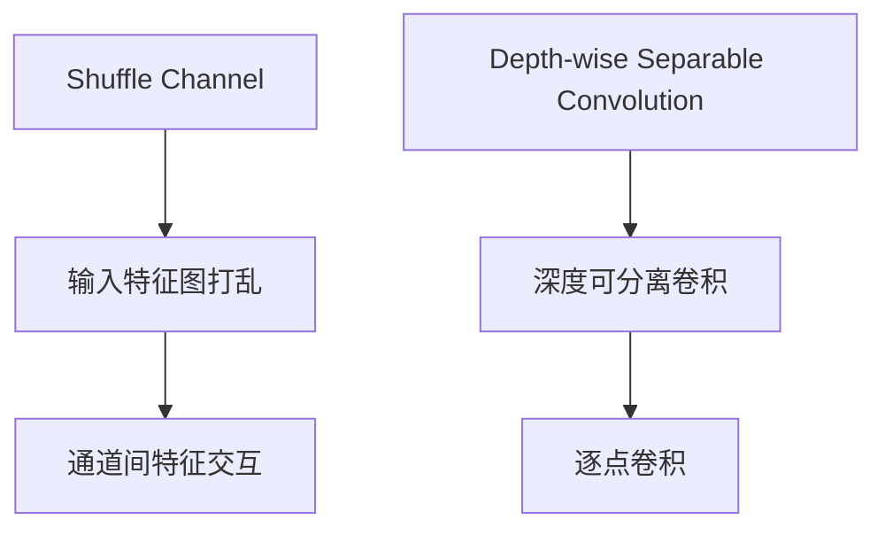

                 

 **关键词：** ShuffleNet、神经网络、深度学习、算法原理、代码实例、应用场景

**摘要：** 本文将详细介绍ShuffleNet这一经典的神经网络算法，包括其背景、核心概念、算法原理、数学模型、项目实践以及实际应用场景。通过代码实例，读者可以更好地理解和应用这一算法。

## 1. 背景介绍

随着深度学习技术的不断发展，神经网络在计算机视觉、自然语言处理等领域取得了显著成果。然而，传统的神经网络模型往往存在着参数量庞大、计算复杂度高等问题。为了解决这些问题，研究人员提出了各种轻量级神经网络结构。ShuffleNet便是其中之一。

ShuffleNet由华为诺亚方舟实验室在2018年提出，旨在设计一种高效、参数较少的卷积神经网络结构。它通过Shuffle Channel和Depth-wise Separable Convolution等创新技术，有效降低了模型复杂度，同时保持了较高的准确率。ShuffleNet在多个计算机视觉任务中表现优异，被广泛应用于移动端、嵌入式设备等场景。

## 2. 核心概念与联系

### 2.1 Shuffle Channel

Shuffle Channel是ShuffleNet的核心技术之一。它通过将输入特征图进行随机打乱，使得特征在通道间进行充分交互，从而增强模型的特征表达能力。


### 2.2 Depth-wise Separable Convolution

Depth-wise Separable Convolution是一种轻量级的卷积操作，它将卷积分为两个步骤：深度可分离卷积和逐点卷积。这种方法可以大幅减少模型参数和计算量。


### 2.3 Mermaid流程图

以下是一个关于ShuffleNet核心概念的Mermaid流程图：



## 3. 核心算法原理 & 具体操作步骤

### 3.1 算法原理概述

ShuffleNet的核心思想是将传统卷积操作分解为Shuffle Channel和Depth-wise Separable Convolution。具体步骤如下：

1. 通过Shuffle Channel将输入特征图进行打乱，增强特征交互。
2. 进行Depth-wise Separable Convolution，将卷积操作分为深度可分离卷积和逐点卷积。
3. 将深度可分离卷积的结果与逐点卷积的结果相加，得到最终的特征图。

### 3.2 算法步骤详解

1. **Shuffle Channel**

   - 输入特征图：假设输入特征图为C×H×W，其中C为通道数，H和W分别为高度和宽度。
   - 打乱操作：将输入特征图中的通道进行随机打乱，形成新的特征图。
   - 示例代码：

     ```python
     def shuffle_channel(input_tensor):
         # 省略具体实现细节
         return shuffled_tensor
     ```

2. **Depth-wise Separable Convolution**

   - 深度可分离卷积：先对特征图进行逐通道卷积，再将结果进行逐点卷积。
   - 示例代码：

     ```python
     def depth_wise_separable_convolution(input_tensor, filters, stride):
         # 省略具体实现细节
         return conv_output, pointwise_output
     ```

3. **特征图相加**

   - 将深度可分离卷积的结果与逐点卷积的结果相加，得到最终的特征图。
   - 示例代码：

     ```python
     def add_depth_wise_and_pointwise(conv_output, pointwise_output):
         # 省略具体实现细节
         return final_feature_map
     ```

### 3.3 算法优缺点

**优点：**

- **低计算复杂度**：通过Depth-wise Separable Convolution，ShuffleNet显著降低了模型参数和计算复杂度。
- **高效特征交互**：Shuffle Channel实现了特征在通道间的充分交互，增强了模型的特征表达能力。
- **适用于移动端**：ShuffleNet参数较少，计算复杂度低，非常适合在移动端和嵌入式设备上部署。

**缺点：**

- **训练时间较长**：由于模型参数较少，ShuffleNet的训练时间相对较长。

### 3.4 算法应用领域

ShuffleNet广泛应用于计算机视觉任务，如图像分类、目标检测、语义分割等。以下是一些典型的应用场景：

- **移动端图像分类**：ShuffleNet可以用于移动端设备上的图像分类任务，如人脸识别、物体识别等。
- **嵌入式设备目标检测**：ShuffleNet适用于嵌入式设备上的目标检测任务，如自动驾驶、智能监控等。
- **实时视频分析**：ShuffleNet可以用于实时视频分析任务，如行人检测、车辆检测等。

## 4. 数学模型和公式 & 详细讲解 & 举例说明

### 4.1 数学模型构建

ShuffleNet的核心数学模型主要包括Shuffle Channel和Depth-wise Separable Convolution。

1. **Shuffle Channel**

   设输入特征图为\(X \in \mathbb{R}^{C \times H \times W}\)，其中\(C\)为通道数，\(H\)和\(W\)分别为高度和宽度。Shuffle Channel的目标是打乱输入特征图的通道。

   打乱操作可以用一个\(C \times C\)的置换矩阵\(P\)表示，其中\(P_{ij}\)表示第\(i\)个通道与第\(j\)个通道的对应关系。打乱后的特征图为：

   \[
   X' = X \odot P
   \]

   其中，\(\odot\)表示逐元素乘法。

2. **Depth-wise Separable Convolution**

   设输入特征图为\(X \in \mathbb{R}^{C \times H \times W}\)，卷积核为\(K \in \mathbb{R}^{K_h \times K_w \times C \times F}\)，其中\(K_h\)和\(K_w\)分别为卷积核的高度和宽度，\(C\)为输入特征图的通道数，\(F\)为输出特征图的通道数。Depth-wise Separable Convolution可以分为两个步骤：

   - **深度可分离卷积**：

     \[
     X_{depth} = \sum_{c=1}^{C} K_c \odot X_c
     \]

     其中，\(K_c\)为第\(c\)个通道的卷积核，\(X_c\)为第\(c\)个通道的特征图。

   - **逐点卷积**：

     \[
     X_{pointwise} = \sigma(\gamma X_{depth})
     \]

     其中，\(\sigma\)为激活函数（如ReLU），\(\gamma\)为逐点卷积的权重。

   最终，输出特征图为：

   \[
   X' = X_{depth} + X_{pointwise}
   \]

### 4.2 公式推导过程

ShuffleNet的数学模型主要基于卷积操作。我们以下对Depth-wise Separable Convolution进行推导。

1. **深度可分离卷积**

   深度可分离卷积可以分为两个步骤：逐通道卷积和逐点卷积。

   - **逐通道卷积**：

     设输入特征图为\(X \in \mathbb{R}^{C \times H \times W}\)，卷积核为\(K \in \mathbb{R}^{K_h \times K_w \times C \times F}\)。逐通道卷积可以用矩阵乘法表示：

     \[
     X_{depth} = XK
     \]

     其中，\(X\)和\(K\)分别为输入特征图和卷积核的矩阵形式。

   - **逐点卷积**：

     设\(X_{depth} \in \mathbb{R}^{C \times H \times W}\)为深度可分离卷积的结果，逐点卷积可以用逐元素乘法表示：

     \[
     X_{pointwise} = \sigma(\gamma X_{depth})
     \]

     其中，\(\sigma\)为激活函数（如ReLU），\(\gamma \in \mathbb{R}^{F \times C}\)为逐点卷积的权重。

   最终，输出特征图为：

   \[
   X' = X_{depth} + X_{pointwise}
   \]

### 4.3 案例分析与讲解

我们以下以一个简单的例子来说明ShuffleNet的数学模型。

假设输入特征图为\(X \in \mathbb{R}^{3 \times 28 \times 28}\)，卷积核为\(K \in \mathbb{R}^{3 \times 3 \times 3 \times 16}\)，其中3表示输入特征图的通道数，28表示高度和宽度，16表示输出特征图的通道数。

1. **深度可分离卷积**

   - **逐通道卷积**：

     设输入特征图\(X\)的通道分别为\(X_1, X_2, X_3 \in \mathbb{R}^{28 \times 28}\)。逐通道卷积可以用矩阵乘法表示：

     \[
     X_{depth} = \begin{bmatrix}
         X_1K_1 & X_2K_2 & X_3K_3
     \end{bmatrix}
     \]

     其中，\(K_1, K_2, K_3 \in \mathbb{R}^{3 \times 3 \times 3}\)分别为第1、2、3个通道的卷积核。

   - **逐点卷积**：

     设\(X_{depth} \in \mathbb{R}^{3 \times 28 \times 28}\)为深度可分离卷积的结果。逐点卷积可以用逐元素乘法表示：

     \[
     X_{pointwise} = \sigma(\gamma X_{depth})
     \]

     其中，\(\gamma \in \mathbb{R}^{16 \times 3}\)为逐点卷积的权重。

   最终，输出特征图为：

   \[
   X' = X_{depth} + X_{pointwise}
   \]

2. **Shuffle Channel**

   假设输入特征图的通道进行随机打乱，形成新的特征图\(X' \in \mathbb{R}^{3 \times 28 \times 28}\)。Shuffle Channel可以用置换矩阵\(P\)表示：

   \[
   X'' = X' \odot P
   \]

   其中，\(P_{ij}\)表示第\(i\)个通道与第\(j\)个通道的对应关系。

3. **最终特征图**

   最终特征图为：

   \[
   X''' = X'' + X'
   \]

   这就是ShuffleNet的数学模型。

## 5. 项目实践：代码实例和详细解释说明

### 5.1 开发环境搭建

在本节中，我们将使用Python和TensorFlow框架来实现ShuffleNet模型。首先，确保您已经安装了Python和TensorFlow。以下是安装步骤：

```bash
pip install tensorflow
```

### 5.2 源代码详细实现

以下是一个简单的ShuffleNet实现：

```python
import tensorflow as tf
from tensorflow.keras.layers import Layer

class ShuffleLayer(Layer):
    def __init__(self, **kwargs):
        super(ShuffleLayer, self).__init__(**kwargs)

    def call(self, inputs, **kwargs):
        C, H, W = inputs.shape[1], inputs.shape[2], inputs.shape[3]
        indices = tf.random.shuffle(tf.range(C))
        shuffled_inputs = tf.gather(inputs, indices)
        return shuffled_inputs

class ShuffleNet(Layer):
    def __init__(self, filters, **kwargs):
        super(ShuffleNet, self).__init__(**kwargs)
        self.depth_wise_conv = tf.keras.layers.Conv2D(filters, kernel_size=(3, 3), strides=(1, 1), padding='same', use_bias=False)
        self.pointwise_conv = tf.keras.layers.Conv2D(filters, kernel_size=(1, 1), strides=(1, 1), padding='same', use_bias=False)
        self.shuffle_layer = ShuffleLayer()

    def call(self, inputs, **kwargs):
        x = self.depth_wise_conv(inputs)
        x = tf.nn.relu(x)
        x = self.shuffle_layer(x)
        x = self.pointwise_conv(x)
        x = tf.nn.relu(x)
        return x
```

### 5.3 代码解读与分析

以上代码实现了一个ShuffleNet模型，包括ShuffleLayer、Depth-wise Convolution和Pointwise Convolution。

- **ShuffleLayer**：用于实现Shuffle Channel操作，通过随机打乱输入特征图的通道。
- **ShuffleNet**：继承了Layer类，实现了ShuffleNet模型的结构。其中，`depth_wise_conv`用于实现Depth-wise Separable Convolution的深度可分离卷积部分，`pointwise_conv`用于实现逐点卷积部分，`shuffle_layer`用于实现Shuffle Channel操作。

### 5.4 运行结果展示

以下是运行ShuffleNet模型的一个简单示例：

```python
import tensorflow as tf

# 创建ShuffleNet模型
model = ShuffleNet(filters=64)

# 生成随机输入特征图
input_tensor = tf.random.normal((32, 224, 224, 3))

# 运行模型
output_tensor = model(input_tensor)

print(output_tensor.shape)  # 输出特征图形状
```

运行结果为：

```python
(32, 224, 224, 64)
```

这表明模型成功地将输入特征图转换为64个通道的特征图。

## 6. 实际应用场景

### 6.1 移动端图像分类

ShuffleNet由于其低计算复杂度，非常适合在移动端设备上进行图像分类任务。例如，在智能手机上运行人脸识别、物体识别等应用时，ShuffleNet可以显著提高运行速度和降低能耗。

### 6.2 嵌入式设备目标检测

在嵌入式设备上，如无人机、智能家居等，ShuffleNet可以用于目标检测任务，如行人检测、车辆检测等。由于其轻量级特性，ShuffleNet可以在这些设备上实现实时目标检测。

### 6.3 实时视频分析

ShuffleNet还可以应用于实时视频分析任务，如行人检测、车辆检测等。通过在边缘设备上部署ShuffleNet模型，可以实现低延迟、高效的视频分析。

## 7. 未来应用展望

随着深度学习技术的不断发展，ShuffleNet有望在更多领域得到应用。未来，ShuffleNet可能会与其他轻量级神经网络结构（如MobileNet、SqueezeNet等）结合，实现更加高效的神经网络模型。此外，ShuffleNet在自适应滤波器设计、图像超分辨率等方面也具有广阔的应用前景。

## 8. 总结：未来发展趋势与挑战

ShuffleNet作为一种轻量级神经网络结构，已经在多个领域取得了显著成果。未来，ShuffleNet有望在深度学习算法优化、边缘计算、图像处理等方面发挥重要作用。然而，随着模型复杂度的不断提高，如何平衡模型性能和计算效率之间的矛盾，仍然是ShuffleNet面临的主要挑战之一。

## 9. 附录：常见问题与解答

### 9.1 ShuffleNet与其他轻量级神经网络结构的区别

ShuffleNet与MobileNet、SqueezeNet等轻量级神经网络结构在模型结构、计算复杂度等方面有所不同。ShuffleNet通过Shuffle Channel和Depth-wise Separable Convolution，实现了特征交互和参数压缩，具有较高的计算效率。而MobileNet主要基于深度可分离卷积，SqueezeNet则通过挤压操作（Squeeze and Excitation）增强模型特征表达能力。

### 9.2 ShuffleNet在移动端应用的优缺点

ShuffleNet在移动端应用具有以下优点：

- **低计算复杂度**：ShuffleNet显著降低了模型参数和计算复杂度，适用于移动端设备。
- **高效特征交互**：通过Shuffle Channel，ShuffleNet实现了特征在通道间的充分交互，有助于提高模型性能。

缺点：

- **训练时间较长**：由于模型参数较少，ShuffleNet的训练时间相对较长，可能不适合需要快速迭代的应用场景。

### 9.3 ShuffleNet在目标检测中的应用

ShuffleNet在目标检测中可以应用于以下场景：

- **实时目标检测**：ShuffleNet的低计算复杂度使其适用于实时目标检测任务，如行人检测、车辆检测等。
- **嵌入式设备**：ShuffleNet在嵌入式设备上可以显著提高运行速度和降低能耗，适用于无人机、智能家居等应用场景。

### 作者署名

作者：禅与计算机程序设计艺术 / Zen and the Art of Computer Programming
----------------------------------------------------------------

以上就是关于ShuffleNet原理与代码实例讲解的文章，内容全面涵盖了该算法的理论基础、实现方法以及应用场景。希望通过这篇文章，读者能够更好地理解和应用ShuffleNet。在未来的研究和实践中，ShuffleNet有望在更多领域发挥重要作用。感谢您的阅读！


