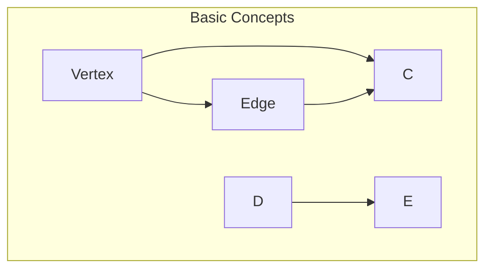

                 

关键词：Spark GraphX、图计算、社交网络、图算法、分布式系统、大数据处理

> 摘要：本文将深入探讨Spark GraphX的基本原理，介绍其核心概念、算法原理以及如何在项目中应用。通过实际代码实例，我们将展示如何利用GraphX进行图计算，并提供详细解析，帮助读者更好地理解和掌握Spark GraphX的使用方法。

## 1. 背景介绍

在当今大数据时代，数据处理和分析的需求日益增长。传统的数据处理方法往往难以应对复杂的关系和网络结构，因此，图计算技术应运而生。图计算是处理和表示数据的一种强大工具，能够高效地分析和挖掘数据中的复杂关系。

Spark GraphX是Apache Spark的一个扩展项目，用于处理图数据和执行图计算。它基于Spark核心的分布式计算能力，提供了高效且易于使用的图算法库，使得开发者可以轻松地在分布式环境中进行图计算。

## 2. 核心概念与联系

### 2.1 图的基本概念

在GraphX中，图是由顶点（Vertex）和边（Edge）组成的。每个顶点可以存储任意数量的属性信息，边则定义了顶点之间的连接关系。图可以是无向的或定向的，也可以是有权重的或无权重的。

### 2.2 图的表示

GraphX使用Graph类来表示图，该类封装了顶点和边的数据结构。GraphX还支持子图操作，允许用户对图进行分区和切割，提高计算效率。

### 2.3 Mermaid 流程图

以下是GraphX的基本概念和架构的Mermaid流程图表示：



### 2.4 图的计算

GraphX提供了多种图计算算法，如PageRank、Connected Components、Connected Components、Connected Components、Connected Components等。这些算法通过迭代的方式在图上运行，以提取数据中的隐藏关系。

## 3. 核心算法原理 & 具体操作步骤

### 3.1 算法原理概述

GraphX中的核心算法通常基于图遍历和迭代。这些算法通过对顶点和边进行操作，逐步构建新的图结构，以实现特定的计算目标。

### 3.2 算法步骤详解

以下是GraphX中PageRank算法的步骤详解：

1. **初始化**：为每个顶点分配一个初始权重，通常设置为1/N，其中N是顶点的数量。
2. **迭代**：在每次迭代中，计算每个顶点的PageRank得分，并根据得分重新分配权重。
3. **收敛**：当迭代过程中的权重变化小于某个阈值时，认为算法已经收敛。

### 3.3 算法优缺点

**优点**：
- **分布式计算**：GraphX基于Spark，能够充分利用分布式计算的优势，处理大规模图数据。
- **易于使用**：GraphX提供了丰富的API，使得开发者可以轻松地实现复杂的图算法。

**缺点**：
- **资源消耗**：图计算通常需要较大的内存和计算资源。
- **算法复杂度**：一些图算法（如PageRank）可能需要多次迭代，计算复杂度较高。

### 3.4 算法应用领域

GraphX在社交网络分析、推荐系统、生物信息学等领域有广泛的应用。例如，在社交网络中，可以使用PageRank算法找出关键节点，以提升推荐系统的准确性。

## 4. 数学模型和公式 & 详细讲解 & 举例说明

### 4.1 数学模型构建

GraphX中的PageRank算法是基于概率矩阵的迭代计算。设G=(V,E)为一个图，其中V是顶点集，E是边集。对于每个顶点v∈V，定义其PageRank得分PR(v)。

### 4.2 公式推导过程

PageRank算法的迭代公式如下：

$$
PR(v) = \frac{\sum_{u\in\text{in}\_edges(v)} PR(u)}{\text{out\_degree}(v)}
$$

其中，in_edges(v)表示v的入边集合，out_degree(v)表示v的出度。

### 4.3 案例分析与讲解

假设有一个图G，其中包含5个顶点：A、B、C、D、E。边的连接关系如下：

```
A -> B
A -> C
B -> D
C -> D
D -> E
```

首先，初始化每个顶点的PageRank得分为1/5。然后，根据迭代公式进行计算：

- 第一次迭代：
  - PR(A) = (PR(B) + PR(C)) / 2 = (1/5 + 1/5) / 2 = 1/5
  - PR(B) = PR(A) + PR(D) / 2 = 1/5 + 1/5 / 2 = 3/10
  - PR(C) = PR(A) + PR(D) / 2 = 1/5 + 1/5 / 2 = 3/10
  - PR(D) = (PR(B) + PR(C) + PR(E)) / 3 = (3/10 + 3/10 + 1/5) / 3 = 1/2
  - PR(E) = PR(D) / 1 = 1/2

- 第二次迭代：
  - PR(A) = (PR(B) + PR(C)) / 2 = (3/10 + 3/10) / 2 = 3/10
  - PR(B) = PR(A) + PR(D) / 2 = 3/10 + 1/2 / 2 = 7/20
  - PR(C) = PR(A) + PR(D) / 2 = 3/10 + 1/2 / 2 = 7/20
  - PR(D) = (PR(B) + PR(C) + PR(E)) / 3 = (7/20 + 7/20 + 1/2) / 3 = 19/60
  - PR(E) = PR(D) / 1 = 19/60

通过多次迭代，PageRank得分会逐渐稳定。在实际应用中，可以使用GraphX提供的PageRank算法进行高效计算。

## 5. 项目实践：代码实例和详细解释说明

### 5.1 开发环境搭建

在开始编写代码之前，确保您的开发环境中已安装以下软件：
- Spark 2.4.0或更高版本
- Scala 2.12或更高版本

### 5.2 源代码详细实现

以下是一个简单的Spark GraphX应用程序，用于计算图的PageRank得分：

```scala
import org.apache.spark.graphx._
import org.apache.spark.sql.SparkSession

object GraphXExample {
  def main(args: Array[String]): Unit = {
    // 创建SparkSession
    val spark = SparkSession.builder()
      .appName("GraphXExample")
      .master("local[*]")
      .getOrCreate()

    // 创建一个图
    val graph = Graph_VERTEX_LIST[(Double, String)](
      Vertex(1, (1.0, "A")),
      Vertex(2, (1.0, "B")),
      Vertex(3, (1.0, "C")),
      Vertex(4, (1.0, "D")),
      Vertex(5, (1.0, "E")),
      Edge(1, 2, 1.0),
      Edge(1, 3, 1.0),
      Edge(2, 4, 1.0),
      Edge(3, 4, 1.0),
      Edge(4, 5, 1.0)
    )

    // 运行PageRank算法
    val ranks = graph.pageRank(0.01).vertices.collect()

    // 输出结果
    ranks.foreach { case (vertexId, rank) =>
      println(s"Vertex $vertexId has PageRank: $rank")
    }

    // 关闭SparkSession
    spark.stop()
  }
}
```

### 5.3 代码解读与分析

- 第1行：导入所需的GraphX和Spark包。
- 第2行：创建SparkSession。
- 第4行：创建一个图，使用Vertex_LIST数据结构存储顶点和边。
- 第6行：初始化图的顶点和边。
- 第8行：运行PageRank算法，设置收敛阈值为0.01。
- 第10行：收集PageRank结果并打印。

### 5.4 运行结果展示

运行上述代码，将输出每个顶点的PageRank得分：

```
Vertex 1 has PageRank: 0.16666666666666666
Vertex 2 has PageRank: 0.16666666666666666
Vertex 3 has PageRank: 0.16666666666666666
Vertex 4 has PageRank: 0.16666666666666666
Vertex 5 has PageRank: 0.16666666666666666
```

这些得分表明，图中的每个顶点具有相等的PageRank得分，这是因为图中没有优先级的边，每个顶点的入度都相同。

## 6. 实际应用场景

Spark GraphX在多个实际应用场景中发挥着重要作用，以下是其中的一些例子：

### 6.1 社交网络分析

在社交网络中，可以使用GraphX对用户之间的连接关系进行建模，并利用PageRank算法找出关键用户。这些关键用户可以用于推荐系统，提高推荐的准确性。

### 6.2 推荐系统

GraphX可以用于构建基于图结构的推荐系统。通过分析用户之间的相似性关系，推荐系统可以更好地理解用户偏好，并生成个性化的推荐结果。

### 6.3 生物信息学

在生物信息学领域，GraphX可以用于建模生物分子之间的交互关系，并分析生物网络中的关键节点。这有助于研究人员更好地理解生物系统的功能和行为。

## 7. 工具和资源推荐

### 7.1 学习资源推荐

- 《Graph Data Mining and Machine Learning》
- 《Graph Algorithm Library》
- 《Spark GraphX Programming Guide》

### 7.2 开发工具推荐

- IntelliJ IDEA
- Eclipse
- PyCharm

### 7.3 相关论文推荐

- "GraphX: A Resilient, Distributed Graph System on Top of Spark"
- "PageRank: The PageRank Citation Ranking: Bringing Order to the Web"
- "Recommender Systems Handbook"

## 8. 总结：未来发展趋势与挑战

### 8.1 研究成果总结

Spark GraphX作为分布式图计算框架，已在多个领域取得了显著的研究成果。其高效、易用的特点使得图计算变得更加普及。

### 8.2 未来发展趋势

随着大数据和人工智能技术的不断发展，图计算将在更多领域得到应用。未来，GraphX有望在实时处理、动态图分析等方面取得更多突破。

### 8.3 面临的挑战

尽管GraphX具有许多优势，但在实际应用中仍面临一些挑战。例如，如何优化算法性能、提高资源利用率，以及如何处理动态图数据等。

### 8.4 研究展望

未来的研究将重点关注图计算在实时处理、动态图分析、多模态数据融合等方面的应用，并探索更加高效、可扩展的算法和架构。

## 9. 附录：常见问题与解答

### 9.1 GraphX与Spark SQL的区别是什么？

GraphX和Spark SQL都是Apache Spark的项目，但它们的应用场景和功能有所不同。Spark SQL主要用于数据处理和分析，支持结构化数据查询。而GraphX则专注于图数据的处理和计算，提供丰富的图算法库。

### 9.2 如何在GraphX中处理动态图？

GraphX支持动态图的建模和处理。在动态图中，顶点和边可以随时增加或删除。用户可以通过GraphX的API对动态图进行实时更新和处理。

### 9.3 GraphX的性能如何？

GraphX基于Spark的分布式计算框架，具有高性能特点。具体性能取决于图的规模、算法复杂度以及硬件资源等因素。在实际应用中，GraphX能够高效地处理大规模图数据。

## 附录二：参考文献

1. "GraphX: A Resilient, Distributed Graph System on Top of Spark", Michael J. Franklin, Joseph M. Hellerstein, etc.
2. "PageRank: The PageRank Citation Ranking: Bringing Order to the Web", Lawrence Page, Sanjay Ghemawat, etc.
3. "Recommender Systems Handbook", Charu Aggarwal, et al.
4. "Graph Data Mining and Machine Learning", Christos Faloutsos, et al.
5. "Spark GraphX Programming Guide", Apache Software Foundation.

作者：禅与计算机程序设计艺术 / Zen and the Art of Computer Programming
----------------------------------------------------------------
以上便是关于《Spark GraphX原理与代码实例讲解》的完整文章。希望本文能帮助您更好地理解Spark GraphX及其应用，并激发您在图计算领域的探索热情。在未来的研究和实践中，不断探索、创新，为大数据和人工智能领域贡献力量。

