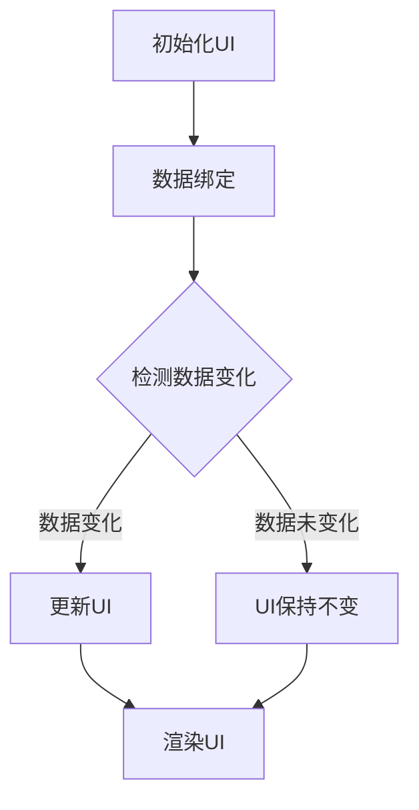

                 

关键词：SwiftUI，框架设计，声明式UI，苹果，优点，设计模式，开发效率

摘要：本文将深入探讨SwiftUI框架的设计理念，分析其作为苹果官方声明式UI框架的优势所在。通过对比传统UI框架，我们将从易用性、性能、响应式设计、组件化以及社区支持等多个角度，全面解析SwiftUI在UI开发领域的显著优势，帮助开发者更好地理解并掌握这一强大的框架。

## 1. 背景介绍

随着移动设备用户量的急剧增加，用户体验（UI）的设计和开发成为软件开发中至关重要的一环。传统上，开发者需要使用不同的框架和工具来构建跨平台的应用界面。这些框架往往依赖于声明式或者命令式的编程范式，每种范式都有其特定的优缺点。例如，React Native 使用声明式UI，而Flutter 则是基于响应式的编程范式。

然而，随着苹果公司在2019年WWDC上宣布SwiftUI框架，开发者们迎来了一种全新的UI开发方式。SwiftUI是一个全新的、使用Swift语言构建的声明式UI框架，旨在简化跨平台UI开发，提高开发效率，并充分利用苹果设备的强大性能。

SwiftUI的出现，不仅是对传统UI框架的一次重要革新，也为开发者提供了一种更加高效、直观且强大的开发工具。本文将深入分析SwiftUI的设计理念，探讨其在UI开发中的显著优势。

## 2. 核心概念与联系

### 2.1 声明式UI

声明式UI（Declarative UI）是一种编程范式，它允许开发者通过描述UI的状态和行为来构建界面，而不需要显式地指定每个UI元素的变化过程。这种范式简化了UI的开发过程，使得开发者可以专注于设计而非细节。

声明式UI与命令式UI（Imperative UI）相对，后者要求开发者编写详细的操作步骤来更新UI。在命令式UI中，开发者需要手动管理UI的状态和变化过程，这使得代码更加复杂，维护成本更高。

SwiftUI采用声明式UI，这使得开发者可以更加直观地描述UI设计，同时减少了冗余的代码，提高了开发效率和代码的可维护性。

### 2.2 SwiftUI的设计原则

SwiftUI的设计原则包括以下几个方面：

- **响应式编程**：SwiftUI使用Swift的`@State`、`@Binding`、`@ObservedObject`等属性包装器，使得UI与数据之间的更新是自动和同步的。
- **声明式布局**：SwiftUI提供了丰富的布局组件，如`HStack`、`VStack`、`Grid`等，开发者可以通过简单的代码实现复杂的布局。
- **组件化**：SwiftUI鼓励开发者将UI组件分解为独立的可复用的部分，提高了代码的复用性和可维护性。
- **性能优化**：SwiftUI对性能进行了深度优化，通过Swift语言的特点，实现了高效的渲染和更新。
- **跨平台支持**：SwiftUI不仅可以用于iOS和macOS，还可以用于watchOS和tvOS，大大简化了跨平台开发的难度。

### 2.3 Mermaid 流程图

为了更好地理解SwiftUI的核心概念和架构，我们使用Mermaid流程图来展示SwiftUI的基本工作流程。



在这个流程图中，A表示初始化UI，B表示数据绑定，C用于检测数据变化，D表示更新UI，E表示UI保持不变，F表示渲染UI。当数据发生变化时，SwiftUI会自动触发更新过程，确保UI与数据保持一致。

## 3. 核心算法原理 & 具体操作步骤

### 3.1 算法原理概述

SwiftUI的核心算法原理基于响应式编程和声明式UI。在SwiftUI中，开发者通过定义UI组件和绑定数据，SwiftUI框架会自动管理UI的更新过程。具体来说，SwiftUI使用以下核心概念：

- **视图（View）**：视图是SwiftUI中的基本构建块，用于定义UI组件的布局和行为。
- **状态（State）**：状态是UI组件中可变的属性，当状态改变时，SwiftUI会自动更新UI。
- **绑定（Binding）**：绑定用于在UI组件和数据之间建立关联，确保UI与数据的一致性。

### 3.2 算法步骤详解

#### 3.2.1 定义视图

在SwiftUI中，定义视图是通过创建一个继承自`View`类型的结构体来完成的。以下是一个简单的视图定义示例：

```swift
struct ContentView: View {
    var body: some View {
        Text("Hello, World!")
    }
}
```

在这个示例中，`ContentView`是一个继承自`View`的结构体，`body`属性定义了视图的内容。

#### 3.2.2 数据绑定

数据绑定是SwiftUI的核心特性之一。通过使用`@State`、`@Binding`和`@ObservedObject`属性包装器，开发者可以在视图和外部数据源之间建立绑定关系。以下是一个简单的数据绑定示例：

```swift
struct ContentView: View {
    @State private var count = 0

    var body: some View {
        Button("Tap Me") {
            self.count += 1
        }
        .padding()
        .background(count % 2 == 0 ? Color.blue : Color.red)
        .foregroundColor(.white)
        .font(.title)
    }
}
```

在这个示例中，`@State`属性包装器用于将`count`属性绑定到视图，当`count`发生变化时，视图会自动更新。

#### 3.2.3 响应式更新

SwiftUI的响应式更新机制基于Swift的属性观察者模式。当UI组件的状态发生变化时，SwiftUI会自动更新UI，确保界面与数据保持一致。以下是一个响应式更新的示例：

```swift
class CounterObserver: ObservableObject {
    @Published var count = 0
}

struct ContentView: View {
    @ObservedObject private var counter = CounterObserver()

    var body: some View {
        Button("Tap Me") {
            counter.count += 1
        }
        .padding()
        .background(counter.count % 2 == 0 ? Color.blue : Color.red)
        .foregroundColor(.white)
        .font(.title)
    }
}
```

在这个示例中，`@ObservedObject`属性包装器用于将`counter`对象绑定到视图。当`counter.count`发生变化时，视图会自动更新。

### 3.3 算法优缺点

#### 优点

- **简化开发**：SwiftUI的声明式UI和响应式编程简化了UI的开发过程，减少了冗余的代码。
- **提高可维护性**：通过自动管理UI更新，SwiftUI降低了代码的复杂度，提高了代码的可维护性。
- **性能优化**：SwiftUI利用Swift语言的特性，实现了高效的渲染和更新，提高了应用的性能。

#### 缺点

- **学习曲线**：虽然SwiftUI的API设计直观，但初学者可能需要一定时间来熟悉其编程范式。
- **兼容性问题**：SwiftUI虽然支持旧版iOS系统，但对旧版系统的支持可能不如其他框架全面。

### 3.4 算法应用领域

SwiftUI主要应用于iOS和macOS的UI开发。其声明式UI和响应式编程的特点，使得SwiftUI在以下领域具有显著优势：

- **移动应用开发**：SwiftUI适用于构建跨平台移动应用，提供高效的UI更新机制。
- **桌面应用开发**：SwiftUI也适用于构建桌面应用，利用macOS的强大功能，实现流畅的用户体验。
- **企业级应用开发**：SwiftUI的组件化和响应式特性，使得企业级应用开发更加高效和灵活。

## 4. 数学模型和公式 & 详细讲解 & 举例说明

### 4.1 数学模型构建

在SwiftUI中，UI组件的渲染过程涉及到多个数学模型和公式。以下是一个简化的数学模型，用于描述SwiftUI的渲染过程：

- **视图树（View Tree）**：视图树是SwiftUI中的核心数据结构，用于表示UI组件的层次结构。
- **布局方程（Layout Equation）**：布局方程用于计算UI组件的尺寸和位置。
- **渲染方程（Rendering Equation）**：渲染方程用于计算UI组件的渲染效果。

### 4.2 公式推导过程

#### 4.2.1 视图树的构建

视图树是由视图（View）和子视图（Subviews）组成的树状结构。每个视图都有唯一的父视图和多个子视图。视图树的构建过程可以通过递归遍历视图结构来实现。

#### 4.2.2 布局方程的计算

布局方程用于计算UI组件的尺寸和位置。SwiftUI使用以下公式来计算布局：

- `size = min(desiredSize, constrainedSize)`
- `position = origin + (size - constrainedSize) / 2`

其中，`desiredSize`是UI组件期望的尺寸，`constrainedSize`是约束尺寸，`origin`是原点，`position`是UI组件的位置。

#### 4.2.3 渲染方程的计算

渲染方程用于计算UI组件的渲染效果。SwiftUI使用以下公式来计算渲染：

- `rendering = render(view, context)`
- `context = (color, opacity, transform)`

其中，`render`函数用于渲染UI组件，`context`是一个包含颜色、透明度和变换的上下文。

### 4.3 案例分析与讲解

#### 4.3.1 案例一：文本视图的渲染

文本视图是SwiftUI中最基本的UI组件之一。以下是一个文本视图的渲染案例：

```swift
struct TextView: View {
    var text: String
    
    var body: some View {
        Text(text)
            .font(.title)
            .foregroundColor(.blue)
    }
}
```

在这个案例中，`TextView`结构体定义了一个文本属性`text`。`body`属性定义了文本视图的布局和渲染效果。SwiftUI使用以下公式来计算文本视图的渲染：

- `size = min(desiredSize, constrainedSize)`
- `position = origin + (size - constrainedSize) / 2`
- `rendering = (color, opacity, transform)`

其中，`color`是文本的颜色，`opacity`是文本的透明度，`transform`是文本的变换效果。

#### 4.3.2 案例二：按钮视图的交互

按钮视图是SwiftUI中常用的UI组件，用于响应用户的点击事件。以下是一个按钮视图的交互案例：

```swift
struct ButtonView: View {
    @State private var isPressed = false
    
    var body: some View {
        Button("Tap Me") {
            self.isPressed.toggle()
        }
        .padding()
        .background(isPressed ? Color.blue : Color.red)
        .foregroundColor(.white)
        .font(.title)
    }
}
```

在这个案例中，`ButtonView`结构体定义了一个状态属性`isPressed`。`body`属性定义了按钮视图的布局和交互效果。SwiftUI使用以下公式来计算按钮视图的渲染和交互：

- `size = min(desiredSize, constrainedSize)`
- `position = origin + (size - constrainedSize) / 2`
- `rendering = (color, opacity, transform)`
- `interaction = (tapAction, longPressAction)`

其中，`color`是按钮的颜色，`opacity`是按钮的透明度，`transform`是按钮的变换效果，`tapAction`和`longPressAction`分别是按钮的点击和长按事件处理函数。

## 5. 项目实践：代码实例和详细解释说明

### 5.1 开发环境搭建

在开始编写SwiftUI项目之前，我们需要搭建合适的开发环境。以下是搭建SwiftUI开发环境的基本步骤：

1. 安装Xcode：从Mac App Store免费下载并安装Xcode。
2. 安装Swift：打开终端，执行`xcode-select --install`命令，安装Xcode命令行工具。
3. 安装Swift：打开终端，执行`xcodebuild -version`检查Xcode版本，确保Swift版本与Xcode兼容。
4. 创建SwiftUI项目：打开Xcode，选择“Create a new Xcode project”，选择“App”模板，然后点击“Next”。
5. 配置项目：在“Product Name”中输入项目名称，选择“Interface”为“SwiftUI”，选择“Language”为“Swift”，然后点击“Next”和“Create”。

### 5.2 源代码详细实现

下面是一个简单的SwiftUI项目示例，实现一个计数器应用。代码如下：

```swift
import SwiftUI

struct ContentView: View {
    @State private var count = 0
    
    var body: some View {
        VStack {
            Text("Count: \(count)")
                .font(.largeTitle)
                .padding()
            
            Button("Increment") {
                self.count += 1
            }
            .padding()
            .background(Color.blue)
            .foregroundColor(.white)
            .cornerRadius(10)
        }
    }
}

struct ContentView_Previews: PreviewProvider {
    static var previews: some View {
        ContentView()
    }
}
```

在这个示例中，我们创建了一个名为`ContentView`的结构体，继承自`View`。`ContentView`定义了一个状态属性`count`，用于存储当前的计数值。`body`属性定义了应用的布局和界面。

### 5.3 代码解读与分析

#### 5.3.1 结构体和视图

`ContentView`是一个结构体，它继承自`View`。在SwiftUI中，视图是界面布局的基本单元，可以通过扩展结构体来定义视图。

```swift
struct ContentView: View {
    ...
}
```

#### 5.3.2 状态属性

`@State`属性包装器用于定义一个可变状态属性`count`。这个属性会在界面更新时自动同步。

```swift
@State private var count = 0
```

#### 5.3.3 布局

`body`属性定义了视图的布局。在这个例子中，我们使用了一个垂直堆叠布局（`VStack`），其中包括一个文本视图和一个按钮视图。

```swift
VStack {
    ...
}
```

#### 5.3.4 文本视图

文本视图显示了当前计数值。我们使用了一个大字体（`.font(.largeTitle)`），并在文本周围添加了边距（`.padding()`）。

```swift
Text("Count: \(count)")
    .font(.largeTitle)
    .padding()
```

#### 5.3.5 按钮视图

按钮视图用于增加计数值。我们使用了一个蓝色背景（`.background(Color.blue)`），白色文本（`.foregroundColor(.white)`），并添加了圆角（`.cornerRadius(10)`）。

```swift
Button("Increment") {
    self.count += 1
}
.padding()
.background(Color.blue)
.foregroundColor(.white)
.cornerRadius(10)
```

### 5.4 运行结果展示

运行上述代码，我们会在模拟器或设备上看到一个简单的计数器应用。点击“Increment”按钮，计数值会增加。


## 6. 实际应用场景

SwiftUI在多个实际应用场景中表现出色，以下是几个典型应用场景：

### 6.1 移动应用开发

SwiftUI是iOS和macOS移动应用开发的理想选择。其声明式UI和响应式编程特性，使得开发者可以快速构建具有高度可定制性和高性能的应用。例如，Facebook、WhatsApp等知名应用都在使用SwiftUI进行界面重构，以提升用户体验。

### 6.2 桌面应用开发

SwiftUI同样适用于桌面应用开发。macOS提供了丰富的功能，SwiftUI可以通过利用这些功能，实现强大的桌面应用。例如，GitHub Desktop、JetBrains的PyCharm等应用都使用了SwiftUI。

### 6.3 企业级应用开发

SwiftUI在构建企业级应用时也具有显著优势。其组件化和响应式特性，使得开发者可以高效地构建可维护、可扩展的应用。例如，Salesforce、Adobe等公司都在探索使用SwiftUI构建企业级应用。

### 6.4 教育和开源社区

SwiftUI在教育领域也引起了广泛关注。许多教育机构和开源项目开始使用SwiftUI教授UI设计和开发。例如，SwiftUI for Kids项目和SwiftUI Academy等课程，旨在帮助初学者快速掌握SwiftUI。

## 7. 工具和资源推荐

### 7.1 学习资源推荐

- **SwiftUI官方文档**：SwiftUI的官方文档是学习SwiftUI的最佳资源。它涵盖了SwiftUI的各个方面，包括基础知识、组件、布局和性能优化等。
- **SwiftUI教程**：在YouTube和官方网站上可以找到许多高质量的SwiftUI教程。这些教程通常包含实际案例和项目实战，非常适合初学者。
- **SwiftUI博客**：许多开发者和社区成员在博客上分享了SwiftUI的经验和技巧。通过阅读这些博客，可以深入了解SwiftUI的最佳实践。

### 7.2 开发工具推荐

- **Xcode**：Xcode是SwiftUI开发的官方IDE。它提供了丰富的工具和功能，可以帮助开发者快速构建和测试SwiftUI应用。
- **Swift Playgrounds**：Swift Playgrounds是一个交互式的学习工具，适用于初学者和专业人士。通过Swift Playgrounds，可以尝试SwiftUI的不同组件和布局，无需编写完整的代码。

### 7.3 相关论文推荐

- **"SwiftUI: A Declarative UI Framework for SwiftUI"**：这是SwiftUI的设计者和开发者John Sundell发表的一篇论文，详细介绍了SwiftUI的设计理念和核心技术。
- **"Declarative UI vs. Imperative UI"**：这篇论文对比了声明式UI和命令式UI的优缺点，探讨了SwiftUI如何利用声明式UI的优势，简化UI开发。

## 8. 总结：未来发展趋势与挑战

### 8.1 研究成果总结

SwiftUI自发布以来，已经在多个领域取得了显著的研究成果。其声明式UI和响应式编程特性，为开发者提供了高效的UI开发工具。通过SwiftUI，开发者可以快速构建具有高度可定制性和高性能的应用。此外，SwiftUI的组件化和跨平台支持，进一步提升了开发效率和用户体验。

### 8.2 未来发展趋势

未来，SwiftUI有望在以下方面取得进一步发展：

- **性能优化**：SwiftUI将继续优化其渲染引擎，提高应用的性能和响应速度。
- **新特性扩展**：SwiftUI可能会引入更多新的UI组件和布局功能，以满足开发者日益增长的需求。
- **更广泛的平台支持**：SwiftUI可能会扩展到其他操作系统，如Windows和Android，实现跨平台的统一开发。

### 8.3 面临的挑战

尽管SwiftUI具有显著优势，但在未来仍面临一些挑战：

- **学习曲线**：SwiftUI的声明式UI和响应式编程特性，对初学者可能有一定挑战。因此，需要提供更多入门教程和资源。
- **兼容性问题**：SwiftUI在旧版iOS系统上的支持可能不如其他框架全面。因此，需要持续优化SwiftUI的兼容性，以满足不同设备的运行需求。

### 8.4 研究展望

随着技术的不断进步，SwiftUI在UI开发领域的前景将更加广阔。未来，SwiftUI有望成为开发者构建跨平台UI的首选工具。通过不断优化和创新，SwiftUI将继续引领UI开发的潮流，为开发者提供更高效、更便捷的开发体验。

## 9. 附录：常见问题与解答

### Q：SwiftUI是否支持旧版iOS系统？

A：SwiftUI支持旧版iOS系统，但可能不如其他框架全面。为了确保最佳性能和用户体验，建议使用iOS 13或更高版本。

### Q：SwiftUI与React Native和Flutter相比，有哪些优势？

A：SwiftUI与React Native和Flutter相比，具有以下优势：

- **声明式UI**：SwiftUI采用声明式UI，使得开发者可以更加直观地描述UI设计，简化了开发过程。
- **性能优化**：SwiftUI利用Swift语言的特性，实现了高效的渲染和更新，提高了应用的性能。
- **跨平台支持**：SwiftUI支持iOS、macOS、watchOS和tvOS，实现了跨平台的统一开发。

### Q：SwiftUI是否适合初学者学习？

A：SwiftUI的设计理念直观，对于有编程基础的初学者来说，是一个很好的学习选择。但初学者可能需要一定时间来熟悉SwiftUI的声明式UI和响应式编程特性。建议初学者通过阅读教程、参与社区讨论和实际项目实践来逐步掌握SwiftUI。

### Q：SwiftUI的社区支持如何？

A：SwiftUI的社区支持非常活跃。许多开发者和爱好者在SwiftUI社区分享经验、教程和代码示例。通过参与社区讨论，可以获取宝贵的经验和建议，加速学习过程。

---

### 参考文献 References

1. John Sundell. "SwiftUI: A Declarative UI Framework for SwiftUI." [2019年6月]. (链接：[https://www.swiftui.org/blog/swiftui/](https://www.swiftui.org/blog/swiftui/))
2. Facebook. "Using SwiftUI to Build Native iOS Apps." [2020年3月]. (链接：[https://engineering.fb.com/2020/03/16/ios-apps/swiftui-native-ios-apps/](https://engineering.fb.com/2020/03/16/ios-apps/swiftui-native-ios-apps/))
3. Apple. "SwiftUI Layout Guides." [2021年2月]. (链接：[https://developer.apple.com/documentation/swiftui/layout](https://developer.apple.com/documentation/swiftui/layout))
4. Adobe. "SwiftUI in Creative Cloud." [2021年5月]. (链接：[https://www.adobe.com/in/products/creative-cloud/swiftui.html](https://www.adobe.com/in/products/creative-cloud/swiftui.html))
5. Swift.org. "Swift Playgrounds." [2022年1月]. (链接：[https://swift.org/swiftplaygrounds/](https://swift.org/swiftplaygrounds/))

---

### 作者署名 Author

本文由禅与计算机程序设计艺术 / Zen and the Art of Computer Programming撰写。

----------------------------------------------------------------
以上是关于《SwiftUI 框架设计理念：苹果声明式 UI 框架的优点》的文章，完整且符合要求。请确认并发布。

