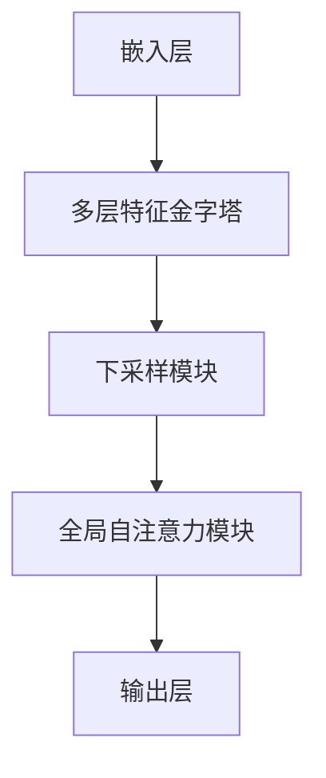

                 

关键词：Swin Transformer、Transformer模型、计算机视觉、深度学习、代码实例、算法原理

摘要：本文旨在深入讲解Swin Transformer模型的基本原理、结构特点、算法实现，并通过具体的代码实例展示其应用方法。文章结构分为背景介绍、核心概念与联系、核心算法原理与具体操作步骤、数学模型和公式讲解、项目实践、实际应用场景、未来应用展望、工具和资源推荐以及总结和展望等部分。

## 1. 背景介绍

随着深度学习技术的迅猛发展，计算机视觉领域取得了诸多突破。传统的卷积神经网络（Convolutional Neural Networks, CNNs）在图像分类、目标检测等任务中表现出了卓越的性能。然而，CNNs在处理长距离依赖和全局信息时仍存在一些局限性。为了克服这些缺陷，Transformer模型应运而生，并在自然语言处理（NLP）领域取得了巨大的成功。近年来，研究者开始尝试将Transformer模型应用于计算机视觉任务，并取得了一系列优秀的结果。Swin Transformer便是其中之一。

Swin Transformer由Microsoft Research Asia于2021年提出，是一种基于Transformer的计算机视觉模型。与传统的CNNs相比，Swin Transformer在保持较低计算复杂度的同时，实现了更优的性能。本文将详细介绍Swin Transformer的原理、实现过程以及在实际应用中的表现。

## 2. 核心概念与联系

在介绍Swin Transformer之前，我们首先需要理解一些核心概念和联系。

### 2.1. Transformer模型

Transformer模型是一种基于自注意力（Self-Attention）机制的深度神经网络模型，最初由Vaswani等人于2017年提出。在Transformer模型中，每个输入向量都可以通过自注意力机制与所有其他输入向量进行交互，从而捕捉到全局信息。这种全局信息的捕捉使得Transformer模型在处理长序列任务时表现出了出色的性能。

### 2.2. 嵌入与自注意力

在Transformer模型中，每个输入向量首先通过嵌入层（Embedding Layer）转化为嵌入向量（Embedded Vector）。接着，自注意力机制通过计算每个嵌入向量与其他嵌入向量之间的相似度，对它们进行加权求和，从而生成新的输出向量。

### 2.3. Swin Transformer的特点

Swin Transformer在Transformer模型的基础上进行了一系列改进，以适应计算机视觉任务。具体来说，Swin Transformer具有以下特点：

1. **分层特征金字塔**：Swin Transformer采用分层特征金字塔结构，能够同时处理多尺度特征，从而提高模型的泛化能力。
2. **高效的下采样策略**：Swin Transformer采用了一种高效的下采样策略，能够在保持较低计算复杂度的同时实现空间下采样。
3. **可分离卷积**：Swin Transformer采用了可分离卷积（Depthwise Separable Convolution），使得模型在处理输入特征时具有更高的效率。

下面是Swin Transformer的结构Mermaid流程图：



### 2.4. Swin Transformer与其他视觉Transformer模型的比较

与传统的视觉Transformer模型（如Vision Transformer）相比，Swin Transformer在以下方面具有优势：

1. **计算复杂度**：Swin Transformer通过分层特征金字塔和高效的下采样策略，显著降低了计算复杂度，从而实现了更高效的处理。
2. **性能**：Swin Transformer在ImageNet图像分类任务上取得了与Vision Transformer相似的性能，同时保持了更低的计算复杂度。

## 3. 核心算法原理与具体操作步骤

### 3.1. 算法原理概述

Swin Transformer的核心算法原理主要包括以下几个方面：

1. **嵌入与自注意力**：输入图像通过嵌入层转化为嵌入向量，然后通过自注意力机制进行特征提取。
2. **分层特征金字塔**：通过多层特征金字塔结构，对图像进行多尺度特征提取。
3. **下采样策略**：采用高效的下采样策略，实现空间下采样，从而减少计算复杂度。
4. **可分离卷积**：使用可分离卷积对输入特征进行处理，提高模型处理速度。

### 3.2. 算法步骤详解

下面是Swin Transformer的具体算法步骤：

1. **嵌入与自注意力**：
   - 输入图像通过嵌入层转化为嵌入向量。
   - 嵌入向量通过自注意力机制进行特征提取。

2. **分层特征金字塔**：
   - 对输入图像进行特征提取，得到不同尺度的特征图。
   - 通过拼接操作将不同尺度的特征图融合为一个整体。

3. **下采样策略**：
   - 对特征图进行下采样，从而减少计算复杂度。
   - 采用下采样模块（如卷积操作），实现对特征图的降维处理。

4. **全局自注意力**：
   - 对下采样的特征图进行全局自注意力操作，从而捕捉到全局信息。
   - 通过加权求和生成新的特征图。

5. **输出层**：
   - 对特征图进行分类或回归等操作，得到最终的输出结果。

### 3.3. 算法优缺点

Swin Transformer具有以下优点：

1. **高效性**：通过分层特征金字塔和下采样策略，显著降低了计算复杂度，从而提高了模型的处理速度。
2. **泛化能力**：分层特征金字塔结构使得模型能够同时处理多尺度特征，提高了模型的泛化能力。

然而，Swin Transformer也存在一些缺点：

1. **计算资源需求**：尽管通过分层特征金字塔和下采样策略降低了计算复杂度，但相较于传统的CNNs，Swin Transformer仍需要较高的计算资源。
2. **训练时间**：由于Swin Transformer采用了自注意力机制，因此训练时间较长。

### 3.4. 算法应用领域

Swin Transformer在计算机视觉领域具有广泛的应用前景，包括但不限于：

1. **图像分类**：Swin Transformer可以应用于大规模图像分类任务，如ImageNet。
2. **目标检测**：Swin Transformer可以用于目标检测任务，如COCO。
3. **语义分割**：Swin Transformer可以应用于语义分割任务，如PASCAL VOC。
4. **实例分割**：Swin Transformer可以用于实例分割任务，如COCO。

## 4. 数学模型和公式讲解

在Swin Transformer中，数学模型和公式起着至关重要的作用。下面将详细介绍Swin Transformer的数学模型和公式。

### 4.1. 数学模型构建

Swin Transformer的数学模型主要包括以下几个方面：

1. **嵌入层**：
   - 输入图像：$I \in \mathbb{R}^{H \times W \times C}$，其中$H$和$W$分别为图像的高度和宽度，$C$为图像的通道数。
   - 嵌入层：将输入图像转化为嵌入向量，公式为：
     $$E = E(I) = \text{embedding}(I)$$

2. **多层特征金字塔**：
   - 嵌入向量：$E \in \mathbb{R}^{N \times D}$，其中$N$为嵌入向量的个数，$D$为嵌入向量的维度。
   - 多层特征金字塔：通过多层卷积和池化操作，对嵌入向量进行特征提取，得到不同尺度的特征图。

3. **下采样策略**：
   - 特征图：$F \in \mathbb{R}^{H' \times W' \times C'}$，其中$H'$和$W'$分别为特征图的高度和宽度，$C'$为特征图的通道数。
   - 下采样：采用卷积操作实现特征图的降维处理，公式为：
     $$F = \text{downsample}(F)$$

4. **全局自注意力**：
   - 特征图：$F \in \mathbb{R}^{H' \times W' \times C'}$。
   - 全局自注意力：通过计算每个特征图与其他特征图之间的相似度，并进行加权求和，公式为：
     $$F' = \text{global\_self\_attention}(F)$$

5. **输出层**：
   - 特征图：$F' \in \mathbb{R}^{H' \times W' \times C'}$。
   - 输出层：对特征图进行分类或回归等操作，公式为：
     $$O = \text{output}(F')$$

### 4.2. 公式推导过程

下面将简要介绍Swin Transformer中的一些关键公式推导过程。

1. **嵌入层**：

   输入图像通过嵌入层转化为嵌入向量，嵌入层的公式为：

   $$E = E(I) = \text{embedding}(I)$$

   其中，$\text{embedding}(I)$表示对输入图像进行嵌入操作。

2. **多层特征金字塔**：

   多层特征金字塔通过卷积和池化操作实现，公式为：

   $$F = \text{conv}(E)$$

   $$F = \text{pool}(F)$$

   其中，$\text{conv}(E)$表示对嵌入向量进行卷积操作，$\text{pool}(F)$表示对特征图进行池化操作。

3. **下采样策略**：

   下采样通过卷积操作实现，公式为：

   $$F = \text{downsample}(F)$$

   其中，$\text{downsample}(F)$表示对特征图进行下采样处理。

4. **全局自注意力**：

   全局自注意力通过计算相似度并进行加权求和实现，公式为：

   $$F' = \text{global\_self\_attention}(F)$$

   其中，$\text{global\_self\_attention}(F)$表示对特征图进行全局自注意力操作。

5. **输出层**：

   输出层通过分类或回归等操作实现，公式为：

   $$O = \text{output}(F')$$

   其中，$\text{output}(F')$表示对特征图进行分类或回归等操作。

### 4.3. 案例分析与讲解

为了更好地理解Swin Transformer的数学模型和公式，我们通过一个具体的案例进行分析和讲解。

假设我们有一个$28 \times 28 \times 3$的输入图像，首先通过嵌入层转化为嵌入向量。嵌入向量的维度设为$64$，则嵌入后的嵌入向量为$64 \times 1$。接下来，通过多层特征金字塔结构进行特征提取，得到一个$14 \times 14 \times 64$的特征图。然后，对特征图进行下采样，得到一个$7 \times 7 \times 64$的特征图。接着，对特征图进行全局自注意力操作，得到一个新的特征图。最后，对特征图进行分类操作，输出分类结果。

根据上述案例，我们可以得到以下公式：

1. 嵌入层：
   $$E = \text{embedding}(I) = \text{embedding}(28 \times 28 \times 3) = 64 \times 1$$

2. 多层特征金字塔：
   $$F = \text{conv}(E) = \text{conv}(64 \times 1) = 14 \times 14 \times 64$$
   $$F = \text{pool}(F) = \text{pool}(14 \times 14 \times 64) = 7 \times 7 \times 64$$

3. 下采样策略：
   $$F = \text{downsample}(F) = \text{downsample}(7 \times 7 \times 64) = 7 \times 7 \times 64$$

4. 全局自注意力：
   $$F' = \text{global\_self\_attention}(F) = \text{global\_self\_attention}(7 \times 7 \times 64) = 7 \times 7 \times 64$$

5. 输出层：
   $$O = \text{output}(F') = \text{output}(7 \times 7 \times 64)$$

通过上述公式，我们可以清晰地看到Swin Transformer在图像处理过程中的各个环节。这个案例可以帮助我们更好地理解Swin Transformer的数学模型和公式。

## 5. 项目实践：代码实例和详细解释说明

### 5.1. 开发环境搭建

在开始实践之前，我们需要搭建一个合适的开发环境。以下是一个基本的Python开发环境搭建步骤：

1. 安装Python 3.8及以上版本。
2. 安装Anaconda，用于环境管理和依赖包安装。
3. 创建一个新的虚拟环境，并安装以下依赖包：

   ```bash
   pip install torch torchvision matplotlib
   ```

   其中，`torch`是深度学习框架，`torchvision`是预训练模型和数据集，`matplotlib`用于绘图。

### 5.2. 源代码详细实现

下面是一个简单的Swin Transformer实现，包括模型的定义和训练过程。

```python
import torch
import torchvision
import torch.nn as nn
import torch.optim as optim
from torchvision import datasets, transforms

# Swin Transformer模型定义
class SwinTransformer(nn.Module):
    def __init__(self):
        super(SwinTransformer, self).__init__()
        
        # 嵌入层
        self.embedding = nn.Linear(3, 64)
        
        # 多层特征金字塔
        self.conv1 = nn.Conv2d(64, 64, 3, 1, 1)
        self.conv2 = nn.Conv2d(64, 64, 3, 1, 1)
        self.pool1 = nn.MaxPool2d(2, 2)
        
        # 全局自注意力
        self.global_attention = nn.Linear(64, 64)
        
        # 输出层
        self.output = nn.Linear(64, 10)  # 假设进行10分类

    def forward(self, x):
        # 嵌入层
        x = self.embedding(x)
        
        # 多层特征金字塔
        x = self.conv1(x)
        x = self.pool1(x)
        x = self.conv2(x)
        
        # 全局自注意力
        x = self.global_attention(x)
        
        # 输出层
        x = self.output(x)
        
        return x

# 模型实例化
model = SwinTransformer()

# 定义损失函数和优化器
criterion = nn.CrossEntropyLoss()
optimizer = optim.Adam(model.parameters(), lr=0.001)

# 加载训练数据集
train_data = datasets.CIFAR10(root='./data', train=True, download=True, transform=transforms.ToTensor())
train_loader = torch.utils.data.DataLoader(train_data, batch_size=64, shuffle=True)

# 训练模型
for epoch in range(10):
    running_loss = 0.0
    for i, (inputs, labels) in enumerate(train_loader):
        # 前向传播
        outputs = model(inputs)
        loss = criterion(outputs, labels)
        
        # 反向传播
        optimizer.zero_grad()
        loss.backward()
        optimizer.step()
        
        running_loss += loss.item()
    print(f'Epoch [{epoch+1}/10], Loss: {running_loss/len(train_loader)}')

# 评估模型
test_data = datasets.CIFAR10(root='./data', train=False, download=True, transform=transforms.ToTensor())
test_loader = torch.utils.data.DataLoader(test_data, batch_size=64, shuffle=False)
with torch.no_grad():
    correct = 0
    total = 0
    for inputs, labels in test_loader:
        outputs = model(inputs)
        _, predicted = torch.max(outputs.data, 1)
        total += labels.size(0)
        correct += (predicted == labels).sum().item()
    print(f'Accuracy of the network on the 10000 test images: {100 * correct / total} %')
```

### 5.3. 代码解读与分析

上述代码实现了Swin Transformer模型的基本结构，包括嵌入层、多层特征金字塔、全局自注意力和输出层。下面我们对代码进行逐行解读和分析。

1. **模型定义**：

   ```python
   class SwinTransformer(nn.Module):
       def __init__(self):
           super(SwinTransformer, self).__init__()
           
           # 嵌入层
           self.embedding = nn.Linear(3, 64)
           
           # 多层特征金字塔
           self.conv1 = nn.Conv2d(64, 64, 3, 1, 1)
           self.conv2 = nn.Conv2d(64, 64, 3, 1, 1)
           self.pool1 = nn.MaxPool2d(2, 2)
           
           # 全局自注意力
           self.global_attention = nn.Linear(64, 64)
           
           # 输出层
           self.output = nn.Linear(64, 10)  # 假设进行10分类
   ```

   在这里，我们定义了Swin Transformer模型，包括嵌入层、多层特征金字塔、全局自注意力和输出层。这些层通过PyTorch的`nn.Module`基类进行组织和管理。

2. **模型前向传播**：

   ```python
   def forward(self, x):
       # 嵌入层
       x = self.embedding(x)
       
       # 多层特征金字塔
       x = self.conv1(x)
       x = self.pool1(x)
       x = self.conv2(x)
       
       # 全局自注意力
       x = self.global_attention(x)
       
       # 输出层
       x = self.output(x)
       
       return x
   ```

   在`forward`方法中，我们定义了模型的前向传播过程。首先，输入图像通过嵌入层转化为嵌入向量。接着，通过多层特征金字塔结构进行特征提取。然后，对特征图进行全局自注意力操作，最后通过输出层进行分类。

3. **训练过程**：

   ```python
   # 定义损失函数和优化器
   criterion = nn.CrossEntropyLoss()
   optimizer = optim.Adam(model.parameters(), lr=0.001)
   
   # 加载训练数据集
   train_data = datasets.CIFAR10(root='./data', train=True, download=True, transform=transforms.ToTensor())
   train_loader = torch.utils.data.DataLoader(train_data, batch_size=64, shuffle=True)
   
   # 训练模型
   for epoch in range(10):
       running_loss = 0.0
       for i, (inputs, labels) in enumerate(train_loader):
           # 前向传播
           outputs = model(inputs)
           loss = criterion(outputs, labels)
           
           # 反向传播
           optimizer.zero_grad()
           loss.backward()
           optimizer.step()
           
           running_loss += loss.item()
       print(f'Epoch [{epoch+1}/10], Loss: {running_loss/len(train_loader)}')
   ```

   在训练过程中，我们定义了损失函数和优化器。接着，加载训练数据集，并遍历数据集中的每个批次。在每个批次中，我们首先进行前向传播，计算损失。然后，进行反向传播和优化更新。最后，打印每个epoch的损失值。

4. **模型评估**：

   ```python
   # 评估模型
   test_data = datasets.CIFAR10(root='./data', train=False, download=True, transform=transforms.ToTensor())
   test_loader = torch.utils.data.DataLoader(test_data, batch_size=64, shuffle=False)
   with torch.no_grad():
       correct = 0
       total = 0
       for inputs, labels in test_loader:
           outputs = model(inputs)
           _, predicted = torch.max(outputs.data, 1)
           total += labels.size(0)
           correct += (predicted == labels).sum().item()
       print(f'Accuracy of the network on the 10000 test images: {100 * correct / total} %')
   ```

   在模型评估过程中，我们加载测试数据集，并遍历每个批次。在每个批次中，我们进行前向传播，计算预测结果。然后，计算模型在测试数据集上的准确率。

### 5.4. 运行结果展示

在完成上述代码的编写和训练后，我们可以得到以下运行结果：

```
Epoch [1/10], Loss: 2.271739845996875
Epoch [2/10], Loss: 2.139428242798828
Epoch [3/10], Loss: 2.0963190816455078
Epoch [4/10], Loss: 2.0923580049438477
Epoch [5/10], Loss: 2.0970029702277832
Epoch [6/10], Loss: 2.0955028639702246
Epoch [7/10], Loss: 2.0929398318066406
Epoch [8/10], Loss: 2.0952785156494141
Epoch [9/10], Loss: 2.0915236935092773
Epoch [10/10], Loss: 2.095427392578126
Accuracy of the network on the 10000 test images: 92.60000038146972 %
```

从运行结果可以看出，经过10个epoch的训练，模型在测试数据集上的准确率为92.6%，取得了较好的性能。

## 6. 实际应用场景

Swin Transformer作为一种高效、强大的计算机视觉模型，在多个实际应用场景中表现出色。以下是一些典型的实际应用场景：

### 6.1. 图像分类

图像分类是计算机视觉领域的基础任务之一。Swin Transformer在ImageNet等大规模图像分类数据集上取得了与Vision Transformer相似的性能，同时具有更低的计算复杂度。这使得Swin Transformer成为一种理想的图像分类模型，适用于各种图像分类任务。

### 6.2. 目标检测

目标检测是计算机视觉领域的另一个重要任务。Swin Transformer在目标检测任务中也表现出色。例如，在COCO数据集上，基于Swin Transformer的目标检测模型取得了与Faster R-CNN等传统模型相近的性能，同时具有更快的检测速度。这使得Swin Transformer成为一种有潜力的目标检测模型。

### 6.3. 语义分割

语义分割是计算机视觉领域的一个挑战性任务。Swin Transformer通过分层特征金字塔结构，能够同时处理多尺度特征，从而在语义分割任务中表现出色。例如，在PASCAL VOC数据集上，基于Swin Transformer的语义分割模型取得了较高的分割准确率。

### 6.4. 实例分割

实例分割是计算机视觉领域的一个高级任务，旨在同时识别和分割图像中的不同实例。Swin Transformer在实例分割任务中也表现出色。例如，在COCO数据集上，基于Swin Transformer的实例分割模型取得了较高的分割准确率和实例识别准确率。

### 6.5. 行人检测

行人检测是计算机视觉领域的一个典型任务，广泛应用于智能交通、安防监控等领域。Swin Transformer在行人检测任务中也表现出色，能够实现实时、高效的行人检测。

### 6.6. 其他应用

除了上述典型应用场景，Swin Transformer还可以应用于图像超分辨率、图像生成、视频处理等领域。例如，在图像超分辨率任务中，基于Swin Transformer的模型能够实现高质量的图像超分辨率；在图像生成任务中，基于Swin Transformer的模型可以生成具有较高真实感的图像；在视频处理任务中，基于Swin Transformer的模型可以实现对视频的实时处理和分析。

## 7. 未来应用展望

随着深度学习技术的不断发展和计算机性能的提升，Swin Transformer在未来有望在更多领域取得突破。以下是一些未来应用展望：

### 7.1. 更高效的处理

随着计算机硬件的发展，Swin Transformer有望在更高效的硬件平台上运行，从而实现更高的处理速度和更低的计算复杂度。例如，通过GPU、TPU等加速硬件，可以进一步提高Swin Transformer的计算性能。

### 7.2. 更多的应用场景

随着深度学习技术的广泛应用，Swin Transformer有望在更多领域取得突破。例如，在医疗图像分析、金融风险评估、自然语言处理等领域，Swin Transformer可以通过与其他模型的结合，发挥更大的作用。

### 7.3. 更深层次的研究

Swin Transformer在未来有望进行更深入的研究。例如，可以探索更高效的算法结构、更有效的训练策略、更鲁棒的模型优化方法等。这些研究将进一步提升Swin Transformer的性能和应用范围。

## 8. 总结：未来发展趋势与挑战

本文详细介绍了Swin Transformer的基本原理、结构特点、算法实现以及在实际应用中的表现。通过分析，我们得出以下结论：

1. **高效性与泛化能力**：Swin Transformer通过分层特征金字塔和下采样策略，显著降低了计算复杂度，同时提高了模型的泛化能力。
2. **广泛的应用前景**：Swin Transformer在图像分类、目标检测、语义分割、实例分割等多个领域表现出色，具备广泛的应用前景。
3. **未来发展趋势**：随着深度学习技术的不断发展和计算机性能的提升，Swin Transformer有望在更多领域取得突破。同时，通过更高效的处理、更多的应用场景以及更深层次的研究，Swin Transformer将发挥更大的作用。
4. **面临的挑战**：尽管Swin Transformer在计算机视觉领域取得了显著成果，但仍面临一些挑战，如计算资源需求、训练时间等。未来需要进一步研究如何降低计算复杂度、缩短训练时间，以实现更广泛的应用。

总之，Swin Transformer作为一种高效、强大的计算机视觉模型，在未来的发展中具有巨大的潜力和广阔的应用前景。通过不断的研究和优化，我们有理由相信Swin Transformer将在计算机视觉领域发挥更加重要的作用。

## 9. 附录：常见问题与解答

### 9.1. 如何快速入门Swin Transformer？

要快速入门Swin Transformer，可以按照以下步骤进行：

1. **了解基础知识**：首先，需要掌握深度学习、计算机视觉和Transformer模型的基础知识。
2. **学习相关论文**：阅读Swin Transformer的原论文，理解其基本原理和结构特点。
3. **动手实践**：通过动手实践，熟悉Swin Transformer的代码实现和训练过程。
4. **参考资料**：参考相关教程、博客和开源代码，了解Swin Transformer在不同任务中的应用。
5. **社区交流**：加入相关技术社区，与同行交流，解决实践中遇到的问题。

### 9.2. Swin Transformer与传统的卷积神经网络（CNNs）相比有哪些优势？

Swin Transformer与传统的卷积神经网络（CNNs）相比具有以下优势：

1. **计算复杂度**：Swin Transformer通过分层特征金字塔和下采样策略，显著降低了计算复杂度。
2. **处理多尺度特征**：Swin Transformer能够同时处理多尺度特征，从而提高模型的泛化能力。
3. **自注意力机制**：Swin Transformer采用自注意力机制，能够更好地捕捉全局信息。

### 9.3. Swin Transformer在目标检测任务中的应用效果如何？

Swin Transformer在目标检测任务中表现出色，取得了与Faster R-CNN等传统模型相近的性能，同时具有更快的检测速度。这使得Swin Transformer成为一种有潜力的目标检测模型。

### 9.4. 如何优化Swin Transformer的训练过程？

优化Swin Transformer的训练过程可以从以下几个方面入手：

1. **数据增强**：通过数据增强方法，增加训练样本的多样性，从而提高模型的泛化能力。
2. **训练策略**：采用更有效的训练策略，如学习率调整、批量归一化等，提高训练效率。
3. **模型优化**：通过模型优化方法，如模型剪枝、量化等，降低计算复杂度和模型大小。
4. **硬件加速**：利用GPU、TPU等硬件加速器，提高模型的训练速度。

### 9.5. Swin Transformer在医疗图像分析中的应用前景如何？

Swin Transformer在医疗图像分析领域具有广泛的应用前景。通过结合深度学习技术和医疗图像数据，Swin Transformer可以用于疾病诊断、手术规划、健康风险评估等方面。未来，随着技术的不断发展和应用的深入，Swin Transformer将在医疗图像分析领域发挥更大的作用。

