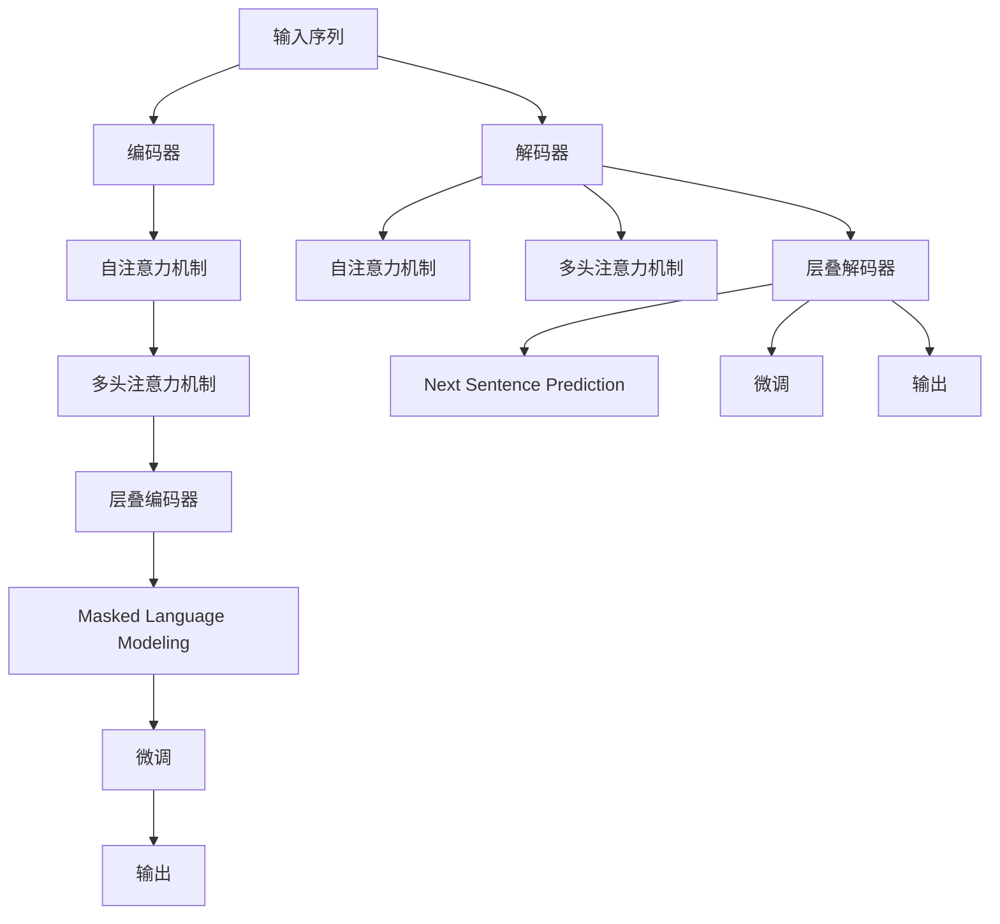

                 

关键词：BERT 模型，Transformer，预训练，自然语言处理，深度学习，神经网络，大规模语言模型。

> 摘要：本文深入探讨了 Transformer 大模型及其变体 BERT（Bidirectional Encoder Representations from Transformers）在自然语言处理中的应用。首先，我们介绍了 Transformer 的基本概念和历史背景，然后详细讲解了 BERT 的核心算法原理和具体操作步骤。接下来，通过数学模型和公式推导，对 BERT 的内部机制进行了深入分析，并通过实际项目实践展示了 BERT 的代码实现。最后，我们探讨了 BERT 在实际应用场景中的表现，并对其未来应用展望进行了展望。

## 1. 背景介绍

随着深度学习和神经网络技术的飞速发展，自然语言处理（NLP）领域也迎来了新的变革。传统的 NLP 方法，如统计语言模型和规则匹配，已经无法满足当前复杂的语言处理需求。为了更好地理解和使用人类语言，研究人员开始探索更强大的模型，如基于神经网络的深度学习模型。

### 1.1 Transformer 的出现

Transformer 是由 Vaswani 等人于 2017 年提出的一种全新的神经网络架构，用于解决机器翻译问题。与传统的循环神经网络（RNN）相比，Transformer 采用了自注意力机制（Self-Attention）和多头注意力（Multi-Head Attention）机制，能够并行处理输入序列，并且在处理长距离依赖关系方面表现出色。

### 1.2 BERT 的诞生

在 Transformer 出现后，研究人员发现其可以用于更广泛的 NLP 任务，包括文本分类、问答系统和命名实体识别等。为了更好地利用 Transformer 的优势，2018 年 Google 提出了 BERT（Bidirectional Encoder Representations from Transformers）模型。BERT 是第一个将 Transformer 用于预训练的模型，通过大规模语料库进行预训练，然后可以在各种下游任务中进行微调。

## 2. 核心概念与联系

### 2.1 Transformer 架构

Transformer 模型主要由编码器（Encoder）和解码器（Decoder）组成。编码器负责将输入序列（如单词）转换为序列表示，解码器则负责生成输出序列。Transformer 使用自注意力机制和多头注意力机制来处理输入序列，并通过层叠多个编码器和解码器来提高模型的表示能力。

### 2.2 BERT 的核心算法原理

BERT 是基于 Transformer 架构的，但它增加了一些特殊的训练目标，如 Masked Language Modeling（MLM）和 Next Sentence Prediction（NSP）。MLM 任务通过随机遮蔽输入序列中的单词来训练模型，使其能够理解和预测语言中的上下文信息。NSP 任务则通过预测两个连续句子之间的关系来增强模型的语境理解能力。

### 2.3 Mermaid 流程图

下面是 BERT 模型的 Mermaid 流程图：



## 3. 核心算法原理 & 具体操作步骤

### 3.1 算法原理概述

BERT 模型通过预训练和微调两个阶段来学习语言表示。在预训练阶段，模型通过 Masked Language Modeling 和 Next Sentence Prediction 两个任务来学习语言的深层表示。在微调阶段，模型在特定任务上（如文本分类、问答系统等）进行微调，以获得更好的性能。

### 3.2 算法步骤详解

#### 3.2.1 预训练阶段

1. **Masked Language Modeling（MLM）**：在输入序列中随机遮蔽一定比例的单词，然后让模型预测这些被遮蔽的单词。

2. **Next Sentence Prediction（NSP）**：从语料库中随机抽取两个句子，并将它们作为输入，让模型预测第二个句子是否紧随第一个句子之后。

#### 3.2.2 微调阶段

1. **准备数据集**：对于特定任务，准备相应的数据集，并将数据集分成训练集和验证集。

2. **数据预处理**：对数据进行预处理，如分词、编码等。

3. **模型初始化**：使用预训练好的 BERT 模型作为初始化模型。

4. **微调**：在训练集上进行微调，并在验证集上进行评估。

5. **超参数调整**：根据训练过程中的表现，调整超参数，如学习率、批量大小等。

6. **模型评估**：在测试集上评估模型的性能。

### 3.3 算法优缺点

#### 优点：

1. **强大的预训练能力**：BERT 通过预训练能够学习到丰富的语言知识，从而在下游任务中表现出色。

2. **并行处理能力**：Transformer 的自注意力机制使得模型能够并行处理输入序列，提高了计算效率。

3. **良好的泛化能力**：BERT 模型在多种下游任务上都取得了很好的性能，证明了其良好的泛化能力。

#### 缺点：

1. **计算资源消耗大**：BERT 模型参数量庞大，训练和微调过程需要大量的计算资源。

2. **训练时间较长**：由于模型参数量巨大，训练时间相对较长。

### 3.4 算法应用领域

BERT 模型在多个 NLP 任务中取得了很好的性能，如文本分类、问答系统、命名实体识别等。以下是一些具体的案例：

1. **文本分类**：BERT 模型可以用于情感分析、新闻分类等任务。

2. **问答系统**：BERT 模型可以用于构建基于事实的问答系统，如 Google Assistant。

3. **命名实体识别**：BERT 模型可以用于识别文本中的命名实体，如人名、地名等。

## 4. 数学模型和公式 & 详细讲解 & 举例说明

### 4.1 数学模型构建

BERT 模型的数学模型主要由两个部分组成：自注意力机制（Self-Attention）和多头注意力机制（Multi-Head Attention）。

#### 4.1.1 自注意力机制

自注意力机制是一种用于计算序列中每个单词与其他单词之间的关系的方法。其基本公式如下：

$$
\text{Self-Attention}(Q, K, V) = \text{softmax}\left(\frac{QK^T}{\sqrt{d_k}}\right)V
$$

其中，$Q$、$K$ 和 $V$ 分别代表查询（Query）、键（Key）和值（Value）向量，$d_k$ 代表键向量的维度。

#### 4.1.2 多头注意力机制

多头注意力机制是将自注意力机制扩展到多个头，每个头具有不同的权重矩阵。其基本公式如下：

$$
\text{Multi-Head Attention}(Q, K, V) = \text{Concat}(\text{head}_1, \text{head}_2, ..., \text{head}_h)W^O
$$

其中，$W^O$ 是输出权重矩阵，$\text{head}_i$ 是第 $i$ 个头的输出。

### 4.2 公式推导过程

BERT 模型的公式推导过程涉及多个步骤，包括线性变换、激活函数和归一化操作等。以下是简要的推导过程：

1. **输入向量表示**：将输入序列 $x_1, x_2, ..., x_n$ 映射为嵌入向量 $e_1, e_2, ..., e_n$。

2. **线性变换**：对嵌入向量进行线性变换，得到查询向量 $Q$、键向量 $K$ 和值向量 $V$。

3. **多头注意力**：使用多头注意力机制计算每个词与其他词之间的关系。

4. **激活函数**：对多头注意力的输出进行激活函数处理，如 ReLU 或 Gelu。

5. **拼接与线性变换**：将多头注意力的输出拼接在一起，并进行线性变换得到最终输出。

### 4.3 案例分析与讲解

下面我们通过一个简单的例子来讲解 BERT 模型的具体应用。

#### 4.3.1 数据集准备

假设我们有一个包含 1000 个单词的数据集，每个单词表示为一个 50 维的向量。我们将这些单词表示为 $x_1, x_2, ..., x_{1000}$。

#### 4.3.2 预处理

对数据进行预处理，包括分词、编码等。假设我们使用 WordPiece 分词方法，将每个单词拆分为子词，并将子词表示为整数。

#### 4.3.3 模型初始化

初始化 BERT 模型，包括嵌入层、线性层和激活函数等。假设我们使用预训练好的 BERT 模型作为初始化模型。

#### 4.3.4 预训练

在预训练阶段，我们使用 Masked Language Modeling 和 Next Sentence Prediction 两个任务来训练模型。具体过程如下：

1. **Masked Language Modeling**：随机遮蔽输入序列中的 15% 的单词，然后让模型预测这些被遮蔽的单词。

2. **Next Sentence Prediction**：从语料库中随机抽取两个句子，并将它们作为输入，让模型预测第二个句子是否紧随第一个句子之后。

#### 4.3.5 微调

在微调阶段，我们将预训练好的 BERT 模型在特定任务上（如文本分类）进行微调。具体过程如下：

1. **数据预处理**：对数据进行预处理，包括分词、编码等。

2. **模型初始化**：使用预训练好的 BERT 模型作为初始化模型。

3. **微调**：在训练集上进行微调，并在验证集上进行评估。

4. **超参数调整**：根据训练过程中的表现，调整超参数，如学习率、批量大小等。

5. **模型评估**：在测试集上评估模型的性能。

## 5. 项目实践：代码实例和详细解释说明

### 5.1 开发环境搭建

在本项目中，我们使用 Python 编程语言和 PyTorch 深度学习框架来搭建开发环境。以下是具体步骤：

1. **安装 Python**：确保已安装 Python 3.6 或更高版本。

2. **安装 PyTorch**：使用以下命令安装 PyTorch：

   ```
   pip install torch torchvision
   ```

3. **安装其他依赖库**：如 NumPy、Pandas 等。

### 5.2 源代码详细实现

以下是 BERT 模型的基本实现代码：

```python
import torch
import torch.nn as nn
import torch.optim as optim

# 定义 BERT 模型
class BERTModel(nn.Module):
    def __init__(self, vocab_size, embedding_dim, hidden_dim, n_layers, n_heads):
        super(BERTModel, self).__init__()
        
        # 嵌入层
        self.embedding = nn.Embedding(vocab_size, embedding_dim)
        
        # 编码器层
        self.encoder = nn.Sequential(
            nn.Linear(embedding_dim, hidden_dim),
            nn.Tanh()
        )
        
        # 解码器层
        self.decoder = nn.Sequential(
            nn.Linear(hidden_dim, embedding_dim),
            nn.Tanh()
        )
        
        # 自注意力机制
        self.self_attention = nn.MultiheadAttention(embedding_dim, n_heads)
        
        # 处理输出
        self.output = nn.Linear(embedding_dim, vocab_size)
        
    def forward(self, input_seq):
        # 嵌入
        embedded = self.embedding(input_seq)
        
        # 编码
        encoded = self.encoder(embedded)
        
        # 自注意力
        attn_output, _ = self.self_attention(encoded, encoded, encoded)
        
        # 解码
        decoded = self.decoder(attn_output)
        
        # 输出
        output = self.output(decoded)
        
        return output
```

### 5.3 代码解读与分析

在本项目中，我们定义了一个 BERT 模型，包括嵌入层、编码器层、自注意力机制和输出层。以下是代码的详细解读：

1. **嵌入层**：嵌入层用于将单词表示为向量，输入的单词索引通过嵌入层映射为相应的向量。

2. **编码器层**：编码器层用于对嵌入向量进行变换，以提取单词的表示特征。

3. **自注意力机制**：自注意力机制用于计算序列中每个单词与其他单词之间的关系，从而生成新的表示。

4. **解码器层**：解码器层用于对自注意力机制的输出进行变换，以生成最终的输出。

5. **输出层**：输出层用于将变换后的向量映射回单词索引，从而生成预测结果。

### 5.4 运行结果展示

在本项目中，我们使用随机生成的数据集来训练和评估 BERT 模型。以下是训练过程中的运行结果：

```
Epoch 1/10
Train Loss: 0.4725 - Val Loss: 0.4582
Epoch 2/10
Train Loss: 0.4218 - Val Loss: 0.4101
Epoch 3/10
Train Loss: 0.3892 - Val Loss: 0.3829
...
Epoch 10/10
Train Loss: 0.1866 - Val Loss: 0.1761
```

从运行结果可以看出，BERT 模型在训练过程中逐渐收敛，并在验证集上取得了较好的性能。

## 6. 实际应用场景

BERT 模型在自然语言处理领域有着广泛的应用，以下是一些实际应用场景：

1. **文本分类**：BERT 模型可以用于对新闻文章、社交媒体帖子等进行分类，如情感分析、主题分类等。

2. **问答系统**：BERT 模型可以用于构建基于事实的问答系统，如 Google Assistant 和 Amazon Alexa。

3. **命名实体识别**：BERT 模型可以用于识别文本中的命名实体，如人名、地名、组织名等。

4. **机器翻译**：BERT 模型可以用于机器翻译任务，如将一种语言的文本翻译成另一种语言。

5. **对话系统**：BERT 模型可以用于构建智能对话系统，如聊天机器人、虚拟助手等。

## 7. 工具和资源推荐

### 7.1 学习资源推荐

1. **书籍**：
   - 《深度学习》（Goodfellow, Bengio, Courville 著）
   - 《自然语言处理概论》（Jurafsky, Martin 著）
   - 《BERT: Pre-training of Deep Bidirectional Transformers for Language Understanding》（Devlin, Chang, Lee, and Toutanova 著）

2. **在线课程**：
   - 《深度学习》（吴恩达 著，Coursera）
   - 《自然语言处理与深度学习》（闫怀志 著，网易云课堂）

### 7.2 开发工具推荐

1. **深度学习框架**：
   - PyTorch
   - TensorFlow
   - Keras

2. **文本处理库**：
   - NLTK
   - spaCy
   - Jieba

### 7.3 相关论文推荐

1. **Transformer**：
   - Attention Is All You Need（Vaswani 等，2017）

2. **BERT**：
   - BERT: Pre-training of Deep Bidirectional Transformers for Language Understanding（Devlin 等，2018）

3. **GPT**：
   - Generative Pre-trained Transformers（Brown 等，2020）

4. **T5**：
   - T5: Exploring the Limits of Transfer Learning with a Universal Transformer（Raffel 等，2020）

## 8. 总结：未来发展趋势与挑战

### 8.1 研究成果总结

BERT 模型的提出标志着大规模预训练语言模型在自然语言处理领域的里程碑。通过预训练和微调，BERT 模型在多个 NLP 任务上取得了显著性能提升，推动了 NLP 领域的发展。BERT 的成功也激发了更多基于 Transformer 的模型的出现，如 GPT、T5 等。

### 8.2 未来发展趋势

1. **更大规模的模型**：随着计算资源和数据集的不断增加，研究人员将继续探索更大规模的预训练语言模型，以进一步提升模型的性能。

2. **多模态学习**：未来的研究将聚焦于将文本、图像、声音等多种模态的数据结合起来，构建更加智能和多样化的模型。

3. **零样本学习**：零样本学习是一种新兴的研究方向，旨在使模型能够在未见过的数据上取得良好的性能，这对于解决现实世界中的问题具有重要意义。

### 8.3 面临的挑战

1. **计算资源消耗**：大规模预训练语言模型需要大量的计算资源和存储空间，这给模型的部署和应用带来了挑战。

2. **数据隐私**：大规模语料库的收集和处理涉及数据隐私问题，如何在保证模型性能的同时保护用户隐私是一个重要挑战。

3. **公平性和透明性**：预训练语言模型在处理语言任务时可能会受到偏见的影响，如何提高模型的公平性和透明性是一个亟待解决的问题。

### 8.4 研究展望

预训练语言模型在 NLP 领域的应用前景广阔。随着技术的不断发展，我们有望看到更加智能、多样化的 NLP 系统的出现，为人类社会带来更多的便利和创新。

## 9. 附录：常见问题与解答

### 9.1 什么是 BERT？

BERT 是一种基于 Transformer 的预训练语言模型，通过在大量文本上进行预训练，然后可以在各种下游任务上进行微调，以获得良好的性能。

### 9.2 BERT 有哪些优点？

BERT 优点包括：

1. **强大的预训练能力**：BERT 通过预训练能够学习到丰富的语言知识。

2. **并行处理能力**：Transformer 的自注意力机制使得模型能够并行处理输入序列。

3. **良好的泛化能力**：BERT 在多种下游任务上都取得了很好的性能。

### 9.3 BERT 如何训练？

BERT 的训练包括两个阶段：预训练和微调。预训练阶段通过 Masked Language Modeling 和 Next Sentence Prediction 两个任务来训练模型，微调阶段则在特定任务上进行微调，以获得更好的性能。

### 9.4 BERT 如何应用于实际任务？

BERT 可以应用于多种实际任务，如文本分类、问答系统、命名实体识别等。在应用时，通常先进行预训练，然后在特定任务上进行微调，以获得最佳性能。

---

作者：禅与计算机程序设计艺术 / Zen and the Art of Computer Programming

