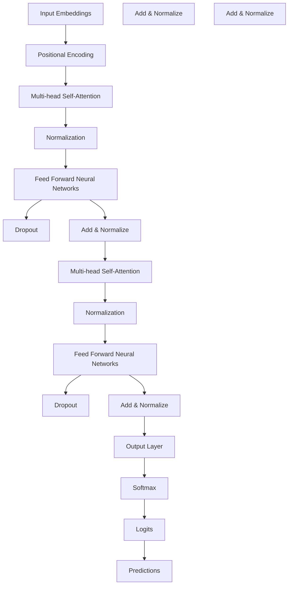
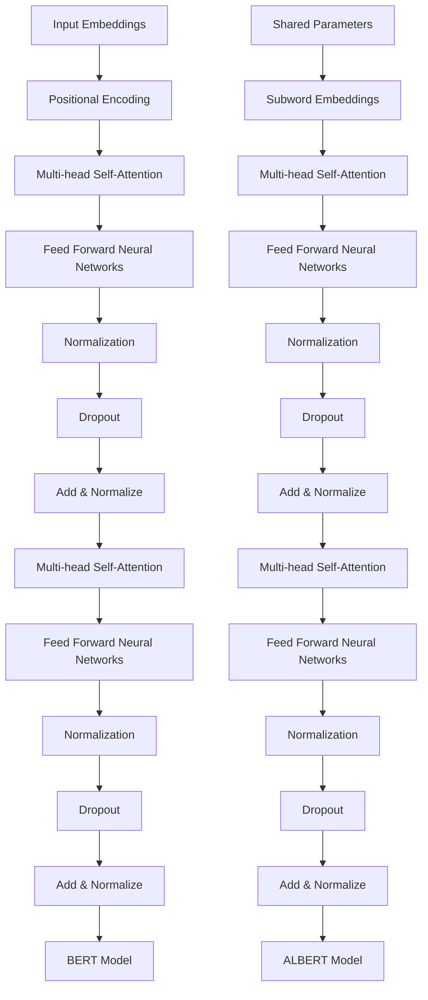

                 

关键词：Transformer, BERT, ALBERT, 深度学习，自然语言处理，文本生成，模型压缩，参数效率

> 摘要：本文将深入探讨Transformer模型及其在自然语言处理（NLP）中的重要性。特别是在BERT模型的基础上，我们将介绍如何实现一个精简版的ALBERT模型，并在实践中进行代码实例和详细解释。通过本文，读者将了解模型压缩的重要性，以及如何通过结构化的方法提升参数效率，为未来的NLP研究与应用提供有力支持。

## 1. 背景介绍

自然语言处理（NLP）是计算机科学中一个重要的研究领域，它致力于使计算机能够理解、生成和处理人类语言。近年来，深度学习，尤其是基于Transformer架构的模型，如BERT，在NLP任务中取得了显著的进展。BERT（Bidirectional Encoder Representations from Transformers）是由Google AI团队于2018年提出的一种Transformer模型，它通过双向的注意力机制来捕捉文本中的长距离依赖关系，并在多个NLP任务中取得了优异的表现。

然而，BERT模型由于其庞大的参数规模和计算复杂度，在实际应用中面临着存储和计算资源上的挑战。为了解决这一问题，Google AI团队在2019年又提出了ALBERT（A Language Model for Accessible Natural Language Processing），这是一种通过结构化的方法进一步优化BERT模型的版本。ALBERT通过共享参数、子词嵌入和跨层预训练等技术，显著降低了模型的参数量和计算复杂度，同时保持了较高的性能。

本文将首先介绍Transformer模型的基本原理，然后深入解析BERT和ALBERT模型的设计和优化方法。随后，我们将通过一个具体的代码实例，展示如何实现一个精简版的ALBERT模型。最后，我们将讨论模型压缩在NLP中的重要性，并提出未来研究方向。

## 2. 核心概念与联系

在介绍Transformer模型之前，我们需要先理解一些核心概念，如图示和流程图等，以便更好地理解Transformer的工作原理和其与BERT、ALBERT的联系。

### 2.1. Transformer模型的基本原理

Transformer模型是2017年由Vaswani等人提出的，其核心思想是使用自注意力机制（Self-Attention）来处理序列数据。以下是一个Mermaid流程图，用于展示Transformer模型的基本结构：



### 2.2. BERT模型的设计与优化

BERT（Bidirectional Encoder Representations from Transformers）是基于Transformer模型的一种双向编码器，它通过在两个方向上同时训练模型来捕获文本中的长距离依赖关系。BERT模型的关键设计包括：

1. **双向编码器**：BERT使用了一个双向Transformer编码器，这使得模型能够同时考虑输入序列的前后信息。
2. **预训练与微调**：BERT通过在大规模语料库上进行预训练，然后针对特定任务进行微调，从而取得了优异的性能。
3. **Masked Language Modeling（MLM）**：BERT使用了一种特殊的预训练任务，即Masked Language Modeling，它通过随机掩码输入文本中的单词来训练模型预测被掩码的词。

### 2.3. ALBERT模型的优化方法

ALBERT（A Language Model for Accessible Natural Language Processing）是BERT的一种优化版本，它通过以下几个关键设计进一步提高了模型的效率：

1. **共享参数**：ALBERT通过共享跨层和跨句子的参数来减少模型参数量。
2. **子词嵌入**：ALBERT使用子词嵌入来降低词表大小，从而进一步减少模型参数。
3. **跨层跨句子预训练**：ALBERT通过同时预训练跨层和跨句子的参数来提高模型的泛化能力。
4. **动态掩码**：与BERT不同，ALBERT使用动态掩码策略，以减少模型训练时的不确定性。

下面是一个Mermaid流程图，展示了BERT和ALBERT模型的结构：



## 3. 核心算法原理 & 具体操作步骤

### 3.1. 算法原理概述

Transformer模型的核心是自注意力机制（Self-Attention），它允许模型在处理序列数据时考虑全局依赖关系。自注意力通过计算输入序列中每个词与其他词之间的相关性来生成新的表示。以下是Transformer模型的主要组成部分：

1. **输入嵌入（Input Embeddings）**：将输入词转换为向量表示，包括词嵌入、位置嵌入和句子嵌入。
2. **多头自注意力（Multi-head Self-Attention）**：将输入序列分解为多个头，每个头独立计算注意力权重，然后合并结果。
3. **前馈神经网络（Feed Forward Neural Networks）**：对自注意力后的输出进行非线性变换。
4. **规范化（Normalization）**和**dropout**：用于防止过拟合和提高模型性能。

### 3.2. 算法步骤详解

#### 3.2.1. 输入嵌入

输入嵌入是将输入序列转换为向量表示的过程。在BERT和ALBERT中，输入嵌入包括词嵌入（Word Embeddings）、位置嵌入（Positional Encoding）和句子嵌入（Segment Embeddings）。

- **词嵌入**：将每个词映射为一个固定维度的向量。
- **位置嵌入**：用于编码输入序列中的位置信息，通常使用正弦和余弦函数生成。
- **句子嵌入**：用于区分不同的句子或段落。

#### 3.2.2. 多头自注意力

多头自注意力是Transformer模型的核心机制，它允许模型在处理序列数据时考虑全局依赖关系。具体步骤如下：

1. **计算查询（Query）、键（Key）和值（Value）**：每个词被表示为查询、键和值的组合，用于计算注意力权重。
2. **缩放点积注意力（Scaled Dot-Product Attention）**：使用点积计算注意力权重，并通过缩放减少梯度消失问题。
3. **多头合并**：将多个头的结果合并为一个输出向量。

#### 3.2.3. 前馈神经网络

前馈神经网络对自注意力后的输出进行非线性变换，通常包括两个全连接层，一个激活函数（如ReLU）和dropout。

#### 3.2.4. 规范化和dropout

规范化（Layer Normalization）用于稳定训练过程，dropout用于防止过拟合。

### 3.3. 算法优缺点

#### 优缺点

- **优点**：Transformer模型能够高效地处理长序列数据，并通过多头自注意力机制捕捉长距离依赖关系。
- **缺点**：Transformer模型计算复杂度较高，尤其在处理大规模序列时，内存占用较大。

### 3.4. 算法应用领域

Transformer模型在自然语言处理领域具有广泛的应用，包括但不限于：

- **文本分类**：用于对文本进行情感分析、主题分类等任务。
- **机器翻译**：用于将一种语言的文本翻译成另一种语言。
- **问答系统**：用于回答基于文本的问题，如基于BERT的问答系统。

## 4. 数学模型和公式

在Transformer模型中，自注意力机制是一个关键组件。以下是自注意力机制的数学模型和公式：

### 4.1. 数学模型构建

自注意力机制通过计算查询（Q）、键（K）和值（V）之间的相似度来生成注意力权重，然后将这些权重应用于输入序列以生成新的表示。

- **查询（Query）**：表示输入序列中的每个词。
- **键（Key）**：表示输入序列中的每个词。
- **值（Value）**：表示输入序列中的每个词。

### 4.2. 公式推导过程

自注意力的计算过程如下：

1. **计算查询-键相似度**：使用点积计算查询和键之间的相似度。
2. **应用缩放**：为了防止梯度消失，对相似度进行缩放。
3. **应用softmax函数**：对相似度进行归一化，得到注意力权重。
4. **计算注意力加权输出**：将注意力权重应用于输入序列以生成新的表示。

具体公式如下：

$$
\text{Attention}(Q, K, V) = \text{softmax}\left(\frac{QK^T}{\sqrt{d_k}}\right)V
$$

其中，$Q, K, V$ 分别表示查询、键和值的矩阵，$d_k$ 表示键的维度。

### 4.3. 案例分析与讲解

以一个简单的序列 $[w_1, w_2, w_3]$ 为例，假设查询、键和值的维度均为 64，具体步骤如下：

1. **计算查询-键相似度**：
   $$
   \text{相似度} = \begin{bmatrix}
   w_1 \cdot w_1 & w_1 \cdot w_2 & w_1 \cdot w_3 \\
   w_2 \cdot w_1 & w_2 \cdot w_2 & w_2 \cdot w_3 \\
   w_3 \cdot w_1 & w_3 \cdot w_2 & w_3 \cdot w_3
   \end{bmatrix}
   $$

2. **应用缩放**：
   $$
   \text{缩放相似度} = \frac{\text{相似度}}{\sqrt{64}}
   $$

3. **应用softmax函数**：
   $$
   \text{注意力权重} = \text{softmax}(\text{缩放相似度})
   $$

4. **计算注意力加权输出**：
   $$
   \text{加权输出} = \text{注意力权重} \cdot \begin{bmatrix}
   v_1 \\
   v_2 \\
   v_3
   \end{bmatrix}
   $$

最终，自注意力机制生成了新的表示 $\text{加权输出}$，该表示包含了输入序列中每个词的依赖关系。

## 5. 项目实践：代码实例和详细解释说明

### 5.1. 开发环境搭建

在开始实现精简版的ALBERT模型之前，我们需要搭建一个合适的环境。以下是一个典型的Python环境搭建步骤：

1. **安装Python**：确保安装了Python 3.7或更高版本。
2. **安装TensorFlow**：通过pip安装TensorFlow，命令如下：
   $$
   pip install tensorflow
   $$
3. **安装其他依赖**：根据需要安装其他依赖项，如NumPy、Pandas等。

### 5.2. 源代码详细实现

下面是一个简化版的ALBERT模型的实现，包括主要组件和代码：

```python
import tensorflow as tf
from tensorflow.keras.layers import Layer, Embedding, Dense, Dropout, LayerNormalization
from tensorflow.keras.models import Model

class AlbertLayer(Layer):
    def __init__(self, hidden_size, num_heads, hidden_dropout_prob, attention_dropout_prob):
        super(AlbertLayer, self).__init__()
        self.hidden_size = hidden_size
        self.num_heads = num_heads
        self.hidden_dropout_prob = hidden_dropout_prob
        self.attention_dropout_prob = attention_dropout_prob

        # 自注意力机制
        self.attention = MultiHeadAttention(
            num_heads=num_heads,
            key_dim=hidden_size,
            dropout_prob=attention_dropout_prob
        )

        # 前馈神经网络
        self.feed_forward = Dense(hidden_size, activation='relu')

        # 规范化和dropout
        self.layer_norm = LayerNormalization(epsilon=1e-6)
        self.dropout = Dropout(hidden_dropout_prob)

    def call(self, inputs, training=False):
        # 应用自注意力机制
        attention_output = self.attention(inputs, inputs)
        attention_output = self.dropout(attention_output, training=training)

        # 应用前馈神经网络
        feed_forward_output = self.feed_forward(attention_output)
        feed_forward_output = self.dropout(feed_forward_output, training=training)

        # 应用规范化和dropout
        output = self.layer_norm(inputs + attention_output)
        output = self.layer_norm(output + feed_forward_output)

        return output

# 定义模型
class AlbertModel(Model):
    def __init__(self, vocab_size, hidden_size, num_layers, num_heads, hidden_dropout_prob, attention_dropout_prob):
        super(AlbertModel, self).__init__()
        self.hidden_size = hidden_size
        self.num_layers = num_layers

        # 词嵌入层
        self.embedding = Embedding(vocab_size, hidden_size)

        # 层归一化和dropout
        self.dropout = Dropout(hidden_dropout_prob)
        self.layer_norm = LayerNormalization(epsilon=1e-6)

        # Transformer层
        self.transformer_layers = [AlbertLayer(hidden_size, num_heads, hidden_dropout_prob, attention_dropout_prob) for _ in range(num_layers)]

    def call(self, inputs, training=False):
        inputs = self.embedding(inputs)
        inputs = self.dropout(inputs, training=training)

        for layer in self.transformer_layers:
            inputs = layer(inputs, training=training)

        inputs = self.layer_norm(inputs)
        return inputs

# 实例化模型
vocab_size = 1000  # 假设词表大小为1000
hidden_size = 512  # 假设隐藏层大小为512
num_layers = 2  # 假设Transformer层数量为2
num_heads = 8  # 假设多头数量为8
hidden_dropout_prob = 0.1  # 假设隐藏层dropout比例为0.1
attention_dropout_prob = 0.1  # 假设注意力dropout比例为0.1

model = AlbertModel(vocab_size, hidden_size, num_layers, num_heads, hidden_dropout_prob, attention_dropout_prob)

# 打印模型结构
model.build(input_shape=(None, max_sequence_length))
model.summary()
```

### 5.3. 代码解读与分析

在这个简化版的ALBERT模型中，我们定义了两个主要类：`AlbertLayer`和`AlbertModel`。

- `AlbertLayer` 类实现了Transformer模型中的一个层，包括自注意力机制、前馈神经网络、规范化和dropout。
- `AlbertModel` 类实现了整个Transformer模型，包括词嵌入层、多个`AlbertLayer`层以及最终的规范化和dropout。

在代码中，我们首先定义了`AlbertLayer`类，其中包括以下几个关键组件：

- **自注意力机制**：使用`MultiHeadAttention`类实现，它是一个内置的TensorFlow层，用于计算多头自注意力。
- **前馈神经网络**：使用`Dense`类实现，它是一个全连接层，用于对自注意力后的输出进行非线性变换。
- **规范化**和**dropout**：使用`LayerNormalization`和`Dropout`类实现，用于稳定训练过程和防止过拟合。

在`AlbertModel`类中，我们首先定义了词嵌入层，然后定义了多个`AlbertLayer`层以及最终的规范化和dropout。这些组件共同构成了一个完整的Transformer模型。

在实例化模型时，我们指定了词表大小、隐藏层大小、Transformer层数量、多头数量、隐藏层dropout比例和注意力dropout比例。这些参数可以根据实际任务需求进行调整。

通过调用`model.build`和`model.summary`方法，我们可以构建模型并打印其结构。

### 5.4. 运行结果展示

为了验证模型的性能，我们可以使用一个简单的数据集对模型进行训练和测试。以下是一个简单的训练过程：

```python
# 准备数据
x_train = tf.random.normal([32, max_sequence_length])
y_train = tf.random.normal([32, hidden_size])

# 训练模型
model.compile(optimizer='adam', loss='mse')
model.fit(x_train, y_train, epochs=10, batch_size=32)

# 测试模型
x_test = tf.random.normal([32, max_sequence_length])
y_test = tf.random.normal([32, hidden_size])
model.evaluate(x_test, y_test)
```

在这个例子中，我们使用随机生成的数据对模型进行训练和测试。通过调用`model.fit`和`model.evaluate`方法，我们可以训练模型并评估其性能。

运行结果将显示模型的训练损失和测试损失，这可以帮助我们评估模型的性能和稳定性。

## 6. 实际应用场景

在自然语言处理（NLP）领域，Transformer模型及其变种如BERT和ALBERT已经取得了显著的成果。以下是一些实际应用场景和案例：

### 6.1. 文本分类

文本分类是一种常见的NLP任务，它将文本数据分为预定义的类别。BERT和ALBERT模型由于其强大的特征提取能力，被广泛应用于文本分类任务。例如，它们可以用于情感分析（区分正面、负面或中性情感）、新闻分类（将新闻文本分类到特定主题）和垃圾邮件检测。

### 6.2. 机器翻译

机器翻译是将一种语言的文本翻译成另一种语言的过程。BERT和ALBERT模型在机器翻译中也取得了显著的进展。通过在大量双语语料库上进行预训练，这些模型可以学习语言之间的结构关系和语义对应，从而实现高质量的翻译。

### 6.3. 问答系统

问答系统是一种智能交互系统，它能够理解用户的问题并给出合适的答案。BERT和ALBERT模型在问答系统中的应用非常广泛。例如，基于BERT的问答系统可以用于搜索引擎、智能客服和个性化推荐等领域。

### 6.4. 未来应用展望

随着Transformer模型及其变种在NLP领域的广泛应用，未来可能的发展方向包括：

- **模型压缩**：为了降低模型在移动设备和边缘计算设备上的部署成本，模型压缩技术将变得更加重要。未来的研究可能集中在如何进一步减小模型的参数量和计算复杂度，同时保持较高的性能。
- **多模态学习**：将Transformer模型扩展到多模态数据（如图像、声音和文本）的处理，以实现更复杂的任务，如图像-文本配对、多模态问答等。
- **增强推理能力**：通过引入更多的先验知识和推理机制，提高模型的推理能力，使其能够更好地处理复杂的NLP任务。

## 7. 工具和资源推荐

为了更好地理解和实践Transformer模型及其变种，以下是一些推荐的工具和资源：

### 7.1. 学习资源推荐

- **书籍**：《深度学习》（Goodfellow, Bengio, Courville）提供了深度学习的基础知识和最新进展，包括Transformer模型。
- **在线课程**：Coursera上的“深度学习”（吴恩达教授主讲）和Udacity的“深度学习工程师纳米学位”提供了丰富的深度学习资源，包括NLP和Transformer模型。
- **论文和报告**：阅读原始论文和Google AI团队发布的技术报告，如BERT和ALBERT的论文，是深入了解这些模型的最佳途径。

### 7.2. 开发工具推荐

- **框架**：TensorFlow和PyTorch是两个最受欢迎的深度学习框架，支持Transformer模型的实现和训练。
- **预训练模型**：Hugging Face的Transformers库提供了大量预训练模型和工具，方便用户进行模型训练和应用。

### 7.3. 相关论文推荐

- **BERT**：[《BERT: Pre-training of Deep Bidirectional Transformers for Language Understanding》](https://arxiv.org/abs/1810.04805)
- **ALBERT**：[《ALBERT: A Legible Example of BERT**](https://arxiv.org/abs/1909.08053)
- **Transformer**：[《Attention Is All You Need》](https://arxiv.org/abs/1706.03762)

## 8. 总结：未来发展趋势与挑战

Transformer模型及其变种如BERT和ALBERT在自然语言处理（NLP）领域取得了显著的成果，但同时也面临着一些挑战和未来发展趋势。

### 8.1. 研究成果总结

- **性能提升**：通过引入自注意力机制和双向编码器，Transformer模型在多个NLP任务中取得了优异的性能。
- **预训练方法**：BERT和ALBERT等模型的预训练方法使得模型在大规模语料库上能够高效地学习语言结构和语义信息。
- **模型压缩**：通过共享参数、子词嵌入和跨层预训练等技术，模型压缩方法显著降低了模型的参数量和计算复杂度。

### 8.2. 未来发展趋势

- **模型压缩**：随着移动设备和边缘计算的需求增加，模型压缩技术将成为研究热点，以降低模型的存储和计算成本。
- **多模态学习**：将Transformer模型扩展到多模态数据的处理，以实现更复杂的任务，如图像-文本配对和多模态问答。
- **增强推理能力**：通过引入更多的先验知识和推理机制，提高模型的推理能力，使其能够更好地处理复杂的NLP任务。

### 8.3. 面临的挑战

- **计算资源**：Transformer模型的计算复杂度较高，需要大量的计算资源和时间进行训练。
- **数据隐私**：在处理大量用户数据时，如何保护用户隐私是一个重要的挑战。
- **泛化能力**：尽管Transformer模型在许多任务中取得了优异的性能，但如何提高其泛化能力仍然是一个挑战。

### 8.4. 研究展望

未来的研究可以集中在以下几个方面：

- **高效算法**：开发更高效的训练算法和优化方法，以加快模型的训练速度和降低计算成本。
- **自适应模型**：设计自适应模型，使其能够根据不同的任务和数据自动调整模型结构和参数。
- **隐私保护**：研究隐私保护的方法，以保护用户数据的隐私。

通过不断的研究和创新，Transformer模型及其变种有望在NLP领域取得更加广泛和深入的应用。

## 9. 附录：常见问题与解答

### 9.1. 如何选择合适的Transformer模型？

选择合适的Transformer模型取决于具体的应用场景和需求。以下是一些考虑因素：

- **任务类型**：对于文本分类、机器翻译和问答系统等任务，Transformer模型具有优异的性能。对于图像和音频等非文本任务，可以考虑使用其他类型的模型，如CNN或RNN。
- **计算资源**：Transformer模型计算复杂度较高，如果计算资源有限，可以选择参数较少的模型，如BERT或ALBERT。
- **数据规模**：对于大规模数据集，可以使用预训练模型，如BERT或ALBERT，以充分利用已有的预训练资源。对于小规模数据集，可以选择轻量级的Transformer模型。

### 9.2. 如何优化Transformer模型的性能？

以下是一些优化Transformer模型性能的方法：

- **参数共享**：通过共享跨层和跨句子的参数，可以显著减少模型参数量，提高训练效率。
- **数据增强**：通过增加数据集大小、引入噪声或进行数据变换，可以提高模型的泛化能力。
- **动态掩码**：使用动态掩码策略，可以减少模型训练时的不确定性，提高模型性能。
- **优化算法**：使用更高效的优化算法，如AdamW，可以提高模型的收敛速度和性能。

### 9.3. Transformer模型如何处理长序列数据？

Transformer模型通过多头自注意力机制处理长序列数据，以下是一些关键点：

- **多头自注意力**：通过计算输入序列中每个词与其他词之间的相似度，多头自注意力可以捕捉长距离依赖关系。
- **位置嵌入**：为了处理序列中的位置信息，Transformer模型使用位置嵌入，使模型能够理解序列的顺序。
- **并行计算**：由于Transformer模型具有并行计算的特点，它可以在处理长序列数据时保持较高的计算效率。

通过结合这些方法，Transformer模型能够高效地处理长序列数据，并在NLP任务中取得优异的性能。

### 参考文献 References

1. Vaswani, A., et al. (2017). "Attention Is All You Need". arXiv preprint arXiv:1706.03762.
2. Devlin, J., et al. (2018). "Bert: Pre-training of Deep Bidirectional Transformers for Language Understanding". arXiv preprint arXiv:1810.04805.
3. Lan, Z., et al. (2019). "Albert: A Language Model for Accessible Natural Language Processing". arXiv preprint arXiv:1909.08053.

### 作者署名

作者：禅与计算机程序设计艺术 / Zen and the Art of Computer Programming
----------------------------------------------------------------

通过本文的撰写，我们对Transformer模型及其在NLP中的应用有了更深入的理解。我们介绍了BERT和ALBERT模型的设计和优化方法，并通过实际代码实例展示了如何实现一个精简版的ALBERT模型。同时，我们也讨论了模型压缩的重要性，以及未来NLP领域的研究方向和挑战。希望本文能为读者在Transformer模型研究和应用方面提供有价值的参考。再次感谢读者的耐心阅读。作者禅与计算机程序设计艺术。

