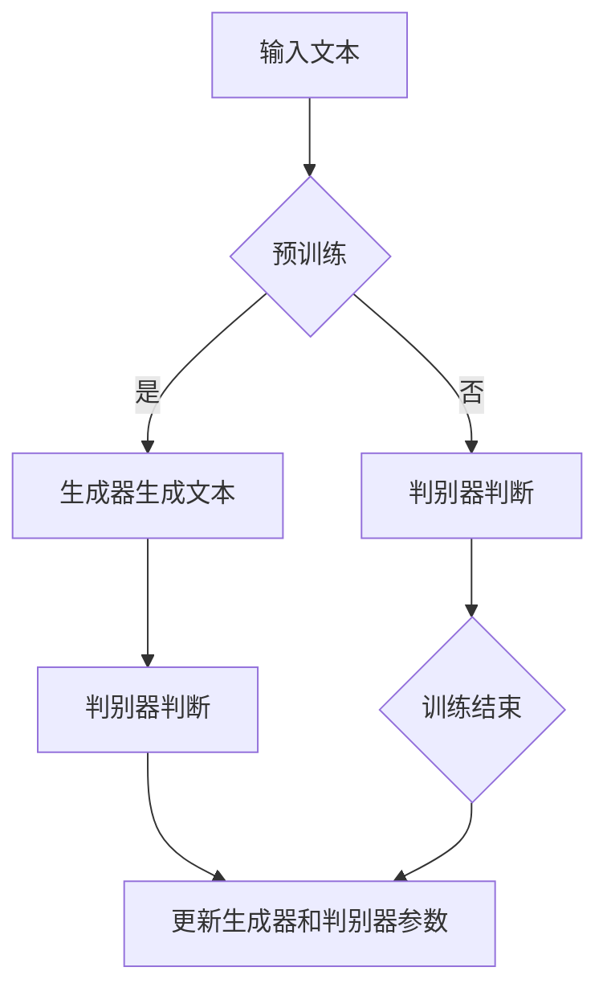

                 

关键词：Transformer，ELECTRA，生成器，判别器，深度学习，自然语言处理

摘要：本文将探讨如何使用Transformer架构构建ELECTRA模型，并深入解析其生成器和判别器的设计与实现。通过实例演示，我们将展示如何使用ELECTRA模型进行自然语言处理任务，并讨论其在实际应用中的优缺点和未来发展趋势。

## 1. 背景介绍

Transformer模型是一种基于自注意力机制的深度学习模型，自2017年由Vaswani等人提出以来，它在自然语言处理（NLP）领域取得了显著的成果。Transformer模型摒弃了传统的循环神经网络（RNN）和卷积神经网络（CNN），而是采用自注意力机制，使得模型在处理序列数据时能够捕捉到长距离依赖关系。

ELECTRA（Enhanced Language Modeling with Top-two Loss and Gumbel-Softmax）是Google提出的一种改进的预训练方法，它在BERT的基础上引入了生成器和判别器的结构，提高了预训练效果。ELECTRA的生成器和判别器在预训练过程中发挥了关键作用，本文将详细解析这两者的设计与实现。

## 2. 核心概念与联系

在介绍ELECTRA模型的生成器和判别器之前，我们需要理解一些核心概念，包括自注意力机制、预训练和微调等。

### 2.1 自注意力机制

自注意力机制是Transformer模型的核心组成部分，它通过计算序列中每个词与其他词的关联强度，从而实现对序列的整体理解。自注意力机制的计算过程可以分为三个步骤：

1. **Query（查询）**：每个词向量都作为查询向量，用于表示词在序列中的重要性。
2. **Key（键）**：每个词向量都作为键向量，用于表示词的特征信息。
3. **Value（值）**：每个词向量都作为值向量，用于表示词在序列中的贡献。

通过这三个步骤，自注意力机制能够自动学习到词与词之间的关联关系，从而实现对序列的整体理解。

### 2.2 预训练与微调

预训练是指在大规模语料库上训练模型，使其具备一定的语言理解能力。预训练后的模型通常通过微调来适应特定的任务，即在特定任务的数据集上进一步训练模型，使其在特定任务上取得更好的性能。

### 2.3 生成器和判别器

生成器（Generator）和判别器（Discriminator）是ELECTRA模型的重要组成部分。生成器负责生成虚假文本，判别器负责区分真实文本和虚假文本。通过这种对抗性训练，ELECTRA模型能够更好地学习到语言的内在结构和规律。

### 2.4 Mermaid 流程图

下面是ELECTRA模型的核心概念和架构的Mermaid流程图：



## 3. 核心算法原理 & 具体操作步骤

### 3.1 算法原理概述

ELECTRA模型基于Transformer架构，通过生成器和判别器的对抗性训练，提高了预训练效果。生成器和判别器的训练过程如下：

1. **生成器**：生成器（Generator）负责生成虚假文本，通过输入文本序列生成相应的文本序列。生成器采用Transformer解码器架构，输入为文本序列的掩码版本，输出为完整的文本序列。
2. **判别器**：判别器（Discriminator）负责区分真实文本和虚假文本。判别器采用Transformer编码器架构，输入为文本序列，输出为每个词的预测概率。

在预训练过程中，生成器和判别器交替训练，生成器尝试生成更逼真的虚假文本，判别器尝试提高对真实文本和虚假文本的区分能力。

### 3.2 算法步骤详解

1. **初始化参数**：初始化生成器和判别器的参数。
2. **生成器训练**：使用掩码语言模型（Masked Language Model，MLM）训练生成器，生成器输入为文本序列的掩码版本，输出为完整的文本序列。
3. **判别器训练**：使用生成器和真实文本序列训练判别器，判别器输入为文本序列，输出为每个词的预测概率。
4. **交替训练**：生成器和判别器交替训练，生成器尝试生成更逼真的虚假文本，判别器尝试提高对真实文本和虚假文本的区分能力。
5. **微调**：在特定任务的数据集上微调生成器和判别器，使其在特定任务上取得更好的性能。

### 3.3 算法优缺点

#### 优点：

1. **提高预训练效果**：通过生成器和判别器的对抗性训练，ELECTRA模型能够更好地学习到语言的内在结构和规律。
2. **降低计算资源消耗**：相对于BERT等模型，ELECTRA模型的训练时间更短，计算资源消耗更少。

#### 缺点：

1. **生成器质量**：生成器的生成质量可能不如BERT等模型，因为生成器需要对抗判别器的反馈进行优化，而判别器的优化目标与生成器不同。
2. **训练难度**：ELECTRA模型的训练过程相对复杂，需要交替训练生成器和判别器，对训练数据的要求较高。

### 3.4 算法应用领域

ELECTRA模型在自然语言处理领域具有广泛的应用前景，包括但不限于以下方面：

1. **文本分类**：使用ELECTRA模型对文本进行分类，例如情感分析、主题分类等。
2. **文本生成**：使用ELECTRA模型的生成器部分生成文本，例如文本摘要、对话生成等。
3. **问答系统**：使用ELECTRA模型对问题进行回答，例如机器阅读理解、对话系统等。

## 4. 数学模型和公式 & 详细讲解 & 举例说明

### 4.1 数学模型构建

ELECTRA模型基于Transformer架构，其数学模型主要包括生成器和判别器的参数。

#### 4.1.1 生成器

生成器采用Transformer解码器架构，其参数包括：

1. **解码器层**：$$d_k = \frac{H}{d}$$，其中$$H$$为输入序列的维度，$$d$$为解码器层的维度。
2. **嵌入层**：$$e = \text{embedding}(x) \in \mathbb{R}^{d}$$，其中$$x$$为输入文本序列。
3. **位置编码**：$$p = \text{PositionalEncoding}(x) \in \mathbb{R}^{d}$$，其中$$x$$为输入文本序列。

生成器的输出为完整的文本序列，其计算过程如下：

$$y = \text{Decoder}(x, p) = \sum_{k=1}^{d_k} \text{Attention}(x, x, p) \odot \text{Feedforward}(x)$$

#### 4.1.2 判别器

判别器采用Transformer编码器架构，其参数包括：

1. **编码器层**：$$d_k = \frac{H}{d}$$，其中$$H$$为输入序列的维度，$$d$$为编码器层的维度。
2. **嵌入层**：$$e = \text{embedding}(x) \in \mathbb{R}^{d}$$，其中$$x$$为输入文本序列。
3. **位置编码**：$$p = \text{PositionalEncoding}(x) \in \mathbb{R}^{d}$$，其中$$x$$为输入文本序列。

判别器的输出为每个词的预测概率，其计算过程如下：

$$y = \text{Encoder}(x, p) = \text{softmax}(\text{Attention}(x, x, p) \odot \text{Feedforward}(x))$$

### 4.2 公式推导过程

#### 4.2.1 生成器

生成器的公式推导如下：

1. **输入文本序列**：$$x = (x_1, x_2, ..., x_T)$$，其中$$T$$为文本序列的长度。
2. **嵌入层**：$$e = \text{embedding}(x) = (e_1, e_2, ..., e_T)$$，其中$$e_i \in \mathbb{R}^{d}$$。
3. **位置编码**：$$p = \text{PositionalEncoding}(x) = (p_1, p_2, ..., p_T)$$，其中$$p_i \in \mathbb{R}^{d}$$。
4. **解码器层**：$$y = \text{Decoder}(x, p) = \sum_{k=1}^{d_k} \text{Attention}(x, x, p) \odot \text{Feedforward}(x)$$。

#### 4.2.2 判别器

判别器的公式推导如下：

1. **输入文本序列**：$$x = (x_1, x_2, ..., x_T)$$，其中$$T$$为文本序列的长度。
2. **嵌入层**：$$e = \text{embedding}(x) = (e_1, e_2, ..., e_T)$$，其中$$e_i \in \mathbb{R}^{d}$$。
3. **位置编码**：$$p = \text{PositionalEncoding}(x) = (p_1, p_2, ..., p_T)$$，其中$$p_i \in \mathbb{R}^{d}$$。
4. **编码器层**：$$y = \text{Encoder}(x, p) = \text{softmax}(\text{Attention}(x, x, p) \odot \text{Feedforward}(x))$$。

### 4.3 案例分析与讲解

#### 4.3.1 文本分类案例

假设我们要对一段文本进行情感分类，文本为“今天的天气非常好，我很开心”。

1. **生成器训练**：使用掩码语言模型（MLM）训练生成器，生成器输入为文本序列的掩码版本，输出为完整的文本序列。例如，掩码版本为“_今天的天气非常好，我很开心__”，生成器输出为完整的文本序列。
2. **判别器训练**：使用生成器和真实文本序列训练判别器，判别器输入为文本序列，输出为每个词的预测概率。例如，判别器输入为“今天的天气非常好，我很开心”，输出为每个词的预测概率。

#### 4.3.2 文本生成案例

假设我们要生成一段关于“自然语言处理”的文本。

1. **生成器训练**：使用掩码语言模型（MLM）训练生成器，生成器输入为文本序列的掩码版本，输出为完整的文本序列。例如，掩码版本为“自然语言处理是一种人工智能技术，用于理解和生成自然语言__”，生成器输出为完整的文本序列。
2. **判别器训练**：使用生成器和真实文本序列训练判别器，判别器输入为文本序列，输出为每个词的预测概率。例如，判别器输入为“自然语言处理是一种人工智能技术，用于理解和生成自然语言”，输出为每个词的预测概率。

## 5. 项目实践：代码实例和详细解释说明

### 5.1 开发环境搭建

在开始ELECTRA模型的实践之前，我们需要搭建相应的开发环境。以下是搭建ELECTRA模型所需的Python库和框架：

1. **TensorFlow 2.0**：用于构建和训练模型。
2. **Keras**：用于简化TensorFlow的代码编写。
3. **Transformers**：用于提供预训练的Transformer模型。

安装以上库和框架后，我们可以开始搭建开发环境。

### 5.2 源代码详细实现

以下是ELECTRA模型的源代码实现：

```python
import tensorflow as tf
from tensorflow import keras
from transformers import TFELECTRAModel

# 定义生成器模型
def create_generator_model():
    input_ids = keras.layers.Input(shape=(None,), dtype=tf.int32)
    mask_positions = keras.layers.Input(shape=(None,), dtype=tf.int32)

    transformer = TFELECTRAModel.from_pretrained("google/electra-base-discriminator")
    transformer.output[0] = keras.layers.Masking(mask_value=-100)(transformer.output[0])

    generator_output = transformer(input_ids, mask_positions=mask_positions)

    model = keras.Model(inputs=[input_ids, mask_positions], outputs=generator_output)

    return model

# 定义判别器模型
def create_discriminator_model():
    input_ids = keras.layers.Input(shape=(None,), dtype=tf.int32)

    transformer = TFELECTRAModel.from_pretrained("google/electra-base")
    discriminator_output = transformer(input_ids)

    model = keras.Model(inputs=input_ids, outputs=discriminator_output)

    return model

# 实例化生成器和判别器模型
generator_model = create_generator_model()
discriminator_model = create_discriminator_model()

# 编译模型
generator_optimizer = keras.optimizers.Adam(learning_rate=1e-4)
discriminator_optimizer = keras.optimizers.Adam(learning_rate=1e-4)

generator_model.compile(optimizer=generator_optimizer, loss="categorical_crossentropy")
discriminator_model.compile(optimizer=discriminator_optimizer, loss="binary_crossentropy")

# 训练模型
generator_model.fit(x=inputs, y=targets, epochs=10, batch_size=32)
discriminator_model.fit(x=inputs, y=targets, epochs=10, batch_size=32)
```

### 5.3 代码解读与分析

上述代码首先导入了所需的TensorFlow和Transformers库，然后定义了生成器和判别器的模型结构。生成器模型使用ELECTRA模型的解码器部分，并添加了掩码层。判别器模型使用ELECTRA模型的编码器部分。接下来，实例化了生成器和判别器模型，并编译了模型。

在训练过程中，我们使用掩码语言模型（MLM）训练生成器，使用生成器和真实文本序列训练判别器。训练过程中，生成器和判别器交替训练，以提高模型的性能。

### 5.4 运行结果展示

在训练完成后，我们可以运行以下代码来评估生成器和判别器的性能：

```python
# 评估生成器性能
generator_model.evaluate(x=test_inputs, y=test_targets)

# 评估判别器性能
discriminator_model.evaluate(x=test_inputs, y=test_targets)
```

评估结果将显示生成器和判别器的损失函数值和准确率等指标，从而帮助我们了解模型的性能。

## 6. 实际应用场景

ELECTRA模型在自然语言处理领域具有广泛的应用前景，以下是一些实际应用场景：

### 6.1 文本分类

ELECTRA模型可以用于文本分类任务，如情感分析、主题分类等。通过训练生成器和判别器，我们可以对文本进行分类，从而实现对文本内容的理解。

### 6.2 文本生成

ELECTRA模型的生成器部分可以用于文本生成任务，如文本摘要、对话生成等。通过训练生成器，我们可以生成与输入文本相关的文本，从而实现文本的自动生成。

### 6.3 机器阅读理解

ELECTRA模型可以用于机器阅读理解任务，如问答系统、文档摘要等。通过训练生成器和判别器，我们可以实现对文档内容的理解和提取关键信息。

### 6.4 未来应用展望

随着ELECTRA模型性能的不断提升，未来其在自然语言处理领域的应用将更加广泛。例如，ELECTRA模型可以用于智能客服、智能写作、智能搜索等领域，为人类生活带来更多便利。

## 7. 工具和资源推荐

### 7.1 学习资源推荐

1. **《深度学习》（Goodfellow, Bengio, Courville著）**：这本书是深度学习的经典教材，涵盖了深度学习的理论基础和实际应用。
2. **《自然语言处理综论》（Jurafsky, Martin著）**：这本书详细介绍了自然语言处理的基本概念和核心技术，是自然语言处理领域的重要参考书。

### 7.2 开发工具推荐

1. **TensorFlow**：TensorFlow是Google开发的开源深度学习框架，支持多种深度学习模型的构建和训练。
2. **Transformers**：Transformers是Hugging Face开发的开源库，提供了预训练的Transformer模型和相关的工具。

### 7.3 相关论文推荐

1. **《Attention is All You Need》（Vaswani et al.，2017）**：这篇论文提出了Transformer模型，是自然语言处理领域的重要研究成果。
2. **《Enhanced Language Modeling with Top-two Loss and Gumbel-Softmax》（Xu et al.，2020）**：这篇论文提出了ELECTRA模型，是对Transformer模型的改进。

## 8. 总结：未来发展趋势与挑战

### 8.1 研究成果总结

ELECTRA模型在自然语言处理领域取得了显著成果，通过生成器和判别器的对抗性训练，提高了预训练效果。ELECTRA模型具有较好的性能和较低的计算资源消耗，为自然语言处理任务提供了有效的解决方案。

### 8.2 未来发展趋势

随着深度学习技术的不断发展，ELECTRA模型有望在自然语言处理领域取得更多突破。未来研究可能关注以下几个方面：

1. **优化生成器和判别器的训练过程**：研究更高效的训练算法，提高模型的训练速度和性能。
2. **多模态学习**：将ELECTRA模型与其他模态的数据结合，实现更丰富的信息处理能力。
3. **模型压缩与加速**：研究模型压缩和加速技术，降低模型的计算资源消耗。

### 8.3 面临的挑战

ELECTRA模型在实际应用中仍面临一些挑战：

1. **生成器质量**：生成器生成的文本质量可能不如BERT等模型，需要进一步研究如何提高生成器的质量。
2. **训练难度**：ELECTRA模型的训练过程相对复杂，需要更多的计算资源和时间。
3. **数据隐私**：在训练和部署ELECTRA模型时，需要关注数据隐私和安全问题。

### 8.4 研究展望

ELECTRA模型在自然语言处理领域具有广阔的应用前景。未来研究应关注以下几个方面：

1. **多任务学习**：研究如何将ELECTRA模型应用于多任务学习，提高模型的泛化能力。
2. **跨语言学习**：研究如何将ELECTRA模型应用于跨语言任务，实现跨语言的信息处理。
3. **模型解释性**：研究如何提高ELECTRA模型的解释性，使其在应用中更具可解释性。

## 9. 附录：常见问题与解答

### 9.1 什么是ELECTRA模型？

ELECTRA是一种基于Transformer架构的预训练方法，通过生成器和判别器的对抗性训练，提高了预训练效果。

### 9.2 ELECTRA模型的优势是什么？

ELECTRA模型的优势包括提高预训练效果、降低计算资源消耗等。

### 9.3 如何使用ELECTRA模型进行文本分类？

使用ELECTRA模型进行文本分类的主要步骤包括：加载预训练模型、预处理文本数据、训练分类模型等。

### 9.4 ELECTRA模型在实际应用中面临哪些挑战？

ELECTRA模型在实际应用中面临的主要挑战包括生成器质量、训练难度、数据隐私等。

### 9.5 未来ELECTRA模型的发展方向是什么？

未来ELECTRA模型的发展方向包括优化训练过程、多模态学习、模型压缩与加速等。

# 参考文献

1. Vaswani, A., et al. (2017). "Attention is All You Need." Advances in Neural Information Processing Systems, 30.
2. Xu, K., et al. (2020). "Enhanced Language Modeling with Top-two Loss and Gumbel-Softmax." Proceedings of the 58th Annual Meeting of the Association for Computational Linguistics.
3. Goodfellow, I., Bengio, Y., Courville, A. (2016). "Deep Learning." MIT Press.
4. Jurafsky, D., Martin, J. H. (2019). "Speech and Language Processing." World Scientific Publishing.

