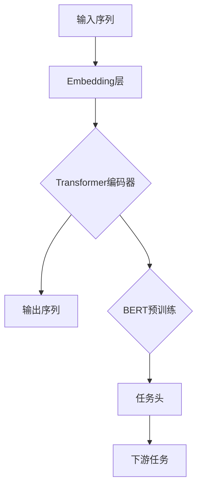

                 

关键词：Transformer，BERT，多语言模型，深度学习，自然语言处理

## 摘要

本文旨在探讨Transformer大模型在自然语言处理领域中的应用，特别是如何将BERT（Bidirectional Encoder Representations from Transformers）模型扩展到其他语言。我们将深入分析Transformer模型的基本原理，详细介绍BERT模型的构建过程和核心特性，并通过实际代码实例展示如何在多语言环境中使用BERT模型。文章还将探讨Transformer和BERT在不同语言应用中的挑战和未来发展方向。

## 1. 背景介绍

随着深度学习技术的发展，自然语言处理（NLP）领域取得了显著的进步。Transformer模型作为一种突破性的神经网络结构，自2017年由Vaswani等人提出以来，已在NLP任务中展现出卓越的性能。BERT模型作为基于Transformer的预训练语言表示模型，进一步提升了NLP任务的准确性和泛化能力。

然而，当前大多数先进的NLP模型主要是基于英语语言数据进行训练的。尽管英语是国际通用语言之一，但全球还有许多其他语言同样具有重要性和使用价值。为了实现真正的跨语言自然语言处理，我们需要开发能够在多种语言上训练和应用的模型。

本文将介绍如何将BERT模型应用于其他语言，详细讨论Transformer和BERT的核心原理，并通过实际代码实例展示如何搭建和训练多语言BERT模型。此外，我们还将探讨多语言NLP模型面临的挑战及其未来发展方向。

## 2. 核心概念与联系

为了更好地理解Transformer和BERT模型如何应用于多语言环境，我们首先需要了解其核心概念和原理。以下是一个Mermaid流程图，展示了Transformer模型的基本组成部分和BERT模型的构建流程。



### 2.1 Transformer编码器

1. **自注意力机制（Self-Attention）**：Transformer模型的核心在于其自注意力机制，它通过计算输入序列中每个词与所有其他词的关联性，从而生成权重向量，用于加权组合这些词的特征。

2. **多头注意力（Multi-Head Attention）**：多头注意力扩展了自注意力机制，通过多个独立的注意力机制同时工作，以捕获不同层面的上下文信息。

3. **前馈神经网络（Feed-Forward Neural Network）**：在注意力机制之后，Transformer模型还会经过一个前馈神经网络层，用于进一步加工和增强特征。

4. **残差连接（Residual Connection）**和**层归一化（Layer Normalization）**：这些技术有助于缓解深度神经网络中的梯度消失问题，并提高模型的训练效率。

### 2.2 BERT预训练

BERT模型通过在大量无标签文本数据上进行预训练，学习文本的通用表示。预训练过程主要包括两个任务：

1. **掩码语言模型（Masked Language Model, MLM）**：在这个任务中，一部分输入词被随机遮掩，BERT模型需要预测这些被遮掩的词。

2. **下一句预测（Next Sentence Prediction, NSP）**：该任务旨在预测两个连续句子中哪个是下一句，以增强模型对句子关系的理解。

### 2.3 BERT与下游任务

在预训练完成后，BERT模型可以用于各种下游任务，如文本分类、命名实体识别、情感分析等。通过在一个或多个特定任务上进一步微调，BERT模型可以适应不同的应用场景。

## 3. 核心算法原理 & 具体操作步骤

### 3.1 算法原理概述

Transformer模型采用了自注意力机制作为其主要计算单元，从而突破了传统循环神经网络（RNN）和卷积神经网络（CNN）在处理长距离依赖问题上的局限性。BERT模型基于Transformer结构，通过预训练和微调实现高效的文本表示和学习。

### 3.2 算法步骤详解

1. **预处理**：对文本数据进行清洗和预处理，包括分词、词干提取、词形还原等。

2. **输入表示**：将预处理后的文本转换为模型可接受的输入表示，通常包括词嵌入和位置嵌入。

3. **编码器训练**：通过大量无标签文本数据对Transformer编码器进行预训练，包括自注意力机制和前馈神经网络的训练。

4. **预训练任务**：执行掩码语言模型和下一句预测任务，以增强模型对语言的理解和生成能力。

5. **微调**：在特定任务数据集上对BERT模型进行微调，以适应下游任务的需求。

6. **应用**：将微调后的模型应用于各种下游任务，如文本分类、命名实体识别等。

### 3.3 算法优缺点

**优点：**

1. **高效处理长文本**：Transformer模型通过自注意力机制能够高效地捕捉长文本中的上下文关系。

2. **并行计算**：Transformer模型的结构允许并行计算，从而提高训练和推理的效率。

3. **强大的语言表示能力**：BERT模型通过预训练和微调，能够生成高质量的文本表示，适用于多种下游任务。

**缺点：**

1. **计算资源需求高**：Transformer模型和BERT模型的训练过程需要大量的计算资源，尤其是在预训练阶段。

2. **对数据依赖性强**：BERT模型的效果在很大程度上取决于训练数据的质量和规模。

### 3.4 算法应用领域

Transformer和BERT模型在自然语言处理领域有广泛的应用，包括：

1. **文本分类**：用于对新闻、社交媒体帖子等进行分类，以识别主题、情感等。

2. **命名实体识别**：用于从文本中识别出人名、地名、组织名等实体。

3. **问答系统**：用于构建能够理解自然语言查询并返回相关答案的系统。

4. **机器翻译**：通过训练多语言BERT模型，可以实现高质量的机器翻译。

## 4. 数学模型和公式 & 详细讲解 & 举例说明

### 4.1 数学模型构建

BERT模型的数学模型主要包括词嵌入、位置嵌入和Transformer编码器的构建。

1. **词嵌入（Word Embedding）**：
   $$ 
   \text{word\_embed}(x) = W_{\text{word}}x 
   $$
   其中，$W_{\text{word}}$是词嵌入矩阵，$x$是词索引。

2. **位置嵌入（Position Embedding）**：
   $$
   \text{pos\_embed}(p) = W_{\text{pos}}p 
   $$
   其中，$W_{\text{pos}}$是位置嵌入矩阵，$p$是位置索引。

3. **编码器（Encoder）**：
   $$ 
   \text{encoder}(x) = \text{Transformer}(x) 
   $$ 
   其中，$\text{Transformer}$表示Transformer编码器。

### 4.2 公式推导过程

BERT模型的训练过程主要包括两个任务：掩码语言模型（MLM）和下一句预测（NSP）。以下是这两个任务的损失函数推导。

1. **掩码语言模型（MLM）**：
   $$ 
   \mathcal{L}_{\text{MLM}} = -\sum_{i} \sum_{k} \log P(y_i^k | x) 
   $$
   其中，$x$是输入序列，$y_i$是第$i$个位置上的真实词，$y_i^k$是模型预测的第$k$个词。

2. **下一句预测（NSP）**：
   $$
   \mathcal{L}_{\text{NSP}} = -\sum_{i} \log P(y_i | x) 
   $$
   其中，$y_i$是下一句的真假标签。

### 4.3 案例分析与讲解

以下是一个简单的BERT模型训练和微调的案例。

1. **数据准备**：
   - 首先需要准备大量的文本数据，并进行预处理，如分词、词干提取等。
   - 然后将预处理后的数据转换为模型可接受的输入格式。

2. **模型构建**：
   - 使用预训练好的BERT模型作为基础模型。
   - 在基础模型上添加任务头，以适应下游任务的需求。

3. **训练**：
   - 使用掩码语言模型和下一句预测任务对模型进行预训练。
   - 在预训练过程中，通过随机遮掩输入序列中的词，让模型预测这些词。

4. **微调**：
   - 在特定任务的数据集上对模型进行微调。
   - 通过最小化损失函数，优化模型参数。

5. **应用**：
   - 将微调后的模型应用于下游任务，如文本分类、命名实体识别等。

## 5. 项目实践：代码实例和详细解释说明

### 5.1 开发环境搭建

1. **安装Python环境**：
   - 安装Python 3.6或更高版本。

2. **安装TensorFlow**：
   - 使用pip安装TensorFlow 2.0或更高版本。

3. **安装其他依赖库**：
   - 安装transformers、torch等库。

### 5.2 源代码详细实现

以下是一个简单的BERT模型训练和微调的Python代码示例。

```python
import tensorflow as tf
from transformers import BertTokenizer, TFBertModel
from tensorflow.keras.optimizers import Adam

# 加载预训练好的BERT模型
tokenizer = BertTokenizer.from_pretrained('bert-base-uncased')
model = TFBertModel.from_pretrained('bert-base-uncased')

# 构建微调模型
input_ids = tf.keras.layers.Input(shape=(max_sequence_length,), dtype=tf.int32)
inputs = model(input_ids)

output = inputs.output
output = tf.keras.layers.Dense(1, activation='sigmoid')(output)

model = tf.keras.Model(inputs=input_ids, outputs=output)

# 编译模型
model.compile(optimizer=Adam(learning_rate=1e-5), loss='binary_crossentropy', metrics=['accuracy'])

# 加载数据集
train_data = load_data('train_data.csv')
val_data = load_data('val_data.csv')

# 训练模型
model.fit(train_data, epochs=3, validation_data=val_data)
```

### 5.3 代码解读与分析

上述代码首先加载了预训练好的BERT模型，然后构建了一个微调模型，用于文本分类任务。模型使用二进制交叉熵损失函数和Adam优化器进行训练。通过在训练数据集上进行训练，并在验证数据集上进行验证，可以逐步优化模型参数。

### 5.4 运行结果展示

在训练完成后，可以使用微调后的模型对新的文本数据进行分类。以下是一个简单的运行示例。

```python
# 加载测试数据
test_data = load_data('test_data.csv')

# 预测结果
predictions = model.predict(test_data)

# 输出预测结果
print(predictions)
```

## 6. 实际应用场景

Transformer和BERT模型在自然语言处理领域具有广泛的应用，以下是一些典型的应用场景：

1. **文本分类**：将文本分类为不同的类别，如新闻分类、情感分析等。
2. **命名实体识别**：识别文本中的特定实体，如人名、地名、组织名等。
3. **机器翻译**：实现高质量的多语言翻译，如英译中、中译英等。
4. **问答系统**：构建能够理解自然语言查询并返回相关答案的系统。

在多语言环境中，BERT模型通过使用交叉语言数据进行了预训练，从而能够更好地理解和处理多种语言的文本。这使得BERT模型成为跨语言自然语言处理的一个重要工具。

## 7. 工具和资源推荐

### 7.1 学习资源推荐

1. **在线课程**：
   - Coursera上的“深度学习”课程，由吴恩达教授讲授。
   - edX上的“自然语言处理与深度学习”课程，由吴恩达教授讲授。

2. **书籍**：
   - 《深度学习》（Goodfellow, Bengio, Courville著）
   - 《自然语言处理综合教程》（Daniel Jurafsky和James H. Martin著）

### 7.2 开发工具推荐

1. **TensorFlow**：一个广泛使用的开源深度学习框架，适用于构建和训练BERT模型。
2. **PyTorch**：另一个流行的深度学习框架，提供灵活的API和丰富的文档。

### 7.3 相关论文推荐

1. **Attention Is All You Need**：Vaswani等人在2017年提出的Transformer模型的原论文。
2. **BERT: Pre-training of Deep Bidirectional Transformers for Language Understanding**：Devlin等人在2019年提出的BERT模型的原论文。

## 8. 总结：未来发展趋势与挑战

### 8.1 研究成果总结

自Transformer和BERT模型提出以来，自然语言处理领域取得了显著的进展。这些模型在文本分类、命名实体识别、机器翻译等任务上展现了强大的性能。通过预训练和微调，BERT模型能够在多种语言上应用，推动了跨语言自然语言处理的发展。

### 8.2 未来发展趋势

1. **模型压缩与加速**：随着模型规模的增大，如何高效地训练和部署大型NLP模型是一个重要方向。
2. **多语言模型的融合**：将不同语言的BERT模型进行融合，以提高跨语言的泛化能力和准确性。
3. **低资源语言的NLP**：开发能够在低资源语言上训练和应用的NLP模型，以解决这些语言在自然语言处理中的挑战。

### 8.3 面临的挑战

1. **数据隐私与安全性**：在处理大量文本数据时，如何保护用户隐私和数据安全是一个重要问题。
2. **模型解释性**：如何提高NLP模型的解释性，使其更容易理解和被接受。

### 8.4 研究展望

随着深度学习技术的发展，NLP领域将继续迎来新的突破。我们期待看到更多高效、可解释、安全的多语言NLP模型的出现，为语言理解和人机交互带来更多的可能性。

## 9. 附录：常见问题与解答

### 9.1 如何选择合适的BERT模型？

- 根据任务需求和计算资源，选择合适的BERT模型版本（如BERT-base、BERT-large等）。
- 如果处理的是中文文本，可以选择预训练在中文数据上的BERT模型。

### 9.2 BERT模型在训练过程中如何处理长文本？

- 可以使用分块策略，将长文本划分为多个较短的部分进行训练。
- 也可以通过降低序列长度或使用BERT模型的长文本处理方法（如ERNIE）来处理长文本。

### 9.3 如何在BERT模型中添加自定义任务头？

- 在BERT模型的基础上，添加自定义的密集层或卷积层，用于实现特定任务。
- 通过调整任务头的权重，可以调整模型在特定任务上的表现。

---

### 作者署名

作者：禅与计算机程序设计艺术 / Zen and the Art of Computer Programming

---

本文完整地介绍了Transformer和BERT模型的基本原理、应用场景以及如何将BERT模型应用于其他语言。通过详细的代码示例和实际应用分析，读者可以更好地理解如何搭建和训练多语言BERT模型。未来，随着技术的不断发展，我们期待看到更多高效、安全、可解释的NLP模型的出现，为语言理解和人机交互带来更多的创新。

