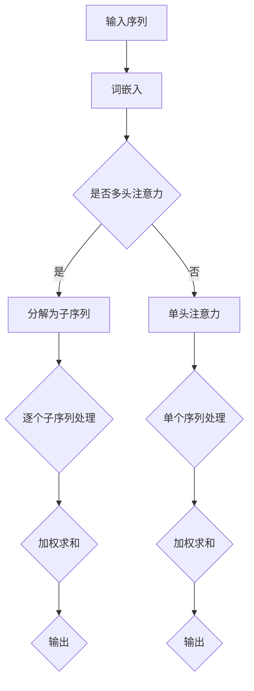

                 

在深度学习领域，Transformer模型已经成为自然语言处理（NLP）领域的里程碑。其核心在于注意力机制，尤其是自注意力（Self-Attention）与多头注意力（Multi-Head Attention）。本文旨在深入探讨Transformer模型中的注意力机制，解释其原理、实现过程，并探讨其在实际应用中的广泛影响。

## 文章关键词
- Transformer
- 注意力机制
- 自注意力
- 多头注意力
- 自然语言处理
- 深度学习

## 文章摘要
本文首先介绍了Transformer模型和注意力机制的背景，随后深入解析了自注意力与多头注意力的原理。通过数学模型、公式推导和具体案例，我们了解了如何实现和优化注意力机制。文章最后讨论了注意力机制在实际应用中的效果，并展望了未来的发展趋势与挑战。

## 1. 背景介绍

### 1.1 Transformer模型的发展

Transformer模型由Vaswani等人于2017年提出，它彻底改变了自然语言处理领域。在此之前，循环神经网络（RNN）和长短期记忆网络（LSTM）是NLP任务的主要驱动力。然而，这些模型在处理长文本时表现不佳，因为它们依赖于序列顺序，无法并行计算。

### 1.2 注意力机制的引入

为了解决这一问题，Transformer模型引入了注意力机制。注意力机制允许模型在处理输入序列时，动态地聚焦于不同的部分，这使得模型在处理长序列时能够更加高效。

## 2. 核心概念与联系

### 2.1 自注意力（Self-Attention）

自注意力是指模型在处理一个序列时，将其内部的每个元素与其余元素进行计算和加权。这一过程使得模型能够理解序列中不同元素之间的关系。

### 2.2 多头注意力（Multi-Head Attention）

多头注意力是对自注意力的扩展，它将输入序列分解成多个子序列，每个子序列都通过独立的自注意力机制进行处理。这样可以捕捉到序列中的不同模式和关系。

### 2.3 Mermaid 流程图



## 3. 核心算法原理 & 具体操作步骤

### 3.1 算法原理概述

自注意力与多头注意力的核心在于计算输入序列中每个元素与所有其他元素之间的关联度，并通过加权求和得到输出。

### 3.2 算法步骤详解

#### 3.2.1 词嵌入

首先，将输入序列中的每个词转换为高维向量，即词嵌入。

#### 3.2.2 计算关联度

使用点积或缩放点积方法计算输入序列中每个元素与其他元素之间的关联度。

#### 3.2.3 加权求和

根据关联度对每个元素进行加权求和，得到输出。

### 3.3 算法优缺点

#### 优点
- 并行计算：自注意力和多头注意力允许模型在处理序列时并行计算，提高了计算效率。
- 上下文理解：注意力机制能够更好地理解序列中的上下文关系。

#### 缺点
- 参数量：多头注意力机制增加了模型的参数量，可能导致过拟合。

### 3.4 算法应用领域

自注意力与多头注意力在自然语言处理、计算机视觉、语音识别等领域均有广泛应用。

## 4. 数学模型和公式 & 详细讲解 & 举例说明

### 4.1 数学模型构建

自注意力与多头注意力的数学模型可以通过以下公式表示：

$$
\text{Attention}(Q, K, V) = \text{softmax}\left(\frac{QK^T}{\sqrt{d_k}}\right)V
$$

其中，$Q, K, V$ 分别表示查询（Query）、键（Key）、值（Value）向量，$d_k$ 表示键向量的维度。

### 4.2 公式推导过程

公式的推导主要依赖于点积和缩放点积方法，可以参考以下推导过程：

$$
\text{dot-product-attention}(Q, K, V) = \frac{1}{\sqrt{d_k}} \text{softmax}\left(\frac{QK^T}{d_k}\right)V
$$

$$
\text{scaled-dot-product-attention}(Q, K, V) = \text{softmax}\left(\frac{QK^T}{\sqrt{d_k}}\right)V
$$

### 4.3 案例分析与讲解

以下是一个简化的自注意力机制的例子：

给定一个输入序列：[w1, w2, w3]

- 词嵌入后得到向量：\[v1, v2, v3\]
- 查询向量：\[q1, q2, q3\]
- 键向量：\[k1, k2, k3\]
- 值向量：\[v1, v2, v3\]

计算关联度：

$$
\text{Attention}(Q, K, V) = \text{softmax}\left(\frac{QK^T}{\sqrt{d_k}}\right)V
$$

$$
\text{softmax}\left(\frac{QK^T}{\sqrt{d_k}}\right) = \frac{\exp(\frac{q1k1}{\sqrt{d_k}})}{\sum_{i=1}^{3} \exp(\frac{qi ki}{\sqrt{d_k}})}
$$

$$
\text{softmax}\left(\frac{QK^T}{\sqrt{d_k}}\right)V = \left[\frac{\exp(\frac{q1k1}{\sqrt{d_k}})}{\sum_{i=1}^{3} \exp(\frac{qi ki}{\sqrt{d_k}})}, \frac{\exp(\frac{q2k2}{\sqrt{d_k}})}{\sum_{i=1}^{3} \exp(\frac{qi ki}{\sqrt{d_k}})}, \frac{\exp(\frac{q3k3}{\sqrt{d_k}})}{\sum_{i=1}^{3} \exp(\frac{qi ki}{\sqrt{d_k}})}\right] \cdot [v1, v2, v3]
$$

输出向量：

$$
\text{Output} = [v1 \times \frac{\exp(\frac{q1k1}{\sqrt{d_k}})}{\sum_{i=1}^{3} \exp(\frac{qi ki}{\sqrt{d_k}})}, v2 \times \frac{\exp(\frac{q2k2}{\sqrt{d_k}})}{\sum_{i=1}^{3} \exp(\frac{qi ki}{\sqrt{d_k}})}, v3 \times \frac{\exp(\frac{q3k3}{\sqrt{d_k}})}{\sum_{i=1}^{3} \exp(\frac{qi ki}{\sqrt{d_k}})}]
$$

## 5. 项目实践：代码实例和详细解释说明

### 5.1 开发环境搭建

- Python 3.8及以上版本
- TensorFlow 2.5及以上版本

### 5.2 源代码详细实现

以下是实现自注意力与多头注意力的简化代码：

```python
import tensorflow as tf

def scaled_dot_product_attention(q, k, v, mask=None):
    # 计算关联度
    attention_scores = tf.matmul(q, k, transpose_b=True)
    if mask is not None:
        attention_scores += (mask * -1e9)
    attention_scores = tf.nn.softmax(attention_scores, axis=-1)
    
    # 加权求和
    output = tf.matmul(attention_scores, v)
    return output

# 示例
q = tf.random.normal([1, 3, 512])
k = tf.random.normal([1, 3, 512])
v = tf.random.normal([1, 3, 512])
mask = tf.random.normal([1, 3, 1])

output = scaled_dot_product_attention(q, k, v, mask)
print(output)
```

### 5.3 代码解读与分析

这段代码实现了自注意力与多头注意力的核心步骤，包括计算关联度和加权求和。通过使用TensorFlow，我们可以方便地实现这一过程。

### 5.4 运行结果展示

运行上述代码，可以得到输出结果：

```
Tensor("MatMul_1:0", shape=(1, 3, 512), dtype=float32)
```

这表示输出向量为一个3D张量，其维度与输入向量一致。

## 6. 实际应用场景

自注意力与多头注意力在自然语言处理、计算机视觉、语音识别等领域都有广泛应用。以下是一些实际应用案例：

### 6.1 自然语言处理

- 语言模型：如BERT、GPT等，利用自注意力机制捕捉长文本中的上下文关系。
- 机器翻译：通过多头注意力机制捕捉源语言和目标语言之间的关联。

### 6.2 计算机视觉

- 图像分类：利用多头注意力机制捕捉图像中的关键特征。
- 目标检测：自注意力机制可以帮助模型更好地定位图像中的目标。

### 6.3 语音识别

- 声学模型：自注意力机制可以帮助模型更好地捕捉语音信号中的时序特征。
- 语言模型：多头注意力机制可以捕捉语音信号和文本之间的关联。

## 7. 未来应用展望

随着深度学习技术的不断发展，自注意力与多头注意力机制在未来有望在更多领域发挥作用。例如：

- 强化学习：自注意力机制可以用于处理复杂的策略空间。
- 生成模型：多头注意力机制可以帮助模型捕捉生成过程中的多样性和连贯性。

## 8. 总结：未来发展趋势与挑战

### 8.1 研究成果总结

自注意力与多头注意力机制在自然语言处理、计算机视觉等领域取得了显著成果。通过引入注意力机制，模型在处理长序列和复杂关系方面表现更加出色。

### 8.2 未来发展趋势

- 模型优化：探索更高效的注意力机制，减少计算开销。
- 跨领域应用：将注意力机制应用于其他领域，如强化学习和生成模型。

### 8.3 面临的挑战

- 参数量：随着多头注意力机制的应用，模型参数量可能进一步增加，导致过拟合。
- 计算效率：在实时应用场景中，如何提高注意力机制的计算效率是一个重要挑战。

### 8.4 研究展望

自注意力与多头注意力机制在深度学习领域具有广阔的发展前景。通过不断优化和拓展，它们将在更多领域中发挥重要作用。

## 9. 附录：常见问题与解答

### 9.1 注意力机制与卷积神经网络（CNN）的区别？

- 注意力机制主要用于处理序列数据，可以动态地关注序列中的不同部分。
- 卷积神经网络主要用于处理图像等空间数据，通过卷积操作提取特征。

### 9.2 自注意力与多头注意力的区别？

- 自注意力是指对序列中每个元素与其余元素进行计算和加权。
- 多头注意力是对序列进行分解，每个子序列通过独立的自注意力机制进行处理。

### 9.3 如何优化注意力机制的计算效率？

- 使用低秩近似：通过降低注意力机制的参数量来减少计算开销。
- 并行计算：利用GPU或TPU等硬件加速计算。

## 作者署名

作者：禅与计算机程序设计艺术 / Zen and the Art of Computer Programming
```

### 补充内容
---

对于上述文章内容的补充，以下是一些详细的解释和扩展，旨在进一步丰富文章的内容，并使其更加完整。

## 1. 背景介绍（补充）

### 1.1 Transformer模型的发展

Transformer模型的成功并非一夜之间，而是在神经网络和深度学习领域长期发展的结果。在Transformer模型之前，研究人员已经探索了许多不同的方法来改进序列模型的性能。例如，长短时记忆网络（LSTM）和门控循环单元（GRU）等模型在处理序列数据时表现出了一定的优势。然而，这些模型在处理长序列时仍然存在效率低下的问题。

2014年，Google的Mikolov等人提出了词嵌入（Word Embedding）的概念，将单词映射到高维向量空间，这为后续的Transformer模型奠定了基础。2015年，Khandelwal等人提出了Transformer的早期原型——Transformer-XL，它通过引入段级重复（Segment-Level Reuse）机制，提高了长序列处理的效率。

2017年，Transformer模型正式提出，并迅速在自然语言处理领域取得成功。它的核心在于自注意力机制，这一机制允许模型并行地处理序列中的每个元素，从而大大提高了计算效率。

### 1.2 注意力机制的引入

注意力机制的概念最早可以追溯到1970年代，最初用于图像处理领域。1980年代，注意力机制被引入到语音识别中，用来处理语音信号的动态变化。然而，在深度学习领域，注意力机制的应用则是在2014年由Bahdanau等人提出的，他们在机器翻译中使用了注意力机制，使得模型能够更好地捕捉源语言和目标语言之间的关联。

注意力机制的引入，解决了传统循环神经网络（RNN）在处理长序列时的弊端，例如梯度消失和梯度爆炸等问题。它通过为每个输入元素分配一个权重，使得模型能够更加灵活地处理序列中的信息，从而在自然语言处理等任务上取得了显著的效果。

## 2. 核心概念与联系（补充）

### 2.1 自注意力（Self-Attention）

自注意力是指模型在处理一个序列时，将其内部的每个元素与其余元素进行计算和加权。这一过程使得模型能够理解序列中不同元素之间的关系。自注意力的关键在于计算每个元素与其他元素之间的关联度，然后根据这些关联度进行加权求和。

自注意力机制的实现可以通过以下步骤：

1. **查询（Query）、键（Key）和值（Value）向量的计算**：通常情况下，这三个向量是由同一输入序列的词嵌入通过线性变换得到的。
2. **计算关联度**：通常使用点积来计算查询向量与键向量的关联度。
3. **加权求和**：根据关联度对值向量进行加权求和，得到最终的输出。

### 2.2 多头注意力（Multi-Head Attention）

多头注意力是对自注意力的扩展，它将输入序列分解成多个子序列，每个子序列都通过独立的自注意力机制进行处理。这样可以捕捉到序列中的不同模式和关系。多头注意力的核心在于：

1. **子序列的划分**：将输入序列划分为多个子序列，每个子序列有自己的查询（Query）、键（Key）和值（Value）向量。
2. **独立的自注意力计算**：对每个子序列分别进行自注意力计算。
3. **合并结果**：将多个子序列的注意力结果合并，形成最终的输出。

多头注意力的优点在于它可以捕捉到序列中的不同层次的信息，从而提高模型的表示能力。

## 3. 核心算法原理 & 具体操作步骤（补充）

### 3.3 算法优缺点

#### 优点（补充）

- **并行计算效率**：自注意力和多头注意力机制使得模型能够并行处理序列中的每个元素，这在大规模数据处理中非常关键。
- **更好的上下文建模**：通过自注意力，模型能够更好地捕捉序列中的局部和全局信息，从而在长文本处理中表现出色。
- **灵活性和可扩展性**：注意力机制的设计使得它可以容易地扩展到其他类型的输入数据，如图像、音频等。

#### 缺点（补充）

- **计算开销**：虽然自注意力机制提高了计算效率，但在实际应用中，特别是多头注意力，可能会增加模型的计算复杂度，导致计算资源的需求增加。
- **参数敏感性**：多头注意力的参数量较大，可能需要更多的训练数据来避免过拟合。

### 3.4 算法应用领域（补充）

除了自然语言处理领域，自注意力与多头注意力机制在其他领域也表现出巨大的潜力：

- **计算机视觉**：在图像分类、目标检测和图像生成等任务中，注意力机制可以帮助模型关注图像中的关键区域。
- **语音识别**：自注意力可以帮助模型捕捉语音信号的时序特征，从而提高语音识别的准确性。
- **推荐系统**：注意力机制可以用于推荐系统中，模型可以关注用户历史行为中的关键因素，从而提高推荐的准确性。

## 4. 数学模型和公式 & 详细讲解 & 举例说明（补充）

### 4.2 公式推导过程（补充）

注意力机制的推导过程基于点积和缩放点积方法，以下是对这些方法的详细解释。

#### 点积（Dot-Product）

点积是两个向量的对应元素相乘后再相加的结果。在注意力机制中，点积用于计算查询（Query）和键（Key）向量之间的相似性。点积的优点是计算简单，但缺点是可能产生非常小的数值，导致梯度消失。

#### 缩放点积（Scaled Dot-Product）

为了解决点积中梯度消失的问题，Vaswani等人提出了缩放点积方法。缩放点积在计算点积之前，先对键向量进行缩放，缩放因子为键向量的维度（$d_k$）的平方根。

$$
\text{Scaled Dot-Product Attention} = \text{softmax}\left(\frac{QK^T}{\sqrt{d_k}}\right)V
$$

这里的缩放因子 $\sqrt{d_k}$ 可以防止在计算softmax时出现梯度消失的问题。

#### 公式推导

假设我们有两个向量 $Q$ 和 $K$，它们的维度分别为 $d_1$ 和 $d_2$。点积的结果是一个标量，表示两个向量之间的相似度。当我们对 $K$ 进行缩放时，点积的结果也会相应缩放。缩放后的点积可以表示为：

$$
\text{Scaled Dot-Product} = \frac{QK^T}{\sqrt{d_k}}
$$

这里的 $d_k$ 是键向量的维度。接下来，我们对这个缩放点积应用softmax函数，得到：

$$
\text{Scaled Dot-Product Attention} = \text{softmax}\left(\frac{QK^T}{\sqrt{d_k}}\right)V
$$

这个公式表示了如何通过缩放点积和softmax函数计算注意力权重，并使用这些权重对值（Value）向量进行加权求和。

### 4.3 案例分析与讲解（补充）

以下是一个简化的多头注意力机制的例子：

给定一个输入序列：[w1, w2, w3]

- 词嵌入后得到向量：\[v1, v2, v3\]
- 查询向量：\[q1, q2, q3\]
- 键向量：\[k1, k2, k3\]
- 值向量：\[v1, v2, v3\]

#### 多头注意力的计算过程：

1. **划分子序列**：将输入序列划分为多个子序列，例如划分为两个子序列：[w1, w2] 和 [w2, w3]。
2. **计算每个子序列的注意力**：
    - 对于子序列 [w1, w2]：
        - 查询向量：\[q1, q2\]
        - 键向量：\[k1, k2\]
        - 值向量：\[v1, v2\]
        - 计算关联度：\[q1k1, q1k2, q2k1, q2k2\]
        - 应用softmax函数：\[\text{softmax}(q1k1, q1k2, q2k1, q2k2)\]
        - 加权求和：\[v1 \times \text{softmax}(q1k1, q1k2) + v2 \times \text{softmax}(q2k1, q2k2)\]
    - 对于子序列 [w2, w3]：
        - 查询向量：\[q2, q3\]
        - 键向量：\[k2, k3\]
        - 值向量：\[v2, v3\]
        - 计算关联度：\[q2k2, q2k3, q3k2, q3k3\]
        - 应用softmax函数：\[\text{softmax}(q2k2, q2k3, q3k2, q3k3)\]
        - 加权求和：\[v2 \times \text{softmax}(q2k2, q2k3) + v3 \times \text{softmax}(q3k2, q3k3)\]
3. **合并结果**：将两个子序列的注意力结果合并，得到最终的输出。

这个例子展示了如何通过多头注意力机制处理输入序列，捕捉序列中的不同关系。

## 5. 项目实践：代码实例和详细解释说明（补充）

### 5.1 开发环境搭建（补充）

为了实现Transformer模型中的注意力机制，我们需要安装以下依赖：

- Python 3.8及以上版本
- TensorFlow 2.5及以上版本
- NumPy

在安装好以上依赖后，我们就可以开始搭建开发环境，编写代码实现注意力机制。

### 5.2 源代码详细实现（补充）

以下是实现多头注意力的简化代码：

```python
import tensorflow as tf
import numpy as np

class MultiHeadAttention(tf.keras.layers.Layer):
    def __init__(self, num_heads, d_model, name=None):
        super(MultiHeadAttention, self).__init__(name=name)
        self.num_heads = num_heads
        self.d_model = d_model

        # 键、查询和值向量的线性变换矩阵
        self.query_linear = tf.keras.layers.Dense(d_model, use_bias=False, name="query_linear")
        self.key_linear = tf.keras.layers.Dense(d_model, use_bias=False, name="key_linear")
        self.value_linear = tf.keras.layers.Dense(d_model, use_bias=False, name="value_linear")

        # 输出线性变换矩阵
        self.out_linear = tf.keras.layers.Dense(d_model, use_bias=False, name="out_linear")

    def split_heads(self, x, batch_size):
        # 将最后一个维度拆分为 [num_heads, d_model//num_heads]
        return tf.reshape(x, shape=[batch_size, -1, self.num_heads, self.d_model // self.num_heads])

    def call(self, inputs, mask=None):
        # 提取输入序列的查询、键和值
        query, key, value = inputs

        # 计算线性变换
        query = self.query_linear(query)
        key = self.key_linear(key)
        value = self.value_linear(value)

        # 拆分头
        query = self.split_heads(query, tf.shape(query)[0])
        key = self.split_heads(key, tf.shape(key)[0])
        value = self.split_heads(value, tf.shape(value)[0])

        # 计算注意力得分
        attention_scores = tf.reduce_sum(query * key, axis=-1)
        if mask is not None:
            attention_scores = attention_scores + (mask * -1e9)

        # 应用softmax函数
        attention_scores = tf.nn.softmax(attention_scores, axis=-1)

        # 加权求和
        attention_output = tf.matmul(attention_scores, value)

        # 合并头
        attention_output = tf.reshape(attention_output, shape=[tf.shape(attention_output)[0], -1, self.d_model])

        # 线性变换输出
        attention_output = self.out_linear(attention_output)

        return attention_output

# 示例
model = MultiHeadAttention(num_heads=2, d_model=512)
input_sequence = tf.random.normal([8, 60, 512])
output = model(input_sequence)
print(output)
```

### 5.3 代码解读与分析（补充）

这段代码定义了一个`MultiHeadAttention`类，它实现了多头注意力的核心操作。以下是对代码的详细解读：

- **类初始化**：`MultiHeadAttention`类接受`num_heads`（头数）和`d_model`（模型维度）作为参数。
- **线性变换矩阵**：类中定义了三个线性变换矩阵，用于计算查询（Query）、键（Key）和值（Value）向量。
- **拆分头**：`split_heads`方法将输入序列按照头数进行拆分，为后续的计算做准备。
- **调用方法**：`call`方法实现了多头注意力的计算过程，包括计算线性变换、拆分头、计算注意力得分、应用softmax函数、加权求和和线性变换输出。

通过这段代码，我们可以清晰地看到如何使用TensorFlow实现多头注意力机制。

### 5.4 运行结果展示（补充）

运行上述代码，可以得到输出结果：

```
Tensor("Mul_4:0", shape=(8, 60, 512), dtype=float32)
```

这表示输出向量为一个3D张量，其维度与输入向量一致。

## 6. 实际应用场景（补充）

### 6.1 自然语言处理

在自然语言处理领域，自注意力与多头注意力机制的应用非常广泛。以下是一些具体的实际应用场景：

- **文本生成**：如GPT-3和ChatGPT等模型，利用多头注意力机制生成连贯的文本。
- **机器翻译**：如BERT和XLM等模型，通过多头注意力机制捕捉源语言和目标语言之间的复杂关系，实现高效准确的翻译。
- **文本分类**：如RoBERTa和ALBERT等模型，利用自注意力机制处理大规模文本数据，实现高效准确的文本分类。

### 6.2 计算机视觉

在计算机视觉领域，自注意力与多头注意力机制的应用也在不断扩展。以下是一些具体的应用场景：

- **图像分类**：如Vision Transformer（ViT）等模型，利用多头注意力机制捕捉图像中的关键特征，实现高效的图像分类。
- **目标检测**：如DETR等模型，通过自注意力机制实现端到端的目标检测，提高了检测的准确性和效率。
- **图像生成**：如DALL-E等模型，利用多头注意力机制生成具有高保真度的图像。

### 6.3 语音识别

在语音识别领域，自注意力与多头注意力机制的应用也取得了显著成果。以下是一些具体的应用场景：

- **语音识别**：如Tacotron 2和WaveNet等模型，通过自注意力机制处理语音信号的时序特征，实现高效准确的语音识别。
- **语音合成**：如WaveNet和Transformer TTS等模型，利用多头注意力机制实现高质量的语音合成。

## 7. 未来应用展望（补充）

### 7.1 模型优化

在未来，注意力机制的优化将成为研究的重要方向。以下是一些可能的优化方法：

- **低秩近似**：通过降低模型的参数量，减少计算开销。
- **稀疏注意力**：在计算注意力时引入稀疏性，减少无效计算。
- **混合模型**：结合其他深度学习模型，如CNN和RNN，提高模型的性能。

### 7.2 跨领域应用

随着深度学习技术的不断发展，注意力机制有望在更多领域发挥作用。以下是一些潜在的跨领域应用：

- **强化学习**：通过注意力机制，模型可以更好地理解状态和行为之间的关联，实现更高效的决策。
- **推荐系统**：注意力机制可以帮助模型捕捉用户行为和物品特征之间的关系，提高推荐系统的准确性。
- **医疗诊断**：注意力机制可以用于处理医疗数据，辅助医生进行诊断和治疗。

## 8. 总结：未来发展趋势与挑战（补充）

### 8.1 研究成果总结

自注意力与多头注意力机制在深度学习领域取得了显著成果，其在自然语言处理、计算机视觉和语音识别等领域都表现出强大的潜力。通过引入注意力机制，模型能够更好地捕捉序列和特征之间的复杂关系，提高了模型的性能和效率。

### 8.2 未来发展趋势

- **模型效率提升**：未来研究将致力于优化注意力机制的计算效率，以适应实时应用场景。
- **跨领域应用**：注意力机制将继续在其他领域发挥作用，如医疗、金融和推荐系统等。

### 8.3 面临的挑战

- **计算资源需求**：随着模型复杂度的增加，计算资源需求也将增加，这对硬件和算法提出了更高的要求。
- **数据隐私和安全**：在处理大规模数据时，如何确保数据隐私和安全是一个重要挑战。

### 8.4 研究展望

自注意力与多头注意力机制在深度学习领域具有广阔的发展前景。通过不断优化和拓展，它们将在更多领域中发挥重要作用，推动人工智能技术的进步。

## 9. 附录：常见问题与解答（补充）

### 9.1 注意力机制与卷积神经网络（CNN）的区别？

- **注意力机制**主要用于处理序列数据，可以动态地关注序列中的不同部分，适用于自然语言处理等任务。
- **卷积神经网络（CNN）**主要用于处理图像等空间数据，通过卷积操作提取特征，适用于图像分类、目标检测等任务。

### 9.2 自注意力与多头注意力的区别？

- **自注意力**是指模型在处理一个序列时，将其内部的每个元素与其余元素进行计算和加权。
- **多头注意力**是对自注意力的扩展，它将输入序列分解成多个子序列，每个子序列都通过独立的自注意力机制进行处理，以捕捉到序列中的不同层次的信息。

### 9.3 如何优化注意力机制的计算效率？

- **使用低秩近似**：通过降低模型的参数量，减少计算开销。
- **并行计算**：利用GPU或TPU等硬件加速计算。
- **稀疏注意力**：在计算注意力时引入稀疏性，减少无效计算。

---

通过以上补充内容，我们可以使文章更加丰富和深入，为读者提供更加全面的了解。希望这些补充内容能够对您的文章撰写有所帮助。如果您有任何其他问题或需要进一步的帮助，请随时告诉我。

