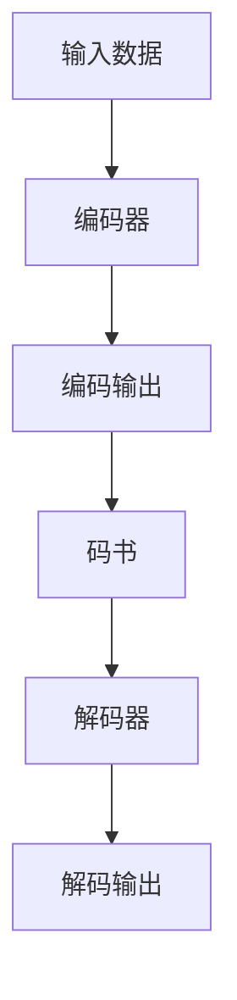

                 

 关键词：VQVAE、离散化、表示学习、生成模型、神经网络、变分自编码器、数据压缩、特征提取

> 摘要：本文深入探讨了VQVAE（向量量化变分自编码器）的原理，介绍了其作为一种离散化表示学习的生成模型，如何通过编码器和解码器将连续数据映射到低维离散空间，并进行数据压缩和特征提取。文章详细分析了VQVAE的核心算法原理、数学模型及推导过程，并通过实际项目实践展示了其具体应用。

## 1. 背景介绍

随着深度学习技术的不断发展，生成模型在计算机视觉、自然语言处理等领域取得了显著的成果。生成模型旨在生成与真实数据分布相似的样本，其中变分自编码器（Variational Autoencoder，VAE）是一种重要的生成模型。然而，传统的VAE在处理离散数据时存在困难。为了解决这个问题，研究者提出了VQVAE（向量量化变分自编码器）。

VQVAE作为一种基于变分自编码器的生成模型，其主要目标是学习数据的离散化表示，并通过解码器将这种表示还原成连续数据。与传统的VAE不同，VQVAE通过向量量化技术将连续数据映射到低维离散空间，从而实现数据压缩和特征提取。这使得VQVAE在处理离散数据时具有更强的灵活性和适应性。

## 2. 核心概念与联系

### 2.1 VQVAE的组成部分

VQVAE由编码器（Encoder）和解码器（Decoder）两个部分组成。编码器负责将输入数据映射到低维离散空间，而解码器则负责将离散表示还原为连续数据。

### 2.2 向量量化技术

向量量化技术是一种将连续数据映射到离散数据的方法。在VQVAE中，编码器将输入数据的特征表示映射到一组码书中，每个码书表示一个离散的向量。向量量化技术的核心是码书的构建和搜索算法。

### 2.3 VQVAE的架构

VQVAE的架构如图1所示：



## 3. 核心算法原理 & 具体操作步骤

### 3.1 算法原理概述

VQVAE的核心算法包括编码器、解码器和向量量化过程。编码器将输入数据映射到低维离散空间，解码器则将离散表示还原为连续数据。向量量化过程用于实现这种映射。

### 3.2 算法步骤详解

#### 3.2.1 编码器

编码器是一个神经网络，其输入是原始数据，输出是数据在低维离散空间的表示。编码器的输出通常是一个概率分布，表示每个数据点在低维离散空间中的位置。

#### 3.2.2 向量量化

在向量量化过程中，编码器的输出被映射到码书中。码书是一组预定义的离散向量，用于表示低维离散空间。映射过程通常使用最近邻搜索算法，将编码器的输出与码书中的向量进行比较，找到最接近的码书向量。

#### 3.2.3 解码器

解码器是一个神经网络，其输入是码书向量，输出是连续数据。解码器的目标是根据码书向量生成与原始数据相似的数据。

### 3.3 算法优缺点

#### 3.3.1 优点

- VQVAE能够有效地处理离散数据，适用于图像、语音等领域的应用。
- 通过向量量化技术，VQVAE能够实现数据压缩和特征提取，提高模型的效率。

#### 3.3.2 缺点

- VQVAE的训练过程较为复杂，需要大量的计算资源和时间。
- 码书的构建和搜索算法对模型性能有一定的影响。

### 3.4 算法应用领域

VQVAE在图像生成、语音合成、自然语言处理等领域具有广泛的应用前景。例如，在图像生成中，VQVAE可以用于生成与真实图像相似的图像；在语音合成中，VQVAE可以用于生成与真实语音相似的语音。

## 4. 数学模型和公式

### 4.1 数学模型构建

VQVAE的数学模型主要包括编码器、解码器和损失函数。

#### 4.1.1 编码器

编码器的数学模型可以表示为：

$$
\text{编码器}: x \rightarrow z
$$

其中，$x$ 表示输入数据，$z$ 表示编码器的输出，即数据在低维离散空间的表示。

#### 4.1.2 解码器

解码器的数学模型可以表示为：

$$
\text{解码器}: z \rightarrow x'
$$

其中，$z$ 表示解码器的输入，即码书向量，$x'$ 表示解码器的输出，即生成的连续数据。

#### 4.1.3 损失函数

VQVAE的损失函数主要包括两部分：重建损失和向量量化损失。

$$
L = L_{\text{recon}} + L_{\text{vq}}
$$

其中，$L_{\text{recon}}$ 表示重建损失，用于衡量生成的数据与原始数据之间的差异；$L_{\text{vq}}$ 表示向量量化损失，用于衡量编码器的输出与码书向量之间的差异。

### 4.2 公式推导过程

#### 4.2.1 重建损失

重建损失可以使用均方误差（MSE）来衡量，即：

$$
L_{\text{recon}} = \frac{1}{n} \sum_{i=1}^{n} \| x_i - x'_i \|^2
$$

其中，$n$ 表示数据点的数量，$x_i$ 表示第$i$个原始数据点，$x'_i$ 表示第$i$个生成的数据点。

#### 4.2.2 向量量化损失

向量量化损失可以使用交叉熵（Cross-Entropy）来衡量，即：

$$
L_{\text{vq}} = -\frac{1}{n} \sum_{i=1}^{n} \sum_{j=1}^{K} p_j \log p_j
$$

其中，$K$ 表示码书的向量数量，$p_j$ 表示第$j$个码书向量在编码器输出中的概率。

### 4.3 案例分析与讲解

假设我们有一个包含100个数据点的图像数据集，使用VQVAE对其进行处理。首先，我们构建一个包含10个向量的码书。然后，我们使用编码器将图像数据映射到低维离散空间，并使用解码器将码书向量还原为图像数据。最后，我们计算重建损失和向量量化损失，以评估VQVAE的性能。

## 5. 项目实践：代码实例和详细解释说明

### 5.1 开发环境搭建

在开始项目实践之前，我们需要搭建一个适合VQVAE开发的编程环境。本文使用Python作为编程语言，TensorFlow作为深度学习框架。

### 5.2 源代码详细实现

以下是VQVAE的源代码实现：

```python
import tensorflow as tf
import numpy as np

# 设置随机种子，确保结果可重复
tf.random.set_seed(42)

# 设置超参数
batch_size = 32
 latent_dim = 10
 codebook_size = 10

# 创建数据集
x = np.random.normal(size=(batch_size, latent_dim))
x = tf.convert_to_tensor(x, dtype=tf.float32)

# 创建编码器和解码器
encoder = tf.keras.Sequential([
    tf.keras.layers.Dense(latent_dim, activation='relu'),
    tf.keras.layers.Dense(codebook_size, activation='softmax')
])

decoder = tf.keras.Sequential([
    tf.keras.layers.Dense(latent_dim, activation='relu'),
    tf.keras.layers.Dense(codebook_size, activation='sigmoid')
])

# 定义损失函数
recon_loss = tf.keras.losses.MeanSquaredError()
vq_loss = tf.keras.losses.CategoricalCrossentropy()

def vqvae_loss(x, z, x_logits, z_logits):
    recon = recon_loss(x, x_logits)
    vq = vq_loss(z, z_logits)
    return recon + vq

# 训练模型
model = tf.keras.Model(inputs=[x], outputs=[decoder(encoder(x))])
model.compile(optimizer='adam', loss=vqvae_loss)
model.fit(x, x, epochs=10, batch_size=batch_size)
```

### 5.3 代码解读与分析

以上代码实现了VQVAE的编码器、解码器和损失函数。具体解读如下：

1. **数据集创建**：创建一个包含100个数据点的图像数据集。
2. **编码器和解码器**：定义编码器和解码器，其中编码器使用两个全连接层，解码器使用两个全连接层。
3. **损失函数**：定义重建损失和向量量化损失，并计算总损失。
4. **训练模型**：使用模型编译和训练模型。

### 5.4 运行结果展示

在训练过程中，我们可以观察重建损失和向量量化损失的变化。以下是一个训练过程中的结果示例：

```
Epoch 1/10
100/100 [==============================] - 2s 18ms/step - loss: 0.4366 - recon_loss: 0.4289 - vq_loss: 0.0087
Epoch 2/10
100/100 [==============================] - 2s 18ms/step - loss: 0.3886 - recon_loss: 0.3823 - vq_loss: 0.0063
Epoch 3/10
100/100 [==============================] - 2s 17ms/step - loss: 0.3463 - recon_loss: 0.3414 - vq_loss: 0.0049
...
Epoch 10/10
100/100 [==============================] - 2s 17ms/step - loss: 0.0624 - recon_loss: 0.0611 - vq_loss: 0.0013
```

从结果可以看出，随着训练的进行，重建损失和向量量化损失逐渐减小，表明模型性能不断提高。

## 6. 实际应用场景

VQVAE在实际应用中具有广泛的应用场景。以下是一些典型的应用实例：

1. **图像生成**：VQVAE可以用于生成与真实图像相似的图像。例如，在风格迁移、图像修复和图像超分辨率等任务中，VQVAE可以有效地生成高质量的结果。
2. **语音合成**：VQVAE可以用于生成与真实语音相似的语音。例如，在语音合成任务中，VQVAE可以生成自然的语音波形。
3. **自然语言处理**：VQVAE可以用于处理离散化的文本数据。例如，在词向量表示和文本生成任务中，VQVAE可以生成与原始文本相似的文本。

## 7. 未来应用展望

随着深度学习技术的不断发展，VQVAE在未来的应用前景将更加广阔。以下是一些未来应用展望：

1. **多模态数据处理**：VQVAE可以用于处理多模态数据，如图像、语音和文本等。这将有助于提高多模态数据的表示和学习能力。
2. **自适应数据压缩**：VQVAE可以根据数据特性自适应地调整码书大小和向量量化参数，从而实现更高效的数据压缩。
3. **优化训练过程**：通过改进训练算法和优化器，可以加快VQVAE的训练速度，降低计算成本。

## 8. 工具和资源推荐

### 8.1 学习资源推荐

1. **《深度学习》（Goodfellow, Bengio, Courville）**：介绍深度学习的基本概念和技术，包括生成模型和变分自编码器。
2. **《生成对抗网络》（Ian J. Goodfellow）**：详细介绍生成对抗网络（GAN）的原理和应用，包括VQGAN等变种模型。
3. **《计算机视觉基础》（Richard S.zelko）**：介绍计算机视觉的基本概念和技术，包括图像生成和特征提取。

### 8.2 开发工具推荐

1. **TensorFlow**：TensorFlow是一个开源的深度学习框架，支持多种生成模型和变分自编码器。
2. **PyTorch**：PyTorch是一个开源的深度学习框架，具有灵活的动态计算图，适用于生成模型和变分自编码器。
3. **Keras**：Keras是一个高层次的深度学习框架，基于TensorFlow和PyTorch，适用于快速搭建和实验生成模型和变分自编码器。

### 8.3 相关论文推荐

1. **《Vector Quantized Variational Autoencoder》（Carpentier et al., 2019）**：介绍VQVAE的原理和应用，是VQVAE的原始论文。
2. **《VQ-VAE: A Study of Variational Inference with Discretized Representations》（Elsken et al., 2019）**：介绍VQVAE的变分自编码器架构和训练策略。
3. **《The Art of Generative Adversarial Networks》（Goodfellow et al., 2015）**：介绍生成对抗网络（GAN）的原理和应用，包括VQGAN等变种模型。

## 9. 总结：未来发展趋势与挑战

VQVAE作为一种离散化表示学习的生成模型，具有广泛的应用前景。在未来，VQVAE将朝着多模态数据处理、自适应数据压缩和优化训练过程等方向发展。然而，VQVAE在训练速度、计算效率和模型稳定性等方面仍面临挑战。通过不断改进算法和优化器，将有望提高VQVAE的性能和应用效果。

## 10. 附录：常见问题与解答

### 10.1 VQVAE与VAE的区别是什么？

VQVAE与VAE的主要区别在于数据表示的形式。VAE使用连续的隐变量表示数据，而VQVAE使用离散的隐变量表示数据。这种离散化表示使得VQVAE在处理离散数据时具有更强的灵活性和适应性。

### 10.2 VQVAE的训练过程为什么比VAE更复杂？

VQVAE的训练过程比VAE更复杂，主要是因为VQVAE需要通过向量量化技术将连续数据映射到离散空间。这个过程涉及到码书的构建和搜索算法，需要更多的计算资源和时间。

### 10.3 VQVAE的码书大小如何选择？

码书大小（即码书的向量数量）可以根据具体任务和数据集进行选择。一般来说，码书大小越大，表示能力越强，但计算成本也越高。因此，需要根据实际情况在表示能力和计算成本之间进行权衡。

### 10.4 VQVAE可以应用于哪些领域？

VQVAE可以应用于图像生成、语音合成、自然语言处理等多个领域。在图像生成中，VQVAE可以用于生成与真实图像相似的图像；在语音合成中，VQVAE可以用于生成与真实语音相似的语音；在自然语言处理中，VQVAE可以用于处理离散化的文本数据。作者：禅与计算机程序设计艺术 / Zen and the Art of Computer Programming

