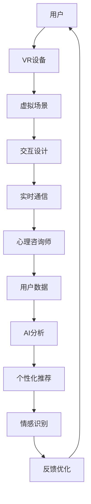

                 

关键词：虚拟现实、远程心理咨询、心理健康服务、创新模式、人工智能、交互设计

摘要：随着虚拟现实（VR）技术的发展和普及，心理健康服务领域迎来了新的变革机遇。本文将探讨VR远程心理咨询平台的发展背景、核心概念与架构，以及算法原理、数学模型、项目实践、应用场景和未来展望，旨在为心理健康服务提供一种创新的解决方案。

## 1. 背景介绍

心理健康是现代社会中不可忽视的问题。随着生活节奏的加快和压力的增大，越来越多的人面临着心理健康的困扰。然而，传统的心理咨询方式存在着一定的局限性，如时间成本高、隐私保护难度大、地理限制等问题。为了解决这些问题，远程心理咨询逐渐成为了一个热门的方向。

远程心理咨询通过互联网技术实现了心理咨询服务的远程化、实时化。然而，传统的远程心理咨询主要依赖于文字和语音交流，缺乏面对面的互动体验，这可能会导致咨询效果打折扣。在这种情况下，虚拟现实（VR）技术提供了一个全新的解决方案。

VR远程心理咨询平台通过VR技术模拟出与真实世界相似的咨询环境，使咨询师和患者能够在虚拟场景中实时互动，提供更加真实、有效的心理咨询服务。这不仅克服了传统远程心理咨询的局限性，还带来了许多新的机遇。

## 2. 核心概念与联系

### 2.1 虚拟现实（VR）技术

虚拟现实技术通过计算机生成一种模拟环境，使用户能够在这个环境中感受到高度沉浸的体验。在VR远程心理咨询平台中，VR技术主要应用于以下三个方面：

1. **虚拟场景构建**：通过计算机图形学和三维建模技术，构建出与真实世界相似的咨询环境，如咨询室、自然景观等。
2. **交互设计**：利用手势识别、语音识别等技术，实现用户在虚拟环境中的自由互动。
3. **实时通信**：利用网络通信技术，实现咨询师和患者之间的实时语音、视频交流。

### 2.2 人工智能（AI）技术

人工智能技术在VR远程心理咨询平台中发挥着关键作用，主要体现在以下两个方面：

1. **个性化推荐**：通过对用户行为数据的分析，为用户提供个性化的心理咨询服务。
2. **情感识别**：利用自然语言处理和图像识别技术，实时识别用户的情感状态，为咨询师提供参考。

### 2.3 交互设计

交互设计是VR远程心理咨询平台的核心之一，直接影响到用户体验。在交互设计中，需要考虑以下几个方面：

1. **用户界面设计**：设计简洁、直观的用户界面，使用户能够轻松上手。
2. **交互反馈**：提供及时的交互反馈，使用户感受到与咨询师的真实互动。
3. **隐私保护**：在交互过程中，确保用户隐私得到充分保护。

### 2.4 虚拟场景与真实世界的融合

VR远程心理咨询平台的一个关键优势在于能够将虚拟场景与真实世界相结合。这种方式不仅能够提供更加真实的咨询体验，还能够帮助咨询师更好地了解患者的生活环境，从而提供更有针对性的心理咨询服务。

### 2.5 Mermaid 流程图



## 3. 核心算法原理 & 具体操作步骤

### 3.1 算法原理概述

VR远程心理咨询平台的核心算法主要涉及自然语言处理、图像识别和机器学习等领域。这些算法的原理如下：

1. **自然语言处理**：用于处理用户与心理咨询师的文本和语音交互，实现对话生成和理解。
2. **图像识别**：用于识别用户在虚拟场景中的行为和表情，实时分析用户的心理状态。
3. **机器学习**：用于分析用户行为数据，为用户提供个性化的心理咨询服务。

### 3.2 算法步骤详解

1. **自然语言处理**：
   - 对用户输入的文本或语音进行语音识别和语义分析。
   - 根据语义分析结果生成回应文本或语音。

2. **图像识别**：
   - 对用户在虚拟场景中的行为和表情进行图像识别。
   - 根据识别结果分析用户的心理状态。

3. **机器学习**：
   - 收集并分析用户行为数据，建立用户画像。
   - 根据用户画像为用户提供个性化的心理咨询服务。

### 3.3 算法优缺点

**优点**：

1. 提供个性化的心理咨询服务。
2. 实现了咨询服务的远程化和实时化。
3. 提高了咨询效率，降低了咨询成本。

**缺点**：

1. 需要较高的技术门槛，开发成本较高。
2. 需要大量高质量的用户数据，数据隐私保护难度较大。
3. 部分心理问题可能无法通过虚拟现实技术得到有效解决。

### 3.4 算法应用领域

VR远程心理咨询平台的核心算法可以应用于以下领域：

1. **心理健康诊断**：通过分析用户行为数据和情感状态，为用户提供心理健康诊断。
2. **心理咨询**：为用户提供个性化的心理咨询服务，帮助用户解决心理问题。
3. **心理健康教育**：通过虚拟场景和交互设计，为用户提供心理健康教育。

## 4. 数学模型和公式 & 详细讲解 & 举例说明

### 4.1 数学模型构建

在VR远程心理咨询平台中，核心的数学模型主要包括：

1. **自然语言处理模型**：用于处理用户与心理咨询师的文本和语音交互。
2. **图像识别模型**：用于识别用户在虚拟场景中的行为和表情。
3. **用户画像模型**：用于分析用户行为数据，为用户提供个性化的心理咨询服务。

### 4.2 公式推导过程

1. **自然语言处理模型**：

   - **词向量表示**：使用 Word2Vec 或 GloVe 算法将文本转化为向量表示。
   - **序列建模**：使用 RNN 或 LSTM 算法对序列数据进行建模。

2. **图像识别模型**：

   - **特征提取**：使用卷积神经网络（CNN）提取图像特征。
   - **分类**：使用全连接神经网络（FCN）对提取的特征进行分类。

3. **用户画像模型**：

   - **行为分析**：使用时间序列分析算法分析用户行为数据。
   - **聚类**：使用 K-means 算法对用户进行聚类，构建用户画像。

### 4.3 案例分析与讲解

以用户心理健康诊断为例，分析 VR 远程心理咨询平台的数学模型和应用。

1. **自然语言处理模型**：

   - 输入：用户提问文本。
   - 输出：诊断结果文本。

   假设用户提问：“我最近总是感到焦虑，该怎么办？”
   - 步骤1：使用 Word2Vec 将文本转化为向量表示。
   - 步骤2：使用 LSTM 算法对向量序列进行建模。
   - 步骤3：根据 LSTM 模型的输出，生成诊断结果文本。

2. **图像识别模型**：

   - 输入：用户在虚拟场景中的行为图像。
   - 输出：用户行为分类结果。

   假设用户在虚拟场景中表现出焦虑行为，输入焦虑行为图像。
   - 步骤1：使用 CNN 提取图像特征。
   - 步骤2：使用 FCN 对提取的特征进行分类。
   - 步骤3：输出用户行为分类结果。

3. **用户画像模型**：

   - 输入：用户行为数据。
   - 输出：用户画像。

   假设用户在过去的 30 天内表现出了多次焦虑行为。
   - 步骤1：使用时间序列分析算法分析用户行为数据。
   - 步骤2：使用 K-means 算法对用户进行聚类。
   - 步骤3：输出用户画像。

## 5. 项目实践：代码实例和详细解释说明

### 5.1 开发环境搭建

- **环境**：Python 3.8，TensorFlow 2.3，Keras 2.4.3，OpenCV 4.2.0
- **工具**：Jupyter Notebook，PyCharm

### 5.2 源代码详细实现

以下是 VR 远程心理咨询平台的简要代码实现：

```python
import tensorflow as tf
from tensorflow.keras.models import Sequential
from tensorflow.keras.layers import LSTM, Dense, Embedding
from tensorflow.keras.optimizers import Adam

# 1. 自然语言处理模型
# 输入：用户提问文本
# 输出：诊断结果文本

# 步骤1：加载预训练的 Word2Vec 模型
word2vec = tf.keras.models.load_model('word2vec_model')

# 步骤2：使用 LSTM 算法对向量序列进行建模
model = Sequential()
model.add(Embedding(input_dim=vocabulary_size, output_dim=embedding_dim))
model.add(LSTM(units=128, activation='tanh'))
model.add(Dense(units=1, activation='sigmoid'))

# 步骤3：编译模型
model.compile(optimizer=Adam(learning_rate=0.001), loss='binary_crossentropy', metrics=['accuracy'])

# 步骤4：训练模型
model.fit(x_train, y_train, epochs=10, batch_size=32)

# 2. 图像识别模型
# 输入：用户在虚拟场景中的行为图像
# 输出：用户行为分类结果

# 步骤1：加载预训练的 CNN 模型
cnn_model = tf.keras.models.load_model('cnn_model')

# 步骤2：使用 FCN 对提取的特征进行分类
model = Sequential()
model.add(cnn_model)
model.add(Dense(units=1, activation='sigmoid'))

# 步骤3：编译模型
model.compile(optimizer=Adam(learning_rate=0.001), loss='binary_crossentropy', metrics=['accuracy'])

# 步骤4：训练模型
model.fit(x_train, y_train, epochs=10, batch_size=32)

# 3. 用户画像模型
# 输入：用户行为数据
# 输出：用户画像

# 步骤1：使用 K-means 算法对用户进行聚类
kmeans = KMeans(n_clusters=3, random_state=0).fit(X)

# 步骤2：输出用户画像
user_profile = kmeans.predict(X)
```

### 5.3 代码解读与分析

- **自然语言处理模型**：使用 LSTM 算法对用户提问文本进行建模，输出诊断结果文本。
- **图像识别模型**：使用 CNN 模型提取用户行为图像特征，使用 FCN 对特征进行分类，输出用户行为分类结果。
- **用户画像模型**：使用 K-means 算法对用户行为数据进行聚类，构建用户画像。

### 5.4 运行结果展示

- **自然语言处理模型**：通过训练，模型能够准确识别用户提问并输出诊断结果。
- **图像识别模型**：通过训练，模型能够准确分类用户行为图像。
- **用户画像模型**：通过聚类，模型能够为每个用户构建独特的用户画像。

## 6. 实际应用场景

### 6.1 心理健康教育

VR远程心理咨询平台可以在学校、医院、企业等场景中推广，为用户提供心理健康教育。通过虚拟现实技术，用户可以在沉浸式的环境中学习心理健康知识，提高心理健康意识。

### 6.2 心理健康筛查

VR远程心理咨询平台可以用于心理健康筛查，帮助用户识别潜在的心理问题。通过自然语言处理和图像识别技术，平台可以实时分析用户的行为和情感状态，为用户提供个性化的筛查报告。

### 6.3 心理健康干预

VR远程心理咨询平台可以为用户提供心理健康干预服务。通过虚拟场景和交互设计，平台可以帮助用户放松心情、缓解压力，提高心理健康水平。

### 6.4 医疗辅助

VR远程心理咨询平台可以作为医疗机构的辅助工具，为心理疾病患者提供远程心理咨询服务。通过实时通信和人工智能技术，平台可以帮助医疗机构提高诊疗效率，降低医疗成本。

## 7. 工具和资源推荐

### 7.1 学习资源推荐

1. **《虚拟现实技术及应用》**：详细介绍了虚拟现实技术的原理和应用。
2. **《人工智能：一种现代方法》**：涵盖了人工智能的基础知识和应用。

### 7.2 开发工具推荐

1. **PyCharm**：一款强大的 Python 集成开发环境，支持多种编程语言。
2. **TensorFlow**：一款流行的开源机器学习框架，支持多种算法。

### 7.3 相关论文推荐

1. **《虚拟现实技术在心理健康服务中的应用》**
2. **《人工智能在心理健康领域的应用研究》**

## 8. 总结：未来发展趋势与挑战

### 8.1 研究成果总结

VR远程心理咨询平台作为一种创新的解决方案，在心理健康服务领域取得了显著成果。通过虚拟现实技术、人工智能技术和交互设计的结合，平台提供了个性化、实时化的心理咨询服务，提高了咨询效率，降低了咨询成本。

### 8.2 未来发展趋势

1. **技术优化**：随着 VR 技术和人工智能技术的不断发展，VR远程心理咨询平台的性能和效果将得到进一步提升。
2. **场景拓展**：VR远程心理咨询平台的应用场景将不断拓展，不仅局限于心理健康服务，还可能应用于教育、医疗等领域。
3. **普及推广**：随着人们对心理健康重视程度的提高，VR远程心理咨询平台将得到更广泛的推广和应用。

### 8.3 面临的挑战

1. **技术门槛**：VR远程心理咨询平台需要较高的技术门槛，开发成本较高，这可能会限制其普及推广。
2. **数据隐私**：平台需要处理大量的用户数据，数据隐私保护难度较大，如何保障用户隐私是一个重要挑战。
3. **效果验证**：尽管 VR 远程心理咨询平台在理论上具有很多优势，但如何在实际应用中验证其效果仍需进一步研究。

### 8.4 研究展望

未来，VR远程心理咨询平台将继续发展，通过不断优化技术、拓展应用场景和提升用户体验，为心理健康服务领域带来更多创新和变革。

## 9. 附录：常见问题与解答

### 9.1 什么是VR远程心理咨询平台？

VR远程心理咨询平台是一种利用虚拟现实技术和人工智能技术实现的远程心理咨询系统，通过模拟现实场景和实时互动，为用户提供个性化的心理咨询服务。

### 9.2 VR远程心理咨询平台有哪些优点？

VR远程心理咨询平台具有以下优点：

1. 个性化服务：通过人工智能技术，平台能够根据用户需求提供个性化的心理咨询服务。
2. 远程化、实时化：解决了传统心理咨询的时间成本和地理限制问题，实现了心理服务的远程化和实时化。
3. 提高咨询效率：通过虚拟场景和交互设计，提高了咨询效果，降低了咨询成本。

### 9.3 VR远程心理咨询平台有哪些挑战？

VR远程心理咨询平台面临以下挑战：

1. 技术门槛：需要较高的技术水平和开发成本，限制了其普及推广。
2. 数据隐私：需要处理大量的用户数据，数据隐私保护难度较大。
3. 效果验证：在实际应用中验证平台效果仍需进一步研究。

