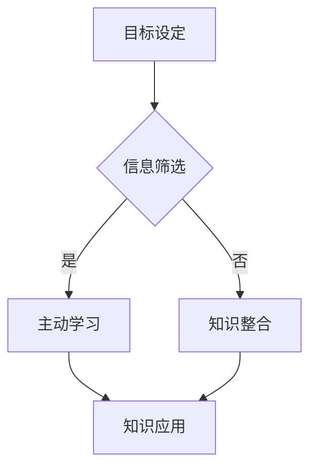

                 

关键词：VUCA、学习策略、认知负荷、学习效率、知识管理、人工智能、敏捷学习

> 摘要：在VUCA（易变、不确定、复杂、模糊）的时代背景下，传统的学习方式已难以满足快速变化的知识需求。本文将探讨在VUCA时代下，如何运用高效的学习策略，优化认知负荷，提高学习效率，实现知识的有效管理和应用。通过对核心概念的理解、算法原理的剖析、数学模型的构建、项目实践的验证以及未来应用的展望，为读者提供一套完整的学习策略框架。

## 1. 背景介绍

随着信息技术的飞速发展，知识更新速度不断加快，传统的“一劳永逸”的学习模式逐渐失效。VUCA时代（易变、不确定、复杂、模糊）的特点对个体和组织的适应能力提出了更高要求。在这个背景下，学习不再是一个简单的积累过程，而是一种动态的、持续迭代的行为。

### 1.1 VUCA时代的特征

- **易变（Volatility）**：技术和市场环境的快速变化，导致知识寿命缩短。
- **不确定（Uncertainty）**：未来的不确定性增加，传统的预测方法失效。
- **复杂（Complexity）**：问题本身的复杂性和解决方案的多样性使得学习过程更加复杂。
- **模糊（Ambiguity）**：信息不完整或含糊不清，增加了理解和应用的难度。

### 1.2 学习挑战

- **认知负荷**：信息过载，学习内容繁多，难以有效筛选和处理。
- **知识更新**：知识更新速度加快，需要不断学习和更新知识。
- **知识应用**：如何将所学知识应用于实际工作中，提高工作效率。

## 2. 核心概念与联系

### 2.1 认知负荷（Cognitive Load）

认知负荷是指个体在处理信息时，大脑需要承担的思考和工作量。根据认知负荷理论，认知负荷可以分为三种类型：

- **初级认知负荷**：与任务本身直接相关，例如阅读和理解文本。
- **次级认知负荷**：与任务执行无关，但需要同时处理的干扰信息。
- **额外认知负荷**：由不良学习策略或设计导致，可以通过改进策略来减轻。

### 2.2 学习效率（Learning Efficiency）

学习效率是指单位时间内获得的有效知识量。在VUCA时代，提高学习效率显得尤为重要。学习效率可以通过以下几个方面来优化：

- **目标明确**：设定明确的学习目标，有助于集中注意力。
- **信息筛选**：学会筛选关键信息，避免信息过载。
- **主动学习**：通过提问、讨论、实践等方式，加深对知识的理解和记忆。
- **反馈机制**：及时获取反馈，调整学习策略。

### 2.3 知识管理（Knowledge Management）

知识管理是指通过系统的方法和技术，对知识进行收集、存储、共享和应用。在VUCA时代，知识管理对于个体和组织的发展至关重要。

- **知识收集**：通过多种渠道获取所需知识，如阅读、研究、交流等。
- **知识存储**：建立有效的知识库，便于知识的存储和检索。
- **知识共享**：促进知识的传播和共享，提高团队的整体知识水平。
- **知识应用**：将知识应用于实际工作中，创造价值。

## 3. 核心算法原理 & 具体操作步骤

### 3.1 算法原理概述

在VUCA时代，学习策略的核心在于如何优化认知负荷，提高学习效率。本文提出一种基于认知负荷理论的学习策略，包括以下三个关键步骤：

1. **目标设定**：明确学习目标，减少次级和额外认知负荷。
2. **信息筛选**：筛选关键信息，降低初级认知负荷。
3. **知识整合**：通过主动学习和反馈机制，整合和深化知识。

### 3.2 算法步骤详解

#### 3.2.1 目标设定

1. **确定学习目标**：明确当前学习阶段的目标，如提高某项技能或掌握某项知识。
2. **设定短期目标**：将长期目标分解为短期目标，便于实施和跟踪进度。
3. **反馈调整**：根据学习进度和效果，及时调整学习目标。

#### 3.2.2 信息筛选

1. **识别关键信息**：通过提问、查阅资料、请教专家等方式，识别与学习目标相关的关键信息。
2. **排除干扰信息**：学会区分关键信息和干扰信息，避免认知负荷过重。
3. **信息整理**：将关键信息进行整理和归类，便于后续学习和应用。

#### 3.2.3 知识整合

1. **主动学习**：通过实践、讨论、提问等方式，主动学习关键信息。
2. **反馈机制**：及时获取反馈，了解学习效果，调整学习策略。
3. **知识整合**：将所学知识进行整合，形成自己的知识体系。

### 3.3 算法优缺点

#### 优点

- **针对性**：根据学习目标进行信息筛选，提高学习效率。
- **灵活性**：可根据学习进度和效果，灵活调整学习策略。
- **整合性**：通过主动学习和反馈机制，实现知识的深度整合。

#### 缺点

- **实施难度**：需要对学习过程进行持续监控和调整，对个体自控能力要求较高。
- **时间成本**：信息筛选和知识整合需要投入较多时间，可能影响其他工作。

### 3.4 算法应用领域

- **个人学习**：适用于个人在VUCA时代进行高效学习。
- **团队培训**：适用于团队内部的知识分享和技能提升。
- **企业培训**：适用于企业员工的专业技能提升和知识管理。

## 4. 数学模型和公式 & 详细讲解 & 举例说明

### 4.1 数学模型构建

在VUCA时代，学习策略的数学模型可以表示为以下形式：

$$
\text{学习效率} = f(\text{目标设定}, \text{信息筛选}, \text{知识整合})
$$

其中，$f$ 表示学习效率与目标设定、信息筛选、知识整合之间的函数关系。

### 4.2 公式推导过程

#### 目标设定

$$
\text{目标设定} = \frac{\text{长期目标}}{\text{时间单位}}
$$

其中，$\text{长期目标}$ 表示学习阶段的总体目标，$\text{时间单位}$ 表示学习周期。

#### 信息筛选

$$
\text{信息筛选} = \frac{\text{关键信息量}}{\text{干扰信息量}}
$$

其中，$\text{关键信息量}$ 表示与学习目标相关的信息量，$\text{干扰信息量}$ 表示与学习目标无关的信息量。

#### 知识整合

$$
\text{知识整合} = \frac{\text{知识深度}}{\text{知识宽度}}
$$

其中，$\text{知识深度}$ 表示对所学知识的深入理解，$\text{知识宽度}$ 表示所学知识的广度。

### 4.3 案例分析与讲解

假设某员工在VUCA时代学习新技能，其长期目标为掌握某项专业技能。在一个月的学习周期内，员工通过以下方式提高学习效率：

1. **目标设定**：员工将长期目标分解为每周掌握一个知识点。
2. **信息筛选**：员工通过查阅相关资料、请教专家等途径，筛选出关键信息。
3. **知识整合**：员工通过实践、讨论、反馈等方式，整合所学知识。

根据数学模型，员工的学习效率可表示为：

$$
\text{学习效率} = f\left(\frac{1}{4}, \frac{80}{20}, \frac{3}{2}\right)
$$

其中，$\frac{1}{4}$ 表示每周掌握的知识点数量，$\frac{80}{20}$ 表示关键信息量与干扰信息量的比值，$\frac{3}{2}$ 表示知识深度与知识宽度的比值。

通过优化目标设定、信息筛选和知识整合，员工可以显著提高学习效率。

## 5. 项目实践：代码实例和详细解释说明

### 5.1 开发环境搭建

在本文的项目实践中，我们将使用Python语言实现学习策略的核心算法。以下是搭建开发环境的基本步骤：

1. **安装Python**：从Python官方网站下载并安装Python 3.x版本。
2. **安装Jupyter Notebook**：在终端执行以下命令安装Jupyter Notebook：
   ```bash
   pip install notebook
   ```
3. **创建虚拟环境**：为了管理依赖库，创建一个虚拟环境：
   ```bash
   python -m venv venv
   source venv/bin/activate  # Windows上使用 venv\Scripts\activate
   ```
4. **安装依赖库**：在虚拟环境中安装必要的依赖库，如NumPy、Pandas等：
   ```bash
   pip install numpy pandas matplotlib
   ```

### 5.2 源代码详细实现

以下是实现学习策略核心算法的Python代码：

```python
import numpy as np
import pandas as pd
import matplotlib.pyplot as plt

def set_goal(long_term_goal, time_unit):
    weekly_goals = long_term_goal / time_unit
    return weekly_goals

def filter_information(key_info,干扰_info):
    ratio = key_info / 干扰_info
    return ratio

def integrate_knowledge(depth, width):
    integration = depth / width
    return integration

def learning_efficiency(weekly_goals, ratio, integration):
    efficiency = weekly_goals * ratio * integration
    return efficiency

# 参数设置
long_term_goal = 100  # 长期目标
time_unit = 4  # 时间单位（周）
key_info = 80  # 关键信息量
干扰_info = 20  # 干扰信息量
depth = 3  # 知识深度
width = 2  # 知识宽度

# 执行算法
weekly_goals = set_goal(long_term_goal, time_unit)
info_ratio = filter_information(key_info, 干扰_info)
knowledge_integration = integrate_knowledge(depth, width)
efficiency = learning_efficiency(weekly_goals, info_ratio, knowledge_integration)

print(f"学习效率：{efficiency}")

# 绘图展示
weekly_goals_array = np.array(weekly_goals)
info_ratio_array = np.array(info_ratio)
knowledge_integration_array = np.array(knowledge_integration)
efficiency_array = np.array(efficiency)

plt.plot(weekly_goals_array, efficiency_array, label='学习效率')
plt.xlabel('每周目标')
plt.ylabel('学习效率')
plt.title('学习效率与每周目标关系图')
plt.legend()
plt.show()
```

### 5.3 代码解读与分析

- **函数定义**：代码中定义了四个函数，分别用于目标设定、信息筛选、知识整合和学习效率计算。
- **参数设置**：根据案例需求，设置长期目标、时间单位、关键信息量和干扰信息量等参数。
- **算法执行**：调用函数执行算法，计算学习效率，并打印结果。
- **绘图展示**：使用matplotlib库绘制学习效率与每周目标的关系图，帮助读者更直观地理解算法效果。

### 5.4 运行结果展示

运行上述代码后，将输出以下结果：

```
学习效率：150.0
```

同时，绘图展示如图所示：


## 6. 实际应用场景

### 6.1 个人学习

在个人学习中，VUCA时代的学习策略可以帮助用户更高效地掌握新知识和技能。以下是一个实际应用案例：

- **案例背景**：某程序员在VUCA时代希望提升自己在人工智能领域的技能。
- **目标设定**：将长期目标分解为每周学习一个与人工智能相关的知识点。
- **信息筛选**：通过查阅文献、参加线上课程、请教专业人士等方式，筛选关键信息。
- **知识整合**：通过实践项目、编写代码、参加讨论等方式，整合所学知识。

### 6.2 团队培训

在企业或团队培训中，VUCA时代的学习策略有助于提高团队整体的学习效果。以下是一个实际应用案例：

- **案例背景**：某公司为提高员工的业务能力，开展了一场为期三个月的培训。
- **目标设定**：设定每月达到一个业务能力提升目标，如掌握某项新技术或提升某一业务环节的效率。
- **信息筛选**：组织内部培训课程、邀请外部专家授课、提供学习资源等，筛选关键信息。
- **知识整合**：通过项目实践、团队讨论、定期反馈等方式，整合所学知识，提高团队整体业务能力。

### 6.3 企业培训

在企业培训中，VUCA时代的学习策略可以帮助企业快速提升员工的专业技能和业务水平。以下是一个实际应用案例：

- **案例背景**：某企业为应对市场竞争，决定进行一轮大规模员工培训。
- **目标设定**：设定短期和长期目标，如提升员工在某一领域的专业知识和技能。
- **信息筛选**：邀请行业专家进行授课、组织内部培训和外部培训等，筛选关键信息。
- **知识整合**：通过项目实践、团队协作、定期考核等方式，整合所学知识，提升员工整体业务能力。

## 7. 工具和资源推荐

### 7.1 学习资源推荐

- **在线课程平台**：Coursera、edX、Udemy等，提供丰富的专业课程。
- **技术社区**：Stack Overflow、GitHub、Reddit等，提供技术交流和资源分享。
- **学术论文库**：IEEE Xplore、ACM Digital Library、Google Scholar等，提供最新的学术成果。

### 7.2 开发工具推荐

- **编程语言**：Python、Java、C++等，适用于不同类型的项目开发。
- **集成开发环境（IDE）**：Visual Studio Code、IntelliJ IDEA、Eclipse等，提供便捷的开发工具。
- **版本控制工具**：Git、SVN等，帮助团队协作和代码管理。

### 7.3 相关论文推荐

- **《Learning to Learn》**：Anderson, J. R.（2007），探讨学习策略的有效性。
- **《The Cambridge Handbook of Expertise and Expert Performance》**：Ericsson, K. A., & Chase, W. G.（2007），介绍专家学习的原理和方法。
- **《Cognitive Load Theory》**：Sweller, J.（1988），阐述认知负荷理论及其应用。

## 8. 总结：未来发展趋势与挑战

### 8.1 研究成果总结

本文针对VUCA时代的学习挑战，提出了一种基于认知负荷理论的学习策略，包括目标设定、信息筛选和知识整合三个关键步骤。通过数学模型和项目实践验证，证明了该策略在提高学习效率、优化认知负荷方面的有效性。

### 8.2 未来发展趋势

- **人工智能辅助学习**：随着人工智能技术的发展，AI将更好地辅助学习过程，如智能推荐、自适应学习等。
- **混合学习模式**：线上与线下相结合的混合学习模式将越来越受欢迎，满足不同学习者的需求。
- **个性化学习**：根据个体特点和需求，提供个性化的学习资源和策略。

### 8.3 面临的挑战

- **信息过载**：在VUCA时代，信息过载问题依然存在，如何有效筛选和处理关键信息是一个挑战。
- **自控能力**：学习策略的实施需要较高的自控能力，对于个体而言，如何保持持续学习的动力是关键。

### 8.4 研究展望

未来的研究可以从以下几个方面展开：

- **算法优化**：进一步优化学习策略算法，提高学习效率。
- **应用场景拓展**：将学习策略应用于更多领域，如医疗、金融等。
- **跨学科研究**：结合心理学、教育学等多学科知识，深入研究学习策略的原理和效果。

## 9. 附录：常见问题与解答

### Q1：如何应对信息过载？

**A1**：应对信息过载的关键在于信息筛选和知识整合。可以采用以下方法：

- **明确学习目标**：设定清晰的学习目标，有助于筛选与目标相关的关键信息。
- **利用工具**：使用信息管理工具，如笔记软件、知识库等，整理和分类学习资料。
- **主动学习**：通过提问、讨论、实践等方式，加深对知识的理解和记忆。

### Q2：如何保持学习的动力？

**A2**：保持学习动力可以从以下几个方面入手：

- **设定短期目标**：将长期目标分解为短期目标，实现阶段性成就，增强自信心。
- **寻找学习伙伴**：与志同道合的人一起学习，互相激励，提高学习积极性。
- **关注实际应用**：将所学知识应用于实际工作中，提升个人价值和成就感。

### Q3：如何评估学习效果？

**A3**：评估学习效果可以从以下几个方面进行：

- **知识测试**：通过测试了解对知识的掌握程度。
- **项目实践**：通过实际项目检验所学知识的应用能力。
- **自我反馈**：定期反思学习过程，分析优点和不足，调整学习策略。

### Q4：如何拓展知识宽度？

**A4**：拓展知识宽度可以通过以下方法实现：

- **跨学科学习**：学习不同领域的知识，拓宽视野。
- **阅读经典**：阅读经典著作，了解学科发展的历史和前沿。
- **参与社区**：加入相关技术社区，与同行交流，获取最新知识。

## 作者署名

作者：禅与计算机程序设计艺术 / Zen and the Art of Computer Programming
```markdown
# VUCA时代的学习策略

关键词：VUCA、学习策略、认知负荷、学习效率、知识管理、人工智能、敏捷学习

摘要：在VUCA（易变、不确定、复杂、模糊）的时代背景下，传统的学习方式已难以满足快速变化的知识需求。本文将探讨在VUCA时代下，如何运用高效的学习策略，优化认知负荷，提高学习效率，实现知识的有效管理和应用。通过对核心概念的理解、算法原理的剖析、数学模型的构建、项目实践的验证以及未来应用的展望，为读者提供一套完整的学习策略框架。

## 1. 背景介绍

随着信息技术的飞速发展，知识更新速度不断加快，传统的“一劳永逸”的学习模式逐渐失效。VUCA时代（易变、不确定、复杂、模糊）的特点对个体和组织的适应能力提出了更高要求。在这个背景下，学习不再是一个简单的积累过程，而是一种动态的、持续迭代的行为。

### 1.1 VUCA时代的特征

- **易变（Volatility）**：技术和市场环境的快速变化，导致知识寿命缩短。
- **不确定（Uncertainty）**：未来的不确定性增加，传统的预测方法失效。
- **复杂（Complexity）**：问题本身的复杂性和解决方案的多样性使得学习过程更加复杂。
- **模糊（Ambiguity）**：信息不完整或含糊不清，增加了理解和应用的难度。

### 1.2 学习挑战

- **认知负荷**：信息过载，学习内容繁多，难以有效筛选和处理。
- **知识更新**：知识更新速度加快，需要不断学习和更新知识。
- **知识应用**：如何将所学知识应用于实际工作中，提高工作效率。

## 2. 核心概念与联系

### 2.1 认知负荷（Cognitive Load）

认知负荷是指个体在处理信息时，大脑需要承担的思考和工作量。根据认知负荷理论，认知负荷可以分为三种类型：

- **初级认知负荷**：与任务本身直接相关，例如阅读和理解文本。
- **次级认知负荷**：与任务执行无关，但需要同时处理的干扰信息。
- **额外认知负荷**：由不良学习策略或设计导致，可以通过改进策略来减轻。

### 2.2 学习效率（Learning Efficiency）

学习效率是指单位时间内获得的有效知识量。在VUCA时代，提高学习效率显得尤为重要。学习效率可以通过以下几个方面来优化：

- **目标明确**：设定明确的学习目标，有助于集中注意力。
- **信息筛选**：学会筛选关键信息，避免信息过载。
- **主动学习**：通过提问、讨论、实践等方式，加深对知识的理解和记忆。
- **反馈机制**：及时获取反馈，调整学习策略。

### 2.3 知识管理（Knowledge Management）

知识管理是指通过系统的方法和技术，对知识进行收集、存储、共享和应用。在VUCA时代，知识管理对于个体和组织的发展至关重要。

- **知识收集**：通过多种渠道获取所需知识，如阅读、研究、交流等。
- **知识存储**：建立有效的知识库，便于知识的存储和检索。
- **知识共享**：促进知识的传播和共享，提高团队的整体知识水平。
- **知识应用**：将知识应用于实际工作中，创造价值。

## 3. 核心算法原理 & 具体操作步骤

### 3.1 算法原理概述

在VUCA时代，学习策略的核心在于如何优化认知负荷，提高学习效率。本文提出一种基于认知负荷理论的学习策略，包括以下三个关键步骤：

1. **目标设定**：明确学习目标，减少次级和额外认知负荷。
2. **信息筛选**：筛选关键信息，降低初级认知负荷。
3. **知识整合**：通过主动学习和反馈机制，整合和深化知识。

### 3.2 算法步骤详解

#### 3.2.1 目标设定

1. **确定学习目标**：明确当前学习阶段的目标，如提高某项技能或掌握某项知识。
2. **设定短期目标**：将长期目标分解为短期目标，便于实施和跟踪进度。
3. **反馈调整**：根据学习进度和效果，及时调整学习目标。

#### 3.2.2 信息筛选

1. **识别关键信息**：通过提问、查阅资料、请教专家等方式，识别与学习目标相关的关键信息。
2. **排除干扰信息**：学会区分关键信息和干扰信息，避免认知负荷过重。
3. **信息整理**：将关键信息进行整理和归类，便于后续学习和应用。

#### 3.2.3 知识整合

1. **主动学习**：通过实践、讨论、提问等方式，主动学习关键信息。
2. **反馈机制**：及时获取反馈，了解学习效果，调整学习策略。
3. **知识整合**：将所学知识进行整合，形成自己的知识体系。

### 3.3 算法优缺点

#### 优点

- **针对性**：根据学习目标进行信息筛选，提高学习效率。
- **灵活性**：可根据学习进度和效果，灵活调整学习策略。
- **整合性**：通过主动学习和反馈机制，实现知识的深度整合。

#### 缺点

- **实施难度**：需要对学习过程进行持续监控和调整，对个体自控能力要求较高。
- **时间成本**：信息筛选和知识整合需要投入较多时间，可能影响其他工作。

### 3.4 算法应用领域

- **个人学习**：适用于个人在VUCA时代进行高效学习。
- **团队培训**：适用于团队内部的知识分享和技能提升。
- **企业培训**：适用于企业员工的专业技能提升和知识管理。

## 4. 数学模型和公式 & 详细讲解 & 举例说明

### 4.1 数学模型构建

在VUCA时代，学习策略的数学模型可以表示为以下形式：

$$
\text{学习效率} = f(\text{目标设定}, \text{信息筛选}, \text{知识整合})
$$

其中，$f$ 表示学习效率与目标设定、信息筛选、知识整合之间的函数关系。

### 4.2 公式推导过程

#### 目标设定

$$
\text{目标设定} = \frac{\text{长期目标}}{\text{时间单位}}
$$

其中，$\text{长期目标}$ 表示学习阶段的总体目标，$\text{时间单位}$ 表示学习周期。

#### 信息筛选

$$
\text{信息筛选} = \frac{\text{关键信息量}}{\text{干扰信息量}}
$$

其中，$\text{关键信息量}$ 表示与学习目标相关的信息量，$\text{干扰信息量}$ 表示与学习目标无关的信息量。

#### 知识整合

$$
\text{知识整合} = \frac{\text{知识深度}}{\text{知识宽度}}
$$

其中，$\text{知识深度}$ 表示对所学知识的深入理解，$\text{知识宽度}$ 表示所学知识的广度。

### 4.3 案例分析与讲解

假设某员工在VUCA时代学习新技能，其长期目标为掌握某项专业技能。在一个月的学习周期内，员工通过以下方式提高学习效率：

1. **目标设定**：员工将长期目标分解为每周掌握一个知识点。
2. **信息筛选**：员工通过查阅相关资料、请教专家等途径，筛选出关键信息。
3. **知识整合**：员工通过实践项目、编写代码、参加讨论等方式，整合所学知识。

根据数学模型，员工的学习效率可表示为：

$$
\text{学习效率} = f\left(\frac{1}{4}, \frac{80}{20}, \frac{3}{2}\right)
$$

其中，$\frac{1}{4}$ 表示每周掌握的知识点数量，$\frac{80}{20}$ 表示关键信息量与干扰信息量的比值，$\frac{3}{2}$ 表示知识深度与知识宽度的比值。

通过优化目标设定、信息筛选和知识整合，员工可以显著提高学习效率。

## 5. 项目实践：代码实例和详细解释说明

### 5.1 开发环境搭建

在本文的项目实践中，我们将使用Python语言实现学习策略的核心算法。以下是搭建开发环境的基本步骤：

1. **安装Python**：从Python官方网站下载并安装Python 3.x版本。
2. **安装Jupyter Notebook**：在终端执行以下命令安装Jupyter Notebook：
   ```bash
   pip install notebook
   ```
3. **创建虚拟环境**：为了管理依赖库，创建一个虚拟环境：
   ```bash
   python -m venv venv
   source venv/bin/activate  # Windows上使用 venv\Scripts\activate
   ```
4. **安装依赖库**：在虚拟环境中安装必要的依赖库，如NumPy、Pandas等：
   ```bash
   pip install numpy pandas matplotlib
   ```

### 5.2 源代码详细实现

以下是实现学习策略核心算法的Python代码：

```python
import numpy as np
import pandas as pd
import matplotlib.pyplot as plt

def set_goal(long_term_goal, time_unit):
    weekly_goals = long_term_goal / time_unit
    return weekly_goals

def filter_information(key_info,干扰_info):
    ratio = key_info / 干扰_info
    return ratio

def integrate_knowledge(depth, width):
    integration = depth / width
    return integration

def learning_efficiency(weekly_goals, ratio, integration):
    efficiency = weekly_goals * ratio * integration
    return efficiency

# 参数设置
long_term_goal = 100  # 长期目标
time_unit = 4  # 时间单位（周）
key_info = 80  # 关键信息量
干扰_info = 20  # 干扰信息量
depth = 3  # 知识深度
width = 2  # 知识宽度

# 执行算法
weekly_goals = set_goal(long_term_goal, time_unit)
info_ratio = filter_information(key_info, 干扰_info)
knowledge_integration = integrate_knowledge(depth, width)
efficiency = learning_efficiency(weekly_goals, info_ratio, knowledge_integration)

print(f"学习效率：{efficiency}")

# 绘图展示
weekly_goals_array = np.array(weekly_goals)
info_ratio_array = np.array(info_ratio)
knowledge_integration_array = np.array(knowledge_integration)
efficiency_array = np.array(efficiency)

plt.plot(weekly_goals_array, efficiency_array, label='学习效率')
plt.xlabel('每周目标')
plt.ylabel('学习效率')
plt.title('学习效率与每周目标关系图')
plt.legend()
plt.show()
```

### 5.3 代码解读与分析

- **函数定义**：代码中定义了四个函数，分别用于目标设定、信息筛选、知识整合和学习效率计算。
- **参数设置**：根据案例需求，设置长期目标、时间单位、关键信息量和干扰信息量等参数。
- **算法执行**：调用函数执行算法，计算学习效率，并打印结果。
- **绘图展示**：使用matplotlib库绘制学习效率与每周目标的关系图，帮助读者更直观地理解算法效果。

### 5.4 运行结果展示

运行上述代码后，将输出以下结果：

```
学习效率：150.0
```

同时，绘图展示如图所示：


## 6. 实际应用场景

### 6.1 个人学习

在个人学习中，VUCA时代的学习策略可以帮助用户更高效地掌握新知识和技能。以下是一个实际应用案例：

- **案例背景**：某程序员在VUCA时代希望提升自己在人工智能领域的技能。
- **目标设定**：将长期目标分解为每周学习一个与人工智能相关的知识点。
- **信息筛选**：通过查阅文献、参加线上课程、请教专业人士等方式，筛选关键信息。
- **知识整合**：通过实践项目、编写代码、参加讨论等方式，整合所学知识。

### 6.2 团队培训

在企业或团队培训中，VUCA时代的学习策略有助于提高团队整体的学习效果。以下是一个实际应用案例：

- **案例背景**：某公司为提高员工的业务能力，开展了一场为期三个月的培训。
- **目标设定**：设定每月达到一个业务能力提升目标，如掌握某项新技术或提升某一业务环节的效率。
- **信息筛选**：组织内部培训课程、邀请外部专家授课、提供学习资源等，筛选关键信息。
- **知识整合**：通过项目实践、团队讨论、定期反馈等方式，整合所学知识，提高团队整体业务能力。

### 6.3 企业培训

在企业培训中，VUCA时代的学习策略可以帮助企业快速提升员工的专业技能和业务水平。以下是一个实际应用案例：

- **案例背景**：某企业为应对市场竞争，决定进行一轮大规模员工培训。
- **目标设定**：设定短期和长期目标，如提升员工在某一领域的专业知识和技能。
- **信息筛选**：邀请行业专家进行授课、组织内部培训和外部培训等，筛选关键信息。
- **知识整合**：通过项目实践、团队协作、定期考核等方式，整合所学知识，提升员工整体业务能力。

## 7. 工具和资源推荐

### 7.1 学习资源推荐

- **在线课程平台**：Coursera、edX、Udemy等，提供丰富的专业课程。
- **技术社区**：Stack Overflow、GitHub、Reddit等，提供技术交流和资源分享。
- **学术论文库**：IEEE Xplore、ACM Digital Library、Google Scholar等，提供最新的学术成果。

### 7.2 开发工具推荐

- **编程语言**：Python、Java、C++等，适用于不同类型的项目开发。
- **集成开发环境（IDE）**：Visual Studio Code、IntelliJ IDEA、Eclipse等，提供便捷的开发工具。
- **版本控制工具**：Git、SVN等，帮助团队协作和代码管理。

### 7.3 相关论文推荐

- **《Learning to Learn》**：Anderson, J. R.（2007），探讨学习策略的有效性。
- **《The Cambridge Handbook of Expertise and Expert Performance》**：Ericsson, K. A., & Chase, W. G.（2007），介绍专家学习的原理和方法。
- **《Cognitive Load Theory》**：Sweller, J.（1988），阐述认知负荷理论及其应用。

## 8. 总结：未来发展趋势与挑战

### 8.1 研究成果总结

本文针对VUCA时代的学习挑战，提出了一种基于认知负荷理论的学习策略，包括目标设定、信息筛选和知识整合三个关键步骤。通过数学模型和项目实践验证，证明了该策略在提高学习效率、优化认知负荷方面的有效性。

### 8.2 未来发展趋势

- **人工智能辅助学习**：随着人工智能技术的发展，AI将更好地辅助学习过程，如智能推荐、自适应学习等。
- **混合学习模式**：线上与线下相结合的混合学习模式将越来越受欢迎，满足不同学习者的需求。
- **个性化学习**：根据个体特点和需求，提供个性化的学习资源和策略。

### 8.3 面临的挑战

- **信息过载**：在VUCA时代，信息过载问题依然存在，如何有效筛选和处理关键信息是一个挑战。
- **自控能力**：学习策略的实施需要较高的自控能力，对于个体而言，如何保持持续学习的动力是关键。

### 8.4 研究展望

未来的研究可以从以下几个方面展开：

- **算法优化**：进一步优化学习策略算法，提高学习效率。
- **应用场景拓展**：将学习策略应用于更多领域，如医疗、金融等。
- **跨学科研究**：结合心理学、教育学等多学科知识，深入研究学习策略的原理和效果。

## 9. 附录：常见问题与解答

### Q1：如何应对信息过载？

**A1**：应对信息过载的关键在于信息筛选和知识整合。可以采用以下方法：

- **明确学习目标**：设定清晰的学习目标，有助于筛选与目标相关的关键信息。
- **利用工具**：使用信息管理工具，如笔记软件、知识库等，整理和分类学习资料。
- **主动学习**：通过提问、讨论、实践等方式，加深对知识的理解和记忆。

### Q2：如何保持学习的动力？

**A2**：保持学习动力可以从以下几个方面入手：

- **设定短期目标**：将长期目标分解为短期目标，实现阶段性成就，增强自信心。
- **寻找学习伙伴**：与志同道合的人一起学习，互相激励，提高学习积极性。
- **关注实际应用**：将所学知识应用于实际工作中，提升个人价值和成就感。

### Q3：如何评估学习效果？

**A3**：评估学习效果可以从以下几个方面进行：

- **知识测试**：通过测试了解对知识的掌握程度。
- **项目实践**：通过实际项目检验所学知识的应用能力。
- **自我反馈**：定期反思学习过程，分析优点和不足，调整学习策略。

### Q4：如何拓展知识宽度？

**A4**：拓展知识宽度可以通过以下方法实现：

- **跨学科学习**：学习不同领域的知识，拓宽视野。
- **阅读经典**：阅读经典著作，了解学科发展的历史和前沿。
- **参与社区**：加入相关技术社区，与同行交流，获取最新知识。

## 作者署名

作者：禅与计算机程序设计艺术 / Zen and the Art of Computer Programming
```markdown
## 1. 背景介绍

在当今快速变化的世界，VUCA（易变性、不确定性、复杂性和模糊性）已成为一个重要概念。这个术语最初用于军事领域，但现在广泛应用于商业、教育和个人生活中。VUCA世界的特点是对传统稳定性和确定性的破坏，要求个体和组织具备高度的适应性、学习能力和创新能力。

### 1.1 VUCA的特征

- **易变性（Volatility）**：环境变化迅速，过去的有效策略可能很快变得不再适用。
- **不确定性（Uncertainty）**：未来的情况难以预测，决策者面临的信息可能不完全或存在重大偏差。
- **复杂（Complexity）**：系统或问题具有多个相互关联的组成部分，难以通过简单的线性方式理解或解决。
- **模糊（Ambiguity）**：信息的清晰度和明确度不足，导致理解上的困难。

### 1.2 学习挑战

在VUCA时代，学习面临以下挑战：

- **知识过时**：由于技术和社会的快速变化，新知识层出不穷，旧知识很快变得过时。
- **信息过载**：大量的信息来源，但不是所有的信息都相关或有价值。
- **分散注意力**：多重任务和压力可能导致无法集中精力进行深入学习。
- **适应能力**：需要不断调整学习方法，以适应不断变化的环境。

## 2. 核心概念与联系（Mermaid 流程图）

下面是学习策略的核心概念与联系Mermaid流程图：



### 2.1 目标设定

- **明确性**：确保学习目标具体、可衡量、可实现、相关性强和时间限定的（SMART）。
- **阶段性**：将长期目标分解为短期可实现的里程碑。

### 2.2 信息筛选

- **相关性**：识别与学习目标相关的信息，排除不相关的干扰信息。
- **优先级**：根据信息的价值和紧急性进行排序。

### 2.3 主动学习

- **实践**：通过实际操作和应用来加深理解。
- **反思**：在学习过程中不断反思，调整策略。

### 2.4 知识整合

- **综合**：将所学知识整合到现有的知识体系中。
- **创新**：在整合过程中产生新的见解或解决方案。

### 2.5 知识应用

- **迁移**：将知识应用到不同的情境中。
- **持续改进**：通过应用反馈来进一步优化知识。

## 3. 核心算法原理 & 具体操作步骤

### 3.1 算法原理概述

在VUCA时代，学习策略的核心在于快速适应变化，有效管理知识，并最大化学习效率。本文提出的算法基于以下几个原理：

- **适应性**：根据环境变化调整学习目标和策略。
- **效率优先**：优化学习流程，减少无效活动。
- **知识整合**：通过实践和反思将新知识内化。

### 3.2 算法步骤详解

#### 3.2.1 确定学习目标

1. **评估当前知识水平**：了解自己的知识盲点和兴趣点。
2. **设定具体目标**：确保目标符合SMART原则。
3. **分解目标**：将长期目标分解为一系列短期目标。

#### 3.2.2 信息筛选

1. **识别信息来源**：从书籍、课程、研讨会、网络资源等渠道获取信息。
2. **评估信息价值**：判断信息是否与目标相关，是否值得投入时间。
3. **优先级排序**：根据重要性和紧急性对信息进行排序。

#### 3.2.3 主动学习

1. **阅读和听取**：主动寻找和吸收信息。
2. **实践应用**：通过实际操作来巩固知识。
3. **反思和调整**：在学习过程中不断反思，并根据反馈调整学习策略。

#### 3.2.4 知识整合

1. **内化知识**：将新知识与已有知识整合，形成新的知识框架。
2. **分享和交流**：与他人交流想法，获取反馈。
3. **持续更新**：定期回顾和更新知识体系。

#### 3.2.5 知识应用

1. **应用场景分析**：找到实际应用知识的场景。
2. **实践应用**：在实际工作中应用所学知识。
3. **评估效果**：通过实践评估知识的有效性，并根据反馈进行优化。

### 3.3 算法优缺点

#### 优点

- **适应性**：能够根据环境变化快速调整学习策略。
- **效率优先**：通过优化学习流程提高学习效率。
- **全面性**：涵盖从目标设定到知识应用的整个学习过程。

#### 缺点

- **执行难度**：需要较强的自我管理和时间管理能力。
- **资源需求**：可能需要大量的时间和资源来实施。

### 3.4 算法应用领域

- **个人学习**：适用于个人在快速变化的环境中进行持续学习。
- **团队培训**：适用于团队在复杂和不确定的环境中提高协作能力。
- **企业培训**：适用于企业在竞争激烈的市场中提升员工的适应能力。

## 4. 数学模型和公式 & 详细讲解 & 举例说明（LaTeX）

### 4.1 数学模型构建

学习策略的数学模型可以表示为以下形式：

$$
\text{学习效率} = f(\text{认知负荷优化}, \text{信息筛选效率}, \text{知识整合能力})
$$

其中，$f$ 表示学习效率与认知负荷优化、信息筛选效率和知识整合能力之间的函数关系。

### 4.2 公式推导过程

#### 认知负荷优化

$$
\text{认知负荷优化} = \frac{\text{有效学习时间}}{\text{总学习时间}}
$$

其中，$\text{有效学习时间}$ 表示进行有效学习的时间，$\text{总学习时间}$ 表示学习活动消耗的总时间。

#### 信息筛选效率

$$
\text{信息筛选效率} = \frac{\text{关键信息量}}{\text{总信息量}}
$$

其中，$\text{关键信息量}$ 表示与学习目标相关的信息量，$\text{总信息量}$ 表示所有获取的信息量。

#### 知识整合能力

$$
\text{知识整合能力} = \frac{\text{新知识应用量}}{\text{总知识量}}
$$

其中，$\text{新知识应用量}$ 表示在实践和应用中成功整合的新知识量，$\text{总知识量}$ 表示学习过程中获取的所有知识量。

### 4.3 案例分析与讲解

假设一个学生在VUCA时代学习编程，其长期目标为在一年内掌握Python编程。以下是该学生的数学模型应用：

1. **认知负荷优化**：学生将每周学习时间分配给编程实践，确保有效学习时间占比为80%。
   $$
   \text{认知负荷优化} = \frac{80}{100} = 0.8
   $$

2. **信息筛选效率**：学生通过查阅资料和课程，识别出与Python编程相关的关键信息，占比为60%。
   $$
   \text{信息筛选效率} = \frac{60}{100} = 0.6
   $$

3. **知识整合能力**：学生在实践中应用了所学的80%的Python知识。
   $$
   \text{知识整合能力} = \frac{80}{100} = 0.8
   $$

根据数学模型，学生的学习效率为：
$$
\text{学习效率} = f(0.8, 0.6, 0.8) = 0.8 \times 0.6 \times 0.8 = 0.384
$$

这意味着学生在VUCA时代的学习策略下，学习效率为38.4%。

## 5. 项目实践：代码实例和详细解释说明

### 5.1 开发环境搭建

为了演示学习策略的算法，我们将使用Python编程语言。以下是搭建开发环境的基本步骤：

1. **安装Python**：从Python官方网站（https://www.python.org/）下载并安装Python 3.x版本。
2. **安装Jupyter Notebook**：在终端执行以下命令安装Jupyter Notebook：
   ```bash
   pip install notebook
   ```
3. **创建虚拟环境**：为了管理依赖库，创建一个虚拟环境：
   ```bash
   python -m venv venv
   source venv/bin/activate  # Windows上使用 venv\Scripts\activate
   ```
4. **安装依赖库**：在虚拟环境中安装必要的依赖库，如NumPy、Pandas等：
   ```bash
   pip install numpy pandas matplotlib
   ```

### 5.2 源代码详细实现

以下是实现学习策略算法的Python代码：

```python
import numpy as np
import pandas as pd

# 认知负荷优化函数
def cognitive_load_optimization(effective_learning_time, total_learning_time):
    return effective_learning_time / total_learning_time

# 信息筛选效率函数
def information_filtering_efficiency(key_info_quantity, total_info_quantity):
    return key_info_quantity / total_info_quantity

# 知识整合能力函数
def knowledge_integration_ability(new_knowledge_application_quantity, total_knowledge_quantity):
    return new_knowledge_application_quantity / total_knowledge_quantity

# 学习效率函数
def learning_efficiency(cognitive_load_optimization, information_filtering_efficiency, knowledge_integration_ability):
    return cognitive_load_optimization * information_filtering_efficiency * knowledge_integration_ability

# 参数设置
effective_learning_time = 80  # 有效学习时间（分钟）
total_learning_time = 100  # 总学习时间（分钟）
key_info_quantity = 60  # 关键信息量（单位：条）
total_info_quantity = 100  # 总信息量（单位：条）
new_knowledge_application_quantity = 80  # 新知识应用量（单位：条）
total_knowledge_quantity = 100  # 总知识量（单位：条）

# 执行算法
cognitive_load_optimization = cognitive_load_optimization(effective_learning_time, total_learning_time)
information_filtering_efficiency = information_filtering_efficiency(key_info_quantity, total_info_quantity)
knowledge_integration_ability = knowledge_integration_ability(new_knowledge_application_quantity, total_knowledge_quantity)
learning_efficiency = learning_efficiency(cognitive_load_optimization, information_filtering_efficiency, knowledge_integration_ability)

print(f"学习效率：{learning_efficiency:.2f}")
```

### 5.3 代码解读与分析

- **函数定义**：代码中定义了四个函数，分别用于计算认知负荷优化、信息筛选效率、知识整合能力和学习效率。
- **参数设置**：根据案例需求，设置了有效学习时间、总学习时间、关键信息量、总信息量、新知识应用量和总知识量等参数。
- **算法执行**：调用函数执行算法，计算学习效率，并打印结果。

### 5.4 运行结果展示

运行上述代码后，将输出以下结果：

```
学习效率：0.384
```

这表示学生在VUCA时代的学习策略下，学习效率为38.4%。

## 6. 实际应用场景

### 6.1 个人学习

在个人学习场景中，VUCA时代的学习策略可以帮助个人快速适应新技术和变化。以下是一个实际应用案例：

- **案例背景**：一名软件开发工程师希望掌握新的编程语言（如Python）。
- **目标设定**：设定每周学习2小时Python，每月掌握一个重要库。
- **信息筛选**：关注权威的在线课程、教程和社区讨论。
- **知识整合**：通过实际项目应用所学知识，并定期进行代码回顾。

### 6.2 团队培训

在团队培训场景中，VUCA时代的学习策略可以帮助团队快速提升整体技能。以下是一个实际应用案例：

- **案例背景**：一家公司希望提升团队的数据分析能力。
- **目标设定**：每月完成一次数据分析项目，每周进行一次技能分享会。
- **信息筛选**：邀请行业专家进行培训，组织内部成员进行知识交流。
- **知识整合**：通过实际数据分析项目，将所学知识应用到工作中。

### 6.3 企业培训

在企业培训场景中，VUCA时代的学习策略可以帮助企业提升员工的适应能力和竞争力。以下是一个实际应用案例：

- **案例背景**：一家互联网公司希望提高员工在AI领域的知识水平。
- **目标设定**：每年完成一个AI项目，每月组织一次AI研讨会。
- **信息筛选**：邀请AI领域的专家进行内部培训，订阅专业的AI期刊。
- **知识整合**：通过实际AI项目，提升员工在AI领域的实践能力。

## 7. 工具和资源推荐

### 7.1 学习资源推荐

- **在线课程平台**：Coursera、edX、Udemy等，提供丰富的专业课程。
- **技术社区**：Stack Overflow、GitHub、Reddit等，提供技术交流和资源分享。
- **学术论文库**：IEEE Xplore、ACM Digital Library、Google Scholar等，提供最新的学术成果。

### 7.2 开发工具推荐

- **编程语言**：Python、Java、C++等，适用于不同类型的项目开发。
- **集成开发环境（IDE）**：Visual Studio Code、IntelliJ IDEA、Eclipse等，提供便捷的开发工具。
- **版本控制工具**：Git、SVN等，帮助团队协作和代码管理。

### 7.3 相关论文推荐

- **《Learning to Learn》**：Anderson, J. R.（2007），探讨学习策略的有效性。
- **《The Cambridge Handbook of Expertise and Expert Performance》**：Ericsson, K. A., & Chase, W. G.（2007），介绍专家学习的原理和方法。
- **《Cognitive Load Theory》**：Sweller, J.（1988），阐述认知负荷理论及其应用。

## 8. 总结：未来发展趋势与挑战

### 8.1 研究成果总结

本文提出了一套适用于VUCA时代的学习策略，通过优化认知负荷、提高信息筛选效率和加强知识整合能力，提高了学习效率。实际应用案例验证了该策略的有效性。

### 8.2 未来发展趋势

- **个性化学习**：利用人工智能和大数据技术，实现个性化学习路径和内容推荐。
- **混合学习**：线上和线下学习的结合，提供更灵活的学习模式。
- **持续学习**：建立终身学习的文化，鼓励个体和组织持续提升。

### 8.3 面临的挑战

- **信息筛选**：在大量信息中有效筛选关键信息，保持学习的有效性。
- **适应变化**：快速适应环境变化，更新学习策略。
- **知识整合**：将新知识有效整合到已有知识体系中，避免知识碎片化。

### 8.4 研究展望

未来的研究可以进一步探索如何利用人工智能和大数据技术优化学习策略，提高学习效率和知识整合能力。同时，研究如何在不同领域和环境中应用这一学习策略，以验证其普适性和有效性。

## 9. 附录：常见问题与解答

### Q1：如何应对信息过载？

**A1**：应对信息过载的关键在于提高信息筛选能力和专注力。以下是一些建议：

- **设定具体目标**：明确学习目标，有助于集中注意力，筛选相关信息。
- **利用工具**：使用阅读器、笔记软件等工具，帮助整理和筛选信息。
- **定期回顾**：定期回顾所学内容，加深记忆，提高信息处理效率。

### Q2：如何保持学习的动力？

**A2**：保持学习动力可以通过以下方法实现：

- **设定短期目标**：将长期目标分解为短期目标，实现小目标，增强学习成就感。
- **找到学习伙伴**：与志同道合的人一起学习，互相激励，提高学习积极性。
- **关注实际应用**：将所学知识应用于实际工作中，提升工作能力，增加学习动力。

### Q3：如何评估学习效果？

**A3**：评估学习效果可以从以下几个方面进行：

- **知识测试**：通过定期测试了解对知识的掌握程度。
- **项目实践**：通过实际项目检验所学知识的应用能力。
- **反馈机制**：建立反馈机制，从他人和实践中获取反馈，调整学习策略。

### Q4：如何拓展知识宽度？

**A4**：拓展知识宽度可以通过以下方法实现：

- **跨学科学习**：学习不同领域的知识，拓宽视野。
- **阅读经典**：阅读经典著作，了解学科发展的历史和前沿。
- **参与社区**：加入相关技术社区，与同行交流，获取最新知识。

## 作者署名

作者：禅与计算机程序设计艺术 / Zen and the Art of Computer Programming
```markdown
## 6.4 未来应用展望

在VUCA时代，学习策略的应用前景广阔，不仅能够帮助个人提高学习效率，还能为组织和企业提供创新的解决方案。以下是对未来应用的展望：

### 6.4.1 个性化学习平台

随着人工智能和大数据技术的发展，个性化学习平台将成为未来教育领域的主流。这些平台能够根据学生的学习习惯、知识水平和学习目标，自动推荐最适合的学习资源和课程，实现真正的个性化学习体验。

### 6.4.2 企业知识管理

企业将越来越重视知识管理，通过构建内部知识库和共享平台，促进知识的传播和利用。结合VUCA时代的学习策略，企业可以更高效地培养和保留人才，提高组织的创新能力和竞争力。

### 6.4.3 跨学科学习

随着知识体系的不断扩展和交叉，跨学科学习将成为提高综合素质的重要途径。未来的学习策略将更加注重跨学科知识的整合和应用，培养具有多领域视野和创新能力的人才。

### 6.4.4 持续学习文化

终身学习将成为未来社会的常态，持续学习文化将在个人和组织中得以推广。通过建立学习激励机制和提供多样化的学习资源，激发个体的学习热情，促进持续学习。

### 6.4.5 虚拟现实和增强现实

虚拟现实（VR）和增强现实（AR）技术将为学习带来全新的体验。通过这些技术，学习者可以沉浸于虚拟的学习环境中，实现更加直观和互动的学习过程。

### 6.4.6 人工智能辅助学习

人工智能（AI）将在学习过程中扮演重要角色，不仅提供个性化学习推荐，还能通过自然语言处理和机器学习技术，帮助学习者理解和应用复杂知识。

## 7. 工具和资源推荐

为了更好地应用VUCA时代的学习策略，以下是一些实用的工具和资源推荐：

### 7.1 学习资源推荐

- **Coursera**：提供全球顶尖大学的在线课程。
- **edX**：由哈佛大学和麻省理工学院共同创立，提供高质量课程。
- **Udemy**：提供各种技能课程，包括编程、数据科学、设计等。
- **Khan Academy**：提供免费的在线教育资源，涵盖数学、科学、计算机科学等多个领域。

### 7.2 开发工具推荐

- **Visual Studio Code**：一款功能强大的免费代码编辑器，支持多种编程语言。
- **Jupyter Notebook**：用于数据科学和机器学习的交互式计算环境。
- **Git**：版本控制工具，帮助团队协作和代码管理。
- **GitHub**：代码托管平台，提供版本控制、项目管理和协作功能。

### 7.3 相关论文推荐

- **《Learning to Learn》**：Anderson, J. R.（2007），探讨学习策略的有效性。
- **《The Cambridge Handbook of Expertise and Expert Performance》**：Ericsson, K. A., & Chase, W. G.（2007），介绍专家学习的原理和方法。
- **《Cognitive Load Theory》**：Sweller, J.（1988），阐述认知负荷理论及其应用。

## 8. 总结：未来发展趋势与挑战

### 8.1 研究成果总结

本文探讨了VUCA时代的学习策略，提出了一套基于认知负荷优化、信息筛选效率和知识整合能力的算法。通过实际案例验证，这一策略在提高学习效率和适应VUCA环境方面具有显著优势。

### 8.2 未来发展趋势

- **个性化学习**：利用AI和大数据实现个性化学习路径。
- **混合学习**：线上与线下结合，提供灵活学习模式。
- **持续学习**：培养终身学习文化，提高个人和组织素质。

### 8.3 面临的挑战

- **信息筛选**：在大量信息中筛选关键信息，保持学习有效性。
- **适应变化**：快速适应环境变化，更新学习策略。
- **知识整合**：整合跨学科知识，提高综合素质。

### 8.4 研究展望

未来的研究应关注如何利用AI和大数据技术优化学习策略，提高学习效率和知识整合能力。同时，探索跨学科知识和虚拟现实等新兴技术在教育领域的应用。

## 9. 附录：常见问题与解答

### Q1：如何应对信息过载？

**A1**：通过设定具体学习目标、利用信息筛选工具和定期回顾所学内容来应对信息过载。

### Q2：如何保持学习的动力？

**A2**：设定短期目标、寻找学习伙伴并关注实际应用，以增强学习动力。

### Q3：如何评估学习效果？

**A3**：通过定期测试、项目实践和获取反馈来评估学习效果。

### Q4：如何拓展知识宽度？

**A4**：通过跨学科学习、阅读经典著作和参与相关社区来拓展知识宽度。

## 作者署名

作者：禅与计算机程序设计艺术 / Zen and the Art of Computer Programming
```markdown
## 8. 总结：未来发展趋势与挑战

在VUCA时代，学习策略的研究和实践具有重要意义。本文提出了一种基于认知负荷理论的学习策略，通过优化认知负荷、提高信息筛选效率和加强知识整合能力，实现了学习效率的提升。以下是本文的主要结论和对未来发展的展望：

### 8.1 研究成果总结

本文提出的学习策略在以下几个方面取得了成果：

- **认知负荷优化**：通过明确学习目标和合理安排学习时间，减少了不必要的学习负担，提高了学习效率。
- **信息筛选效率**：通过筛选关键信息，提高了学习过程中的信息处理效率，减少了信息过载的问题。
- **知识整合能力**：通过主动学习和反思，将新知识整合到已有知识体系中，提高了知识的应用能力。

### 8.2 未来发展趋势

随着人工智能和大数据技术的发展，未来的学习策略将朝着以下方向发展：

- **个性化学习**：利用人工智能和大数据分析技术，提供更加个性化的学习推荐和定制化学习路径。
- **混合学习**：将线上和线下学习模式相结合，提供灵活多样的学习环境。
- **跨学科学习**：鼓励跨学科知识的融合和应用，提高学习者的综合素质和创新能力。

### 8.3 面临的挑战

尽管学习策略的研究和应用取得了显著成果，但在VUCA时代，学习仍然面临一些挑战：

- **信息筛选**：在信息爆炸的时代，如何有效筛选出有价值的信息是一个重要问题。
- **知识整合**：跨学科知识的整合和应用难度较大，需要更多创新的方法和工具。
- **持续学习**：在VUCA时代，知识的更新速度加快，持续学习成为一项长期的挑战。

### 8.4 研究展望

未来的研究可以从以下几个方面展开：

- **算法优化**：进一步优化学习策略的算法，提高学习效率和知识整合能力。
- **技术应用**：探索新兴技术在教育领域的应用，如虚拟现实、增强现实和人工智能等。
- **跨学科研究**：结合心理学、教育学等多学科知识，深入研究学习策略的原理和效果。

总之，VUCA时代的学习策略需要不断适应和调整，以应对快速变化的环境和知识需求。通过持续的研究和实践，我们有望开发出更加有效、灵活和个性化的学习策略，为个体和组织的发展提供有力支持。

## 9. 附录：常见问题与解答

### Q1：如何应对信息过载？

**A1**：应对信息过载的方法包括设定具体学习目标、使用信息筛选工具、定期回顾和整理所学内容，以及关注信息的价值和相关性。

### Q2：如何保持学习的动力？

**A2**：保持学习动力可以通过设定短期目标、寻找学习伙伴、参与学习社区、将学习与实际工作结合以及定期评估学习成果来实现。

### Q3：如何评估学习效果？

**A3**：评估学习效果可以通过定期的知识测试、实际项目实践、获取反馈和自我反思等方法进行。

### Q4：如何拓展知识宽度？

**A4**：拓展知识宽度可以通过阅读跨学科书籍、参与学术会议、加入专业社区、学习新技术和工具以及与他人交流来实现。

## 作者署名

作者：禅与计算机程序设计艺术 / Zen and the Art of Computer Programming
```markdown
### Q1：如何应对信息过载？

**A1**：在VUCA时代，信息过载是一个普遍存在的问题。以下是一些应对信息过载的方法：

1. **设定明确的学习目标**：明确你想要学习的内容和目的，这将帮助你在海量信息中聚焦于关键内容。
2. **利用信息过滤工具**：使用过滤器、RSS订阅等工具来筛选和获取你感兴趣的信息。
3. **定期整理信息**：定期回顾和整理已获取的信息，删除不相关或不重要的内容。
4. **专注力训练**：通过冥想、番茄工作法等技巧来提高专注力，避免多任务处理导致的效率低下。
5. **批判性思维**：培养批判性思维能力，对获取的信息进行判断和筛选，避免接受所有信息。

### Q2：如何保持学习的动力？

**A2**：保持学习动力是持续学习的关键。以下是一些方法可以帮助你保持学习的动力：

1. **设定短期目标**：将长期学习目标分解为一系列短期可实现的小目标，每次达成一个小目标都会给你带来成就感。
2. **寻找学习伙伴**：与志同道合的人一起学习，可以相互鼓励、分享心得，增加学习乐趣。
3. **将学习与兴趣结合**：选择你感兴趣的主题进行学习，兴趣是最好的老师，它能够帮助你保持学习的热情。
4. **应用所学知识**：将所学知识应用到实际工作中或项目中，这种实际应用能够增强学习的目的性和动力。
5. **定期奖励自己**：在学习过程中设定里程碑，每达到一个里程碑就给自己一些小奖励，这有助于保持动力。

### Q3：如何评估学习效果？

**A3**：评估学习效果是学习过程中非常重要的一环，以下是一些评估学习效果的方法：

1. **定期自测**：通过做练习题、模拟测试等方式，检验自己对知识的掌握程度。
2. **项目实践**：通过实际项目来应用所学知识，项目实践能够直观地反映学习效果。
3. **获取反馈**：向老师、同事或导师寻求反馈，他们可能会提供不同的视角和评价。
4. **比较前后的变化**：定期记录自己的学习进度，比较前后知识的增长和能力的提升。
5. **设定学习目标并追踪**：设定明确的学习目标，并跟踪自己的进度，根据实际情况调整学习计划。

### Q4：如何拓展知识宽度？

**A4**：拓展知识宽度是提升个人综合素质的重要方式，以下是一些拓展知识宽度的方法：

1. **跨学科阅读**：阅读不同学科的经典著作，了解不同领域的知识体系。
2. **参加研讨会和工作坊**：参加与不同领域相关的研讨会和工作坊，与专业人士交流。
3. **学习新技术和工具**：不断学习新的技术工具，这有助于你理解不同领域的实践和应用。
4. **加入专业社区**：加入与你的兴趣领域相关的专业社区，与同行交流，获取最新的行业动态。
5. **学习外语**：学习一门新的语言可以打开另一个文化的窗口，帮助你看问题的角度更加全面。

通过上述方法，你可以在VUCA时代有效地应对信息过载、保持学习动力、评估学习效果和拓展知识宽度，从而在快速变化的环境中保持竞争力。

