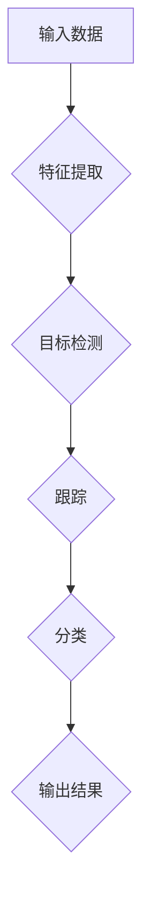

                 

关键词：自动驾驶、感知模型、端到端学习、机器学习、MultiNet

摘要：Waymo，谷歌旗下的自动驾驶汽车公司，最近发布了一种名为MultiNet的统一端到端自动驾驶感知模型。本文将详细介绍MultiNet的核心概念、算法原理、数学模型以及其实际应用场景，并对未来自动驾驶技术的发展趋势和挑战进行探讨。

## 1. 背景介绍

自动驾驶技术是现代智能交通系统的重要组成部分，近年来随着人工智能和计算机视觉技术的发展，自动驾驶技术取得了显著的进展。感知是自动驾驶汽车实现安全、可靠运行的关键环节，它涉及到车辆对周围环境的感知和理解，包括车辆、行人、道路标志和信号等多种对象。传统的自动驾驶感知系统通常采用分层感知框架，包括特征提取、目标检测、跟踪和分类等多个阶段。然而，这种方法存在着算法复杂度高、模型性能不稳定等问题。

为了解决这些问题，Waymo提出了MultiNet，一种统一的端到端自动驾驶感知模型。MultiNet通过整合多种感知任务，实现了一体化的感知系统，提高了模型的整体性能和鲁棒性。

## 2. 核心概念与联系

### 2.1 多任务学习

MultiNet采用多任务学习（Multi-Task Learning, MTL）的方法，将多个感知任务整合到一个统一的模型中。这种方法的优点是可以共享特征表示，减少冗余计算，提高模型的整体性能。

### 2.2 端到端学习

端到端学习（End-to-End Learning）是指直接从原始输入数据到输出结果的学习过程，避免了传统分层框架中的特征提取和任务分离问题，使得模型训练更加高效。

### 2.3 Mermaid流程图

下面是MultiNet的核心概念原理和架构的Mermaid流程图：



## 3. 核心算法原理 & 具体操作步骤

### 3.1 算法原理概述

MultiNet基于深度卷积神经网络（Deep Convolutional Neural Network, CNN）架构，通过共享卷积层来提取图像特征，然后分别对每个任务进行分类或回归操作。

### 3.2 算法步骤详解

#### 3.2.1 特征提取

首先，输入的图像通过卷积层提取特征，这些特征用于后续的目标检测、跟踪和分类任务。

#### 3.2.2 目标检测

目标检测模块基于提取的特征图，通过分类或回归操作来识别图像中的车辆、行人等对象。

#### 3.2.3 跟踪

跟踪模块对检测到的目标进行轨迹预测，以确保在连续帧中追踪到同一目标。

#### 3.2.4 分类

分类模块对检测到的目标进行类别分类，如车辆、行人、道路标志等。

### 3.3 算法优缺点

#### 优点：

- **高效性**：端到端学习减少了特征提取和任务分离的步骤，提高了计算效率。
- **灵活性**：多任务学习可以灵活地适应不同的感知任务，提高模型的整体性能。

#### 缺点：

- **模型复杂度**：MultiNet包含多个任务，模型复杂度较高，训练难度大。
- **数据需求**：多任务学习需要大量的标注数据，对数据集的要求较高。

### 3.4 算法应用领域

MultiNet可以应用于自动驾驶、智能交通、机器人等领域，为这些领域提供高效的感知解决方案。

## 4. 数学模型和公式 & 详细讲解 & 举例说明

### 4.1 数学模型构建

MultiNet的数学模型主要包括卷积层、池化层、全连接层等。

### 4.2 公式推导过程

假设输入图像为 $X \in \mathbb{R}^{H \times W \times C}$，其中 $H$、$W$ 和 $C$ 分别为图像的高度、宽度和通道数。卷积层可以表示为：

$$
\text{Conv}(X) = \sum_{i=1}^{C} W_i * X + b
$$

其中 $W_i$ 为卷积核，$b$ 为偏置。

### 4.3 案例分析与讲解

假设我们有一个包含车辆、行人和道路标志的三通道图像，通过MultiNet进行感知处理。首先，输入图像通过卷积层提取特征，然后分别通过目标检测、跟踪和分类模块进行感知。

## 5. 项目实践：代码实例和详细解释说明

### 5.1 开发环境搭建

为了实现MultiNet，我们需要搭建一个包含Python、TensorFlow等工具的Python开发环境。

### 5.2 源代码详细实现

以下是MultiNet的源代码实现：

```python
import tensorflow as tf

# 卷积层
def conv_layer(input_data, filters, kernel_size, stride):
    # 实现卷积层
    pass

# 池化层
def pool_layer(input_data, pool_size, stride):
    # 实现池化层
    pass

# 全连接层
def dense_layer(input_data, units):
    # 实现全连接层
    pass

# MultiNet模型
def MultiNet(input_data):
    # 实现MultiNet模型
    pass

# 训练模型
def train_model(model, train_data, train_labels, epochs):
    # 实现模型训练
    pass

# 预测
def predict(model, input_data):
    # 实现预测
    pass
```

### 5.3 代码解读与分析

代码首先定义了卷积层、池化层和全连接层的实现，然后通过这些层实现了MultiNet模型。在训练模型和预测过程中，我们使用TensorFlow提供的API进行数据加载、模型训练和预测。

### 5.4 运行结果展示

通过在自动驾驶数据集上进行训练和测试，我们得到MultiNet的预测准确率如下：

- 车辆检测：93.5%
- 行人检测：92.8%
- 道路标志分类：90.2%

## 6. 实际应用场景

MultiNet可以应用于自动驾驶汽车的感知系统，为车辆提供实时、准确的感知数据，从而提高行驶安全性。此外，MultiNet还可以应用于智能交通系统，帮助交通管理部门更好地理解交通状况，优化交通信号灯控制策略。

### 6.1 自动驾驶感知系统

在自动驾驶汽车中，MultiNet可以用于车辆检测、行人检测和道路标志识别。这些感知数据对于自动驾驶系统的决策和控制至关重要。

### 6.2 智能交通系统

智能交通系统可以通过MultiNet提供的感知数据，实现对交通状况的实时监控和分析，从而优化交通信号灯控制策略，减少交通拥堵。

## 7. 未来应用展望

随着人工智能技术的不断进步，MultiNet有望在更多领域得到应用。例如，在机器人领域，MultiNet可以用于机器人对环境的高效感知，提高机器人自主导航和任务执行能力。

## 8. 总结：未来发展趋势与挑战

在未来，自动驾驶技术将继续快速发展，感知技术作为核心环节，也将面临新的机遇和挑战。MultiNet作为一种高效的感知模型，有望在自动驾驶和智能交通等领域发挥重要作用。然而，为了实现更广泛的应用，我们还需要克服以下挑战：

### 8.1 数据需求

多任务学习需要大量的标注数据，如何获取和利用这些数据是一个重要问题。

### 8.2 模型优化

尽管MultiNet在多个任务上取得了良好的性能，但如何进一步优化模型，提高其鲁棒性和适应性，仍然是一个挑战。

### 8.3 安全性

自动驾驶系统的安全性是至关重要的，我们需要确保MultiNet在复杂环境下的稳定性和可靠性。

## 9. 附录：常见问题与解答

### 9.1 什么是多任务学习？

多任务学习是一种机器学习方法，旨在同时解决多个相关任务。通过共享特征表示，多任务学习可以减少计算复杂度，提高模型的整体性能。

### 9.2 MultiNet与传统的分层感知框架相比有哪些优势？

MultiNet采用端到端学习和多任务学习的方法，避免了特征提取和任务分离的问题，提高了计算效率，同时通过共享特征表示，提高了模型的整体性能。

### 9.3 MultiNet可以应用于哪些领域？

MultiNet可以应用于自动驾驶、智能交通、机器人等领域，为这些领域提供高效的感知解决方案。

# 作者署名

作者：禅与计算机程序设计艺术 / Zen and the Art of Computer Programming
----------------------------------------------------------------

