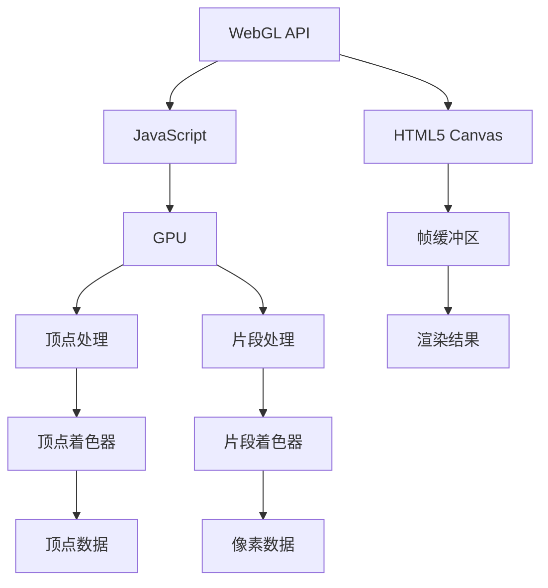

                 

### 关键词 Keywords
WebGL, 3D图形渲染，浏览器技术，图形处理，计算机图形学，WebGL API，硬件加速，跨平台开发，性能优化，虚拟现实，增强现实。

### 摘要 Summary
本文旨在探讨WebGL在现代Web开发中的应用，详细解析其在浏览器中实现3D图形渲染的原理、技术及实际操作。通过对WebGL核心概念、算法原理、数学模型、项目实践等方面的深入分析，帮助读者全面了解WebGL的工作机制和开发技巧，为Web3D开发的未来应用提供理论基础和实战指导。

## 1. 背景介绍

### WebGL的起源与普及

WebGL（Web Graphics Library）是一种基于JavaScript的API，用于在Web浏览器中实现3D图形渲染。WebGL的起源可以追溯到2009年，当时Google与Mozilla合作，将OpenGL ES图形标准引入到Web环境中。这一举措打破了浏览器图形渲染的传统界限，使得开发者可以在网页上创建复杂的3D图形和动画。

随着时间的推移，WebGL逐渐得到了广泛的应用和推广。如今，几乎所有的现代浏览器都支持WebGL，这使得Web3D开发变得前所未有的简单和普及。WebGL的普及不仅推动了Web技术的发展，也为虚拟现实（VR）和增强现实（AR）等新兴技术的崛起提供了坚实的基础。

### WebGL的重要性

WebGL的重要性体现在多个方面：

1. **跨平台支持**：WebGL是一种跨平台的图形API，可以在不同的操作系统和设备上运行，无需安装额外的软件或插件。
2. **硬件加速**：WebGL利用了现代浏览器的硬件加速功能，使得3D图形渲染更加高效和流畅。
3. **丰富的功能**：WebGL提供了丰富的图形处理功能，如着色器编程、纹理映射、光照效果等，使得开发者可以创建高度逼真的3D场景。
4. **与HTML5结合**：WebGL与HTML5等其他Web标准紧密结合，可以方便地与Web页面中的其他元素交互，构建更为复杂的Web应用。

### Web开发中的3D图形需求

随着互联网技术的不断进步，用户对Web应用的要求越来越高。3D图形成为许多Web应用的关键组成部分，例如：

- **在线游戏**：在线游戏通常需要复杂的3D场景和动画效果，WebGL为这些应用提供了强大的图形渲染能力。
- **虚拟现实（VR）**：虚拟现实应用依赖于高质量的3D渲染技术，WebGL使得VR内容的创建和浏览变得更加容易。
- **增强现实（AR）**：增强现实应用需要实时渲染3D图形并与现实世界进行交互，WebGL在这一领域的应用潜力巨大。
- **3D建模与设计**：许多Web应用需要提供3D建模和设计功能，WebGL为这些应用提供了强大的工具支持。

总之，WebGL在Web开发中的重要性不言而喻。它不仅为开发者提供了丰富的功能，也为用户带来了更为丰富的交互体验。随着Web技术的不断演进，WebGL的应用前景将更加广阔。

## 2. 核心概念与联系

### WebGL的基本概念

WebGL是Web浏览器中的一个图形API，它允许开发者使用JavaScript和HTML5在网页中实现3D图形渲染。要理解WebGL的工作原理，首先需要了解几个核心概念：

- **渲染管线（Rendering Pipeline）**：渲染管线是图形处理的核心部分，它定义了图形从输入到最终输出的整个过程。WebGL的渲染管线包括顶点处理、顶点着色器、片段处理、片段着色器等阶段。
- **着色器（Shaders）**：着色器是运行在GPU（图形处理器）上的小脚本，用于执行图形处理的特定任务。WebGL主要使用顶点着色器和片段着色器，前者处理顶点信息，后者处理像素信息。
- **纹理（Textures）**：纹理是用于在3D物体表面应用图像的工具。纹理映射技术可以将图像映射到3D物体上，从而增加细节和真实感。
- **帧缓冲区（Framebuffer）**：帧缓冲区是一个存储渲染结果的内存区域。WebGL使用帧缓冲区来存储和渲染最终的图像。

### WebGL的工作流程

WebGL的工作流程可以分为以下几个主要步骤：

1. **初始化渲染管线**：开发者需要设置渲染管线的基本参数，如视图矩阵、投影矩阵等。
2. **创建着色器**：开发者编写顶点着色器和片段着色器，并将其编译为GPU可执行的代码。
3. **设置顶点数据**：开发者将3D物体的顶点数据发送到GPU，以便进行渲染。
4. **设置纹理**：如果需要，开发者可以将纹理上传到GPU，并将其映射到3D物体上。
5. **渲染**：调用WebGL的渲染函数，执行渲染管线，生成最终的3D图像。

### WebGL与其他图形API的比较

WebGL与其他图形API（如DirectX和OpenGL）在功能上有很多相似之处，但也有一些显著的区别：

- **平台兼容性**：WebGL是Web标准的组成部分，可以在所有主流浏览器上运行，而DirectX和OpenGL主要在Windows操作系统上使用。
- **硬件加速**：WebGL利用了浏览器的硬件加速功能，这使得渲染效率非常高。相比之下，DirectX和OpenGL虽然在渲染性能上更强，但通常需要安装额外的驱动程序。
- **开发环境**：WebGL的开发环境相对简单，只需要一个浏览器即可进行开发。而DirectX和OpenGL的开发则需要专门的开发环境和工具。

总的来说，WebGL凭借其跨平台、硬件加速和简单易用的特点，成为了Web3D开发的首选工具。尽管它可能在某些性能指标上不如DirectX和OpenGL，但在Web开发领域，WebGL的优势是显而易见的。

### WebGL的架构

为了更深入地理解WebGL，下面我们将使用Mermaid流程图来展示其核心架构和流程。



上述流程图中，WebGL API通过HTML5 Canvas与JavaScript交互，将图形渲染任务提交给GPU。GPU执行顶点处理和片段处理，分别通过顶点着色器和片段着色器处理顶点数据和像素数据，最后将渲染结果存储在帧缓冲区中，并通过Canvas显示出来。

通过上述核心概念和流程的介绍，我们为读者提供了一个全面的WebGL概述。在接下来的章节中，我们将进一步探讨WebGL的算法原理、数学模型以及实际项目实践，帮助读者更深入地了解WebGL的应用和开发技巧。

## 3. 核心算法原理 & 具体操作步骤

### 3.1 算法原理概述

WebGL的核心算法原理主要包括渲染管线的工作机制、着色器的编程模型以及3D图形的基本数学运算。以下是这些核心算法的简要概述：

1. **渲染管线（Rendering Pipeline）**：渲染管线是图形渲染的基本流程，包括顶点处理、顶点着色器、顶点布局、输入装配、变换、裁剪、视口变换、片段处理、片段着色器、输出合并等阶段。每个阶段都对图形数据进行处理，最终生成渲染结果。

2. **着色器（Shaders）**：着色器是运行在GPU上的小脚本，用于执行特定的图形处理任务。WebGL主要使用顶点着色器和片段着色器。顶点着色器处理顶点数据，片段着色器处理像素数据，两者通过着色器程序进行组合和调用。

3. **3D数学运算**：3D图形渲染涉及大量的数学运算，如矩阵变换、向量运算、透视除法、光照计算等。这些数学运算对于图形的渲染效果至关重要，是3D图形的基础。

### 3.2 算法步骤详解

#### 3.2.1 渲染管线的工作流程

1. **顶点处理**：顶点处理包括顶点的输入装配和顶点数据到顶点缓冲区的传输。WebGL通过`gl.bufferData`函数将顶点数据上传到GPU。

2. **顶点着色器**：顶点着色器负责对顶点数据进行处理，如变换、光照计算等。开发者需要编写顶点着色器代码，并通过`gl.shaderSource`和`gl.compileShader`函数编译和上传到GPU。

3. **顶点布局**：顶点布局定义了顶点数据在顶点缓冲区中的布局方式，如位置、颜色、纹理坐标等。通过`gl.vertexAttribPointer`函数设置顶点属性指针。

4. **输入装配**：输入装配将顶点数据从顶点缓冲区传递到顶点着色器。这一步骤通常由GPU硬件自动完成。

5. **变换**：变换包括模型变换、视图变换和投影变换。模型变换定义物体的位置和方向，视图变换定义观察者的位置和方向，投影变换将3D空间映射到2D屏幕空间。

6. **裁剪**：裁剪用于去除不在视图范围内的图形，如背面向外的面、超出屏幕的顶点等。裁剪后的图形将传递给视口变换阶段。

7. **视口变换**：视口变换将裁剪后的图形映射到屏幕上的特定区域。

8. **片段处理**：片段处理包括片段着色器和像素操作。片段着色器处理像素数据，如颜色计算、纹理映射等。

9. **输出合并**：输出合并将片段着色器的输出合并到帧缓冲区中，生成最终的渲染结果。

#### 3.2.2 着色器编程模型

1. **顶点着色器**：顶点着色器通常用于处理顶点位置、变换和光照等。其主要功能是将顶点从模型空间转换为屏幕空间，并计算顶点的光照效果。

2. **片段着色器**：片段着色器主要用于处理像素颜色、纹理映射和光照计算等。它接收顶点着色器的输出，并生成最终的像素颜色。

3. **着色器程序**：着色器程序是顶点着色器和片段着色器的组合。通过`gl.createProgram`、`gl.attachShader`、`gl.linkProgram`函数创建和链接着色器程序。

4. **变量传递**：着色器程序中的变量可以通过`gl.uniformXXX`函数传递。例如，可以通过`gl.uniformMatrix4fv`函数传递矩阵变量，通过`gl.uniform3fv`函数传递向量变量。

#### 3.2.3 3D数学运算

1. **矩阵变换**：矩阵变换用于将顶点从一种坐标系转换为另一种坐标系。常用的矩阵变换包括模型变换矩阵（M）、视图变换矩阵（V）和投影变换矩阵（P）。矩阵变换公式如下：

   \[
   \begin{bmatrix}
   x' \\
   y' \\
   z' \\
   1
   \end{bmatrix}
   =
   \begin{bmatrix}
   M & 0 & 0 & 0 \\
   0 & M & 0 & 0 \\
   0 & 0 & M & 0 \\
   t_x & t_y & t_z & 1
   \end{bmatrix}
   \begin{bmatrix}
   x \\
   y \\
   z \\
   1
   \end{bmatrix}
   \]

2. **透视除法**：透视除法用于将投影后的顶点坐标从齐次坐标转换为标准坐标。透视除法公式如下：

   \[
   \begin{bmatrix}
   x' \\
   y' \\
   z' \\
   w'
   \end{bmatrix}
   =
   \begin{bmatrix}
   x \\
   y \\
   z \\
   1
   \end{bmatrix}
   \div
   w
   \]

3. **向量运算**：向量运算包括向量的加法、减法、点积和叉积等。向量运算用于计算顶点之间的距离、光照方向等。

4. **光照计算**：光照计算用于模拟光照对物体表面的影响。常用的光照模型包括漫反射光照和镜面反射光照。光照计算公式如下：

   \[
   L_i = I \times (N \cdot L) / (N \cdot L + K_d + K_s)
   \]

   其中，\(L_i\)是光照强度，\(I\)是光照强度，\(N\)是法向量，\(L\)是光照方向，\(K_d\)和\(K_s\)分别是漫反射系数和镜面反射系数。

### 3.3 算法优缺点

#### 优点

1. **跨平台支持**：WebGL可以在所有支持WebGL的浏览器上运行，无需安装额外的插件或软件。
2. **硬件加速**：WebGL利用了现代浏览器的硬件加速功能，使得3D图形渲染更加高效和流畅。
3. **简单易用**：WebGL通过JavaScript和HTML5实现，开发环境相对简单，开发者可以快速上手。
4. **丰富的功能**：WebGL提供了丰富的图形处理功能，如纹理映射、光照效果、阴影等，可以满足各种复杂场景的需求。

#### 缺点

1. **性能限制**：与专业的图形API（如DirectX和OpenGL）相比，WebGL在某些性能指标上可能存在一定的差距。
2. **浏览器兼容性问题**：虽然大多数现代浏览器都支持WebGL，但仍然存在一些兼容性问题，需要开发者进行额外的测试和优化。
3. **学习曲线**：WebGL涉及到3D图形的数学和编程知识，对于初学者可能有一定难度。

### 3.4 算法应用领域

WebGL的应用领域非常广泛，以下是一些典型的应用场景：

1. **在线游戏**：WebGL可以用于开发各种在线游戏，如策略游戏、角色扮演游戏等。
2. **虚拟现实（VR）**：WebGL是许多VR应用的关键技术，可以用于创建高度逼真的虚拟环境。
3. **增强现实（AR）**：WebGL可以用于开发AR应用，如实时叠加3D模型到现实世界中。
4. **3D建模与设计**：WebGL可以用于在线3D建模和设计工具，如3D建模网站和CAD软件。
5. **科学可视化**：WebGL可以用于科学计算和可视化，如流体模拟、分子结构展示等。

总之，WebGL凭借其跨平台、硬件加速和简单易用的特点，在多个领域都有着广泛的应用。随着Web技术的不断进步，WebGL的应用前景将更加广阔。

## 4. 数学模型和公式 & 详细讲解 & 举例说明

### 4.1 数学模型构建

在WebGL中，3D图形渲染的数学模型主要包括以下几个方面：

1. **坐标系统**：WebGL使用右手坐标系，其中X轴指向右侧，Y轴指向上方，Z轴指向屏幕外部。
2. **向量运算**：向量运算包括向量的加法、减法、点积和叉积等，用于计算顶点之间的距离、光照方向等。
3. **矩阵变换**：矩阵变换用于将顶点从一种坐标系转换为另一种坐标系，如模型变换、视图变换和投影变换。
4. **光照模型**：光照模型用于模拟光照对物体表面的影响，包括漫反射光照和镜面反射光照。

### 4.2 公式推导过程

以下是几个关键的数学公式的推导过程：

#### 4.2.1 投影变换矩阵

投影变换矩阵将3D空间中的顶点映射到2D屏幕空间。最常用的投影变换是正交投影和透视投影。

1. **正交投影**：正交投影矩阵公式如下：

   \[
   P_{orth} =
   \begin{bmatrix}
   1 & 0 & 0 & 0 \\
   0 & 1 & 0 & 0 \\
   0 & 0 & 1 & 0 \\
   -\frac{width}{2} & -\frac{height}{2} & -\frac{depth}{2} & 1
   \end{bmatrix}
   \]

   其中，\(width\)、\(height\)和\(depth\)分别是视图空间的宽、高和深度。

2. **透视投影**：透视投影矩阵公式如下：

   \[
   P_{persp} =
   \begin{bmatrix}
   \frac{2f}{w} & 0 & 0 & 0 \\
   0 & \frac{2f}{h} & 0 & 0 \\
   0 & 0 & \frac{z_{far}}{z_{far} - z_{near}} & -1 \\
   0 & 0 & \frac{z_{near} z_{far}}{z_{far} - z_{near}} & 0
   \end{bmatrix}
   \]

   其中，\(f\)是焦距，\(w\)和\(h\)分别是视图空间的宽和高，\(z_{near}\)和\(z_{far}\)分别是近剪切面和远剪切面。

#### 4.2.2 光照模型

1. **漫反射光照**：漫反射光照公式如下：

   \[
   L_{diffuse} = I \times (N \cdot L) / (N \cdot L + K_d)
   \]

   其中，\(L_{diffuse}\)是漫反射光照强度，\(I\)是光照强度，\(N\)是法向量，\(L\)是光照方向，\(K_d\)是漫反射系数。

2. **镜面反射光照**：镜面反射光照公式如下：

   \[
   L_{specular} = I \times (V \cdot R)^n / (V \cdot R + K_s)
   \]

   其中，\(L_{specular}\)是镜面反射光照强度，\(I\)是光照强度，\(V\)是观察向量，\(R\)是反射向量，\(n\)是镜面反射指数，\(K_s\)是镜面反射系数。

### 4.3 案例分析与讲解

#### 4.3.1 简单的3D立方体渲染

以下是一个简单的3D立方体渲染案例，用于展示WebGL的数学模型和公式应用。

1. **顶点数据**：立方体的顶点数据如下：

   \[
   vertices = [
     -1, -1, 1, 1, -1, 1, 1, 1, 1, -1, 1, -1,
     -1, -1, -1, 1, -1, -1, 1, 1, -1, -1, 1, -1,
     -1, 1, -1, 1, 1, -1, 1, 1, 1, 1, 1, -1,
     -1, 1, 1, 1, 1, 1, 1, 1, 1, 1, 1, 1
   ]
   \]

2. **着色器代码**：顶点着色器和片段着色器代码如下：

   ```glsl
   // 顶点着色器
   attribute vec3 aPosition;
   uniform mat4 uModel;
   uniform mat4 uView;
   uniform mat4 uProjection;
   void main() {
     gl_Position = uProjection * uView * uModel * vec4(aPosition, 1.0);
   }

   // 片段着色器
   precision mediump float;
   uniform vec3 uLightPosition;
   uniform vec3 uLightColor;
   uniform vec3 uMaterialColor;
   void main() {
     vec3 L = normalize(uLightPosition - gl_FragCoord.xyz);
     vec3 N = normalize(normalMatrix * aNormal);
     float diff = dot(L, N);
     vec3 R = reflect(-L, N);
     vec3 V = normalize(-gl_FragCoord.xyz);
     float spec = pow(max(dot(V, R), 0.0), 32.0);
     gl_FragColor = vec4(uLightColor * uMaterialColor * diff + vec3(0.3), 1.0);
   }
   ```

3. **渲染流程**：首先，设置渲染管线和着色器程序。然后，上传顶点数据和着色器代码到GPU。最后，调用`gl.drawArrays`函数进行渲染。

通过上述案例，我们可以看到WebGL中的数学模型和公式在实际应用中的具体应用。这些数学模型和公式对于渲染高质量的3D图形至关重要，是WebGL开发的基础。

## 5. 项目实践：代码实例和详细解释说明

### 5.1 开发环境搭建

要开始使用WebGL进行开发，首先需要搭建一个合适的环境。以下是搭建WebGL开发环境的基本步骤：

1. **安装浏览器**：确保你的浏览器支持WebGL。目前几乎所有现代浏览器都支持WebGL，如Chrome、Firefox、Edge等。
2. **安装开发工具**：推荐使用Visual Studio Code或WebStorm等代码编辑器。这些编辑器提供了丰富的插件和功能，可以大大提高开发效率。
3. **设置WebGL项目**：创建一个新的HTML文件，并添加基本的HTML和JavaScript代码。以下是示例代码：

   ```html
   <!DOCTYPE html>
   <html lang="en">
   <head>
       <meta charset="UTF-8">
       <meta name="viewport" content="width=device-width, initial-scale=1.0">
       <title>WebGL Project</title>
   </head>
   <body>
       <canvas id="canvas"></canvas>
       <script src="main.js"></script>
   </body>
   </html>
   ```

4. **编写JavaScript代码**：在`main.js`文件中编写WebGL的代码。以下是示例代码：

   ```javascript
   const canvas = document.getElementById('canvas');
   const gl = canvas.getContext('webgl');

   if (!gl) {
       alert('WebGL not supported');
   }

   // 设置画布尺寸
   canvas.width = window.innerWidth;
   canvas.height = window.innerHeight;

   // 配置渲染管线
   gl.clearColor(0.0, 0.0, 0.0, 1.0);
   gl.clearDepth(1.0);
   gl.enable(gl.DEPTH_TEST);
   gl.depthFunc(gl.LEQUAL);

   // 设置视口
   gl.viewport(0, 0, canvas.width, canvas.height);

   // 编写更多 WebGL 代码...
   ```

### 5.2 源代码详细实现

以下是实现一个简单的WebGL项目——3D立方体的源代码，包括顶点数据、着色器代码和渲染流程。

```javascript
// 顶点数据
const vertices = [
  -1, -1, 1, 1, -1, 1, 1, 1, 1, -1, 1, -1,
  -1, -1, -1, 1, -1, -1, 1, 1, -1, -1, 1, -1,
  -1, 1, -1, 1, 1, -1, 1, 1, 1, 1, 1, -1,
  -1, 1, 1, 1, 1, 1, 1, 1, 1, 1, 1, 1
];

// 创建顶点缓冲区
const vertexBuffer = gl.createBuffer();
gl.bindBuffer(gl.ARRAY_BUFFER, vertexBuffer);
gl.bufferData(gl.ARRAY_BUFFER, new Float32Array(vertices), gl.STATIC_DRAW);

// 创建着色器程序
const vertexShaderSource = `
  attribute vec3 aPosition;
  uniform mat4 uModel;
  uniform mat4 uView;
  uniform mat4 uProjection;
  void main() {
    gl_Position = uProjection * uView * uModel * vec4(aPosition, 1.0);
  }
`;

const fragmentShaderSource = `
  precision mediump float;
  uniform vec3 uLightPosition;
  uniform vec3 uLightColor;
  uniform vec3 uMaterialColor;
  void main() {
    vec3 L = normalize(uLightPosition - gl_FragCoord.xyz);
    vec3 N = normalize(-gl_FragCoord.xyz);
    float diff = dot(L, N);
    gl_FragColor = vec4(uLightColor * uMaterialColor * diff, 1.0);
  }
`;

function loadShader(type, source) {
  const shader = gl.createShader(type);
  gl.shaderSource(shader, source);
  gl.compileShader(shader);
  if (!gl.getShaderParameter(shader, gl.COMPILE_STATUS)) {
    console.error('Error compiling shader:', gl.getShaderInfoLog(shader));
    gl.deleteShader(shader);
    return null;
  }
  return shader;
}

const vertexShader = loadShader(gl.VERTEX_SHADER, vertexShaderSource);
const fragmentShader = loadShader(gl.FRAGMENT_SHADER, fragmentShaderSource);

const shaderProgram = gl.createProgram();
gl.attachShader(shaderProgram, vertexShader);
gl.attachShader(shaderProgram, fragmentShader);
gl.linkProgram(shaderProgram);

if (!gl.getProgramParameter(shaderProgram, gl.LINK_STATUS)) {
  console.error('Error linking shader program:', gl.getProgramInfoLog(shaderProgram));
}

gl.useProgram(shaderProgram);

// 设置顶点属性指针
const positionAttributeLocation = gl.getAttribLocation(shaderProgram, 'aPosition');
gl.bindBuffer(gl.ARRAY_BUFFER, vertexBuffer);
gl.enableVertexAttribArray(positionAttributeLocation);
gl.vertexAttribPointer(positionAttributeLocation, 3, gl.FLOAT, false, 0, 0);

// 设置着色器程序中的uniform变量
const modelLocation = gl.getUniformLocation(shaderProgram, 'uModel');
const viewLocation = gl.getUniformLocation(shaderProgram, 'uView');
const projectionLocation = gl.getUniformLocation(shaderProgram, 'uProjection');
const lightLocation = gl.getUniformLocation(shaderProgram, 'uLightPosition');
const colorLocation = gl.getUniformLocation(shaderProgram, 'uLightColor');
const materialColorLocation = gl.getUniformLocation(shaderProgram, 'uMaterialColor');

// 设置模型、视图和投影矩阵
const modelMatrix = mat4.create();
const viewMatrix = mat4.create();
const projectionMatrix = mat4.create();
mat4.perspective(projectionMatrix, glMatrix.toRadian(45), canvas.width / canvas.height, 0.1, 100.0);
mat4.lookAt(viewMatrix, [0, 0, -5], [0, 0, 0], [0, 1, 0]);

// 设置光照参数
const lightPosition = [0, 0, 5];
const lightColor = [1, 1, 1];
const materialColor = [0.5, 0.5, 0.5];

gl.uniformMatrix4fv(modelLocation, false, modelMatrix);
gl.uniformMatrix4fv(viewLocation, false, viewMatrix);
gl.uniformMatrix4fv(projectionLocation, false, projectionMatrix);
gl.uniform3fv(lightLocation, lightPosition);
gl.uniform3fv(colorLocation, lightColor);
gl.uniform3fv(materialColorLocation, materialColor);

// 渲染
function render() {
  gl.clear(gl.COLOR_BUFFER_BIT | gl.DEPTH_BUFFER_BIT);
  gl.drawArrays(gl.TRIANGLES, 0, vertices.length / 3);

  requestAnimationFrame(render);
}

requestAnimationFrame(render);
```

### 5.3 代码解读与分析

上述代码实现了一个简单的WebGL项目——3D立方体渲染。以下是代码的关键部分及其解释：

1. **顶点数据**：顶点数据定义了一个立方体的顶点坐标，每个顶点由三个浮点数表示。
2. **顶点缓冲区**：使用`gl.createBuffer`创建顶点缓冲区，使用`gl.bindBuffer`绑定顶点缓冲区，并使用`gl.bufferData`上传顶点数据到GPU。
3. **着色器程序**：使用`loadShader`函数加载并编译顶点着色器和片段着色器，使用`gl.createProgram`创建着色器程序，使用`gl.attachShader`和`gl.linkProgram`链接着色器程序。
4. **顶点属性指针**：使用`gl.enableVertexAttribArray`和`gl.vertexAttribPointer`设置顶点属性指针，指定顶点数据在缓冲区中的布局。
5. **uniform变量设置**：使用`gl.getUniformLocation`获取着色器程序中的uniform变量地址，并使用`gl.uniformMatrix4fv`、`gl.uniform3fv`等函数设置uniform变量的值。
6. **渲染流程**：调用`gl.clear`清空画布，调用`gl.drawArrays`进行渲染，使用`requestAnimationFrame`实现连续渲染。

通过这个简单的案例，我们可以看到WebGL的基本操作步骤和关键API。在实际项目中，你可能需要处理更复杂的场景，如加载纹理、实现动画效果等。但无论项目多么复杂，其核心原理和操作步骤都是一致的。

### 5.4 运行结果展示

当上述代码运行后，浏览器中会显示一个简单的3D立方体。立方体位于坐标原点，光照从屏幕外部照射到立方体上。通过调整模型、视图和投影矩阵，可以改变立方体的位置、方向和视角。此外，通过修改光照参数，可以改变立方体的光照效果。

运行结果展示了一个WebGL项目的初步实现，它展示了如何使用WebGL API在浏览器中渲染3D图形。这是WebGL应用的第一步，通过进一步学习和实践，你可以创建出更多复杂和精美的3D场景。

## 6. 实际应用场景

WebGL技术不仅在理论层面具有强大功能，而且在实际应用场景中也展现了其广泛的应用潜力。以下是一些典型的WebGL应用场景，以及其独特优势和挑战。

### 6.1 在线游戏

WebGL是许多在线游戏开发的关键技术，它使得浏览器成为了一个强大的游戏平台。WebGL支持高质量的3D图形渲染，可以提供流畅的游戏体验。例如，游戏《3Dland》就是一个利用WebGL开发的在线游戏，它提供了丰富的3D场景和动画效果，吸引了大量玩家。

优势：
- **跨平台支持**：WebGL使得游戏可以跨平台运行，无需安装额外的客户端。
- **硬件加速**：WebGL利用硬件加速功能，提高了游戏渲染效率。
- **丰富的图形效果**：WebGL提供了丰富的图形处理功能，可以创建复杂的3D场景和动画。

挑战：
- **性能优化**：由于WebGL在不同设备和浏览器上的性能差异，开发者需要针对不同平台进行性能优化。
- **兼容性问题**：虽然大多数浏览器都支持WebGL，但仍需考虑低版本浏览器和不支持WebGL的设备。

### 6.2 虚拟现实（VR）

WebGL是VR应用的重要组成部分，它提供了强大的3D渲染能力，使得浏览器可以成为VR内容的平台。WebVR是WebGL在VR领域的扩展，通过WebVR，开发者可以创建和浏览VR内容。

优势：
- **易于开发**：WebGL和WebVR的API相对简单，使得VR开发变得容易。
- **跨平台支持**：WebVR支持多种VR设备，如VR头盔、手机等。
- **硬件加速**：WebGL利用硬件加速，提供了流畅的VR体验。

挑战：
- **设备兼容性**：VR设备的兼容性是一个挑战，不同设备的硬件性能和传感器差异较大。
- **用户体验**：VR应用需要提供高质量的视觉体验，同时还要考虑到舒适性和眩晕感。

### 6.3 增强现实（AR）

WebGL与AR技术的结合，使得AR应用可以在浏览器中实现。AR.js是一个基于WebGL的AR库，它可以利用WebGL技术将3D模型叠加到现实世界中。

优势：
- **跨平台支持**：AR.js可以运行在各种浏览器和设备上，无需安装额外的软件。
- **易于使用**：AR.js提供了简单的API，使得AR开发变得容易。
- **丰富的内容**：WebGL提供了丰富的图形处理功能，可以创建复杂和精美的AR内容。

挑战：
- **性能优化**：AR应用需要实时渲染3D图形，对性能要求较高，需要优化渲染效率。
- **用户体验**：AR应用需要提供稳定的交互体验，同时要避免出现图像模糊、延迟等问题。

### 6.4 3D建模与设计

WebGL在3D建模和设计领域也具有广泛应用。Web应用如Sketchfab、3DBox等，都利用WebGL技术提供了强大的3D建模和设计功能。

优势：
- **跨平台支持**：WebGL使得3D建模工具可以跨平台运行，无需安装额外的软件。
- **实时预览**：WebGL提供了实时预览功能，设计师可以即时查看3D模型的效果。
- **协作与共享**：WebGL应用支持多人协作和内容共享，方便团队协作和作品展示。

挑战：
- **学习曲线**：WebGL涉及到复杂的数学和编程知识，对于初学者有一定难度。
- **性能优化**：复杂3D模型和动画对性能要求较高，需要优化渲染效率。

总的来说，WebGL在多个领域展现了其强大的应用潜力。随着Web技术的不断进步，WebGL的应用场景将越来越广泛。尽管存在一些挑战，但WebGL带来的跨平台、硬件加速和简单易用的优势，使其成为现代Web开发的重要工具。

### 6.5 未来应用展望

随着WebGL技术的不断成熟和硬件性能的提升，未来WebGL的应用前景将更加广阔。以下是一些潜在的应用方向和趋势：

1. **更高质量的3D图形**：随着WebGL 2.0的推广和硬件性能的提升，WebGL将能够实现更高质量的3D图形渲染，支持更复杂的特效和动画。
2. **更多硬件支持**：未来WebGL将支持更多的VR和AR设备，提供更丰富的交互体验。
3. **更智能的内容**：利用机器学习和AI技术，WebGL将能够提供更加智能的内容创建和渲染，如自动优化渲染性能、智能识别物体等。
4. **跨平台的游戏和娱乐**：WebGL将成为游戏和娱乐内容跨平台传输和交互的重要工具，提供高质量的在线体验。
5. **教育应用**：WebGL在教育领域具有巨大的应用潜力，可以用于虚拟实验室、3D建模教学等，为学生提供更加生动和直观的学习体验。

总的来说，WebGL技术的不断进步将为Web开发带来更多可能性，推动Web技术的持续创新和发展。

## 7. 工具和资源推荐

### 7.1 学习资源推荐

1. **WebGL 101**：[https://webglfundamentals.org/](https://webglfundamentals.org/)
   - WebGLFundamentals是一个全面的WebGL学习资源网站，提供了详细的教程、示例代码和深入的技术文章。

2. **MDN WebGL教程**：[https://developer.mozilla.org/en-US/docs/Web/API/WebGL_API/Tutorial](https://developer.mozilla.org/en-US/docs/Web/API/WebGL_API/Tutorial)
   - Mozilla Developer Network提供了全面的WebGL教程，适合初学者和进阶开发者。

3. **WebGL 2.0参考手册**：[https://www.khronos.org/webgl/wiki/WebGL2_Reference](https://www.khronos.org/webgl/wiki/WebGL2_Reference)
   - Khronos提供的WebGL 2.0参考手册，包含了WebGL 2.0的所有功能和API细节。

4. **OpenGL ES规范**：[https://www.khronos.org/opengles/](https://www.khronos.org/opengles/)
   - Khronos的OpenGL ES规范文档，是理解WebGL技术基础的宝贵资源。

### 7.2 开发工具推荐

1. **Visual Studio Code**：[https://code.visualstudio.com/](https://code.visualstudio.com/)
   - Visual Studio Code是一个功能强大的代码编辑器，提供了丰富的WebGL开发插件和调试工具。

2. **WebGL-Inspector**：[https://github.com/ocornut/webgl-Inspector](https://github.com/ocornut/webgl-Inspector)
   - WebGL-Inspector是一个开源的WebGL调试工具，可以帮助开发者调试WebGL程序，分析性能瓶颈。

3. **Blender**：[https://www.blender.org/](https://www.blender.org/)
   - Blender是一个开源的3D创作套件，可以用于创建3D模型、动画和渲染，其插件和工具支持与WebGL的集成。

4. **Three.js**：[https://threejs.org/](https://threejs.org/)
   - Three.js是一个基于WebGL的3D库，提供了丰富的3D图形和动画功能，极大地简化了WebGL开发。

### 7.3 相关论文推荐

1. **"WebGL: A Web Graphics Library for 3D Graphics on the Web"**：[https://www.khronos.org/webgl/wiki/WebGL_Part1](https://www.khronos.org/webgl/wiki/WebGL_Part1)
   - Khronos发布的关于WebGL的系列论文，详细介绍了WebGL的技术背景和设计原理。

2. **"WebGL and WebGL 2.0 APIs and Features"**：[https://www.khronos.org/webgl/wiki/WebGL_APIs_and_Features](https://www.khronos.org/webgl/wiki/WebGL_APIs_and_Features)
   - Khronos发布的文档，介绍了WebGL 1.0和WebGL 2.0的API和功能。

3. **"A Survey of Web Graphics APIs"**：[https://www.ics.uci.edu/~vbala6/papers/webgraphics.pdf](https://www.ics.uci.edu/~vbala6/papers/webgraphics.pdf)
   - 这篇论文对多个Web图形API进行了详细的比较和分析，包括WebGL、Canvas等。

通过上述资源和工具，开发者可以更好地学习和掌握WebGL技术，为Web3D开发打下坚实的基础。

## 8. 总结：未来发展趋势与挑战

### 8.1 研究成果总结

WebGL技术自推出以来，取得了显著的研究成果和应用进展。在过去的几年中，WebGL 2.0的发布为开发者提供了更丰富的图形功能和更好的性能。此外，WebVR和AR.js等扩展技术的出现，使得WebGL在虚拟现实（VR）和增强现实（AR）领域展现了巨大的潜力。随着硬件性能的提升和Web技术的进步，WebGL在3D图形渲染、游戏开发、教育应用等多个领域得到了广泛应用。

### 8.2 未来发展趋势

1. **更高的图形性能**：随着硬件技术的发展，GPU性能不断提升，WebGL将能够支持更复杂的图形渲染和更高的帧率，为用户带来更加流畅的体验。

2. **更广泛的硬件支持**：未来WebGL将在更多设备上得到支持，包括各种VR头盔、AR眼镜以及移动设备。这将为WebGL的应用场景带来更多的可能性。

3. **智能内容创建与交互**：利用人工智能和机器学习技术，WebGL将能够实现更加智能的内容创建和交互，如自动优化渲染性能、智能识别物体等。

4. **更多的开发工具和库**：随着WebGL的普及，将会有更多的开发工具和库出现，进一步简化WebGL开发过程，提高开发效率。

5. **跨平台的3D游戏与娱乐**：WebGL将成为跨平台游戏和娱乐内容的重要技术，为用户带来高质量、无缝的在线体验。

### 8.3 面临的挑战

1. **性能优化**：虽然硬件性能不断提升，但不同设备和浏览器之间的性能差异仍然是一个挑战。开发者需要针对不同平台进行性能优化，以确保最佳的体验。

2. **兼容性问题**：尽管大多数现代浏览器都支持WebGL，但仍然存在一些兼容性问题，特别是在低版本浏览器和不支持WebGL的设备上。

3. **学习曲线**：WebGL涉及到复杂的数学和编程知识，对于初学者来说有一定难度。如何降低学习门槛，提高开发者的效率，是一个需要解决的问题。

4. **用户体验**：在VR和AR应用中，用户体验至关重要。开发者需要确保应用的稳定性和舒适度，避免用户出现眩晕等问题。

### 8.4 研究展望

未来，WebGL技术的发展将更加注重性能优化、跨平台支持和用户体验。同时，随着AI和机器学习技术的融合，WebGL将能够实现更加智能和高效的内容创建与交互。在研究方面，可以关注以下几个方向：

1. **性能优化算法**：研究更高效、自适应的渲染算法，提高WebGL在多种硬件平台上的性能。

2. **跨平台兼容性研究**：探索新的技术方案，提高WebGL在各种设备和浏览器上的兼容性。

3. **用户交互体验优化**：研究人机交互技术，提高VR和AR应用的用户体验。

4. **AI与WebGL结合**：探索AI技术在WebGL中的应用，如智能渲染、内容识别等。

总之，WebGL技术在未来有着广阔的发展前景和应用潜力。通过不断的研究和优化，WebGL将进一步提升Web开发的能力，为用户带来更加丰富和多样化的体验。

## 9. 附录：常见问题与解答

### 9.1 什么是WebGL？

WebGL（Web Graphics Library）是一种基于JavaScript的API，用于在Web浏览器中实现3D图形渲染。它允许开发者使用HTML5 Canvas元素，通过编写JavaScript代码调用WebGL的API来创建和渲染3D图形。

### 9.2 WebGL与HTML5 Canvas有什么区别？

HTML5 Canvas是一种用于在网页中绘制2D图形的API，它允许开发者使用JavaScript绘制各种图形、文本和图像。而WebGL是一种用于在网页中实现3D图形渲染的API，它提供了更多的图形处理功能，如着色器编程、纹理映射和光照效果等。

### 9.3 WebGL支持哪些图形处理功能？

WebGL支持多种图形处理功能，包括：

- **着色器编程**：通过顶点着色器和片段着色器，开发者可以在GPU上执行自定义的图形处理任务。
- **纹理映射**：将2D图像映射到3D物体的表面，增加细节和真实感。
- **光照效果**：模拟光照对物体表面的影响，包括漫反射光照和镜面反射光照。
- **阴影处理**：生成物体的阴影，增强3D场景的真实感。
- **几何变换**：对3D物体进行旋转、平移和缩放等几何变换。
- **多边形渲染**：支持各种多边形渲染模式，如点、线、三角形等。

### 9.4 如何在WebGL中实现动画效果？

在WebGL中实现动画效果通常需要以下步骤：

1. **设置渲染循环**：使用`requestAnimationFrame`函数设置渲染循环，不断更新和渲染场景。
2. **变换矩阵**：在渲染循环中更新模型、视图和投影矩阵，实现物体的运动和旋转。
3. **更新着色器变量**：在渲染循环中更新着色器中的变量，如时间、位置等，实现动画效果。
4. **渲染**：调用`gl.clear`函数清空画布，然后调用`gl.drawArrays`或`gl.drawElements`函数进行渲染。

### 9.5 WebGL在哪些应用场景中使用？

WebGL广泛应用于多个领域，包括：

- **在线游戏**：用于开发各种在线游戏，提供高质量的3D图形渲染。
- **虚拟现实（VR）**：用于开发VR应用，提供沉浸式体验。
- **增强现实（AR）**：用于开发AR应用，将3D模型叠加到现实世界中。
- **科学可视化**：用于科学计算和可视化，如流体模拟、分子结构展示等。
- **3D建模与设计**：用于在线3D建模和设计工具，提供交互式体验。

### 9.6 WebGL的兼容性问题如何解决？

解决WebGL兼容性问题的方法包括：

- **检测浏览器支持**：使用JavaScript检测浏览器是否支持WebGL，如果不支持，提供替代方案或提示用户更新浏览器。
- **使用WebGL兼容库**：使用如Three.js等兼容库，这些库提供了统一的API，兼容不同浏览器和设备。
- **性能优化**：针对不同平台进行性能优化，如使用更高效的渲染算法、减少内存占用等。
- **测试与调试**：在不同设备和浏览器上进行测试，确保WebGL应用在各种环境下都能正常运行。

通过上述方法，可以有效地解决WebGL的兼容性问题，为用户提供稳定的体验。

