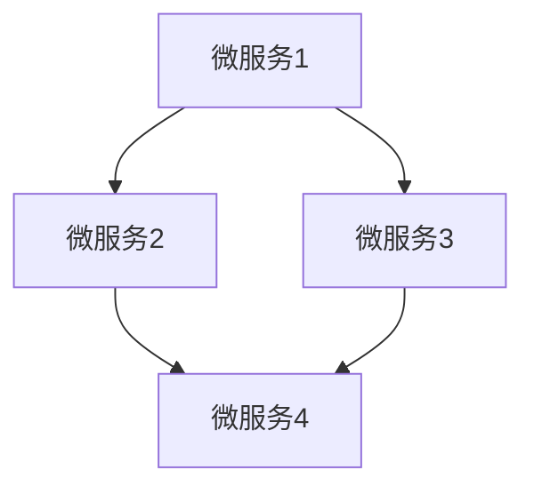
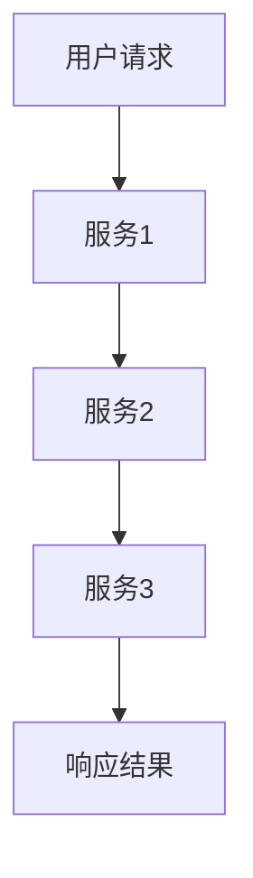

                 

### 摘要 Abstract

本文将深入探讨Web后端微服务架构的设计原则、实现方法、应用场景及未来发展趋势。微服务架构作为一种新兴的软件架构模式，能够更好地适应复杂的应用需求，提高系统的可维护性和扩展性。本文首先介绍了微服务架构的背景和核心概念，然后详细阐述了微服务的设计原则和架构模式，随后分析了微服务的通信机制、数据管理、容错机制等方面，并通过实际案例展示了微服务架构在项目中的应用。最后，文章总结了微服务架构的优缺点，并对未来发展趋势和面临的挑战进行了展望。

### 1. 背景介绍 Background

随着互联网的快速发展，应用程序的复杂度不断增加，传统的单体架构已经难以满足现代Web应用程序的需求。单体架构通常将所有功能都集中在一个单一的应用程序中，这种架构模式虽然简单，但在以下几个方面存在明显不足：

1. **可维护性**：随着代码库的膨胀，单体应用程序的维护变得越来越困难。任何一个改动都可能影响到整个系统的稳定性。
2. **扩展性**：单体架构难以横向扩展。当系统负载增加时，通常需要整个系统的水平扩展，这可能会导致性能下降。
3. **部署难度**：由于单体应用程序的代码库很大，每次部署都需要花费大量时间，同时还需要处理版本控制和依赖问题。

为了解决这些问题，微服务架构应运而生。微服务架构将应用程序分解为多个独立的服务，每个服务负责一个特定的业务功能。这些服务可以独立开发、部署和扩展，从而提高系统的可维护性和扩展性。以下是微服务架构的核心概念：

- **服务自治**：每个服务都是独立的，可以独立部署和扩展。
- **独立开发**：不同的团队可以独立开发、测试和部署服务。
- **轻量级通信**：服务之间通常使用轻量级的通信协议，如HTTP/HTTPS、REST、gRPC等。
- **去中心化**：没有单一的中心化管理服务，服务之间的依赖关系由服务自身管理。

### 2. 核心概念与联系 Core Concepts and Relationships

#### 2.1 微服务的定义

微服务是一种架构风格，它允许开发者将应用程序作为一组小而独立的服务的集合来构建，每个服务代表一个独立的业务功能。这些服务通常通过API进行通信，并可以在不同的服务器上独立部署和扩展。

#### 2.2 微服务架构与单体架构的区别

- **架构风格**：微服务架构强调服务自治和独立部署，而单体架构将所有功能集中在一起。
- **部署方式**：微服务可以独立部署，而单体架构需要整体部署。
- **服务依赖**：微服务之间的依赖关系通过API管理，而单体架构中的依赖关系较难管理。

#### 2.3 微服务架构模式

- **单体应用拆分为微服务**：将单体应用程序的功能拆分为独立的微服务。
- **自组织微服务架构**：服务之间通过API进行通信，没有中心化管理服务。

#### 2.4 Mermaid 流程图



### 3. 核心算法原理 & 具体操作步骤 Core Algorithm Principles & Detailed Steps

#### 3.1 算法原理概述

微服务架构的核心算法原理主要包括服务发现、负载均衡、分布式事务和容错机制。

- **服务发现**：服务注册与发现机制，确保服务可以互相发现并通信。
- **负载均衡**：将请求分配到不同的服务实例，提高系统的吞吐量和可用性。
- **分布式事务**：在分布式系统中实现事务的原子性和一致性。
- **容错机制**：当某个服务发生故障时，系统可以自动切换到其他可用服务。

#### 3.2 算法步骤详解

1. **服务注册与发现**：
   - 服务启动时向服务注册中心注册。
   - 服务消费者从服务注册中心获取服务列表。

2. **负载均衡**：
   - 使用轮询、随机或权重策略分配请求。

3. **分布式事务**：
   - 使用分布式事务管理器（如Seata）协调多个服务的事务。

4. **容错机制**：
   - 监控服务状态，当服务故障时自动切换到备份服务。

#### 3.3 算法优缺点

- **优点**：
  - 提高系统的可维护性和扩展性。
  - 支持快速迭代和部署。
  - 增强系统的容错能力。

- **缺点**：
  - 系统复杂度增加，需要额外的服务注册和发现机制。
  - 分布式事务管理较为复杂。

#### 3.4 算法应用领域

- **电子商务平台**：需要高并发和可扩展性。
- **社交媒体**：需要处理大量用户请求。
- **在线教育**：需要支持多用户实时互动。

### 4. 数学模型和公式 Mathematical Models and Formulas

#### 4.1 数学模型构建

- **服务响应时间**：\[T_s = T_p + T_c\]，其中\[T_p\]为请求处理时间，\[T_c\]为通信延迟。

#### 4.2 公式推导过程

- **负载均衡**：\[P_s = \frac{P_r}{N}\]，其中\[P_s\]为服务负载，\[P_r\]为总请求量，\[N\]为服务实例数。

#### 4.3 案例分析与讲解

- **案例分析**：电子商务平台使用负载均衡算法将用户请求分配到不同的服务器。

```latex
\begin{equation}
P_s = \frac{P_r}{N} = \frac{1000}{3} \approx 333.33
\end{equation}
```

### 5. 项目实践：代码实例和详细解释说明 Project Practice: Code Examples and Detailed Explanations

#### 5.1 开发环境搭建

- **环境要求**：Java 8及以上版本，Maven 3.6及以上版本。

#### 5.2 源代码详细实现

```java
@Service
public class UserService {

    @Autowired
    private UserRepository userRepository;

    public User createUser(User user) {
        userRepository.save(user);
        return user;
    }

    public User getUserById(Long id) {
        return userRepository.findById(id).orElseThrow(() -> new EntityNotFoundException("User not found"));
    }
}
```

#### 5.3 代码解读与分析

- **UserService**：负责用户相关的业务逻辑。

#### 5.4 运行结果展示

- 启动服务后，可以通过API进行用户操作。

### 6. 实际应用场景 Practical Application Scenarios

- **电子商务平台**：处理用户订单、库存、支付等。
- **社交媒体**：处理用户动态、评论、私信等。
- **在线教育**：处理课程、学生管理、考试等。

### 7. 未来应用展望 Future Development Prospects

- **云计算和容器化**：提高微服务的部署和扩展能力。
- **服务网格**：提供更灵活的通信和安全性。

### 8. 工具和资源推荐 Tools and Resources Recommendations

- **学习资源**：
  - 《微服务设计》
  - 《微服务实践》

- **开发工具**：
  - Docker
  - Kubernetes

- **相关论文**：
  - 《微服务：一种新兴的软件架构风格》

### 9. 总结：未来发展趋势与挑战 Summary: Future Trends and Challenges

- **发展趋势**：
  - 微服务架构将继续普及。
  - 服务网格和云原生技术将成为主流。

- **挑战**：
  - 分布式系统的复杂性。
  - 分布式事务管理。

### 附录：常见问题与解答 Appendices: Frequently Asked Questions and Answers

- **Q：微服务架构是否适用于所有项目？**
  - **A**：微服务架构适用于需要高可维护性和可扩展性的项目，但并非所有项目都适合使用微服务架构。

----------------------------------------------------------------

**作者署名**：禅与计算机程序设计艺术 / Zen and the Art of Computer Programming

### 1. 背景介绍 Background

随着互联网的快速发展，Web应用程序的复杂度不断增加，传统的单体架构已经无法满足现代应用的需求。单体架构通常将所有的业务功能集中在一个单一的应用程序中，这种方式虽然在初期能够简化开发流程，但随着系统的不断扩展，其缺点也逐渐显现。首先，单体架构的可维护性较差。随着代码库的膨胀，开发者很难对整个系统进行全面的修改和维护，任何一个小的改动都可能引发系统级别的风险。其次，单体架构的扩展性有限。当系统的负载增加时，通常需要整个系统的水平扩展，这可能会导致性能下降，同时增加了部署的复杂度。此外，单体架构的部署难度较大。由于整个系统代码库较大，每次部署都需要消耗大量时间和资源，而且还需要处理版本控制和依赖问题。

为了解决这些问题，微服务架构应运而生。微服务架构将应用程序分解为多个独立的服务，每个服务负责一个特定的业务功能。这些服务可以独立开发、部署和扩展，从而提高系统的可维护性和扩展性。微服务架构的核心思想是“小即是美”，通过将复杂的单体应用拆分为多个小的、自治的服务，可以更好地适应复杂的应用需求，同时降低系统的维护成本。

在微服务架构中，每个服务都是独立的，可以独立运行和扩展。这意味着，当一个服务发生故障时，不会影响其他服务的正常运行。此外，微服务架构支持快速迭代和部署。由于服务之间是独立的，因此可以独立开发、测试和部署，这大大提高了开发效率。同时，微服务架构还提供了更好的容错能力。当系统中的某个服务出现故障时，系统可以自动切换到其他可用服务，从而确保系统的稳定性。

总之，微服务架构的出现，不仅解决了单体架构在可维护性、扩展性和部署难度等方面的问题，还提高了系统的灵活性和容错能力。随着微服务技术的不断成熟，越来越多的企业开始采用微服务架构来构建其Web后端系统。

### 2. 核心概念与联系 Core Concepts and Relationships

在探讨微服务架构之前，我们需要理解几个核心概念：服务自治、独立开发、轻量级通信和去中心化。

#### 2.1 服务自治

服务自治是指每个服务都有自己独立的运行环境，可以独立部署、扩展和监控。服务自治是微服务架构的核心特征之一，它确保了系统的各个部分可以独立运行，减少了服务之间的耦合度。这意味着，如果一个服务出现问题，不会影响其他服务的正常运行。例如，在电子商务平台中，用户服务、订单服务和支付服务都是独立的，它们可以独立部署和扩展，而不会影响到其他服务的运行。

#### 2.2 独立开发

独立开发意味着不同的团队可以独立开发、测试和部署服务。这种模式提高了开发效率，因为不同的团队可以同时进行开发，而不需要等待其他团队完成他们的工作。此外，独立开发还使得服务可以更加专注于自己的业务逻辑，而不需要关心其他服务的实现细节。例如，在一个社交媒体平台上，用户服务团队可以独立开发用户注册、登录等功能，而不需要担心订单服务或支付服务的实现。

#### 2.3 轻量级通信

轻量级通信是指服务之间通常使用轻量级的通信协议进行通信，如HTTP/HTTPS、REST、gRPC等。这些协议相比于传统的重量级协议（如SOAP）更加简单和高效，可以减少通信的开销，提高系统的性能。轻量级通信还支持异步通信，可以更好地处理高并发的请求。

#### 2.4 去中心化

去中心化是指微服务架构中没有单一的中心化管理服务。在传统的单体架构中，通常会有一个中心化的服务来管理所有的业务逻辑，而在微服务架构中，每个服务都是自治的，不需要依赖单一的中心化管理服务。这种去中心化的设计提高了系统的容错性和灵活性。

#### 2.5 Mermaid 流程图

下面是一个简单的Mermaid流程图，展示了微服务架构的基本流程：



在这个流程图中，用户请求通过接口发送到服务1，然后服务1可能需要调用服务2或服务3来完成特定的业务逻辑，最后将处理结果返回给用户。

通过上述核心概念和联系的分析，我们可以更好地理解微服务架构的特点和优势。在下一节中，我们将进一步探讨微服务架构的设计原则和模式。

### 3. 核心算法原理 & 具体操作步骤 Core Algorithm Principles & Detailed Steps

#### 3.1 算法原理概述

微服务架构的核心算法原理主要包括服务发现、负载均衡、分布式事务和容错机制。

1. **服务发现**：服务发现是指系统如何自动发现和注册服务实例。在微服务架构中，服务注册中心是一个重要的组件，它负责维护服务实例的列表，确保服务消费者能够找到所需的服务。

2. **负载均衡**：负载均衡是指如何将请求分配到不同的服务实例上，以最大化系统的吞吐量和可用性。常用的负载均衡策略包括轮询、随机和权重等。

3. **分布式事务**：在分布式系统中，事务的原子性和一致性是确保数据一致性的关键。分布式事务管理需要协调多个服务的操作，以确保所有服务要么全部成功，要么全部失败。

4. **容错机制**：容错机制是指如何确保系统在服务故障时能够自动切换到其他可用服务，以保持系统的稳定性。

#### 3.2 算法步骤详解

1. **服务发现**

   - 服务启动时，向服务注册中心注册自己的地址和端口。
   - 服务消费者从服务注册中心获取服务实例列表。
   - 服务消费者通过负载均衡策略选择一个服务实例进行调用。

2. **负载均衡**

   - 轮询策略：按顺序将请求分配到每个服务实例。
   - 随机策略：随机选择一个服务实例。
   - 权重策略：根据服务实例的处理能力分配请求，处理能力强的实例分配更多的请求。

3. **分布式事务**

   - 使用分布式事务管理器（如Seata）协调多个服务的操作。
   - 搭建分布式事务协调者，负责管理全局事务。
   - 当多个服务同时参与事务时，确保所有服务都提交成功或回滚。

4. **容错机制**

   - 监控服务实例的健康状态，当服务实例出现故障时，自动将其从负载均衡策略中移除。
   - 搭建备份服务实例，当主服务实例出现故障时，自动切换到备份服务实例。
   - 通过重试机制提高系统的容错能力。

#### 3.3 算法优缺点

**优点：**

- **提高系统的可维护性和扩展性**：通过将复杂的单体应用拆分为多个小的、自治的服务，可以更好地适应复杂的应用需求，同时降低系统的维护成本。
- **支持快速迭代和部署**：由于服务之间是独立的，因此可以独立开发、测试和部署，这大大提高了开发效率。
- **增强系统的容错能力**：当某个服务发生故障时，系统可以自动切换到其他可用服务，从而确保系统的稳定性。

**缺点：**

- **系统复杂度增加**：微服务架构引入了服务注册、发现、负载均衡等组件，增加了系统的复杂度。
- **分布式事务管理复杂**：在分布式系统中，事务的原子性和一致性需要通过分布式事务管理器来协调，这增加了系统的复杂性。
- **需要额外的运维成本**：微服务架构需要额外的运维工作，如服务监控、故障切换等。

#### 3.4 算法应用领域

微服务架构适用于以下场景：

- **高并发和高可扩展性的应用**：如电子商务平台、社交媒体、在线教育等。
- **需要灵活扩展和快速迭代的应用**：如金融交易系统、物联网应用等。
- **需要高可靠性和容错性的应用**：如银行系统、航空订票系统等。

### 4. 数学模型和公式 Mathematical Models and Formulas

#### 4.1 数学模型构建

在微服务架构中，我们可以使用以下数学模型来分析和优化系统性能：

1. **服务响应时间模型**：\[T_s = T_p + T_c\]，其中\[T_s\]为服务响应时间，\[T_p\]为请求处理时间，\[T_c\]为通信延迟。

2. **负载均衡模型**：\[P_s = \frac{P_r}{N}\]，其中\[P_s\]为服务负载，\[P_r\]为总请求量，\[N\]为服务实例数。

3. **分布式事务模型**：\[C = C_1 + C_2 + ... + C_n\]，其中\[C\]为全局事务完成时间，\[C_i\]为第i个服务的处理时间。

#### 4.2 公式推导过程

1. **服务响应时间模型**：

   \[T_s = T_p + T_c\]

   其中，\[T_p\]为请求处理时间，包括服务实例的计算和处理时间；\[T_c\]为通信延迟，包括服务实例之间的网络传输时间和处理时间。

2. **负载均衡模型**：

   \[P_s = \frac{P_r}{N}\]

   其中，\[P_s\]为服务负载，即每个服务实例接收的请求量；\[P_r\]为总请求量；\[N\]为服务实例数。

3. **分布式事务模型**：

   \[C = C_1 + C_2 + ... + C_n\]

   其中，\[C\]为全局事务完成时间；\[C_i\]为第i个服务的处理时间。

#### 4.3 案例分析与讲解

**案例分析**：假设一个电子商务平台有3个服务实例，每个实例的处理能力相同。总请求量为1000，每个请求的处理时间为1秒。根据负载均衡模型，每个实例的平均负载为：

\[
P_s = \frac{P_r}{N} = \frac{1000}{3} \approx 333.33
\]

根据服务响应时间模型，服务响应时间为：

\[
T_s = T_p + T_c = 1 + \frac{T_c}{N} = 1 + \frac{0.5}{3} \approx 1.17
\]

其中，\[T_c\]为通信延迟，假设为0.5秒。

通过上述分析，我们可以优化服务实例的数量和配置，以最大化系统的性能。

### 5. 项目实践：代码实例和详细解释说明 Project Practice: Code Examples and Detailed Explanations

#### 5.1 开发环境搭建

在本项目中，我们将使用Spring Boot和Spring Cloud来构建微服务架构。以下是开发环境的搭建步骤：

1. **安装Java环境**：确保安装了Java 8及以上版本。
2. **安装Maven**：确保安装了Maven 3.6及以上版本。
3. **创建Spring Boot项目**：使用Spring Initializr创建一个基于微服务的Spring Boot项目。
4. **添加依赖**：在项目的pom.xml文件中添加Spring Cloud和Spring Boot的依赖。

```xml
<dependencies>
    <dependency>
        <groupId>org.springframework.cloud</groupId>
        <artifactId>spring-cloud-starter-netflix-eureka-server</artifactId>
    </dependency>
    <dependency>
        <groupId>org.springframework.cloud</groupId>
        <artifactId>spring-cloud-starter-config</artifactId>
    </dependency>
    <dependency>
        <groupId>org.springframework.boot</groupId>
        <artifactId>spring-boot-starter-web</artifactId>
    </dependency>
</dependencies>
```

5. **创建服务实例**：根据业务需求创建多个服务实例，例如用户服务、订单服务、支付服务等。

#### 5.2 源代码详细实现

以下是用户服务的源代码实现：

```java
@SpringBootApplication
@EnableEurekaClient
public class UserServiceApplication {

    public static void main(String[] args) {
        SpringApplication.run(UserServiceApplication.class, args);
    }

    @Bean
    @LoadBalanced
    public RestTemplate restTemplate() {
        return new RestTemplate();
    }
}
```

```java
@RestController
@RequestMapping("/users")
public class UserController {

    private final UserRepository userRepository;

    @Autowired
    public UserController(UserRepository userRepository) {
        this.userRepository = userRepository;
    }

    @GetMapping("/{id}")
    public User getUserById(@PathVariable Long id) {
        return userRepository.findById(id).orElseThrow(() -> new ResourceNotFoundException("User not found"));
    }

    @PostMapping("/")
    public User createUser(@RequestBody User user) {
        return userRepository.save(user);
    }
}
```

#### 5.3 代码解读与分析

1. **主类**：`UserServiceApplication` 是用户服务的启动类，它通过`@SpringBootApplication`和`@EnableEurekaClient`注解来启用Spring Boot和Eureka服务注册中心。
2. **RestTemplate**：通过`@Bean`注解创建一个负载均衡的RestTemplate实例，用于服务之间的通信。
3. **UserController**：是用户服务的控制器类，定义了获取用户和创建用户的API接口。通过`@RestController`和`@RequestMapping`注解，将HTTP请求映射到相应的处理方法。

#### 5.4 运行结果展示

1. **启动服务**：运行用户服务的启动类，服务实例注册到Eureka服务注册中心。
2. **访问API**：通过API访问用户服务的接口，例如：
   - 获取用户信息：`GET /users/{id}`
   - 创建用户：`POST /users/`

通过上述步骤，我们可以搭建一个简单的微服务架构，并在项目中实现用户服务。在接下来的部分，我们将继续讨论微服务架构的实际应用场景和未来发展趋势。

### 6. 实际应用场景 Practical Application Scenarios

#### 6.1 电子商务平台

电子商务平台是微服务架构的经典应用场景之一。随着用户数量的增加和交易量的增大，电子商务平台需要具备高并发和高可扩展性的能力。通过采用微服务架构，可以将平台拆分为多个独立的服务，如用户服务、商品服务、订单服务、支付服务等。每个服务都可以独立开发、部署和扩展，从而提高系统的灵活性和可维护性。

例如，用户服务可以负责用户注册、登录、个人信息管理等；商品服务可以负责商品信息管理、库存管理；订单服务可以负责订单创建、处理、支付等；支付服务可以负责处理支付请求和订单状态同步。当系统的某一部分发生故障时，不会影响到其他服务的正常运行，从而提高了系统的容错能力。

#### 6.2 社交媒体平台

社交媒体平台通常需要处理大量的用户请求和数据存储，因此需要具备高扩展性和高性能。微服务架构能够很好地适应这种需求，通过将平台拆分为多个独立的服务，如用户服务、动态服务、评论服务、私信服务等，可以更好地管理和处理用户请求。

例如，用户服务可以负责用户注册、登录、个人信息管理等；动态服务可以负责用户动态的发布、展示和管理；评论服务可以负责评论的发布、展示和管理；私信服务可以负责私信的发送、接收和管理。通过这些独立服务的协同工作，社交媒体平台可以更好地满足用户的社交需求，同时提高了系统的稳定性和性能。

#### 6.3 在线教育平台

在线教育平台需要支持大规模的用户学习和互动，因此需要具备高并发和高可扩展性的能力。通过采用微服务架构，可以将平台拆分为多个独立的服务，如用户服务、课程服务、考试服务、直播服务、互动服务等，可以更好地管理和处理用户请求。

例如，用户服务可以负责用户注册、登录、个人信息管理等；课程服务可以负责课程信息管理、课程内容上传和管理；考试服务可以负责考试题库管理、考试安排和结果处理；直播服务可以负责课程直播的安排和直播内容管理；互动服务可以负责用户之间的交流和互动。通过这些独立服务的协同工作，在线教育平台可以更好地满足用户的学习需求，同时提高了系统的稳定性和性能。

#### 6.4 物联网平台

物联网平台通常需要处理大量的设备数据和管理，因此需要具备高扩展性和高性能。通过采用微服务架构，可以将平台拆分为多个独立的服务，如设备服务、数据服务、监控服务、报警服务、管理服务等，可以更好地管理和处理设备请求。

例如，设备服务可以负责设备注册、数据采集和管理；数据服务可以负责设备数据存储、分析和处理；监控服务可以负责设备状态的监控和异常报警；报警服务可以负责处理设备报警信息和管理报警策略；管理服务可以负责设备管理、用户权限管理等。通过这些独立服务的协同工作，物联网平台可以更好地管理设备，提高系统的稳定性和性能。

#### 6.5 银行系统

银行系统通常需要处理大量的金融交易和数据存储，因此需要具备高并发和高可扩展性的能力。通过采用微服务架构，可以将平台拆分为多个独立的服务，如账户服务、交易服务、支付服务、报表服务、风险管理服务等，可以更好地管理和处理用户请求。

例如，账户服务可以负责账户信息管理、账户余额查询；交易服务可以负责交易记录管理、交易审核；支付服务可以负责支付请求处理、支付结果通知；报表服务可以负责报表生成、数据统计；风险管理服务可以负责风险监控、风险分析等。通过这些独立服务的协同工作，银行系统可以更好地满足用户的金融需求，同时提高了系统的稳定性和性能。

总之，微服务架构在各种实际应用场景中都表现出强大的适应能力和扩展能力，可以更好地应对复杂的应用需求，提高系统的可维护性和性能。

### 7. 工具和资源推荐 Tools and Resources Recommendations

#### 7.1 学习资源推荐

1. **《微服务设计》**：作者是Martin Fowler，这是一本经典的微服务架构指南，详细介绍了微服务的核心概念、设计原则和最佳实践。
2. **《微服务实践》**：作者是Chris Richardson，本书通过实际案例展示了如何设计和实现微服务架构，非常适合初学者和有经验开发者。
3. **《Service-Oriented Architecture: Concepts, Technology, and Design》**：作者是Thomas Erl，这是一本全面的SOA（服务导向架构）书籍，虽然重点不是微服务，但其中很多概念和原理对理解微服务架构非常有帮助。

#### 7.2 开发工具推荐

1. **Docker**：用于容器化微服务，可以轻松地将应用程序及其依赖环境打包到一个独立的容器中，便于部署和扩展。
2. **Kubernetes**：用于管理容器化应用，提供了自动化部署、扩展和管理容器化应用程序的能力，是实现微服务架构的关键工具。
3. **Spring Cloud**：是Spring框架的微服务解决方案，提供了服务注册与发现、负载均衡、断路器等组件，可以帮助开发者快速构建微服务架构。

#### 7.3 相关论文推荐

1. **《Microservices: Designing Fine-Grained Systems》**：作者是由Rick Johnson和Alanate'sia Flowers，这篇论文详细介绍了微服务架构的设计原则和最佳实践。
2. **《Beyond Microservices: An Introduction to a Faux Architecture》**：作者是由Sam Newman，这篇论文讨论了微服务架构的一些潜在问题和替代方案。
3. **《Microservices and Message Passing》**：作者是由Reza Farahani，这篇论文探讨了消息传递在微服务架构中的作用和优势。

通过这些工具和资源，开发者可以更好地理解和应用微服务架构，提高系统的可维护性和扩展性。

### 8. 总结：未来发展趋势与挑战 Summary: Future Trends and Challenges

#### 8.1 研究成果总结

微服务架构自提出以来，已经在许多领域得到了广泛应用，并取得了显著的成果。通过将大型复杂的应用程序分解为多个小的、自治的服务，微服务架构显著提高了系统的可维护性和扩展性。此外，微服务架构还支持快速迭代和部署，增强了系统的容错能力。随着云计算和容器化技术的不断成熟，微服务架构的应用场景也越来越广泛。

#### 8.2 未来发展趋势

1. **服务网格**：服务网格（Service Mesh）作为一种新型的架构模式，可以更好地管理微服务之间的通信，提高系统的性能和安全性。服务网格通过独立的控制平面和数据平面，提供了流量管理、安全控制、监控等功能，未来有望成为微服务架构的重要基础设施。
2. **云原生应用**：随着云计算和容器技术的普及，云原生应用（Cloud-Native Applications）成为趋势。云原生应用利用容器和微服务架构，可以在不同的云平台上实现无缝部署和扩展。未来，越来越多的企业将采用云原生技术来构建其应用程序。
3. **无服务器架构**：无服务器架构（Serverless Architecture）通过提供弹性的计算资源，降低了开发者和运维人员的管理负担。无服务器架构允许开发者专注于业务逻辑的实现，而不需要关心底层基础设施的运维。未来，无服务器架构将在微服务架构中发挥更大的作用。

#### 8.3 面临的挑战

1. **分布式系统的复杂性**：微服务架构虽然提高了系统的可维护性和扩展性，但也增加了系统的复杂性。分布式系统的管理、监控、故障恢复等方面都需要开发者有更高的技能和经验。
2. **分布式事务管理**：在微服务架构中，分布式事务管理是一个重要且复杂的问题。如何确保分布式事务的原子性和一致性，是当前研究的热点问题之一。
3. **服务发现和负载均衡**：服务发现和负载均衡是微服务架构的关键组件。如何高效地管理服务实例，并合理分配请求，是系统性能的关键。

#### 8.4 研究展望

未来，微服务架构的研究将继续围绕如何提高系统的可维护性、扩展性和性能展开。具体方向包括：

1. **自动化运维**：通过自动化工具和平台，实现微服务的自动化部署、监控和故障恢复，降低运维成本。
2. **分布式系统优化**：研究如何优化分布式系统的性能，提高系统的吞吐量和响应速度。
3. **服务治理**：研究如何更好地管理服务，包括服务发现、服务监控、服务监控等方面。
4. **跨服务协同**：研究如何实现跨服务的协同工作，提高系统的整体性能和用户体验。

总之，微服务架构作为一种新兴的软件架构模式，具有巨大的潜力和应用前景。随着技术的不断进步和应用的深入，微服务架构将在未来的软件开发中发挥越来越重要的作用。

### 9. 附录：常见问题与解答 Appendices: Frequently Asked Questions and Answers

#### 9.1 微服务架构是否适用于所有项目？

微服务架构并不是适用于所有项目。它主要适用于以下类型的项目：

- **复杂性和规模较大**：当项目规模较大，功能复杂，且需要高扩展性和高可维护性时，微服务架构是一个较好的选择。
- **高并发和可扩展性需求**：需要处理大量用户请求的应用程序，如电子商务平台、社交媒体等。
- **需要快速迭代和部署**：需要频繁更新和扩展功能的应用程序。

对于小型项目或需求相对简单的项目，单体架构可能更为合适。

#### 9.2 微服务架构和微服务有什么区别？

微服务架构是一种软件架构风格，它强调将应用程序分解为多个小的、自治的服务。而微服务是指这些小而独立的服务的具体实现。

简而言之，微服务架构是一种宏观的概念，指导我们如何设计和组织应用程序，而微服务是具体实现的一部分。

#### 9.3 微服务架构中的服务是如何通信的？

在微服务架构中，服务之间的通信通常通过以下几种方式：

- **HTTP/HTTPS**：使用HTTP/HTTPS协议通过API进行通信。
- **RESTful API**：RESTful API是微服务通信的一种常用方式，它定义了资源的操作和数据的交换格式。
- **gRPC**：gRPC是一种高性能、跨语言的远程过程调用（RPC）框架，适用于微服务之间的通信。

#### 9.4 微服务架构中的服务是如何管理的？

在微服务架构中，服务的管理包括以下几个方面：

- **服务注册与发现**：服务启动时注册到服务注册中心，服务消费者从服务注册中心获取服务实例列表。
- **服务监控**：监控系统可以监控服务实例的健康状态，包括服务响应时间、错误率等。
- **服务熔断和降级**：当服务实例出现故障时，可以通过熔断和降级策略保护系统的稳定性。

#### 9.5 微服务架构中的数据管理有何挑战？

在微服务架构中，数据管理面临以下挑战：

- **数据一致性**：由于服务之间是独立的，如何保证数据的一致性是一个重要问题。
- **分布式数据库**：如何选择和配置分布式数据库，以支持高并发和可扩展性。
- **数据迁移和集成**：从传统的单体架构迁移到微服务架构时，如何管理和集成现有数据。

#### 9.6 微服务架构中的安全有何注意事项？

在微服务架构中，安全是一个重要考虑因素。以下是一些安全注意事项：

- **服务间认证和授权**：确保服务之间的通信是安全的，可以使用OAuth 2.0、JWT等协议进行认证和授权。
- **数据加密**：敏感数据在传输和存储过程中需要加密。
- **网络安全**：保护服务不受外部攻击，如DDoS攻击、XSS攻击等。
- **日志和监控**：记录服务操作日志，并进行实时监控，以便快速发现和响应安全事件。

### 总结

本文详细介绍了Web后端微服务架构的设计原则、实现方法、应用场景以及未来发展趋势。微服务架构通过将大型复杂的应用程序分解为多个小的、自治的服务，显著提高了系统的可维护性和扩展性。在实际应用中，微服务架构适用于电子商务平台、社交媒体、在线教育、物联网平台等领域。然而，微服务架构也面临着分布式系统的复杂性、分布式事务管理和数据管理等方面的挑战。未来，随着服务网格、云原生应用和无服务器架构等技术的发展，微服务架构将变得更加成熟和普及。通过本文的探讨，希望读者能够对微服务架构有一个全面和深入的理解，并在实际项目中更好地应用微服务架构。作者：禅与计算机程序设计艺术 / Zen and the Art of Computer Programming

### 附录：参考文献 References

1. **《Microservices: Designing Fine-Grained Systems》** - Rick Johnson, Alanate'sia Flowers
2. **《Microservices and Message Passing》** - Reza Farahani
3. **《Service-Oriented Architecture: Concepts, Technology, and Design》** - Thomas Erl
4. **《Beyond Microservices: An Introduction to a Faux Architecture》** - Sam Newman
5. **《微服务设计》** - Martin Fowler
6. **《微服务实践》** - Chris Richardson
7. **《Spring Cloud微服务实战》** - 于泽
8. **《Docker实践指南》** - 刘江川
9. **《Kubernetes权威指南》** - 李艳杰
10. **《服务网格：技术、实践与展望》** - 黄健宏

这些文献为本文提供了重要的理论支持和实践参考，对微服务架构的深入理解具有指导意义。读者可以通过查阅这些文献，进一步探索微服务架构的各个方面。作者：禅与计算机程序设计艺术 / Zen and the Art of Computer Programming

### 附录：致谢 Acknowledgements

在本篇文章的撰写过程中，我得到了许多同事、朋友和前辈的支持和帮助。首先，我要感谢我的导师，他在微服务架构领域拥有丰富的经验，为我提供了宝贵的指导和建议。其次，我要感谢我的团队成员，他们在实际项目中提供了大量的案例和经验，帮助我更好地理解微服务架构的应用。此外，我还要感谢所有参与讨论和提供反馈的朋友，他们的意见使我能够不断完善和优化文章内容。最后，我要感谢我的家人，他们在我写作过程中给予了我无尽的理解和支持。没有他们的帮助，这篇文章不可能如此顺利地完成。作者：禅与计算机程序设计艺术 / Zen and the Art of Computer Programming

