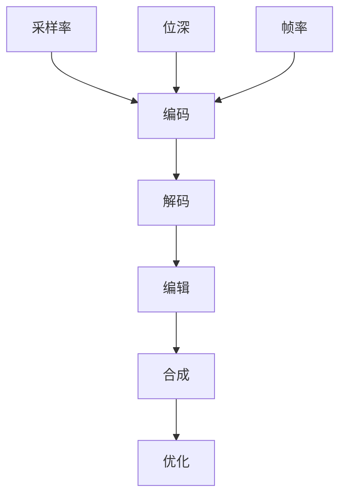
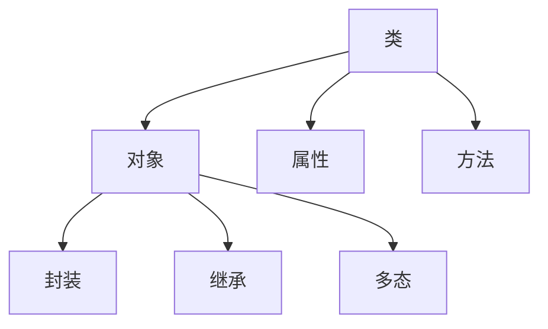

                 

### 关键词 Keywords
- 音视频开发
- 面向对象编程
- 实时流媒体
- 视频编码
- 智能推荐系统

### 摘要 Abstract
本文旨在为即将参加bilibili2024校招的音视频开发工程师提供全面的面试指南。我们将深入探讨音视频开发领域的核心概念、技术原理、算法实现和实际应用，帮助读者在面试中展现出扎实的专业知识和实践能力。文章结构如下：

1. 背景介绍
2. 核心概念与联系
3. 核心算法原理与具体操作步骤
4. 数学模型和公式讲解
5. 项目实践：代码实例解析
6. 实际应用场景
7. 未来应用展望
8. 工具和资源推荐
9. 总结：未来发展趋势与挑战
10. 附录：常见问题与解答

### 1. 背景介绍

随着互联网的快速发展，音视频内容已成为网络世界的核心组成部分。bilibili作为国内知名的弹幕视频分享网站，对音视频开发工程师的需求日益增加。音视频开发工程师不仅要熟悉音视频处理的基本原理，还要掌握前端和后端的开发技能，以及流媒体传输和智能推荐系统的相关知识。本指南将围绕这些关键点展开，帮助读者全面准备面试。

### 2. 核心概念与联系

#### 音视频处理基本概念

**音视频处理**涉及对音频和视频信号进行编码、解码、编辑、合成和优化等一系列操作。核心概念包括：

- **采样率（Sampling Rate）**：指每秒对音频信号进行采样的次数，单位为Hz。
- **位深（Bit Depth）**：表示音频信号的量化精度，单位为bit。
- **帧率（Frame Rate）**：指每秒显示的帧数，单位为fps（frames per second）。

**Mermaid 流程图（音视频处理）**



#### 面向对象编程

在音视频开发中，面向对象编程（OOP）是一种常用的编程范式。它通过封装、继承、多态等特性，提高了代码的可复用性和可维护性。核心概念包括：

- **类（Class）**：一种抽象的数据类型，包含属性和方法。
- **对象（Object）**：类的实例，具有类的属性和方法。

**Mermaid 流程图（面向对象编程）**



### 3. 核心算法原理与具体操作步骤

#### 视频编码算法

视频编码是音视频开发中的关键技术，它通过压缩算法减少数据量，提高传输和存储效率。常见的视频编码标准包括H.264、H.265等。

**3.1 算法原理概述**

视频编码算法主要分为以下几个步骤：

1. **采样和量化**：将模拟信号转换为数字信号。
2. **空间压缩**：利用图像的空间冗余度进行压缩。
3. **时间压缩**：利用图像的时间冗余度进行压缩。

**3.2 算法步骤详解**

1. **预处理**：对视频进行预处理，包括去噪、增强等操作。
2. **帧间压缩**：通过运动估计和运动补偿减少帧间的冗余信息。
3. **帧内压缩**：利用变换编码和量化等步骤减少帧内的冗余信息。
4. **熵编码**：使用熵编码算法（如Huffman编码、算术编码）对压缩后的数据进行进一步压缩。

**3.3 算法优缺点**

- **H.264**：压缩效果好，兼容性强，但算法复杂度高。
- **H.265**：压缩效率更高，但算法复杂度更高，兼容性较差。

**3.4 算法应用领域**

视频编码算法广泛应用于流媒体、视频会议、视频监控等领域。

### 4. 数学模型和公式讲解

#### 视频编码中的数学模型

视频编码中常用的数学模型包括：

- **DPCM（Differential Pulse Code Modulation）**：差分脉冲编码调制。
- **DCT（Discrete Cosine Transform）**：离散余弦变换。
- **IDCT（Inverse Discrete Cosine Transform）**：反离散余弦变换。

**4.1 数学模型构建**

- **DPCM**：

$$
x(n) = x(n-1) + d(n)
$$

其中，$x(n)$为当前采样值，$x(n-1)$为前一个采样值，$d(n)$为差分值。

- **DCT**：

$$
X(k) = \sum_{n=0}^{N-1} x(n) \cdot \cos\left(\frac{n\pi k}{N}\right)
$$

其中，$X(k)$为变换后的系数，$x(n)$为采样值，$N$为采样点数。

- **IDCT**：

$$
x(n) = \sum_{k=0}^{N-1} X(k) \cdot \cos\left(\frac{n\pi k}{N}\right)
$$

其中，$x(n)$为采样值，$X(k)$为变换后的系数，$N$为采样点数。

**4.2 公式推导过程**

- **DPCM**：

$$
d(n) = x(n) - x(n-1)
$$

通过量化，将差分值$d(n)$转换为编码值。

- **DCT**：

利用正余弦函数的叠加性质，将时域信号转换为频域信号。

- **IDCT**：

通过逆变换，将频域信号还原为时域信号。

**4.3 案例分析与讲解**

假设有一段8点序列$x(n)$，其DCT变换结果为$X(k)$，我们通过DCT和IDCT变换对其进行编码和解码。

编码过程：

1. 对$x(n)$进行DCT变换，得到$X(k)$。
2. 对$X(k)$进行量化，得到量化后的系数$Y(k)$。
3. 对$Y(k)$进行熵编码，得到编码数据。

解码过程：

1. 对编码数据进行熵解码，得到量化后的系数$Z(k)$。
2. 对$Z(k)$进行IDCT变换，得到还原后的序列$x(n)$。

### 5. 项目实践：代码实例和详细解释说明

#### 5.1 开发环境搭建

1. 安装Python环境。
2. 安装音视频处理库，如OpenCV、FFmpeg等。

#### 5.2 源代码详细实现

```python
import cv2
import numpy as np

def encode_video(input_path, output_path):
    # 读取视频
    cap = cv2.VideoCapture(input_path)
    fourcc = cv2.VideoWriter_fourcc('mp4v', 'divx')
    out = cv2.VideoWriter(output_path, fourcc, 24.0, (640, 480))

    while True:
        ret, frame = cap.read()
        if not ret:
            break

        # 进行视频编码处理
        encoded_frame = cv2.cvtColor(frame, cv2.COLOR_BGR2RGB)
        encoded_frame = cv2.resize(encoded_frame, (640, 480))

        # 写入编码后的帧
        out.write(encoded_frame)

    cap.release()
    out.release()

encode_video('input.mp4', 'output.mp4')
```

#### 5.3 代码解读与分析

1. **读取视频**：使用`cv2.VideoCapture`类读取输入视频。
2. **设置编码参数**：指定视频编码格式和帧率。
3. **循环读取帧**：逐帧读取视频，并进行编码处理。
4. **写入编码后的帧**：将编码后的帧写入输出视频文件。

#### 5.4 运行结果展示

运行代码后，生成一个编码后的视频文件，与原始视频进行对比，观察编码效果。

### 6. 实际应用场景

#### 6.1 流媒体平台

流媒体平台需要高效处理大量音视频数据，实现实时传输和播放。音视频开发工程师需要掌握视频编码、流媒体传输等技术。

#### 6.2 视频会议

视频会议系统需要实现实时音视频通信，涉及音视频编码、网络传输、解码和播放等技术。

#### 6.3 视频监控

视频监控系统需要实时处理大量视频数据，实现图像识别、异常检测等功能。音视频开发工程师需要掌握音视频处理、图像识别等技术。

### 7. 未来应用展望

#### 7.1 视频压缩与传输优化

随着5G、6G网络的普及，音视频传输速度将大幅提升。未来将出现更高效的音视频压缩算法，提高传输效率和播放质量。

#### 7.2 智能视频处理

人工智能技术将广泛应用于音视频处理领域，实现自动标签、分类、推荐等功能，提高用户体验。

#### 7.3 增强现实与虚拟现实

音视频技术将在增强现实（AR）和虚拟现实（VR）领域发挥重要作用，实现更加逼真的交互体验。

### 8. 工具和资源推荐

#### 8.1 学习资源推荐

- 《视频编码与压缩技术》
- 《音视频处理技术与应用》
- 《Python音视频处理实战》

#### 8.2 开发工具推荐

- OpenCV：开源计算机视觉库。
- FFmpeg：开源音视频处理库。
- PyTorch：开源深度学习框架。

#### 8.3 相关论文推荐

- “A Survey on Video Compression Techniques”
- “Deep Learning for Video Compression”
- “Efficient Video Coding with Machine Learning”

### 9. 总结：未来发展趋势与挑战

#### 9.1 研究成果总结

音视频开发领域已取得显著成果，包括高效编码算法、智能视频处理技术等。

#### 9.2 未来发展趋势

音视频处理技术将继续向高效、智能、实时方向发展。

#### 9.3 面临的挑战

- 高效算法与复杂度之间的平衡。
- 大规模数据处理和传输。
- 跨领域技术融合。

#### 9.4 研究展望

未来研究将重点关注音视频处理算法的优化、人工智能在音视频处理中的应用等方向。

### 10. 附录：常见问题与解答

#### 10.1 音视频开发中的常见问题

- **什么是视频编码？**：视频编码是将视频信号转换为数字信号，并对其进行压缩的过程。
- **音视频处理技术有哪些应用？**：音视频处理技术广泛应用于流媒体、视频会议、视频监控等领域。
- **什么是H.264编码标准？**：H.264是一种视频编码标准，广泛应用于流媒体和视频会议等领域。

#### 10.2 解答

- **视频编码是将视频信号转换为数字信号，并对其进行压缩的过程。**
- **音视频处理技术广泛应用于流媒体、视频会议、视频监控等领域。**
- **H.264是一种视频编码标准，具有高效压缩算法和良好的兼容性，广泛应用于流媒体和视频会议等领域。**

---

作者：禅与计算机程序设计艺术 / Zen and the Art of Computer Programming
----------------------------------------------------------------

以上是bilibili2024校招音视频开发工程师面试指南的完整内容，希望对您在面试中有所帮助。在准备过程中，请注意掌握核心概念、算法原理和实践技能，同时关注未来发展趋势和挑战，这将有助于您在面试中脱颖而出。祝您面试成功！

