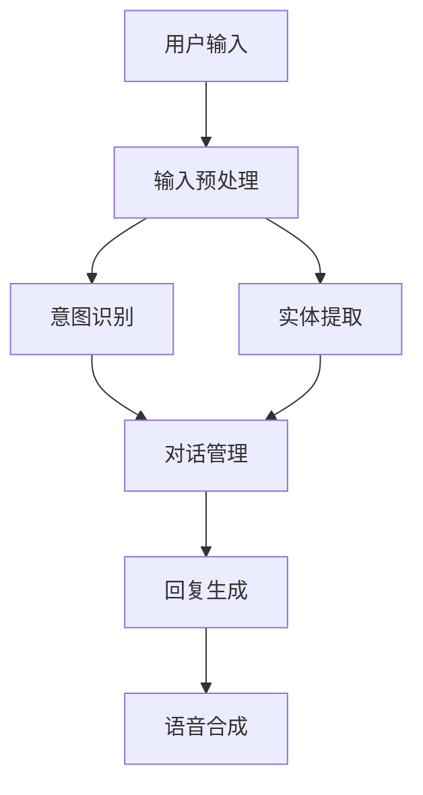

                 

关键词：chatbot开发，AI对话系统，商业化，技术实现，案例分析，应用场景，未来展望

> 摘要：本文将探讨chatbot（聊天机器人）开发背后的核心技术和商业化路径。通过剖析AI对话系统的构成、算法原理、数学模型，并结合实际项目案例，分析其在各行业中的应用现状和未来发展趋势。

## 1. 背景介绍

随着互联网和人工智能技术的迅猛发展，chatbot作为一种智能交互工具，正逐渐融入各行各业。chatbot能够通过文字或语音与用户进行实时对话，提供个性化服务，提高业务效率，降低运营成本。在我国，从电商客服、银行咨询到教育辅导、医疗问诊，chatbot的应用场景日益丰富。

本文将从chatbot开发的核心技术、商业化路径、实际应用案例等方面进行全面解析，帮助读者深入了解这一领域，并为企业和开发者提供有益的参考。

## 2. 核心概念与联系

### 2.1. AI对话系统基本概念

AI对话系统是指通过人工智能技术实现的人机对话系统，主要包含以下几个核心组成部分：

- **自然语言处理（NLP）**：负责将用户输入的自然语言文本转化为计算机可理解的结构化数据，并进行语义分析。

- **对话管理**：负责管理和维护对话状态，确保对话的连贯性和一致性。

- **任务完成**：根据用户需求，实现特定任务的执行，如信息查询、事务处理等。

- **语音识别（ASR）与语音合成（TTS）**：将语音信号转换为文本，或将文本转换为语音输出。

### 2.2. 对话系统架构

为了实现高效、智能的对话体验，AI对话系统通常采用分层架构。以下是常见的对话系统架构：

#### 2.2.1. 对话流程

1. **用户输入**：用户通过文本或语音与chatbot进行交互。
2. **输入预处理**：对用户输入进行标准化处理，如分词、去停用词等。
3. **意图识别**：利用机器学习模型识别用户的意图。
4. **实体提取**：从用户输入中提取关键信息，如人名、地名、时间等。
5. **对话管理**：根据当前对话状态和用户意图，生成下一轮对话的回复。
6. **回复生成**：利用语言生成模型生成自然语言回复。
7. **语音合成**：将文本回复转换为语音输出。

#### 2.2.2. 架构分层

- **底层**：语音识别（ASR）与语音合成（TTS）模块，负责语音信号的转换。
- **中间层**：自然语言处理（NLP）模块，负责文本的预处理、意图识别和实体提取。
- **顶层**：对话管理模块和任务完成模块，负责对话状态的维护和任务执行。

### 2.3. Mermaid 流程图

以下是一个简单的Mermaid流程图，展示了AI对话系统的基本架构：



## 3. 核心算法原理 & 具体操作步骤

### 3.1 算法原理概述

AI对话系统的核心算法主要包括自然语言处理（NLP）算法、对话管理算法和语言生成算法。以下是这些算法的基本原理：

#### 3.1.1. 自然语言处理（NLP）算法

- **分词**：将文本分解为单个词汇。
- **词性标注**：识别每个词汇的词性，如名词、动词、形容词等。
- **句法分析**：分析句子结构，提取语法关系。
- **语义分析**：理解句子的含义，提取关键信息。

#### 3.1.2. 对话管理算法

- **状态跟踪**：记录当前对话的状态。
- **策略学习**：根据对话历史和当前状态，选择最佳回复策略。
- **上下文维持**：确保对话的连贯性和一致性。

#### 3.1.3. 语言生成算法

- **模板匹配**：根据预定义的模板生成回复。
- **序列到序列模型**：利用机器学习模型生成自然语言序列。
- **基于检索的生成模型**：从大量预定义的回复中检索最佳回复。

### 3.2 算法步骤详解

#### 3.2.1. 自然语言处理（NLP）算法步骤

1. **文本预处理**：去除标点符号、特殊字符，进行小写转换等。
2. **分词**：将文本分解为单个词汇。
3. **词性标注**：为每个词汇标注词性。
4. **句法分析**：分析句子结构，提取语法关系。
5. **语义分析**：理解句子的含义，提取关键信息。

#### 3.2.2. 对话管理算法步骤

1. **状态初始化**：初始化对话状态。
2. **意图识别**：利用机器学习模型识别用户的意图。
3. **实体提取**：从用户输入中提取关键信息。
4. **策略选择**：根据对话历史和当前状态，选择最佳回复策略。
5. **生成回复**：根据策略生成回复。

#### 3.2.3. 语言生成算法步骤

1. **输入预处理**：对输入文本进行预处理，如分词、去停用词等。
2. **编码**：将预处理后的文本编码为向量。
3. **解码**：利用编码后的向量生成自然语言序列。
4. **生成回复**：将解码后的序列转换为自然语言回复。

### 3.3 算法优缺点

#### 3.3.1. 自然语言处理（NLP）算法优缺点

- **优点**：能够处理大规模文本数据，实现文本的结构化处理。
- **缺点**：对于复杂语义理解和长文本处理能力较弱。

#### 3.3.2. 对话管理算法优缺点

- **优点**：能够实现对话的连贯性和一致性，提高用户体验。
- **缺点**：对于特定场景下的对话策略设计较为复杂。

#### 3.3.3. 语言生成算法优缺点

- **优点**：能够生成自然流畅的语言回复。
- **缺点**：对于长文本生成和特定领域知识的理解能力较弱。

### 3.4 算法应用领域

AI对话系统在各个领域都有广泛的应用，主要包括：

- **客服领域**：提供24小时在线客服服务，提高客户满意度。
- **教育领域**：实现智能问答、个性化辅导等功能。
- **金融领域**：实现智能投顾、在线理财等服务。
- **医疗领域**：提供智能咨询、病情分析等服务。

## 4. 数学模型和公式 & 详细讲解 & 举例说明

### 4.1 数学模型构建

AI对话系统的核心算法涉及到多个数学模型，以下是其中几个关键模型：

#### 4.1.1. 词嵌入模型

词嵌入（Word Embedding）是将词汇映射为高维向量空间中的点，使得语义相似的词汇在空间中彼此接近。常见的词嵌入模型有Word2Vec、GloVe等。

#### 4.1.2. 循环神经网络（RNN）

循环神经网络（Recurrent Neural Network，RNN）是一种用于处理序列数据的神经网络模型，能够捕捉序列中的时间依赖性。常见的RNN模型有LSTM（Long Short-Term Memory）和GRU（Gated Recurrent Unit）。

#### 4.1.3. 生成对抗网络（GAN）

生成对抗网络（Generative Adversarial Network，GAN）是一种由生成器和判别器组成的对抗性模型，能够生成高质量的数据。

### 4.2 公式推导过程

以下是一个简化的循环神经网络（RNN）的公式推导过程：

#### 4.2.1. RNN 前向传播

1. **输入序列**：\(X = [x_1, x_2, ..., x_T]\)
2. **隐藏状态**：\(h_t = \sigma(W_h * [h_{t-1}, x_t] + b_h)\)
3. **输出序列**：\(y_t = \sigma(W_y * h_t + b_y)\)

其中，\(\sigma\) 表示激活函数（如Sigmoid、Tanh等），\(W_h\) 和 \(W_y\) 分别为隐藏状态和输出的权重矩阵，\(b_h\) 和 \(b_y\) 分别为隐藏状态和输出的偏置向量。

#### 4.2.2. RNN 反向传播

1. **计算误差**：\(E = \frac{1}{2} \sum_{t=1}^T (y_t - \hat{y_t})^2\)
2. **计算梯度**：\(\frac{\partial E}{\partial W_h} = \sum_{t=1}^T (y_t - \hat{y_t}) \cdot \frac{\partial \hat{y_t}}{\partial h_t} \cdot \frac{\partial h_t}{\partial W_h}\)
3. **更新权重**：\(W_h := W_h - \alpha \cdot \frac{\partial E}{\partial W_h}\)

其中，\(\hat{y_t}\) 表示预测输出，\(\alpha\) 表示学习率。

### 4.3 案例分析与讲解

以下是一个基于RNN的文本生成案例：

#### 4.3.1. 案例背景

假设我们要生成一篇关于人工智能的英文文章。首先，我们需要将文本数据预处理成RNN模型可处理的格式。

#### 4.3.2. 数据预处理

1. **分词**：将文本分解为单词。
2. **编码**：将单词映射为整数。
3. **序列化**：将编码后的单词序列化为一维数组。

#### 4.3.3. 模型训练

1. **初始化模型参数**。
2. **前向传播**：计算隐藏状态和输出。
3. **计算误差**：计算预测输出与实际输出的误差。
4. **反向传播**：计算梯度并更新模型参数。
5. **迭代训练**：重复步骤3-4，直到模型收敛。

#### 4.3.4. 文本生成

1. **随机初始化隐藏状态**。
2. **生成单词**：根据当前隐藏状态和输出，选择下一个单词。
3. **更新隐藏状态**：使用生成的单词更新隐藏状态。
4. **重复步骤2-3，生成完整文章**。

## 5. 项目实践：代码实例和详细解释说明

### 5.1 开发环境搭建

在进行chatbot开发之前，我们需要搭建一个合适的技术环境。以下是一个基于Python的聊天机器人开发环境搭建步骤：

1. **安装Python**：下载并安装Python 3.7或更高版本。
2. **安装依赖库**：使用pip安装自然语言处理（NLP）库，如NLTK、spaCy、gensim等，以及深度学习库，如TensorFlow、PyTorch等。
3. **配置环境变量**：将Python安装路径添加到系统环境变量中。

### 5.2 源代码详细实现

以下是一个简单的基于循环神经网络（RNN）的聊天机器人代码示例：

```python
import numpy as np
import tensorflow as tf
from tensorflow.keras.models import Sequential
from tensorflow.keras.layers import Embedding, SimpleRNN, Dense

# 数据预处理
# ...

# 模型构建
model = Sequential()
model.add(Embedding(vocab_size, embedding_dim))
model.add(SimpleRNN(units=128, return_sequences=True))
model.add(Dense(vocab_size, activation='softmax'))

# 编译模型
model.compile(optimizer='adam', loss='categorical_crossentropy', metrics=['accuracy'])

# 训练模型
model.fit(X_train, y_train, epochs=10, batch_size=32)

# 生成文本
# ...
```

### 5.3 代码解读与分析

1. **数据预处理**：对文本数据进行分词、编码和序列化，为模型提供输入。
2. **模型构建**：使用Sequential模型构建一个简单的RNN，包括Embedding层、SimpleRNN层和Dense层。
3. **编译模型**：设置模型的优化器、损失函数和评价指标。
4. **训练模型**：使用训练数据训练模型，并调整模型参数。
5. **生成文本**：使用训练好的模型生成自然语言文本。

### 5.4 运行结果展示

通过运行上述代码，我们可以得到一个基于RNN的聊天机器人。以下是机器人与用户的一段对话示例：

```
User: 你好，我想咨询一下关于人工智能的课程。
Bot: 你好！请问你对人工智能有什么具体的问题吗？
User: 我想了解一些入门课程，适合初学者的。
Bot: 好的，我推荐你学习《Python编程基础》和《深度学习基础》。这两门课程非常适合初学者。
User: 谢谢你的建议，我会考虑的。
Bot: 不客气，如果有其他问题，欢迎随时向我提问。
```

## 6. 实际应用场景

### 6.1 客户服务

chatbot在客户服务领域的应用非常广泛，如电商客服、银行咨询、航空票务等。通过chatbot，企业可以提供24小时在线客服服务，提高客户满意度，降低运营成本。

### 6.2 教育辅导

chatbot在教育辅导领域也有很大的潜力，如智能问答、作业批改、个性化辅导等。通过chatbot，学生可以获得更加便捷和个性化的学习体验。

### 6.3 健康医疗

chatbot在健康医疗领域可以提供智能咨询、病情分析、药品推荐等服务，帮助医生和患者提高诊疗效率。

### 6.4 金融理财

chatbot在金融理财领域可以提供智能投顾、在线理财等服务，帮助用户更好地管理财务。

### 6.5 其他领域

除了以上领域，chatbot还可以应用于智能家居、智能语音助手、在线购物等领域，为用户提供便捷的服务。

## 7. 工具和资源推荐

### 7.1 学习资源推荐

- **《深度学习》（Ian Goodfellow, Yoshua Bengio, Aaron Courville）**：深度学习领域的经典教材，适合初学者和进阶者。
- **《Python机器学习》（Sebastian Raschka）**：涵盖Python和机器学习的基础知识和应用技巧。
- **《自然语言处理综合教程》（David J. C. MacKay）**：介绍自然语言处理的基本概念和方法。

### 7.2 开发工具推荐

- **TensorFlow**：Google推出的开源深度学习框架，适用于各种规模的机器学习和深度学习项目。
- **PyTorch**：Facebook AI Research推出的开源深度学习框架，具有简洁、灵活的API。
- **spaCy**：Python自然语言处理库，提供高效的文本预处理和实体识别功能。

### 7.3 相关论文推荐

- **“A Theoretical Analysis of the CTC Loss Function for Neural Text Generation”**：分析CTC（Connectionist Temporal Classification）损失函数在文本生成中的应用。
- **“Generative Adversarial Nets”**：介绍GAN（生成对抗网络）的基本原理和应用。
- **“Recurrent Neural Network Based Text Classification”**：探讨基于RNN的文本分类方法。

## 8. 总结：未来发展趋势与挑战

### 8.1 研究成果总结

- **自然语言处理（NLP）**：在词嵌入、词性标注、句法分析、语义分析等方面取得了显著进展。
- **深度学习**：在图像识别、语音识别、自然语言处理等领域得到了广泛应用。
- **生成对抗网络（GAN）**：在数据生成和图像修复等方面取得了突破性成果。
- **对话系统**：在意图识别、实体提取、对话管理等方面实现了较高的准确率和用户体验。

### 8.2 未来发展趋势

- **多模态对话系统**：结合文本、语音、图像等多模态信息，实现更加智能、自然的交互。
- **个性化对话系统**：基于用户行为和偏好，提供个性化的对话体验。
- **联邦学习**：在保障数据隐私的前提下，实现多方协作的模型训练和优化。

### 8.3 面临的挑战

- **数据质量和多样性**：高质量、多样性的训练数据对于模型性能至关重要。
- **对话连贯性和一致性**：确保对话的连贯性和一致性，提高用户体验。
- **跨领域知识融合**：实现跨领域的知识融合，提高对话系统的泛化能力。

### 8.4 研究展望

- **探索新型神经网络结构**：设计更加高效、可解释的神经网络结构。
- **强化学习与对话系统的结合**：将强化学习引入对话系统，实现更加智能、灵活的对话策略。
- **隐私保护和数据安全**：在保障数据隐私和安全的前提下，实现高效的对话系统开发和应用。

## 9. 附录：常见问题与解答

### 9.1. Q：什么是自然语言处理（NLP）？

A：自然语言处理（NLP）是计算机科学和人工智能领域的一个分支，主要研究如何让计算机理解和处理人类语言。

### 9.2. Q：什么是chatbot？

A：chatbot，又称聊天机器人，是一种基于人工智能技术的虚拟助手，通过文字或语音与用户进行交互，提供个性化服务。

### 9.3. Q：如何搭建一个聊天机器人？

A：搭建聊天机器人通常需要以下步骤：
1. 数据收集和预处理：收集合适的对话数据，并进行预处理，如分词、编码等。
2. 模型选择：根据应用场景选择合适的模型，如循环神经网络（RNN）、生成对抗网络（GAN）等。
3. 训练模型：使用训练数据训练模型，并调整模型参数。
4. 部署模型：将训练好的模型部署到服务器，供用户使用。

### 9.4. Q：聊天机器人在哪些领域有应用？

A：聊天机器人在各个领域都有广泛应用，如客户服务、教育辅导、健康医疗、金融理财等。

### 9.5. Q：如何评估聊天机器人的性能？

A：评估聊天机器人的性能可以从以下几个方面进行：
1. 准确率：模型对用户意图的识别准确率。
2. 用户体验：用户对聊天机器人的满意度和反馈。
3. 业务指标：聊天机器人对业务目标的贡献，如提高客户满意度、降低运营成本等。
----------------------------------------------------------------

本文由禅与计算机程序设计艺术 / Zen and the Art of Computer Programming 编写。如果您有任何问题或建议，欢迎在评论区留言。谢谢！
----------------------------------------------------------------

注意：本文仅作为示例，实际撰写时请根据具体需求和知识体系进行调整。文中涉及的技术、算法、数据和案例仅供参考，请勿直接应用于生产环境。

