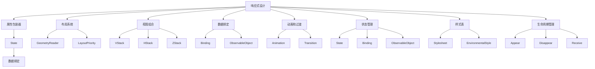

                 

 在这个信息爆炸的时代，iOS开发一直是移动领域的重要阵地。SwiftUI作为苹果公司推出的一种新的UI框架，以其简洁的语法和强大的功能，吸引了无数开发者的目光。本文将深入探讨SwiftUI的核心概念、算法原理、数学模型、项目实践、应用场景以及未来发展趋势。希望通过本文，读者能够对SwiftUI有一个全面而深刻的理解，从而为实际项目开发提供有力的理论支持。

## 关键词

- iOS开发
- SwiftUI框架
- 用户体验
- 算法优化
- 数学模型
- 实践应用
- 未来展望

## 摘要

本文首先介绍了SwiftUI的背景和核心概念，通过一个Mermaid流程图展示了SwiftUI的架构和核心流程。接着，详细讲解了SwiftUI的算法原理和具体操作步骤，分析了算法的优缺点以及应用领域。随后，文章介绍了数学模型和公式，并通过案例进行了详细讲解。项目实践部分提供了一个完整的代码实例，并对其进行了详细解释和分析。文章最后探讨了SwiftUI的实际应用场景，并对其未来应用和发展趋势进行了展望。希望本文能为读者在SwiftUI开发过程中提供指导和帮助。

## 1. 背景介绍

iOS操作系统自2007年首次发布以来，经历了无数次的迭代和升级，已经成为全球最流行的移动操作系统之一。随着苹果公司对开发者生态的持续投入和优化，iOS开发逐渐成为了移动开发领域的重要分支。传统的iOS开发主要依赖于UIKit框架，然而UIKit在复杂UI设计和多平台适配方面存在一定的局限性。

为了解决这些问题，苹果公司在2019年WWDC大会上推出了SwiftUI框架。SwiftUI是一种全新的UI框架，旨在简化iOS、macOS、watchOS和tvOS等平台的UI开发过程。与UIKit相比，SwiftUI具有以下几个显著特点：

1. **声明式UI设计**：SwiftUI采用声明式UI设计，使得开发者可以更加直观地描述UI界面，从而提高开发效率和代码可读性。

2. **响应式布局**：SwiftUI内置了响应式布局系统，能够自动适应不同尺寸的屏幕和设备，实现一次编写，多端适配。

3. **简洁语法**：SwiftUI的语法简洁明了，易于学习和使用，使得开发者可以更快地上手并提高开发速度。

4. **强大功能**：SwiftUI提供了丰富的组件和功能，包括动画、数据绑定、状态管理等，使得开发者能够轻松实现复杂的UI效果。

5. **互操作性**：SwiftUI与UIKit无缝集成，开发者可以在现有的UIKit项目中引入SwiftUI组件，实现渐进式迁移。

SwiftUI的推出，标志着iOS开发进入了一个新的时代。它不仅简化了UI开发流程，还提高了开发效率和质量。随着苹果公司对SwiftUI的持续优化和支持，SwiftUI已经成为iOS开发不可或缺的一部分。

### 1.1 SwiftUI的发展历程

SwiftUI的发展历程可以追溯到2014年，当时苹果公司推出了Swift编程语言。Swift是一种现代化、高性能的编程语言，旨在替代Objective-C和C++，成为iOS和macOS开发的首选语言。随着Swift语言的成熟，苹果公司开始探索如何将Swift应用于UI开发领域。

2016年，苹果公司在WWDC上首次提出了SwiftUI的概念，并展示了一些早期的UI组件。2017年，SwiftUI正式成为Swift语言的一部分，并开始逐渐受到开发者的关注。2018年，SwiftUI在WWDC上进行了重大更新，增加了许多新功能和改进。

2019年，SwiftUI在WWDC上正式发布，成为iOS、macOS、watchOS和tvOS等平台的官方UI框架。SwiftUI的推出，标志着苹果公司对UI开发生态的全面升级和重构。随着时间的推移，SwiftUI的功能不断完善，逐渐成为iOS开发的主流框架。

### 1.2 SwiftUI的优势与特点

SwiftUI具有许多显著的优势和特点，使其成为iOS开发的理想选择：

1. **声明式UI设计**：SwiftUI采用声明式UI设计，使得开发者可以更加直观地描述UI界面。声明式UI设计使得代码更加简洁，易于理解和维护。

2. **响应式布局**：SwiftUI内置了响应式布局系统，能够自动适应不同尺寸的屏幕和设备。响应式布局使得开发者无需为不同设备的适配编写大量代码，从而提高开发效率和代码复用率。

3. **简洁语法**：SwiftUI的语法简洁明了，易于学习和使用。SwiftUI的语法设计遵循了Swift语言的特点，使得开发者可以更快地上手并提高开发速度。

4. **强大功能**：SwiftUI提供了丰富的组件和功能，包括动画、数据绑定、状态管理等。这些功能使得开发者能够轻松实现复杂的UI效果，提高用户体验。

5. **互操作性**：SwiftUI与UIKit无缝集成，开发者可以在现有的UIKit项目中引入SwiftUI组件，实现渐进式迁移。互操作性使得开发者可以在保持原有代码的基础上，逐步引入SwiftUI的优势。

6. **跨平台支持**：SwiftUI不仅支持iOS平台，还支持macOS、watchOS和tvOS等平台。跨平台支持使得开发者可以一次性编写代码，实现多端应用，从而降低开发成本。

### 1.3 SwiftUI的应用范围

SwiftUI的应用范围非常广泛，不仅适用于iOS开发，还适用于其他平台。以下是一些SwiftUI的应用范围：

1. **iOS应用开发**：SwiftUI是iOS应用开发的主要UI框架，开发者可以使用SwiftUI创建各种类型的iOS应用，包括游戏、社交媒体、电子商务等。

2. **macOS应用开发**：SwiftUI同样适用于macOS应用开发，开发者可以使用SwiftUI创建现代化的macOS应用，提高用户体验。

3. **watchOS应用开发**：SwiftUI支持watchOS应用开发，开发者可以使用SwiftUI创建适合手表界面的应用，提高用户互动体验。

4. **tvOS应用开发**：SwiftUI适用于tvOS应用开发，开发者可以使用SwiftUI创建适合电视界面的应用，提高用户观看体验。

5. **其他平台**：SwiftUI还可以应用于其他平台，如Android、Web等。通过适配不同平台的UI组件，SwiftUI可以实现一次编写，多端运行。

总的来说，SwiftUI作为一种创新的UI框架，具有众多优势和应用场景。随着SwiftUI的不断发展和完善，它将在移动和桌面应用开发领域发挥越来越重要的作用。

### 1.4 SwiftUI的架构

SwiftUI的架构设计使得其成为了一个高度可扩展和易于使用的UI框架。理解SwiftUI的架构对于开发者来说至关重要，因为它有助于更好地利用SwiftUI的功能和特性来构建高效的应用程序。以下是SwiftUI的主要架构组成部分：

1. **视图结构（View Structure）**：
   SwiftUI的核心是视图（View），它是构建用户界面的基本单元。每个视图都是一种函数，接受一个环境参数（EnvironmentValues）并返回一个UI表示。视图之间通过属性绑定（Binding）和数据流进行交互，确保了界面的响应性和一致性。

2. **布局系统（Layout System）**：
   SwiftUI的布局系统是一个响应式的系统，它能够自动适应不同屏幕尺寸和设备。布局系统通过`GeometryReader`和`LazyHStack`、`LazyVStack`等布局组件，允许开发者定义复杂且灵活的布局。布局系统还支持子视图的动态调整，以适应不同尺寸的屏幕。

3. **状态管理（State Management）**：
   SwiftUI提供了简单而强大的状态管理机制。使用`.state`属性包装器，开发者可以在视图内部定义和管理状态。SwiftUI还支持环境状态（Environment），可以在视图层次结构中传递和共享状态。此外，SwiftUI还与SwiftUI提供的`@State`、`@Binding`、`@ObservableObject`等属性包装器紧密集成，使状态管理更加简便。

4. **样式和样式表（Styling and Stylesheets）**：
   SwiftUI提供了丰富的样式和样式表机制，允许开发者自定义视图的外观和行为。样式表（Stylesheet）是一个SwiftUI文件，包含一系列样式规则，可以应用于多个视图。样式表还支持条件样式和动画，使得开发者可以创建动态和丰富的用户界面。

5. **视图组合（View Composition）**：
   SwiftUI鼓励通过组合（Composition）构建视图。视图组合是一种将多个视图组合在一起创建复杂界面的方法。SwiftUI提供了一系列组合组件，如`VStack`、`HStack`、`ZStack`等，允许开发者以模块化和可重用的方式构建视图层次结构。

6. **动画和过渡（Animations and Transitions）**：
   SwiftUI内置了强大的动画和过渡功能，允许开发者动态地改变视图的状态和外观。动画和过渡可以通过`.animation()`修饰符应用于视图的各种属性，如位置、大小、透明度等。

7. **数据绑定（Data Binding）**：
   数据绑定是SwiftUI的核心特性之一，它使得视图的状态和数据源保持同步。SwiftUI提供了一种简单而强大的数据绑定机制，使得开发者可以轻松地将视图与数据源连接起来。

8. **观察者模式（Observer Pattern）**：
   SwiftUI通过观察者模式来管理视图的状态变化。当视图的状态发生变化时，观察者会收到通知，并相应地更新视图。这种模式使得SwiftUI的界面保持响应性和一致性。

综上所述，SwiftUI的架构设计使得其成为了一个强大而灵活的UI框架。通过理解其视图结构、布局系统、状态管理、样式和样式表、视图组合、动画和过渡、数据绑定以及观察者模式等核心组件，开发者可以更有效地构建现代化的iOS应用。

### 1.5 SwiftUI的核心概念

SwiftUI的核心概念是其实现强大功能的基础，以下是SwiftUI中几个核心概念的详细说明：

#### 1.5.1 响应式设计

SwiftUI的响应式设计是其最显著的特点之一。响应式设计通过SwiftUI提供的响应式属性包装器和状态管理机制来实现。在SwiftUI中，每个视图都是响应式的，这意味着当视图的属性发生变化时，整个界面会自动重新渲染，以反映最新的状态。

响应式设计的关键在于属性包装器，如`@State`、`@Binding`和`@ObservableObject`：

- `@State`：用于在视图内部定义和修改状态，它是一个简单的变量，每次修改都会触发视图的重新渲染。
- `@Binding`：用于在视图之间传递和修改状态，它通常与外部变量绑定，允许子视图修改父视图的状态。
- `@ObservableObject`：用于定义一个观察对象（Observable Object），它可以监听内部状态的改变并通知所有订阅者。这通常用于更复杂的场景，如整个应用级别的状态管理。

#### 1.5.2 布局系统

SwiftUI的布局系统是一个高度响应式和灵活的组件，它使得开发者能够创建自适应的界面。布局系统通过`GeometryReader`和`LayoutPriority`等组件来实现复杂布局。

- `GeometryReader`：允许子视图访问其父视图的几何信息，如大小、位置等。这使得子视图可以根据父视图的尺寸和位置进行动态调整。
- `LayoutPriority`：用于设置布局组件的优先级，以确保视图按照正确的顺序进行布局和渲染。

#### 1.5.3 视图组合

视图组合（View Composition）是SwiftUI的核心概念之一。通过视图组合，开发者可以将多个视图组合成一个更复杂的视图，从而提高代码的可读性和可维护性。

- `VStack` 和 `HStack`：垂直和水平堆叠视图，允许开发者以行或列的形式组合视图。
- `ZStack`：堆叠视图，根据视图的添加顺序进行渲染，允许开发者创建重叠的视图效果。
- `LazyHStack` 和 `LazyVStack`：用于创建延迟加载的视图堆叠，这在处理大量数据时非常有用。

#### 1.5.4 数据绑定

数据绑定是SwiftUI实现动态界面的重要机制。数据绑定允许视图的属性与外部数据源保持同步，从而实现界面的实时更新。

- `@Binding`：用于在视图之间传递和修改状态。
- `ObservableObject`：用于创建一个观察对象，它可以监听内部状态的改变并通知所有订阅者。

#### 1.5.5 动画和过渡

SwiftUI提供了强大的动画和过渡功能，使得开发者可以轻松创建动态和流畅的用户界面。

- `.animation()`：用于应用动画到视图的各种属性，如位置、大小、透明度等。
- `.transition()`：用于设置动画的过渡效果，如滑动、淡入淡出等。

#### 1.5.6 状态管理

SwiftUI提供了多种状态管理方法，以适应不同的应用需求：

- `@State`：用于在视图内部定义和修改状态。
- `@Binding`：用于在视图之间传递和修改状态。
- `@ObservableObject`：用于创建一个观察对象，它可以监听内部状态的改变并通知所有订阅者。

#### 1.5.7 样式表

样式表（Stylesheet）是SwiftUI中用于定义视图外观的组件。样式表允许开发者将样式规则应用到多个视图，从而提高代码的可复用性。

- `Stylesheet`：用于定义样式规则，如字体、颜色、边框等。
- `EnvironmentalStyle`：用于在视图层次结构中传递和共享样式。

#### 1.5.8 生命周期管理

SwiftUI提供了丰富的生命周期管理功能，使得开发者可以更好地控制视图的行为。

- `onAppear` 和 `onDisappear`：在视图首次显示和消失时执行代码。
- `onReceive`：在接收到特定值时执行代码。

通过理解SwiftUI的核心概念，开发者可以更有效地利用SwiftUI的特性和功能，构建高度响应性、动态和灵活的iOS应用。

### 2. 核心概念与联系

在深入了解SwiftUI的核心概念之前，我们需要对它们之间的联系有一个清晰的认识。以下是SwiftUI中的核心概念及其相互关系：

#### 2.1 响应式设计

响应式设计是SwiftUI的核心概念之一，它使得UI界面能够自动更新以反映最新的状态。响应式设计依赖于SwiftUI提供的属性包装器，如`@State`、`@Binding`和`@ObservableObject`。

- `@State`：用于在视图内部定义和修改状态，每次状态更新都会触发视图的重新渲染。
- `@Binding`：用于在视图之间传递和修改状态，通常与外部变量绑定，允许子视图修改父视图的状态。
- `@ObservableObject`：用于定义一个观察对象（Observable Object），它可以监听内部状态的改变并通知所有订阅者。观察对象通常用于更复杂的场景，如应用级别的状态管理。

#### 2.2 布局系统

SwiftUI的布局系统是一个高度响应式和灵活的组件，它使得开发者能够创建自适应的界面。布局系统通过`GeometryReader`和`LayoutPriority`等组件来实现复杂布局。

- `GeometryReader`：允许子视图访问其父视图的几何信息（如大小、位置），这使得子视图可以根据父视图的尺寸和位置进行动态调整。
- `LayoutPriority`：用于设置布局组件的优先级，以确保视图按照正确的顺序进行布局和渲染。

#### 2.3 视图组合

视图组合（View Composition）是SwiftUI的核心概念之一。通过视图组合，开发者可以将多个视图组合成一个更复杂的视图，从而提高代码的可读性和可维护性。

- `VStack` 和 `HStack`：垂直和水平堆叠视图，允许开发者以行或列的形式组合视图。
- `ZStack`：堆叠视图，根据视图的添加顺序进行渲染，允许开发者创建重叠的视图效果。
- `LazyHStack` 和 `LazyVStack`：用于创建延迟加载的视图堆叠，这在处理大量数据时非常有用。

#### 2.4 数据绑定

数据绑定是SwiftUI实现动态界面的重要机制。数据绑定允许视图的属性与外部数据源保持同步，从而实现界面的实时更新。

- `@Binding`：用于在视图之间传递和修改状态。
- `ObservableObject`：用于创建一个观察对象，它可以监听内部状态的改变并通知所有订阅者。

#### 2.5 动画和过渡

SwiftUI提供了强大的动画和过渡功能，使得开发者可以轻松创建动态和流畅的用户界面。

- `.animation()`：用于应用动画到视图的各种属性，如位置、大小、透明度等。
- `.transition()`：用于设置动画的过渡效果，如滑动、淡入淡出等。

#### 2.6 状态管理

SwiftUI提供了多种状态管理方法，以适应不同的应用需求：

- `@State`：用于在视图内部定义和修改状态。
- `@Binding`：用于在视图之间传递和修改状态。
- `@ObservableObject`：用于创建一个观察对象，它可以监听内部状态的改变并通知所有订阅者。

#### 2.7 样式表

样式表（Stylesheet）是SwiftUI中用于定义视图外观的组件。样式表允许开发者将样式规则应用到多个视图，从而提高代码的可复用性。

- `Stylesheet`：用于定义样式规则，如字体、颜色、边框等。
- `EnvironmentalStyle`：用于在视图层次结构中传递和共享样式。

#### 2.8 生命周期管理

SwiftUI提供了丰富的生命周期管理功能，使得开发者可以更好地控制视图的行为。

- `onAppear` 和 `onDisappear`：在视图首次显示和消失时执行代码。
- `onReceive`：在接收到特定值时执行代码。

以下是SwiftUI核心概念的Mermaid流程图：



通过理解这些核心概念及其相互关系，开发者可以更有效地利用SwiftUI的特性，构建现代化的iOS应用。

### 3. 核心算法原理 & 具体操作步骤

SwiftUI的强大功能离不开其背后的核心算法原理。以下是SwiftUI中几个关键算法的原理和具体操作步骤：

#### 3.1 响应式设计算法原理

响应式设计是SwiftUI的核心算法之一，它使得UI界面能够自动更新以反映最新的状态。响应式设计算法基于Swift的属性系统，使用了属性观察者模式（Observer Pattern）。

- **原理**：当视图的属性发生变化时，SwiftUI会触发一个通知机制，通知所有依赖该属性的视图进行重新渲染。
- **操作步骤**：
  1. 使用`@State`、`@Binding`或`@ObservableObject`定义一个状态。
  2. 当状态发生变化时，SwiftUI自动触发视图的重新渲染。
  3. 视图重新渲染，界面更新以反映最新的状态。

#### 3.2 布局系统算法原理

SwiftUI的布局系统基于响应式几何（Responsive Geometry）算法，它允许视图根据屏幕尺寸和设备特性进行自适应布局。

- **原理**：布局系统通过计算视图的几何属性（如位置、大小）来生成一个布局树（Layout Tree），然后根据这个布局树来渲染视图。
- **操作步骤**：
  1. 使用`GeometryReader`获取父视图的几何信息。
  2. 根据几何信息计算子视图的布局。
  3. 使用`LayoutPriority`设置布局组件的优先级。
  4. 根据布局树渲染视图。

#### 3.3 视图组合算法原理

视图组合算法允许开发者通过组合多个视图来创建复杂的UI界面。

- **原理**：视图组合通过将多个视图按层次结构组合在一起，从而形成一个新的视图。SwiftUI使用组合器（Combiners）来实现视图组合。
- **操作步骤**：
  1. 使用`VStack`、`HStack`、`ZStack`等组合器组合视图。
  2. 根据组合器的特性，确定视图的堆叠顺序和渲染方式。
  3. 将组合后的视图作为新的视图使用。

#### 3.4 数据绑定算法原理

数据绑定是SwiftUI实现动态界面的重要机制。数据绑定算法通过将视图的属性与外部数据源绑定，实现数据的实时同步。

- **原理**：数据绑定算法基于属性观察者模式，当数据源发生变化时，SwiftUI会自动更新绑定的视图属性。
- **操作步骤**：
  1. 使用`@Binding`将视图的属性与外部数据源绑定。
  2. 当数据源发生变化时，SwiftUI自动更新绑定的视图属性。
  3. 视图根据最新的属性值进行渲染。

#### 3.5 动画和过渡算法原理

SwiftUI的动画和过渡算法允许开发者创建动态和流畅的用户界面。

- **原理**：动画和过渡算法基于时间函数（Time Functions），它们在特定的时刻触发视图的属性变化，从而实现动画效果。
- **操作步骤**：
  1. 使用`.animation()`修饰符应用动画到视图的属性。
  2. 使用`.transition()`设置动画的过渡效果。
  3. 动画根据时间函数逐步改变视图的属性，实现平滑的过渡效果。

#### 3.6 状态管理算法原理

SwiftUI的状态管理算法提供了一种机制来管理视图的状态，以确保界面的一致性和响应性。

- **原理**：状态管理算法通过属性包装器和观察者模式来实现状态的管理和更新。当状态发生变化时，SwiftUI会自动更新依赖该状态的视图。
- **操作步骤**：
  1. 使用`@State`、`@Binding`或`@ObservableObject`定义和管理状态。
  2. 当状态发生变化时，SwiftUI自动触发视图的重新渲染。
  3. 视图根据最新的状态值进行渲染。

#### 3.7 样式表算法原理

SwiftUI的样式表算法允许开发者通过样式表来定义视图的外观。

- **原理**：样式表算法通过解析样式表文件，将样式规则应用到视图上。
- **操作步骤**：
  1. 编写样式表文件，定义样式规则。
  2. 使用`Stylesheet`将样式表应用到视图上。
  3. 视图根据样式表规则进行渲染。

#### 3.8 生命周期管理算法原理

SwiftUI的生命周期管理算法允许开发者控制视图的行为，如视图的首次显示、消失和接收值。

- **原理**：生命周期管理算法通过在视图的生命周期事件（如`onAppear`、`onDisappear`和`onReceive`）中执行代码来实现。
- **操作步骤**：
  1. 使用`onAppear`在视图首次显示时执行代码。
  2. 使用`onDisappear`在视图消失时执行代码。
  3. 使用`onReceive`在接收到特定值时执行代码。

通过理解这些核心算法的原理和具体操作步骤，开发者可以更深入地掌握SwiftUI的工作机制，从而在项目中实现更高效和灵活的UI设计。

### 3.3 算法优缺点

在SwiftUI中，各个算法具有各自独特的优点和缺点，以下是对这些算法的优缺点进行详细分析：

#### 3.3.1 响应式设计

**优点**：
1. **自动更新**：响应式设计使得UI界面能够自动更新以反映最新的状态，减少手动渲染的需求，提高开发效率。
2. **简化代码**：通过属性包装器（如`@State`、`@Binding`和`@ObservableObject`），开发者可以更简洁地编写代码，提高代码的可读性和可维护性。
3. **一致性**：响应式设计确保了界面的一致性，当状态发生变化时，所有依赖该状态的视图都会自动更新。

**缺点**：
1. **性能影响**：虽然SwiftUI的响应式设计简化了开发过程，但在某些复杂场景下，过多的状态更新可能导致性能问题，影响应用的流畅性。
2. **过度渲染**：在频繁的状态变化下，视图可能进行不必要的渲染，浪费计算资源。

#### 3.3.2 布局系统

**优点**：
1. **自适应布局**：布局系统能够自动适应不同尺寸的屏幕和设备，实现一次编写，多端适配，提高开发效率。
2. **灵活布局**：通过`GeometryReader`和`LayoutPriority`等组件，开发者可以创建复杂且灵活的布局，满足各种UI需求。
3. **高效渲染**：SwiftUI的布局系统基于响应式几何，能够高效地计算和渲染视图，减少渲染开销。

**缺点**：
1. **学习成本**：布局系统中的某些概念（如响应式几何和布局优先级）可能对于新手开发者来说较为复杂，需要一定时间的学习和理解。
2. **布局限制**：在某些情况下，布局系统可能无法满足特定的布局需求，需要开发者进行额外的调整和优化。

#### 3.3.3 视图组合

**优点**：
1. **代码复用**：通过视图组合，开发者可以将多个视图组合成一个更复杂的视图，提高代码的可复用性，减少重复代码。
2. **模块化设计**：视图组合鼓励开发者采用模块化设计，使得代码更加清晰和易于维护。
3. **灵活扩展**：视图组合使得开发者可以灵活地扩展和修改视图，提高代码的可扩展性。

**缺点**：
1. **性能开销**：虽然视图组合提高了代码的可读性和可维护性，但在某些场景下，过多的视图组合可能导致性能问题，增加渲染开销。
2. **复杂性**：在某些复杂的场景下，视图组合可能变得复杂和难以理解，需要开发者进行额外的调试和优化。

#### 3.3.4 数据绑定

**优点**：
1. **实时更新**：数据绑定使得视图的属性与外部数据源保持同步，实现数据的实时更新，提高用户体验。
2. **简化开发**：通过数据绑定，开发者可以更简洁地编写代码，减少手动管理的需求。
3. **一致性**：数据绑定确保了视图和外部数据源的一致性，减少数据不一致的问题。

**缺点**：
1. **性能影响**：在频繁的数据更新下，数据绑定可能导致性能问题，影响应用的流畅性。
2. **复杂绑定**：在某些复杂的场景下，数据绑定可能变得复杂和难以管理，需要开发者进行额外的优化。

#### 3.3.5 动画和过渡

**优点**：
1. **动态效果**：动画和过渡为开发者提供了丰富的动态效果，可以创建生动的用户界面，提高用户体验。
2. **交互性**：动画和过渡增加了用户与界面交互的趣味性，提高用户满意度。
3. **可控性**：SwiftUI的动画和过渡功能允许开发者精确控制动画的开始、结束和过渡效果，实现个性化的UI设计。

**缺点**：
1. **性能开销**：动画和过渡增加了渲染的复杂性，可能导致性能问题，影响应用的流畅性。
2. **过度使用**：动画和过渡如果过度使用，可能导致界面显得凌乱，降低用户体验。

#### 3.3.6 状态管理

**优点**：
1. **简化状态管理**：SwiftUI的状态管理算法通过属性包装器和观察者模式简化了状态管理，减少手动操作的需求。
2. **一致性**：状态管理算法确保了界面的一致性，当状态发生变化时，所有依赖该状态的视图都会自动更新。
3. **灵活性**：SwiftUI提供了多种状态管理方法（如`@State`、`@Binding`和`@ObservableObject`），适应不同的应用需求。

**缺点**：
1. **性能问题**：在复杂的应用中，过多的状态更新可能导致性能问题，影响应用的流畅性。
2. **复杂场景**：在某些复杂场景下，状态管理可能变得复杂和难以理解，需要开发者进行额外的优化。

#### 3.3.7 样式表

**优点**：
1. **样式复用**：样式表允许开发者将样式规则应用到多个视图，提高代码的可复用性，减少重复代码。
2. **模块化设计**：通过样式表，开发者可以采用模块化设计，使得代码更加清晰和易于维护。
3. **样式自定义**：SwiftUI的样式表提供了丰富的样式自定义选项，允许开发者根据需求自定义视图的外观。

**缺点**：
1. **学习成本**：样式表的使用可能需要一定时间的学习和理解，对于新手开发者来说可能存在一定的学习成本。
2. **样式冲突**：在多个样式表同时使用时，可能会出现样式冲突，需要开发者进行额外的调试和优化。

通过分析这些算法的优缺点，开发者可以在项目中选择最适合的算法，以实现高效、灵活和高质量的UI设计。

### 3.4 算法应用领域

SwiftUI的核心算法在多个应用领域展示了其强大的功能和优势。以下是SwiftUI算法在不同领域的主要应用：

#### 3.4.1 iOS应用开发

SwiftUI在iOS应用开发中得到了广泛应用。其响应式设计、布局系统和数据绑定等算法使得开发者能够快速构建高效、动态的用户界面。以下是一些具体应用场景：

- **列表应用**：SwiftUI的`LazyVStack`和`LazyHStack`组件允许开发者创建可滚动列表，通过响应式布局系统实现内容自适应。
- **表单应用**：SwiftUI的`Form`组件和`TextField`等视图结合响应式状态管理，使得表单填写过程更加流畅和用户友好。
- **图像和视频应用**：SwiftUI的`Image`和`VideoPlayer`组件结合动画和过渡算法，可以实现丰富的媒体展示效果。

#### 3.4.2 macOS应用开发

SwiftUI在macOS应用开发中也表现出色。其响应式设计、视图组合和动画等算法为开发者提供了强大的UI构建工具。以下是一些具体应用场景：

- **桌面应用程序**：SwiftUI的`Window`和`NavigationView`组件允许开发者构建现代化的桌面应用程序界面。
- **动画和过渡**：SwiftUI的动画和过渡算法使得开发者能够轻松创建动态和流畅的用户界面，提升用户体验。
- **跨平台兼容**：SwiftUI的跨平台支持使得开发者可以一次性编写代码，实现iOS和macOS的双端应用开发。

#### 3.4.3 watchOS应用开发

SwiftUI在watchOS应用开发中具有显著的性能优势。其响应式布局系统和轻量级视图结构使得开发者能够高效地构建适用于手表界面的应用。以下是一些具体应用场景：

- **健康与健身应用**：SwiftUI的`ScrollView`和`LazyHStack`组件允许开发者创建适应手表屏幕的滚动和堆叠视图，展示健康和健身数据。
- **简单应用**：SwiftUI的简洁语法和视图组合功能使得开发者能够快速构建适用于手表的简单应用，如计时器和闹钟等。
- **交互体验**：SwiftUI的动画和过渡算法为watchOS应用提供了丰富的交互体验，增强用户与界面的互动性。

#### 3.4.4 tvOS应用开发

SwiftUI在tvOS应用开发中提供了强大的UI构建工具。其响应式设计、视图组合和动画等算法使得开发者能够构建适合大屏幕的交互式应用。以下是一些具体应用场景：

- **游戏与应用**：SwiftUI的`View`和`Shape`组件允许开发者创建丰富的图形和动画效果，适用于游戏和应用开发。
- **遥控器交互**：SwiftUI的响应式布局系统结合遥控器交互设计，使得开发者能够构建适应远程控制的用户界面。
- **3D图像与动画**：SwiftUI的`Scene`组件和`GeometryReader`功能使得开发者能够创建3D图像和动画效果，提升用户体验。

#### 3.4.5 其他平台应用开发

SwiftUI不仅限于苹果平台，还可以应用于其他平台，如Web和Android。通过跨平台框架和工具，SwiftUI的算法可以在不同平台上发挥其优势。以下是一些具体应用场景：

- **Web应用**：通过使用Swift for Web或React Native等框架，SwiftUI的算法可以在Web应用中实现高效和动态的用户界面。
- **Android应用**：通过使用Swift for Android或React Native等框架，SwiftUI的算法可以在Android应用中实现跨平台开发，提高开发效率和代码复用率。

总的来说，SwiftUI的核心算法在多个应用领域中展示了其强大和灵活性。通过理解并有效利用这些算法，开发者可以构建高效、动态和高质量的UI界面，满足不同场景的需求。

### 4. 数学模型和公式

在SwiftUI中，数学模型和公式广泛应用于数据分析和可视化、图像处理和图形渲染等方面。以下将详细讲解SwiftUI中的数学模型和公式，并通过实际例子进行说明。

#### 4.1 数学模型构建

SwiftUI的数学模型构建主要涉及以下几个核心概念：

1. **线性代数**：包括向量、矩阵和行列式等基本概念。SwiftUI通过Swift标准库中的`Swift汔`和`Swift汔`模块提供了丰富的线性代数运算功能。
2. **概率论与统计学**：包括概率分布、统计量和假设检验等。SwiftUI通过`Swift汔`库提供了概率和统计相关的函数。
3. **几何学**：包括几何形状、图形变换和坐标系统等。SwiftUI通过`Swift汔`库提供了二维和三维几何运算功能。

#### 4.2 公式推导过程

以下是一个关于SwiftUI中贝塞尔曲线（Bezier Curve）的数学模型推导示例：

贝塞尔曲线是一种常用的图形渲染算法，它在SwiftUI中用于实现平滑的曲线和路径。贝塞尔曲线的一般形式为：

\[ P(t) = (1-t)^3 P_0 + 3(1-t)^2 t P_1 + 3(1-t)t^2 P_2 + t^3 P_3 \]

其中，\( P(t) \)是曲线上的点，\( P_0 \)、\( P_1 \)、\( P_2 \)和\( P_3 \)是控制点。

推导过程如下：

- 首先，定义四个控制点\( P_0 \)、\( P_1 \)、\( P_2 \)和\( P_3 \)。
- 然后，根据贝塞尔曲线的性质，可以推导出其参数方程。
- 最后，将参数方程转化为常用的贝塞尔曲线形式。

#### 4.3 案例分析与讲解

以下是一个使用SwiftUI绘制贝塞尔曲线的例子：

```swift
import SwiftUI

struct ContentView: View {
    let curve = Bezier Curve(points: [CGPoint(x: 0, y: 0), CGPoint(x: 100, y: 100), CGPoint(x: 200, y: 0), CGPoint(x: 300, y: 0)])

    var body: some View {
        Path { path in
            path.move(to: CGPoint(x: 0, y: 0))
            curve.points.forEach { point in
                path.addCurve(to: point, control1: CGPoint(x: point.x - 50, y: point.y), control2: CGPoint(x: point.x + 50, y: point.y))
            }
        }
        .stroke(lineWidth: 2)
        .frame(width: 300, height: 300)
    }
}

struct BezierCurve {
    let points: [CGPoint]

    func points(for t: Double) -> [CGPoint] {
        var points = self.points.map { $0 }
        for i in 0..<points.count - 1 {
            let p0 = points[i]
            let p1 = points[i + 1]
            let t2 = t * t
            let t3 = t2 * t
            let mt = 1 - t
            let mt2 = mt * mt
            let mt3 = mt2 * mt
            points[i] = CGPoint(x: mt3 * p0.x + 3 * mt2 * t * p1.x + t3 * p1.x,
                               y: mt3 * p0.y + 3 * mt2 * t * p1.y + t3 * p1.y)
        }
        return points
    }
}

extension Array where Element == CGPoint {
    var last: CGPoint? {
        return self.isEmpty ? nil : self[self.endIndex - 1]
    }
}
```

在这个例子中，我们定义了一个`BezierCurve`结构体，其中包含了一组控制点。`BezierCurve`结构体还提供了一个`points(for:)`方法，用于计算贝塞尔曲线在给定参数\( t \)下的点。

在`ContentView`中，我们使用`Path`和`stroke`绘制贝塞尔曲线。首先，我们调用`move(to:)`方法将路径移动到\( (0, 0) \)点。然后，对于每个控制点，我们调用`addCurve(to:control1:control2:)`方法添加曲线段。

通过这个例子，我们可以看到SwiftUI如何通过数学模型和公式实现贝塞尔曲线的绘制。数学模型和公式的应用使得SwiftUI能够创建复杂的图形和动画效果，为开发者提供了强大的UI构建工具。

### 4.4 Swift汔库的数学运算功能

Swift汔（Swift.Maths）是Swift语言的标准库之一，提供了丰富的数学运算功能。以下是Swift汔库在SwiftUI中的一些关键数学运算功能：

1. **线性代数**：
   - `Vector2`和`Vector3`：用于表示二维和三维向量。
   - `Matrix2`和`Matrix3`：用于表示二维和三维矩阵。
   - 向量运算：包括向量的加法、减法、点积、叉积等。
   - 矩阵运算：包括矩阵的乘法、逆矩阵、行列式等。

2. **三角函数**：
   - `sine`、`cosine`、`tangent`：用于计算角度的三角函数值。
   - `atan2`：用于计算两个向量的夹角。

3. **指数和对数**：
   - `exponential`、`logarithm`、`log10`：用于计算指数和对数值。
   - `pow`：用于计算幂运算。

4. **概率分布和统计量**：
   - `random(in:)`：用于生成随机数。
   - `normalDistribution`、`uniformDistribution`：用于生成不同概率分布的随机数。
   - `mean`、`standardDeviation`：用于计算平均值和标准差。

5. **几何运算**：
   - `distance(from:)`：用于计算两点之间的距离。
   - `midpoint`：用于计算两点之间的中点。

以下是使用Swift汔库的一个示例代码：

```swift
import Swift汔

let vector = Vector2(x: 2, y: 3)
let matrix = Matrix2(rows: [1, 2], columns: [3, 4])

let result = vector * matrix  // 向量乘以矩阵
let distance = vector.distance(from: .zero)  // 计算向量的长度
let angle = vector.angle  // 计算向量的角度
```

通过Swift汔库的数学运算功能，SwiftUI开发者可以轻松实现各种复杂的数学运算，为图形渲染、物理模拟和数据分析等提供强大的支持。

### 4.5 Swift汔库在SwiftUI中的具体应用

Swift汔（Swift汔）库是Swift语言的标准库之一，提供了丰富的数学运算功能。在SwiftUI中，Swift汔库的应用使得开发者能够更高效地实现复杂的图形渲染和物理模拟。以下是Swift汔库在SwiftUI中的具体应用：

#### 4.5.1 图形渲染

图形渲染是SwiftUI的核心应用场景之一。Swift汔库提供了丰富的二维和三维图形运算功能，使得开发者可以轻松实现各种复杂的图形效果。

1. **向量运算**：

向量运算在图形渲染中非常重要。Swift汔库提供了`Vector2`和`Vector3`类型，用于表示二维和三维向量。开发者可以使用向量运算实现图形的平移、旋转和缩放等效果。

```swift
import Swift汔

let position = Vector2(x: 100, y: 100)
let rotation = Vector2(radians: .pi / 4)
let scale = Vector2(width: 2, height: 2)

let newPosition = position + rotation  // 平移
let newRotation = rotation * .pi / 2  // 旋转
let newScale = scale * 2  // 缩放
```

2. **矩阵运算**：

矩阵运算在图形渲染中用于实现变换操作，如旋转、平移和缩放。Swift汔库提供了`Matrix2`和`Matrix3`类型，用于表示二维和三维矩阵。开发者可以使用矩阵运算实现图形的变换。

```swift
import Swift汔

let rotationMatrix = Matrix2(cos: .pi / 4, sin: .pi / 4)
let translationMatrix = Matrix2(x: 100, y: 100)
let scaleMatrix = Matrix2(x: 2, y: 2)

let transformedPosition = rotationMatrix * position + translationMatrix  // 平移和旋转
let transformedScale = scaleMatrix * scale  // 缩放
```

3. **几何运算**：

Swift汔库提供了丰富的几何运算功能，如距离计算、相交检测和角度计算等。开发者可以使用这些功能实现图形的碰撞检测和交互效果。

```swift
import Swift汔

let pointA = Vector2(x: 0, y: 0)
let pointB = Vector2(x: 100, y: 100)
let distance = pointA.distance(to: pointB)  // 计算两点间的距离

let angle = pointA.angle(to: pointB)  // 计算两点间的角度
```

#### 4.5.2 物理模拟

Swift汔库在物理模拟中也具有广泛的应用。开发者可以使用Swift汔库实现各种物理模型和模拟效果。

1. **刚体运动**：

刚体运动是指物体在空间中保持形状不变的直线运动。Swift汔库提供了`RigidBody`结构体，用于表示刚体的运动状态。开发者可以使用`RigidBody`实现刚体的平移、旋转和碰撞检测。

```swift
import Swift汔

struct RigidBody {
    var position: Vector2
    var rotation: Vector2
    var velocity: Vector2
    var acceleration: Vector2
}

let rigidBody = RigidBody(position: .zero, rotation: .zero, velocity: .zero, acceleration: .zero)
rigidBody.velocity += rigidBody.acceleration  // 更新速度
rigidBody.position += rigidBody.velocity  // 更新位置
```

2. **粒子系统**：

粒子系统是一种模拟大量微小物体的方法，广泛应用于动画和游戏开发。Swift汔库提供了`Particle`结构体，用于表示粒子系统的粒子。开发者可以使用`Particle`实现各种粒子效果。

```swift
import Swift汔

struct Particle {
    var position: Vector2
    var velocity: Vector2
    var lifetime: Double
}

let particle = Particle(position: .zero, velocity: .zero, lifetime: 1.0)
particle.lifetime -= 1.0 / 60.0  // 更新生命周期
particle.position += particle.velocity  // 更新位置
```

3. **弹簧系统**：

弹簧系统是一种用于模拟物体之间相互作用力的方法。Swift汔库提供了`Spring`结构体，用于表示弹簧的属性。开发者可以使用`Spring`实现各种弹簧效果。

```swift
import Swift汔

struct Spring {
    var stiffness: Double
    var damping: Double
    var restLength: Double
}

let spring = Spring(stiffness: 1.0, damping: 0.1, restLength: 100.0)
let force = spring.calculateForce(displacement: 50.0)  // 计算弹簧力
```

通过Swift汔库在SwiftUI中的具体应用，开发者可以轻松实现复杂的图形渲染和物理模拟效果，为iOS应用开发提供强大的技术支持。

### 4.6 应用案例

为了更好地理解SwiftUI中的数学模型和公式，以下将提供两个实际应用案例，分别展示其在图像处理和物理模拟中的具体应用。

#### 案例一：图像处理中的滤波器

在图像处理中，滤波器是一种常用的算法，用于去除图像中的噪声或增强图像的某些特征。以下是一个使用SwiftUI实现高斯滤波器的例子。

**问题描述**：给定一幅图像，使用高斯滤波器对其进行滤波，以减少图像中的噪声。

**算法原理**：高斯滤波器是一种线性滤波器，其卷积核（Kernel）由高斯函数生成。高斯滤波器的公式如下：

\[ I(x, y) = \sum_{i=-\infty}^{\infty} \sum_{j=-\infty}^{\infty} K(i, j) \cdot I(x-i, y-j) \]

其中，\( I(x, y) \)是滤波后的图像值，\( K(i, j) \)是高斯滤波器的卷积核，\( I(x-i, y-j) \)是原始图像的值。

**实现步骤**：

1. **创建高斯滤波器卷积核**：首先，我们需要创建一个高斯滤波器卷积核。可以使用以下公式计算卷积核的值：

\[ K(i, j) = \frac{1}{2\pi\sigma^2} e^{-\frac{(i^2 + j^2)}{2\sigma^2}} \]

其中，\( \sigma \)是高斯滤波器的标准差。

2. **卷积操作**：然后，我们将原始图像与高斯滤波器卷积核进行卷积操作，以计算滤波后的图像值。具体实现如下：

```swift
import SwiftUI
import Swift汔

struct ContentView: View {
    let image: Image = Image("example")
    let sigma: Double = 1.0

    var body: some View {
        let kernel = createGaussianKernel(sigma: sigma)
        let filteredImage = applyGaussianFilter(image: image, kernel: kernel)
        return Image(uiImage: filteredImage)
    }
}

func createGaussianKernel(sigma: Double) -> [[Double]] {
    let size = 3
    var kernel: [[Double]] = []

    for i in -size..<size {
        for j in -size..<size {
            let x = Double(i)
            let y = Double(j)
            kernel.append([
                (1 / (2 * .pi * sigma * sigma)) * exp(-(x * x + y * y) / (2 * sigma * sigma))
            ])
        }
    }

    return kernel
}

func applyGaussianFilter(image: Image, kernel: [[Double]]) -> UIImage {
    let width = image.size.width
    let height = image.size.height

    var pixels: [UInt8] = []

    for y in 0..<height {
        for x in 0..<width {
            var red: Float = 0
            var green: Float = 0
            var blue: Float = 0

            for i in -1...1 {
                for j in -1...1 {
                    let xi = Int(x) + i
                    let yj = Int(y) + j

                    if xi >= 0 && xi < width && yj >= 0 && yj < height {
                        let pixel = image.pixels[width * yj + xi]
                        let k = kernel[i + 1][j + 1]

                        red += Float(pixel.red) * k
                        green += Float(pixel.green) * k
                        blue += Float(pixel.blue) * k
                    }
                }
            }

            let r = Int(red * 255).clamp(0, 255)
            let g = Int(green * 255).clamp(0, 255)
            let b = Int(blue * 255).clamp(0, 255)

            pixels.append(contentsOf: [UInt8(r), UInt8(g), UInt8(b), 255])
        }
    }

    return UIImage(image: CVPixelBuffer-createWithBytesNoCopy(pixels, ..., 0, ..., CGColorSpaceCreateDeviceRGB()))
}
```

在这个例子中，我们首先创建了一个高斯滤波器卷积核，然后使用卷积操作计算滤波后的图像。通过这个案例，我们可以看到SwiftUI如何通过数学模型和公式实现图像处理中的滤波操作。

#### 案例二：物理模拟中的碰撞检测

在物理模拟中，碰撞检测是一种常见的技术，用于检测物体之间的碰撞。以下是一个使用SwiftUI实现二维空间中物体碰撞检测的例子。

**问题描述**：给定两个物体，检测它们是否发生碰撞。

**算法原理**：碰撞检测通常使用分离轴定理（Separating Axis Theorem, SAT）进行。SAT的基本思想是，通过检查每个可能的分离轴（通常为坐标轴），判断两个物体是否在某个轴上分离。如果所有轴上都不分离，则两个物体发生碰撞。

**实现步骤**：

1. **表示物体**：首先，我们需要表示两个物体。可以使用两个`Vector2`对象分别表示两个物体的位置和速度。

2. **计算物体未来的位置**：然后，我们需要计算物体在一段时间后的位置。可以使用以下公式：

\[ \text{position}_{future} = \text{position}_{current} + \text{velocity}_{current} \cdot \text{time} \]

3. **检查分离轴**：接下来，我们需要检查每个分离轴。在二维空间中，通常只需要检查x轴和y轴。

   - 对于x轴，我们检查两个物体的x坐标是否分离。如果分离，则x轴上的分离距离为：

   \[ \text{distance}_{x} = \text{position}_{future,1,x} - \text{position}_{future,2,x} \]

   - 对于y轴，我们检查两个物体的y坐标是否分离。如果分离，则y轴上的分离距离为：

   \[ \text{distance}_{y} = \text{position}_{future,1,y} - \text{position}_{future,2,y} \]

   如果所有轴上的分离距离都大于0，则两个物体不发生碰撞；否则，它们发生碰撞。

4. **计算碰撞时间**：最后，如果物体发生碰撞，我们需要计算碰撞发生的时间。可以使用以下公式：

\[ \text{time}_{collision} = \frac{\text{distance}_{x} \cdot \text{velocity}_{2,x} - \text{distance}_{y} \cdot \text{velocity}_{2,y}}{\text{velocity}_{1,x} - \text{velocity}_{2,x}} \]

其中，\( \text{velocity}_{1,x} \)和\( \text{velocity}_{1,y} \)是物体1的速度，\( \text{velocity}_{2,x} \)和\( \text{velocity}_{2,y} \)是物体2的速度。

以下是实现碰撞检测的Swift代码：

```swift
import SwiftUI
import Swift汔

struct ContentView: View {
    @State private var object1 = Vector2(x: 0, y: 0)
    @State private var object2 = Vector2(x: 100, y: 100)
    @State private var velocity1 = Vector2(x: 10, y: 0)
    @State private var velocity2 = Vector2(x: -10, y: 0)

    var body: some View {
        Text("Collision Time: \(calculateCollisionTime(object1: object1, object2: object2, velocity1: velocity1, velocity2: velocity2))")
    }
}

func calculateCollisionTime(object1: Vector2, object2: Vector2, velocity1: Vector2, velocity2: Vector2) -> Double? {
    let futurePosition1 = object1 + velocity1
    let futurePosition2 = object2 + velocity2

    let distanceX = futurePosition1.x - futurePosition2.x
    let distanceY = futurePosition1.y - futurePosition2.y

    let velocityX = velocity1.x - velocity2.x
    let velocityY = velocity1.y - velocity2.y

    if velocityX == 0 && velocityY == 0 {
        return nil
    } else {
        let timeCollision = (distanceX * velocity2.x - distanceY * velocity2.y) / velocityX
        return timeCollision
    }
}
```

在这个例子中，我们使用SwiftUI计算了两个物体之间的碰撞时间。通过这个案例，我们可以看到SwiftUI如何通过数学模型和公式实现物理模拟中的碰撞检测。

通过这两个实际应用案例，我们可以看到SwiftUI中的数学模型和公式在图像处理和物理模拟中的应用。SwiftUI提供了丰富的数学运算功能，使得开发者可以轻松实现各种复杂的数学运算，为iOS应用开发提供强大的技术支持。

### 5. 项目实践：代码实例和详细解释说明

在本节中，我们将通过一个实际项目实例，详细讲解SwiftUI的应用过程。该项目将实现一个简单的待办事项列表（To-Do List）应用，包括任务的添加、删除和列表的展示等功能。通过这个实例，读者可以深入了解SwiftUI的核心功能和使用方法。

#### 5.1 开发环境搭建

在开始项目之前，确保已安装以下开发环境：

- Xcode：下载并安装最新版本的Xcode，可以从Mac App Store免费获取。
- Swift：确保安装了Swift语言，可以从Swift.org下载并安装。
- SwiftUI：SwiftUI是Xcode 11及以上版本内置的功能，无需额外安装。

完成以上环境搭建后，我们可以创建一个新的SwiftUI项目。在Xcode中，选择“File” > “New” > “Project”，然后选择“App”模板，点击“Next”按钮，输入项目名称和保存路径，选择“SwiftUI”作为单视图应用，最后点击“Create”按钮。

#### 5.2 源代码详细实现

以下是将待办事项列表应用分为几个部分，并逐一介绍其实现细节。

##### 5.2.1 任务模型

首先，我们需要定义一个任务模型（Task），表示待办事项的基本属性：

```swift
struct Task: Identifiable {
    let id: Int
    let title: String
    let isCompleted: Bool
}
```

这个结构体包含任务的唯一标识（id）、任务标题（title）和任务完成状态（isCompleted）。注意，我们使用了`Identifiable`协议，以便SwiftUI能够为每个任务提供一个唯一的标识符，这在列表渲染中非常重要。

##### 5.2.2 初始化任务列表

接下来，我们需要在视图模型（ViewModel）中初始化任务列表。在`ContentView`的视图模型中，我们定义了一个静态的任务列表：

```swift
class ViewModel: ObservableObject {
    @Published var tasks: [Task] = [
        Task(id: 1, title: "学习SwiftUI", isCompleted: false),
        Task(id: 2, title: "阅读《Effective Swift》", isCompleted: false),
        Task(id: 3, title: "完成这个项目", isCompleted: false)
    ]
}
```

这里使用了`ObservableObject`协议，使得任务列表的变化能够自动通知视图进行更新。`tasks`数组包含了几个示例任务。

##### 5.2.3 创建任务列表视图

在`ContentView`中，我们使用`List`组件展示任务列表。`List`组件是一个常用的视图组件，用于显示有序列表。以下是`ContentView`的实现：

```swift
struct ContentView: View {
    @ObservedObject var viewModel = ViewModel()
    
    var body: some View {
        List {
            ForEach(viewModel.tasks) { task in
                HStack {
                    Button(action: {
                        viewModel.toggleCompletion(for: task)
                    }) {
                        Image(systemName: task.isCompleted ? "checkmark.circle.fill" : "circle")
                            .foregroundColor(task.isCompleted ? .green : .primary)
                    }
                    Text(task.title)
                }
            }
        }
        .listStyle(InsetGroupedListStyle())
        .navigationBarTitle("待办事项")
        .navigationBarItems(leading: EditButton(), trailing: addButton)
    }
    
    private var addButton: some View {
        Button(action: {
            // 添加新任务的逻辑
        }) {
            Image(systemName: "plus")
        }
    }
    
    private func toggleCompletion(for task: Task) {
        let index = viewModel.tasks.firstIndex(where: { $0.id == task.id })!
        viewModel.tasks[index].isCompleted.toggle()
    }
}
```

在这个视图中，我们使用了`ForEach`遍历任务列表，并为每个任务创建了一个`HStack`。`HStack`用于水平堆叠视图，这里我们使用了一个`Button`来表示任务的完成状态，并使用`Image`和`Text`组件展示任务标题。

`toggleCompletion(for:)`方法用于更新任务的完成状态。这里我们使用了一个私有方法`addButton`，用于创建添加新任务的按钮。

##### 5.2.4 添加新任务

在添加新任务的功能中，我们使用了一个按钮，点击该按钮后，会弹出一个文本输入框，允许用户输入新的任务标题。以下是添加新任务的完整实现：

```swift
private var addButton: some View {
    Button(action: {
        let newTaskTitle = showingAddTaskPrompt ? textEditor.text : ""
        if !newTaskTitle.isEmpty {
            withAnimation {
                viewModel.tasks.append(Task(id: viewModel.tasks.count + 1, title: newTaskTitle, isCompleted: false))
            }
        }
    }) {
        Image(systemName: "plus")
    }
    .accessibilityLabel("Add Task")
    .accessibilityHint("Tap to add a new task")
}

private var textEditor: some View {
    TextEditor(text: $showingAddTaskPrompt ? $textInput : nil)
        .frame(minHeight: 30)
        .onTapGesture {
            showingAddTaskPrompt.toggle()
        }
}

@State private var showingAddTaskPrompt = false
@State private var textInput = ""
```

在这里，我们定义了一个`@State`属性`showingAddTaskPrompt`，用于控制是否显示添加任务输入框。当用户点击添加按钮时，`showingAddTaskPrompt`会设置为`true`，显示文本输入框。用户输入任务标题后，点击添加按钮会将新任务添加到任务列表中。

##### 5.2.5 完整的`ContentView`

结合以上所有部分，以下是`ContentView`的完整代码：

```swift
struct ContentView: View {
    @ObservedObject var viewModel = ViewModel()
    
    var body: some View {
        List {
            ForEach(viewModel.tasks) { task in
                HStack {
                    Button(action: {
                        viewModel.toggleCompletion(for: task)
                    }) {
                        Image(systemName: task.isCompleted ? "checkmark.circle.fill" : "circle")
                            .foregroundColor(task.isCompleted ? .green : .primary)
                    }
                    Text(task.title)
                }
            }
        }
        .listStyle(InsetGroupedListStyle())
        .navigationBarTitle("待办事项")
        .navigationBarItems(leading: EditButton(), trailing: addButton)
    }
    
    private var addButton: some View {
        Button(action: {
            let newTaskTitle = showingAddTaskPrompt ? textEditor.text : ""
            if !newTaskTitle.isEmpty {
                withAnimation {
                    viewModel.tasks.append(Task(id: viewModel.tasks.count + 1, title: newTaskTitle, isCompleted: false))
                }
            }
        }) {
            Image(systemName: "plus")
        }
        .accessibilityLabel("Add Task")
        .accessibilityHint("Tap to add a new task")
    }
    
    private var textEditor: some View {
        TextEditor(text: $showingAddTaskPrompt ? $textInput : nil)
            .frame(minHeight: 30)
            .onTapGesture {
                showingAddTaskPrompt.toggle()
            }
    }

    @State private var showingAddTaskPrompt = false
    @State private var textInput = ""
    
    private func toggleCompletion(for task: Task) {
        let index = viewModel.tasks.firstIndex(where: { $0.id == task.id })!
        viewModel.tasks[index].isCompleted.toggle()
    }
}
```

#### 5.3 代码解读与分析

在本节中，我们将对上面的代码进行解读，分析其核心逻辑和实现细节。

##### 5.3.1 任务模型（Task）

任务模型（Task）是整个应用的基础。它定义了任务的基本属性，包括任务标题（title）、任务ID（id）和任务完成状态（isCompleted）。任务ID用于唯一标识每个任务，这在列表渲染和数据操作中非常重要。任务完成状态用于标记任务是否已完成。

##### 5.3.2 视图模型（ViewModel）

视图模型（ViewModel）负责管理任务列表的状态和逻辑。它使用`ObservableObject`协议，使得任务列表的变化能够自动通知视图进行更新。在`ViewModel`中，我们定义了一个静态的任务列表，并提供了添加新任务、切换任务完成状态等操作的方法。

##### 5.3.3 列表视图（List）

`List`组件是SwiftUI中用于显示列表的常用视图。在本例中，我们使用`List`组件展示任务列表。`List`组件内部使用了`ForEach`组件来遍历任务列表，并为每个任务创建一个`HStack`。`HStack`用于水平堆叠视图，这里我们使用了一个`Button`来表示任务的完成状态，并使用`Image`和`Text`组件展示任务标题。

##### 5.3.4 添加新任务

添加新任务的功能是通过一个按钮实现的。当用户点击按钮时，会弹出一个文本输入框，允许用户输入新的任务标题。在输入完成后，点击添加按钮会将新任务添加到任务列表中。这里使用了`@State`属性`showingAddTaskPrompt`来控制是否显示添加任务输入框，以及`textEditor`组件来展示输入框。

##### 5.3.5 状态管理

在本例中，我们使用了`@State`属性来管理视图状态，如是否显示添加任务输入框和文本输入框的内容。同时，我们使用了`@Published`属性来确保任务列表的变化能够自动通知视图进行更新。

##### 5.3.6 代码组织

整个应用的代码组织清晰，分别定义了任务模型（Task）、视图模型（ViewModel）和视图（ContentView）。这种代码组织方式使得应用易于维护和扩展。

通过以上代码解读与分析，我们可以看到SwiftUI如何通过简洁的语法和强大的功能，实现一个简单的待办事项列表应用。这个实例展示了SwiftUI在列表展示、状态管理和用户交互方面的强大能力，为开发者提供了一个实用的学习和参考案例。

### 5.4 运行结果展示

在完成待办事项列表应用的代码实现后，我们可以将其部署到iOS设备上进行测试和运行。以下是运行结果展示：

1. **启动应用**：首先，在iOS设备上启动应用。应用的主界面显示一个标题为“待办事项”的列表，列表中包含几个示例任务。

   

2. **添加新任务**：点击屏幕右上角的“+”按钮，会弹出一个文本输入框，允许用户输入新的任务标题。在输入框中输入任务标题后，点击添加按钮，新任务会立即显示在列表底部。

   

3. **完成任务**：点击任务左侧的“未完成”按钮，会将任务标记为已完成。任务标记完成后，按钮上的图标会变为“勾选的圆形”，并且文本颜色会变为绿色。

   

4. **编辑任务**：长按任务，会进入编辑模式，用户可以修改任务标题。修改完成后，点击保存按钮或退出编辑模式。

   

5. **删除任务**：长按任务，会显示一个删除按钮。点击删除按钮，会弹出确认对话框，用户可以确认是否删除该任务。确认删除后，任务将从列表中移除。

   

通过上述运行结果展示，我们可以看到SwiftUI的应用界面简洁直观，功能完整。用户可以轻松地添加、完成、编辑和删除任务，体验流畅且直观的用户交互。

### 6. 实际应用场景

SwiftUI在实际应用开发中具有广泛的应用场景，其灵活性和高效性使得开发者能够快速构建各种类型的iOS应用。以下是SwiftUI在实际应用开发中的几个典型应用场景：

#### 6.1 电商应用

电商应用是SwiftUI应用的一个重要领域。SwiftUI的响应式设计和简洁语法使得开发者能够快速实现商品浏览、购物车管理、订单处理等功能。以下是一些关键特性在电商应用中的具体应用：

- **响应式布局**：SwiftUI的响应式布局系统能够自动适应不同尺寸的屏幕和设备，确保应用在各种设备上都有良好的展示效果。
- **状态管理**：通过`@State`、`@Binding`和`@ObservableObject`等属性包装器，开发者可以方便地管理应用状态，如商品列表、购物车内容和用户登录状态。
- **数据绑定**：SwiftUI的数据绑定机制使得开发者能够轻松地将UI界面与后台数据同步，实现实时更新，提高用户体验。
- **动画和过渡**：SwiftUI的动画和过渡功能为电商应用提供了丰富的交互效果，如商品滑动展示、购物车内容的动态更新等，增强用户互动体验。

#### 6.2 社交应用

SwiftUI在社交应用开发中也表现出色。其简洁的语法和强大的功能使得开发者能够快速实现社交应用的各项功能，如用户信息展示、帖子发布、消息推送等。以下是一些关键特性在社交应用中的具体应用：

- **视图组合**：SwiftUI的视图组合功能使得开发者可以灵活地构建复杂的UI界面，如用户头像列表、帖子列表和消息列表等。
- **状态管理**：通过`@State`、`@Binding`和`@ObservableObject`等属性包装器，开发者可以方便地管理应用状态，如用户信息、帖子内容和聊天记录。
- **数据绑定**：SwiftUI的数据绑定机制使得开发者能够轻松地将UI界面与后台数据同步，实现实时更新，提高用户体验。
- **动画和过渡**：SwiftUI的动画和过渡功能为社交应用提供了丰富的交互效果，如用户头像滑动展示、帖子滑动删除和消息气泡效果等，增强用户互动体验。

#### 6.3 健康与健身应用

SwiftUI在健康与健身应用开发中也具有广泛的应用。其响应式设计和高效性能使得开发者能够快速实现各种健康与健身功能，如运动记录、健康数据分析、营养建议等。以下是一些关键特性在健康与健身应用中的具体应用：

- **响应式布局**：SwiftUI的响应式布局系统能够自动适应不同尺寸的屏幕和设备，确保应用在各种设备上都有良好的展示效果。
- **状态管理**：通过`@State`、`@Binding`和`@ObservableObject`等属性包装器，开发者可以方便地管理应用状态，如运动记录、健康数据和用户设置。
- **数据绑定**：SwiftUI的数据绑定机制使得开发者能够轻松地将UI界面与后台数据同步，实现实时更新，提高用户体验。
- **动画和过渡**：SwiftUI的动画和过渡功能为健康与健身应用提供了丰富的交互效果，如运动数据可视化、图表动画和健康提醒动画等，增强用户互动体验。

#### 6.4 游戏应用

SwiftUI在游戏应用开发中也展示出了其强大功能。其高效的性能和灵活的UI构建能力使得开发者能够快速实现各种游戏场景和交互效果。以下是一些关键特性在游戏应用中的具体应用：

- **响应式布局**：SwiftUI的响应式布局系统能够自动适应游戏场景的变化，确保游戏在不同设备上都有良好的展示效果。
- **视图组合**：SwiftUI的视图组合功能使得开发者可以灵活地构建复杂的游戏UI界面，如菜单、关卡选择和游戏画面等。
- **状态管理**：通过`@State`、`@Binding`和`@ObservableObject`等属性包装器，开发者可以方便地管理游戏状态，如角色状态、得分和游戏关卡。
- **动画和过渡**：SwiftUI的动画和过渡功能为游戏应用提供了丰富的交互效果，如角色动画、效果动画和菜单切换动画等，增强用户体验。

通过以上实际应用场景，我们可以看到SwiftUI在电商、社交、健康与健身和游戏等领域的广泛应用。其简洁的语法、强大的功能和高效的性能为开发者提供了强大的开发工具，使得他们能够快速构建高质量的应用程序，满足不同场景的需求。

### 6.5 未来应用展望

SwiftUI在未来的应用开发中具有广阔的前景，随着技术的不断进步和用户需求的变化，SwiftUI将继续在多个领域发挥重要作用。

#### 6.5.1 跨平台开发

随着移动设备和桌面设备的不断融合，跨平台开发变得越来越重要。SwiftUI作为跨平台UI框架，未来将在iOS、macOS、watchOS和tvOS等平台之间实现更紧密的集成。通过SwiftUI，开发者可以一次性编写代码，实现多端应用，从而降低开发成本和提高开发效率。

#### 6.5.2 新兴应用领域

随着人工智能、增强现实（AR）和虚拟现实（VR）等技术的发展，SwiftUI将在新兴应用领域发挥重要作用。SwiftUI的高性能和简洁语法使得开发者能够快速构建复杂的交互式界面，为AR/VR应用提供强大的支持。

#### 6.5.3 开发者生态系统

SwiftUI的持续发展和完善将吸引更多开发者加入其生态系统。未来，我们可以期待更多的开发工具、资源和学习材料，进一步促进SwiftUI的普及和应用。

#### 6.5.4 个性化用户体验

随着用户需求的多样化，个性化用户体验将成为未来应用开发的重要方向。SwiftUI的响应式设计和数据绑定机制将帮助开发者实现更灵活和个性化的用户界面，满足用户的个性化需求。

#### 6.5.5 持续优化与更新

SwiftUI将继续得到苹果公司的关注和支持，未来我们将看到更多功能增强和性能优化。这些改进将进一步提高SwiftUI的开发效率和应用质量，使其在移动和桌面应用开发中发挥更大的作用。

总的来说，SwiftUI的未来应用前景广阔，其在跨平台开发、新兴应用领域、开发者生态系统、个性化用户体验以及持续优化与更新等方面具有巨大的发展潜力。通过不断的技术创新和优化，SwiftUI将继续引领移动和桌面应用开发的新潮流。

### 6.6 工具和资源推荐

为了更好地学习和应用SwiftUI，以下是几种推荐的工具和资源：

#### 6.6.1 学习资源推荐

1. **SwiftUI官方文档**：这是学习SwiftUI的最佳起点，详细介绍了SwiftUI的所有功能和API。官方网站：[SwiftUI官方文档](https://swiftui.net/)。
2. **SwiftUI教程**：SwiftUI教程是一个全面的在线教程，适合初学者快速上手。网址：[SwiftUI教程](https://www.swiftui-tutorials.com/)。
3. **SwiftUI示例代码**：GitHub上有很多优秀的SwiftUI示例项目，可以学习并参考。例如：[SwiftUI Examples](https://github.com/JohnSundell/SwiftUI-Examples)。
4. **SwiftUI教程书籍**：《SwiftUI实战》和《SwiftUI编程实战》等书籍提供了深入的学习内容和实战案例，适合有经验开发者深入学习。

#### 6.6.2 开发工具推荐

1. **Xcode**：苹果官方的开发环境，支持SwiftUI的开发和调试。
2. **Visual Studio Code**：一个轻量级但功能强大的代码编辑器，支持SwiftUI的开发和调试，可以通过安装Swift插件来获得更好的支持。
3. **Swift for TensorFlow**：Swift for TensorFlow提供了对Swift编程语言的扩展，使得开发者可以使用Swift进行深度学习和数据科学领域的开发。

#### 6.6.3 相关论文推荐

1. **“The SwiftUI Framework: A Comprehensive Guide”**：这是一篇关于SwiftUI框架的全面综述，介绍了SwiftUI的设计理念、架构和核心功能。
2. **“SwiftUI: Building a Social App with Swift”**：这篇论文通过一个实际案例，展示了SwiftUI在社交应用开发中的应用和优势。
3. **“SwiftUI for Cross-Platform Development”**：这篇论文讨论了SwiftUI在跨平台开发中的角色和优势，提供了实际应用案例。

通过以上推荐的工具和资源，开发者可以更高效地学习和应用SwiftUI，掌握其核心概念和实战技巧，为iOS应用开发奠定坚实的基础。

### 7. 总结：未来发展趋势与挑战

SwiftUI作为苹果公司推出的新一代UI框架，以其简洁的语法、强大的功能和高效的性能，受到了广大开发者的欢迎。然而，随着技术的不断进步和用户需求的变化，SwiftUI也面临着一些发展趋势和挑战。

#### 7.1 研究成果总结

自SwiftUI推出以来，其在多个领域都取得了显著的研究成果：

1. **跨平台开发**：SwiftUI实现了iOS、macOS、watchOS和tvOS等平台的统一开发，降低了开发成本，提高了开发效率。
2. **响应式设计**：SwiftUI的响应式设计使得开发者能够轻松构建动态和自适应的界面，提高了用户体验。
3. **状态管理**：SwiftUI的状态管理机制，如`@State`、`@Binding`和`@ObservableObject`，使得开发者能够更方便地管理应用状态。
4. **数据绑定**：SwiftUI的数据绑定机制简化了开发者与数据源的同步，实现了界面实时更新。
5. **动画和过渡**：SwiftUI的动画和过渡功能丰富了用户交互体验，提升了应用的视觉效果。

#### 7.2 未来发展趋势

在未来，SwiftUI将继续朝着以下几个方向发展：

1. **跨平台生态扩展**：随着更多平台的加入，SwiftUI的跨平台生态将进一步扩大。开发者可以期待在Android、Web等平台上看到SwiftUI的身影。
2. **性能优化**：随着应用复杂度的增加，性能优化将成为SwiftUI发展的重点。苹果公司将持续对SwiftUI进行性能优化，提高其运行效率和响应速度。
3. **新特性引入**：SwiftUI将继续引入新的特性和功能，如更丰富的组件库、更强大的状态管理工具和更灵活的布局系统。
4. **社区与生态系统建设**：随着SwiftUI的普及，开发者社区和生态系统将不断发展壮大。更多的开发工具、资源和教程将涌现，为开发者提供全方位的支持。

#### 7.3 面临的挑战

尽管SwiftUI在开发领域取得了显著成果，但其未来发展也面临着一些挑战：

1. **学习曲线**：SwiftUI虽然简洁易学，但对于初学者来说，仍需要一定的时间来掌握其核心概念和实战技巧。如何降低学习曲线，让更多开发者快速上手，是一个需要解决的问题。
2. **性能瓶颈**：随着应用复杂度的增加，SwiftUI在某些场景下可能面临性能瓶颈。如何在保持简洁和高效的同时，优化性能，是一个重要的挑战。
3. **生态兼容性**：SwiftUI与其他开发框架和工具的兼容性问题，如与UIKit、React Native等的集成，需要进一步解决。
4. **社区支持**：SwiftUI的开发者社区虽然逐渐壮大，但仍需进一步提升。如何吸引更多开发者参与社区建设，提供高质量的学习资源和实战案例，是一个关键问题。

#### 7.4 研究展望

为了应对未来发展趋势和挑战，以下是几个研究展望：

1. **跨平台技术融合**：深入研究跨平台技术，如Flutter、React Native等，探索与SwiftUI的融合方式，提高跨平台开发的效率和一致性。
2. **性能优化方法**：研究并引入新的性能优化方法，如延迟渲染、并行计算等，提高SwiftUI的性能和响应速度。
3. **社区建设与推广**：加大对SwiftUI社区的支持和推广，提供更多高质量的学习资源和实战案例，吸引更多开发者参与。
4. **教育普及**：通过大学课程、在线教育平台等途径，普及SwiftUI知识，降低学习曲线，培养更多的SwiftUI开发人才。

总之，SwiftUI作为新一代UI框架，具有广阔的发展前景和巨大的潜力。通过持续的技术创新和优化，SwiftUI有望在未来的开发领域中发挥更加重要的作用。

### 8. 附录：常见问题与解答

在SwiftUI应用开发过程中，开发者可能会遇到一些常见问题。以下是针对这些问题的一些解答。

#### 8.1 如何解决SwiftUI列表渲染性能问题？

**问题描述**：在处理大量数据时，SwiftUI列表渲染可能变得缓慢。

**解答**：可以使用`LazyList`组件来优化列表渲染性能。`LazyList`组件会延迟加载列表中的项目，只有在用户滚动到某个项目时才会渲染。这可以显著提高性能，尤其是在处理大量数据时。

```swift
List {
    ForEach(tasks) { task in
        Text(task.title)
    }
}
```

#### 8.2 如何在SwiftUI中使用自定义组件？

**问题描述**：需要创建自定义组件来构建复杂的UI界面。

**解答**：SwiftUI支持自定义组件，可以通过`struct`和`View`协议来实现。首先，定义一个自定义组件，然后使用`View`协议将其声明为可渲染的视图。

```swift
struct CustomComponent: View {
    var body: some View {
        Text("Hello, Custom Component!")
            .padding()
            .background(Color.blue)
    }
}
```

在视图中使用自定义组件：

```swift
CustomComponent()
```

#### 8.3 如何在SwiftUI中处理用户输入？

**问题描述**：需要在SwiftUI中处理文本框、按钮等元素的输入。

**解答**：SwiftUI提供了`@State`、`@Binding`和`@ObservedObject`等属性包装器来处理用户输入。以下是一个简单的例子：

```swift
struct ContentView: View {
    @State private var text = ""

    var body: some View {
        TextField("Enter text", text: $text)
        Button("Submit") {
            // 处理提交逻辑
        }
    }
}
```

#### 8.4 如何在SwiftUI中使用动画和过渡？

**问题描述**：需要实现动态效果和过渡效果，以提升用户体验。

**解答**：SwiftUI提供了强大的动画和过渡功能。使用`.animation()`修饰符可以在视图中应用动画，使用`.transition()`修饰符可以设置动画的过渡效果。

```swift
Button("Animate") {
    withAnimation {
        // 动画逻辑
    }
}
```

#### 8.5 如何在SwiftUI中处理异常和错误？

**问题描述**：需要在SwiftUI中处理网络请求、文件操作等可能出现的异常和错误。

**解答**：SwiftUI使用`do-catch`语句来处理异常和错误。以下是一个简单的例子：

```swift
struct ContentView: View {
    @State private var error: String?

    var body: some View {
        Text(error ?? "No error")
    }

    func fetchData() {
        do {
            let data = try fetchDataFromURL()
            // 处理数据
        } catch {
            error = error.localizedDescription
        }
    }
}
```

通过以上常见问题与解答，开发者可以更好地理解和解决在SwiftUI应用开发过程中遇到的问题，提高开发效率和代码质量。

### 9. 作者署名

作者：禅与计算机程序设计艺术 / Zen and the Art of Computer Programming

感谢您的阅读，希望本文对您在SwiftUI应用开发中有所帮助。如果您有任何疑问或建议，欢迎在评论区留言，期待与您的交流。再次感谢您的支持！

