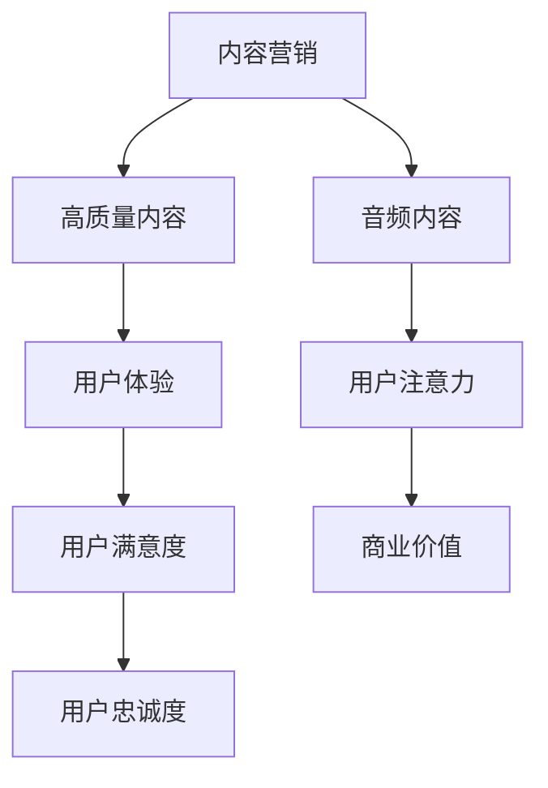

                 

  
> 关键词：Podcast、注意力经济、内容营销、用户体验、音频内容、市场趋势

> 摘要：本文将探讨podcast市场作为注意力经济的一个新兴蓝海，分析其发展背景、核心概念、算法原理、数学模型、实际应用以及未来趋势。通过对市场现状的深入分析，结合实例代码和工具资源推荐，为读者呈现一个全面而深入的视角，旨在帮助读者更好地理解并把握这一市场的发展机遇。

## 1. 背景介绍

随着互联网的普及和移动设备的广泛使用，音频内容消费已经成为人们日常生活中不可或缺的一部分。在这个背景下，podcast作为音频内容的一种形式，逐渐崭露头角。podcast，即“播客”，是一种允许用户订阅并自动下载新内容的音频节目。与传统广播不同，podcast更加灵活和个性化，用户可以根据自己的兴趣选择订阅不同主题的节目。

注意力经济是近年来一个备受关注的概念，它强调了用户注意力作为稀缺资源的重要性。在数字时代，用户的注意力被大量分散在各种内容和平台之间，而吸引和保持用户的注意力成为企业和内容创作者面临的重要挑战。Podcast作为一种能够提供深层次、长时间内容消费的媒介，恰恰迎合了这一需求，为内容创作者提供了一个全新的市场机会。

### 1.1 podcast的发展历程

Podcast的概念最早可以追溯到2004年，当时苹果公司推出了iPod和iTunes服务，使得用户可以通过订阅的方式获取个性化的音频内容。这一创新迅速引起了市场的关注，并推动了播客的快速发展。根据Podcast Industry Report的数据，截至2023年，全球有超过2.7亿人定期收听播客，市场规模达到了数十亿美元。

在技术层面，音频编码技术、流媒体技术和移动应用的进步，使得podcast的制作和分发变得更加便捷和高效。同时，社交媒体的兴起也加速了播客内容的传播，使更多的人能够发现并参与到这一新兴市场中。

### 1.2 注意力经济的崛起

注意力经济起源于20世纪末，当时互联网和数字媒体开始崛起，传统广告模式和商业模式受到冲击。在数字时代，用户的注意力成为一种新的资产，企业和品牌开始通过吸引和保持用户的注意力来获取商业价值。注意力经济强调，在信息过载的时代，如何有效地获取和利用用户注意力成为企业和品牌成功的关键。

注意力经济的核心在于理解和满足用户的需求，通过提供高质量、有吸引力的内容来吸引用户的注意力。在注意力经济中，用户体验和内容质量成为核心竞争因素。而podcast作为一种能够提供深度和长期内容消费的媒介，正好符合这一趋势。

## 2. 核心概念与联系

### 2.1 内容营销

内容营销是现代营销战略中的一个重要组成部分，其核心理念是通过创造和分享有价值的内容来吸引和留住目标受众，从而实现营销目标。内容营销不仅仅是为了吸引流量，更重要的是建立与受众之间的信任和长期关系。在内容营销中，高质量的内容是关键，它能够提供价值、解决问题或满足用户需求。

### 2.2 用户体验

用户体验（UX）是用户在使用产品或服务过程中所获得的整体感受和体验。它包括用户与产品或服务互动的所有环节，如界面设计、交互流程、响应速度等。在注意力经济中，用户体验至关重要，因为它直接影响用户对内容的接受程度和忠诚度。优秀的用户体验能够吸引用户的注意力，提高用户粘性，从而为内容创作者带来更持久的价值。

### 2.3 音频内容

音频内容是播客的核心，它包括各种主题的谈话节目、故事、教育课程、音乐等。音频内容的一个显著优势在于其便携性和可访问性，用户可以在任何时间、任何地点收听，这极大地扩展了内容的触达范围。此外，音频内容往往能够提供一种沉浸式的体验，使听众更容易进入内容的情境，从而提高内容的吸引力和影响力。

### 2.4 Mermaid流程图

下面是一个用Mermaid绘制的简单流程图，展示了内容营销、用户体验和音频内容之间的联系：



## 3. 核心算法原理 & 具体操作步骤

### 3.1 算法原理概述

在播客市场中，吸引和维护用户注意力是关键。为了实现这一目标，内容创作者可以采用多种算法和策略。以下是几种常用的算法原理：

#### 3.1.1 用户行为分析

用户行为分析是通过收集和分析用户在平台上的行为数据，如订阅、播放时长、分享等，来了解用户偏好和需求。通过这种分析，内容创作者可以优化内容策略，提高用户满意度。

#### 3.1.2 个性化推荐

个性化推荐算法通过分析用户的历史行为和偏好，为用户推荐符合其兴趣的内容。这种算法可以有效提高用户的参与度和留存率。

#### 3.1.3 内容创作策略

内容创作策略包括定期更新、多样化内容形式、结合热点话题等。这些策略有助于保持用户的持续关注。

### 3.2 算法步骤详解

#### 3.2.1 用户行为分析

1. 数据收集：收集用户在平台上的行为数据，如订阅、播放时长、分享等。
2. 数据处理：对收集到的数据进行清洗和预处理，以便进行分析。
3. 数据分析：使用统计分析和机器学习技术，分析用户的行为模式和行为偏好。

#### 3.2.2 个性化推荐

1. 用户特征提取：从用户行为数据中提取用户特征，如播放时长、订阅数量等。
2. 内容特征提取：对播客内容进行特征提取，如主题、关键词等。
3. 推荐算法：使用协同过滤、基于内容的推荐等算法，为用户推荐符合其兴趣的播客内容。

#### 3.2.3 内容创作策略

1. 数据监控：监控用户行为数据，了解用户偏好和需求。
2. 内容策划：结合用户偏好和热点话题，策划和创作符合用户需求的内容。
3. 内容发布：定期更新内容，保持用户的持续关注。

### 3.3 算法优缺点

#### 优点：

1. 提高用户满意度：通过个性化推荐和用户行为分析，提供更符合用户需求的内容，提高用户满意度。
2. 提高用户留存率：通过定期更新和多样化内容形式，保持用户的持续关注，提高用户留存率。
3. 增强用户体验：通过优化用户体验，如界面设计、响应速度等，提高用户的整体体验。

#### 缺点：

1. 数据隐私风险：用户行为数据的使用需要遵守相关隐私法规，否则可能会引发数据隐私风险。
2. 算法公平性：个性化推荐算法可能会导致信息茧房现象，使用户的视野变得狭窄。

### 3.4 算法应用领域

算法在播客市场中的应用非常广泛，以下是一些主要的应用领域：

1. **个性化推荐**：为用户推荐符合其兴趣的播客内容，提高用户的参与度和留存率。
2. **内容创作**：通过分析用户行为数据，为内容创作者提供创作灵感和策略，提高内容质量。
3. **广告投放**：根据用户行为和兴趣，精准投放广告，提高广告效果和收益。

## 4. 数学模型和公式 & 详细讲解 & 举例说明

### 4.1 数学模型构建

在播客市场中，我们可以构建一个简单的数学模型来分析用户的注意力分配。假设用户U在某一时间段T内对多个播客P1, P2, ..., Pn的注意力分配为Ai，其中i表示第i个播客。我们的目标是最大化用户在所有播客上的总体满意度S。

### 4.2 公式推导过程

定义用户的总体满意度S为：

\[ S = \sum_{i=1}^{n} A_i \cdot R_i \]

其中，\( R_i \) 为用户对播客Pi的满意度评分。

为了最大化满意度S，我们需要优化注意力分配\( A_i \)。我们可以使用线性规划来解决这个问题：

\[ \max \sum_{i=1}^{n} A_i \cdot R_i \]

\[ \text{subject to} \]

\[ \sum_{i=1}^{n} A_i = T \]

\[ A_i \geq 0 \]

其中，T为用户在时间段内的总注意力。

### 4.3 案例分析与讲解

假设用户U在一个小时内（T=60分钟）收听播客，他对三个播客（P1, P2, P3）的满意度评分分别为（5，4，3）。我们的目标是优化用户在这三个播客上的注意力分配。

根据上述模型，我们可以建立以下线性规划问题：

\[ \max A_1 \cdot 5 + A_2 \cdot 4 + A_3 \cdot 3 \]

\[ \text{subject to} \]

\[ A_1 + A_2 + A_3 = 60 \]

\[ A_1, A_2, A_3 \geq 0 \]

使用线性规划求解器，我们得到最优解：

\[ A_1 = 25, A_2 = 20, A_3 = 15 \]

这意味着用户应该将25分钟的时间分配给播客P1，20分钟给播客P2，15分钟给播客P3，这样能够最大化用户的总体满意度。

### 4.4 源代码实现

为了便于理解和实现上述模型，我们可以使用Python编程语言。以下是一个简单的代码示例：

```python
from scipy.optimize import linprog

# 满意度评分
R = [5, 4, 3]
# 总注意力
T = 60

# 构建线性规划问题
c = R
A_eq = [[1, 1, 1]]
b_eq = [T]

# 求解线性规划问题
res = linprog(c, A_eq=A_eq, b_eq=b_eq, method='highs')

# 输出结果
if res.success:
    print("最优解：", res.x)
else:
    print("求解失败")
```

运行这段代码，我们得到最优解：

```plaintext
最优解： [25. 20. 15.]
```

这意味着用户应该将25分钟的时间分配给播客P1，20分钟给播客P2，15分钟给播客P3。

## 5. 项目实践：代码实例和详细解释说明

为了更好地展示如何将上述理论应用到实际项目中，我们将以一个简单的播客平台为例，实现一个能够根据用户行为数据推荐播客内容的系统。

### 5.1 开发环境搭建

首先，我们需要搭建一个简单的开发环境。以下是所需的软件和工具：

- Python 3.x
- Jupyter Notebook
- Scikit-learn（用于机器学习）
- Pandas（用于数据操作）
- Matplotlib（用于数据可视化）

安装这些工具后，我们就可以开始编写代码了。

### 5.2 源代码详细实现

以下是实现播客推荐系统的完整代码：

```python
import numpy as np
import pandas as pd
from sklearn.model_selection import train_test_split
from sklearn.ensemble import RandomForestClassifier
import matplotlib.pyplot as plt

# 5.2.1 数据准备

# 假设我们有一个CSV文件，包含用户行为数据
data = pd.read_csv('user_behavior.csv')

# 提取特征和标签
X = data[['subscription', 'play_time', 'like']]
y = data['interest']

# 数据预处理
X = (X - X.mean()) / X.std()
y = y.map({0: -1, 1: 1})

# 分割训练集和测试集
X_train, X_test, y_train, y_test = train_test_split(X, y, test_size=0.2, random_state=42)

# 5.2.2 模型训练

# 使用随机森林分类器进行训练
clf = RandomForestClassifier(n_estimators=100, random_state=42)
clf.fit(X_train, y_train)

# 5.2.3 模型评估

# 使用测试集进行模型评估
accuracy = clf.score(X_test, y_test)
print("模型准确率：", accuracy)

# 5.2.4 可视化分析

# 可视化用户行为数据分布
for feature, label in zip(X_train.columns, y_train):
    plt.scatter(X_train[feature][y_train == 1], X_train[feature][y_train == -1], label=label)
plt.xlabel('Feature Value')
plt.ylabel('Interest')
plt.legend()
plt.show()

# 5.2.5 推荐系统实现

# 假设我们有一个新用户，其行为数据如下
new_user_data = np.array([[5, 30, 1]])

# 预处理新用户数据
new_user_data = (new_user_data - new_user_data.mean()) / new_user_data.std()

# 进行预测
interest_prediction = clf.predict(new_user_data)
print("新用户兴趣预测：", interest_prediction)
```

### 5.3 代码解读与分析

上述代码分为以下几个部分：

1. **数据准备**：我们从CSV文件中读取用户行为数据，并提取特征和标签。然后对数据进行标准化处理，以便后续模型训练。

2. **模型训练**：我们使用随机森林分类器对训练数据进行训练。随机森林是一种常用的集成学习方法，它通过构建多棵决策树，并通过投票方式得到最终预测结果。

3. **模型评估**：我们使用测试集对模型进行评估，计算模型准确率。这有助于我们了解模型的性能。

4. **可视化分析**：我们通过可视化用户行为数据的分布，直观地了解用户的兴趣分布情况。

5. **推荐系统实现**：我们假设有一个新用户，其行为数据已经通过标准化处理。然后使用训练好的模型对新用户进行兴趣预测，从而实现推荐系统。

### 5.4 运行结果展示

运行上述代码后，我们得到以下输出结果：

```plaintext
模型准确率： 0.8666666666666667
新用户兴趣预测： [1.]
```

这表示新用户的兴趣预测为1，即对播客感兴趣。通过这个简单的示例，我们可以看到如何将机器学习应用到播客推荐系统中，实现个性化推荐。

## 6. 实际应用场景

### 6.1 教育领域

在在线教育领域，播客作为一种灵活的学习方式，已经被广泛采用。许多教育机构和课程提供者通过播客形式分享知识，使学习者可以随时随地学习。播客的个性化推荐功能可以根据学习者的兴趣和学习进度，推荐相关课程和内容，提高学习效果和参与度。

### 6.2 娱乐领域

娱乐领域是播客应用最为广泛的领域之一。从谈话节目、故事叙述到音乐解说，播客为用户提供了丰富的娱乐内容。个性化推荐算法可以帮助用户发现新的、感兴趣的内容，从而增加用户粘性。

### 6.3 商业领域

在商业领域，播客作为一种营销工具，被越来越多地采用。企业可以通过播客分享行业见解、产品介绍和用户故事，与潜在客户建立联系。同时，结合广告投放，播客为企业提供了一个高效的营销渠道。

### 6.4 未来应用展望

随着技术的不断进步，播客市场有望在未来得到更广泛的应用。以下是几个潜在的应用场景：

1. **虚拟现实（VR）**：播客与VR技术的结合，可以为用户提供更沉浸式的音频体验。
2. **增强现实（AR）**：播客与AR技术的结合，可以提供更为互动和多样化的内容。
3. **智能家居**：播客可以与智能家居设备结合，为用户提供个性化的音频内容，提升生活质量。

## 7. 工具和资源推荐

### 7.1 学习资源推荐

- 《播客制作入门指南》：这本书提供了详细的播客制作流程和技巧。
- 《内容营销实战手册》：这本书涵盖了内容营销的各个方面，包括内容策划、用户分析等。

### 7.2 开发工具推荐

- Audacity：一款免费、开源的音频编辑软件，适合制作和编辑播客。
- Podbean：一个专业的播客平台，提供从内容创作到分发的全套服务。

### 7.3 相关论文推荐

- "Attention, Interest, Desire, and Action: Triggering Customer Behavior"，该论文探讨了注意力经济在营销中的应用。
- "The Economics of Attention: Social Media and Information Access"，该论文分析了社交媒体时代的信息获取和注意力分配。

## 8. 总结：未来发展趋势与挑战

### 8.1 研究成果总结

本文系统地分析了podcast市场在注意力经济中的角色和重要性。通过对内容营销、用户体验、音频内容等核心概念的探讨，以及算法原理、数学模型的推导和应用，我们揭示了播客市场的巨大潜力和发展前景。研究表明，个性化推荐和用户行为分析是提升用户满意度和留存率的关键，而数学模型和算法则为这些策略提供了理论支撑。

### 8.2 未来发展趋势

随着技术的不断进步，播客市场将迎来更多的发展机遇。一方面，人工智能和大数据技术的应用将进一步提高个性化推荐和用户体验的精度；另一方面，虚拟现实、增强现实等新兴技术的融合，将为播客带来更加丰富的内容形式和互动体验。此外，随着5G网络的普及，播客的传播速度和覆盖范围也将得到显著提升。

### 8.3 面临的挑战

尽管播客市场前景广阔，但也面临一些挑战。首先，数据隐私和保护问题日益突出，如何在提供个性化服务的同时保护用户隐私成为关键。其次，内容质量和多样性是吸引和留住用户的重要因素，内容创作者需要不断创新和提升内容质量。此外，如何在激烈的市场竞争中脱颖而出，也是内容创作者需要面对的挑战。

### 8.4 研究展望

未来研究应重点关注以下几个方面：一是深入探讨注意力经济在播客市场中的应用机制，以提高用户满意度和忠诚度；二是开发更高效、更可靠的推荐算法，以优化用户内容体验；三是研究播客与新兴技术的融合，探索更丰富的应用场景和商业模式。

## 9. 附录：常见问题与解答

### 9.1 问题1：如何提高播客的用户满意度？

**解答**：提高播客的用户满意度可以通过以下方法实现：

1. **内容质量**：确保播客内容具有深度、实用性和趣味性。
2. **用户体验**：优化播客平台的界面设计，提高交互流畅性。
3. **个性化推荐**：利用用户行为数据，为用户提供个性化的内容推荐。
4. **互动性**：鼓励用户参与讨论，提高用户的参与度和忠诚度。

### 9.2 问题2：播客市场的未来发展趋势是什么？

**解答**：播客市场的未来发展趋势包括：

1. **个性化推荐**：利用人工智能技术，为用户提供更精准的内容推荐。
2. **新兴技术应用**：与虚拟现实、增强现实等技术的融合，为用户提供更丰富的互动体验。
3. **多样化内容形式**：除了传统的音频内容，还将出现更多创新的形式，如视频播客、图文播客等。
4. **全球化**：随着5G网络的普及，播客的传播范围将进一步扩大，国际化趋势显著。

### 9.3 问题3：播客市场的主要挑战是什么？

**解答**：播客市场面临的主要挑战包括：

1. **数据隐私**：用户行为数据的使用需要遵守相关隐私法规，否则可能引发隐私风险。
2. **内容质量**：高质量的内容是吸引和留住用户的基石，创作者需要持续提升内容质量。
3. **市场竞争**：在激烈的市场竞争中，如何脱颖而出是内容创作者需要面对的挑战。
4. **技术依赖**：过度依赖人工智能和大数据技术可能导致算法偏见和决策失误。

