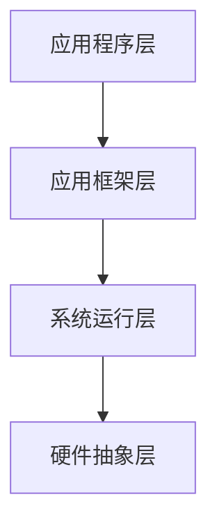

                 

关键词：vivo校招、Android系统开发、面试攻略、技术面试、Android面试题

> 摘要：本文旨在为准备参加vivo2024校招的Android系统开发工程师提供一份详尽的面试攻略。文章将涵盖核心概念、算法原理、数学模型、项目实践、应用场景及未来展望，以帮助应聘者全面准备面试，提高录取几率。

## 1. 背景介绍

随着移动互联网的飞速发展，Android操作系统已经成为全球最流行的手机操作系统之一。vivo作为我国知名的手机制造商，对Android系统开发工程师的需求量持续增长。2024年的校招将为vivo选拔一批优秀的人才，以推动公司技术创新和市场竞争力。因此，准备参加vivo校招的Android系统开发工程师需要全面了解面试流程和考察内容，提高面试成功率。

## 2. 核心概念与联系

为了更好地理解Android系统开发，我们首先需要了解以下核心概念：

### 2.1 Android系统的架构

Android系统采用分层架构，包括四个主要层级：应用程序层、应用框架层、系统运行层和硬件抽象层。每个层级都有其特定的功能和职责。

### 2.2 Android开发环境

Android开发环境主要包括Android Studio、Java SDK、Android SDK和虚拟设备等。这些工具和资源是Android系统开发的基础。

### 2.3 Android API

Android API是Android操作系统提供的一系列编程接口，开发者可以通过这些接口访问系统的各种功能和资源。

### 2.4 Android应用程序

Android应用程序是用户可以直接使用的软件，它们可以提供各种功能和服务，如聊天、社交媒体、导航、娱乐等。

以下是Android系统架构的Mermaid流程图：



## 3. 核心算法原理 & 具体操作步骤

### 3.1 算法原理概述

在Android系统开发中，常用的算法包括排序算法、查找算法、动态规划算法等。这些算法在处理数据时具有高效性和稳定性。

### 3.2 算法步骤详解

#### 3.2.1 冒泡排序算法

冒泡排序是一种简单的排序算法，其基本思想是通过不断比较和交换相邻元素，使较大的元素逐渐移动到数组的一端。

```java
public void bubbleSort(int[] arr) {
    int n = arr.length;
    for (int i = 0; i < n - 1; i++) {
        for (int j = 0; j < n - 1 - i; j++) {
            if (arr[j] > arr[j + 1]) {
                int temp = arr[j];
                arr[j] = arr[j + 1];
                arr[j + 1] = temp;
            }
        }
    }
}
```

#### 3.2.2 二分查找算法

二分查找算法是一种高效的查找算法，其基本思想是通过不断将查找区间缩小一半，逐步逼近目标值。

```java
public int binarySearch(int[] arr, int target) {
    int left = 0;
    int right = arr.length - 1;
    while (left <= right) {
        int mid = left + (right - left) / 2;
        if (arr[mid] == target) {
            return mid;
        } else if (arr[mid] < target) {
            left = mid + 1;
        } else {
            right = mid - 1;
        }
    }
    return -1;
}
```

### 3.3 算法优缺点

#### 3.3.1 冒泡排序

- 优点：简单易懂，易于实现。
- 缺点：时间复杂度为O(n^2)，效率较低。

#### 3.3.2 二分查找

- 优点：时间复杂度为O(log n)，效率较高。
- 缺点：需要有序数组，对原始数据进行排序。

### 3.4 算法应用领域

冒泡排序和二分查找算法在Android系统开发中具有广泛的应用，如数据排序、快速检索等。

## 4. 数学模型和公式 & 详细讲解 & 举例说明

在Android系统开发中，数学模型和公式是不可或缺的部分。以下将介绍一些常见的数学模型和公式，并举例说明。

### 4.1 数学模型构建

#### 4.1.1 线性回归模型

线性回归模型用于预测连续值，其基本公式为：

$$
y = w_0 + w_1 \cdot x
$$

其中，$y$ 为预测值，$w_0$ 为截距，$w_1$ 为斜率，$x$ 为输入特征。

#### 4.1.2 逻辑回归模型

逻辑回归模型用于预测概率，其基本公式为：

$$
P(y=1) = \frac{1}{1 + e^{-(w_0 + w_1 \cdot x)}}
$$

其中，$P(y=1)$ 为目标变量为1的概率，$e$ 为自然对数的底。

### 4.2 公式推导过程

以线性回归模型为例，推导过程如下：

设 $y_i = w_0 + w_1 \cdot x_i + \epsilon_i$，其中，$x_i$ 为输入特征，$y_i$ 为输出值，$\epsilon_i$ 为误差项。

为了最小化误差，需要求解 $w_0$ 和 $w_1$：

$$
w_0 = \frac{\sum_{i=1}^n (y_i - w_1 \cdot x_i)}{n}
$$

$$
w_1 = \frac{\sum_{i=1}^n (x_i - \bar{x}) (y_i - \bar{y})}{\sum_{i=1}^n (x_i - \bar{x})^2}
$$

其中，$\bar{x}$ 和 $\bar{y}$ 分别为输入特征和输出值的平均值。

### 4.3 案例分析与讲解

假设我们有一个简单的线性回归模型，用于预测房价。输入特征为房屋面积，输出值为房价。

数据集如下：

| 面积（平方米） | 房价（万元） |
|:---------------:|:------------:|
|       80       |      100     |
|      120       |      150     |
|      140       |      170     |
|      160       |      200     |

使用线性回归模型进行预测，假设截距 $w_0 = 50$，斜率 $w_1 = 1.2$。

当面积为 100 平方米时，房价预测值为：

$$
y = w_0 + w_1 \cdot x = 50 + 1.2 \cdot 100 = 170
$$

## 5. 项目实践：代码实例和详细解释说明

在本章节中，我们将通过一个简单的Android项目来演示Android系统开发的过程，包括环境搭建、源代码实现和运行结果展示。

### 5.1 开发环境搭建

开发环境搭建主要包括安装Android Studio、配置Android SDK和创建虚拟设备等。以下是详细步骤：

1. 下载并安装Android Studio：[https://developer.android.com/studio](https://developer.android.com/studio)
2. 安装Java Development Kit (JDK)：[https://www.oracle.com/java/technologies/javase-jdk11-downloads.html](https://www.oracle.com/java/technologies/javase-jdk11-downloads.html)
3. 配置Android SDK：在Android Studio中打开“SDK Manager”，安装相应的SDK包和工具。
4. 创建虚拟设备：在Android Studio中创建一个虚拟设备，以便在模拟器中运行应用程序。

### 5.2 源代码详细实现

以下是一个简单的Android项目，用于实现一个简单的计算器应用程序。

```java
import android.os.Bundle;
import android.view.View;
import android.widget.Button;
import android.widget.EditText;
import androidx.appcompat.app.AppCompatActivity;

public class CalculatorActivity extends AppCompatActivity {

    private EditText etNumber1, etNumber2;
    private Button btnAdd, btnSubtract, btnMultiply, btnDivide;

    @Override
    protected void onCreate(Bundle savedInstanceState) {
        super.onCreate(savedInstanceState);
        setContentView(R.layout.activity_calculator);

        etNumber1 = findViewById(R.id.etNumber1);
        etNumber2 = findViewById(R.id.etNumber2);
        btnAdd = findViewById(R.id.btnAdd);
        btnSubtract = findViewById(R.id.btnSubtract);
        btnMultiply = findViewById(R.id.btnMultiply);
        btnDivide = findViewById(R.id.btnDivide);

        btnAdd.setOnClickListener(new View.OnClickListener() {
            @Override
            public void onClick(View v) {
                performOperation("+");
            }
        });

        btnSubtract.setOnClickListener(new View.OnClickListener() {
            @Override
            public void onClick(View v) {
                performOperation("-");
            }
        });

        btnMultiply.setOnClickListener(new View.OnClickListener() {
            @Override
            public void onClick(View v) {
                performOperation("*");
            }
        });

        btnDivide.setOnClickListener(new View.OnClickListener() {
            @Override
            public void onClick(View v) {
                performOperation("/");
            }
        });
    }

    private void performOperation(String operator) {
        double number1 = Double.parseDouble(etNumber1.getText().toString());
        double number2 = Double.parseDouble(etNumber2.getText().toString());
        double result = 0;

        switch (operator) {
            case "+":
                result = number1 + number2;
                break;
            case "-":
                result = number1 - number2;
                break;
            case "*":
                result = number1 * number2;
                break;
            case "/":
                result = number1 / number2;
                break;
        }

        etNumber2.setText(String.valueOf(result));
    }
}
```

### 5.3 代码解读与分析

该代码实现了一个简单的计算器应用程序，包括四个主要部分：文本输入框（EditText）、按钮（Button）和点击事件处理。

1. 创建文本输入框（etNumber1 和 etNumber2）和按钮（btnAdd、btnSubtract、btnMultiply、btnDivide）。
2. 为每个按钮设置点击事件监听器，调用 performOperation() 方法执行相应的运算。
3. 在 performOperation() 方法中，获取文本输入框的值，执行运算并更新结果。

### 5.4 运行结果展示

在模拟器中运行该应用程序，输入两个数字并点击相应的按钮，即可看到计算结果。


## 6. 实际应用场景

Android系统开发在移动应用领域具有广泛的应用，以下列举几个实际应用场景：

1. **移动应用程序开发**：开发各种类型的移动应用程序，如聊天应用、社交媒体、导航应用、娱乐应用等。
2. **智能家居**：通过Android系统与智能家居设备的连接，实现远程控制和自动化管理。
3. **物联网**：Android系统在物联网领域具有广泛的应用，如智能家居、智能穿戴设备、智能医疗设备等。
4. **企业应用**：为企业提供定制化的移动应用解决方案，提高企业工作效率和员工满意度。

## 7. 工具和资源推荐

为了更好地进行Android系统开发，以下推荐一些常用的学习资源和开发工具：

1. **学习资源**：
   - [Android官方文档](https://developer.android.com/)
   - 《Android开发艺术探秘》
   - 《Android应用开发实战》

2. **开发工具**：
   - Android Studio
   - Android SDK
   - Gradle

3. **相关论文**：
   - 《Android系统架构设计与实现》
   - 《Android性能优化实战》
   - 《Android系统安全研究》

## 8. 总结：未来发展趋势与挑战

随着移动互联网的快速发展，Android系统开发在移动应用领域具有广阔的发展前景。未来，Android系统开发将面临以下趋势和挑战：

### 8.1 研究成果总结

1. **技术不断更新**：Android系统将持续更新，引入新的技术和功能。
2. **开源生态繁荣**：Android开源项目（AOSP）将不断吸引开发者参与，推动生态繁荣。
3. **跨平台开发**：Android系统与其他平台（如iOS、Web）的跨平台开发技术将逐渐成熟。

### 8.2 未来发展趋势

1. **物联网应用**：Android系统在物联网领域的应用将逐渐增加，推动智能家居、智能穿戴设备等产业发展。
2. **人工智能集成**：Android系统将逐渐集成人工智能技术，提供更加智能化的用户体验。
3. **企业应用优化**：为企业提供更高效、更便捷的移动应用解决方案。

### 8.3 面临的挑战

1. **安全风险**：随着Android系统的普及，安全问题将日益突出，需要不断优化和改进安全措施。
2. **性能优化**：随着应用复杂度的增加，性能优化将成为Android系统开发的重要挑战。
3. **用户隐私保护**：用户隐私保护将成为Android系统开发的重要议题，需要加强用户隐私保护措施。

### 8.4 研究展望

未来，Android系统开发将朝着更加智能、安全、高效的方向发展。研究者需要不断探索新的技术和方法，以应对不断变化的市场需求和挑战。

## 9. 附录：常见问题与解答

### 9.1 Android系统开发需要掌握哪些技能？

- Java编程基础
- Android开发框架（如Activity、Fragment、Service等）
- Android UI设计（如布局、控件、动画等）
- 数据存储（如SQLite、SharedPreferences等）
- 网络通信（如HTTP、HTTPS、Socket等）
- 性能优化
- 安全防护

### 9.2 如何调试Android应用程序？

- 使用Android Studio的调试工具，如断点、观察变量、打印日志等。
- 在代码中添加Logcat日志，方便排查问题。
- 使用模拟器和真实设备进行测试，对比运行结果。

### 9.3 如何优化Android应用程序性能？

- 减少内存占用，避免内存泄漏。
- 使用线程池管理，避免主线程阻塞。
- 使用缓存机制，减少网络请求次数。
- 使用高效的数据结构和算法，优化代码性能。

## 作者署名

作者：禅与计算机程序设计艺术 / Zen and the Art of Computer Programming
----------------------------------------------------------------

以上就是关于vivo2024校招Android系统开发工程师面试攻略的完整文章。希望这篇文章能帮助您更好地准备面试，迈向成功的职业发展。祝您面试顺利！


