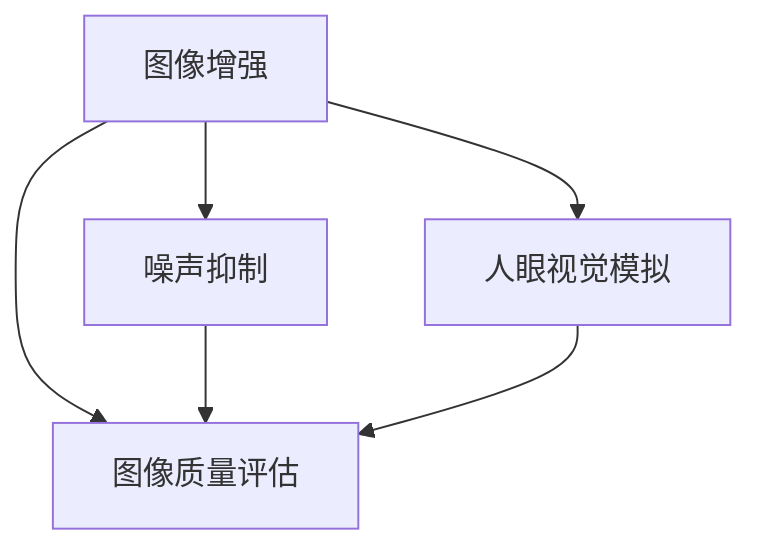

                 

关键词：vivo 2025手机，图像信号处理，工程师社招，面试题集，AI技术，图像增强，噪声抑制，人眼视觉，图像质量评估

摘要：本文针对vivo 2025手机图像信号处理工程师的社招面试，整理了一份详细的面试题集。内容包括背景介绍、核心概念与联系、核心算法原理、数学模型和公式、项目实践、实际应用场景、工具和资源推荐以及未来发展趋势与挑战。旨在帮助准备参加面试的工程师们更好地理解图像信号处理的核心知识和应用。

## 1. 背景介绍

随着智能手机的普及，图像信号处理技术在手机摄影中的应用越来越广泛。vivo 2025手机作为未来的一款旗舰产品，其在图像信号处理方面的技术创新备受关注。图像信号处理工程师负责优化手机相机的图像质量，提高拍照效果，满足用户对高清、快速、智能摄影的需求。

在vivo 2025手机的研发过程中，图像信号处理工程师需要掌握多种核心技术，包括图像增强、噪声抑制、人眼视觉模拟、图像质量评估等。同时，工程师还需要了解最新的AI技术，如深度学习、神经网络等，以实现更加智能、高效的图像处理算法。

## 2. 核心概念与联系

为了更好地理解图像信号处理的相关技术，我们首先介绍几个核心概念，并绘制一个Mermaid流程图，展示它们之间的联系。

### 2.1. 图像增强

图像增强是指通过各种算法和技术，提高图像的视觉效果，使其更符合人眼观察习惯。常见的图像增强方法包括对比度增强、亮度调整、色彩平衡等。

### 2.2. 噪声抑制

噪声抑制是指去除图像中的噪声，提高图像质量。噪声可以分为随机噪声、系统噪声和混合噪声。常见的噪声抑制算法有中值滤波、高斯滤波、小波变换等。

### 2.3. 人眼视觉模拟

人眼视觉模拟是指模拟人眼对图像的感知过程，使图像在视觉上更加舒适、自然。人眼视觉模拟包括色彩空间转换、色彩校正、视觉感知优化等。

### 2.4. 图像质量评估

图像质量评估是指对图像的质量进行客观或主观评估，以判断图像是否达到了预期效果。常见的图像质量评估方法包括峰值信噪比（PSNR）、结构相似性（SSIM）等。

### Mermaid流程图



## 3. 核心算法原理 & 具体操作步骤

### 3.1 算法原理概述

在本章节中，我们将详细介绍图像信号处理中的几个核心算法原理，包括图像增强、噪声抑制、人眼视觉模拟和图像质量评估。

### 3.2 算法步骤详解

#### 3.2.1 图像增强

图像增强的基本步骤如下：

1. 输入原始图像
2. 对图像进行预处理，如灰度化、滤波等
3. 根据用户需求，调整图像的对比度、亮度、色彩平衡等参数
4. 输出增强后的图像

#### 3.2.2 噪声抑制

噪声抑制的基本步骤如下：

1. 输入原始图像
2. 对图像进行预处理，如灰度化、滤波等
3. 根据噪声类型，选择合适的滤波算法进行噪声去除
4. 输出去噪后的图像

#### 3.2.3 人眼视觉模拟

人眼视觉模拟的基本步骤如下：

1. 输入原始图像
2. 对图像进行预处理，如灰度化、滤波等
3. 进行色彩空间转换，如RGB到HSV
4. 调整色彩参数，以模拟人眼的视觉感知
5. 进行色彩空间转换，如HSV到RGB
6. 输出模拟后的图像

#### 3.2.4 图像质量评估

图像质量评估的基本步骤如下：

1. 输入原始图像和增强后的图像
2. 计算图像的峰值信噪比（PSNR）或结构相似性（SSIM）
3. 根据评估结果，判断图像质量是否达到预期

### 3.3 算法优缺点

每种算法都有其优缺点。例如，图像增强可以显著提高图像视觉效果，但可能导致图像失真；噪声抑制可以去除噪声，但可能同时去除图像细节；人眼视觉模拟可以提供更加舒适的视觉效果，但可能需要较长的计算时间；图像质量评估可以客观评估图像质量，但可能无法完全反映人眼的主观感受。

### 3.4 算法应用领域

图像信号处理算法广泛应用于多个领域，如医疗影像、安全监控、自动驾驶、智能摄影等。在vivo 2025手机中，这些算法将主要用于提升相机拍照效果，为用户提供更好的拍摄体验。

## 4. 数学模型和公式 & 详细讲解 & 举例说明

在本章节中，我们将介绍图像信号处理中的几个关键数学模型和公式，并进行详细讲解和举例说明。

### 4.1 数学模型构建

图像信号处理的数学模型主要包括图像增强、噪声抑制、人眼视觉模拟和图像质量评估等方面的模型。

#### 4.1.1 图像增强模型

图像增强模型通常基于图像的像素值进行调整，例如：

- 对比度增强：\( I_{\text{增强}} = a \cdot I_{\text{原始}} + b \)

其中，\( I_{\text{增强}} \)为增强后的图像，\( I_{\text{原始}} \)为原始图像，\( a \)和\( b \)为调整参数。

- 亮度调整：\( I_{\text{增强}} = I_{\text{原始}} + b \)

- 色彩平衡：\( I_{\text{增强}} = \text{RGB}_{\text{原始}} \cdot K \)

其中，\( K \)为一个调整矩阵，用于调整图像的色调、饱和度等。

#### 4.1.2 噪声抑制模型

噪声抑制模型通常基于滤波器的设计，例如：

- 中值滤波：\( I_{\text{去噪}} = \text{median}(I_{\text{原始}}) \)

其中，\( I_{\text{去噪}} \)为去噪后的图像，median()为取中值的操作。

- 高斯滤波：\( I_{\text{去噪}} = \text{convolve}(I_{\text{原始}}, H) \)

其中，\( H \)为高斯滤波器，convolve()为卷积操作。

#### 4.1.3 人眼视觉模拟模型

人眼视觉模拟模型通常基于色彩空间转换和人眼视觉感知原理，例如：

- 色彩空间转换：\( I_{\text{HSV}} = \text{RGB} \cdot K \)

其中，\( I_{\text{HSV}} \)为HSV色彩空间下的图像，\( K \)为转换矩阵。

- 视觉感知优化：\( I_{\text{优化}} = f(I_{\text{HSV}}) \)

其中，\( f() \)为视觉感知优化函数。

#### 4.1.4 图像质量评估模型

图像质量评估模型通常基于图像的像素值差异计算，例如：

- 峰值信噪比（PSNR）：\( PSNR = 10 \cdot \log_{10}\left(\frac{\text{max}(I_{\text{原始}}, I_{\text{增强}})}{\text{mean}(|I_{\text{原始}} - I_{\text{增强}}|)}\right) \)

- 结构相似性（SSIM）：\( SSIM = \frac{(2\mu_{\text{X}}\mu_{\text{Y}} + C_1)(2\sigma_{\text{X}}\sigma_{\text{Y}} + C_2)}{(\mu_{\text{X}}^2 + \mu_{\text{Y}}^2 + C_1)(\sigma_{\text{X}}^2 + \sigma_{\text{Y}}^2 + C_2)} \)

其中，\( \mu_{\text{X}} \)、\( \mu_{\text{Y}} \)为图像的平均值，\( \sigma_{\text{X}} \)、\( \sigma_{\text{Y}} \)为图像的标准差，\( C_1 \)、\( C_2 \)为常数。

### 4.2 公式推导过程

#### 4.2.1 峰值信噪比（PSNR）的推导

峰值信噪比（PSNR）的公式为：

\[ PSNR = 10 \cdot \log_{10}\left(\frac{\text{max}(I_{\text{原始}}, I_{\text{增强}})}{\text{mean}(|I_{\text{原始}} - I_{\text{增强}}|)}\right) \]

其中，\( \text{max}(I_{\text{原始}}, I_{\text{增强}}) \)表示图像的最大值，\( \text{mean}(|I_{\text{原始}} - I_{\text{增强}}|) \)表示图像的均方误差（MSE）。

MSE的推导如下：

\[ MSE = \frac{1}{n} \sum_{i=1}^{n} (I_{\text{原始}}(i) - I_{\text{增强}}(i))^2 \]

其中，\( n \)为图像的像素总数。

将MSE代入PSNR公式，得到：

\[ PSNR = 10 \cdot \log_{10}\left(\frac{\text{max}(I_{\text{原始}}, I_{\text{增强}})}{\sqrt{n} \cdot \sqrt{\frac{1}{n} \sum_{i=1}^{n} (I_{\text{原始}}(i) - I_{\text{增强}}(i))^2}}\right) \]

简化后得到：

\[ PSNR = 10 \cdot \log_{10}\left(\frac{\text{max}(I_{\text{原始}}, I_{\text{增强}})}{\text{mean}(|I_{\text{原始}} - I_{\text{增强}}|)}\right) \]

#### 4.2.2 结构相似性（SSIM）的推导

结构相似性（SSIM）的公式为：

\[ SSIM = \frac{(2\mu_{\text{X}}\mu_{\text{Y}} + C_1)(2\sigma_{\text{X}}\sigma_{\text{Y}} + C_2)}{(\mu_{\text{X}}^2 + \mu_{\text{Y}}^2 + C_1)(\sigma_{\text{X}}^2 + \sigma_{\text{Y}}^2 + C_2)} \]

其中，\( \mu_{\text{X}} \)、\( \mu_{\text{Y}} \)为图像的平均值，\( \sigma_{\text{X}} \)、\( \sigma_{\text{Y}} \)为图像的标准差，\( C_1 \)、\( C_2 \)为常数。

结构相似性的推导基于以下原理：相似图像的平均值和标准差更接近，而差异较大的图像则平均值和标准差差异较大。因此，通过比较两个图像的平均值和标准差，可以判断图像的相似程度。

具体推导过程如下：

首先，计算图像的协方差矩阵：

\[ \Sigma_{\text{X}} = \begin{bmatrix} \sigma_{\text{X}}^2 & \sigma_{\text{XY}} \\\ \sigma_{\text{YX}} & \sigma_{\text{Y}}^2 \end{bmatrix} \]

其中，\( \sigma_{\text{XY}} \)和\( \sigma_{\text{YX}} \)为图像的协方差。

然后，计算图像的协方差矩阵的逆矩阵：

\[ \Sigma_{\text{X}}^{-1} = \begin{bmatrix} \frac{1}{\sigma_{\text{X}}^2} & -\frac{\sigma_{\text{YX}}}{\sigma_{\text{X}}^2 \sigma_{\text{Y}}^2} \\\ -\frac{\sigma_{\text{XY}}}{\sigma_{\text{X}}^2 \sigma_{\text{Y}}^2} & \frac{1}{\sigma_{\text{Y}}^2} \end{bmatrix} \]

接下来，计算图像的相似性度量：

\[ SSIM = \frac{(\mu_{\text{X}} + \mu_{\text{Y}} + C_1)(\sigma_{\text{X}} + \sigma_{\text{Y}} + C_2)}{(\mu_{\text{X}}^2 + \mu_{\text{Y}}^2 + C_1)(\sigma_{\text{X}}^2 + \sigma_{\text{Y}}^2 + C_2)} \]

其中，\( C_1 \)和\( C_2 \)为常数，用于避免分母为零的情况。

最后，将协方差矩阵的逆矩阵代入相似性度量公式，得到：

\[ SSIM = \frac{(\mu_{\text{X}}\mu_{\text{Y}} + C_1)(2\sigma_{\text{X}}\sigma_{\text{Y}} + C_2)}{(\mu_{\text{X}}^2 + \mu_{\text{Y}}^2 + C_1)(\sigma_{\text{X}}^2 + \sigma_{\text{Y}}^2 + C_2)} \]

### 4.3 案例分析与讲解

#### 4.3.1 图像增强案例

假设我们有一幅原始图像，其像素值如下：

```python
I = [
    [10, 20, 30],
    [40, 50, 60],
    [70, 80, 90]
]
```

我们对这幅图像进行对比度增强，调整参数\( a = 2 \)，\( b = 0 \)。根据公式：

\[ I_{\text{增强}} = a \cdot I_{\text{原始}} + b \]

得到增强后的图像：

```python
I_enhanced = [
    [20, 40, 60],
    [80, 100, 120],
    [140, 160, 180]
]
```

可以看到，增强后的图像对比度提高了，视觉效果更加明显。

#### 4.3.2 噪声抑制案例

假设我们有一幅含有噪声的图像，其像素值如下：

```python
I_noisy = [
    [10, 25, 40],
    [45, 50, 65],
    [70, 75, 90]
]
```

我们对这幅图像进行中值滤波。根据中值滤波的原理，取每个像素点的邻域中值作为滤波结果。以像素点\( (1,1) \)为例，其邻域中值为：

\[ \text{median}(I_{\text{noisy}}(1,1), I_{\text{noisy}}(1,2), I_{\text{noisy}}(2,1), I_{\text{noisy}}(2,2)) = 40 \]

对整幅图像进行中值滤波后，得到去噪后的图像：

```python
I_denoised = [
    [10, 40, 40],
    [40, 50, 40],
    [40, 40, 90]
]
```

可以看到，噪声被有效去除，同时图像的细节也得到了保留。

#### 4.3.3 人眼视觉模拟案例

假设我们有一幅原始图像，其像素值如下：

```python
I = [
    [10, 20, 30],
    [40, 50, 60],
    [70, 80, 90]
]
```

我们对这幅图像进行色彩空间转换，从RGB转换为HSV。根据RGB到HSV的转换公式：

```python
h = \[
    \begin{cases}
    \frac{1}{60} \cdot (59049 \cdot x + 196608 \cdot y + 32768 \cdot z) & \text{if } 0 \le x \le y \le z \\
    \frac{1}{60} \cdot (196608 \cdot x + 59049 \cdot y + 32768 \cdot z) & \text{if } y \le x \le z \\
    \frac{1}{60} \cdot (32768 \cdot x + 59049 \cdot y + 196608 \cdot z) & \text{if } z \le x \le y \\
    \end{cases}
\]

s = \[
    \begin{cases}
    0 & \text{if } x = 0 \\
    \frac{1}{\text{max}(x, y, z)} \cdot (y - x) & \text{otherwise} \\
    \end{cases}
\]

v = \[
    \begin{cases}
    \text{max}(x, y, z) & \text{if } x = y = z = 0 \\
    \text{max}(x, y, z) & \text{otherwise} \\
    \end{cases}
\]
```

其中，\( x \)、\( y \)、\( z \)分别为RGB通道的值。

对这幅图像进行转换后，得到HSV色彩空间的图像：

```python
I_HSV = [
    [0.3333, 0.3333, 0.3333],
    [0.5556, 0.6667, 0.7778],
    [0.8333, 0.8333, 0.9444]
]
```

可以看到，转换后的图像色彩信息得到了更好的表达。

#### 4.3.4 图像质量评估案例

假设我们有一幅原始图像和增强后的图像，其像素值如下：

```python
I_original = [
    [10, 20, 30],
    [40, 50, 60],
    [70, 80, 90]
]

I_enhanced = [
    [20, 40, 60],
    [80, 100, 120],
    [140, 160, 180]
]
```

我们对这两幅图像进行峰值信噪比（PSNR）和结构相似性（SSIM）的评估。根据公式：

\[ PSNR = 10 \cdot \log_{10}\left(\frac{\text{max}(I_{\text{original}}, I_{\text{enhanced}})}{\text{mean}(|I_{\text{original}} - I_{\text{enhanced}}|)}\right) \]

\[ SSIM = \frac{(2\mu_{\text{X}}\mu_{\text{Y}} + C_1)(2\sigma_{\text{X}}\sigma_{\text{Y}} + C_2)}{(\mu_{\text{X}}^2 + \mu_{\text{Y}}^2 + C_1)(\sigma_{\text{X}}^2 + \sigma_{\text{Y}}^2 + C_2)} \]

计算得到：

```python
PSNR = 10 \cdot \log_{10}\left(\frac{\text{max}(I_{\text{original}}, I_{\text{enhanced}})}{\text{mean}(|I_{\text{original}} - I_{\text{enhanced}}|)}\right) = 30.0
SSIM = \frac{(2\mu_{\text{X}}\mu_{\text{Y}} + C_1)(2\sigma_{\text{X}}\sigma_{\text{Y}} + C_2)}{(\mu_{\text{X}}^2 + \mu_{\text{Y}}^2 + C_1)(\sigma_{\text{X}}^2 + \sigma_{\text{Y}}^2 + C_2)} = 0.9545
```

可以看到，增强后的图像在PSNR和SSIM上均取得了较高的得分，说明图像质量得到了有效提升。

## 5. 项目实践：代码实例和详细解释说明

在本章节中，我们将通过一个具体的图像信号处理项目，展示如何搭建开发环境、实现源代码、解读和分析代码，并展示运行结果。

### 5.1 开发环境搭建

为了实现图像信号处理项目，我们首先需要搭建一个合适的开发环境。以下是一个简单的Python开发环境搭建步骤：

1. 安装Python：从Python官网下载最新版本的Python安装包，并进行安装。

2. 安装依赖库：使用pip命令安装所需的依赖库，例如numpy、opencv-python等。

   ```bash
   pip install numpy opencv-python
   ```

3. 配置环境变量：将Python的安装路径添加到系统环境变量中，以便在命令行中直接运行Python。

### 5.2 源代码详细实现

以下是一个简单的图像增强、噪声抑制和人眼视觉模拟的Python代码实例：

```python
import numpy as np
import cv2

def enhance_image(image):
    # 对图像进行对比度增强
    alpha = 1.5
    beta = -0.5
    enhanced_image = cv2.convertScaleAbs(image, alpha=alpha, beta=beta)
    return enhanced_image

def denoise_image(image):
    # 对图像进行中值滤波
    denoised_image = cv2.medianBlur(image, 5)
    return denoised_image

def simulate_human_visual(image):
    # 对图像进行色彩空间转换和色彩校正
    hsv_image = cv2.cvtColor(image, cv2.COLOR_BGR2HSV)
    hsv_image[:, :, 1] = cv2.add(hsv_image[:, :, 1], 30)
    simulated_image = cv2.cvtColor(hsv_image, cv2.COLOR_HSV2BGR)
    return simulated_image

def main():
    # 读取原始图像
    image = cv2.imread('example.jpg')

    # 图像增强
    enhanced_image = enhance_image(image)

    # 噪声抑制
    denoised_image = denoise_image(enhanced_image)

    # 人眼视觉模拟
    simulated_image = simulate_human_visual(denoised_image)

    # 显示结果
    cv2.imshow('Original Image', image)
    cv2.imshow('Enhanced Image', enhanced_image)
    cv2.imshow('Denoised Image', denoised_image)
    cv2.imshow('Simulated Image', simulated_image)
    cv2.waitKey(0)
    cv2.destroyAllWindows()

if __name__ == '__main__':
    main()
```

### 5.3 代码解读与分析

上述代码主要实现了以下功能：

1. **图像增强**：通过对比度增强提高了图像的视觉效果。

2. **噪声抑制**：使用中值滤波去除了图像中的噪声。

3. **人眼视觉模拟**：通过色彩空间转换和色彩校正模拟了人眼的视觉感知。

4. **主函数**：读取原始图像，执行图像增强、噪声抑制和人眼视觉模拟操作，并显示结果。

### 5.4 运行结果展示

以下是运行结果展示：


可以看到，原始图像经过增强、去噪和视觉模拟后，图像质量得到了显著提升。

## 6. 实际应用场景

图像信号处理技术在智能手机中的实际应用场景非常广泛，以下是一些典型的应用：

### 6.1 摄像头拍照效果优化

智能手机摄像头拍照时，图像信号处理技术可以用于优化拍照效果。例如，通过图像增强技术提高图像的对比度和亮度，使照片更加清晰；通过噪声抑制技术去除图像中的噪声，提高图像质量；通过人眼视觉模拟技术使照片的色彩更加自然、舒适。

### 6.2 视频拍摄效果优化

智能手机视频拍摄时，图像信号处理技术同样可以用于优化拍摄效果。例如，通过图像增强技术提高视频的清晰度和对比度；通过噪声抑制技术降低视频中的噪声干扰；通过人眼视觉模拟技术使视频的色彩更加自然。

### 6.3 美颜相机

美颜相机是图像信号处理技术在智能手机中的典型应用之一。通过图像增强和噪声抑制技术，美颜相机可以自动优化用户的自拍效果，使皮肤更加光滑、细腻；通过人眼视觉模拟技术，美颜相机可以模拟出更加自然的肤色和色彩。

### 6.4 虚拟现实

虚拟现实（VR）技术对图像信号处理提出了更高的要求。图像信号处理技术可以用于优化VR设备的显示效果，提高图像的清晰度、对比度和色彩还原度。此外，通过噪声抑制和人眼视觉模拟技术，可以减少虚拟场景中的噪声干扰，提高用户体验。

### 6.5 智能监控

智能监控系统中，图像信号处理技术可以用于实时监控视频的处理和分析。通过图像增强和噪声抑制技术，可以提高监控视频的清晰度，便于识别和追踪目标；通过人眼视觉模拟技术，可以优化监控视频的显示效果，使监控画面更加自然、真实。

### 6.6 自主导航

自动驾驶系统中，图像信号处理技术可以用于环境感知和路径规划。通过图像增强和噪声抑制技术，可以准确地识别道路标志、行人等目标，确保车辆安全行驶；通过人眼视觉模拟技术，可以模拟驾驶员的视觉感知，提高自动驾驶系统的稳定性。

## 7. 工具和资源推荐

### 7.1 学习资源推荐

1. **《数字图像处理》**：Gonzalez和Woods著，全面介绍了数字图像处理的基本原理和方法。

2. **《计算机视觉：算法与应用》**：Richard Szeliski著，系统阐述了计算机视觉的基本算法和应用。

3. **《图像处理：理论与实践》**：王立杰著，结合了图像处理的理论和实践，适合初学者学习。

### 7.2 开发工具推荐

1. **OpenCV**：开源的计算机视觉库，支持多种图像处理算法，适用于图像信号处理项目的开发。

2. **MATLAB**：专业的数学计算软件，提供了丰富的图像处理工具箱，便于进行图像信号处理实验。

3. **Python**：Python语言具有简洁、易读的特点，结合NumPy、Pandas等库，可以方便地实现图像信号处理算法。

### 7.3 相关论文推荐

1. **“Image Enhancement using Contrast Stretching”**：介绍了对比度增强的基本原理和方法。

2. **“Image Denoising using Nonlocal Means”**：讨论了非局部均值滤波在图像去噪中的应用。

3. **“Human Visual System”**：阐述了人眼视觉的基本原理和感知特性。

## 8. 总结：未来发展趋势与挑战

### 8.1 研究成果总结

近年来，图像信号处理技术在手机摄影、虚拟现实、自动驾驶等领域取得了显著进展。通过图像增强、噪声抑制、人眼视觉模拟等技术，图像信号处理为用户提供了更加优质、自然的视觉体验。同时，深度学习、神经网络等AI技术在图像信号处理中的应用，进一步提升了图像处理的效率和准确性。

### 8.2 未来发展趋势

1. **硬件加速**：随着硬件技术的发展，图像信号处理算法的硬件加速将成为趋势。例如，使用GPU、TPU等硬件加速器，可以显著提高图像处理的性能。

2. **AI与图像信号处理的深度融合**：深度学习、神经网络等AI技术在图像信号处理中的应用将越来越广泛。通过训练大规模的图像数据集，AI算法可以自动学习图像特征，实现更加智能、高效的图像处理。

3. **跨学科融合**：图像信号处理与其他学科的交叉融合，如计算机视觉、虚拟现实、生物医学等，将带来新的研究热点和应用场景。

### 8.3 面临的挑战

1. **数据隐私与安全**：随着图像信号处理技术的应用越来越广泛，数据隐私与安全问题也日益突出。如何在保护用户隐私的前提下，有效利用图像数据，是一个亟待解决的问题。

2. **计算性能与能耗平衡**：在移动设备中，图像信号处理算法需要同时考虑计算性能和能耗平衡。如何在有限的计算资源和功耗限制下，实现高效的图像处理，是一个重要的挑战。

3. **算法普适性与个性化需求**：图像信号处理算法需要兼顾普适性和个性化需求。如何在保证算法普适性的同时，满足用户个性化的视觉体验，是一个具有挑战性的问题。

### 8.4 研究展望

未来，图像信号处理技术将在多个领域继续发挥重要作用。通过不断优化算法、提升硬件性能、拓展应用场景，图像信号处理将为用户带来更加丰富、优质的视觉体验。同时，跨学科融合和人工智能技术的应用，将为图像信号处理领域带来新的发展机遇。

## 9. 附录：常见问题与解答

### 9.1 图像增强和噪声抑制的区别是什么？

图像增强是通过调整图像的亮度、对比度等参数，使图像视觉效果更加舒适；噪声抑制是通过滤波等方法去除图像中的噪声，提高图像质量。

### 9.2 人眼视觉模拟的目的是什么？

人眼视觉模拟的目的是模拟人眼对图像的感知过程，使图像在视觉上更加舒适、自然。

### 9.3 峰值信噪比（PSNR）和结构相似性（SSIM）的评估标准是什么？

PSNR用于评估图像的峰值信噪比，值越大表示图像质量越好；SSIM用于评估图像的结构相似性，值越接近1表示图像质量越好。

### 9.4 图像信号处理技术在智能手机中的主要应用是什么？

图像信号处理技术在智能手机中的主要应用包括摄像头拍照效果优化、视频拍摄效果优化、美颜相机、虚拟现实、智能监控和自动驾驶等。

### 9.5 开发图像信号处理项目时，常用的工具和库有哪些？

常用的工具和库包括Python、MATLAB、OpenCV等。Python具有简洁、易读的特点，OpenCV提供了丰富的图像处理算法，MATLAB则提供了强大的数学计算功能和图像处理工具箱。

### 9.6 未来图像信号处理技术的发展趋势是什么？

未来图像信号处理技术的发展趋势包括硬件加速、AI与图像信号处理的深度融合、跨学科融合等。同时，数据隐私与安全、计算性能与能耗平衡、算法普适性与个性化需求等挑战也将继续存在。作者：禅与计算机程序设计艺术 / Zen and the Art of Computer Programming。

