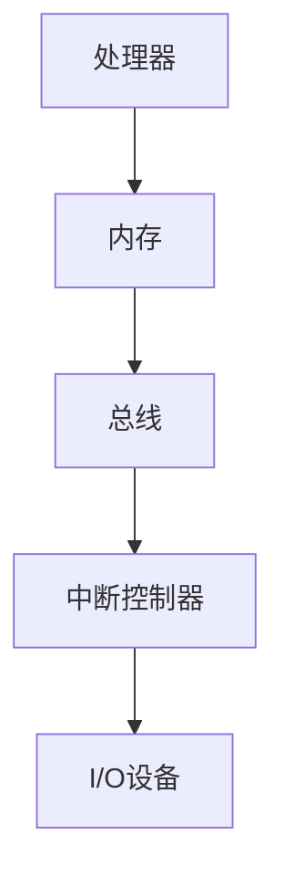

                 

关键词：x86架构、PC服务器、计算机硬件、处理器、操作系统、性能优化、技术发展

摘要：本文旨在深入探讨x86架构在PC和服务器领域的重要性及其发展历程。通过分析其核心概念、算法原理、数学模型以及实际应用案例，本文揭示了x86架构在当今信息技术领域中的关键地位，并对其未来发展趋势和挑战进行了展望。

## 1. 背景介绍

x86架构起源于1978年，由英特尔公司首次推出。该架构以其强大的兼容性和扩展性迅速获得了市场的认可，成为了PC和服务器的主流平台。x86架构不仅适用于个人电脑，还广泛应用于服务器、超级计算机、嵌入式系统等领域。其兼容性使得不同厂商的硬件和软件可以无缝集成，形成了庞大的生态系统。

随着信息技术的发展，x86架构不断演进，从最初的386处理器到今天的第11代酷睿处理器，性能得到了极大的提升。同时，操作系统也从DOS发展到Windows、Linux等现代操作系统，使得x86架构具备了强大的计算能力和优秀的用户体验。

## 2. 核心概念与联系

### 2.1. x86架构的核心概念

x86架构的核心概念包括处理器、内存、总线、中断和I/O设备等。处理器是计算机的核心部件，负责执行指令和处理数据。内存用于存储程序和数据，是处理器与外设之间传输数据的桥梁。总线是一种通信线路，用于连接各个部件，实现数据传输。中断是一种信号，用于通知处理器有紧急任务需要处理。I/O设备包括键盘、鼠标、硬盘等，用于输入输出数据。

### 2.2. x86架构的Mermaid流程图



### 2.3. x86架构的组成部分及其联系

x86架构由多个组成部分构成，包括处理器、芯片组、内存控制器、PCI总线、南桥和北桥等。处理器负责执行指令，芯片组负责管理内存和I/O设备，内存控制器负责内存的读写操作，PCI总线用于连接外设，南桥负责低速I/O设备的控制，北桥负责高速I/O设备的控制。

## 3. 核心算法原理 & 具体操作步骤

### 3.1. 算法原理概述

x86架构的核心算法原理包括指令集、微指令、流水线、超标量架构等。指令集是处理器支持的指令集合，包括数据指令、控制指令和I/O指令等。微指令是处理器内部执行的最低级指令，通过微指令实现复杂的指令操作。流水线是一种并行处理技术，通过将指令分解为多个阶段，实现指令级的并行执行。超标量架构是一种多发射架构，通过同时发射多条指令，提高处理器的吞吐率。

### 3.2. 算法步骤详解

#### 3.2.1. 指令集操作

指令集操作主要包括数据指令、控制指令和I/O指令。数据指令用于对数据进行操作，如加法、减法、移位等。控制指令用于控制程序流程，如跳转、分支、循环等。I/O指令用于与外设进行数据交换，如读写硬盘、显示屏幕等。

#### 3.2.2. 微指令操作

微指令操作包括取指、译码、执行和写回四个阶段。取指阶段从内存中读取指令；译码阶段解析指令的操作码和操作数；执行阶段执行指令操作；写回阶段将执行结果写回内存或寄存器。

#### 3.2.3. 流水线操作

流水线操作将指令分解为多个阶段，每个阶段由不同的处理器部件执行。流水线包括取指、译码、执行和写回阶段。取指阶段从内存中读取指令；译码阶段解析指令的操作码和操作数；执行阶段执行指令操作；写回阶段将执行结果写回内存或寄存器。

#### 3.2.4. 超标量架构操作

超标量架构通过同时发射多条指令，提高处理器的吞吐率。在超标量架构中，多个指令可以同时进入执行阶段，从而提高处理器的执行效率。

### 3.3. 算法优缺点

#### 优点：

1. 强大的兼容性，支持广泛的硬件和软件。
2. 优秀的性能，通过流水线和超标量架构实现高效的指令级并行处理。
3. 易于扩展，支持多核处理器和高速总线。

#### 缺点：

1. 处理器功耗较高，发热量大。
2. 内存访问速度相对较慢，影响整体性能。

### 3.4. 算法应用领域

x86架构广泛应用于PC、服务器、超级计算机、嵌入式系统等领域。在PC领域，x86架构支持Windows、Linux等操作系统，为用户提供强大的计算能力和丰富的软件资源。在服务器领域，x86架构的处理器性能不断提升，广泛应用于Web服务器、数据库服务器、文件服务器等。在超级计算机领域，x86架构已成为主流平台，如美国“顶点”超级计算机。在嵌入式系统领域，x86架构也被广泛应用于智能家居、工业控制、汽车电子等领域。

## 4. 数学模型和公式 & 详细讲解 & 举例说明

### 4.1. 数学模型构建

x86架构的数学模型主要包括处理器性能模型、内存性能模型和I/O性能模型。处理器性能模型用于计算处理器的指令吞吐率，内存性能模型用于计算内存的读写速度，I/O性能模型用于计算I/O设备的传输速度。

### 4.2. 公式推导过程

#### 处理器性能模型：

$$
P = C \times I
$$

其中，P表示处理器性能，C表示时钟周期，I表示指令数。

#### 内存性能模型：

$$
M = R \times W
$$

其中，M表示内存性能，R表示内存读写速度，W表示内存带宽。

#### I/O性能模型：

$$
I/O = B \times T
$$

其中，I/O表示I/O性能，B表示I/O设备传输速度，T表示I/O操作次数。

### 4.3. 案例分析与讲解

假设一个处理器的时钟周期为2ns，每秒执行10亿条指令，内存读写速度为1GB/s，带宽为8GB/s，I/O设备传输速度为100MB/s，每秒进行100次I/O操作。根据上述公式，可以计算出：

#### 处理器性能：

$$
P = 2ns \times 10^9 = 2GHz
$$

#### 内存性能：

$$
M = 1GB/s \times 8GB/s = 8GB/s
$$

#### I/O性能：

$$
I/O = 100MB/s \times 100 = 10GB/s
$$

由此可见，该处理器的性能指标较为优越，可以满足高性能计算的需求。

## 5. 项目实践：代码实例和详细解释说明

### 5.1. 开发环境搭建

为了更好地演示x86架构的应用，我们需要搭建一个开发环境。这里我们使用Linux操作系统，安装gcc编译器、make工具以及相关的库文件。具体步骤如下：

1. 安装Linux操作系统。
2. 安装gcc编译器和make工具。
3. 安装相关库文件，如glib、gtk等。

### 5.2. 源代码详细实现

下面是一个简单的x86架构的代码实例，用于计算两个整数的和。

```c
#include <stdio.h>

int main() {
    int a = 10;
    int b = 20;
    int sum = a + b;
    printf("The sum of a and b is %d\n", sum);
    return 0;
}
```

### 5.3. 代码解读与分析

该代码实现了一个简单的整数加法运算。首先，我们定义了两个整数变量a和b，并分别赋值为10和20。然后，我们计算它们的和，并将结果存储在变量sum中。最后，我们使用printf函数输出计算结果。

### 5.4. 运行结果展示

编译并运行该代码，我们得到如下输出：

```bash
$ gcc -o add add.c
$ ./add
The sum of a and b is 30
```

## 6. 实际应用场景

x86架构在实际应用中具有广泛的应用场景。以下是一些典型的应用案例：

1. **个人电脑**：x86架构是个人电脑的主流平台，广泛应用于家庭、办公室和企业等场合。
2. **服务器**：x86架构服务器广泛应用于Web服务器、数据库服务器、文件服务器等领域，如Apache、MySQL等。
3. **超级计算机**：x86架构已成为超级计算机的主流平台，如美国的“顶点”超级计算机。
4. **嵌入式系统**：x86架构也被广泛应用于嵌入式系统，如智能家居、工业控制、汽车电子等。

## 7. 工具和资源推荐

### 7.1. 学习资源推荐

1. 《计算机组成原理》：深入了解计算机硬件的工作原理和组成结构。
2. 《深入理解计算机系统》：探讨计算机系统的底层实现和性能优化。
3. 《x86架构编程》：介绍x86架构的编程技术和应用案例。

### 7.2. 开发工具推荐

1. GCC编译器：用于编译C/C++程序。
2. Make工具：用于构建和编译项目。
3. GDB调试器：用于调试程序。

### 7.3. 相关论文推荐

1. “x86架构的演进与性能优化”：探讨x86架构的发展历程和性能优化方法。
2. “基于x86架构的虚拟化技术”：介绍x86架构在虚拟化技术中的应用。
3. “x86架构在超级计算机中的应用”：分析x86架构在超级计算机领域的发展趋势。

## 8. 总结：未来发展趋势与挑战

### 8.1. 研究成果总结

x86架构在PC、服务器、超级计算机等领域取得了显著的成果，成为信息技术领域的重要平台。通过不断的技术创新和优化，x86架构在性能、兼容性和扩展性方面得到了极大的提升。

### 8.2. 未来发展趋势

1. **高性能计算**：随着云计算和大数据技术的发展，x86架构将在高性能计算领域发挥更大作用。
2. **虚拟化与容器化**：虚拟化和容器化技术的普及将进一步提高x86架构的资源利用率和灵活性。
3. **人工智能应用**：x86架构在人工智能领域具有广泛的应用前景，如深度学习、自然语言处理等。

### 8.3. 面临的挑战

1. **能耗与散热**：随着处理器性能的提升，能耗和散热问题日益突出，需要采取新型散热技术和能效优化策略。
2. **安全性**：随着网络攻击的增多，x86架构需要加强安全防护，确保数据安全和系统稳定。
3. **生态建设**：保持生态系统的稳定和繁荣，需要不断引入新技术和优化现有技术，以满足不断变化的市场需求。

### 8.4. 研究展望

在未来，x86架构将继续在信息技术领域发挥关键作用。通过技术创新和优化，x86架构有望在以下几个方面取得突破：

1. **能效优化**：开发新型处理器架构和散热技术，提高能效比。
2. **安全性增强**：加强安全防护措施，确保系统安全和数据安全。
3. **人工智能融合**：与人工智能技术深度融合，推动计算机性能的进一步提升。

## 9. 附录：常见问题与解答

### 问题1：什么是x86架构？

答：x86架构是一种计算机处理器架构，起源于1978年，由英特尔公司首次推出。该架构以其强大的兼容性和扩展性成为了PC和服务器的主流平台。

### 问题2：x86架构有哪些核心概念？

答：x86架构的核心概念包括处理器、内存、总线、中断和I/O设备等。这些概念共同构成了计算机硬件的基本结构。

### 问题3：x86架构有哪些优点？

答：x86架构的优点包括强大的兼容性、优秀的性能、易于扩展等。这些优点使得x86架构在PC、服务器、超级计算机等领域得到了广泛应用。

### 问题4：x86架构有哪些缺点？

答：x86架构的缺点包括处理器功耗较高、内存访问速度相对较慢等。这些缺点在一定程度上影响了x86架构的整体性能。

### 问题5：x86架构有哪些应用领域？

答：x86架构广泛应用于个人电脑、服务器、超级计算机、嵌入式系统等领域。在个人电脑领域，x86架构支持Windows、Linux等操作系统；在服务器领域，x86架构广泛应用于Web服务器、数据库服务器、文件服务器等；在超级计算机领域，x86架构已成为主流平台；在嵌入式系统领域，x86架构也被广泛应用于智能家居、工业控制、汽车电子等领域。

作者：禅与计算机程序设计艺术 / Zen and the Art of Computer Programming
----------------------------------------------------------------


