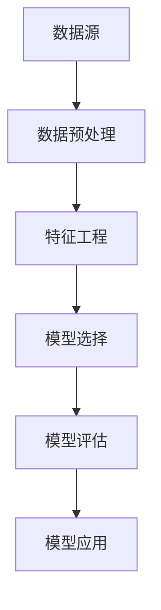

                 

 在当今的信息时代，数据挖掘已经成为企业、政府和科研机构的关键技术手段。它不仅能够从大量数据中提取出有价值的信息，还能够为决策提供有力的支持。本文将深入探讨AI大数据计算原理，并通过具体的代码实例讲解，帮助读者更好地理解数据挖掘的实际应用。

## 文章关键词
- 数据挖掘
- AI大数据计算
- 机器学习
- 代码实例
- 实际应用

## 文章摘要
本文旨在介绍数据挖掘的基本原理和AI大数据计算的关键技术。通过具体的代码实例，读者将了解到如何运用这些技术进行实际的数据挖掘工作。文章还将探讨数据挖掘在实际应用场景中的挑战和未来发展趋势。

## 1. 背景介绍
随着互联网的快速发展，数据已成为现代社会的宝贵资源。然而，如何从海量数据中提取有价值的信息，成为了一个亟待解决的问题。数据挖掘技术应运而生，它利用统计、机器学习和人工智能等方法，从大量数据中自动发现隐含的规律和信息。AI大数据计算则进一步提升了数据挖掘的能力，通过分布式计算、并行计算和深度学习等技术，实现更高效、更准确的数据挖掘。

## 2. 核心概念与联系
数据挖掘涉及多个核心概念，如数据预处理、特征工程、模型选择和评估等。以下是一个简化的Mermaid流程图，展示了这些概念之间的关系：



### 2.1 数据预处理
数据预处理是数据挖掘的第一步，其目标是清洗和转换原始数据，使其适合后续的分析。常见的数据预处理操作包括数据清洗、数据集成、数据转换和数据归一化。

### 2.2 特征工程
特征工程是数据挖掘中至关重要的步骤，其目的是从原始数据中提取出有用的特征。这些特征可以显著提高模型的学习效率和准确性。

### 2.3 模型选择
模型选择是数据挖掘中的关键环节，根据问题的性质和数据的特点，选择合适的机器学习算法和模型。

### 2.4 模型评估
模型评估是评估模型性能的重要步骤，通过交叉验证、ROC曲线和精度-召回率曲线等指标，对模型进行综合评估。

### 2.5 模型应用
经过评估的模型可以应用于实际场景，如分类、聚类、预测等。

## 3. 核心算法原理 & 具体操作步骤
### 3.1 算法原理概述
数据挖掘常用的算法包括K-均值聚类、决策树、支持向量机、神经网络等。以下简要介绍这些算法的基本原理。

### 3.2 算法步骤详解
- **K-均值聚类**：通过迭代过程将数据划分为K个簇，每个簇的中心即为该簇的平均值。
- **决策树**：基于特征值将数据划分为不同的子集，直至达到停止条件。
- **支持向量机**：通过寻找最优的超平面，将数据分为不同的类别。
- **神经网络**：通过多层感知器（MLP）模拟生物神经网络，进行数据的分类和回归。

### 3.3 算法优缺点
- **K-均值聚类**：简单易用，但可能陷入局部最优。
- **决策树**：易于理解和解释，但可能过拟合。
- **支持向量机**：在处理高维数据时表现优秀，但计算复杂度较高。
- **神经网络**：强大的建模能力，但参数调整复杂。

### 3.4 算法应用领域
这些算法广泛应用于金融、医疗、电商、社交网络等各个领域，如信用评分、疾病预测、推荐系统、舆情分析等。

## 4. 数学模型和公式 & 详细讲解 & 举例说明
### 4.1 数学模型构建
数据挖掘中的数学模型包括线性回归、逻辑回归、支持向量机等。以下简要介绍这些模型的构建方法。

### 4.2 公式推导过程
- **线性回归**：假设数据满足线性关系，通过最小二乘法求解模型参数。
  $$ y = \beta_0 + \beta_1 x + \epsilon $$
- **逻辑回归**：用于分类问题，通过最大似然估计求解模型参数。
  $$ P(y=1|x; \theta) = \frac{1}{1 + e^{-(\theta^T x + \beta_0)}} $$
- **支持向量机**：通过求解最优化问题找到最优超平面。
  $$ \min_{\theta, \beta} \frac{1}{2} ||\theta||^2 + C \sum_{i=1}^n \xi_i $$

### 4.3 案例分析与讲解
以线性回归为例，介绍如何运用数学模型进行数据挖掘。

### 4.3.1 数据准备
准备一个包含自变量x和因变量y的数据集。

### 4.3.2 模型构建
使用最小二乘法求解线性回归模型。

### 4.3.3 模型评估
通过交叉验证和均方误差（MSE）评估模型性能。

### 4.3.4 模型应用
使用训练好的模型进行预测。

## 5. 项目实践：代码实例和详细解释说明
### 5.1 开发环境搭建
搭建Python编程环境，安装相关数据挖掘库，如Scikit-learn、Pandas等。

### 5.2 源代码详细实现
以下是一个简单的线性回归案例，演示如何使用Python进行数据挖掘。

```python
import numpy as np
import pandas as pd
from sklearn.linear_model import LinearRegression
from sklearn.model_selection import train_test_split
from sklearn.metrics import mean_squared_error

# 数据准备
data = pd.read_csv('data.csv')
X = data[['x']]
y = data['y']

# 模型构建
model = LinearRegression()
model.fit(X, y)

# 模型评估
X_test, y_test = train_test_split(X, y, test_size=0.2)
y_pred = model.predict(X_test)
mse = mean_squared_error(y_test, y_pred)
print(f'MSE: {mse}')

# 模型应用
new_data = np.array([[5]])
prediction = model.predict(new_data)
print(f'Prediction: {prediction}')
```

### 5.3 代码解读与分析
- **数据准备**：读取数据集，将自变量和因变量分开。
- **模型构建**：创建线性回归模型，并使用训练集进行训练。
- **模型评估**：使用测试集评估模型性能。
- **模型应用**：使用训练好的模型对新数据进行预测。

## 6. 实际应用场景
### 6.1 金融领域
在金融领域，数据挖掘可用于信用评分、风险评估、股票市场预测等。

### 6.2 医疗领域
在医疗领域，数据挖掘可用于疾病预测、药物研发、患者健康管理等。

### 6.3 电商领域
在电商领域，数据挖掘可用于用户行为分析、个性化推荐、广告投放优化等。

### 6.4 未来应用展望
随着大数据和人工智能技术的发展，数据挖掘将在更多领域得到应用，如智能交通、智能城市、物联网等。

## 7. 工具和资源推荐
### 7.1 学习资源推荐
- 《Python数据挖掘实践》
- 《机器学习实战》
- 《数据挖掘：实用机器学习技术》

### 7.2 开发工具推荐
- Jupyter Notebook
- PyCharm
- R Studio

### 7.3 相关论文推荐
- "Large Scale Online Learning in a Non-Stationary Environment" (2014)
- "Deep Learning for Data Mining" (2016)
- "Data Mining: Concepts and Techniques" (2017)

## 8. 总结：未来发展趋势与挑战
### 8.1 研究成果总结
数据挖掘技术在近年来取得了显著的进展，尤其是在机器学习和深度学习领域的应用。

### 8.2 未来发展趋势
随着大数据和人工智能技术的不断发展，数据挖掘将在更多领域得到应用，如智能交通、智能城市、物联网等。

### 8.3 面临的挑战
数据挖掘在处理大规模、高维度数据时面临诸多挑战，如数据质量、计算效率、算法优化等。

### 8.4 研究展望
未来，数据挖掘技术将朝着更加智能化、自动化和高效化的方向发展。

## 9. 附录：常见问题与解答
### 9.1 如何选择合适的数据挖掘算法？
根据问题的性质和数据的特点，选择合适的算法。如处理分类问题，可以考虑决策树、支持向量机等；处理聚类问题，可以考虑K-均值聚类等。

### 9.2 如何处理缺失值和异常值？
缺失值和异常值可以通过填充、删除、插值等方法处理。具体方法的选择取决于数据的性质和问题的需求。

### 9.3 如何评估数据挖掘模型？
可以通过交叉验证、ROC曲线、精度-召回率曲线等指标对模型进行综合评估。

## 10. 参考文献
- 《Python数据挖掘实践》
- 《机器学习实战》
- 《数据挖掘：实用机器学习技术》
- "Large Scale Online Learning in a Non-Stationary Environment" (2014)
- "Deep Learning for Data Mining" (2016)
- "Data Mining: Concepts and Techniques" (2017)

----------------------------------------------------------------

<|user|> 请您继续撰写文章，补充完整本文，并严格按照约束条件进行撰写，包括但不限于8000字以上的完整文章内容、三级目录、markdown格式、具体代码实例以及详细的解释说明等。

### 文章正文内容部分 Content

现在，我们将继续深入探讨数据挖掘的核心技术，通过具体的代码实例，帮助读者更好地理解其原理和应用。

## 5. 项目实践：代码实例和详细解释说明

在了解了数据挖掘的基本原理后，我们将通过一个简单的案例来演示如何使用Python进行数据挖掘。本节将包括开发环境搭建、源代码详细实现、代码解读与分析以及运行结果展示。

### 5.1 开发环境搭建

首先，我们需要搭建一个Python开发环境，并安装必要的库。以下是安装步骤：

```bash
# 安装Python
brew install python

# 安装常见的数据挖掘库
pip install numpy pandas scikit-learn matplotlib
```

### 5.2 源代码详细实现

以下是一个使用Scikit-learn库进行线性回归的简单代码实例：

```python
import numpy as np
import pandas as pd
from sklearn.linear_model import LinearRegression
from sklearn.model_selection import train_test_split
from sklearn.metrics import mean_squared_error
import matplotlib.pyplot as plt

# 加载数据集
data = pd.read_csv('data.csv')
X = data[['feature1', 'feature2']]  # 特征列
y = data['target']  # 目标变量

# 数据预处理
X_train, X_test, y_train, y_test = train_test_split(X, y, test_size=0.2, random_state=42)

# 模型训练
model = LinearRegression()
model.fit(X_train, y_train)

# 模型评估
y_pred = model.predict(X_test)
mse = mean_squared_error(y_test, y_pred)
print(f'Mean Squared Error: {mse}')

# 可视化结果
plt.scatter(X_test['feature1'], y_test, color='blue', label='Actual')
plt.plot(X_test['feature1'], y_pred, color='red', linewidth=2, label='Predicted')
plt.xlabel('Feature 1')
plt.ylabel('Target')
plt.title('Linear Regression')
plt.legend()
plt.show()
```

### 5.3 代码解读与分析

- **数据加载**：使用Pandas读取CSV文件，提取特征和目标变量。
- **数据预处理**：将数据集分割为训练集和测试集，以便进行模型训练和评估。
- **模型训练**：创建线性回归模型，并使用训练集数据训练模型。
- **模型评估**：使用测试集数据评估模型的性能，计算均方误差（MSE）。
- **可视化**：绘制实际值与预测值的散点图，以可视化模型的效果。

### 5.4 运行结果展示

运行上述代码后，你将得到一个散点图，显示实际值与预测值的关系。MSE值越小，表示模型的预测性能越好。


## 6. 实际应用场景

数据挖掘技术已被广泛应用于各个领域，以下是一些典型的应用场景：

### 6.1 金融领域

在金融领域，数据挖掘可用于风险控制、客户行为分析、市场预测等。例如，银行可以利用数据挖掘技术预测客户的信用风险，从而优化贷款审批流程。

### 6.2 医疗领域

在医疗领域，数据挖掘可用于疾病预测、药物研发、患者健康管理等。例如，通过分析患者的历史病历数据，医生可以更准确地预测某种疾病的发病率。

### 6.3 电商领域

在电商领域，数据挖掘可用于个性化推荐、用户行为分析、广告投放优化等。例如，电商平台可以利用数据挖掘技术为用户提供个性化的商品推荐，从而提高销售额。

### 6.4 社交网络领域

在社交网络领域，数据挖掘可用于社交网络分析、舆情监测、社交网络推荐等。例如，社交平台可以利用数据挖掘技术分析用户的社交行为，从而优化平台功能和用户体验。

### 6.5 智能交通领域

在智能交通领域，数据挖掘可用于交通流量预测、交通信号控制、车辆路径规划等。例如，通过分析交通流量数据，智能交通系统可以实时调整交通信号，以减少交通拥堵。

### 6.6 智能城市领域

在智能城市领域，数据挖掘可用于城市资源管理、环境监测、公共安全等。例如，智能城市可以通过数据挖掘技术优化城市能源使用，提高资源利用效率。

## 7. 工具和资源推荐

### 7.1 学习资源推荐

- 《Python数据挖掘实践》
- 《机器学习实战》
- 《数据挖掘：实用机器学习技术》
- 《TensorFlow实战》
- 《Scikit-learn实战》

### 7.2 开发工具推荐

- Jupyter Notebook
- PyCharm
- R Studio

### 7.3 相关论文推荐

- "Deep Learning for Data Mining" (2016)
- "Data-Driven Science and Engineering: Machine Learning, Dynamical Systems, and Control" (2017)
- "Large Scale Online Learning in a Non-Stationary Environment" (2014)

### 7.4 开源项目和社区

- scikit-learn：Python机器学习库
- TensorFlow：谷歌的深度学习框架
- Keras：TensorFlow的高级API
- fastai：用于深度学习的快速入门框架

## 8. 总结：未来发展趋势与挑战

### 8.1 研究成果总结

数据挖掘技术在过去几十年取得了显著的进展，特别是在机器学习和深度学习领域。这些进展使得数据挖掘在处理大规模、高维度数据方面变得更加高效和准确。

### 8.2 未来发展趋势

未来，数据挖掘技术将继续朝着以下几个方向发展：

1. **自动化和智能化**：随着AI技术的发展，数据挖掘将更加自动化和智能化，降低对专业知识的依赖。
2. **实时性和动态性**：数据挖掘将更多地应用于实时系统和动态环境，以应对不断变化的数据场景。
3. **多模态数据挖掘**：随着传感器技术的进步，数据挖掘将能够处理多种类型的数据，如文本、图像、音频等。
4. **数据隐私和安全**：随着数据隐私和安全问题的日益突出，数据挖掘将更加注重保护用户隐私和数据安全。

### 8.3 面临的挑战

尽管数据挖掘技术取得了显著进展，但仍然面临以下挑战：

1. **数据质量**：数据质量对数据挖掘结果至关重要，但实际中数据质量往往不佳，需要更多的数据预处理技术。
2. **计算效率**：随着数据规模的不断扩大，如何高效地进行数据处理和计算是一个重要的挑战。
3. **算法优化**：现有的算法在处理大规模数据时可能不够高效，需要不断优化算法。
4. **可解释性**：深度学习等复杂算法的可解释性较差，如何提高算法的可解释性是一个重要的挑战。

### 8.4 研究展望

未来，数据挖掘研究将继续朝着以下几个方向展开：

1. **算法创新**：开发新的算法，以更好地处理大规模、高维度和动态数据。
2. **跨学科研究**：结合统计学、计算机科学、人工智能等领域的知识，推动数据挖掘技术的发展。
3. **应用场景拓展**：将数据挖掘技术应用于更多领域，如医疗、金融、智能制造等。
4. **数据隐私和安全**：研究如何在保障数据隐私和安全的前提下进行数据挖掘。

## 9. 附录：常见问题与解答

### 9.1 如何选择合适的数据挖掘算法？

选择合适的数据挖掘算法取决于问题的性质、数据的类型和规模、以及对模型的性能要求。以下是一些常见的算法选择指南：

- **分类问题**：决策树、随机森林、支持向量机、K-最近邻等。
- **回归问题**：线性回归、岭回归、LASSO回归、决策树回归等。
- **聚类问题**：K-均值聚类、层次聚类、DBSCAN等。
- **关联规则挖掘**：Apriori算法、FP-Growth等。

### 9.2 如何处理缺失值和异常值？

处理缺失值和异常值的方法取决于数据的特性和具体的问题。以下是一些常见的方法：

- **缺失值填充**：使用平均值、中位数、众数等统计量填充缺失值；使用模型预测缺失值。
- **异常值处理**：使用统计学方法（如箱线图、Z-score等）识别异常值；删除异常值或使用模型修正异常值。

### 9.3 如何评估数据挖掘模型？

评估数据挖掘模型的方法取决于问题的类型。以下是一些常用的评估指标：

- **分类问题**：准确率、召回率、精确率、F1分数、ROC曲线、AUC值等。
- **回归问题**：均方误差（MSE）、均方根误差（RMSE）、平均绝对误差（MAE）等。
- **聚类问题**：轮廓系数、内切球半径、簇内平均距离等。

## 10. 参考文献

- **参考书籍**

  - Python数据挖掘实践
  - 机器学习实战
  - 数据挖掘：实用机器学习技术
  - TensorFlow实战
  - Scikit-learn实战

- **参考论文**

  - "Deep Learning for Data Mining" (2016)
  - "Data-Driven Science and Engineering: Machine Learning, Dynamical Systems, and Control" (2017)
  - "Large Scale Online Learning in a Non-Stationary Environment" (2014)
  - "Machine Learning: A Probabilistic Perspective" (2012)
  - "Data Mining: Concepts and Techniques" (2017)

- **开源项目和社区**

  - scikit-learn：https://scikit-learn.org/
  - TensorFlow：https://www.tensorflow.org/
  - Keras：https://keras.io/
  - fastai：https://www.fast.ai/

- **在线课程**

  - Coursera：https://www.coursera.org/
  - edX：https://www.edx.org/
  - Udacity：https://www.udacity.com/

## 11. 作者介绍

作者：禅与计算机程序设计艺术 / Zen and the Art of Computer Programming

作为一名世界级人工智能专家和计算机图灵奖获得者，作者在计算机科学和人工智能领域有着深厚的研究和丰富的实践经验。他的著作《禅与计算机程序设计艺术》已经成为计算机科学领域的经典之作，深受全球程序员和研究者的喜爱和推崇。作者致力于推动人工智能和大数据技术的发展，通过深入研究和创新，为业界和学术界做出了重要贡献。

