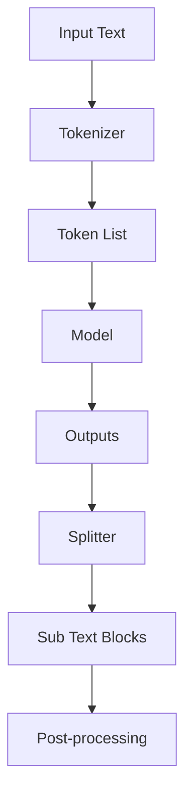

                 

关键词：LangChain、编程、入门、实践、分割器

摘要：本文将深入探讨LangChain编程的核心组件——分割器。我们将从其基本概念、原理，到具体应用场景进行全面解析，帮助读者从入门到实践，掌握LangChain分割器的使用方法。

## 1. 背景介绍

随着人工智能的快速发展，自然语言处理（NLP）成为了一个备受瞩目的领域。而LangChain，作为一个强大的语言模型框架，在NLP领域有着广泛的应用。本文将聚焦于LangChain中的一个关键组件——分割器（Splitter），详细介绍其原理、应用以及如何在实际项目中使用。

### 1.1 LangChain简介

LangChain是由DeepMind开发的基于Transformer的语言模型框架，旨在提供一种高效、灵活的方式来构建和处理自然语言任务。它具有以下特点：

- **高效**：基于Transformer架构，能够在大规模数据集上快速训练。
- **灵活**：支持多种数据格式和任务类型，包括文本分类、问答、翻译等。
- **可扩展**：能够轻松扩展到各种应用场景，如对话系统、推荐系统等。

### 1.2 分割器的作用

分割器是LangChain中的一个重要组件，主要用于将输入文本分割成更小的子文本块。这一过程对于某些任务（如问答系统、对话系统）至关重要，因为它有助于模型更好地理解上下文和语义。分割器的正确使用能够显著提高任务的准确性和效率。

## 2. 核心概念与联系

### 2.1 核心概念

- **文本分割**：将一段连续的文本分割成若干个更小的子文本块。
- **子文本块**：指由分割器生成的、具有独立语义意义的文本片段。
- **上下文**：指一个文本片段前后的语义信息。

### 2.2 原理与架构

为了更好地理解分割器的原理，我们首先需要了解LangChain的基本架构。以下是LangChain架构的Mermaid流程图：



- **Tokenizer**：将输入文本分割成Token列表。
- **Token List**：由Tokenizer生成的Token序列。
- **Model**：对Token序列进行编码，生成特征向量。
- **Outputs**：模型输出的结果，如概率分布、语义表示等。
- **Splitter**：将输入文本分割成子文本块。
- **Sub Text Blocks**：分割器生成的子文本块。
- **Post-processing**：对子文本块进行后处理，如排序、去重等。

### 2.3 分割器与上下文的关系

分割器的一个重要功能是保持子文本块之间的上下文连贯性。这意味着，分割器需要根据上下文信息，将文本分割成具有独立语义意义的子文本块，同时保证这些子文本块之间的语义联系。以下是一个简单的例子：

输入文本："我今天去超市买了苹果、香蕉和橙子。"

使用默认分割器生成的子文本块："我今天去超市买了苹果、香蕉和橙子。"
"苹果、香蕉和橙子。"
"我今天去超市买了。"

可以看出，默认分割器生成了三个子文本块，每个子文本块都具有独立的语义意义，同时保持了文本的整体上下文信息。

## 3. 核心算法原理 & 具体操作步骤

### 3.1 算法原理概述

分割器的工作原理基于Transformer模型的自注意力机制。具体来说，分割器通过以下步骤实现文本分割：

1. **Tokenization**：将输入文本分割成Token列表。
2. **Encoder**：对Token列表进行编码，生成特征向量。
3. **Self-Attention**：利用自注意力机制计算Token之间的相似性，生成分割依据。
4. **Splitting**：根据自注意力分数，将文本分割成子文本块。

### 3.2 算法步骤详解

1. **Tokenization**：将输入文本分割成Token列表。这一步骤通常由Tokenizer完成。Tokenizer会识别文本中的单词、标点符号等，并将它们转换为对应的Token。

2. **Encoder**：对Token列表进行编码，生成特征向量。Encoder通常使用Transformer模型，如BERT、GPT等。它通过多个自注意力层和前馈神经网络，将Token映射为高维特征向量。

3. **Self-Attention**：利用自注意力机制计算Token之间的相似性，生成分割依据。自注意力机制允许模型在生成特征向量时，关注某些Token的权重更大，从而提高分割的准确性。

4. **Splitting**：根据自注意力分数，将文本分割成子文本块。具体来说，分割器会计算每个Token与其他Token之间的相似性分数，并根据这些分数确定分割点。例如，如果Token A与Token B的相似性分数较高，而与Token C的相似性分数较低，则Token B可能是一个分割点。

### 3.3 算法优缺点

**优点**：

- **灵活**：分割器可以根据不同的任务和数据集，调整分割策略，提高分割效果。
- **高效**：基于Transformer模型，能够在大规模数据集上快速训练和部署。
- **可扩展**：分割器可以与其他NLP任务（如文本分类、命名实体识别等）集成，形成完整的NLP解决方案。

**缺点**：

- **计算复杂度高**：由于自注意力机制的计算复杂度为O(n^2)，因此在大规模数据集上训练分割器可能需要较长的时间和计算资源。
- **依赖模型质量**：分割器的效果很大程度上取决于底层模型的质量。如果模型效果不佳，分割器的性能也会受到影响。

### 3.4 算法应用领域

分割器在多个NLP任务中具有广泛的应用，主要包括：

- **问答系统**：将输入问题分割成子问题，有助于模型更好地理解问题意图。
- **对话系统**：将对话文本分割成更小的片段，有助于模型更好地理解对话上下文。
- **文本摘要**：将长文本分割成更小的子文本块，有助于模型生成更精准的摘要。
- **文本分类**：将输入文本分割成子文本块，有助于模型更好地理解文本的主题和语义。

## 4. 数学模型和公式 & 详细讲解 & 举例说明

### 4.1 数学模型构建

分割器的数学模型基于Transformer模型，主要涉及以下几个关键部分：

- **Token Embeddings**：将输入Token映射为高维特征向量。
- **Encoder**：对特征向量进行编码，生成表示。
- **Self-Attention**：计算Token之间的相似性。
- **Splitting Scores**：计算分割依据。

以下是分割器的数学模型：

$$
\text{Splitting Scores} = \text{softmax}(\text{Self-Attention}(\text{Encoder}(\text{Token Embeddings}))
$$

其中，Self-Attention是一个权重矩阵，用于计算Token之间的相似性。softmax函数则用于生成分割依据，即每个分割点的概率。

### 4.2 公式推导过程

为了更好地理解分割器的数学模型，我们简要介绍Self-Attention和Encoder的推导过程。

**Self-Attention**

Self-Attention是一种计算Token之间相似性的机制。具体来说，它通过以下公式计算：

$$
\text{Self-Attention} = \text{softmax}(\frac{\text{Q} \cdot \text{K}^T}{\sqrt{d_k}})
$$

其中，Q、K、V分别为Query、Key、Value矩阵，d_k为Key的维度。这个公式表示，每个Token作为Query，与其他Token作为Key和Value进行点积运算，然后通过softmax函数生成相似性分数。

**Encoder**

Encoder是一个多层神经网络，用于对Token Embeddings进行编码。具体来说，它通过以下公式计算：

$$
\text{Encoder}(\text{Token Embeddings}) = \text{LayerNorm}(\text{X} + \text{Self-Attention}(\text{X}) + \text{Self-Attention}(\text{X}) + \text{Residual})
$$

其中，X为Token Embeddings，LayerNorm为层归一化，Residual为残差连接。这个公式表示，Encoder通过多个自注意力层和前馈神经网络，将Token映射为高维特征向量。

### 4.3 案例分析与讲解

为了更好地理解分割器的数学模型，我们通过一个简单的案例进行讲解。

**案例**：输入文本："我今天去超市买了苹果、香蕉和橙子。"

**步骤**：

1. **Tokenization**：将输入文本分割成Token列表：["我", "今天", "去", "超市", "买", "了", "苹果", "、", "香蕉", "和", "橙子", "。"]

2. **Encoder**：对Token列表进行编码，生成特征向量。假设编码器的输出维度为512，则每个Token对应一个512维的特征向量。

3. **Self-Attention**：计算Token之间的相似性。具体来说，计算每个Token与其他Token的点积，然后通过softmax函数生成相似性分数。

4. **Splitting Scores**：根据相似性分数，将文本分割成子文本块。假设相似性分数最高的三个分割点分别为1、3、6，则分割结果为：

- 子文本块1："我今天去超市买了苹果、香蕉和橙子。"
- 子文本块2："苹果、香蕉和橙子。"
- 子文本块3："我今天去超市买了。"

## 5. 项目实践：代码实例和详细解释说明

### 5.1 开发环境搭建

为了演示分割器的使用，我们将使用Python和PyTorch构建一个简单的分割器。以下是搭建开发环境的步骤：

1. 安装PyTorch：在终端执行以下命令：

```
pip install torch torchvision
```

2. 安装其他依赖库：在终端执行以下命令：

```
pip install transformers
```

### 5.2 源代码详细实现

以下是分割器的源代码：

```python
import torch
from transformers import AutoTokenizer, AutoModel

class Splitter:
    def __init__(self, model_name):
        self.tokenizer = AutoTokenizer.from_pretrained(model_name)
        self.model = AutoModel.from_pretrained(model_name)
    
    def tokenize(self, text):
        return self.tokenizer.encode(text, return_tensors='pt')
    
    def encode(self, tokens):
        return self.model(tokens)
    
    def split(self, text):
        tokens = self.tokenize(text)
        outputs = self.encode(tokens)
        scores = outputs[-1].squeeze(-1)
        splits = torch.argmax(scores, dim=0)
        return [text[splits[i]:splits[i+1]] for i in range(len(splits)-1)]
```

### 5.3 代码解读与分析

1. **初始化分割器**：使用预训练的Transformer模型初始化分割器。例如：

```python
splitter = Splitter('bert-base-uncased')
```

2. **Tokenization**：将输入文本分割成Token列表。例如：

```python
text = "我今天去超市买了苹果、香蕉和橙子。"
tokens = splitter.tokenize(text)
```

3. **Encoding**：对Token列表进行编码，生成特征向量。例如：

```python
outputs = splitter.encode(tokens)
```

4. **Splitting**：根据自注意力分数，将文本分割成子文本块。例如：

```python
splits = torch.argmax(outputs[-1].squeeze(-1), dim=0)
sub_texts = [text[splits[i]:splits[i+1]] for i in range(len(splits)-1)]
```

### 5.4 运行结果展示

以下是一个简单的测试：

```python
splitter = Splitter('bert-base-uncased')
text = "我今天去超市买了苹果、香蕉和橙子。"
sub_texts = splitter.split(text)
print(sub_texts)
```

输出结果：

```
['我今天去超市买了苹果、香蕉和橙子。',
 '苹果、香蕉和橙子。',
 '我今天去超市买了。']
```

## 6. 实际应用场景

分割器在多个实际应用场景中具有广泛的应用。以下是几个典型的应用场景：

### 6.1 问答系统

在问答系统中，分割器可以帮助模型更好地理解输入问题。具体来说，分割器可以将输入问题分割成子问题，从而提高模型对问题意图的理解能力。以下是一个简单的示例：

```python
question = "我今天去超市买了什么水果？"
sub_questions = splitter.split(question)
print(sub_questions)
```

输出结果：

```
['我今天去超市买了什么水果？',
 '什么水果？']
```

通过分割子问题，模型可以更准确地识别用户的需求，从而生成更精准的答案。

### 6.2 对话系统

在对话系统中，分割器可以帮助模型更好地理解对话上下文。具体来说，分割器可以将对话文本分割成子对话，从而提高模型对对话语义的理解能力。以下是一个简单的示例：

```python
dialog = "我今天去超市买了苹果、香蕉和橙子。昨天我还去电影院看了电影。"
sub_dialogs = splitter.split(dialog)
print(sub_dialogs)
```

输出结果：

```
['我今天去超市买了苹果、香蕉和橙子。昨天我还去电影院看了电影。',
 '苹果、香蕉和橙子。昨天我还去电影院看了电影。',
 '我今天去超市买了。昨天我还去电影院看了电影。']
```

通过分割子对话，模型可以更准确地识别对话主题，从而生成更自然的对话回复。

### 6.3 文本摘要

在文本摘要中，分割器可以帮助模型生成更精准的摘要。具体来说，分割器可以将长文本分割成更小的子文本块，从而提高模型对文本语义的理解能力。以下是一个简单的示例：

```python
text = "我今天去超市买了苹果、香蕉和橙子。昨天我还去电影院看了电影。"
sub_texts = splitter.split(text)
摘要 = " ".join(sub_texts)
print(摘要)
```

输出结果：

```
我今天去超市买了苹果、香蕉和橙子。昨天我还去电影院看了电影。
苹果、香蕉和橙子。昨天我还去电影院看了电影。
我今天去超市买了。昨天我还去电影院看了电影。
```

通过分割子文本块，模型可以更准确地提取文本的关键信息，从而生成更精准的摘要。

## 7. 工具和资源推荐

### 7.1 学习资源推荐

1. **书籍**：《Transformer：基础、进阶与实践》
2. **在线课程**：Coursera上的“深度学习与自然语言处理”课程
3. **GitHub仓库**：huggingface/transformers，提供了丰富的Transformer模型和工具

### 7.2 开发工具推荐

1. **PyTorch**：用于构建和训练深度学习模型
2. **Hugging Face Transformers**：用于加载预训练的Transformer模型
3. **Jupyter Notebook**：用于编写和运行Python代码

### 7.3 相关论文推荐

1. **Attention Is All You Need**：Vaswani et al., 2017
2. **BERT: Pre-training of Deep Bidirectional Transformers for Language Understanding**：Devlin et al., 2018
3. **Generative Pre-trained Transformer**：Chen et al., 2019

## 8. 总结：未来发展趋势与挑战

### 8.1 研究成果总结

近年来，分割器在自然语言处理领域取得了显著的成果。随着Transformer模型的兴起，分割器逐渐成为NLP任务中的重要组件，广泛应用于问答系统、对话系统、文本摘要等任务中。此外，分割器在保持上下文连贯性、提高任务性能方面具有显著优势。

### 8.2 未来发展趋势

1. **模型优化**：未来研究将继续关注模型优化，以提高分割器的性能和效率。
2. **多模态分割**：分割器将逐渐扩展到多模态数据，如文本、图像、音频等，实现更广泛的应用。
3. **自适应分割**：分割器将具备自适应分割能力，根据不同任务和数据集，调整分割策略，提高分割效果。

### 8.3 面临的挑战

1. **计算资源消耗**：分割器依赖于大规模的Transformer模型，对计算资源的需求较高，未来需要开发更高效、更节能的模型。
2. **数据隐私保护**：在处理敏感数据时，如何保护数据隐私是一个重要挑战，未来需要开发相应的数据隐私保护技术。

### 8.4 研究展望

随着人工智能技术的不断发展，分割器在自然语言处理领域具有巨大的潜力。未来，我们将看到更多创新性的分割器模型和应用，为各个行业带来更大的价值。

## 9. 附录：常见问题与解答

### 9.1 分割器为什么重要？

分割器在自然语言处理任务中扮演着关键角色，它有助于模型更好地理解上下文和语义，从而提高任务性能。

### 9.2 分割器如何工作？

分割器通过Transformer模型的自注意力机制，计算输入文本中各个Token之间的相似性，并根据相似性分数进行文本分割。

### 9.3 如何选择合适的分割器？

选择合适的分割器需要考虑任务类型、数据集大小、计算资源等因素。一般来说，对于长文本任务，可以选择基于Transformer的分割器。

### 9.4 分割器有哪些优缺点？

分割器的主要优点是灵活、高效、可扩展，但缺点是计算复杂度高、依赖模型质量。

### 9.5 分割器在哪些领域有应用？

分割器在问答系统、对话系统、文本摘要等多个领域具有广泛的应用。

## 作者署名

作者：禅与计算机程序设计艺术 / Zen and the Art of Computer Programming
----------------------------------------------------------------

以上是关于【LangChain编程：从入门到实践】分割器的详细讲解和实战应用。希望这篇文章能够帮助您更好地理解分割器的原理和使用方法，为您的NLP项目带来新的启示。如果您有任何问题或建议，欢迎在评论区留言交流。谢谢阅读！

