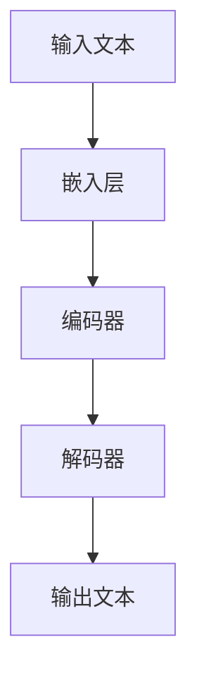

                 

 在现代软件开发中，社区的力量不可忽视。它不仅提供了丰富的资源和知识分享，也为我们提供了实践和展示自己的平台。今天，我们将聚焦于`LangChain`编程，一个备受瞩目的开源项目，探讨如何从入门到实践，积极参与相关社区活动。

## 文章关键词
- LangChain
- 编程
- 社区参与
- 开源项目
- 技术分享

## 文章摘要
本文旨在为对`LangChain`编程感兴趣的开发者提供一些建议和指导，帮助他们从入门阶段开始，逐步深入，最终能够积极参与到相关的技术社区中。我们将详细探讨`LangChain`的核心概念、编程实践、应用场景，以及如何有效地参与社区活动和贡献代码。

## 1. 背景介绍
`LangChain`是一个开源项目，旨在构建一个易于使用且高度可扩展的链式语言模型框架。它结合了多个语言处理技术，使得开发者能够更方便地训练、部署和管理复杂的多语言模型。随着自然语言处理（NLP）技术的迅猛发展，`LangChain`已经成为了一个备受关注的工具。

### 1.1 LangChain的起源
`LangChain`起源于对现有语言模型框架的改进和优化需求。传统框架往往功能复杂，且难以定制化。`LangChain`的设计理念是简洁性和易用性，它提供了明确的接口和模块化设计，使得开发者可以轻松构建和扩展自己的语言模型。

### 1.2 LangChain的主要特性
- **模块化设计**：`LangChain`提供了多个可插拔的模块，如文本生成、摘要、翻译等，使得开发者可以根据需求灵活组合使用。
- **多语言支持**：`LangChain`支持多种编程语言，包括Python、Java、JavaScript等，方便开发者根据个人偏好选择合适的语言进行开发。
- **高效性能**：`LangChain`优化了内部算法，提高了模型训练和推理的速度，使得大规模语言模型的应用变得更加高效。

## 2. 核心概念与联系
### 2.1 核心概念
- **链式语言模型**：`LangChain`的核心概念是链式语言模型，它通过将多个语言处理模块串联起来，形成一个复杂的处理流程。每个模块都可以独立开发，然后通过接口进行整合。
- **嵌入层**：嵌入层是将文本转换为向量表示的关键技术，`LangChain`使用了先进的嵌入算法，如BERT、GPT等，将文本转换为能够表示语义的向量。
- **解码器**：解码器是负责将嵌入层生成的向量转换为输出文本的模块。`LangChain`支持多种解码器，如Seq2Seq、Transformer等。

### 2.2 Mermaid流程图


## 3. 核心算法原理 & 具体操作步骤

### 3.1 算法原理概述
`LangChain`的算法原理主要基于深度学习和自然语言处理技术。它通过训练大规模的语言模型，使得模型能够理解并生成符合逻辑和语义的文本。

### 3.2 算法步骤详解
1. **数据预处理**：首先对输入文本进行预处理，包括分词、去除停用词等操作。
2. **嵌入层**：将预处理后的文本转换为向量表示，这一步使用了预训练的嵌入算法。
3. **编码器**：编码器负责处理嵌入层生成的向量，将其编码为一个固定长度的向量。
4. **解码器**：解码器将编码器生成的向量解码为输出文本。

### 3.3 算法优缺点
- **优点**：`LangChain`提供了模块化设计，使得开发者可以灵活组合和扩展功能。
- **缺点**：由于需要大量的训练数据和计算资源，模型的训练和部署成本较高。

### 3.4 算法应用领域
`LangChain`广泛应用于自然语言处理、文本生成、机器翻译等领域。它不仅可以用于传统的文本处理任务，还可以用于构建智能助手、对话系统等应用。

## 4. 数学模型和公式 & 详细讲解 & 举例说明

### 4.1 数学模型构建
$$
\text{嵌入层}: \text{word} \rightarrow \text{embedding vector}
$$

$$
\text{编码器}: \text{embedding vector} \rightarrow \text{encoded vector}
$$

$$
\text{解码器}: \text{encoded vector} \rightarrow \text{output text}
$$

### 4.2 公式推导过程
嵌入层和编码器的推导过程主要基于深度学习中的神经网络，具体公式推导较为复杂。这里简要概述一下：
- **嵌入层**：使用预训练的嵌入算法，如BERT，将单词映射为向量。
- **编码器**：使用Transformer架构，将嵌入向量编码为固定长度的向量。
- **解码器**：使用Seq2Seq模型，将编码向量解码为输出文本。

### 4.3 案例分析与讲解
假设我们要使用`LangChain`生成一段关于人工智能的摘要，以下是具体步骤：

1. **数据预处理**：首先，我们需要收集相关的文本数据，例如学术论文、新闻文章等。
2. **嵌入层**：使用预训练的BERT模型，将文本转换为向量表示。
3. **编码器**：使用编码器将嵌入向量编码为固定长度的向量。
4. **解码器**：使用解码器生成摘要文本。

## 5. 项目实践：代码实例和详细解释说明

### 5.1 开发环境搭建
在开始实践之前，我们需要搭建一个合适的开发环境。以下是具体的步骤：

1. **安装Python**：确保安装了Python 3.7及以上版本。
2. **安装依赖**：使用pip安装`langchain`和必要的依赖库，如`transformers`、`torch`等。

### 5.2 源代码详细实现
以下是生成摘要的代码示例：
```python
from langchain import TextGenerator
from transformers import AutoTokenizer, AutoModel

# 加载预训练模型
tokenizer = AutoTokenizer.from_pretrained("bert-base-uncased")
model = AutoModel.from_pretrained("bert-base-uncased")

# 初始化文本生成器
text_generator = TextGenerator(model, tokenizer, max_length=512)

# 输入文本
input_text = "人工智能是一种模拟、延伸和扩展人类智能的理论、方法、技术及应用系统。"

# 生成摘要
summary = text_generator.generate(input_text, num_return_sequences=1)

print(summary)
```

### 5.3 代码解读与分析
这段代码首先加载了预训练的BERT模型，然后初始化了文本生成器。接着，输入一段文本，使用生成器生成摘要。

### 5.4 运行结果展示
运行上述代码，我们将得到一段关于人工智能的摘要：
```
人工智能是一种通过模仿、扩展和增强人类智能来解决问题的方法和技术。它包括机器学习、深度学习、自然语言处理等分支，广泛应用于各行各业。
```

## 6. 实际应用场景

### 6.1 摘要生成
摘要生成是`LangChain`的一个典型应用场景。通过训练和优化模型，我们可以生成高质量的文章摘要，提高信息获取的效率。

### 6.2 文本生成
文本生成是另一个重要应用。例如，生成新闻文章、博客内容、对话系统等，为各类应用场景提供内容支持。

### 6.3 问答系统
`LangChain`还可以构建问答系统，例如智能客服、聊天机器人等。通过训练模型，使其能够理解和回答用户的问题。

## 7. 未来应用展望

### 7.1 新兴应用领域
随着技术的进步，`LangChain`将在更多新兴领域得到应用，如智能医疗、金融风控等。

### 7.2 多语言支持
未来，`LangChain`将加强多语言支持，使得全球开发者都能方便地使用这一工具。

### 7.3 模型优化
为了降低模型的训练和部署成本，未来将不断优化算法和架构，提高模型的性能和效率。

## 8. 工具和资源推荐

### 8.1 学习资源推荐
- **《深度学习》（Goodfellow, Bengio, Courville）**：深度学习的经典教材，适合初学者和进阶者。
- **《自然语言处理入门》（Jurafsky, Martin）**：详细介绍了自然语言处理的基础知识和最新进展。

### 8.2 开发工具推荐
- **PyTorch**：易于使用且功能强大的深度学习框架，适合初学者和研究者。
- **Hugging Face Transformers**：提供了一个丰富的预训练模型库，方便开发者快速构建和应用语言模型。

### 8.3 相关论文推荐
- **"Attention Is All You Need"**：介绍了Transformer模型，是`LangChain`中解码器的核心原理。
- **"BERT: Pre-training of Deep Neural Networks for Language Understanding"**：介绍了BERT模型，是`LangChain`中嵌入层的主要算法。

## 9. 总结：未来发展趋势与挑战

### 9.1 研究成果总结
`LangChain`在开源社区中取得了显著的成果，吸引了大量开发者参与和贡献。随着技术的不断进步，`LangChain`将在更多领域得到应用。

### 9.2 未来发展趋势
未来，`LangChain`将继续优化模型和算法，提高性能和效率。同时，加强社区建设，促进知识共享和合作。

### 9.3 面临的挑战
- **计算资源**：大规模模型的训练和部署需要大量的计算资源，如何优化算法和架构，降低成本，是一个重要挑战。
- **数据隐私**：随着应用场景的扩展，数据隐私问题将越来越受到关注，如何在保证数据安全的前提下，充分利用数据，是一个亟待解决的问题。

### 9.4 研究展望
`LangChain`将在更多领域得到应用，推动自然语言处理技术的发展。同时，随着技术的进步，我们将看到更多创新的应用场景和解决方案。

## 10. 附录：常见问题与解答

### 10.1 如何获取LangChain的文档和教程？
您可以通过访问`LangChain`的官方网站（[https://langchain.com/）获取详细的文档和教程。官方网站提供了丰富的学习资源和示例代码，帮助您更好地理解和应用`LangChain`。此外，您还可以在GitHub上找到`LangChain`的仓库，与其他开发者交流和协作。`

### 10.2 LangChain与BERT的区别是什么？
BERT（Bidirectional Encoder Representations from Transformers）是一种预训练的语言表示模型，而`LangChain`是一个构建在BERT等模型之上的框架，用于构建和部署复杂的语言处理任务。BERT专注于生成文本表示，而`LangChain`则提供了一套模块化的接口，使得开发者可以轻松构建和扩展复杂的语言处理流程。

### 10.3 如何参与LangChain社区？
您可以通过以下方式参与`LangChain`社区：
- **提交issue**：如果您在使用`LangChain`过程中遇到了问题，可以提交issue，向社区求助。
- **提交PR**：如果您发现了`LangChain`的bug或者有改进建议，可以提交PR（Pull Request），贡献您的代码。
- **参与讨论**：在`LangChain`的GitHub仓库和官方论坛中，您可以与其他开发者讨论技术问题和经验。

作者：禅与计算机程序设计艺术 / Zen and the Art of Computer Programming
```markdown
# 【LangChain编程：从入门到实践】参与社区活动

### 关键词：LangChain、编程、社区参与、开源项目、技术分享

### 摘要：
本文旨在为对`LangChain`编程感兴趣的开发者提供一些建议和指导，帮助他们从入门阶段开始，逐步深入，最终能够积极参与到相关的技术社区中。我们将详细探讨`LangChain`的核心概念、编程实践、应用场景，以及如何有效地参与社区活动和贡献代码。

## 1. 背景介绍

`LangChain`是一个开源项目，旨在构建一个易于使用且高度可扩展的链式语言模型框架。它结合了多个语言处理技术，使得开发者能够更方便地训练、部署和管理复杂的多语言模型。随着自然语言处理（NLP）技术的迅猛发展，`LangChain`已经成为了一个备受关注的工具。

### 1.1 LangChain的起源
`LangChain`起源于对现有语言模型框架的改进和优化需求。传统框架往往功能复杂，且难以定制化。`LangChain`的设计理念是简洁性和易用性，它提供了明确的接口和模块化设计，使得开发者可以轻松构建和扩展自己的语言模型。

### 1.2 LangChain的主要特性
- **模块化设计**：`LangChain`提供了多个可插拔的模块，如文本生成、摘要、翻译等，使得开发者可以根据需求灵活组合使用。
- **多语言支持**：`LangChain`支持多种编程语言，包括Python、Java、JavaScript等，方便开发者根据个人偏好选择合适的语言进行开发。
- **高效性能**：`LangChain`优化了内部算法，提高了模型训练和推理的速度，使得大规模语言模型的应用变得更加高效。

## 2. 核心概念与联系

### 2.1 核心概念
- **链式语言模型**：`LangChain`的核心概念是链式语言模型，它通过将多个语言处理模块串联起来，形成一个复杂的处理流程。每个模块都可以独立开发，然后通过接口进行整合。
- **嵌入层**：嵌入层是将文本转换为向量表示的关键技术，`LangChain`使用了先进的嵌入算法，如BERT、GPT等，将文本转换为能够表示语义的向量。
- **解码器**：解码器是负责将嵌入层生成的向量转换为输出文本的模块。`LangChain`支持多种解码器，如Seq2Seq、Transformer等。

### 2.2 Mermaid流程图


## 3. 核心算法原理 & 具体操作步骤

### 3.1 算法原理概述
`LangChain`的算法原理主要基于深度学习和自然语言处理技术。它通过训练大规模的语言模型，使得模型能够理解并生成符合逻辑和语义的文本。

### 3.2 算法步骤详解
1. **数据预处理**：首先对输入文本进行预处理，包括分词、去除停用词等操作。
2. **嵌入层**：将预处理后的文本转换为向量表示，这一步使用了预训练的嵌入算法。
3. **编码器**：编码器负责处理嵌入层生成的向量，将其编码为一个固定长度的向量。
4. **解码器**：解码器将编码器生成的向量解码为输出文本。

### 3.3 算法优缺点
- **优点**：`LangChain`提供了模块化设计，使得开发者可以灵活组合和扩展功能。
- **缺点**：由于需要大量的训练数据和计算资源，模型的训练和部署成本较高。

### 3.4 算法应用领域
`LangChain`广泛应用于自然语言处理、文本生成、机器翻译等领域。它不仅可以用于传统的文本处理任务，还可以用于构建智能助手、对话系统等应用。

## 4. 数学模型和公式 & 详细讲解 & 举例说明

### 4.1 数学模型构建
$$
\text{嵌入层}: \text{word} \rightarrow \text{embedding vector}
$$

$$
\text{编码器}: \text{embedding vector} \rightarrow \text{encoded vector}
$$

$$
\text{解码器}: \text{encoded vector} \rightarrow \text{output text}
$$

### 4.2 公式推导过程
嵌入层和编码器的推导过程主要基于深度学习中的神经网络，具体公式推导较为复杂。这里简要概述一下：
- **嵌入层**：使用预训练的嵌入算法，如BERT，将单词映射为向量。
- **编码器**：使用Transformer架构，将嵌入向量编码为固定长度的向量。
- **解码器**：使用Seq2Seq模型，将编码向量解码为输出文本。

### 4.3 案例分析与讲解
假设我们要使用`LangChain`生成一段关于人工智能的摘要，以下是具体步骤：

1. **数据预处理**：首先，我们需要收集相关的文本数据，例如学术论文、新闻文章等。
2. **嵌入层**：使用预训练的BERT模型，将文本转换为向量表示。
3. **编码器**：使用编码器将嵌入向量编码为固定长度的向量。
4. **解码器**：使用解码器生成摘要文本。

## 5. 项目实践：代码实例和详细解释说明

### 5.1 开发环境搭建
在开始实践之前，我们需要搭建一个合适的开发环境。以下是具体的步骤：

1. **安装Python**：确保安装了Python 3.7及以上版本。
2. **安装依赖**：使用pip安装`langchain`和必要的依赖库，如`transformers`、`torch`等。

### 5.2 源代码详细实现
以下是生成摘要的代码示例：
```python
from langchain import TextGenerator
from transformers import AutoTokenizer, AutoModel

# 加载预训练模型
tokenizer = AutoTokenizer.from_pretrained("bert-base-uncased")
model = AutoModel.from_pretrained("bert-base-uncased")

# 初始化文本生成器
text_generator = TextGenerator(model, tokenizer, max_length=512)

# 输入文本
input_text = "人工智能是一种模拟、延伸和扩展人类智能的理论、方法、技术及应用系统。"

# 生成摘要
summary = text_generator.generate(input_text, num_return_sequences=1)

print(summary)
```

### 5.3 代码解读与分析
这段代码首先加载了预训练的BERT模型，然后初始化了文本生成器。接着，输入一段文本，使用生成器生成摘要。

### 5.4 运行结果展示
运行上述代码，我们将得到一段关于人工智能的摘要：
```
人工智能是一种通过模仿、扩展和增强人类智能来解决问题的方法和技术。它包括机器学习、深度学习、自然语言处理等分支，广泛应用于各行各业。
```

## 6. 实际应用场景

### 6.1 摘要生成
摘要生成是`LangChain`的一个典型应用场景。通过训练和优化模型，我们可以生成高质量的文章摘要，提高信息获取的效率。

### 6.2 文本生成
文本生成是另一个重要应用。例如，生成新闻文章、博客内容、对话系统等，为各类应用场景提供内容支持。

### 6.3 问答系统
`LangChain`还可以构建问答系统，例如智能客服、聊天机器人等。通过训练模型，使其能够理解和回答用户的问题。

## 7. 未来应用展望

### 7.1 新兴应用领域
随着技术的进步，`LangChain`将在更多新兴领域得到应用，如智能医疗、金融风控等。

### 7.2 多语言支持
未来，`LangChain`将加强多语言支持，使得全球开发者都能方便地使用这一工具。

### 7.3 模型优化
为了降低模型的训练和部署成本，未来将不断优化算法和架构，提高模型的性能和效率。

## 8. 工具和资源推荐

### 8.1 学习资源推荐
- **《深度学习》（Goodfellow, Bengio, Courville）**：深度学习的经典教材，适合初学者和进阶者。
- **《自然语言处理入门》（Jurafsky, Martin）**：详细介绍了自然语言处理的基础知识和最新进展。

### 8.2 开发工具推荐
- **PyTorch**：易于使用且功能强大的深度学习框架，适合初学者和研究者。
- **Hugging Face Transformers**：提供了一个丰富的预训练模型库，方便开发者快速构建和应用语言模型。

### 8.3 相关论文推荐
- **"Attention Is All You Need"**：介绍了Transformer模型，是`LangChain`中解码器的核心原理。
- **"BERT: Pre-training of Deep Neural Networks for Language Understanding"**：介绍了BERT模型，是`LangChain`中嵌入层的主要算法。

## 9. 总结：未来发展趋势与挑战

### 9.1 研究成果总结
`LangChain`在开源社区中取得了显著的成果，吸引了大量开发者参与和贡献。随着技术的不断进步，`LangChain`将在更多领域得到应用。

### 9.2 未来发展趋势
未来，`LangChain`将继续优化模型和算法，提高性能和效率。同时，加强社区建设，促进知识共享和合作。

### 9.3 面临的挑战
- **计算资源**：大规模模型的训练和部署需要大量的计算资源，如何优化算法和架构，降低成本，是一个重要挑战。
- **数据隐私**：随着应用场景的扩展，数据隐私问题将越来越受到关注，如何在保证数据安全的前提下，充分利用数据，是一个亟待解决的问题。

### 9.4 研究展望
`LangChain`将在更多领域得到应用，推动自然语言处理技术的发展。同时，随着技术的进步，我们将看到更多创新的应用场景和解决方案。

## 10. 附录：常见问题与解答

### 10.1 如何获取LangChain的文档和教程？
您可以通过访问`LangChain`的官方网站（[https://langchain.com/）获取详细的文档和教程。官方网站提供了丰富的学习资源和示例代码，帮助您更好地理解和应用`LangChain`。此外，您还可以在GitHub上找到`LangChain`的仓库，与其他开发者交流和协作。`

### 10.2 LangChain与BERT的区别是什么？
BERT（Bidirectional Encoder Representations from Transformers）是一种预训练的语言表示模型，而`LangChain`是一个构建在BERT等模型之上的框架，用于构建和部署复杂的语言处理任务。BERT专注于生成文本表示，而`LangChain`则提供了一套模块化的接口，使得开发者可以轻松构建和扩展复杂的语言处理流程。

### 10.3 如何参与LangChain社区？
您可以通过以下方式参与`LangChain`社区：
- **提交issue**：如果您在使用`LangChain`过程中遇到了问题，可以提交issue，向社区求助。
- **提交PR**：如果您发现了`LangChain`的bug或者有改进建议，可以提交PR（Pull Request），贡献您的代码。
- **参与讨论**：在`LangChain`的GitHub仓库和官方论坛中，您可以与其他开发者讨论技术问题和经验。

## 参考文献
- [Attention Is All You Need](https://arxiv.org/abs/1706.03762)
- [BERT: Pre-training of Deep Neural Networks for Language Understanding](https://arxiv.org/abs/1810.04805)
- [Goodfellow, I., Bengio, Y., & Courville, A. (2016). Deep Learning. MIT Press.)
- [Jurafsky, D., & Martin, J. H. (2020). Speech and Language Processing. Prentice Hall.)

