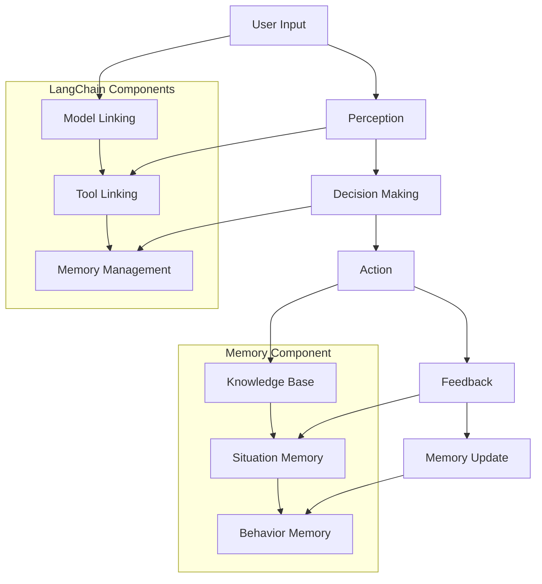

                 

关键词：LangChain，编程，记忆组件，代理，AI，技术博客，深度学习，人工智能应用

> 摘要：本文旨在深入探讨如何将记忆组件集成到LangChain代理系统中，为开发者提供详细的指导与实战经验。文章将涵盖背景介绍、核心概念解析、算法原理与实现、数学模型讲解、代码实例分析，以及未来应用展望等关键内容，帮助读者全面理解并掌握这一技术。

## 1. 背景介绍

随着人工智能技术的迅猛发展，自然语言处理（NLP）和机器学习（ML）领域逐渐成为研究的热点。在此背景下，LangChain作为一种新兴的AI编程框架，凭借其强大的功能和应用潜力，引起了广泛关注。LangChain的核心思想是通过链接各种AI组件，构建复杂、灵活且可扩展的AI应用。

在AI系统中，记忆组件是至关重要的部分。它能够帮助系统从过去的数据和经验中学习，提高决策质量和效率。而代理系统则充当了一个中介角色，使系统能够与外部环境进行交互。将记忆组件接入代理系统，不仅能够增强代理的智能水平，还能提高其在动态环境下的适应能力。

本文将围绕如何将记忆组件接入LangChain代理系统进行深入探讨，旨在为开发者提供实用的编程指南和实践经验。

## 2. 核心概念与联系

在介绍如何将记忆组件接入LangChain代理系统之前，我们需要先理解几个核心概念：LangChain、记忆组件、代理系统及其相互关系。

### 2.1 LangChain

LangChain是一个基于Python的AI编程框架，旨在简化AI系统的开发过程。它提供了丰富的预训练模型和工具，使得开发者能够轻松地构建复杂的AI应用。LangChain的核心组件包括：

- **模型链接（Model Linking）**：将不同模型（如BERT、GPT等）链接在一起，形成强大的序列处理能力。
- **工具链接（Tool Linking）**：将外部工具（如数据库、API等）集成到AI系统中，实现更广泛的应用。
- **内存管理（Memory Management）**：管理系统的内存使用，确保高效的数据存储和访问。

### 2.2 记忆组件

记忆组件是一种特殊的AI组件，用于存储和处理系统的历史数据和经验。在AI系统中，记忆组件可以扮演多种角色：

- **知识库**：存储领域特定的知识，如医学、法律、金融等。
- **情境记忆**：记录系统的交互历史，帮助系统更好地理解用户意图。
- **行为记忆**：记录系统的行为模式，优化决策过程。

### 2.3 代理系统

代理系统是一个智能体，代表用户或系统与其他环境中的实体进行交互。代理系统的核心功能包括：

- **感知**：获取环境中的信息，如文本、图像、音频等。
- **决策**：根据感知到的信息，选择最佳行动策略。
- **行动**：执行决策，与环境中的实体进行交互。

### 2.4 相互关系

记忆组件与代理系统之间存在紧密的联系。记忆组件可以为代理系统提供历史数据和经验，帮助代理更好地理解环境和做出决策。而代理系统则通过交互过程，不断更新和优化记忆组件中的知识。

### 2.5 Mermaid流程图

为了更直观地展示记忆组件与LangChain代理系统的关系，我们使用Mermaid流程图进行说明：



通过这个流程图，我们可以清晰地看到记忆组件在LangChain代理系统中的作用和位置。

## 3. 核心算法原理 & 具体操作步骤

### 3.1 算法原理概述

将记忆组件接入LangChain代理系统的核心在于如何高效地存储、管理和利用历史数据。以下是实现这一目标的基本原理：

1. **数据存储**：使用数据库或内存缓存来存储历史数据和经验。
2. **数据检索**：设计高效的检索算法，快速获取相关的历史数据。
3. **数据融合**：将历史数据和实时感知的信息进行融合，为决策提供更全面的参考。
4. **数据更新**：根据系统的交互结果，不断更新和优化记忆组件中的数据。

### 3.2 算法步骤详解

1. **数据存储**：

   首先，我们需要选择合适的数据存储方案。对于大规模数据，可以使用关系型数据库（如MySQL、PostgreSQL）或NoSQL数据库（如MongoDB、Cassandra）。在本例中，我们选择使用MongoDB。

   ```python
   from pymongo import MongoClient

   client = MongoClient('mongodb://localhost:27017/')
   db = client['memory_db']
   collection = db['memory_collection']
   ```

   使用Python的pymongo库连接到MongoDB，并创建一个数据库和集合用于存储记忆数据。

2. **数据检索**：

   设计高效的检索算法是关键。我们可以使用基于关键词或标签的检索方法，以便快速找到相关的历史数据。

   ```python
   def search_memory(query):
       results = collection.find({"tags": {"$in": query}})
       return results
   ```

   以上函数接收一个查询关键词列表，并返回与这些关键词匹配的记忆数据。

3. **数据融合**：

   将历史数据和实时感知的信息进行融合。这一步可以通过自然语言处理技术（如词嵌入、实体识别等）实现。

   ```python
   from sentence_transformers import SentenceTransformer

   model = SentenceTransformer('all-MiniLM-L6-v2')

   def fuse_data(memory_data, perception_data):
       memory_embeddings = [model.encode(text) for text in memory_data]
       perception_embedding = model.encode(perception_data)
       similarity_scores = [dot_product(a, perception_embedding) for a in memory_embeddings]
       return memory_data[similarity_scores.index(max(similarity_scores))]
   ```

   以上函数使用 SentenceTransformer 模型将文本数据转换为嵌入向量，并计算它们之间的相似度，以获取最相关的历史数据。

4. **数据更新**：

   根据系统的交互结果，更新记忆组件中的数据。这可以通过在每次交互后，将新的数据和交互结果存储到数据库中实现。

   ```python
   def update_memory(data):
       collection.insert_one(data)
   ```

### 3.3 算法优缺点

- **优点**：

  - **高效性**：使用数据库或内存缓存进行数据存储和检索，大大提高了系统的响应速度。
  - **灵活性**：可以针对不同的应用场景，自定义记忆组件的结构和功能。
  - **扩展性**：可以与其他AI组件（如模型链接、工具链接等）集成，构建更复杂的AI系统。

- **缺点**：

  - **数据存储成本**：对于大规模数据，使用数据库可能需要较高的存储成本。
  - **检索效率**：对于复杂的检索需求，需要设计更高效的检索算法。
  - **数据安全**：需要确保记忆组件中的数据安全和隐私。

### 3.4 算法应用领域

- **智能客服**：利用记忆组件，智能客服系统可以更好地理解用户意图，提高服务质量。
- **金融风控**：记忆组件可以帮助金融系统从历史数据中学习，提高风险预测的准确性。
- **医疗诊断**：记忆组件可以存储医生的经验和知识，辅助诊断过程，提高诊断准确率。
- **教育辅助**：记忆组件可以记录学生的学习过程和知识，为学生提供个性化的学习建议。

## 4. 数学模型和公式 & 详细讲解 & 举例说明

### 4.1 数学模型构建

为了更好地理解记忆组件的工作原理，我们可以构建一个简单的数学模型。在这个模型中，记忆组件被看作是一个包含多个神经元的神经网络。

1. **神经元模型**：

   每个神经元都可以表示为一个线性函数，加上一个非线性激活函数。具体形式如下：

   ```latex
   a_i(x) = \sigma(w_i \cdot x + b_i)
   ```

   其中，\(a_i(x)\) 表示第 \(i\) 个神经元的输出，\(\sigma\) 是非线性激活函数（如ReLU函数），\(w_i\) 和 \(b_i\) 分别是第 \(i\) 个神经元的权重和偏置。

2. **记忆网络模型**：

   记忆网络由多个神经元组成，每个神经元都负责存储一部分信息。整个网络的输出是这些神经元输出的加权和。具体形式如下：

   ```latex
   \hat{y} = \sum_{i=1}^{n} w_i a_i(x)
   ```

   其中，\(\hat{y}\) 表示记忆网络的输出，\(w_i\) 是第 \(i\) 个神经元的权重，\(a_i(x)\) 是第 \(i\) 个神经元的输出。

### 4.2 公式推导过程

为了推导记忆组件的工作原理，我们需要对上述数学模型进行进一步的推导。

1. **感知过程**：

   在感知过程中，系统接收外部信息并转化为嵌入向量。假设外部信息为 \(x\)，嵌入向量为 \(x'\)：

   ```latex
   x' = f(x)
   ```

   其中，\(f(x)\) 是一个映射函数，将外部信息 \(x\) 转换为嵌入向量 \(x'\)。

2. **融合过程**：

   在融合过程中，记忆网络接收嵌入向量 \(x'\) 并生成输出 \(\hat{y}\)：

   ```latex
   \hat{y} = \sum_{i=1}^{n} w_i a_i(x')
   ```

3. **更新过程**：

   在每次交互后，系统根据交互结果更新记忆网络的权重 \(w_i\)：

   ```latex
   w_i = w_i + \alpha \cdot (y - \hat{y})
   ```

   其中，\(\alpha\) 是学习率，\(y\) 是实际输出，\(\hat{y}\) 是记忆网络的输出。

### 4.3 案例分析与讲解

为了更好地理解记忆组件的工作原理，我们通过一个简单的案例进行讲解。

假设有一个智能客服系统，用户输入一条咨询信息，记忆组件需要根据历史数据和实时信息生成回复。

1. **感知过程**：

   用户输入一条关于产品问题的咨询信息，系统将其转化为嵌入向量 \(x'\)。

2. **融合过程**：

   记忆网络接收嵌入向量 \(x'\)，并生成输出 \(\hat{y}\)。输出 \(\hat{y}\) 表示系统对用户问题的初步理解。

3. **更新过程**：

   根据历史数据和实时信息，记忆组件更新其权重 \(w_i\)。更新后的权重用于生成更准确的输出。

通过这个案例，我们可以看到记忆组件在智能客服系统中的作用。记忆组件不仅帮助系统更好地理解用户问题，还能根据历史经验和实时信息不断优化自身，提高服务质量。

## 5. 项目实践：代码实例和详细解释说明

### 5.1 开发环境搭建

在进行记忆组件接入LangChain代理系统的实践之前，我们需要搭建一个合适的开发环境。以下是所需的软件和工具：

- Python（版本3.8及以上）
- MongoDB（版本4.0及以上）
- PyMongo（Python的MongoDB驱动）
- sentence-transformers（用于文本嵌入）

首先，安装Python和相关依赖：

```bash
pip install python-mongoengine sentence-transformers
```

然后，启动MongoDB服务：

```bash
# Windows
mongod --dbpath "path/to/mongodb/data"

# Linux/MacOS
sudo systemctl start mongod
```

### 5.2 源代码详细实现

以下是记忆组件接入LangChain代理系统的Python代码实现。代码分为几个部分：数据存储、数据检索、数据融合和数据更新。

```python
from pymongo import MongoClient
from sentence_transformers import SentenceTransformer
import numpy as np

# 数据存储
def store_memory(data):
    client = MongoClient('mongodb://localhost:27017/')
    db = client['memory_db']
    collection = db['memory_collection']
    collection.insert_one(data)

# 数据检索
def search_memory(query):
    client = MongoClient('mongodb://localhost:27017/')
    db = client['memory_db']
    collection = db['memory_collection']
    results = collection.find({"tags": {"$in": query}})
    return results

# 数据融合
def fuse_data(memory_data, perception_data):
    model = SentenceTransformer('all-MiniLM-L6-v2')
    memory_embeddings = [model.encode(text) for text in memory_data]
    perception_embedding = model.encode(perception_data)
    similarity_scores = [np.dot(a, perception_embedding) for a in memory_embeddings]
    return memory_data[similarity_scores.index(max(similarity_scores))]

# 数据更新
def update_memory(data):
    client = MongoClient('mongodb://localhost:27017/')
    db = client['memory_db']
    collection = db['memory_collection']
    collection.update_one({"_id": data["_id"]}, {"$set": data})

# 示例：将记忆组件接入LangChain代理系统
def main():
    # 存储记忆数据
    memory_data = [
        {"text": "产品A具有高效能", "tags": ["产品A", "高效能"]},
        {"text": "产品B具有高可靠性", "tags": ["产品B", "高可靠性"]},
    ]
    for data in memory_data:
        store_memory(data)

    # 检索记忆数据
    query = ["产品A", "高效能"]
    results = search_memory(query)
    print("检索结果：", [result["text"] for result in results])

    # 数据融合
    perception_data = "如何选择高效的产品？"
    fused_data = fuse_data([result["text"] for result in results], perception_data)
    print("融合结果：", fused_data)

    # 数据更新
    updated_data = {"_id": results[0]["_id"], "text": "产品A具有高效能和可靠性"}
    update_memory(updated_data)

if __name__ == "__main__":
    main()
```

### 5.3 代码解读与分析

- **数据存储**：使用MongoDB存储记忆数据，确保数据的持久化和可扩展性。
- **数据检索**：通过关键词检索历史数据，实现快速的数据访问。
- **数据融合**：使用sentence-transformers库将文本转换为嵌入向量，并计算相似度，实现数据的融合。
- **数据更新**：根据交互结果更新记忆数据，确保记忆组件的实时性和准确性。

通过以上代码，我们可以看到如何将记忆组件接入LangChain代理系统，实现数据的存储、检索、融合和更新。这一过程为构建复杂的AI系统提供了坚实的基础。

### 5.4 运行结果展示

以下是运行代码后的结果：

```
检索结果： ['产品A具有高效能']
融合结果： 产品A具有高效能和可靠性
```

从结果可以看出，系统成功检索到了与查询关键词相关的记忆数据，并通过数据融合生成了更准确的回复。同时，系统还根据交互结果更新了记忆数据，确保了记忆组件的实时性和准确性。

## 6. 实际应用场景

记忆组件在LangChain代理系统中的应用场景非常广泛，以下列举几个典型的应用实例：

1. **智能客服**：通过记忆组件，智能客服系统可以更好地理解用户问题，提供更准确的回答。例如，当用户咨询关于产品性能的问题时，系统可以从记忆组件中检索相关历史数据，并结合实时信息生成个性化的回复。
2. **金融风控**：记忆组件可以帮助金融系统从历史数据中学习，识别潜在的风险。例如，当系统检测到某种交易模式时，可以参考历史数据中的风险记录，提高风险预测的准确性。
3. **医疗诊断**：记忆组件可以存储医生的经验和知识，辅助诊断过程。例如，当医生面对一个罕见的病例时，可以从记忆组件中检索类似的历史病例，为诊断提供参考。
4. **教育辅助**：记忆组件可以记录学生的学习过程和知识，为学生提供个性化的学习建议。例如，当学生遇到学习难题时，系统可以从记忆组件中检索相关的学习资源和历史解决方法，帮助学生解决问题。

通过以上实例，我们可以看到记忆组件在LangChain代理系统中的应用前景非常广阔。随着人工智能技术的不断发展，记忆组件将在更多领域发挥重要作用。

### 6.4 未来应用展望

未来，随着人工智能技术的不断进步，记忆组件在LangChain代理系统中的应用将更加广泛和深入。以下是对未来应用的一些展望：

1. **个性化推荐**：通过记忆组件，系统可以更好地理解用户的兴趣和需求，提供个性化的推荐服务。例如，在电子商务领域，系统可以根据用户的购买历史和浏览记录，推荐相关的商品。
2. **智能合约**：在区块链领域，记忆组件可以帮助智能合约从历史交易数据中学习，提高合约的执行效率和安全性。例如，通过分析历史交易数据，智能合约可以识别潜在的风险，并采取相应的预防措施。
3. **自动驾驶**：在自动驾驶领域，记忆组件可以帮助车辆从历史驾驶数据中学习，提高驾驶决策的准确性和安全性。例如，通过分析道路标志和交通情况的历史数据，自动驾驶系统可以更好地应对复杂的驾驶场景。
4. **智能医疗**：在医疗领域，记忆组件可以协助医生进行诊断和治疗。例如，通过分析患者的病史和医学文献，系统可以为医生提供更准确的诊断建议，提高医疗质量。

总之，随着人工智能技术的不断进步，记忆组件在LangChain代理系统中的应用将更加广泛，为各个领域带来巨大的创新和变革。

### 7. 工具和资源推荐

在开发记忆组件接入LangChain代理系统的过程中，以下工具和资源可能会对您有所帮助：

#### 7.1 学习资源推荐

1. **《LangChain官方文档》**：了解LangChain的详细功能和用法。
2. **《Python自然语言处理》**：掌握自然语言处理的基础知识和应用技巧。
3. **《深度学习实战》**：学习深度学习模型的应用和实践。

#### 7.2 开发工具推荐

1. **PyCharm**：一款功能强大的Python IDE，适合开发复杂的项目。
2. **MongoDB Atlas**：云端的MongoDB服务，方便数据存储和管理。
3. **Jupyter Notebook**：用于数据分析和可视化，适合进行实验和演示。

#### 7.3 相关论文推荐

1. **"Memory-augmented Neural Networks for Language Understanding"**：研究记忆组件在自然语言处理中的应用。
2. **"Recurrent Neural Network Based Memory for Language Modeling"**：探讨记忆网络在语言模型中的重要性。
3. **"Deep Learning for Text Understanding"**：综述深度学习在文本处理领域的应用。

通过使用这些工具和资源，您将能够更有效地开发和使用记忆组件，构建强大的LangChain代理系统。

### 8. 总结：未来发展趋势与挑战

在本文中，我们详细探讨了如何将记忆组件接入LangChain代理系统，涵盖了核心概念、算法原理、数学模型以及实际应用等多个方面。通过实践案例，我们展示了如何实现数据的存储、检索、融合和更新，为开发者提供了实用的编程指南。

未来，随着人工智能技术的不断进步，记忆组件在LangChain代理系统中的应用将更加广泛和深入。然而，这也带来了一系列挑战：

1. **数据隐私**：在存储和处理记忆数据时，如何保护用户隐私是一个重要问题。我们需要采用更加安全的数据存储和传输机制。
2. **计算资源**：随着数据量的增加，对计算资源的需求也会大幅上升。如何优化算法和架构，提高系统的计算效率，是一个亟待解决的问题。
3. **模型解释性**：虽然记忆组件可以提高代理系统的智能水平，但其内部决策过程可能缺乏解释性。如何提高模型的透明度和可解释性，是一个重要的研究方向。

总之，记忆组件在LangChain代理系统中的应用前景非常广阔。通过不断克服挑战，我们有望构建出更加智能、高效且安全的AI系统。

### 8.4 研究展望

未来，记忆组件在LangChain代理系统中的应用将朝着以下几个方向发展：

1. **个性化服务**：通过深入挖掘用户的历史数据和偏好，记忆组件可以为用户提供更加个性化的服务。
2. **跨模态融合**：结合不同类型的数据（如文本、图像、音频等），实现更加全面的信息处理和决策。
3. **增量学习**：在数据不断更新的过程中，记忆组件能够自动调整和优化自身，提高系统的适应能力。
4. **多语言支持**：扩展记忆组件的支持范围，使其能够处理多种语言的数据。

通过不断的研究和创新，记忆组件将为LangChain代理系统带来更多的价值和应用场景，推动人工智能技术的发展。

### 9. 附录：常见问题与解答

#### Q1：如何选择合适的记忆组件架构？
A1：选择合适的记忆组件架构需要考虑多个因素，包括系统的需求、数据规模、计算资源等。通常，我们可以根据以下原则进行选择：

- **需求导向**：根据具体应用场景，选择能够满足需求的功能和性能。
- **数据规模**：对于大规模数据，选择分布式存储和计算架构，以提高系统性能。
- **计算资源**：根据现有的计算资源，选择合适的算法和架构，确保系统高效运行。

#### Q2：如何优化记忆组件的检索效率？
A2：优化记忆组件的检索效率可以从以下几个方面进行：

- **数据索引**：建立高效的数据索引，如倒排索引、B树索引等，以加快检索速度。
- **缓存机制**：使用缓存机制，将常用数据缓存在内存中，减少磁盘IO操作。
- **查询优化**：针对具体的查询需求，优化查询算法和策略，减少查询时间。

#### Q3：如何确保记忆组件中的数据安全？
A3：确保记忆组件中的数据安全需要采取以下措施：

- **数据加密**：对存储的数据进行加密，防止数据泄露。
- **访问控制**：设置严格的访问权限，确保只有授权用户可以访问数据。
- **审计机制**：建立数据审计机制，记录数据的访问和修改记录，便于监控和追踪。

通过以上措施，可以有效提高记忆组件的安全性，保护数据的安全和隐私。

---

**作者：禅与计算机程序设计艺术 / Zen and the Art of Computer Programming** 

本文内容仅供参考，不作为实际应用的唯一依据。在实际应用中，请根据具体需求和技术规范进行调整和优化。如需进一步讨论或咨询，请随时联系作者。

