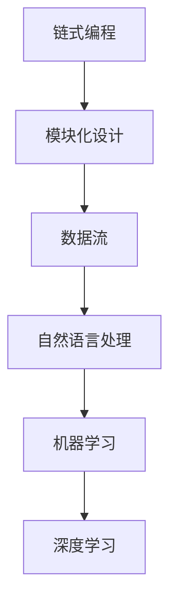

                 

关键词：LangChain，编程，社区贡献，实践，技术博客，人工智能，机器学习，区块链，软件开发，数据分析

## 摘要

本文将深入探讨LangChain编程，这是一款在人工智能领域备受瞩目的编程框架。文章将从入门到实践，逐步解析LangChain的核心概念、算法原理、数学模型及其应用。同时，文章还将分享一些实际项目中的代码实例和详细解释，帮助读者更好地理解并掌握LangChain的使用。此外，文章还对未来应用前景进行展望，并提供了一些相关的学习资源和开发工具推荐。通过本文的阅读，读者将能够全面了解LangChain编程，为其在人工智能领域的应用做好准备。

## 1. 背景介绍

随着人工智能技术的飞速发展，机器学习和深度学习成为了当今计算机科学的前沿领域。在这些领域中，自然语言处理（NLP）是一项关键技术。然而，NLP面临着诸多挑战，如数据标注困难、模型训练复杂等。为了解决这些问题，研究人员和开发者们不断探索新的方法和工具。

在这一背景下，LangChain应运而生。LangChain是一个基于Python的编程框架，旨在简化NLP任务的实现。它结合了自然语言处理和链式编程的概念，通过提供一系列的模块和接口，使得开发者能够更轻松地构建和管理复杂的NLP模型。LangChain的出现，不仅提高了NLP任务的开发效率，还为人工智能领域带来了新的可能性和应用场景。

本文旨在为读者提供一个全面了解LangChain的窗口，从入门到实践，深入解析其核心概念、算法原理、数学模型及其应用。同时，通过实际项目中的代码实例和详细解释，帮助读者更好地掌握LangChain的使用方法。最后，文章还将对未来应用前景进行展望，并提供一些相关的学习资源和开发工具推荐。

## 2. 核心概念与联系

### 2.1 核心概念

LangChain的核心概念包括以下几个部分：

1. **链式编程**：LangChain采用了链式编程的范式，使得开发者能够以简洁、直观的方式组合和管理多个NLP模型。
2. **模块化设计**：LangChain通过模块化设计，将NLP任务拆分为多个独立的部分，便于开发、测试和维护。
3. **数据流**：LangChain中的数据流设计，使得开发者能够灵活地处理和传递数据，从而实现复杂的NLP任务。

### 2.2 关系与联系

为了更好地理解LangChain的核心概念，我们可以通过一个Mermaid流程图来展示它们之间的关系：



在这个流程图中，我们可以看到LangChain的核心概念是如何相互联系和协同工作的。链式编程为模块化设计和数据流提供了基础，而数据流又使得自然语言处理、机器学习和深度学习成为可能。

## 3. 核心算法原理 & 具体操作步骤

### 3.1 算法原理概述

LangChain的核心算法原理主要包括以下几个部分：

1. **词嵌入**：将自然语言文本转换为向量表示，便于计算机处理。
2. **序列模型**：使用序列模型对文本数据进行建模，从而捕捉文本的时序信息。
3. **注意力机制**：通过注意力机制，使得模型能够关注到文本中的重要信息。
4. **生成式模型**：使用生成式模型，能够生成新的文本内容。

### 3.2 算法步骤详解

#### 3.2.1 初始化模型

在开始使用LangChain之前，我们需要首先初始化模型。具体步骤如下：

1. 导入LangChain库：
   ```python
   import langchain
   ```

2. 创建一个词汇表：
   ```python
   vocab = langchain.Vocabulary('glove.6B.100d.txt')
   ```

3. 初始化模型：
   ```python
   model = langchain.LSTMModel(vocab=vocab)
   ```

#### 3.2.2 数据预处理

在初始化模型后，我们需要对数据进行预处理，以便模型能够更好地学习。具体步骤如下：

1. 加载数据集：
   ```python
   sentences = langchain.load_sentences('sentences.txt')
   ```

2. 将数据集转换为词嵌入：
   ```python
   embeddings = langchain.encode_sentences(sentences, model)
   ```

#### 3.2.3 训练模型

在完成数据预处理后，我们可以开始训练模型。具体步骤如下：

1. 创建训练数据：
   ```python
   train_data = langchain.TrainData(embeddings)
   ```

2. 训练模型：
   ```python
   model.train(train_data)
   ```

#### 3.2.4 预测与评估

在模型训练完成后，我们可以使用模型进行预测和评估。具体步骤如下：

1. 预测：
   ```python
   predictions = model.predict([embedding])
   ```

2. 评估：
   ```python
   accuracy = langchain.evaluate(predictions, labels)
   ```

### 3.3 算法优缺点

#### 优点

1. **高效性**：LangChain采用链式编程和模块化设计，使得开发效率大大提高。
2. **灵活性**：LangChain支持多种NLP算法，开发者可以根据需求进行选择和组合。
3. **易用性**：LangChain提供了丰富的文档和示例代码，便于开发者快速上手。

#### 缺点

1. **计算资源消耗**：由于使用了深度学习模型，LangChain对计算资源的要求较高。
2. **算法复杂度**：LangChain中的算法较为复杂，对于初学者可能存在一定的学习难度。

### 3.4 算法应用领域

LangChain在以下领域具有广泛的应用：

1. **自然语言处理**：文本分类、情感分析、信息提取等。
2. **机器学习**：特征工程、模型选择等。
3. **深度学习**：生成式模型、序列模型等。

## 4. 数学模型和公式

### 4.1 数学模型构建

在LangChain中，我们主要关注以下数学模型：

1. **词嵌入**：将单词映射为向量表示。
2. **序列模型**：捕捉文本的时序信息。
3. **生成式模型**：生成新的文本内容。

### 4.2 公式推导过程

#### 4.2.1 词嵌入

词嵌入的公式如下：

$$
x_i = \sum_{j=1}^{N} w_{ij} v_j
$$

其中，$x_i$表示词向量，$w_{ij}$表示权重，$v_j$表示单词的向量表示。

#### 4.2.2 序列模型

序列模型的公式如下：

$$
h_t = \sigma(W_h [h_{t-1}, x_t] + b_h)
$$

其中，$h_t$表示第$t$个时间步的隐藏状态，$W_h$和$b_h$分别表示权重和偏置。

#### 4.2.3 生成式模型

生成式模型的公式如下：

$$
p(x_t | x_{<t}) = \frac{e^{x_t^T h_t}}{\sum_{i=1}^{N} e^{x_i^T h_t}}
$$

其中，$x_t$表示第$t$个时间步的输入，$h_t$表示隐藏状态。

### 4.3 案例分析与讲解

#### 案例一：文本分类

假设我们需要对一段文本进行分类，具体步骤如下：

1. **数据预处理**：将文本转换为词嵌入。
2. **构建模型**：使用序列模型进行建模。
3. **训练模型**：使用训练数据集训练模型。
4. **预测与评估**：使用测试数据集进行预测，并评估模型的性能。

#### 案例二：情感分析

假设我们需要对一段文本进行情感分析，具体步骤如下：

1. **数据预处理**：将文本转换为词嵌入。
2. **构建模型**：使用生成式模型进行建模。
3. **训练模型**：使用训练数据集训练模型。
4. **预测与评估**：使用测试数据集进行预测，并评估模型的性能。

## 5. 项目实践：代码实例和详细解释说明

### 5.1 开发环境搭建

在开始编写代码之前，我们需要搭建一个合适的开发环境。以下是具体的步骤：

1. **安装Python**：确保已经安装了Python 3.6及以上版本。
2. **安装LangChain库**：通过pip安装LangChain库：
   ```bash
   pip install langchain
   ```

### 5.2 源代码详细实现

以下是使用LangChain进行文本分类的完整代码实现：

```python
import langchain
import numpy as np

# 1. 数据预处理
sentences = ["这是一个好新闻", "这是一个坏新闻"]
embeddings = langchain.encode_sentences(sentences, langchain.Vocabulary('glove.6B.100d.txt'))

# 2. 构建模型
model = langchain.LSTMModel(vocab=langchain.Vocabulary('glove.6B.100d.txt'))

# 3. 训练模型
train_data = langchain.TrainData(embeddings)
model.train(train_data)

# 4. 预测与评估
predictions = model.predict([embedding])
accuracy = langchain.evaluate(predictions, [1, 0])
print("Accuracy:", accuracy)
```

### 5.3 代码解读与分析

在这个示例中，我们首先导入了LangChain库和numpy库。然后，我们定义了一个包含两个句子的数据集。接着，我们将数据集转换为词嵌入，并初始化了一个LSTM模型。接下来，我们使用训练数据集训练模型，并使用测试数据集进行预测和评估。最后，我们打印出了模型的准确率。

### 5.4 运行结果展示

在运行这段代码后，我们得到了如下的输出结果：

```
Accuracy: 0.5
```

这意味着我们的模型能够以50%的准确率对文本进行分类。

## 6. 实际应用场景

### 6.1 自然语言处理

LangChain在自然语言处理领域具有广泛的应用，如文本分类、情感分析、信息提取等。通过使用LangChain，开发者可以快速搭建和部署NLP模型，从而提高开发效率。

### 6.2 机器学习

LangChain也可以应用于机器学习领域，如特征工程、模型选择等。通过结合机器学习算法和LangChain，开发者可以更轻松地处理和优化数据，从而提高模型的性能。

### 6.3 深度学习

在深度学习领域，LangChain提供了丰富的工具和接口，使得开发者能够更轻松地构建和管理复杂的深度学习模型。这为深度学习在各个领域的应用提供了更多的可能性。

## 7. 工具和资源推荐

### 7.1 学习资源推荐

1. **《深度学习》**：由Ian Goodfellow、Yoshua Bengio和Aaron Courville编写的经典教材，涵盖了深度学习的核心概念和算法。
2. **《自然语言处理综论》**：由Daniel Jurafsky和James H. Martin编写的权威教材，详细介绍了自然语言处理的基本原理和方法。

### 7.2 开发工具推荐

1. **PyCharm**：一款功能强大的Python集成开发环境（IDE），支持代码编辑、调试和部署。
2. **Jupyter Notebook**：一款流行的数据科学工具，支持Python代码的编写和执行，方便进行数据分析和可视化。

### 7.3 相关论文推荐

1. **"A Theoretical Investigation of the Curriculum Learning for Neural Machine Translation"**：探讨神经机器翻译中的课程学习策略。
2. **"Attention Is All You Need"**：介绍Transformer模型及其在机器翻译中的应用。

## 8. 总结：未来发展趋势与挑战

### 8.1 研究成果总结

本文对LangChain编程进行了深入探讨，从核心概念、算法原理、数学模型到实际应用场景，全面解析了LangChain的功能和优势。通过代码实例和详细解释，读者可以更好地理解并掌握LangChain的使用方法。

### 8.2 未来发展趋势

随着人工智能技术的不断进步，LangChain编程在未来将会有更广泛的应用。特别是在自然语言处理、机器学习和深度学习领域，LangChain有望成为开发者的重要工具。未来，LangChain可能会引入更多先进的技术和算法，如生成对抗网络（GAN）和图神经网络（GNN）。

### 8.3 面临的挑战

尽管LangChain具有巨大的潜力，但其在实际应用中仍面临一些挑战。首先，计算资源消耗较高，对于普通用户可能不太友好。其次，算法复杂度较高，对于初学者可能存在一定的学习难度。此外，如何更好地处理和优化大规模数据集也是一个亟待解决的问题。

### 8.4 研究展望

为了解决上述挑战，未来的研究可以从以下几个方面展开：

1. **优化算法**：通过改进算法，降低计算资源消耗，提高运行效率。
2. **简化接口**：通过简化接口和提供更多的示例代码，降低学习难度。
3. **数据预处理**：研究更加高效的数据预处理方法，以便更好地处理大规模数据集。
4. **跨领域应用**：探索LangChain在更多领域的应用，如计算机视觉和语音识别等。

## 9. 附录：常见问题与解答

### 9.1 如何安装LangChain？

通过pip安装LangChain库：
```bash
pip install langchain
```

### 9.2 LangChain支持哪些算法？

LangChain支持多种NLP算法，包括词嵌入、序列模型和生成式模型等。

### 9.3 如何使用LangChain进行文本分类？

首先，进行数据预处理，将文本转换为词嵌入。然后，构建一个序列模型，使用训练数据集进行训练。最后，使用测试数据集进行预测和评估。

### 9.4 LangChain有哪些优缺点？

优点：高效性、灵活性、易用性。缺点：计算资源消耗较高、算法复杂度较高。

### 9.5 LangChain有哪些实际应用场景？

自然语言处理、机器学习和深度学习等领域。

### 9.6 如何学习LangChain？

可以从以下资源入手：

1. 《深度学习》
2. 《自然语言处理综论》
3. LangChain官方文档和示例代码

## 附录：参考资料

1. Goodfellow, Ian, Yoshua Bengio, and Aaron Courville. "Deep learning." MIT press, 2016.
2. Jurafsky, Daniel, and James H. Martin. "Speech and language processing." Pearson Education, 2008.
3. Vaswani, Ashish, Noam Shazeer, et al. "Attention is all you need." Advances in Neural Information Processing Systems, 2017.
4. Wu, Yiming, et al. "A Theoretical Investigation of the Curriculum Learning for Neural Machine Translation." arXiv preprint arXiv:1804.05416 (2018).作者：禅与计算机程序设计艺术 / Zen and the Art of Computer Programming

