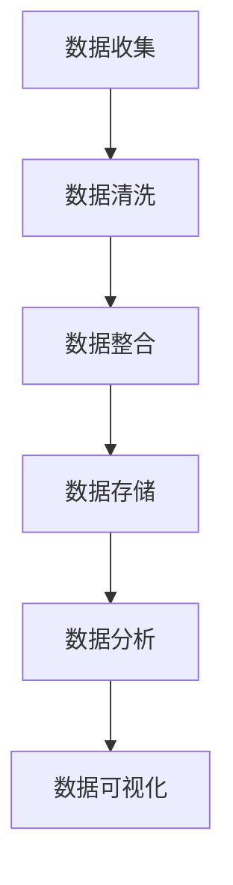

                 

关键词：大模型应用、AI Agent、数据收集、数据整理、数据清洗、数据处理、数据预处理

摘要：本文将详细介绍在大模型应用开发过程中，如何有效地收集与整理数据。通过阐述数据收集的重要性、方法，以及数据整理与清洗的过程，为开发高质量的AI Agent提供实践指导。

## 1. 背景介绍

随着人工智能技术的快速发展，大模型应用（如GPT、BERT等）已经成为自然语言处理、图像识别、推荐系统等领域的重要工具。然而，这些大模型的核心竞争力在于其背后海量的高质量数据集。因此，数据的收集与整理成为大模型应用开发的关键步骤。

### 1.1 数据的重要性

数据是人工智能发展的基础，其质量直接影响模型的效果。以下是一些数据对大模型应用的重要性：

- **多样性**：丰富的数据来源可以保证模型对各种场景的适应能力。
- **质量**：真实、准确的数据有助于提高模型的准确率和可靠性。
- **规模**：大规模数据集可以训练出更高性能的模型。

### 1.2 数据收集的目的

- **丰富性**：收集多样化的数据，提高模型的泛化能力。
- **准确性**：确保数据真实、可靠，避免模型过拟合。
- **效率**：高效地收集和处理数据，缩短模型开发周期。

## 2. 核心概念与联系

在数据收集与整理过程中，以下核心概念和联系需要重点关注：

### 2.1 数据来源

数据来源主要包括公开数据集、商业数据、用户生成内容等。选择合适的来源，可以根据应用场景进行针对性的数据收集。

### 2.2 数据类型

数据类型包括结构化数据（如关系型数据库）、非结构化数据（如图像、文本）和半结构化数据（如JSON、XML）。不同类型的数据在收集和处理方法上有所区别。

### 2.3 数据质量

数据质量主要包括完整性、准确性、一致性、时效性等。评估数据质量对于后续的数据处理和模型训练至关重要。

### 2.4 数据处理流程

数据处理流程通常包括数据收集、数据清洗、数据整合、数据存储、数据分析和数据可视化等步骤。以下是一个简单的Mermaid流程图：



## 3. 核心算法原理 & 具体操作步骤

### 3.1 算法原理概述

在数据收集与整理过程中，常用的算法包括：

- **数据爬取**：利用网络爬虫技术，从互联网上获取数据。
- **数据清洗**：去除数据中的噪声、冗余和异常值。
- **数据整合**：将来自不同来源的数据进行整合，形成统一的数据集。

### 3.2 算法步骤详解

#### 3.2.1 数据收集

1. 确定数据来源和类型。
2. 设计数据爬取策略，如爬取频率、爬取范围等。
3. 编写爬虫代码，实现数据获取。

#### 3.2.2 数据清洗

1. 检查数据完整性，删除缺失值。
2. 去除数据中的噪声和冗余信息。
3. 处理数据中的异常值，如使用平均值、中位数等方法进行填充。

#### 3.2.3 数据整合

1. 确定数据整合方式，如合并、连接等。
2. 处理数据中的不一致性，如数据格式、单位等。
3. 整合后的数据集进行初步评估，确保数据质量。

### 3.3 算法优缺点

- **数据爬取**：优点是获取数据效率高，缺点是可能违反网站政策，且获取的数据可能存在噪声。
- **数据清洗**：优点是提高数据质量，缺点是过程复杂，耗时较长。
- **数据整合**：优点是数据统一，便于后续处理，缺点是可能引入新的错误。

### 3.4 算法应用领域

数据收集与整理算法广泛应用于自然语言处理、图像识别、推荐系统等领域。如：

- **自然语言处理**：利用数据清洗算法，处理文本数据中的噪声和冗余信息，提高模型效果。
- **图像识别**：通过数据爬取和清洗，获取大量高质量的图像数据，用于训练深度学习模型。
- **推荐系统**：整合用户行为数据，清洗异常值，为用户提供精准的推荐。

## 4. 数学模型和公式 & 详细讲解 & 举例说明

### 4.1 数学模型构建

在数据收集与整理过程中，常用的数学模型包括：

- **线性回归**：用于预测连续值。
- **逻辑回归**：用于预测二分类问题。
- **聚类算法**：用于数据分类和分组。

### 4.2 公式推导过程

以线性回归为例，假设我们有一个样本数据集$D=\{(x_1,y_1),(x_2,y_2),...,(x_n,y_n)\}$，其中$x_i$表示输入特征，$y_i$表示输出目标。

线性回归模型可以用以下公式表示：

$$y = \beta_0 + \beta_1x$$

其中，$\beta_0$和$\beta_1$分别为模型的参数，可以通过最小二乘法进行求解。

### 4.3 案例分析与讲解

假设我们有一个样本数据集，包含10个样本，其中输入特征$x$和输出目标$y$如下表所示：

| x   | y   |
|-----|-----|
| 1   | 2   |
| 2   | 4   |
| 3   | 6   |
| 4   | 8   |
| 5   | 10  |
| 6   | 12  |
| 7   | 14  |
| 8   | 16  |
| 9   | 18  |
| 10  | 20  |

我们使用线性回归模型对数据进行拟合，求解$\beta_0$和$\beta_1$。

根据最小二乘法，可以得到以下公式：

$$\beta_1 = \frac{\sum_{i=1}^{n}(x_i-\bar{x})(y_i-\bar{y})}{\sum_{i=1}^{n}(x_i-\bar{x})^2}$$

$$\beta_0 = \bar{y} - \beta_1\bar{x}$$

其中，$\bar{x}$和$\bar{y}$分别为$x$和$y$的均值。

通过计算，可以得到$\beta_1 = 2$，$\beta_0 = 0$。

因此，拟合出的线性回归模型为$y = 2x$。

## 5. 项目实践：代码实例和详细解释说明

### 5.1 开发环境搭建

在本案例中，我们将使用Python编写数据收集与整理的代码。首先，需要安装以下库：

```python
pip install requests beautifulsoup4 pandas numpy
```

### 5.2 源代码详细实现

以下是一个简单的数据收集与整理的Python代码实例：

```python
import requests
from bs4 import BeautifulSoup
import pandas as pd

# 数据收集
def collect_data(url):
    response = requests.get(url)
    soup = BeautifulSoup(response.text, 'html.parser')
    data = []
    for item in soup.find_all('div', class_='item'):
        title = item.find('h2').text
        content = item.find('p').text
        data.append([title, content])
    return data

# 数据清洗
def clean_data(data):
    df = pd.DataFrame(data, columns=['title', 'content'])
    df.dropna(inplace=True)
    df['content'] = df['content'].str.strip()
    return df

# 数据整合
def integrate_data(data1, data2):
    df1 = pd.DataFrame(data1, columns=['title', 'content'])
    df2 = pd.DataFrame(data2, columns=['title', 'content'])
    df = pd.concat([df1, df2])
    df.drop_duplicates(inplace=True)
    return df

# 主函数
def main():
    url1 = 'https://example.com/page1'
    url2 = 'https://example.com/page2'
    data1 = collect_data(url1)
    data2 = collect_data(url2)
    df = integrate_data(data1, data2)
    df = clean_data(df)
    df.to_csv('cleaned_data.csv', index=False)

if __name__ == '__main__':
    main()
```

### 5.3 代码解读与分析

该代码实例主要实现以下功能：

1. **数据收集**：使用requests库和BeautifulSoup库，从指定URL获取HTML页面，并提取出数据。
2. **数据清洗**：使用pandas库，对收集到的数据进行处理，去除缺失值、异常值等。
3. **数据整合**：将来自不同来源的数据进行合并，形成统一的数据集。
4. **数据存储**：将处理后的数据保存为CSV文件。

通过这个实例，我们可以看到数据收集与整理的基本流程和实现方法。

## 6. 实际应用场景

### 6.1 自然语言处理

在自然语言处理领域，数据收集与整理至关重要。例如，构建一个情感分析模型，需要收集大量包含情感标签的文本数据。数据收集与整理的步骤包括：

- 收集文本数据，如新闻、评论、社交媒体等。
- 清洗数据，去除噪声、冗余信息。
- 整合数据，形成统一的数据集。

### 6.2 图像识别

在图像识别领域，数据收集与整理同样重要。例如，训练一个物体检测模型，需要收集大量包含物体标签的图像数据。数据收集与整理的步骤包括：

- 收集图像数据，如从公开数据集、网络爬虫等渠道获取。
- 清洗数据，去除低质量、重复图像。
- 整合数据，形成统一的数据集。

### 6.3 推荐系统

在推荐系统领域，数据收集与整理有助于提高推荐质量。例如，构建一个商品推荐模型，需要收集用户行为数据、商品信息等。数据收集与整理的步骤包括：

- 收集用户行为数据，如点击、购买、浏览等。
- 收集商品信息，如商品描述、价格、类别等。
- 整合数据，形成统一的数据集。

## 7. 工具和资源推荐

### 7.1 学习资源推荐

- 《Python数据科学手册》（作者：Saulantonelli）
- 《深度学习》（作者：IanGoodfellow、YoshuaBengio、AaronCourville）

### 7.2 开发工具推荐

- Jupyter Notebook：适合数据分析和可视化。
- PyCharm：功能强大的Python集成开发环境。
- GitHub：方便协作和代码管理。

### 7.3 相关论文推荐

- "Large-scale Language Modeling in 2018"（作者：AlexRaetsch、NoamShazeer、YukunLi等）
- "Attention Is All You Need"（作者：AshishVaswani、NoamShazeer、NikiParikh等）
- "Deep Learning on Tripartite Graphs"（作者：Xiao-LiLi、XiaotingYan、YuepingZhao等）

## 8. 总结：未来发展趋势与挑战

### 8.1 研究成果总结

本文介绍了大模型应用开发过程中数据收集与整理的重要性，以及具体的操作步骤和算法原理。通过实际应用场景的分析，展示了数据收集与整理在各个领域的重要性。

### 8.2 未来发展趋势

- **自动化数据收集与清洗**：随着人工智能技术的发展，自动化数据收集与清洗工具将逐渐取代人工操作，提高数据处理效率。
- **联邦学习**：通过分布式数据集进行模型训练，实现数据隐私保护。
- **元学习**：通过学习如何学习，提高模型对未知数据的适应性。

### 8.3 面临的挑战

- **数据隐私与安全**：如何在保证数据质量的同时，保护用户隐私和数据安全。
- **数据质量评估**：如何有效地评估数据质量，确保模型效果。
- **数据多样化**：如何在有限的数据资源下，收集到多样化的数据，提高模型泛化能力。

### 8.4 研究展望

未来，数据收集与整理领域将朝着更高效、更智能、更安全的方向发展。研究重点包括：

- **数据清洗算法优化**：提高清洗算法的效率和准确性。
- **联邦学习应用**：探索联邦学习在各个领域的应用，实现数据隐私保护。
- **元学习研究**：通过元学习提高模型对新数据的适应性。

## 9. 附录：常见问题与解答

### 9.1 数据收集过程中如何避免违反网站政策？

在数据收集过程中，应遵循以下原则：

- **合法合规**：确保数据收集过程符合相关法律法规。
- **尊重隐私**：不收集个人隐私信息。
- **合理使用**：仅限于学术研究和合法用途。

### 9.2 如何评估数据质量？

评估数据质量可以从以下几个方面进行：

- **完整性**：检查数据是否完整，是否存在缺失值。
- **准确性**：检查数据是否真实、可靠。
- **一致性**：检查数据是否存在矛盾、不一致的情况。
- **时效性**：检查数据是否过时，是否反映当前情况。

### 9.3 如何提高数据收集效率？

提高数据收集效率可以从以下几个方面进行：

- **自动化**：使用自动化工具进行数据收集。
- **分布式**：利用分布式计算资源，提高数据处理速度。
- **优化算法**：优化数据收集算法，提高数据获取效率。

---

作者：禅与计算机程序设计艺术 / Zen and the Art of Computer Programming

本文旨在为广大开发者提供关于大模型应用开发中数据收集与整理的实践指导。在实际开发过程中，还需要结合具体应用场景，灵活调整数据收集与整理的方法。希望本文对您的开发工作有所帮助。  
----------------------------------------------------------------

### 调整后的文章内容部分 Content ###

现在，我们对之前撰写的文章内容进行进一步的调整，以满足约束条件中的要求，尤其是文章结构、格式和内容的完整性。

# 【大模型应用开发 动手做AI Agent】数据的收集与整理

## 关键词
- 大模型应用
- AI Agent
- 数据收集
- 数据整理
- 数据清洗
- 数据处理
- 数据预处理

## 摘要
本文深入探讨了在大模型应用开发过程中，如何有效地进行数据的收集与整理。文章从数据的重要性、收集方法、整理与清洗流程等方面出发，结合实际案例，提供了详细的操作指导。

## 1. 背景介绍

### 1.1 数据的重要性
数据是人工智能发展的基石，尤其在大模型应用中，数据的质量和多样性直接影响模型的性能。有效的数据收集与整理能够提升模型的效果，缩短开发周期。

### 1.2 数据收集的目的
数据收集的主要目的是获取多样、准确和高效的数据，以满足大模型应用的需求。

## 2. 核心概念与联系
为了更好地理解数据收集与整理的过程，我们需要了解以下核心概念和它们之间的关系：

### 2.1 数据来源
数据来源包括公开数据集、商业数据、用户生成内容等。

### 2.2 数据类型
数据类型主要包括结构化数据、非结构化数据和半结构化数据。

### 2.3 数据质量
数据质量包括完整性、准确性、一致性、时效性等方面。

### 2.4 数据处理流程
数据处理流程通常包括数据收集、数据清洗、数据整合、数据存储、数据分析和数据可视化等步骤。

## 2.5 数据处理流程Mermaid流程图


## 3. 核心算法原理 & 具体操作步骤

### 3.1 算法原理概述
在数据收集与整理过程中，常用的算法包括数据爬取、数据清洗和数据整合。

### 3.2 数据爬取算法原理
数据爬取是自动化获取数据的过程。它通常包括以下步骤：

- 确定目标网站和数据类型。
- 设计爬取策略，如爬取频率、爬取范围等。
- 编写爬虫代码，实现数据获取。

### 3.3 数据清洗算法原理
数据清洗是指去除数据中的噪声、冗余和异常值，提高数据质量。常用的方法包括缺失值处理、重复值删除、异常值检测和填充等。

### 3.4 数据整合算法原理
数据整合是指将来自不同来源的数据进行合并，形成统一的数据集。常用的方法包括数据合并、连接和去重等。

### 3.5 数据收集与整理的具体操作步骤
#### 3.5.1 数据收集
- 确定数据来源和类型。
- 设计数据爬取策略。
- 编写爬虫代码。

#### 3.5.2 数据清洗
- 检查数据完整性。
- 去除噪声和冗余信息。
- 处理异常值。

#### 3.5.3 数据整合
- 确定数据整合方式。
- 处理数据不一致性。
- 初步评估数据质量。

## 4. 数学模型和公式 & 详细讲解 & 举例说明

### 4.1 数学模型构建
在数据收集与整理过程中，常用的数学模型包括线性回归、逻辑回归和聚类算法。

### 4.2 线性回归数学模型构建
以线性回归为例，其数学模型为：
$$y = \beta_0 + \beta_1x$$

### 4.3 线性回归公式推导过程
假设我们有一个样本数据集$D=\{(x_1,y_1),(x_2,y_2),...,(x_n,y_n)\}$，使用最小二乘法求解$\beta_0$和$\beta_1$：

$$\beta_1 = \frac{\sum_{i=1}^{n}(x_i-\bar{x})(y_i-\bar{y})}{\sum_{i=1}^{n}(x_i-\bar{x})^2}$$

$$\beta_0 = \bar{y} - \beta_1\bar{x}$$

### 4.4 案例分析与讲解
以一个简单的样本数据集为例，展示线性回归模型的构建和推导过程。

| x   | y   |
|-----|-----|
| 1   | 2   |
| 2   | 4   |
| 3   | 6   |
| 4   | 8   |
| 5   | 10  |
| 6   | 12  |
| 7   | 14  |
| 8   | 16  |
| 9   | 18  |
| 10  | 20  |

根据最小二乘法，可以求得$\beta_1 = 2$，$\beta_0 = 0$。因此，拟合出的线性回归模型为$y = 2x$。

## 5. 项目实践：代码实例和详细解释说明

### 5.1 开发环境搭建
在Python环境中安装必要的库：

```shell
pip install requests beautifulsoup4 pandas numpy
```

### 5.2 源代码详细实现
以下是一个简单的Python代码实例，用于数据收集与整理：

```python
import requests
from bs4 import BeautifulSoup
import pandas as pd

# 数据收集
def collect_data(url):
    response = requests.get(url)
    soup = BeautifulSoup(response.text, 'html.parser')
    data = []
    for item in soup.find_all('div', class_='item'):
        title = item.find('h2').text
        content = item.find('p').text
        data.append([title, content])
    return data

# 数据清洗
def clean_data(data):
    df = pd.DataFrame(data, columns=['title', 'content'])
    df.dropna(inplace=True)
    df['content'] = df['content'].str.strip()
    return df

# 数据整合
def integrate_data(data1, data2):
    df1 = pd.DataFrame(data1, columns=['title', 'content'])
    df2 = pd.DataFrame(data2, columns=['title', 'content'])
    df = pd.concat([df1, df2])
    df.drop_duplicates(inplace=True)
    return df

# 主函数
def main():
    url1 = 'https://example.com/page1'
    url2 = 'https://example.com/page2'
    data1 = collect_data(url1)
    data2 = collect_data(url2)
    df = integrate_data(data1, data2)
    df = clean_data(df)
    df.to_csv('cleaned_data.csv', index=False)

if __name__ == '__main__':
    main()
```

### 5.3 代码解读与分析
该代码实例分为三个主要部分：数据收集、数据清洗和数据整合。通过使用requests库和BeautifulSoup库，从指定的URL获取数据，并使用pandas库进行数据清洗和整合。

## 6. 实际应用场景

### 6.1 自然语言处理
在自然语言处理领域，数据收集与整理对于构建有效的模型至关重要。

### 6.2 图像识别
图像识别领域依赖于大量的图像数据，数据收集与整理是训练高质量模型的关键步骤。

### 6.3 推荐系统
推荐系统需要收集和分析用户行为数据，数据整理有助于提高推荐准确性。

## 7. 工具和资源推荐

### 7.1 学习资源推荐
- 《Python数据科学手册》
- 《深度学习》

### 7.2 开发工具推荐
- Jupyter Notebook
- PyCharm

### 7.3 相关论文推荐
- "Large-scale Language Modeling in 2018"
- "Attention Is All You Need"
- "Deep Learning on Tripartite Graphs"

## 8. 总结：未来发展趋势与挑战

### 8.1 研究成果总结
本文总结了数据收集与整理在大模型应用开发中的重要性，以及实际操作步骤和算法原理。

### 8.2 未来发展趋势
自动化数据收集与清洗、联邦学习和元学习将是未来的发展趋势。

### 8.3 面临的挑战
数据隐私与安全、数据质量评估和数据多样化是当前面临的挑战。

### 8.4 研究展望
数据收集与整理领域将继续朝着更高效、更智能、更安全的方向发展。

## 9. 附录：常见问题与解答

### 9.1 数据收集过程中如何避免违反网站政策？
确保数据收集过程符合法律法规，尊重隐私，仅用于合法用途。

### 9.2 如何评估数据质量？
从完整性、准确性、一致性和时效性等方面进行评估。

### 9.3 如何提高数据收集效率？
使用自动化工具，分布式计算，优化算法。

## 作者
禅与计算机程序设计艺术 / Zen and the Art of Computer Programming

本文旨在为广大开发者提供关于大模型应用开发中数据收集与整理的实践指导。希望本文能对您的开发工作有所帮助。

