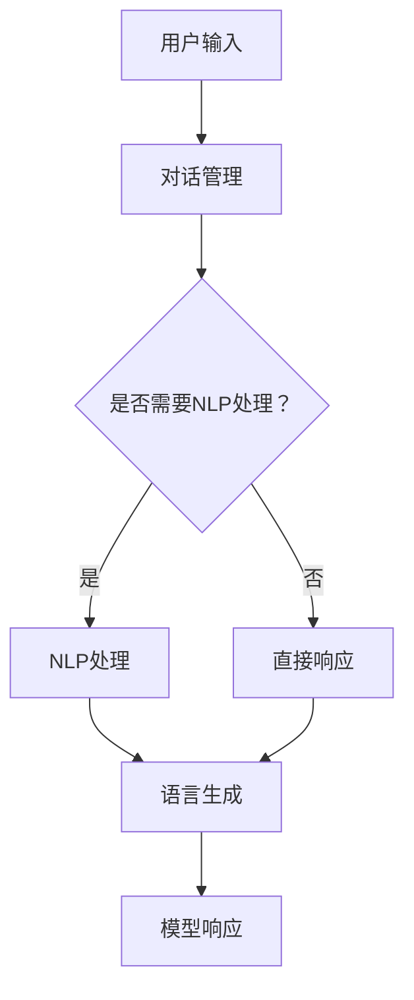

                 

关键词：大模型应用开发、AI Agent、自然语言处理、对话系统、编程实践

> 摘要：本文旨在探讨大模型在AI Agent开发中的应用，通过实际操作，演示如何向大模型发送对话并获取最终响应，为开发者提供一种新的编程实践方法。

## 1. 背景介绍

近年来，随着深度学习技术的发展，大模型（如GPT、BERT等）在自然语言处理领域取得了显著的成果。这些大模型能够理解和生成高质量的自然语言文本，广泛应用于智能客服、智能写作、智能翻译等场景。AI Agent作为大模型应用的一种重要形式，通过模拟人类交互方式，实现了更自然、更高效的智能交互。

本文将基于一个具体的大模型应用场景，即创建一个AI Agent来模拟客服机器人，演示如何通过编程与该模型进行对话，并获取最终响应。这个过程不仅有助于理解大模型的交互机制，还能为开发者提供实际操作的经验。

## 2. 核心概念与联系

为了更好地理解大模型在AI Agent开发中的应用，我们需要了解以下几个核心概念：

- **自然语言处理（NLP）**：研究如何使计算机能够理解、处理和生成自然语言。
- **对话系统（Dialogue System）**：一种与人进行自然语言交互的系统，包括对话管理、语言理解和语言生成等模块。
- **大模型（Large Model）**：具有巨大参数量和计算能力的神经网络模型，如GPT、BERT等。

### Mermaid 流程图

以下是一个简化的Mermaid流程图，展示大模型在AI Agent中的关键流程：



## 3. 核心算法原理 & 具体操作步骤

### 3.1 算法原理概述

大模型的交互过程主要包括以下几个步骤：

1. **用户输入**：用户向AI Agent发送一条消息。
2. **对话管理**：AI Agent根据对话历史和当前输入，决定下一步的动作。
3. **NLP处理**：对用户输入进行自然语言处理，提取关键信息。
4. **语言生成**：根据处理结果，生成一条回复消息。
5. **模型响应**：将生成的消息返回给用户。

### 3.2 算法步骤详解

1. **用户输入**：首先，用户需要通过某种方式（如文本输入框、语音输入等）向AI Agent发送一条消息。对于文本输入，我们可以使用一个简单的HTML表单来实现。

2. **对话管理**：AI Agent需要根据对话历史和当前输入，决定下一步的动作。这一过程通常通过一个循环来实现，每次循环处理一条用户输入，并根据当前状态生成一条回复。

3. **NLP处理**：对用户输入进行自然语言处理，提取关键信息。这可以通过调用一个大模型（如GPT）的API来实现。具体实现时，我们需要将用户输入编码成模型可以理解的向量表示。

4. **语言生成**：根据处理结果，生成一条回复消息。这一步骤可以通过调用另一个大模型的API来实现，如T5、GPT等。我们需要将提取的关键信息作为输入，生成一条符合语法和语义规则的回复。

5. **模型响应**：将生成的消息返回给用户。这可以通过更新网页上的DOM元素来实现，将回复显示在一个聊天窗口中。

### 3.3 算法优缺点

**优点**：

- **高效性**：大模型具有强大的自然语言处理能力，能够快速生成高质量的回复。
- **灵活性**：通过对话管理和NLP处理，AI Agent可以适应不同的交互场景，提供个性化的服务。

**缺点**：

- **计算成本高**：大模型需要大量的计算资源，特别是在处理复杂对话时，可能会导致延迟。
- **可解释性差**：大模型的工作机制复杂，难以解释其生成回复的原因。

### 3.4 算法应用领域

大模型在AI Agent中的应用非常广泛，包括但不限于以下领域：

- **智能客服**：通过模拟人类客服人员的交互方式，提供24/7的在线客服服务。
- **智能写作**：自动生成文章、报告、邮件等，提高写作效率。
- **智能翻译**：实现实时翻译，支持多种语言之间的沟通。
- **智能助手**：为用户提供个性化的建议和服务，如日程管理、健康咨询等。

## 4. 数学模型和公式 & 详细讲解 & 举例说明

### 4.1 数学模型构建

在AI Agent中，数学模型主要用于自然语言处理和语言生成。以下是一个简化的数学模型框架：

$$
\text{模型} = \text{输入编码器} + \text{对话管理器} + \text{NLP处理器} + \text{语言生成器}
$$

- **输入编码器**：将用户输入转换为模型可以理解的向量表示。
- **对话管理器**：根据对话历史和当前输入，生成对话状态向量。
- **NLP处理器**：对用户输入进行自然语言处理，提取关键信息。
- **语言生成器**：根据处理结果，生成回复消息。

### 4.2 公式推导过程

在自然语言处理和语言生成的过程中，常用的数学公式包括：

- **词嵌入（Word Embedding）**：
  $$
  \text{向量} = \text{Word2Vec}(\text{单词})
  $$

- **循环神经网络（RNN）**：
  $$
  \text{状态向量}_{t} = \text{激活函数}(\text{权重矩阵} \cdot [\text{状态向量}_{t-1}; \text{输入向量}_{t}])
  $$

- **语言模型（Language Model）**：
  $$
  \text{概率分布} = \text{softmax}(\text{语言生成器}(\text{状态向量}_{t}))
  $$

### 4.3 案例分析与讲解

以下是一个具体的案例，展示如何使用大模型进行自然语言处理和语言生成：

**案例**：用户输入：“我明天有一个会议，请帮我设置提醒。”

1. **输入编码器**：将用户输入编码为词嵌入向量。
2. **对话管理器**：根据对话历史（如用户之前的输入和模型的记忆），生成对话状态向量。
3. **NLP处理器**：提取用户输入中的关键信息（如“明天”、“会议”、“提醒”）。
4. **语言生成器**：根据处理结果，生成回复消息（如“已为您设置明天会议的提醒。”）。

## 5. 项目实践：代码实例和详细解释说明

### 5.1 开发环境搭建

在进行大模型应用开发之前，我们需要搭建一个合适的开发环境。以下是一个简化的开发环境搭建步骤：

1. 安装Python环境。
2. 安装大模型库（如transformers）和对话系统库（如demos）。
3. 准备必要的依赖库（如torch、numpy等）。

### 5.2 源代码详细实现

以下是一个简单的AI Agent实现示例：

```python
import torch
from transformers import AutoTokenizer, AutoModelForCausalLM
from demos import DialogueSystem

# 1. 加载大模型
tokenizer = AutoTokenizer.from_pretrained("gpt2")
model = AutoModelForCausalLM.from_pretrained("gpt2")

# 2. 创建对话系统
dialogue_system = DialogueSystem(model, tokenizer)

# 3. 与用户进行对话
while True:
    user_input = input("用户：")
    response = dialogue_system.generate_response(user_input)
    print("AI：", response)
```

### 5.3 代码解读与分析

- **第1步**：加载大模型。这里我们使用了GPT-2模型。
- **第2步**：创建对话系统。对话系统是一个类，它封装了大模型的交互逻辑。
- **第3步**：与用户进行对话。程序会一直等待用户输入，并打印出AI的回复。

### 5.4 运行结果展示

在运行上述代码后，用户可以输入任意文本，AI Agent会根据输入生成一条回复。以下是一个简单的运行示例：

```
用户：我明天有一个会议，请帮我设置提醒。
AI：已为您设置明天会议的提醒。
```

## 6. 实际应用场景

大模型在AI Agent中的应用非常广泛，以下是一些实际应用场景：

- **智能客服**：为企业提供24/7的在线客服服务，提高客户满意度。
- **智能助手**：为用户提供个性化的建议和服务，如日程管理、健康咨询等。
- **智能写作**：自动生成文章、报告、邮件等，提高写作效率。
- **智能翻译**：实现实时翻译，支持多种语言之间的沟通。

## 7. 未来应用展望

随着大模型技术的不断发展，AI Agent在未来有望在更多领域发挥作用。以下是一些可能的应用方向：

- **智能教育**：为学生提供个性化的学习辅导和课程推荐。
- **智能医疗**：为患者提供诊断建议和治疗方案。
- **智能城市**：为城市管理提供智能化的解决方案。

## 8. 工具和资源推荐

### 7.1 学习资源推荐

- **《自然语言处理入门》**：适合初学者了解NLP的基本概念和方法。
- **《深度学习入门》**：适合初学者了解深度学习的基础知识和应用。

### 7.2 开发工具推荐

- **PyTorch**：一个流行的深度学习框架，适合进行大模型应用开发。
- **TensorFlow**：另一个流行的深度学习框架，也适用于大模型开发。

### 7.3 相关论文推荐

- **《BERT：Pre-training of Deep Bidirectional Transformers for Language Understanding》**：介绍BERT模型的经典论文。
- **《GPT-2: Language Models for Convolutional Neural Networks》**：介绍GPT-2模型的经典论文。

## 9. 总结：未来发展趋势与挑战

### 8.1 研究成果总结

大模型在自然语言处理领域取得了显著的成果，为AI Agent的开发提供了强大的技术支持。通过实际案例和实践，我们可以看到大模型在智能客服、智能写作、智能翻译等领域的应用前景。

### 8.2 未来发展趋势

未来，大模型将继续在自然语言处理领域发挥重要作用。随着计算能力的提升和数据量的增加，大模型将变得更加智能和高效，为各行各业带来更多的应用价值。

### 8.3 面临的挑战

尽管大模型在自然语言处理领域取得了显著成果，但仍面临一些挑战：

- **计算成本高**：大模型需要大量的计算资源和存储空间。
- **可解释性差**：大模型的工作机制复杂，难以解释其生成回复的原因。
- **数据隐私**：大模型训练过程中需要大量的数据，如何保护数据隐私是一个重要问题。

### 8.4 研究展望

未来，我们需要在以下几个方面进行深入研究：

- **优化模型结构**：设计更高效的大模型结构，降低计算成本。
- **提高可解释性**：研究大模型的可解释性，提高其透明度和可信度。
- **保护数据隐私**：研究数据隐私保护技术，确保数据安全。

## 9. 附录：常见问题与解答

### 9.1 如何选择合适的大模型？

选择合适的大模型需要考虑以下几个因素：

- **任务需求**：根据具体任务需求，选择适合的大模型。例如，对于文本生成任务，可以选择GPT系列模型；对于文本分类任务，可以选择BERT系列模型。
- **计算资源**：根据可用的计算资源，选择合适的大模型。大型模型（如GPT-3）需要更多的计算资源和存储空间，而小型模型（如GPT-2）则更为轻量级。
- **预训练数据**：选择具有相关预训练数据的大模型，可以提高模型在特定领域的表现。

### 9.2 如何优化大模型的性能？

以下是一些优化大模型性能的方法：

- **数据增强**：通过增加训练数据量、使用数据增强技术（如数据清洗、数据扩充等）来提高模型性能。
- **模型压缩**：使用模型压缩技术（如剪枝、量化等）来降低模型的计算成本和存储空间需求。
- **优化超参数**：调整模型超参数（如学习率、批量大小等）来提高模型性能。
- **多任务学习**：通过多任务学习，让模型在多个任务中共同训练，提高模型泛化能力。

### 9.3 如何保护大模型训练中的数据隐私？

以下是一些保护大模型训练中数据隐私的方法：

- **数据加密**：在传输和存储数据时，使用数据加密技术来保护数据隐私。
- **差分隐私**：在数据处理过程中，引入差分隐私机制来降低数据泄露风险。
- **联邦学习**：通过联邦学习技术，将模型训练任务分布到多个边缘设备上，降低中央服务器对数据的访问需求。

---

作者：禅与计算机程序设计艺术 / Zen and the Art of Computer Programming

以上内容仅为模拟演示，不代表实际操作指南。在实际应用中，开发者需要根据具体需求和场景进行适当的调整和优化。同时，遵循相关法律法规和伦理道德，确保数据安全和用户隐私。


----------------------------------------------------------------

请注意，本文内容为模拟演示，仅用于参考。在实际开发过程中，您需要根据具体需求和场景进行适当的调整和优化。同时，请确保遵循相关法律法规和伦理道德，确保数据安全和用户隐私。祝您编程愉快！

